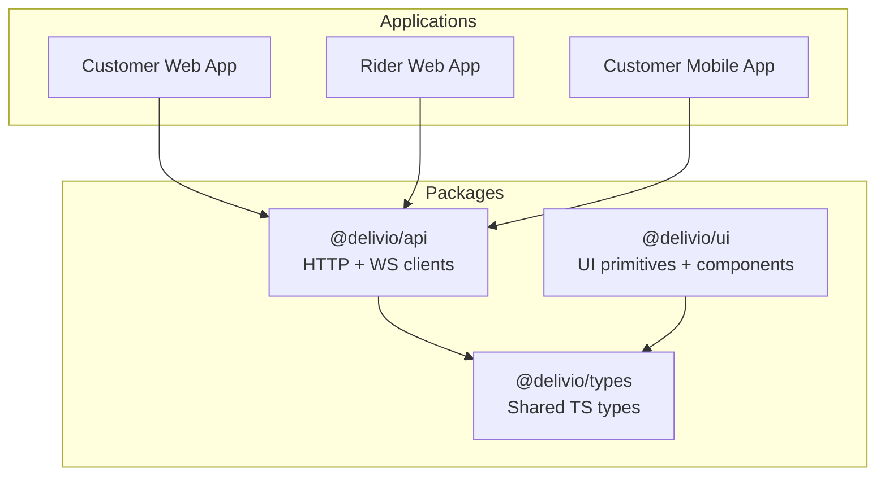
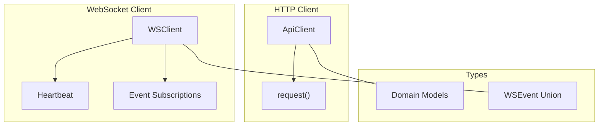
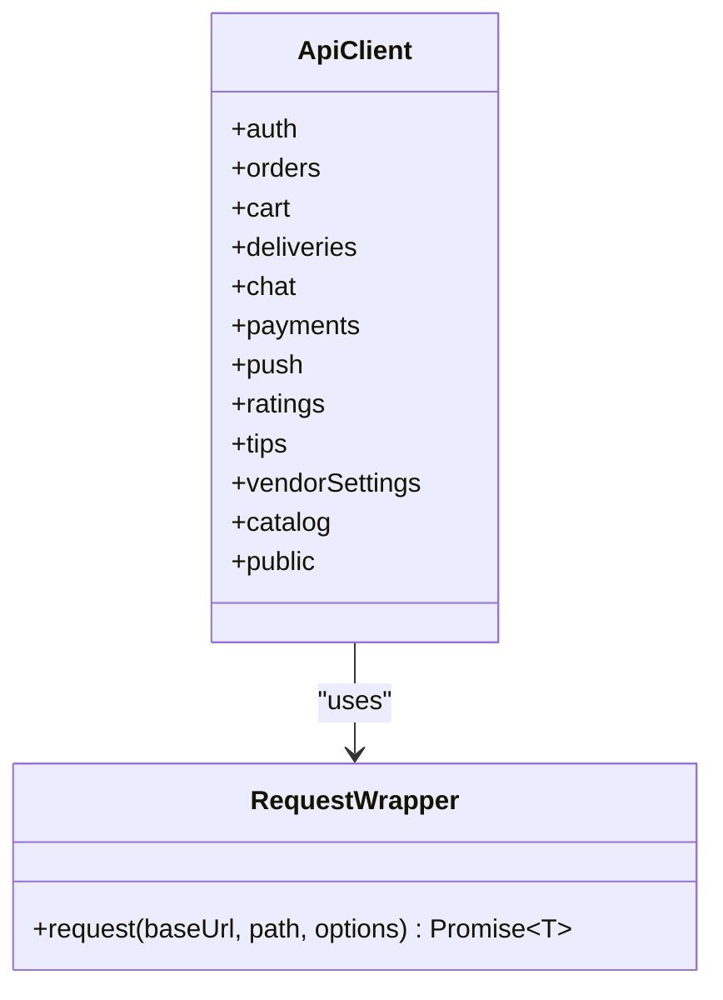
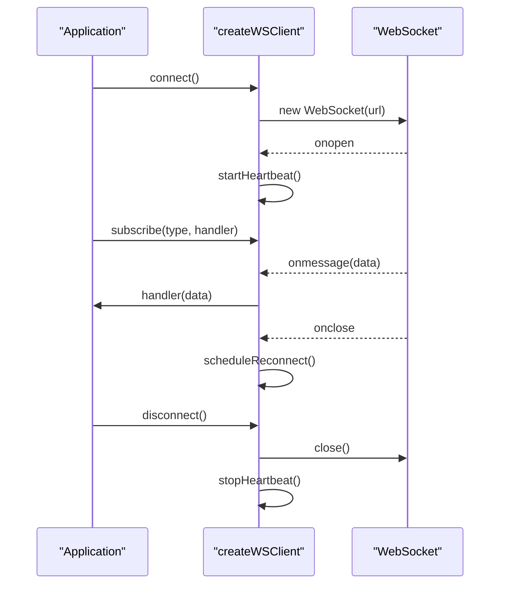
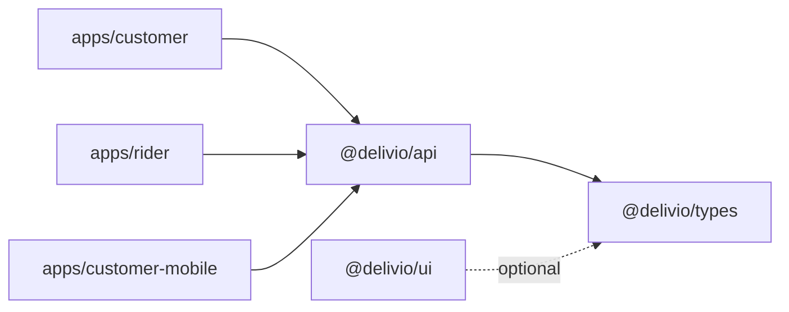

# API Client Libraries

<cite>
**Referenced Files in This Document**
- [packages/api/package.json](file://packages/api/package.json)
- [packages/api/src/index.ts](file://packages/api/src/index.ts)
- [packages/api/src/client.ts](file://packages/api/src/client.ts)
- [packages/api/src/ws.ts](file://packages/api/src/ws.ts)
- [packages/types/package.json](file://packages/types/package.json)
- [packages/types/src/index.ts](file://packages/types/src/index.ts)
- [packages/ui/package.json](file://packages/ui/package.json)
- [packages/ui/src/index.ts](file://packages/ui/src/index.ts)
- [apps/customer/src/lib/api.ts](file://apps/customer/src/lib/api.ts)
- [apps/rider/src/lib/api.ts](file://apps/rider/src/lib/api.ts)
- [apps/customer-mobile/src/lib/api.ts](file://apps/customer-mobile/src/lib/api.ts)
</cite>

## Table of Contents
1. [Introduction](#introduction)
2. [Project Structure](#project-structure)
3. [Core Components](#core-components)
4. [Architecture Overview](#architecture-overview)
5. [Detailed Component Analysis](#detailed-component-analysis)
6. [Dependency Analysis](#dependency-analysis)
7. [Performance Considerations](#performance-considerations)
8. [Troubleshooting Guide](#troubleshooting-guide)
9. [Conclusion](#conclusion)
10. [Appendices](#appendices)

## Introduction
This document describes the Delivio shared API client libraries and TypeScript definitions. It covers:
- The @delivio/api package: HTTP client and WebSocket client builders, configuration, and error handling patterns
- The @delivio/types package: shared TypeScript interfaces and type definitions for domain models and WebSocket events
- The @delivio/ui package: reusable UI primitives and components designed to integrate with a shared design system
- Cross-application usage patterns across Next.js web apps and React Native mobile apps
- Best practices for extending the API clients and integrating real-time features

## Project Structure
The monorepo is organized into three packages under packages/ and multiple applications under apps/. The API and Types packages are consumed by the applications, while the UI package provides shared components.

**Diagram sources**
- [packages/api/package.json:1-14](file://packages/api/package.json#L1-L14)
- [packages/types/package.json:1-11](file://packages/types/package.json#L1-L11)
- [packages/ui/package.json:1-22](file://packages/ui/package.json#L1-L22)
- [apps/customer/src/lib/api.ts:1-11](file://apps/customer/src/lib/api.ts#L1-L11)
- [apps/rider/src/lib/api.ts:1-11](file://apps/rider/src/lib/api.ts#L1-L11)
- [apps/customer-mobile/src/lib/api.ts:1-12](file://apps/customer-mobile/src/lib/api.ts#L1-L12)

**Section sources**
- [packages/api/package.json:1-14](file://packages/api/package.json#L1-L14)
- [packages/types/package.json:1-11](file://packages/types/package.json#L1-L11)
- [packages/ui/package.json:1-22](file://packages/ui/package.json#L1-L22)

## Core Components
- @delivio/api
  - Exports HTTP client factory and WebSocket client factory
  - Provides strongly typed API surface for authentication, orders, cart, deliveries, chat, payments, push notifications, ratings, tips, vendor settings, catalog, and public endpoints
  - Implements robust error handling via a unified request wrapper
- @delivio/types
  - Defines domain models (User, Customer, Order, Delivery, Product, etc.), enums, and response wrappers
  - Includes WebSocket event types and union type for real-time events
- @delivio/ui
  - Exposes UI primitives (Button, Card, Input, Badge, Skeleton, Separator, Avatar)
  - Provides higher-level components (OrderStatusBadge, EmptyState, LoadingScreen, PriceDisplay)
  - Offers utility functions (cn, formatPrice) and variant factories for consistent styling

**Section sources**
- [packages/api/src/index.ts:1-5](file://packages/api/src/index.ts#L1-L5)
- [packages/api/src/client.ts:44-206](file://packages/api/src/client.ts#L44-L206)
- [packages/api/src/ws.ts:6-15](file://packages/api/src/ws.ts#L6-L15)
- [packages/types/src/index.ts:1-363](file://packages/types/src/index.ts#L1-L363)
- [packages/ui/src/index.ts:1-25](file://packages/ui/src/index.ts#L1-L25)

## Architecture Overview
The client architecture separates concerns across three layers:
- HTTP Layer: createApiClient constructs typed methods for REST endpoints
- WebSocket Layer: createWSClient manages connection lifecycle, subscriptions, and heartbeats
- Type Layer: @delivio/types centralizes shared interfaces and event types

**Diagram sources**
- [packages/api/src/client.ts:22-42](file://packages/api/src/client.ts#L22-L42)
- [packages/api/src/client.ts:208-379](file://packages/api/src/client.ts#L208-L379)
- [packages/api/src/ws.ts:17-124](file://packages/api/src/ws.ts#L17-L124)
- [packages/types/src/index.ts:350-363](file://packages/types/src/index.ts#L350-L363)

## Detailed Component Analysis

### HTTP Client: createApiClient
The HTTP client encapsulates a generic request function and exposes domain-specific namespaces. It handles credentials, JSON serialization, and error propagation.

Key behaviors:
- Unified request wrapper validates response status and throws typed errors with statusCode and body
- Methods for each domain namespace (auth, orders, cart, deliveries, chat, payments, push, ratings, tips, vendorSettings, catalog, public)
- Query string construction for list endpoints
- Specialized handling for public.products to normalize varied server responses

**Diagram sources**
- [packages/api/src/client.ts:22-42](file://packages/api/src/client.ts#L22-L42)
- [packages/api/src/client.ts:208-379](file://packages/api/src/client.ts#L208-L379)

**Section sources**
- [packages/api/src/client.ts:22-42](file://packages/api/src/client.ts#L22-L42)
- [packages/api/src/client.ts:208-379](file://packages/api/src/client.ts#L208-L379)

### WebSocket Client: createWSClient
The WebSocket client manages connection state, automatic reconnection, and event subscriptions. It also implements a heartbeat mechanism to keep connections alive.

Key behaviors:
- Connect/disconnect lifecycle with reconnect backoff
- Event subscription registry keyed by event type
- Heartbeat ping every 25 seconds when connected
- Intentional close flag to avoid unnecessary reconnections
- Robust message parsing with defensive handling

**Diagram sources**
- [packages/api/src/ws.ts:17-124](file://packages/api/src/ws.ts#L17-L124)

**Section sources**
- [packages/api/src/ws.ts:17-124](file://packages/api/src/ws.ts#L17-L124)

### TypeScript Definitions: @delivio/types
The types package defines:
- Domain interfaces: User, Customer, Order, Delivery, Product, Category, Workspace, Rating, Tip, VendorSettings, etc.
- Enumerations: OrderStatus, PaymentStatus, DeliveryStatus, DeliveryMode, PushPlatform
- Response wrappers: ApiError, PaginatedResponse
- WebSocket event types: WSOrderStatusChanged, WSOrderRejected, WSOrderDelayed, WSDeliveryLocationUpdate, WSDeliveryRequest, WSDeliveryRiderArrived, WSChatMessage, WSChatRead, WSChatTyping, and a union WSEvent

These types are consumed by both the HTTP client and the WebSocket client to ensure type-safe integrations.

**Section sources**
- [packages/types/src/index.ts:1-363](file://packages/types/src/index.ts#L1-L363)

### UI Package: @delivio/ui
The UI package exports:
- Primitives: Button, Card, Input, Badge, Skeleton, Separator, Avatar
- Shared components: OrderStatusBadge, EmptyState, LoadingScreen, PriceDisplay
- Utilities: cn, formatPrice
- Variant factories for consistent styling across components

Integration guidance:
- Use cn for conditional class merging
- Use buttonVariants and badgeVariants for consistent variants
- Compose primitives to build higher-level components

**Section sources**
- [packages/ui/src/index.ts:1-25](file://packages/ui/src/index.ts#L1-L25)

## Dependency Analysis
The packages depend on each other as follows:
- @delivio/api depends on @delivio/types for type safety
- @delivio/ui optionally depends on @delivio/types for type-safe props
- Applications import @delivio/api and @delivio/ui as needed

**Diagram sources**
- [packages/api/package.json:10-12](file://packages/api/package.json#L10-L12)
- [packages/ui/package.json:10-16](file://packages/ui/package.json#L10-L16)
- [apps/customer/src/lib/api.ts:1](file://apps/customer/src/lib/api.ts#L1)
- [apps/rider/src/lib/api.ts:1](file://apps/rider/src/lib/api.ts#L1)
- [apps/customer-mobile/src/lib/api.ts:1](file://apps/customer-mobile/src/lib/api.ts#L1)

**Section sources**
- [packages/api/package.json:10-12](file://packages/api/package.json#L10-L12)
- [packages/ui/package.json:10-16](file://packages/ui/package.json#L10-L16)

## Performance Considerations
- HTTP client
  - Reuse a single ApiClient instance per application to avoid redundant initialization
  - Prefer paginated endpoints for large lists and apply appropriate limit/offset
  - Avoid excessive JSON parsing by leveraging the request wrapper’s built-in parsing
- WebSocket client
  - Subscribe only to necessary event types to minimize handler overhead
  - Use heartbeat to detect stale connections proactively
  - Implement exponential backoff to prevent thundering herds on reconnection
- UI components
  - Use variant factories to reduce conditional rendering complexity
  - Defer heavy computations in components and memoize where appropriate

## Troubleshooting Guide
Common issues and resolutions:
- Authentication failures
  - Verify OTP flow parameters and project reference
  - Ensure cookies are included via credentials: "include"
- Network errors
  - Inspect thrown errors for statusCode and body fields
  - Confirm API base URL matches deployment environment
- WebSocket disconnections
  - Check heartbeat intervals and reconnection attempts
  - Distinguish intentional vs unintentional closures
- Type mismatches
  - Align server response shapes with @delivio/types interfaces
  - Normalize public.products responses as implemented in the HTTP client

**Section sources**
- [packages/api/src/client.ts:33-39](file://packages/api/src/client.ts#L33-L39)
- [packages/api/src/ws.ts:73-81](file://packages/api/src/ws.ts#L73-L81)

## Conclusion
The @delivio API client libraries provide a cohesive, type-safe foundation for building applications across web and mobile platforms. By centralizing HTTP and WebSocket logic in @delivio/api and sharing domain models in @delivio/types, teams can maintain consistency and reliability. The @delivio/ui package complements this by offering reusable components that enforce a unified design system.

## Appendices

### Client Initialization and Configuration
- Base URL resolution
  - Applications resolve API_URL from environment variables with sensible defaults
  - Mobile apps derive WS_URL by replacing http with ws for real-time features
- Single client instances
  - Export a singleton api client per app to simplify provider wiring and caching

**Section sources**
- [apps/customer/src/lib/api.ts:3-10](file://apps/customer/src/lib/api.ts#L3-L10)
- [apps/rider/src/lib/api.ts:3-10](file://apps/rider/src/lib/api.ts#L3-L10)
- [apps/customer-mobile/src/lib/api.ts:3-11](file://apps/customer-mobile/src/lib/api.ts#L3-L11)

### Authentication Handling Patterns
- OTP-based customer authentication
  - Send OTP, verify OTP, and persist session
- Session retrieval
  - Use getSession/getAdminSession with error-tolerant fallbacks
- Logout
  - Clear local state and invalidate session server-side

**Section sources**
- [packages/api/src/client.ts:227-240](file://packages/api/src/client.ts#L227-L240)

### Request/Response Transformation
- Generic request wrapper
  - Enforces JSON content type and credentials inclusion
  - Throws structured errors with statusCode and body
- Public endpoint normalization
  - Normalize varied responses from public.products into a consistent array

**Section sources**
- [packages/api/src/client.ts:22-42](file://packages/api/src/client.ts#L22-L42)
- [packages/api/src/client.ts:351-370](file://packages/api/src/client.ts#L351-L370)

### WebSocket Real-Time Integration
- Connection lifecycle
  - Automatic reconnect with exponential backoff
  - Heartbeat ping to keep connections alive
- Event subscriptions
  - Strongly typed event handlers with unsubscribe support
- Usage in mobile apps
  - Initialize WS client alongside HTTP client and share authentication state

**Section sources**
- [packages/api/src/ws.ts:17-124](file://packages/api/src/ws.ts#L17-L124)
- [apps/customer-mobile/src/lib/api.ts:8-11](file://apps/customer-mobile/src/lib/api.ts#L8-L11)

### Cross-Application Usage Examples
- Customer web app
  - Import api from apps/customer/src/lib/api.ts
  - Use api.auth.getSession to hydrate user state
- Rider web app
  - Import api from apps/rider/src/lib/api.ts
  - Use api.deliveries.list and api.deliveries.claim
- Customer mobile app
  - Import both api and wsClient from apps/customer-mobile/src/lib/api.ts
  - Subscribe to delivery and chat events for real-time updates

**Section sources**
- [apps/customer/src/lib/api.ts:1-11](file://apps/customer/src/lib/api.ts#L1-L11)
- [apps/rider/src/lib/api.ts:1-11](file://apps/rider/src/lib/api.ts#L1-L11)
- [apps/customer-mobile/src/lib/api.ts:1-12](file://apps/customer-mobile/src/lib/api.ts#L1-L12)

### Best Practices for Extending the API Clients
- Keep the HTTP client pure and testable
  - Wrap fetch in a small, isolated function for easier mocking
- Add new endpoints incrementally
  - Define types in @delivio/types first, then implement in createApiClient
- Preserve backward compatibility
  - Avoid breaking changes to existing interfaces
- Centralize configuration
  - Resolve base URLs and feature flags in a single place per app
- Real-time hygiene
  - Always unsubscribe handlers on unmount
  - Reset reconnect counters on explicit disconnects