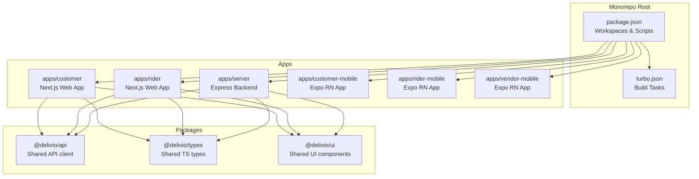
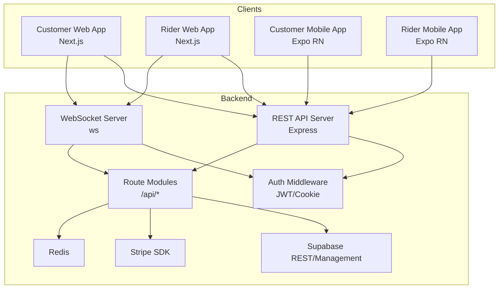
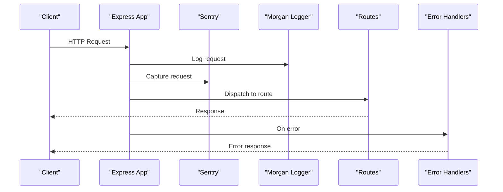
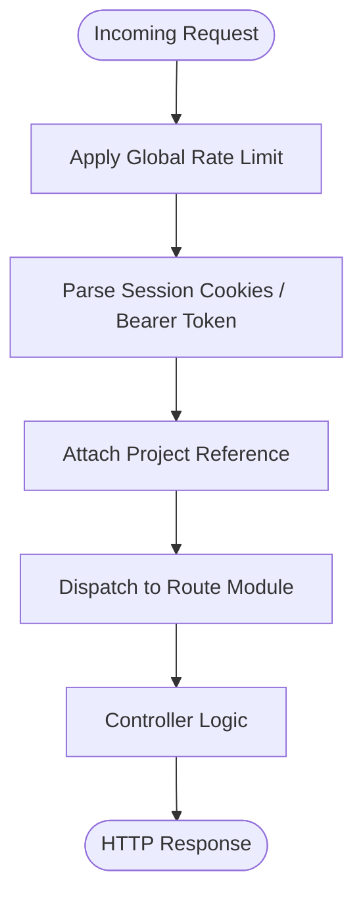
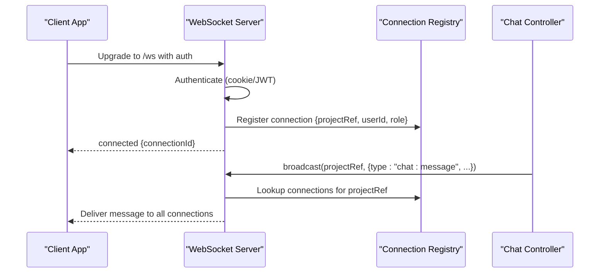
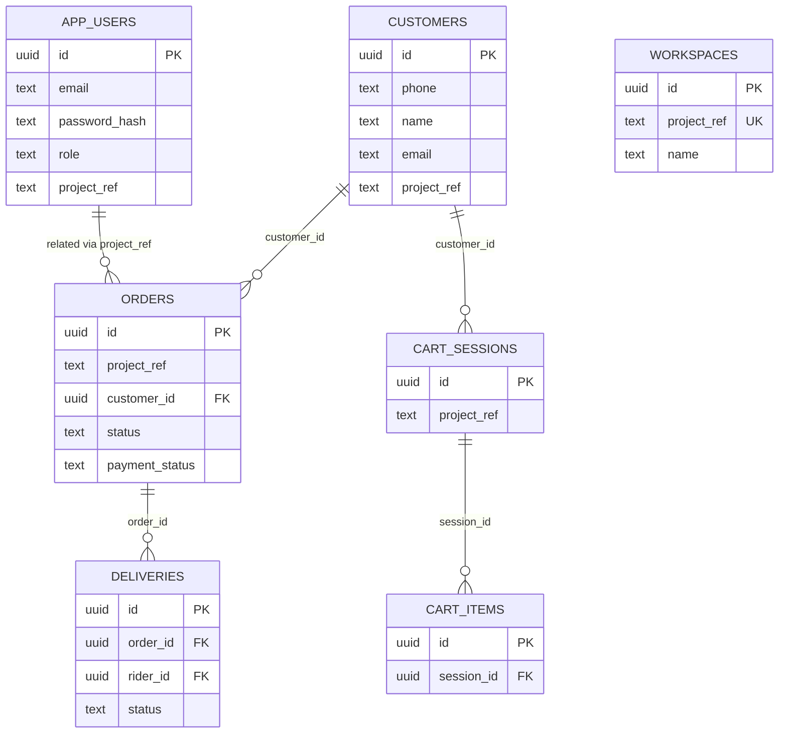
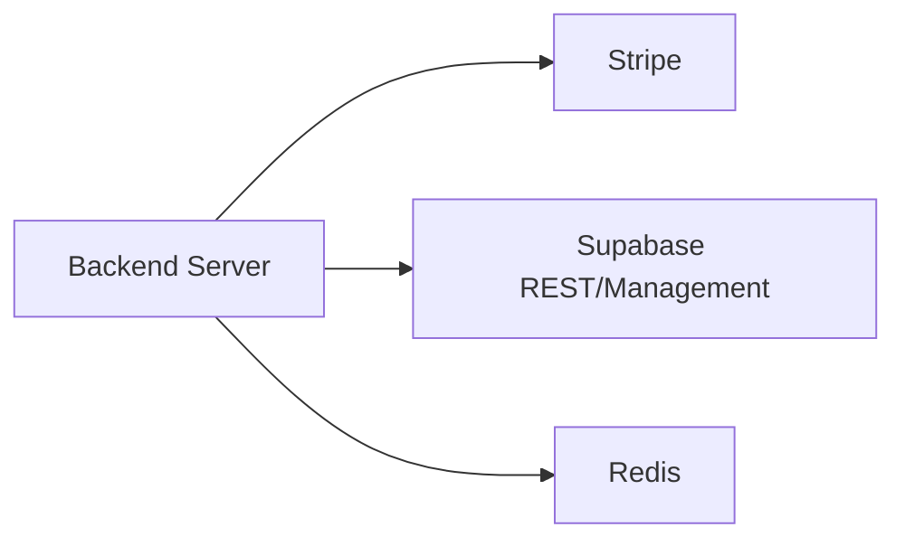
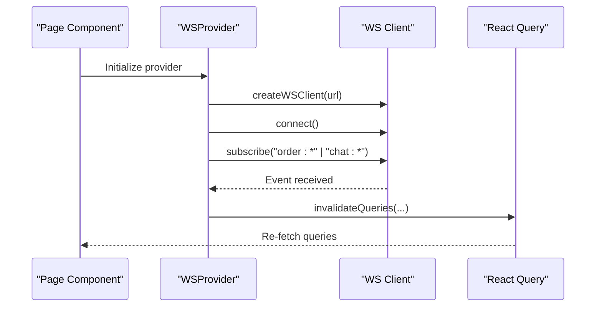
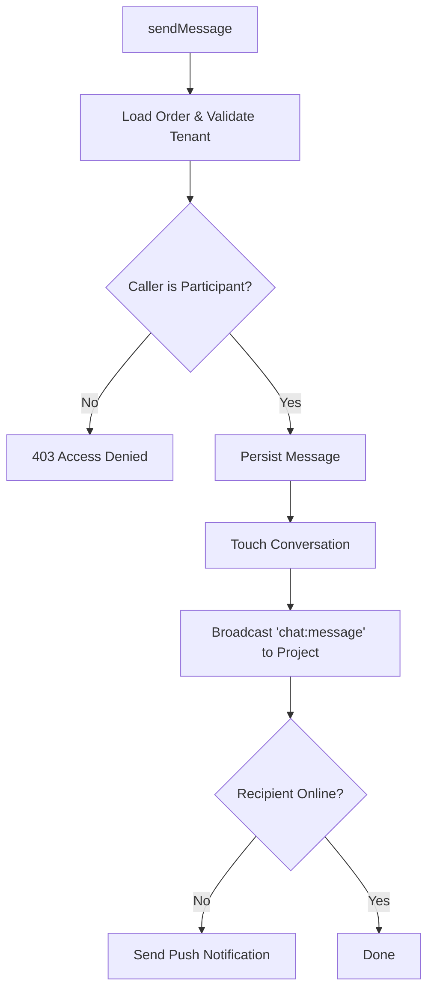
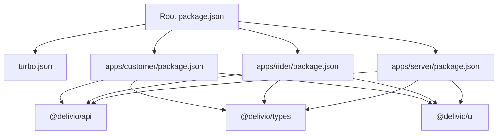

# Architecture Overview

<cite>
**Referenced Files in This Document**
- [package.json](file://package.json)
- [turbo.json](file://turbo.json)
- [docker-compose.yml](file://docker-compose.yml)
- [Dockerfile](file://Dockerfile)
- [apps/server/package.json](file://apps/server/package.json)
- [apps/server/app.js](file://apps/server/app.js)
- [apps/server/routes/index.js](file://apps/server/routes/index.js)
- [apps/server/websocket/ws-server.js](file://apps/server/websocket/ws-server.js)
- [apps/server/lib/supabase.js](file://apps/server/lib/supabase.js)
- [apps/server/services/stripe.service.js](file://apps/server/services/stripe.service.js)
- [apps/server/migrations/000_core_schema.sql](file://apps/server/migrations/000_core_schema.sql)
- [apps/server/middleware/auth.middleware.js](file://apps/server/middleware/auth.middleware.js)
- [apps/customer/package.json](file://apps/customer/package.json)
- [apps/customer/src/providers/ws-provider.tsx](file://apps/customer/src/providers/ws-provider.tsx)
- [apps/customer/src/hooks/use-chat.ts](file://apps/customer/src/hooks/use-chat.ts)
- [apps/rider/package.json](file://apps/rider/package.json)
- [apps/rider/src/providers/ws-provider.tsx](file://apps/rider/src/providers/ws-provider.tsx)
- [apps/rider/src/hooks/use-chat.ts](file://apps/rider/src/hooks/use-chat.ts)
- [apps/server/controllers/chat.controller.js](file://apps/server/controllers/chat.controller.js)
</cite>

## Table of Contents
1. [Introduction](#introduction)
2. [Project Structure](#project-structure)
3. [Core Components](#core-components)
4. [Architecture Overview](#architecture-overview)
5. [Detailed Component Analysis](#detailed-component-analysis)
6. [Dependency Analysis](#dependency-analysis)
7. [Performance Considerations](#performance-considerations)
8. [Troubleshooting Guide](#troubleshooting-guide)
9. [Conclusion](#conclusion)

## Introduction
This document describes the architecture of the Delivio delivery platform. It covers the monorepo design with Turborepo, microservice-like separation of applications, real-time communication via WebSockets, multi-tenant database design, and shared packages. It also documents the technology stack, component interactions, data flow, and operational aspects such as scalability, deployment topology, and cross-cutting concerns like authentication and authorization.

## Project Structure
Delivio uses a monorepo organized under workspaces with a shared build system powered by Turborepo. The repository contains:
- Frontend applications for customer and rider experiences (Next.js)
- Backend server (Express) providing REST APIs and WebSocket endpoints
- Shared packages for API clients, types, and UI components
- Mobile applications for customer and rider (Expo/React Native)
- Infrastructure and deployment configurations (Docker, docker-compose, Railway)

**Diagram sources**
- [package.json:1-20](file://package.json#L1-L20)
- [turbo.json:1-20](file://turbo.json#L1-L20)

**Section sources**
- [package.json:1-20](file://package.json#L1-L20)
- [turbo.json:1-20](file://turbo.json#L1-L20)

## Core Components
- Monorepo orchestration with Turborepo tasks for build, dev, lint, and test.
- Backend server built with Express, providing REST endpoints and a WebSocket server.
- Real-time communication via WebSocket with per-project tenant isolation.
- Multi-tenant database design using a project reference (workspace) to isolate data.
- Shared packages (@delivio/api, @delivio/types, @delivio/ui) consumed by frontend apps.
- External integrations: Stripe for payments, Supabase for database operations, Redis for caching/session storage.

**Section sources**
- [apps/server/package.json:1-49](file://apps/server/package.json#L1-L49)
- [apps/customer/package.json:1-42](file://apps/customer/package.json#L1-L42)
- [apps/rider/package.json:1-39](file://apps/rider/package.json#L1-L39)

## Architecture Overview
The system follows a client-server model with real-time updates:
- Clients (customer and rider web apps) connect to the backend REST API and subscribe to WebSocket channels.
- The backend enforces authentication and authorization, attaches a project/workspace context, and persists data in a multi-tenant schema.
- Real-time events are broadcast to all connections within a project, enabling live order updates, chat, and delivery notifications.
- Payments integrate with Stripe; database operations leverage Supabase’s REST and Management APIs.

**Diagram sources**
- [apps/server/app.js:1-88](file://apps/server/app.js#L1-L88)
- [apps/server/routes/index.js:1-55](file://apps/server/routes/index.js#L1-L55)
- [apps/server/websocket/ws-server.js:1-237](file://apps/server/websocket/ws-server.js#L1-L237)
- [apps/server/lib/supabase.js:1-151](file://apps/server/lib/supabase.js#L1-L151)
- [apps/server/services/stripe.service.js:1-83](file://apps/server/services/stripe.service.js#L1-L83)

## Detailed Component Analysis

### Backend Application (Express)
The backend initializes middleware, security headers, logging, Sentry, routes, and error handlers. It exposes REST endpoints under /api and a WebSocket endpoint at /ws.

**Diagram sources**
- [apps/server/app.js:1-88](file://apps/server/app.js#L1-L88)

**Section sources**
- [apps/server/app.js:1-88](file://apps/server/app.js#L1-L88)

### Routing and Authentication
The routes module mounts sub-routers and applies global middleware for rate limiting, session parsing, and project reference attachment. Authentication middleware supports session cookies and Bearer tokens.

**Diagram sources**
- [apps/server/routes/index.js:1-55](file://apps/server/routes/index.js#L1-L55)
- [apps/server/middleware/auth.middleware.js:1-123](file://apps/server/middleware/auth.middleware.js#L1-L123)

**Section sources**
- [apps/server/routes/index.js:1-55](file://apps/server/routes/index.js#L1-L55)
- [apps/server/middleware/auth.middleware.js:1-123](file://apps/server/middleware/auth.middleware.js#L1-L123)

### WebSocket Real-Time Communication
The WebSocket server authenticates clients via cookies or JWT, registers connections per project, and broadcasts events to all connections within a project. It supports heartbeat and selective delivery.

**Diagram sources**
- [apps/server/websocket/ws-server.js:1-237](file://apps/server/websocket/ws-server.js#L1-L237)
- [apps/server/controllers/chat.controller.js:1-174](file://apps/server/controllers/chat.controller.js#L1-L174)

**Section sources**
- [apps/server/websocket/ws-server.js:1-237](file://apps/server/websocket/ws-server.js#L1-L237)
- [apps/server/controllers/chat.controller.js:1-174](file://apps/server/controllers/chat.controller.js#L1-L174)

### Multi-Tenant Database Design
The backend uses a project reference (workspace) to enforce tenant isolation across entities. Migrations define canonical tables and constraints, ensuring consistent schema across tenants.

**Diagram sources**
- [apps/server/migrations/000_core_schema.sql:1-165](file://apps/server/migrations/000_core_schema.sql#L1-L165)

**Section sources**
- [apps/server/migrations/000_core_schema.sql:1-165](file://apps/server/migrations/000_core_schema.sql#L1-L165)

### External Integrations
- Stripe: Payment intents and refunds are handled via the Stripe service, with webhook verification support.
- Supabase: Database operations are performed through REST and Management APIs, with helper utilities for filtering and SQL execution.
- Redis: Used for caching and session storage (configured in docker-compose).

**Diagram sources**
- [apps/server/services/stripe.service.js:1-83](file://apps/server/services/stripe.service.js#L1-L83)
- [apps/server/lib/supabase.js:1-151](file://apps/server/lib/supabase.js#L1-L151)
- [docker-compose.yml:1-43](file://docker-compose.yml#L1-L43)

**Section sources**
- [apps/server/services/stripe.service.js:1-83](file://apps/server/services/stripe.service.js#L1-L83)
- [apps/server/lib/supabase.js:1-151](file://apps/server/lib/supabase.js#L1-L151)
- [docker-compose.yml:1-43](file://docker-compose.yml#L1-L43)

### Frontend WebSocket Providers and Hooks
Both customer and rider Next.js apps initialize a WebSocket client, connect on mount, and subscribe to relevant event types. They invalidate React Query caches upon receiving real-time events to keep UIs synchronized.

**Diagram sources**
- [apps/customer/src/providers/ws-provider.tsx:1-86](file://apps/customer/src/providers/ws-provider.tsx#L1-L86)
- [apps/rider/src/providers/ws-provider.tsx:1-83](file://apps/rider/src/providers/ws-provider.tsx#L1-L83)

**Section sources**
- [apps/customer/src/providers/ws-provider.tsx:1-86](file://apps/customer/src/providers/ws-provider.tsx#L1-L86)
- [apps/rider/src/providers/ws-provider.tsx:1-83](file://apps/rider/src/providers/ws-provider.tsx#L1-L83)

### Chat Controller Flow
The chat controller validates access, ensures multi-tenant isolation, creates or finds conversations, persists messages, and broadcasts real-time updates. If the recipient is offline, it triggers push notifications.

**Diagram sources**
- [apps/server/controllers/chat.controller.js:1-174](file://apps/server/controllers/chat.controller.js#L1-L174)

**Section sources**
- [apps/server/controllers/chat.controller.js:1-174](file://apps/server/controllers/chat.controller.js#L1-L174)

## Dependency Analysis
The monorepo uses workspaces to manage dependencies across apps and packages. The backend declares runtime dependencies for Express, Sentry, Stripe, Twilio, Redis, and WebSocket support. Frontend apps depend on shared packages and UI libraries.

**Diagram sources**
- [package.json:1-20](file://package.json#L1-L20)
- [turbo.json:1-20](file://turbo.json#L1-L20)
- [apps/server/package.json:1-49](file://apps/server/package.json#L1-L49)
- [apps/customer/package.json:1-42](file://apps/customer/package.json#L1-L42)
- [apps/rider/package.json:1-39](file://apps/rider/package.json#L1-L39)

**Section sources**
- [package.json:1-20](file://package.json#L1-L20)
- [turbo.json:1-20](file://turbo.json#L1-L20)
- [apps/server/package.json:1-49](file://apps/server/package.json#L1-L49)
- [apps/customer/package.json:1-42](file://apps/customer/package.json#L1-L42)
- [apps/rider/package.json:1-39](file://apps/rider/package.json#L1-L39)

## Performance Considerations
- Caching and Sessions: Redis is provisioned for caching and session storage; configure appropriate eviction policies and connection pooling.
- Rate Limiting: Global rate limiter is applied to all API routes; tune limits per route as needed.
- WebSocket Scalability: Heartbeats and connection cleanup prevent stale connections; consider horizontal scaling with sticky sessions or a pub/sub bridge for multi-instance deployments.
- Database: Use indexes on project_ref and frequently queried columns; batch operations for chat history pagination.
- Frontend: Debounce real-time subscriptions and cache invalidation to reduce redundant network requests.

[No sources needed since this section provides general guidance]

## Troubleshooting Guide
- Health Checks: The Docker Compose healthcheck pings the backend API to ensure availability.
- Sentry: Ensure DSN and environment are configured to capture errors and traces.
- Stripe Webhooks: Verify webhook secret and signature verification to prevent replay attacks.
- Supabase Connectivity: Confirm service keys and Management API access for schema operations.
- Authentication: Validate session cookies and JWT secrets; ensure trust proxy is enabled behind load balancers.

**Section sources**
- [docker-compose.yml:19-25](file://docker-compose.yml#L19-L25)
- [apps/server/app.js:46-81](file://apps/server/app.js#L46-L81)
- [apps/server/services/stripe.service.js:74-80](file://apps/server/services/stripe.service.js#L74-L80)
- [apps/server/lib/supabase.js:26-63](file://apps/server/lib/supabase.js#L26-L63)
- [apps/server/middleware/auth.middleware.js:11-51](file://apps/server/middleware/auth.middleware.js#L11-L51)

## Conclusion
Delivio employs a modern monorepo architecture with Turborepo, a microservice-like backend, and robust real-time capabilities through WebSockets. The multi-tenant design, shared packages, and integration with Stripe and Supabase enable scalable delivery operations. Proper configuration of authentication, rate limiting, and infrastructure components ensures secure and reliable service delivery.