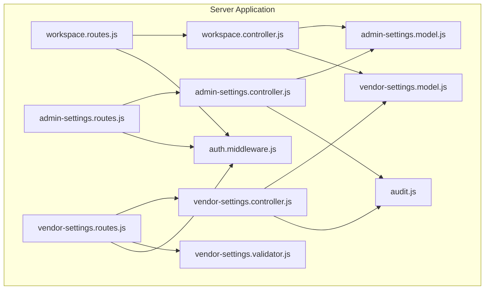
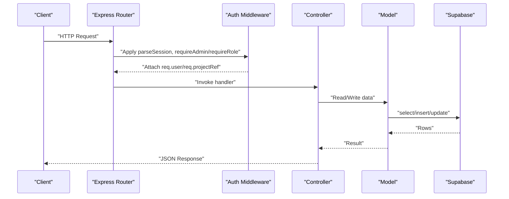
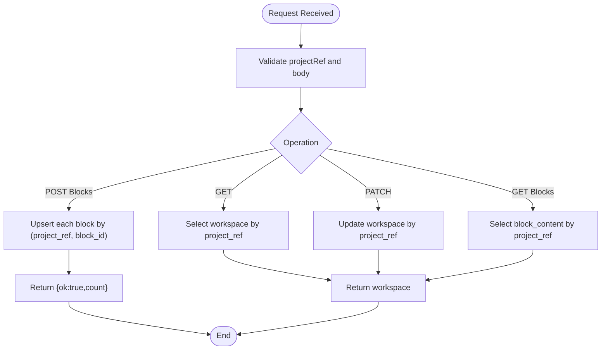
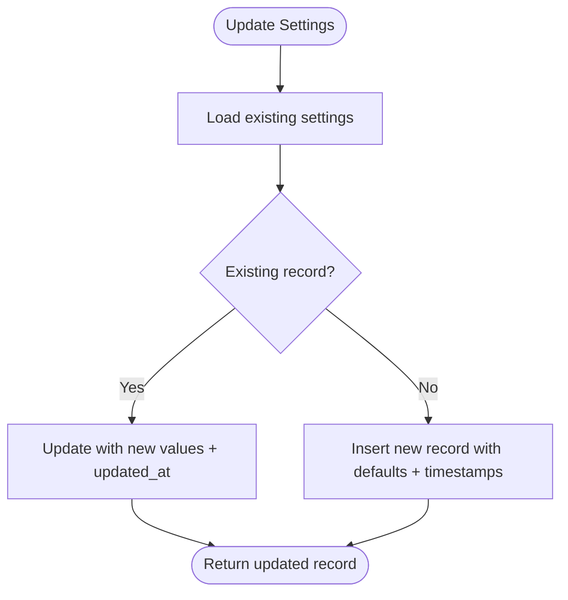
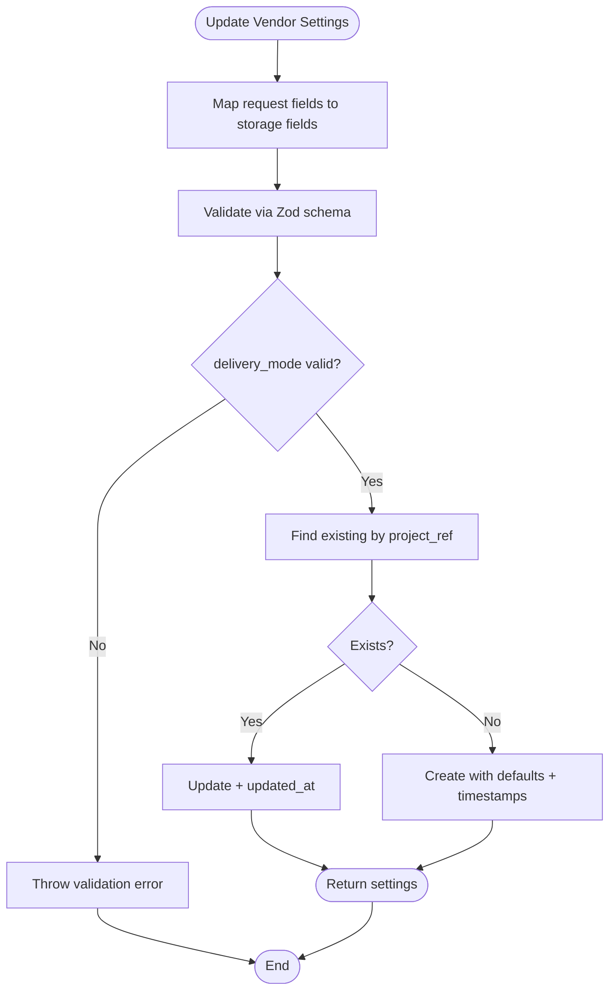
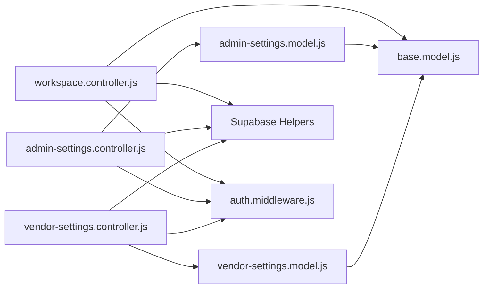

# Administrative APIs

<cite>
**Referenced Files in This Document**
- [workspace.controller.js](file://apps/server/controllers/workspace.controller.js)
- [admin-settings.controller.js](file://apps/server/controllers/admin-settings.controller.js)
- [vendor-settings.controller.js](file://apps/server/controllers/vendor-settings.controller.js)
- [workspace.routes.js](file://apps/server/routes/workspace.routes.js)
- [admin-settings.routes.js](file://apps/server/routes/admin-settings.routes.js)
- [vendor-settings.routes.js](file://apps/server/routes/vendor-settings.routes.js)
- [admin-settings.model.js](file://apps/server/models/admin-settings.model.js)
- [vendor-settings.model.js](file://apps/server/models/vendor-settings.model.js)
- [vendor-settings.validator.js](file://apps/server/validators/vendor-settings.validator.js)
- [audit.js](file://apps/server/lib/audit.js)
- [auth.middleware.js](file://apps/server/middleware/auth.middleware.js)
- [000_core_schema.sql](file://apps/server/migrations/000_core_schema.sql)
- [007_audit_log.sql](file://apps/server/migrations/007_audit_log.sql)
- [011_admin_settings.sql](file://apps/server/migrations/011_admin_settings.sql)
- [012_vendor_dispatch_delay.sql](file://apps/server/migrations/012_vendor_dispatch_delay.sql)
- [base.model.js](file://apps/server/models/base.model.js)
- [app.js](file://apps/server/app.js)
</cite>

## Table of Contents
1. [Introduction](#introduction)
2. [Project Structure](#project-structure)
3. [Core Components](#core-components)
4. [Architecture Overview](#architecture-overview)
5. [Detailed Component Analysis](#detailed-component-analysis)
6. [Dependency Analysis](#dependency-analysis)
7. [Performance Considerations](#performance-considerations)
8. [Troubleshooting Guide](#troubleshooting-guide)
9. [Conclusion](#conclusion)
10. [Appendices](#appendices)

## Introduction
This document provides comprehensive API documentation for administrative endpoints focused on workspace management, vendor settings configuration, and admin settings APIs. It covers endpoint definitions, request/response schemas, validation rules, operational parameters, and business rule settings. It also outlines multi-tenant configuration via project references, permission management, audit logging, and configuration validation.

## Project Structure
Administrative APIs are organized under the server application with dedicated controllers, routes, models, validators, and middleware. The routes define the HTTP surface, controllers implement request handling, models encapsulate persistence, validators enforce input constraints, and middleware enforces authentication and authorization.

**Diagram sources**
- [workspace.routes.js:1-18](file://apps/server/routes/workspace.routes.js#L1-L18)
- [admin-settings.routes.js:1-14](file://apps/server/routes/admin-settings.routes.js#L1-L14)
- [vendor-settings.routes.js:1-17](file://apps/server/routes/vendor-settings.routes.js#L1-L17)
- [workspace.controller.js:1-72](file://apps/server/controllers/workspace.controller.js#L1-L72)
- [admin-settings.controller.js:1-30](file://apps/server/controllers/admin-settings.controller.js#L1-L30)
- [vendor-settings.controller.js:1-30](file://apps/server/controllers/vendor-settings.controller.js#L1-L30)
- [admin-settings.model.js:1-35](file://apps/server/models/admin-settings.model.js#L1-L35)
- [vendor-settings.model.js:1-51](file://apps/server/models/vendor-settings.model.js#L1-L51)
- [vendor-settings.validator.js:1-14](file://apps/server/validators/vendor-settings.validator.js#L1-L14)
- [auth.middleware.js:1-123](file://apps/server/middleware/auth.middleware.js#L1-L123)
- [audit.js:1-35](file://apps/server/lib/audit.js#L1-L35)

**Section sources**
- [workspace.routes.js:1-18](file://apps/server/routes/workspace.routes.js#L1-L18)
- [admin-settings.routes.js:1-14](file://apps/server/routes/admin-settings.routes.js#L1-L14)
- [vendor-settings.routes.js:1-17](file://apps/server/routes/vendor-settings.routes.js#L1-L17)
- [auth.middleware.js:1-123](file://apps/server/middleware/auth.middleware.js#L1-L123)

## Core Components
- Workspace Management: Retrieve and update workspace metadata; manage multi-tenant content blocks per project reference.
- Admin Settings: System-wide operational parameters (delivery time, dispatch delay, search radius).
- Vendor Settings: Per-project delivery modes, acceptance behavior, preparation time, and radius; validated and persisted per project reference.

**Section sources**
- [workspace.controller.js:1-72](file://apps/server/controllers/workspace.controller.js#L1-L72)
- [admin-settings.controller.js:1-30](file://apps/server/controllers/admin-settings.controller.js#L1-L30)
- [vendor-settings.controller.js:1-30](file://apps/server/controllers/vendor-settings.controller.js#L1-L30)

## Architecture Overview
Administrative endpoints follow a layered architecture:
- Routes define HTTP endpoints and apply middleware for authentication and authorization.
- Controllers handle request parsing, orchestrate business logic, and return structured JSON responses.
- Models encapsulate persistence using shared Supabase helpers and enforce defaults and constraints.
- Validators define strict input schemas for request bodies.
- Middleware enforces roles and attaches session identity.

**Diagram sources**
- [workspace.routes.js:10-15](file://apps/server/routes/workspace.routes.js#L10-L15)
- [admin-settings.routes.js:9-11](file://apps/server/routes/admin-settings.routes.js#L9-L11)
- [vendor-settings.routes.js:11-14](file://apps/server/routes/vendor-settings.routes.js#L11-L14)
- [auth.middleware.js:11-51](file://apps/server/middleware/auth.middleware.js#L11-L51)
- [workspace.controller.js:6-24](file://apps/server/controllers/workspace.controller.js#L6-L24)
- [admin-settings.controller.js:5-27](file://apps/server/controllers/admin-settings.controller.js#L5-L27)
- [vendor-settings.controller.js:5-27](file://apps/server/controllers/vendor-settings.controller.js#L5-L27)
- [admin-settings.model.js:12-31](file://apps/server/models/admin-settings.model.js#L12-L31)
- [vendor-settings.model.js:14-47](file://apps/server/models/vendor-settings.model.js#L14-L47)

## Detailed Component Analysis

### Workspace Management API
Endpoints enable retrieval and updates of workspace metadata and multi-tenant content blocks.

- GET /api/workspaces/:projectRef
  - Description: Fetch workspace details for the given project reference.
  - Authentication: Admin required.
  - Response: { workspace: WorkspaceRecord }
  - Errors: 404 if workspace does not exist.

- PATCH /api/workspaces/:projectRef
  - Description: Update workspace metadata fields.
  - Authentication: Admin required.
  - Request Body: Partial WorkspaceRecord fields.
  - Response: { workspace: UpdatedWorkspaceRecord }

- GET /api/workspaces/:projectRef/blocks
  - Description: Retrieve all content blocks for the project.
  - Authentication: Admin required.
  - Response: { blocks: BlockContentRecord[] }

- POST /api/workspaces/:projectRef/blocks
  - Description: Upsert multiple content blocks atomically.
  - Authentication: Admin required.
  - Request Body: { blocks: BlockContentInput[] }
  - Validation: blocks must be an array.
  - Behavior: For each block, upsert by projectRef + blockId.
  - Response: { ok: true, count: number }

Operational Notes:
- Multi-tenancy is enforced via projectRef attached by middleware.
- Content blocks are stored with unique (project_ref, block_id) to prevent collisions.

**Section sources**
- [workspace.routes.js:10-15](file://apps/server/routes/workspace.routes.js#L10-L15)
- [workspace.controller.js:6-69](file://apps/server/controllers/workspace.controller.js#L6-L69)
- [000_core_schema.sql:37-63](file://apps/server/migrations/000_core_schema.sql#L37-L63)

#### Workspace Controller Flow

**Diagram sources**
- [workspace.controller.js:6-69](file://apps/server/controllers/workspace.controller.js#L6-L69)

### Admin Settings API
System-wide operational parameters managed by administrators.

- GET /api/admin/settings
  - Description: Retrieve current admin settings.
  - Authentication: Role 'admin' required.
  - Response: { settings: AdminSettings | defaults }
  - Defaults returned if no record exists.

- PATCH /api/admin/settings
  - Description: Upsert admin settings.
  - Authentication: Role 'admin' required.
  - Request Body: Partial AdminSettings.
  - Response: { settings: AdminSettings }

Data Schema (AdminSettings):
- avg_delivery_time_minutes: integer, default 30
- auto_dispatch_delay_minutes: integer, default 5
- max_search_radius_km: float, default 15.0
- created_at, updated_at: timestamps

Validation and Persistence:
- Model performs upsert with updated_at timestamp on update.
- Defaults applied when inserting new records.

**Section sources**
- [admin-settings.routes.js:9-11](file://apps/server/routes/admin-settings.routes.js#L9-L11)
- [admin-settings.controller.js:5-27](file://apps/server/controllers/admin-settings.controller.js#L5-L27)
- [admin-settings.model.js:12-31](file://apps/server/models/admin-settings.model.js#L12-L31)
- [011_admin_settings.sql:1-9](file://apps/server/migrations/011_admin_settings.sql#L1-L9)

#### Admin Settings Model Flow

**Diagram sources**
- [admin-settings.model.js:17-31](file://apps/server/models/admin-settings.model.js#L17-L31)

### Vendor Settings API
Per-project vendor configuration for delivery behavior and radius.

- GET /api/vendor/settings
  - Description: Retrieve vendor settings for the current project.
  - Authentication: Role 'vendor' or 'admin' required.
  - Response: { settings: VendorSettings | null }

- PATCH /api/vendor/settings
  - Description: Update vendor settings for the current project.
  - Authentication: Role 'vendor' or 'admin' required.
  - Request Body: Partial VendorSettings with optional fields:
    - autoAccept: boolean
    - defaultPrepTimeMinutes: integer, min 5, max 120
    - deliveryMode: enum third_party | vendor_rider
    - deliveryRadiusKm: number, min 0.5, max 50
    - autoDispatchDelayMinutes: integer, min 0, max 60
  - Validation: Enforced by Zod schema.
  - Response: { settings: VendorSettings }

Constraints and Defaults:
- delivery_mode restricted to predefined modes.
- On insert, defaults applied for auto_accept, default_prep_time_minutes, delivery_mode, delivery_radius_km.
- Additional column auto_dispatch_delay_minutes supported via migration.

**Section sources**
- [vendor-settings.routes.js:11-14](file://apps/server/routes/vendor-settings.routes.js#L11-L14)
- [vendor-settings.controller.js:5-27](file://apps/server/controllers/vendor-settings.controller.js#L5-L27)
- [vendor-settings.validator.js:5-11](file://apps/server/validators/vendor-settings.validator.js#L5-L11)
- [vendor-settings.model.js:14-47](file://apps/server/models/vendor-settings.model.js#L14-L47)
- [012_vendor_dispatch_delay.sql:1-2](file://apps/server/migrations/012_vendor_dispatch_delay.sql#L1-L2)

#### Vendor Settings Controller Flow

**Diagram sources**
- [vendor-settings.controller.js:14-27](file://apps/server/controllers/vendor-settings.controller.js#L14-L27)
- [vendor-settings.validator.js:5-11](file://apps/server/validators/vendor-settings.validator.js#L5-L11)
- [vendor-settings.model.js:22-47](file://apps/server/models/vendor-settings.model.js#L22-L47)

### Permission Management and Multi-Tenant Configuration
- Authentication:
  - Session parsing supports admin/customer cookies and Bearer JWTs.
  - requireAdmin and requireRole enforce authorization.
- Multi-tenancy:
  - attachProjectRef and requireProjectRef middleware ensure all requests operate within a project context.
  - Workspace and vendor settings are queried and written using project_ref.

**Section sources**
- [auth.middleware.js:11-51](file://apps/server/middleware/auth.middleware.js#L11-L51)
- [workspace.routes.js:10-10](file://apps/server/routes/workspace.routes.js#L10-L10)
- [vendor-settings.routes.js:11-11](file://apps/server/routes/vendor-settings.routes.js#L11-L11)
- [000_core_schema.sql:37-51](file://apps/server/migrations/000_core_schema.sql#L37-L51)

### Audit Logging and Change Tracking
- Audit logging:
  - writeAuditLog persists entries to audit_log with user_id, action, resource_type, resource_id, details, ip, and created_at.
  - Non-blocking: errors are logged but do not fail the primary operation.
- Indexes:
  - audit_log includes indexes on user_id, action, resource_type/resource_id, and created_at for efficient queries.

Operational Guidance:
- Use writeAuditLog after successful administrative actions to capture changes for compliance and debugging.
- Include meaningful action identifiers and resource details to aid investigations.

**Section sources**
- [audit.js:18-32](file://apps/server/lib/audit.js#L18-L32)
- [007_audit_log.sql:4-18](file://apps/server/migrations/007_audit_log.sql#L4-L18)

## Dependency Analysis
Administrative endpoints depend on shared infrastructure:
- Base model provides generic CRUD helpers.
- Supabase helpers abstract select/insert/update/remove operations.
- Middleware ensures consistent authentication and authorization across routes.

**Diagram sources**
- [workspace.controller.js:3-3](file://apps/server/controllers/workspace.controller.js#L3-L3)
- [admin-settings.controller.js:3-3](file://apps/server/controllers/admin-settings.controller.js#L3-L3)
- [vendor-settings.controller.js:3-3](file://apps/server/controllers/vendor-settings.controller.js#L3-L3)
- [admin-settings.model.js:3-4](file://apps/server/models/admin-settings.model.js#L3-L4)
- [vendor-settings.model.js:4-5](file://apps/server/models/vendor-settings.model.js#L4-L5)
- [base.model.js:3-3](file://apps/server/models/base.model.js#L3-L3)
- [auth.middleware.js:11-51](file://apps/server/middleware/auth.middleware.js#L11-L51)

**Section sources**
- [base.model.js:9-52](file://apps/server/models/base.model.js#L9-L52)
- [app.js:67-85](file://apps/server/app.js#L67-L85)

## Performance Considerations
- Prefer batch upserts for content blocks to minimize round-trips.
- Use indexes on project_ref for workspace and vendor settings queries.
- Limit JSON sizes for block_content to avoid large payloads.
- Apply rate limiting at the gateway level for administrative endpoints.

## Troubleshooting Guide
Common issues and resolutions:
- Authentication failures:
  - Ensure admin_session cookie or Bearer JWT with role 'admin' is present.
  - Verify JWT secret and issuer configuration.
- Authorization failures:
  - Confirm user role matches required role for endpoint.
- Missing project reference:
  - Ensure projectRef middleware is applied and project_ref is valid.
- Validation errors on vendor settings:
  - Check field ranges and enums against validator schema.
- Audit log write failures:
  - Monitor logs for audit write errors; note that audit failures do not block operations.

**Section sources**
- [auth.middleware.js:56-76](file://apps/server/middleware/auth.middleware.js#L56-L76)
- [vendor-settings.validator.js:5-11](file://apps/server/validators/vendor-settings.validator.js#L5-L11)
- [audit.js:29-31](file://apps/server/lib/audit.js#L29-L31)

## Conclusion
Administrative APIs provide robust controls for workspace management, system-wide admin settings, and per-project vendor configurations. They enforce multi-tenancy via project references, apply strict validation, and support audit logging for compliance. Use the provided schemas and workflows to configure delivery behavior, operational parameters, and business rules effectively.

## Appendices

### Endpoint Reference Summary
- Workspace
  - GET /api/workspaces/:projectRef
  - PATCH /api/workspaces/:projectRef
  - GET /api/workspaces/:projectRef/blocks
  - POST /api/workspaces/:projectRef/blocks
- Admin Settings
  - GET /api/admin/settings
  - PATCH /api/admin/settings
- Vendor Settings
  - GET /api/vendor/settings
  - PATCH /api/vendor/settings

**Section sources**
- [workspace.routes.js:12-15](file://apps/server/routes/workspace.routes.js#L12-L15)
- [admin-settings.routes.js:10-11](file://apps/server/routes/admin-settings.routes.js#L10-L11)
- [vendor-settings.routes.js:13-14](file://apps/server/routes/vendor-settings.routes.js#L13-L14)

### Data Schemas
- WorkspaceRecord
  - project_ref: text (unique)
  - name: text
  - description: text
  - logo_url: text
  - banner_url: text
  - address: text
  - phone: text
  - lat: decimal
  - lon: decimal
  - created_at, updated_at: timestamps
- BlockContentRecord
  - project_ref: text
  - block_id: text
  - content: jsonb
  - created_at, updated_at: timestamps
- AdminSettings
  - avg_delivery_time_minutes: integer
  - auto_dispatch_delay_minutes: integer
  - max_search_radius_km: float
  - created_at, updated_at: timestamps
- VendorSettings
  - project_ref: text
  - auto_accept: boolean
  - default_prep_time_minutes: integer
  - delivery_mode: enum third_party | vendor_rider
  - delivery_radius_km: float
  - auto_dispatch_delay_minutes: integer
  - created_at, updated_at: timestamps

**Section sources**
- [000_core_schema.sql:37-63](file://apps/server/migrations/000_core_schema.sql#L37-L63)
- [011_admin_settings.sql:1-9](file://apps/server/migrations/011_admin_settings.sql#L1-L9)
- [012_vendor_dispatch_delay.sql:1-2](file://apps/server/migrations/012_vendor_dispatch_delay.sql#L1-L2)