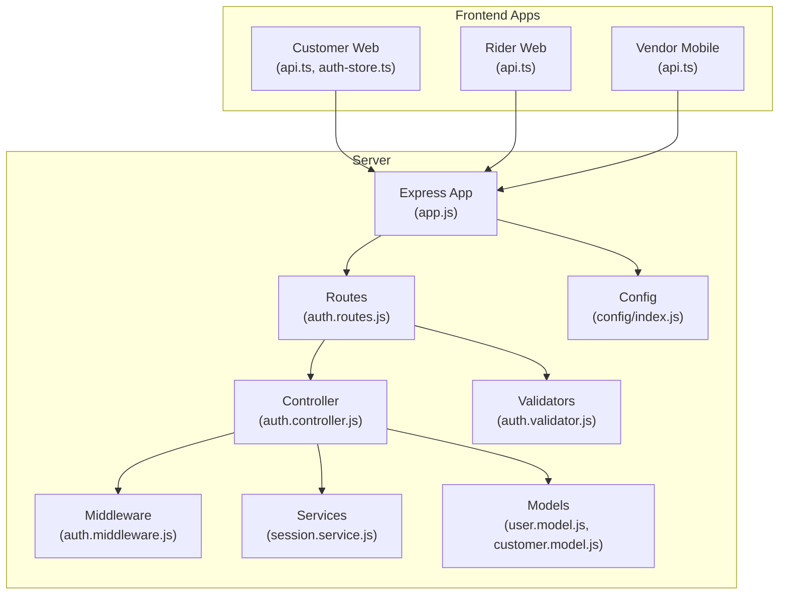
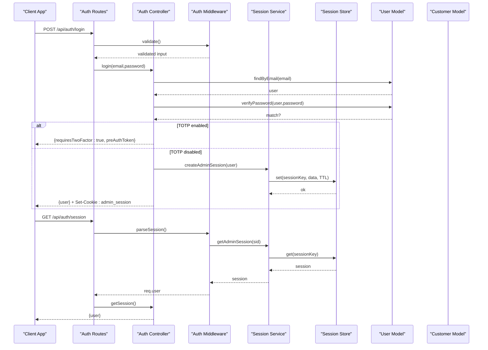
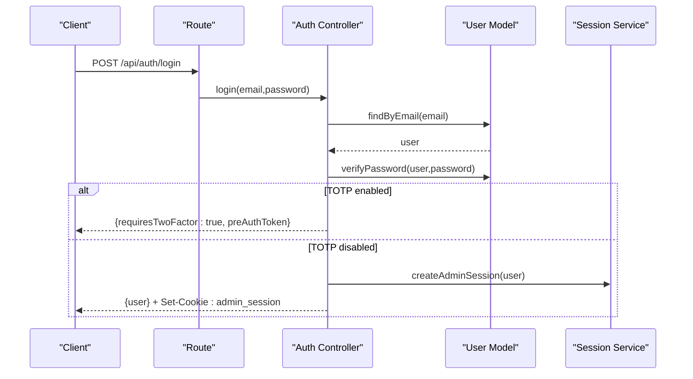
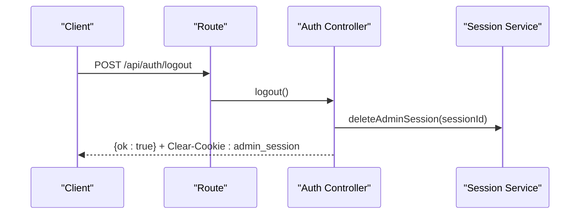
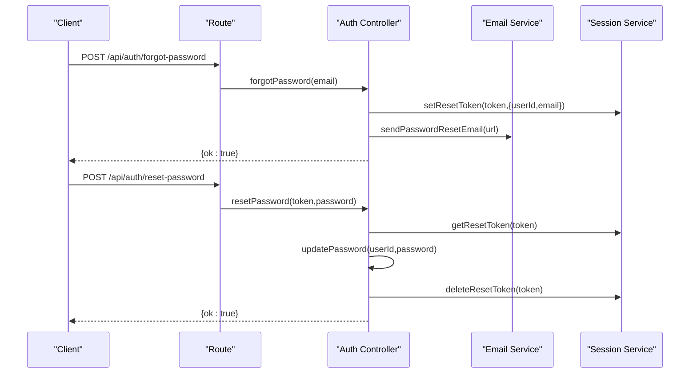
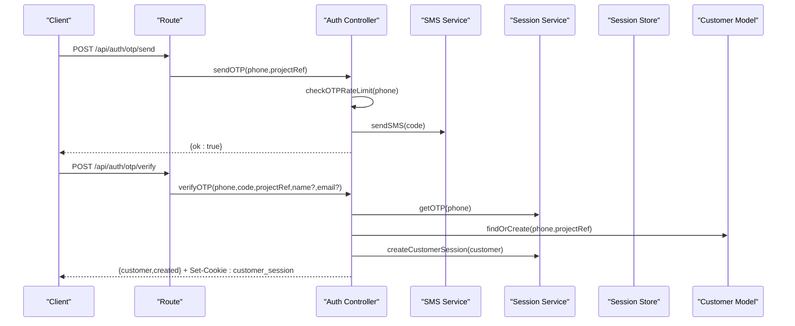
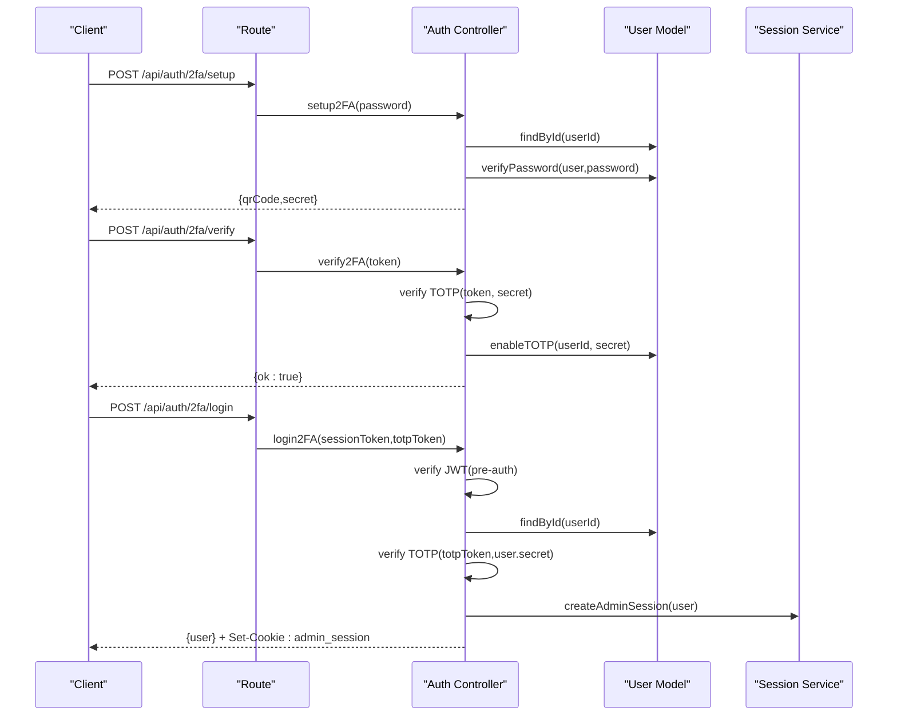
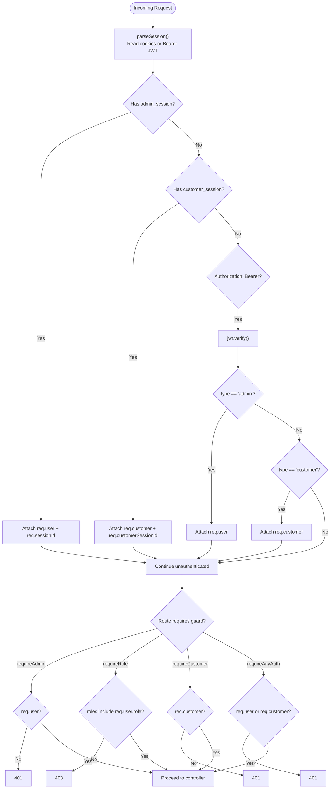
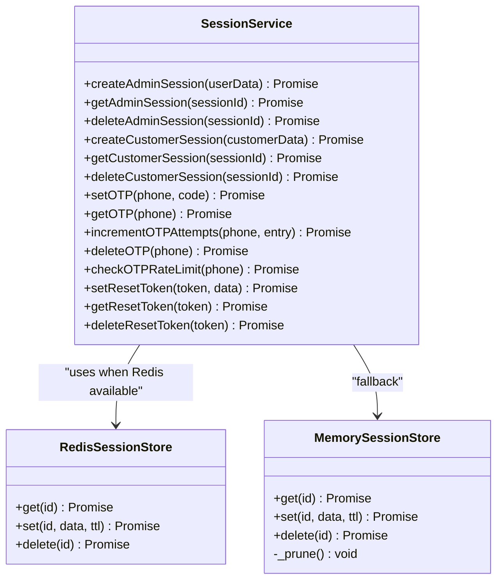
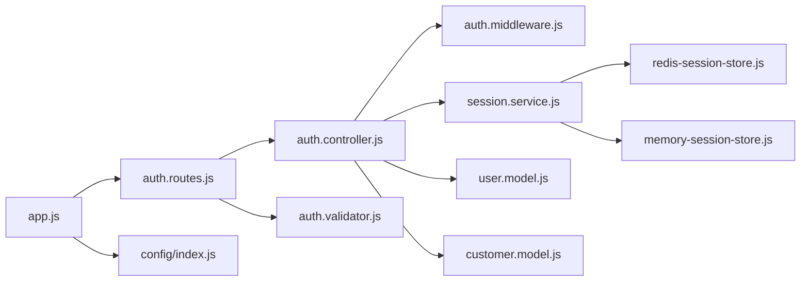

# Authentication & User Management

<cite>
**Referenced Files in This Document**
- [auth.controller.js](file://apps/server/controllers/auth.controller.js)
- [auth.routes.js](file://apps/server/routes/auth.routes.js)
- [auth.middleware.js](file://apps/server/middleware/auth.middleware.js)
- [session.service.js](file://apps/server/services/session.service.js)
- [memory-session-store.js](file://apps/server/services/memory-session-store.js)
- [redis-session-store.js](file://apps/server/services/redis-session-store.js)
- [user.model.js](file://apps/server/models/user.model.js)
- [customer.model.js](file://apps/server/models/customer.model.js)
- [auth.validator.js](file://apps/server/validators/auth.validator.js)
- [config/index.js](file://apps/server/config/index.js)
- [app.js](file://apps/server/app.js)
- [auth-store.ts](file://apps/customer/src/stores/auth-store.ts)
- [api.ts (customer)](file://apps/customer/src/lib/api.ts)
- [api.ts (rider)](file://apps/rider/src/lib/api.ts)
- [api.ts (vendor-mobile)](file://apps/vendor-mobile/src/lib/api.ts)
</cite>

## Table of Contents
1. [Introduction](#introduction)
2. [Project Structure](#project-structure)
3. [Core Components](#core-components)
4. [Architecture Overview](#architecture-overview)
5. [Detailed Component Analysis](#detailed-component-analysis)
6. [Dependency Analysis](#dependency-analysis)
7. [Performance Considerations](#performance-considerations)
8. [Troubleshooting Guide](#troubleshooting-guide)
9. [Conclusion](#conclusion)
10. [Appendices](#appendices)

## Introduction
This document provides comprehensive API documentation for authentication and user management in the system. It covers login, logout, registration, password reset, and session management APIs. It also documents JWT token handling, role-based access control, middleware integration for session parsing and authorization, multi-role authentication (admin, vendor, rider), session cookie management, and security headers. Common authentication errors, token expiration handling, and logout procedures are addressed to help developers integrate securely and reliably.

## Project Structure
The authentication subsystem spans controllers, routes, middleware, services, models, validators, and configuration. Frontend applications consume the APIs via shared client libraries.

**Diagram sources**
- [app.js:1-88](file://apps/server/app.js#L1-L88)
- [auth.routes.js:1-37](file://apps/server/routes/auth.routes.js#L1-L37)
- [auth.controller.js:1-321](file://apps/server/controllers/auth.controller.js#L1-L321)
- [auth.middleware.js:1-123](file://apps/server/middleware/auth.middleware.js#L1-L123)
- [session.service.js:1-180](file://apps/server/services/session.service.js#L1-L180)
- [user.model.js:1-64](file://apps/server/models/user.model.js#L1-L64)
- [customer.model.js:1-61](file://apps/server/models/customer.model.js#L1-L61)
- [auth.validator.js:1-63](file://apps/server/validators/auth.validator.js#L1-L63)
- [config/index.js:1-117](file://apps/server/config/index.js#L1-L117)
- [api.ts (customer):1-11](file://apps/customer/src/lib/api.ts#L1-L11)
- [auth-store.ts:1-48](file://apps/customer/src/stores/auth-store.ts#L1-L48)
- [api.ts (rider):1-11](file://apps/rider/src/lib/api.ts#L1-L11)
- [api.ts (vendor-mobile):1-12](file://apps/vendor-mobile/src/lib/api.ts#L1-L12)

**Section sources**
- [auth.routes.js:1-37](file://apps/server/routes/auth.routes.js#L1-L37)
- [auth.controller.js:1-321](file://apps/server/controllers/auth.controller.js#L1-L321)
- [auth.middleware.js:1-123](file://apps/server/middleware/auth.middleware.js#L1-L123)
- [session.service.js:1-180](file://apps/server/services/session.service.js#L1-L180)
- [user.model.js:1-64](file://apps/server/models/user.model.js#L1-L64)
- [customer.model.js:1-61](file://apps/server/models/customer.model.js#L1-L61)
- [auth.validator.js:1-63](file://apps/server/validators/auth.validator.js#L1-L63)
- [config/index.js:1-117](file://apps/server/config/index.js#L1-L117)
- [app.js:1-88](file://apps/server/app.js#L1-L88)
- [api.ts (customer):1-11](file://apps/customer/src/lib/api.ts#L1-L11)
- [auth-store.ts:1-48](file://apps/customer/src/stores/auth-store.ts#L1-L48)
- [api.ts (rider):1-11](file://apps/rider/src/lib/api.ts#L1-L11)
- [api.ts (vendor-mobile):1-12](file://apps/vendor-mobile/src/lib/api.ts#L1-L12)

## Core Components
- Authentication controller: Implements login, logout, session retrieval, registration, password reset, OTP-based customer login, 2FA setup/verification, and 2FA login.
- Route definitions: Expose endpoints and apply middleware (validation, rate limiting, session parsing, authorization).
- Middleware: Parses session cookies or Bearer tokens, enforces admin/customer authorization, and supports role-based access control.
- Session service: Manages admin/customer sessions, OTP tokens, password reset tokens, and integrates Redis or in-memory storage.
- Models: User and customer persistence, password hashing, and sanitization.
- Validators: Zod schemas for request validation.
- Configuration: Environment-driven settings for sessions, JWT, OTP, rate limits, and security headers.

**Section sources**
- [auth.controller.js:1-321](file://apps/server/controllers/auth.controller.js#L1-L321)
- [auth.routes.js:1-37](file://apps/server/routes/auth.routes.js#L1-L37)
- [auth.middleware.js:1-123](file://apps/server/middleware/auth.middleware.js#L1-L123)
- [session.service.js:1-180](file://apps/server/services/session.service.js#L1-L180)
- [user.model.js:1-64](file://apps/server/models/user.model.js#L1-L64)
- [customer.model.js:1-61](file://apps/server/models/customer.model.js#L1-L61)
- [auth.validator.js:1-63](file://apps/server/validators/auth.validator.js#L1-L63)
- [config/index.js:1-117](file://apps/server/config/index.js#L1-L117)

## Architecture Overview
The authentication flow integrates cookie-based sessions for web clients and Bearer JWTs for API/mobile clients. Session parsing middleware attaches identities to requests, enabling role-based authorization. Session data is stored in Redis (production) or in-memory storage (development). Validation ensures robust input handling, while rate limiting protects endpoints from abuse.

**Diagram sources**
- [auth.routes.js:15-19](file://apps/server/routes/auth.routes.js#L15-L19)
- [auth.controller.js:26-62](file://apps/server/controllers/auth.controller.js#L26-L62)
- [auth.middleware.js:11-51](file://apps/server/middleware/auth.middleware.js#L11-L51)
- [session.service.js:28-43](file://apps/server/services/session.service.js#L28-L43)
- [user.model.js:15-40](file://apps/server/models/user.model.js#L15-L40)

**Section sources**
- [auth.routes.js:15-19](file://apps/server/routes/auth.routes.js#L15-L19)
- [auth.controller.js:26-62](file://apps/server/controllers/auth.controller.js#L26-L62)
- [auth.middleware.js:11-51](file://apps/server/middleware/auth.middleware.js#L11-L51)
- [session.service.js:28-43](file://apps/server/services/session.service.js#L28-L43)
- [user.model.js:15-40](file://apps/server/models/user.model.js#L15-L40)

## Detailed Component Analysis

### Authentication Endpoints

#### Login (Admin)
- Method: POST
- Path: /api/auth/login
- Purpose: Authenticate admin users and establish a session.
- Request body:
  - email: string (required, valid email)
  - password: string (required, minimum 8 characters)
- Response:
  - On success: user object (sanitized) and admin_session cookie.
  - On failure: 401 with error message.
  - If TOTP enabled: returns requiresTwoFactor flag and a short-lived preAuthToken for the next step.
- Middleware:
  - validate(v.loginSchema)
  - Controller handles TOTP pre-auth logic and session creation.
- Cookies:
  - admin_session: HttpOnly, Secure (in production), SameSite behavior depends on environment, path '/', TTL from config.

**Diagram sources**
- [auth.routes.js:16](file://apps/server/routes/auth.routes.js#L16)
- [auth.controller.js:26-62](file://apps/server/controllers/auth.controller.js#L26-L62)
- [user.model.js:15-40](file://apps/server/models/user.model.js#L15-L40)
- [session.service.js:28-33](file://apps/server/services/session.service.js#L28-L33)

**Section sources**
- [auth.routes.js:16](file://apps/server/routes/auth.routes.js#L16)
- [auth.controller.js:26-62](file://apps/server/controllers/auth.controller.js#L26-L62)
- [auth.validator.js:5-8](file://apps/server/validators/auth.validator.js#L5-L8)
- [config/index.js:16-20](file://apps/server/config/index.js#L16-L20)

#### Logout (Admin)
- Method: POST
- Path: /api/auth/logout
- Purpose: Invalidate admin session and clear admin_session cookie.
- Middleware:
  - parseSession (to obtain req.sessionId)
  - Controller deletes session and clears cookie.
- Response: { ok: true }

**Diagram sources**
- [auth.routes.js:17](file://apps/server/routes/auth.routes.js#L17)
- [auth.controller.js:65-75](file://apps/server/controllers/auth.controller.js#L65-L75)
- [session.service.js:40-43](file://apps/server/services/session.service.js#L40-L43)

**Section sources**
- [auth.routes.js:17](file://apps/server/routes/auth.routes.js#L17)
- [auth.controller.js:65-75](file://apps/server/controllers/auth.controller.js#L65-L75)

#### Get Admin Session
- Method: GET
- Path: /api/auth/session
- Purpose: Return currently authenticated admin user.
- Middleware:
  - parseSession (attach req.user)
  - requireAdmin (reject if not admin)
- Response: { user: sanitized user object }

**Section sources**
- [auth.routes.js:18](file://apps/server/routes/auth.routes.js#L18)
- [auth.middleware.js:56-61](file://apps/server/middleware/auth.middleware.js#L56-L61)
- [auth.controller.js:77-81](file://apps/server/controllers/auth.controller.js#L77-L81)

#### Registration (Admin/Vendor/Rider)
- Method: POST
- Path: /api/auth/signup
- Purpose: Create a new admin/vendor/rider user.
- Request body:
  - email: string (valid email)
  - password: string (minimum 8 characters)
  - role: enum ['admin','vendor','rider']
  - projectRef: string (non-empty)
- Response:
  - 201 on creation, 409 if email exists.
  - Returns sanitized user object.
- Middleware:
  - validate(v.signupSchema)

**Section sources**
- [auth.routes.js:19](file://apps/server/routes/auth.routes.js#L19)
- [auth.controller.js:83-97](file://apps/server/controllers/auth.controller.js#L83-L97)
- [auth.validator.js:10-15](file://apps/server/validators/auth.validator.js#L10-L15)

#### Password Reset
- Forgot Password
  - Method: POST
  - Path: /api/auth/forgot-password
  - Purpose: Generate and email a password reset token.
  - Request body: { email }
  - Response: { ok: true } (always 200 to avoid email enumeration)
  - Token validity: 1 hour
- Reset Password
  - Method: POST
  - Path: /api/auth/reset-password
  - Purpose: Update password using a valid reset token.
  - Request body: { token, password }
  - Response: { ok: true }
  - Middleware:
    - validate(v.resetPasswordSchema)

**Diagram sources**
- [auth.routes.js:22-23](file://apps/server/routes/auth.routes.js#L22-L23)
- [auth.controller.js:101-140](file://apps/server/controllers/auth.controller.js#L101-L140)
- [session.service.js:96-106](file://apps/server/services/session.service.js#L96-L106)

**Section sources**
- [auth.routes.js:22-23](file://apps/server/routes/auth.routes.js#L22-L23)
- [auth.controller.js:101-140](file://apps/server/controllers/auth.controller.js#L101-L140)
- [auth.validator.js:17-24](file://apps/server/validators/auth.validator.js#L17-L24)
- [session.service.js:96-106](file://apps/server/services/session.service.js#L96-L106)

#### Customer OTP Login
- Send OTP
  - Method: POST
  - Path: /api/auth/otp/send
  - Purpose: Send a 6-digit OTP to a phone number.
  - Request body: { phone (E.164), projectRef }
  - Response: { ok: true }
  - Middleware:
    - otpSendLimiter (rate limit)
    - validate(v.otpSendSchema)
- Verify OTP
  - Method: POST
  - Path: /api/auth/otp/verify
  - Purpose: Verify OTP and create/log in a customer session.
  - Request body: { phone, code, projectRef, name?, email? }
  - Response:
    - 201 on first-time login, 200 on subsequent logins
    - Returns { customer, created }
  - Middleware:
    - validate(v.otpVerifySchema)
  - Cookies:
    - customer_session: HttpOnly, Secure (in production), SameSite behavior depends on environment, path '/', TTL from config.

**Diagram sources**
- [auth.routes.js:26-29](file://apps/server/routes/auth.routes.js#L26-L29)
- [auth.controller.js:144-232](file://apps/server/controllers/auth.controller.js#L144-L232)
- [session.service.js:66-83](file://apps/server/services/session.service.js#L66-L83)
- [customer.model.js:16-27](file://apps/server/models/customer.model.js#L16-L27)

**Section sources**
- [auth.routes.js:26-29](file://apps/server/routes/auth.routes.js#L26-L29)
- [auth.controller.js:144-232](file://apps/server/controllers/auth.controller.js#L144-L232)
- [auth.validator.js:26-37](file://apps/server/validators/auth.validator.js#L26-L37)
- [session.service.js:66-83](file://apps/server/services/session.service.js#L66-L83)
- [customer.model.js:16-27](file://apps/server/models/customer.model.js#L16-L27)
- [config/index.js:16-20](file://apps/server/config/index.js#L16-L20)

#### Customer Session and Logout
- Get Customer Session
  - Method: GET
  - Path: /api/auth/customer/session
  - Purpose: Return currently authenticated customer.
  - Middleware:
    - parseSession
    - requireCustomer
- Customer Logout
  - Method: POST
  - Path: /api/auth/customer/logout
  - Purpose: Invalidate customer session and clear customer_session cookie.
  - Middleware:
    - parseSession

**Section sources**
- [auth.routes.js:28-29](file://apps/server/routes/auth.routes.js#L28-L29)
- [auth.middleware.js:81-86](file://apps/server/middleware/auth.middleware.js#L81-L86)
- [auth.controller.js:216-232](file://apps/server/controllers/auth.controller.js#L216-L232)

#### Two-Factor Authentication (TOTP)
- Setup 2FA
  - Method: POST
  - Path: /api/auth/2fa/setup
  - Purpose: Generate QR code and secret for TOTP setup.
  - Request body: { password }
  - Response: { qrCode, secret }
  - Middleware:
    - parseSession
    - requireAdmin
    - validate(v.totpSetupSchema)
- Verify 2FA
  - Method: POST
  - Path: /api/auth/2fa/verify
  - Purpose: Confirm TOTP token and enable 2FA.
  - Request body: { token }
  - Response: { ok: true }
  - Middleware:
    - parseSession
    - requireAdmin
    - validate(v.totpVerifySchema)
- 2FA Login
  - Method: POST
  - Path: /api/auth/2fa/login
  - Purpose: Complete login using a pre-auth token and TOTP code.
  - Request body: { sessionToken (JWT), totpToken }
  - Response: { user } and admin_session cookie
  - Middleware:
    - validate(v.totpLoginSchema)

**Diagram sources**
- [auth.routes.js:32-34](file://apps/server/routes/auth.routes.js#L32-L34)
- [auth.controller.js:236-313](file://apps/server/controllers/auth.controller.js#L236-L313)
- [user.model.js:47-49](file://apps/server/models/user.model.js#L47-L49)
- [session.service.js:28-33](file://apps/server/services/session.service.js#L28-L33)

**Section sources**
- [auth.routes.js:32-34](file://apps/server/routes/auth.routes.js#L32-L34)
- [auth.controller.js:236-313](file://apps/server/controllers/auth.controller.js#L236-L313)
- [auth.validator.js:39-50](file://apps/server/validators/auth.validator.js#L39-L50)

### Middleware Integration
- parseSession: Reads admin_session or customer_session cookies; optionally accepts Authorization: Bearer JWT for API clients. Attaches req.user or req.customer and sessionId fields.
- requireAdmin: Enforces admin authentication.
- requireRole: Enforces admin authentication with role constraints.
- requireCustomer: Enforces customer authentication.
- requireAnyAuth: Allows either admin or customer.
- getCallerId/getCallerRole: Utility helpers for downstream authorization.

**Diagram sources**
- [auth.middleware.js:11-122](file://apps/server/middleware/auth.middleware.js#L11-L122)

**Section sources**
- [auth.middleware.js:11-122](file://apps/server/middleware/auth.middleware.js#L11-L122)

### Session Management and Storage
- Session store selection:
  - Redis-backed when REDIS_URL is present.
  - In-memory fallback otherwise (development only).
- Admin sessions:
  - Key pattern: session:admin:{sessionId}
  - TTL: config.session.adminTTL (seconds)
- Customer sessions:
  - Key pattern: session:customer:{sessionId}
  - TTL: config.session.customerTTL (seconds)
- OTP tokens:
  - Key pattern: otp:{phone}, otp:rate:{phone}
  - TTL: config.otp.ttl (seconds)
  - Attempts tracked per phone
- Password reset tokens:
  - Key pattern: reset:{token}
  - TTL: 3600 seconds

**Diagram sources**
- [session.service.js:12-24](file://apps/server/services/session.service.js#L12-L24)
- [redis-session-store.js:7-34](file://apps/server/services/redis-session-store.js#L7-L34)
- [memory-session-store.js:7-43](file://apps/server/services/memory-session-store.js#L7-L43)

**Section sources**
- [session.service.js:12-24](file://apps/server/services/session.service.js#L12-L24)
- [redis-session-store.js:7-34](file://apps/server/services/redis-session-store.js#L7-L34)
- [memory-session-store.js:7-43](file://apps/server/services/memory-session-store.js#L7-L43)
- [config/index.js:16-20](file://apps/server/config/index.js#L16-L20)

### Role-Based Access Control
- Roles supported: admin, vendor, rider.
- requireRole(roles...) enforces admin role membership.
- getCallerRole returns 'customer' for authenticated customers; otherwise null.
- Multi-role scenarios:
  - Vendor and rider are treated as distinct roles for authorization checks.
  - Controllers can combine parseSession with requireRole to gate endpoints.

**Section sources**
- [auth.validator.js:13](file://apps/server/validators/auth.validator.js#L13)
- [auth.middleware.js:66-76](file://apps/server/middleware/auth.middleware.js#L66-L76)
- [auth.middleware.js:108-112](file://apps/server/middleware/auth.middleware.js#L108-L112)

### JWT Token Handling
- Pre-authentication JWT:
  - Generated when TOTP is enabled during login.
  - Short-lived (e.g., 5 minutes).
  - Used to complete 2FA login.
- Bearer tokens:
  - Accepted by parseSession for API/mobile clients.
  - Verified against JWT secret; attached to req.user or req.customer depending on type.

**Section sources**
- [auth.controller.js:39-44](file://apps/server/controllers/auth.controller.js#L39-L44)
- [auth.controller.js:284-287](file://apps/server/controllers/auth.controller.js#L284-L287)
- [auth.middleware.js:34-45](file://apps/server/middleware/auth.middleware.js#L34-L45)
- [config/index.js:86-89](file://apps/server/config/index.js#L86-L89)

### Session Cookie Management
- Admin cookies:
  - Name: admin_session
  - Attributes: HttpOnly, Secure (production), SameSite behavior depends on environment, path '/', TTL from config.session.adminTTL
- Customer cookies:
  - Name: customer_session
  - Attributes: HttpOnly, Secure (production), SameSite behavior depends on environment, path '/', TTL from config.session.customerTTL
- Logout clears respective cookies.

**Section sources**
- [auth.controller.js:55](file://apps/server/controllers/auth.controller.js#L55)
- [auth.controller.js:205-208](file://apps/server/controllers/auth.controller.js#L205-L208)
- [auth.controller.js:70](file://apps/server/controllers/auth.controller.js#L70)
- [auth.controller.js:227](file://apps/server/controllers/auth.controller.js#L227)
- [config/index.js:17-20](file://apps/server/config/index.js#L17-L20)

### Security Headers and Configuration
- Helmet is applied for security headers.
- CORS configured via ALLOWED_ORIGINS.
- Cookie parser initialized with SESSION_SECRET.
- Trust proxy enabled in production for accurate client IP logging and rate limiting.
- Sentry integration enabled when configured.

**Section sources**
- [app.js:24-29](file://apps/server/app.js#L24-L29)
- [app.js:44](file://apps/server/app.js#L44)
- [app.js:20-22](file://apps/server/app.js#L20-L22)
- [config/index.js:22-27](file://apps/server/config/index.js#L22-L27)
- [config/index.js:17](file://apps/server/config/index.js#L17)

### Frontend Integration Examples
- Customer Web:
  - Uses api.auth.getSession() to hydrate auth state.
  - Uses api.auth.logout() to sign out.
- Rider Web and Vendor Mobile:
  - Share API client configuration pointing to production or local backend.

**Section sources**
- [auth-store.ts:19-34](file://apps/customer/src/stores/auth-store.ts#L19-L34)
- [auth-store.ts:39-46](file://apps/customer/src/stores/auth-store.ts#L39-L46)
- [api.ts (customer):3-10](file://apps/customer/src/lib/api.ts#L3-L10)
- [api.ts (rider):3-10](file://apps/rider/src/lib/api.ts#L3-L10)
- [api.ts (vendor-mobile):3-10](file://apps/vendor-mobile/src/lib/api.ts#L3-L10)

## Dependency Analysis

**Diagram sources**
- [auth.routes.js:1-37](file://apps/server/routes/auth.routes.js#L1-L37)
- [auth.controller.js:1-321](file://apps/server/controllers/auth.controller.js#L1-L321)
- [auth.middleware.js:1-123](file://apps/server/middleware/auth.middleware.js#L1-L123)
- [session.service.js:1-180](file://apps/server/services/session.service.js#L1-L180)
- [user.model.js:1-64](file://apps/server/models/user.model.js#L1-L64)
- [customer.model.js:1-61](file://apps/server/models/customer.model.js#L1-L61)
- [auth.validator.js:1-63](file://apps/server/validators/auth.validator.js#L1-L63)
- [app.js:1-88](file://apps/server/app.js#L1-L88)
- [config/index.js:1-117](file://apps/server/config/index.js#L1-L117)
- [redis-session-store.js:1-37](file://apps/server/services/redis-session-store.js#L1-L37)
- [memory-session-store.js:1-46](file://apps/server/services/memory-session-store.js#L1-L46)

**Section sources**
- [auth.routes.js:1-37](file://apps/server/routes/auth.routes.js#L1-L37)
- [auth.controller.js:1-321](file://apps/server/controllers/auth.controller.js#L1-L321)
- [auth.middleware.js:1-123](file://apps/server/middleware/auth.middleware.js#L1-L123)
- [session.service.js:1-180](file://apps/server/services/session.service.js#L1-L180)
- [user.model.js:1-64](file://apps/server/models/user.model.js#L1-L64)
- [customer.model.js:1-61](file://apps/server/models/customer.model.js#L1-L61)
- [auth.validator.js:1-63](file://apps/server/validators/auth.validator.js#L1-L63)
- [app.js:1-88](file://apps/server/app.js#L1-L88)
- [config/index.js:1-117](file://apps/server/config/index.js#L1-L117)
- [redis-session-store.js:1-37](file://apps/server/services/redis-session-store.js#L1-L37)
- [memory-session-store.js:1-46](file://apps/server/services/memory-session-store.js#L1-L46)

## Performance Considerations
- Session storage:
  - Prefer Redis in production for distributed deployments; in-memory store is development-only.
- Rate limiting:
  - Auth endpoints use stricter limits; OTP send endpoint has dedicated rate limiter.
- OTP lifecycle:
  - Short TTL and attempt limits reduce brute-force risk.
- JWT usage:
  - Pre-auth tokens are short-lived to minimize exposure windows.
- Cookie attributes:
  - HttpOnly and Secure improve protection against XSS and downgrade attacks.

[No sources needed since this section provides general guidance]

## Troubleshooting Guide
- Common authentication errors:
  - Invalid credentials: 401 with "Invalid email or password".
  - Missing/invalid OTP: 400 with appropriate messages; OTP attempts tracked and enforced.
  - Expired or invalid reset token: 400 with "Invalid or expired reset token".
  - Too many OTP requests: 429 with retry guidance.
  - Authentication required: 401 for protected routes without valid session.
  - Insufficient permissions: 403 when role-based checks fail.
- Token expiration handling:
  - Pre-auth tokens expire after a few minutes; regenerate if needed.
  - Admin/customer sessions expire per configured TTL; re-authenticate as needed.
- Logout procedures:
  - Admin: POST /api/auth/logout clears admin_session.
  - Customer: POST /api/auth/customer/logout clears customer_session.
- Session parsing:
  - Ensure cookies are sent with SameSite and domain settings aligned with deployment.
  - For API clients, send Authorization: Bearer <JWT> where applicable.

**Section sources**
- [auth.controller.js:33-35](file://apps/server/controllers/auth.controller.js#L33-L35)
- [auth.controller.js:149-153](file://apps/server/controllers/auth.controller.js#L149-L153)
- [auth.controller.js:174-186](file://apps/server/controllers/auth.controller.js#L174-L186)
- [auth.controller.js:127-129](file://apps/server/controllers/auth.controller.js#L127-L129)
- [auth.middleware.js:56-75](file://apps/server/middleware/auth.middleware.js#L56-L75)
- [auth.controller.js:67-71](file://apps/server/controllers/auth.controller.js#L67-L71)
- [auth.controller.js:224-231](file://apps/server/controllers/auth.controller.js#L224-L231)

## Conclusion
The authentication subsystem provides robust, multi-modal authentication for admins, vendors, riders, and customers. It combines cookie-based sessions for web clients and Bearer JWTs for API/mobile clients, with strong validation, rate limiting, and secure cookie attributes. Role-based access control enables fine-grained authorization, while 2FA enhances security. Proper session and token lifecycle management, along with clear error handling, ensures reliable operation across environments.

[No sources needed since this section summarizes without analyzing specific files]

## Appendices

### Endpoint Reference Summary
- Admin
  - POST /api/auth/login
  - POST /api/auth/logout
  - GET /api/auth/session
  - POST /api/auth/signup
  - POST /api/auth/2fa/setup
  - POST /api/auth/2fa/verify
  - POST /api/auth/2fa/login
- Customer
  - POST /api/auth/otp/send
  - POST /api/auth/otp/verify
  - GET /api/auth/customer/session
  - POST /api/auth/customer/logout
- Password Reset
  - POST /api/auth/forgot-password
  - POST /api/auth/reset-password

**Section sources**
- [auth.routes.js:16-34](file://apps/server/routes/auth.routes.js#L16-L34)