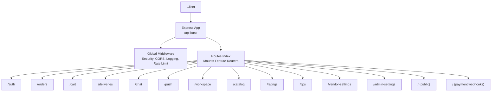
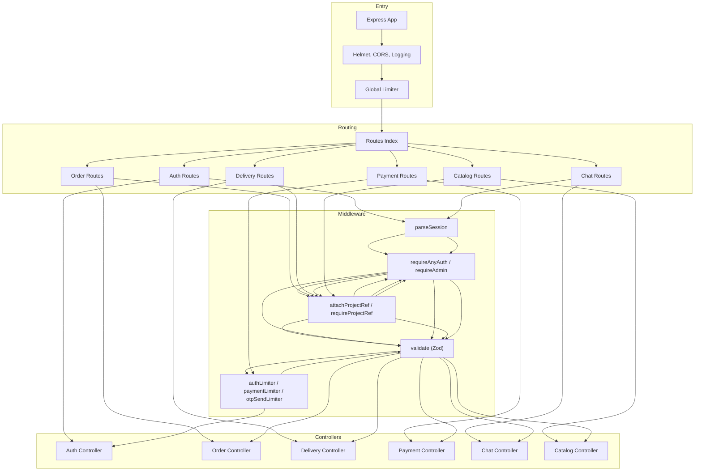
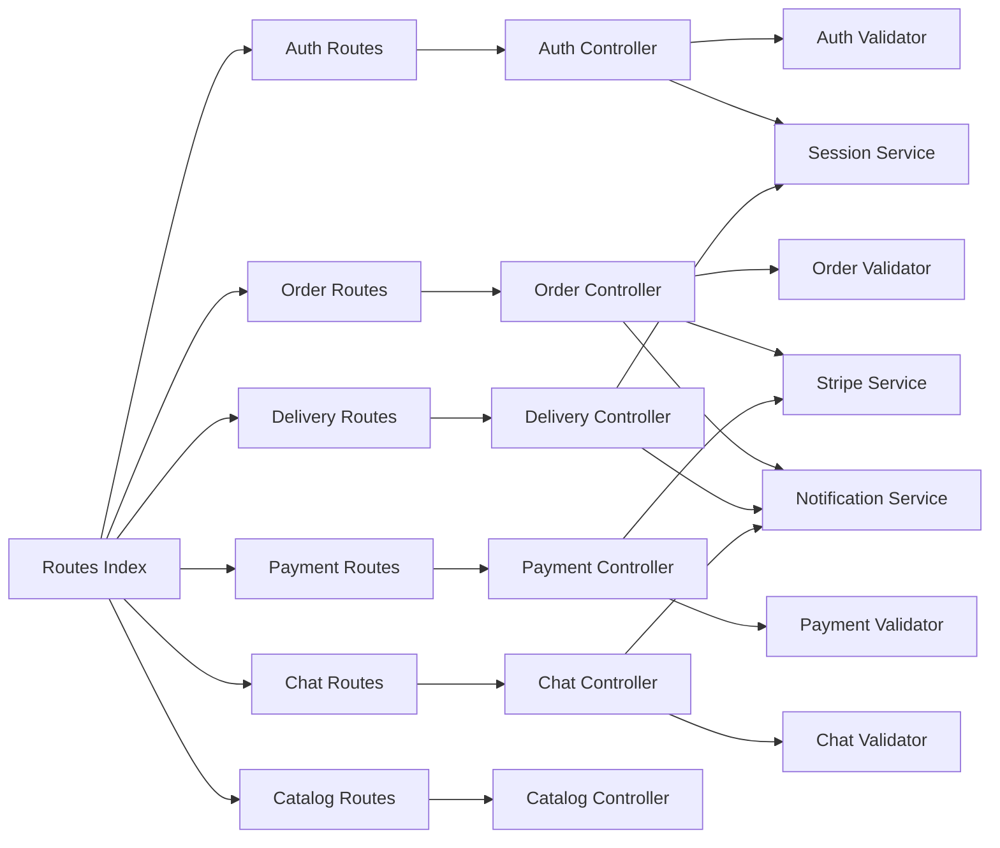
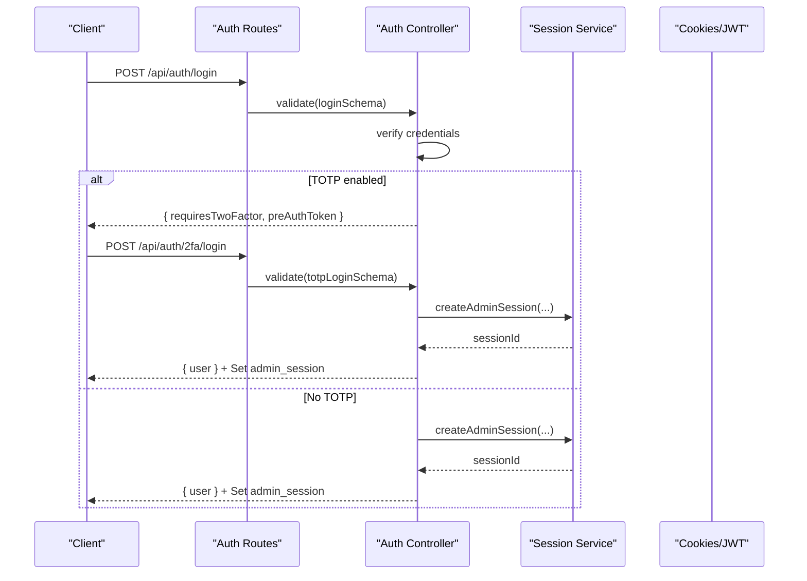
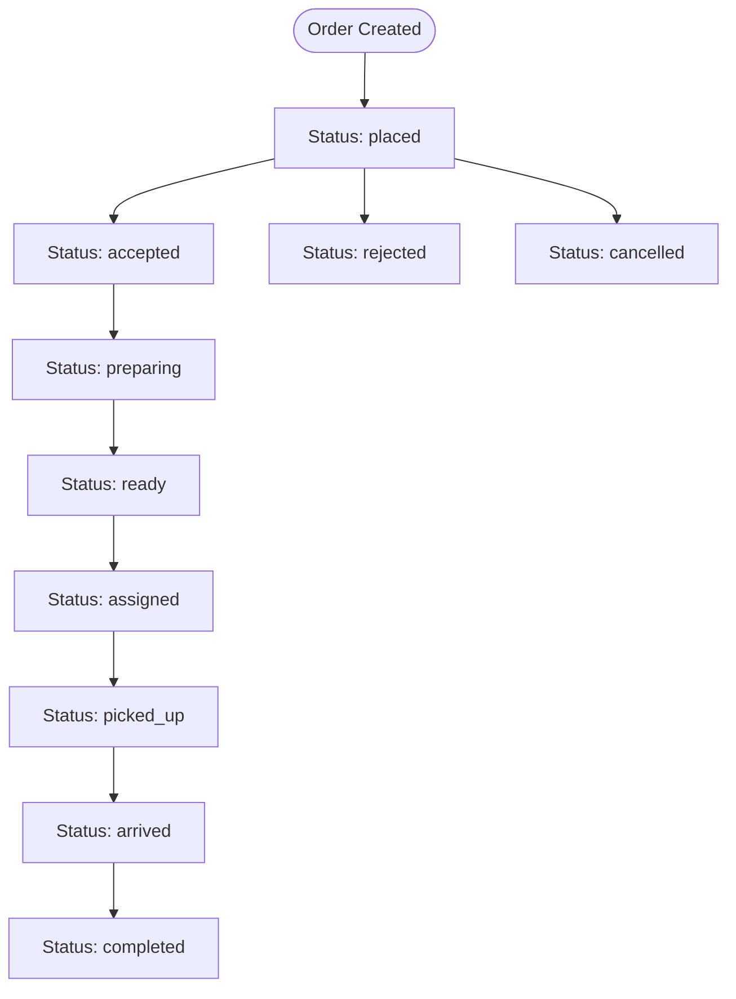

# Backend API Reference

<cite>
**Referenced Files in This Document**
- [apps/server/app.js](file://apps/server/app.js)
- [apps/server/routes/index.js](file://apps/server/routes/index.js)
- [apps/server/routes/auth.routes.js](file://apps/server/routes/auth.routes.js)
- [apps/server/routes/order.routes.js](file://apps/server/routes/order.routes.js)
- [apps/server/routes/chat.routes.js](file://apps/server/routes/chat.routes.js)
- [apps/server/routes/payment.routes.js](file://apps/server/routes/payment.routes.js)
- [apps/server/routes/delivery.routes.js](file://apps/server/routes/delivery.routes.js)
- [apps/server/routes/catalog.routes.js](file://apps/server/routes/catalog.routes.js)
- [apps/server/controllers/auth.controller.js](file://apps/server/controllers/auth.controller.js)
- [apps/server/controllers/order.controller.js](file://apps/server/controllers/order.controller.js)
- [apps/server/controllers/chat.controller.js](file://apps/server/controllers/chat.controller.js)
- [apps/server/controllers/payment.controller.js](file://apps/server/controllers/payment.controller.js)
- [apps/server/controllers/delivery.controller.js](file://apps/server/controllers/delivery.controller.js)
- [apps/server/controllers/catalog.controller.js](file://apps/server/controllers/catalog.controller.js)
- [apps/server/middleware/auth.middleware.js](file://apps/server/middleware/auth.middleware.js)
- [apps/server/middleware/rate-limit.middleware.js](file://apps/server/middleware/rate-limit.middleware.js)
- [apps/server/validators/auth.validator.js](file://apps/server/validators/auth.validator.js)
- [apps/server/validators/order.validator.js](file://apps/server/validators/order.validator.js)
- [apps/server/validators/chat.validator.js](file://apps/server/validators/chat.validator.js)
- [apps/server/validators/payment.validator.js](file://apps/server/validators/payment.validator.js)
</cite>

## Table of Contents
1. [Introduction](#introduction)
2. [Project Structure](#project-structure)
3. [Core Components](#core-components)
4. [Architecture Overview](#architecture-overview)
5. [Detailed Component Analysis](#detailed-component-analysis)
6. [Dependency Analysis](#dependency-analysis)
7. [Performance Considerations](#performance-considerations)
8. [Troubleshooting Guide](#troubleshooting-guide)
9. [Conclusion](#conclusion)
10. [Appendices](#appendices)

## Introduction
This document provides a comprehensive API reference for the Delivio backend. It covers all REST endpoints, authentication and authorization flows, request/response schemas, rate limiting, pagination, filtering, and integration points. The backend is built with Express and organized by feature-based routes and controllers, with shared middleware for authentication, rate limiting, and validation.

## Project Structure
The backend exposes a single API base path and mounts feature-specific route groups. Global middleware applies security headers, CORS, logging, and rate limiting. Payment webhooks are mounted separately to handle raw bodies.

**Diagram sources**
- [apps/server/app.js:67-68](file://apps/server/app.js#L67-L68)
- [apps/server/routes/index.js:33-52](file://apps/server/routes/index.js#L33-L52)

**Section sources**
- [apps/server/app.js:18-85](file://apps/server/app.js#L18-L85)
- [apps/server/routes/index.js:25-52](file://apps/server/routes/index.js#L25-L52)

## Core Components
- Authentication and sessions:
  - Admin and customer sessions via cookies and JWT bearer tokens.
  - Pre-authentication for 2FA and OTP flows.
- Authorization:
  - Role-based access control (admin, vendor, rider, customer).
  - Project-scoped tenant isolation via project reference.
- Rate limiting:
  - Global, auth, payments, and OTP-specific limits.
- Validation:
  - Zod schemas for all request bodies and query parameters.
- Real-time:
  - WebSocket broadcasts for order/chat updates.

**Section sources**
- [apps/server/middleware/auth.middleware.js:11-51](file://apps/server/middleware/auth.middleware.js#L11-L51)
- [apps/server/middleware/auth.middleware.js:56-96](file://apps/server/middleware/auth.middleware.js#L56-L96)
- [apps/server/middleware/rate-limit.middleware.js:16-57](file://apps/server/middleware/rate-limit.middleware.js#L16-L57)
- [apps/server/validators/auth.validator.js:5-62](file://apps/server/validators/auth.validator.js#L5-L62)
- [apps/server/validators/order.validator.js:5-65](file://apps/server/validators/order.validator.js#L5-L65)
- [apps/server/validators/chat.validator.js:6-22](file://apps/server/validators/chat.validator.js#L6-L22)
- [apps/server/validators/payment.validator.js:5-14](file://apps/server/validators/payment.validator.js#L5-L14)

## Architecture Overview
The API follows a layered architecture:
- Entry: Express app with security and logging.
- Routing: Feature routers mount under /api.
- Middleware: Auth parsing, role checks, project ref attachment, validation, rate limiting.
- Controllers: Business logic and integrations (notifications, Stripe, Supabase).
- Models and Services: Data access and third-party integrations.

**Diagram sources**
- [apps/server/app.js:18-85](file://apps/server/app.js#L18-L85)
- [apps/server/routes/index.js:25-52](file://apps/server/routes/index.js#L25-L52)
- [apps/server/middleware/auth.middleware.js:11-51](file://apps/server/middleware/auth.middleware.js#L11-L51)
- [apps/server/middleware/rate-limit.middleware.js:16-57](file://apps/server/middleware/rate-limit.middleware.js#L16-L57)
- [apps/server/controllers/auth.controller.js:26-62](file://apps/server/controllers/auth.controller.js#L26-L62)
- [apps/server/controllers/order.controller.js:30-46](file://apps/server/controllers/order.controller.js#L30-L46)
- [apps/server/controllers/delivery.controller.js:10-23](file://apps/server/controllers/delivery.controller.js#L10-L23)
- [apps/server/controllers/payment.controller.js:11-22](file://apps/server/controllers/payment.controller.js#L11-L22)
- [apps/server/controllers/chat.controller.js:12-51](file://apps/server/controllers/chat.controller.js#L12-L51)
- [apps/server/controllers/catalog.controller.js:8-15](file://apps/server/controllers/catalog.controller.js#L8-L15)

## Detailed Component Analysis

### Authentication Endpoints
- Base path: /api/auth
- Global rate limiter applies to all auth endpoints.

Endpoints:
- POST /login
  - Requires: loginSchema
  - Auth: none
  - Cookies: Sets admin_session on success
  - Responses:
    - 200: { user }
    - 400/401: { error }
- POST /logout
  - Requires: parseSession, admin session
  - Cookies: Clears admin_session
  - Responses: 200: { ok }
- GET /session
  - Requires: parseSession, requireAdmin
  - Responses: 200: { user }, 401: { error }
- POST /signup
  - Requires: signupSchema
  - Responses:
    - 201: { user }
    - 409: { error }
- POST /forgot-password
  - Requires: forgotPasswordSchema
  - Responses: 200: { ok }
- POST /reset-password
  - Requires: resetPasswordSchema
  - Responses: 200: { ok }, 400: { error }
- POST /otp/send
  - Requires: otpSendSchema
  - Rate limit: otpSendLimiter (per phone)
  - Responses: 200: { ok }, 429: { error }
- POST /otp/verify
  - Requires: otpVerifySchema
  - Cookies: Sets customer_session on success
  - Responses:
    - 200/201: { customer, created }
    - 400: { error }
- GET /customer/session
  - Requires: parseSession
  - Responses: 200: { customer }, 401: { error }
- POST /customer/logout
  - Requires: parseSession
  - Cookies: Clears customer_session
  - Responses: 200: { ok }
- POST /2fa/setup
  - Requires: parseSession, requireAdmin, totpSetupSchema
  - Responses: 200: { qrCode, secret }
- POST /2fa/verify
  - Requires: parseSession, requireAdmin, totpVerifySchema
  - Responses: 200: { ok }
- POST /2fa/login
  - Requires: totpLoginSchema
  - Responses:
    - 200: { user }
    - 400: { error }

Validation schemas:
- loginSchema: email, password
- signupSchema: email, password, role, projectRef
- forgotPasswordSchema: email
- resetPasswordSchema: token, password
- otpSendSchema: phone (E.164), projectRef
- otpVerifySchema: phone (E.164), code (6), projectRef, optional name, email
- totpSetupSchema: password
- totpVerifySchema: token (6)
- totpLoginSchema: sessionToken, totpToken

Authentication flow highlights:
- Admin login supports optional 2FA. If enabled, login returns requiresTwoFactor with a short-lived pre-auth token for TOTP verification.
- Customer login uses OTP with SMS. On success, a customer session cookie is set.
- JWT bearer tokens are supported for API clients and mobile.

**Section sources**
- [apps/server/routes/auth.routes.js:15-34](file://apps/server/routes/auth.routes.js#L15-L34)
- [apps/server/controllers/auth.controller.js:26-62](file://apps/server/controllers/auth.controller.js#L26-L62)
- [apps/server/controllers/auth.controller.js:101-140](file://apps/server/controllers/auth.controller.js#L101-L140)
- [apps/server/controllers/auth.controller.js:144-232](file://apps/server/controllers/auth.controller.js#L144-L232)
- [apps/server/controllers/auth.controller.js:236-313](file://apps/server/controllers/auth.controller.js#L236-L313)
- [apps/server/validators/auth.validator.js:5-62](file://apps/server/validators/auth.validator.js#L5-L62)
- [apps/server/middleware/rate-limit.middleware.js:46-57](file://apps/server/middleware/rate-limit.middleware.js#L46-L57)

### Order Management Endpoints
- Base path: /api/orders
- Requires: attachProjectRef, requireProjectRef, requireAnyAuth

Endpoints:
- GET /
  - Requires: listOrdersSchema (query)
  - Filters: status, customerId, limit, offset
  - Responses: 200: { orders }
- POST /
  - Requires: requireAdmin, createOrderSchema
  - Internal use (e.g., Stripe webhook)
  - Responses:
    - 201: { order }
    - 400/403: { error }
- GET /:id
  - Responses:
    - 200: { order }
    - 404: { error }
- PATCH /:id/status
  - Requires: requireRole('admin','vendor'), updateStatusSchema
  - Responses:
    - 200: { order }
    - 400/403: { error }
- POST /:id/refund
  - Requires: requireRole('admin','vendor'), refundSchema
  - Responses:
    - 200: { ok, refundAmount }
    - 400/403: { error }
- POST /:id/cancel
  - Requires: cancelSchema
  - Responses:
    - 200: { ok }
    - 400/403: { error }
- POST /:id/accept
  - Requires: requireRole('vendor','admin'), acceptSchema
  - Responses:
    - 200: { order }
    - 400/403: { error }
- POST /:id/reject
  - Requires: requireRole('vendor','admin'), rejectSchema
  - Responses:
    - 200: { order }
    - 400/403: { error }
- POST /:id/extend-sla
  - Requires: requireRole('vendor','admin'), extendSlaSchema
  - Responses:
    - 200: { ok, newDeadline }
    - 400/403: { error }
- POST /:id/complete
  - Requires: requireRole('rider','admin')
  - Responses:
    - 200: { order }
    - 400/403: { error }

Validation schemas:
- createOrderSchema: items[], totalCents, optional paymentIntentId, scheduledFor, optional customerId
- updateStatusSchema: status enum
- refundSchema: amountCents optional, reason optional
- cancelSchema: reason optional, initiator optional
- listOrdersSchema: status optional, customerId optional, limit max 100, offset min 0
- acceptSchema: prepTimeMinutes 5–120 optional
- rejectSchema: reason max 500 optional
- extendSlaSchema: additionalMinutes 5–60 optional

Authorization and tenant isolation:
- All endpoints enforce projectRef matching.
- Access checks vary by role and relationship to the order (e.g., customer can cancel/list own orders).

Real-time and notifications:
- Status transitions broadcast via WebSocket.
- Customer notifications sent for status changes.

**Section sources**
- [apps/server/routes/order.routes.js:12-36](file://apps/server/routes/order.routes.js#L12-L36)
- [apps/server/controllers/order.controller.js:30-82](file://apps/server/controllers/order.controller.js#L30-L82)
- [apps/server/controllers/order.controller.js:142-191](file://apps/server/controllers/order.controller.js#L142-L191)
- [apps/server/controllers/order.controller.js:195-234](file://apps/server/controllers/order.controller.js#L195-L234)
- [apps/server/controllers/order.controller.js:238-296](file://apps/server/controllers/order.controller.js#L238-L296)
- [apps/server/controllers/order.controller.js:299-342](file://apps/server/controllers/order.controller.js#L299-L342)
- [apps/server/controllers/order.controller.js:346-398](file://apps/server/controllers/order.controller.js#L346-L398)
- [apps/server/controllers/order.controller.js:402-452](file://apps/server/controllers/order.controller.js#L402-L452)
- [apps/server/validators/order.validator.js:12-54](file://apps/server/validators/order.validator.js#L12-L54)
- [apps/server/middleware/auth.middleware.js:56-96](file://apps/server/middleware/auth.middleware.js#L56-L96)

### Chat System Endpoints
- Base path: /api/chat
- Requires: parseSession, requireAnyAuth, attachProjectRef, requireProjectRef

Endpoints:
- POST /conversations
  - Requires: createConversationSchema
  - Types: customer_vendor, vendor_rider
  - Responses:
    - 200/201: { conversation }
    - 400/403: { error }
- GET /conversations
  - Responses: 200: { conversations }
- GET /conversations/:id/messages
  - Requires: listMessagesSchema (query)
  - Pagination: page (default 1)
  - Responses:
    - 200: { messages, page, pageSize }
    - 403/404: { error }
- POST /conversations/:id/messages
  - Requires: sendMessageSchema
  - Enforces max message length
  - Responses:
    - 201: { message }
    - 400/403: { error }
- PATCH /conversations/:id/read
  - Responses: 200: { ok }

Validation schemas:
- createConversationSchema: orderId (UUID), type enum
- sendMessageSchema: content min 1, max N (from config)
- listMessagesSchema: page default 1

Real-time and notifications:
- Messages broadcast to participants via WebSocket.
- Push notifications sent when recipient is offline.

**Section sources**
- [apps/server/routes/chat.routes.js:12-18](file://apps/server/routes/chat.routes.js#L12-L18)
- [apps/server/controllers/chat.controller.js:12-51](file://apps/server/controllers/chat.controller.js#L12-L51)
- [apps/server/controllers/chat.controller.js:63-86](file://apps/server/controllers/chat.controller.js#L63-L86)
- [apps/server/controllers/chat.controller.js:88-140](file://apps/server/controllers/chat.controller.js#L88-L140)
- [apps/server/controllers/chat.controller.js:142-171](file://apps/server/controllers/chat.controller.js#L142-L171)
- [apps/server/validators/chat.validator.js:6-22](file://apps/server/validators/chat.validator.js#L6-L22)

### Payment Processing Endpoints
- Base path: /api (mounted at /api/webhooks/stripe and /api/payments/create-intent)
- Stripe webhook:
  - Path: POST /api/webhooks/stripe
  - Uses raw body middleware to preserve payload for signature verification.
  - Responses: 200: { received: true }, 400: { error }

- Payments:
  - POST /payments/create-intent
  - Requires: paymentLimiter, parseSession, requireAnyAuth, attachProjectRef, createIntentSchema
  - Responses: 200: { client_secret, payment_intent_id }

Validation schemas:
- createIntentSchema: amountCents, currency default gbp, optional metadata record

Security and idempotency:
- Webhook signature verification is performed.
- Duplicate events are recorded and ignored.

**Section sources**
- [apps/server/routes/payment.routes.js:14-35](file://apps/server/routes/payment.routes.js#L14-L35)
- [apps/server/controllers/payment.controller.js:29-106](file://apps/server/controllers/payment.controller.js#L29-L106)
- [apps/server/validators/payment.validator.js:5-14](file://apps/server/validators/payment.validator.js#L5-L14)
- [apps/server/app.js:40-43](file://apps/server/app.js#L40-L43)

### Delivery Coordination Endpoints
- Base path: /api/deliveries
- Requires: attachProjectRef, requireProjectRef, requireAdmin

Rider-specific:
- GET /rider/deliveries
  - Requires: requireRole('rider','admin'), listDeliveriesSchema (query)
  - Special case: status=pending lists available deliveries
  - Responses: 200: { deliveries }
- POST /:id/claim
  - Requires: requireRole('rider','admin')
  - Responses:
    - 200: { delivery }
    - 404/409: { error }
- POST /rider/location
  - Requires: requireRole('rider','admin'), location update schema
  - Responses: 200: { ok }

Status and location:
- POST /:id/status
  - Requires: requireRole('rider','admin'), updateDeliveryStatusSchema
  - Responses: 200: { delivery }
- POST /:id/location
  - Requires: requireRole('rider','admin'), locationUpdateSchema
  - Rate limit: location updates throttled
  - Responses: 200: { ok }
- GET /:id/location
  - Requires: requireRole('rider','admin','vendor')
  - Responses:
    - 200: { location }
    - 404: { error }
- POST /:id/arrived
  - Requires: requireRole('rider','admin')
  - Responses: 200: { delivery }

Vendor/Admin assignment:
- POST /:id/assign
  - Requires: requireRole('vendor','admin')
  - Responses: 200: { delivery }
- POST /:id/reassign
  - Requires: requireRole('vendor','admin')
  - Responses: 200: { ok }
- POST /:id/assign-external
  - Requires: requireRole('vendor','admin'), assignExternalSchema
  - Responses: 200: { ok }

**Section sources**
- [apps/server/routes/delivery.routes.js:12-28](file://apps/server/routes/delivery.routes.js#L12-L28)
- [apps/server/controllers/delivery.controller.js:10-52](file://apps/server/controllers/delivery.controller.js#L10-L52)
- [apps/server/controllers/delivery.controller.js:54-78](file://apps/server/controllers/delivery.controller.js#L54-L78)
- [apps/server/controllers/delivery.controller.js:80-114](file://apps/server/controllers/delivery.controller.js#L80-L114)
- [apps/server/controllers/delivery.controller.js:133-142](file://apps/server/controllers/delivery.controller.js#L133-L142)
- [apps/server/controllers/delivery.controller.js:146-181](file://apps/server/controllers/delivery.controller.js#L146-L181)
- [apps/server/controllers/delivery.controller.js:185-220](file://apps/server/controllers/delivery.controller.js#L185-L220)
- [apps/server/controllers/delivery.controller.js:224-258](file://apps/server/controllers/delivery.controller.js#L224-L258)
- [apps/server/controllers/delivery.controller.js:262-299](file://apps/server/controllers/delivery.controller.js#L262-L299)

### Catalog Management Endpoints
- Base path: /api/catalog
- Requires: attachProjectRef, requireProjectRef, requireRole('vendor','admin')

Categories:
- GET /categories
  - Responses: 200: { categories }
- POST /categories
  - Requires: createCategorySchema
  - Responses:
    - 201: { category }
    - 400/404: { error }
- PATCH /categories/:id
  - Requires: updateCategorySchema
  - Responses: 200: { category }, 404: { error }
- DELETE /categories/:id
  - Responses: 200: { ok }

Products:
- GET /products
  - Query: includeUnavailable=false disables filtering
  - Responses: 200: { products }
- POST /products
  - Requires: createProductSchema
  - Responses:
    - 201: { product }
    - 400/404: { error }
- PATCH /products/:id
  - Requires: updateProductSchema
  - Responses: 200: { product }, 404: { error }
- DELETE /products/:id
  - Responses: 200: { ok }

**Section sources**
- [apps/server/routes/catalog.routes.js:12-24](file://apps/server/routes/catalog.routes.js#L12-L24)
- [apps/server/controllers/catalog.controller.js:8-15](file://apps/server/controllers/catalog.controller.js#L8-L15)
- [apps/server/controllers/catalog.controller.js:17-45](file://apps/server/controllers/catalog.controller.js#L17-L45)
- [apps/server/controllers/catalog.controller.js:47-55](file://apps/server/controllers/catalog.controller.js#L47-L55)
- [apps/server/controllers/catalog.controller.js:57-86](file://apps/server/controllers/catalog.controller.js#L57-L86)

### Additional Routes
- Ratings, tips, vendor-settings, admin-settings are mounted with appropriate auth and project ref middleware.
- Public routes are mounted without authentication.

**Section sources**
- [apps/server/routes/index.js:43-52](file://apps/server/routes/index.js#L43-L52)

## Dependency Analysis
Key dependencies and relationships:
- Route mounting depends on middleware composition (auth, project ref, validation).
- Controllers depend on models, services (Stripe, notifications, Supabase), and middleware for authorization.
- Payment webhook depends on raw body handling and idempotency records.

**Diagram sources**
- [apps/server/routes/index.js:33-52](file://apps/server/routes/index.js#L33-L52)
- [apps/server/controllers/auth.controller.js:11-14](file://apps/server/controllers/auth.controller.js#L11-L14)
- [apps/server/controllers/order.controller.js:7-14](file://apps/server/controllers/order.controller.js#L7-L14)
- [apps/server/controllers/delivery.controller.js:3-7](file://apps/server/controllers/delivery.controller.js#L3-L7)
- [apps/server/controllers/payment.controller.js:3-8](file://apps/server/controllers/payment.controller.js#L3-L8)
- [apps/server/controllers/chat.controller.js:6-10](file://apps/server/controllers/chat.controller.js#L6-L10)
- [apps/server/validators/auth.validator.js:5-62](file://apps/server/validators/auth.validator.js#L5-L62)
- [apps/server/validators/order.validator.js:5-65](file://apps/server/validators/order.validator.js#L5-L65)
- [apps/server/validators/chat.validator.js:6-22](file://apps/server/validators/chat.validator.js#L6-L22)
- [apps/server/validators/payment.validator.js:5-14](file://apps/server/validators/payment.validator.js#L5-L14)

**Section sources**
- [apps/server/routes/index.js:33-52](file://apps/server/routes/index.js#L33-L52)
- [apps/server/controllers/order.controller.js:7-14](file://apps/server/controllers/order.controller.js#L7-L14)
- [apps/server/controllers/delivery.controller.js:3-7](file://apps/server/controllers/delivery.controller.js#L3-L7)
- [apps/server/controllers/payment.controller.js:3-8](file://apps/server/controllers/payment.controller.js#L3-L8)
- [apps/server/controllers/chat.controller.js:6-10](file://apps/server/controllers/chat.controller.js#L6-L10)
- [apps/server/controllers/auth.controller.js:11-14](file://apps/server/controllers/auth.controller.js#L11-L14)

## Performance Considerations
- Rate limiting:
  - Global: 100 requests per minute per IP.
  - Auth: 20 requests per minute per IP.
  - Payments: 30 requests per minute per IP.
  - OTP send: 3 requests per phone per 15 minutes.
- Body parsing:
  - JSON/URL-encoded bodies with size limits.
  - Payment webhook uses raw body to preserve payload integrity.
- Pagination:
  - Orders listing supports limit (max 100) and offset.
  - Chat messages support page-based pagination with fixed page size.
- Caching and broadcasting:
  - Location updates cached and broadcast via WebSocket to reduce database load.
- Idempotency:
  - Stripe webhook deduplicates events by recording event IDs.

**Section sources**
- [apps/server/middleware/rate-limit.middleware.js:16-57](file://apps/server/middleware/rate-limit.middleware.js#L16-L57)
- [apps/server/app.js:40-43](file://apps/server/app.js#L40-L43)
- [apps/server/controllers/order.controller.js:32-42](file://apps/server/controllers/order.controller.js#L32-L42)
- [apps/server/controllers/chat.controller.js:81-82](file://apps/server/controllers/chat.controller.js#L81-L82)
- [apps/server/controllers/payment.controller.js:42-46](file://apps/server/controllers/payment.controller.js#L42-L46)

## Troubleshooting Guide
Common errors and resolutions:
- Authentication failures:
  - 401 Authentication required: Ensure admin_session cookie or Authorization Bearer token is present and valid.
  - 403 Insufficient permissions: Verify role matches required roles (admin, vendor, rider).
- Project reference mismatch:
  - 403 Access denied: Confirm projectRef matches the authenticated session and resource.
- Validation errors:
  - 400 Bad Request: Review Zod schema constraints (e.g., enums, lengths, numeric ranges).
- Rate limiting:
  - 429 Too Many Requests: Respect per-route limits; retry after Retry-After header.
- Delivery race conditions:
  - 409 Could not claim/assign: Retrying after a delay may resolve transient conflicts.
- Chat access:
  - 403 Not a participant: Ensure caller is a participant in the conversation.

Operational checks:
- Health checks are logged conditionally and do not trigger logging for the health endpoint.
- Sentry integration is initialized when enabled.

**Section sources**
- [apps/server/middleware/auth.middleware.js:56-96](file://apps/server/middleware/auth.middleware.js#L56-L96)
- [apps/server/controllers/order.controller.js:54-59](file://apps/server/controllers/order.controller.js#L54-L59)
- [apps/server/controllers/chat.controller.js:73-79](file://apps/server/controllers/chat.controller.js#L73-L79)
- [apps/server/middleware/rate-limit.middleware.js:6-11](file://apps/server/middleware/rate-limit.middleware.js#L6-L11)
- [apps/server/controllers/delivery.controller.js:34-35](file://apps/server/controllers/delivery.controller.js#L34-L35)
- [apps/server/app.js:32-37](file://apps/server/app.js#L32-L37)

## Conclusion
The Delivio backend provides a robust, role-aware API with strong tenant isolation, comprehensive validation, and real-time updates. Authentication supports both session cookies and JWT, while rate limiting and idempotency safeguards protect the system. The modular route/controller structure enables clear separation of concerns across authentication, orders, chat, payments, deliveries, and catalog management.

## Appendices

### Authentication Flows

**Diagram sources**
- [apps/server/routes/auth.routes.js:16-34](file://apps/server/routes/auth.routes.js#L16-L34)
- [apps/server/controllers/auth.controller.js:26-62](file://apps/server/controllers/auth.controller.js#L26-L62)
- [apps/server/controllers/auth.controller.js:279-313](file://apps/server/controllers/auth.controller.js#L279-L313)

### Order Lifecycle Flow

[No sources needed since this diagram shows conceptual workflow, not actual code structure]

### Endpoint Catalog
- Authentication
  - POST /api/auth/login
  - POST /api/auth/logout
  - GET /api/auth/session
  - POST /api/auth/signup
  - POST /api/auth/forgot-password
  - POST /api/auth/reset-password
  - POST /api/auth/otp/send
  - POST /api/auth/otp/verify
  - GET /api/auth/customer/session
  - POST /api/auth/customer/logout
  - POST /api/auth/2fa/setup
  - POST /api/auth/2fa/verify
  - POST /api/auth/2fa/login
- Orders
  - GET /api/orders/
  - POST /api/orders/
  - GET /api/orders/:id
  - PATCH /api/orders/:id/status
  - POST /api/orders/:id/refund
  - POST /api/orders/:id/cancel
  - POST /api/orders/:id/accept
  - POST /api/orders/:id/reject
  - POST /api/orders/:id/extend-sla
  - POST /api/orders/:id/complete
- Chat
  - POST /api/chat/conversations
  - GET /api/chat/conversations
  - GET /api/chat/conversations/:id/messages
  - POST /api/chat/conversations/:id/messages
  - PATCH /api/chat/conversations/:id/read
- Payments
  - POST /api/webhooks/stripe
  - POST /api/payments/create-intent
- Deliveries
  - GET /api/deliveries/rider/deliveries
  - POST /api/deliveries/:id/claim
  - POST /api/deliveries/rider/location
  - POST /api/deliveries/:id/status
  - POST /api/deliveries/:id/location
  - GET /api/deliveries/:id/location
  - POST /api/deliveries/:id/arrived
  - POST /api/deliveries/:id/assign
  - POST /api/deliveries/:id/reassign
  - POST /api/deliveries/:id/assign-external
- Catalog
  - GET /api/catalog/categories
  - POST /api/catalog/categories
  - PATCH /api/catalog/categories/:id
  - DELETE /api/catalog/categories/:id
  - GET /api/catalog/products
  - POST /api/catalog/products
  - PATCH /api/catalog/products/:id
  - DELETE /api/catalog/products/:id

[No sources needed since this section catalogs endpoints without analyzing specific files]