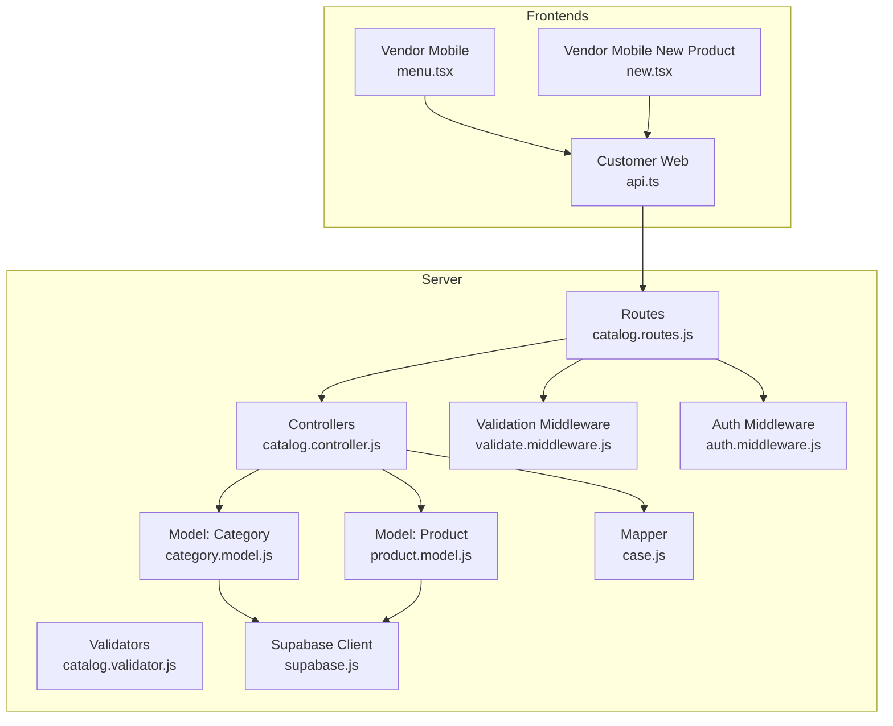
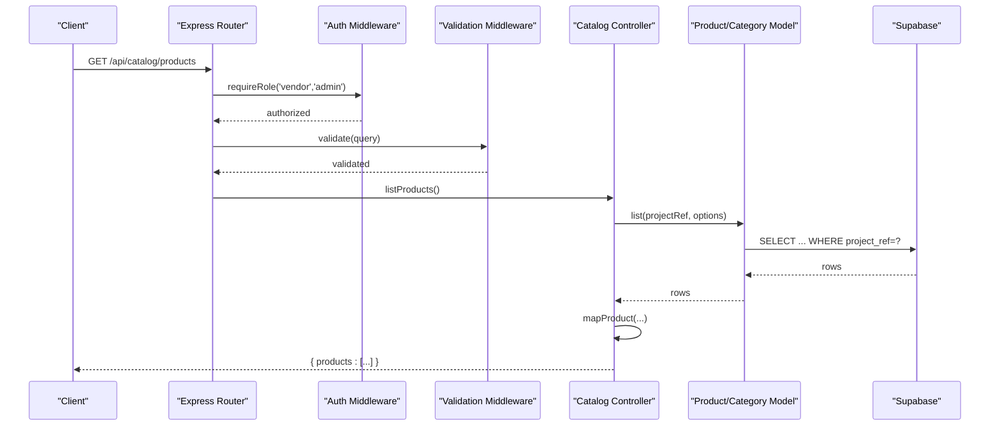
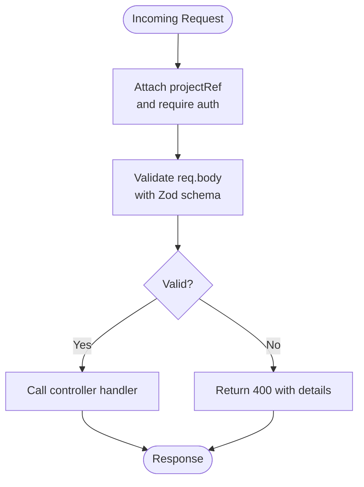
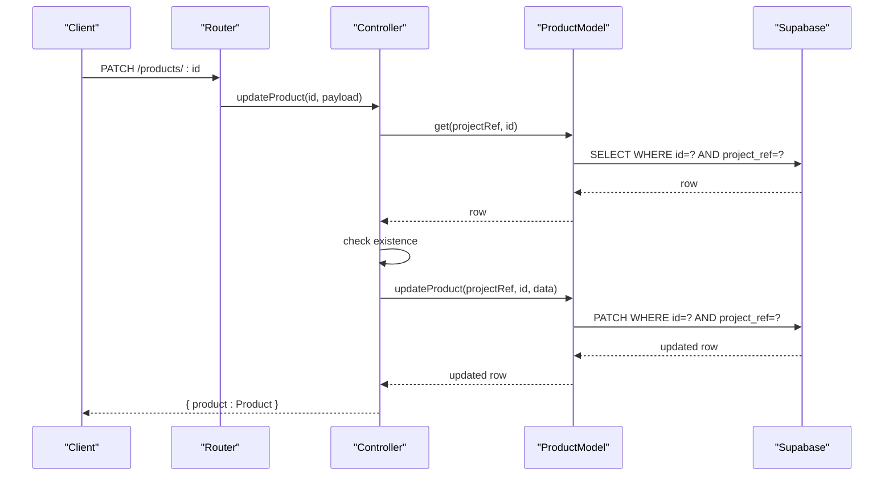
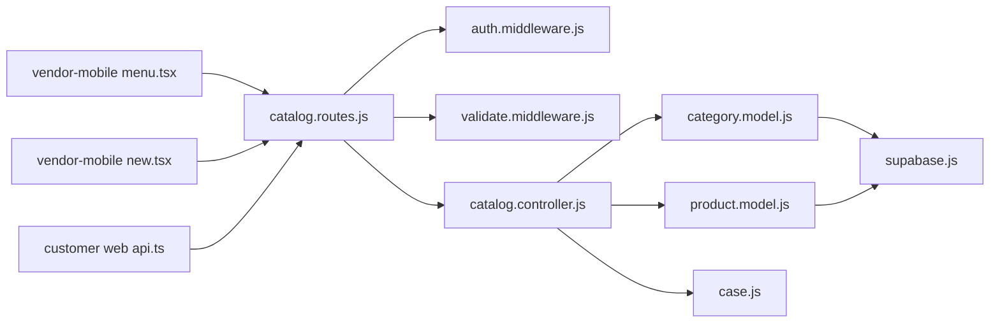

# Catalog & Menu Management

<cite>
**Referenced Files in This Document**
- [catalog.controller.js](file://apps/server/controllers/catalog.controller.js)
- [catalog.routes.js](file://apps/server/routes/catalog.routes.js)
- [catalog.validator.js](file://apps/server/validators/catalog.validator.js)
- [category.model.js](file://apps/server/models/category.model.js)
- [product.model.js](file://apps/server/models/product.model.js)
- [case.js](file://apps/server/lib/case.js)
- [validate.middleware.js](file://apps/server/middleware/validate.middleware.js)
- [auth.middleware.js](file://apps/server/middleware/auth.middleware.js)
- [supabase.js](file://apps/server/lib/supabase.js)
- [014_catalog.sql](file://apps/server/migrations/014_catalog.sql)
- [015_seed.sql](file://apps/server/migrations/015_seed.sql)
- [index.ts](file://packages/types/src/index.ts)
- [menu.tsx](file://apps/vendor-mobile/src/app/(tabs)/menu.tsx)
- [new.tsx](file://apps/vendor-mobile/src/app/product/new.tsx)
- [api.ts](file://apps/customer/src/lib/api.ts)
- [api.ts](file://apps/vendor-mobile/src/lib/api.ts)
</cite>

## Table of Contents
1. [Introduction](#introduction)
2. [Project Structure](#project-structure)
3. [Core Components](#core-components)
4. [Architecture Overview](#architecture-overview)
5. [Detailed Component Analysis](#detailed-component-analysis)
6. [Dependency Analysis](#dependency-analysis)
7. [Performance Considerations](#performance-considerations)
8. [Troubleshooting Guide](#troubleshooting-guide)
9. [Conclusion](#conclusion)
10. [Appendices](#appendices)

## Introduction
This document provides comprehensive API documentation for catalog and menu management endpoints. It covers product and category lifecycle operations, validation rules, data schemas, and integration patterns. It also outlines inventory management via availability toggles, pricing updates, and image handling. While bulk operations, import/export, and cross-platform synchronization are not implemented in the current codebase, this document explains how to extend the system to support these features safely.

## Project Structure
The catalog and menu management system is implemented in the server application and consumed by vendor and customer frontends. Key components include:
- Routes: Define endpoint contracts and middleware
- Controllers: Orchestrate requests and responses
- Validators: Enforce input constraints
- Models: Interact with the Supabase database
- Migrations: Define canonical schema for categories and products
- Types: Shared TypeScript interfaces for client-side consumption

**Diagram sources**
- [catalog.routes.js:1-28](file://apps/server/routes/catalog.routes.js#L1-L28)
- [catalog.controller.js:1-99](file://apps/server/controllers/catalog.controller.js#L1-L99)
- [catalog.validator.js:1-42](file://apps/server/validators/catalog.validator.js#L1-L42)
- [category.model.js:1-50](file://apps/server/models/category.model.js#L1-L50)
- [product.model.js:1-67](file://apps/server/models/product.model.js#L1-L67)
- [case.js:1-52](file://apps/server/lib/case.js#L1-L52)
- [validate.middleware.js:1-28](file://apps/server/middleware/validate.middleware.js#L1-L28)
- [auth.middleware.js:1-123](file://apps/server/middleware/auth.middleware.js#L1-L123)
- [supabase.js:1-151](file://apps/server/lib/supabase.js#L1-L151)
- [menu.tsx](file://apps/vendor-mobile/src/app/(tabs)/menu.tsx#L1-L76)
- [new.tsx:105-139](file://apps/vendor-mobile/src/app/product/new.tsx#L105-L139)
- [api.ts:1-11](file://apps/customer/src/lib/api.ts#L1-L11)

**Section sources**
- [catalog.routes.js:1-28](file://apps/server/routes/catalog.routes.js#L1-L28)
- [catalog.controller.js:1-99](file://apps/server/controllers/catalog.controller.js#L1-L99)
- [catalog.validator.js:1-42](file://apps/server/validators/catalog.validator.js#L1-L42)
- [category.model.js:1-50](file://apps/server/models/category.model.js#L1-L50)
- [product.model.js:1-67](file://apps/server/models/product.model.js#L1-L67)
- [case.js:1-52](file://apps/server/lib/case.js#L1-L52)
- [validate.middleware.js:1-28](file://apps/server/middleware/validate.middleware.js#L1-L28)
- [auth.middleware.js:1-123](file://apps/server/middleware/auth.middleware.js#L1-L123)
- [supabase.js:1-151](file://apps/server/lib/supabase.js#L1-L151)
- [014_catalog.sql:1-34](file://apps/server/migrations/014_catalog.sql#L1-L34)
- [015_seed.sql:126-187](file://apps/server/migrations/015_seed.sql#L126-L187)
- [index.ts:212-235](file://packages/types/src/index.ts#L212-L235)
- [menu.tsx](file://apps/vendor-mobile/src/app/(tabs)/menu.tsx#L1-L76)
- [new.tsx:105-139](file://apps/vendor-mobile/src/app/product/new.tsx#L105-L139)
- [api.ts:1-11](file://apps/customer/src/lib/api.ts#L1-L11)
- [api.ts:1-12](file://apps/vendor-mobile/src/lib/api.ts#L1-L12)

## Core Components
- Routes define the endpoint contracts for categories and products, apply authentication and validation middleware, and delegate to controllers.
- Controllers handle request orchestration, call models for persistence, and return mapped responses.
- Validators enforce strict input constraints using Zod schemas.
- Models encapsulate database operations via Supabase REST helpers.
- Mapper utilities normalize row data into domain-friendly shapes.
- Middleware enforces role-based access and validates request bodies.

Key responsibilities:
- Categories: list, create, update, delete
- Products: list, create, update, delete
- Inventory: availability flag controls visibility
- Pricing: cents-based integer pricing model
- Images: optional URL field for product imagery

**Section sources**
- [catalog.routes.js:10-25](file://apps/server/routes/catalog.routes.js#L10-L25)
- [catalog.controller.js:8-97](file://apps/server/controllers/catalog.controller.js#L8-L97)
- [catalog.validator.js:5-40](file://apps/server/validators/catalog.validator.js#L5-L40)
- [category.model.js:12-45](file://apps/server/models/category.model.js#L12-L45)
- [product.model.js:12-62](file://apps/server/models/product.model.js#L12-L62)
- [case.js:3-30](file://apps/server/lib/case.js#L3-L30)
- [validate.middleware.js:9-25](file://apps/server/middleware/validate.middleware.js#L9-L25)
- [auth.middleware.js:66-76](file://apps/server/middleware/auth.middleware.js#L66-L76)

## Architecture Overview
The catalog module follows a layered architecture:
- Presentation: Express routes
- Application: Controllers
- Domain: Validators and mappers
- Infrastructure: Supabase client and database

**Diagram sources**
- [catalog.routes.js:12-24](file://apps/server/routes/catalog.routes.js#L12-L24)
- [auth.middleware.js:66-76](file://apps/server/middleware/auth.middleware.js#L66-L76)
- [validate.middleware.js:9-25](file://apps/server/middleware/validate.middleware.js#L9-L25)
- [catalog.controller.js:47-55](file://apps/server/controllers/catalog.controller.js#L47-L55)
- [product.model.js:12-19](file://apps/server/models/product.model.js#L12-L19)
- [supabase.js:107-117](file://apps/server/lib/supabase.js#L107-L117)

## Detailed Component Analysis

### API Endpoints

#### Categories
- List categories
  - Method: GET
  - Path: /api/catalog/categories
  - Auth: vendor or admin
  - Query: none
  - Response: { categories: [Category] }
  - Validation: none
  - Implementation: [catalog.controller.js:8-15](file://apps/server/controllers/catalog.controller.js#L8-L15), [category.model.js:12-17](file://apps/server/models/category.model.js#L12-L17)

- Create category
  - Method: POST
  - Path: /api/catalog/categories
  - Auth: vendor or admin
  - Body: CreateCategoryPayload
  - Response: { category: Category }
  - Validation: CreateCategorySchema
  - Implementation: [catalog.controller.js:17-24](file://apps/server/controllers/catalog.controller.js#L17-L24), [category.model.js:19-31](file://apps/server/models/category.model.js#L19-L31), [catalog.validator.js:5-8](file://apps/server/validators/catalog.validator.js#L5-L8)

- Update category
  - Method: PATCH
  - Path: /api/catalog/categories/:id
  - Auth: vendor or admin
  - Params: id
  - Body: UpdateCategoryPayload
  - Response: { category: Category }
  - Validation: UpdateCategorySchema
  - Implementation: [catalog.controller.js:26-35](file://apps/server/controllers/catalog.controller.js#L26-L35), [category.model.js:33-41](file://apps/server/models/category.model.js#L33-L41), [catalog.validator.js:10-13](file://apps/server/validators/catalog.validator.js#L10-L13)

- Delete category
  - Method: DELETE
  - Path: /api/catalog/categories/:id
  - Auth: vendor or admin
  - Params: id
  - Response: { ok: true }
  - Implementation: [catalog.controller.js:37-45](file://apps/server/controllers/catalog.controller.js#L37-L45), [category.model.js:43-45](file://apps/server/models/category.model.js#L43-L45)

#### Products
- List products
  - Method: GET
  - Path: /api/catalog/products
  - Auth: vendor or admin
  - Query: includeUnavailable? boolean (default true)
  - Response: { products: [Product] }
  - Implementation: [catalog.controller.js:47-55](file://apps/server/controllers/catalog.controller.js#L47-L55), [product.model.js:12-19](file://apps/server/models/product.model.js#L12-L19)

- Create product
  - Method: POST
  - Path: /api/catalog/products
  - Auth: vendor or admin
  - Body: CreateProductPayload
  - Response: { product: Product }
  - Validation: CreateProductSchema
  - Implementation: [catalog.controller.js:57-64](file://apps/server/controllers/catalog.controller.js#L57-L64), [product.model.js:26-43](file://apps/server/models/product.model.js#L26-L43), [catalog.validator.js:15-23](file://apps/server/validators/catalog.validator.js#L15-L23)

- Update product
  - Method: PATCH
  - Path: /api/catalog/products/:id
  - Auth: vendor or admin
  - Params: id
  - Body: UpdateProductPayload
  - Response: { product: Product }
  - Validation: UpdateProductSchema
  - Implementation: [catalog.controller.js:66-76](file://apps/server/controllers/catalog.controller.js#L66-L76), [product.model.js:45-58](file://apps/server/models/product.model.js#L45-L58), [catalog.validator.js:25-33](file://apps/server/validators/catalog.validator.js#L25-L33)

- Delete product
  - Method: DELETE
  - Path: /api/catalog/products/:id
  - Auth: vendor or admin
  - Params: id
  - Response: { ok: true }
  - Implementation: [catalog.controller.js:78-86](file://apps/server/controllers/catalog.controller.js#L78-L86), [product.model.js:60-62](file://apps/server/models/product.model.js#L60-L62)

**Section sources**
- [catalog.routes.js:14-24](file://apps/server/routes/catalog.routes.js#L14-L24)
- [catalog.controller.js:8-97](file://apps/server/controllers/catalog.controller.js#L8-L97)
- [catalog.validator.js:5-40](file://apps/server/validators/catalog.validator.js#L5-L40)
- [category.model.js:12-45](file://apps/server/models/category.model.js#L12-L45)
- [product.model.js:12-62](file://apps/server/models/product.model.js#L12-L62)

### Data Schemas

#### Category
- Fields
  - id: string (UUID)
  - projectRef: string
  - name: string (1–80 chars)
  - sortOrder: number (0–10,000), optional
  - createdAt: string (ISO timestamp)
  - updatedAt: string (ISO timestamp)

- Example usage
  - Creation via POST /api/catalog/categories
  - Updates via PATCH /api/catalog/categories/:id

**Section sources**
- [category.model.js:19-31](file://apps/server/models/category.model.js#L19-L31)
- [catalog.validator.js:5-8](file://apps/server/validators/catalog.validator.js#L5-L8)
- [case.js:20-30](file://apps/server/lib/case.js#L20-L30)
- [index.ts:228-235](file://packages/types/src/index.ts#L228-L235)

#### Product
- Fields
  - id: string (UUID)
  - projectRef: string
  - name: string (1–120 chars)
  - description: string, nullable (max 2000 chars)
  - priceCents: number (0–100,000), cents-based pricing
  - category: string, nullable (category name)
  - imageUrl: string, nullable (URL up to 500 chars)
  - available: boolean (default true)
  - sortOrder: number (0–10,000), optional
  - createdAt: string (ISO timestamp)
  - updatedAt: string (ISO timestamp)

- Availability and inventory
  - Toggle via PATCH /api/catalog/products/:id with available flag
  - List filtering controlled by includeUnavailable query param

- Pricing updates
  - Update priceCents via PATCH /api/catalog/products/:id

- Image handling
  - Optional imageUrl field; validation enforces URL format and length

**Section sources**
- [product.model.js:26-58](file://apps/server/models/product.model.js#L26-L58)
- [catalog.validator.js:15-33](file://apps/server/validators/catalog.validator.js#L15-L33)
- [case.js:3-18](file://apps/server/lib/case.js#L3-L18)
- [index.ts:214-226](file://packages/types/src/index.ts#L214-L226)
- [catalog.controller.js:49-51](file://apps/server/controllers/catalog.controller.js#L49-L51)

### Request/Response Examples

- Create Product (successful)
  - Request: POST /api/catalog/products
  - Body: { name, description?, priceCents, category?, imageUrl?, available?, sortOrder? }
  - Response: { product: Product }

- Update Product (availability)
  - Request: PATCH /api/catalog/products/:id
  - Body: { available: boolean }
  - Response: { product: Product }

- List Products (excluding unavailable)
  - Request: GET /api/catalog/products?includeUnavailable=false
  - Response: { products: Product[] }

- Create Category
  - Request: POST /api/catalog/categories
  - Body: { name, sortOrder? }
  - Response: { category: Category }

- Update Category
  - Request: PATCH /api/catalog/categories/:id
  - Body: { name?, sortOrder? }
  - Response: { category: Category }

**Section sources**
- [catalog.controller.js:47-86](file://apps/server/controllers/catalog.controller.js#L47-L86)
- [catalog.validator.js:15-33](file://apps/server/validators/catalog.validator.js#L15-L33)
- [catalog.routes.js:14-24](file://apps/server/routes/catalog.routes.js#L14-L24)

### Processing Logic

#### Validation Flow

**Diagram sources**
- [catalog.routes.js:12-18](file://apps/server/routes/catalog.routes.js#L12-L18)
- [validate.middleware.js:9-25](file://apps/server/middleware/validate.middleware.js#L9-L25)
- [catalog.validator.js:5-40](file://apps/server/validators/catalog.validator.js#L5-L40)

#### Product Update Flow

**Diagram sources**
- [catalog.controller.js:66-76](file://apps/server/controllers/catalog.controller.js#L66-L76)
- [product.model.js:45-58](file://apps/server/models/product.model.js#L45-L58)
- [supabase.js:132-139](file://apps/server/lib/supabase.js#L132-L139)

### Frontend Integration

#### Vendor Mobile Menu
- Queries categories and products, displays availability toggle, and navigates to edit views.
- Toggles availability via PATCH /api/catalog/products/:id.

**Section sources**
- [menu.tsx](file://apps/vendor-mobile/src/app/(tabs)/menu.tsx#L28-L76)
- [api.ts:1-12](file://apps/vendor-mobile/src/lib/api.ts#L1-L12)

#### Vendor Mobile New Product
- Validates image URL format and shows preview before submission.
- Submits POST /api/catalog/products with CreateProductPayload.

**Section sources**
- [new.tsx:105-139](file://apps/vendor-mobile/src/app/product/new.tsx#L105-L139)
- [catalog.validator.js:20-21](file://apps/server/validators/catalog.validator.js#L20-L21)

#### Customer Web
- Uses shared API client to consume catalog endpoints.
- Integrates with public endpoints for directory discovery.

**Section sources**
- [api.ts:1-11](file://apps/customer/src/lib/api.ts#L1-L11)

## Dependency Analysis

**Diagram sources**
- [catalog.routes.js:1-28](file://apps/server/routes/catalog.routes.js#L1-L28)
- [auth.middleware.js:1-123](file://apps/server/middleware/auth.middleware.js#L1-L123)
- [validate.middleware.js:1-28](file://apps/server/middleware/validate.middleware.js#L1-L28)
- [catalog.controller.js:1-99](file://apps/server/controllers/catalog.controller.js#L1-L99)
- [category.model.js:1-50](file://apps/server/models/category.model.js#L1-L50)
- [product.model.js:1-67](file://apps/server/models/product.model.js#L1-L67)
- [supabase.js:1-151](file://apps/server/lib/supabase.js#L1-L151)
- [case.js:1-52](file://apps/server/lib/case.js#L1-L52)
- [menu.tsx](file://apps/vendor-mobile/src/app/(tabs)/menu.tsx#L1-L76)
- [new.tsx:105-139](file://apps/vendor-mobile/src/app/product/new.tsx#L105-L139)
- [api.ts:1-11](file://apps/customer/src/lib/api.ts#L1-L11)

**Section sources**
- [catalog.routes.js:1-28](file://apps/server/routes/catalog.routes.js#L1-L28)
- [catalog.controller.js:1-99](file://apps/server/controllers/catalog.controller.js#L1-L99)
- [category.model.js:1-50](file://apps/server/models/category.model.js#L1-L50)
- [product.model.js:1-67](file://apps/server/models/product.model.js#L1-L67)
- [supabase.js:1-151](file://apps/server/lib/supabase.js#L1-L151)
- [case.js:1-52](file://apps/server/lib/case.js#L1-L52)
- [menu.tsx](file://apps/vendor-mobile/src/app/(tabs)/menu.tsx#L1-L76)
- [new.tsx:105-139](file://apps/vendor-mobile/src/app/product/new.tsx#L105-L139)
- [api.ts:1-11](file://apps/customer/src/lib/api.ts#L1-L11)

## Performance Considerations
- Indexes on project_ref and availability improve filtering performance for product listings.
- Sorting by sort_order and created_at ensures consistent ordering.
- Minimizing payload sizes by avoiding unnecessary fields in list responses reduces bandwidth.
- Consider pagination for large catalogs to avoid heavy payloads.

**Section sources**
- [014_catalog.sql:13-32](file://apps/server/migrations/014_catalog.sql#L13-L32)
- [product.model.js:12-19](file://apps/server/models/product.model.js#L12-L19)

## Troubleshooting Guide
- Validation failures
  - Symptom: 400 Bad Request with validation details
  - Cause: Schema mismatch (field lengths, types, presence)
  - Resolution: Align request payload with CreateProductSchema or UpdateProductSchema

- Authentication/authorization errors
  - Symptom: 401 Unauthorized or 403 Forbidden
  - Cause: Missing or invalid session/token, insufficient role
  - Resolution: Ensure Bearer token or session cookie present and user has vendor/admin role

- Not found errors
  - Symptom: 404 Not Found when updating/deleting non-existent product/category
  - Cause: Invalid id or projectRef mismatch
  - Resolution: Verify id and projectRef before mutating resources

- Database errors
  - Symptom: Internal errors from Supabase client
  - Cause: Network issues, invalid filters, service key problems
  - Resolution: Check service credentials and network connectivity; review logs

**Section sources**
- [validate.middleware.js:10-25](file://apps/server/middleware/validate.middleware.js#L10-L25)
- [auth.middleware.js:56-76](file://apps/server/middleware/auth.middleware.js#L56-L76)
- [catalog.controller.js:30-31](file://apps/server/controllers/catalog.controller.js#L30-L31)
- [supabase.js:47-63](file://apps/server/lib/supabase.js#L47-L63)

## Conclusion
The catalog and menu management system provides a robust foundation for product and category lifecycle operations with strong validation, role-based access control, and clean separation of concerns. Inventory and pricing updates are straightforward via availability toggles and cents-based pricing. Extending the system to support bulk operations, import/export, and cross-platform synchronization would involve adding batch endpoints, CSV parsing/validation, and idempotent sync mechanisms while preserving data integrity and performance.

## Appendices

### Database Schema Reference
- categories
  - Columns: id, project_ref, name, sort_order, created_at, updated_at
  - Indexes: project_ref, (project_ref, name) unique

- products
  - Columns: id, project_ref, name, description, price_cents, category, image_url, available, sort_order, created_at, updated_at
  - Indexes: project_ref, (project_ref, available), (project_ref, category)

**Section sources**
- [014_catalog.sql:4-32](file://apps/server/migrations/014_catalog.sql#L4-L32)

### Shared Types
- Product and Category interfaces define the canonical shape for client-side usage.

**Section sources**
- [index.ts:214-235](file://packages/types/src/index.ts#L214-L235)