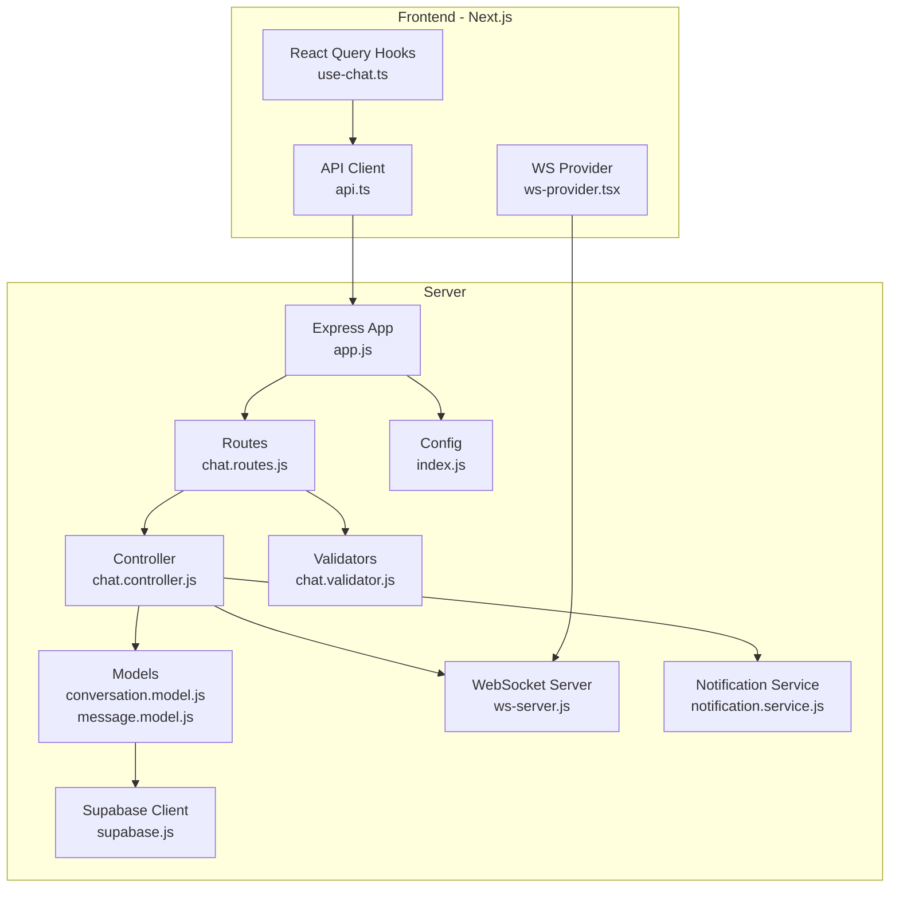
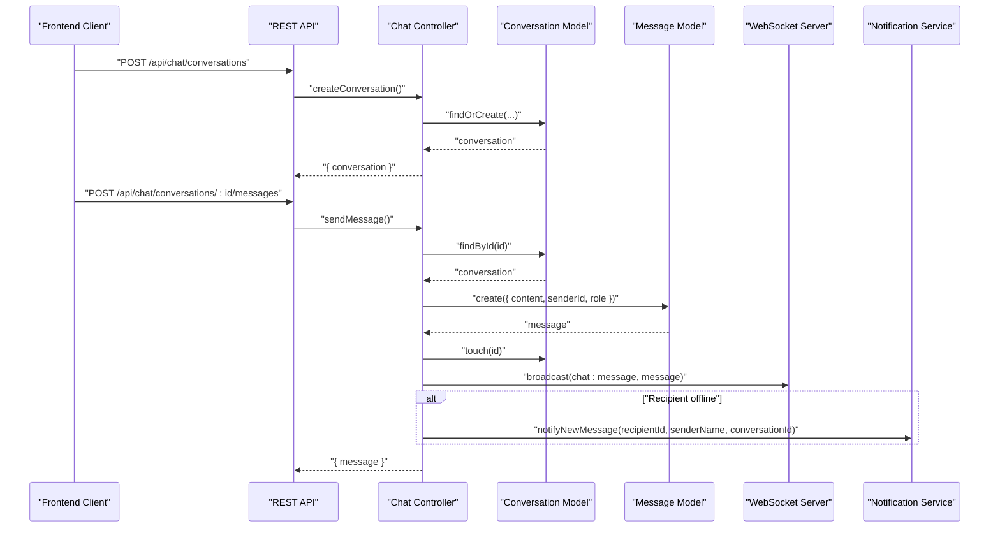
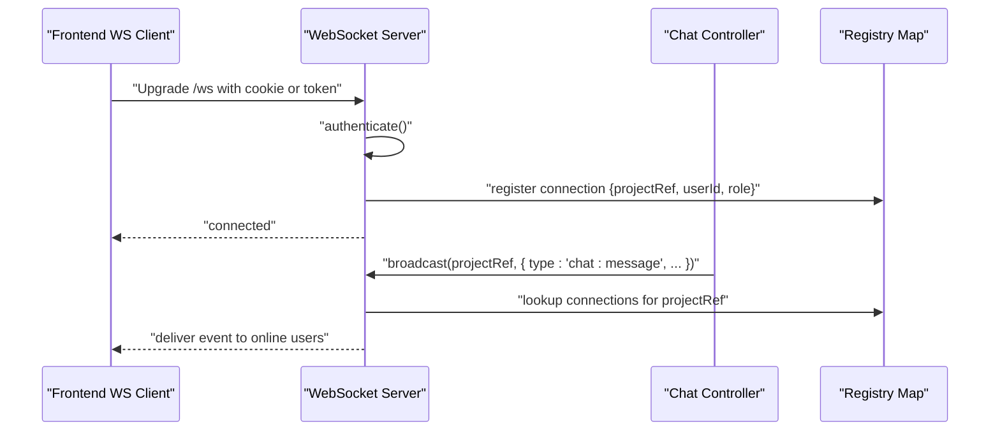
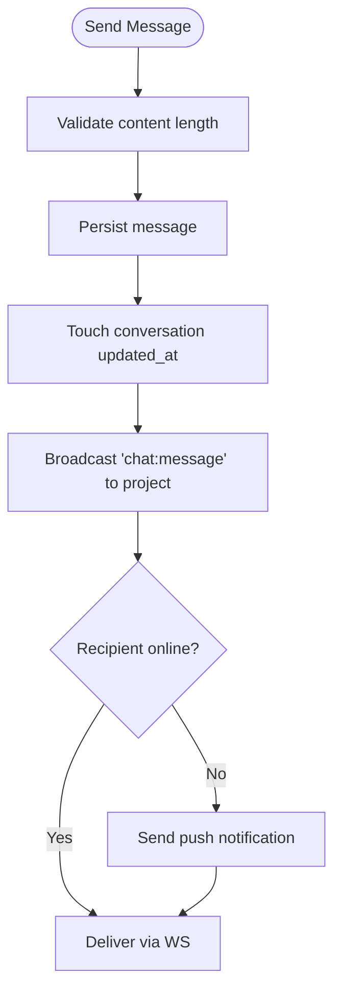
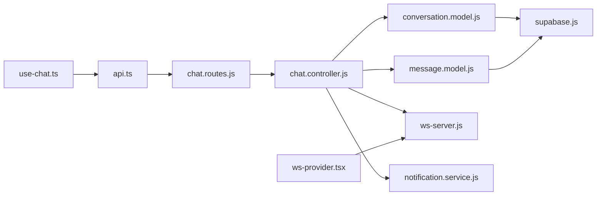

# Chat & Communication

<cite>
**Referenced Files in This Document**
- [chat.controller.js](file://apps/server/controllers/chat.controller.js)
- [chat.routes.js](file://apps/server/routes/chat.routes.js)
- [chat.validator.js](file://apps/server/validators/chat.validator.js)
- [conversation.model.js](file://apps/server/models/conversation.model.js)
- [message.model.js](file://apps/server/models/message.model.js)
- [ws-server.js](file://apps/server/websocket/ws-server.js)
- [notification.service.js](file://apps/server/services/notification.service.js)
- [005_conversations_messages.sql](file://apps/server/migrations/005_conversations_messages.sql)
- [index.js](file://apps/server/config/index.js)
- [supabase.js](file://apps/server/lib/supabase.js)
- [rate-limit.middleware.js](file://apps/server/middleware/rate-limit.middleware.js)
- [app.js](file://apps/server/app.js)
- [use-chat.ts](file://apps/customer/src/hooks/use-chat.ts)
- [ws-provider.tsx](file://apps/customer/src/providers/ws-provider.tsx)
- [api.ts](file://apps/customer/src/lib/api.ts)
- [chat.test.js](file://apps/server/tests/chat.test.js)
</cite>

## Table of Contents
1. [Introduction](#introduction)
2. [Project Structure](#project-structure)
3. [Core Components](#core-components)
4. [Architecture Overview](#architecture-overview)
5. [Detailed Component Analysis](#detailed-component-analysis)
6. [Dependency Analysis](#dependency-analysis)
7. [Performance Considerations](#performance-considerations)
8. [Troubleshooting Guide](#troubleshooting-guide)
9. [Conclusion](#conclusion)
10. [Appendices](#appendices)

## Introduction
This document provides comprehensive API documentation for chat and communication endpoints. It covers conversation creation, message sending, and real-time messaging via WebSocket. It also documents schemas for conversation management, message threading, and participant handling, along with message persistence, read receipts, and push notifications for offline users. Examples include chat room management, message formatting, and attachment handling. Security topics include message encryption, spam prevention, and moderation capabilities.

## Project Structure
The chat system spans the server (Express + Supabase) and multiple frontends (Next.js and mobile). The server exposes REST endpoints under /api/chat and a WebSocket endpoint at /ws. Frontends consume REST APIs and subscribe to WebSocket events.

**Diagram sources**
- [app.js:1-88](file://apps/server/app.js#L1-L88)
- [chat.routes.js:1-21](file://apps/server/routes/chat.routes.js#L1-L21)
- [chat.controller.js:1-174](file://apps/server/controllers/chat.controller.js#L1-L174)
- [conversation.model.js:1-62](file://apps/server/models/conversation.model.js#L1-L62)
- [message.model.js:1-61](file://apps/server/models/message.model.js#L1-L61)
- [ws-server.js:1-237](file://apps/server/websocket/ws-server.js#L1-L237)
- [notification.service.js:1-180](file://apps/server/services/notification.service.js#L1-L180)
- [supabase.js:1-151](file://apps/server/lib/supabase.js#L1-L151)
- [chat.validator.js:1-23](file://apps/server/validators/chat.validator.js#L1-L23)
- [index.js:1-117](file://apps/server/config/index.js#L1-L117)
- [api.ts:1-11](file://apps/customer/src/lib/api.ts#L1-L11)
- [use-chat.ts:1-20](file://apps/customer/src/hooks/use-chat.ts#L1-L20)
- [ws-provider.tsx:1-86](file://apps/customer/src/providers/ws-provider.tsx#L1-L86)

**Section sources**
- [app.js:1-88](file://apps/server/app.js#L1-L88)
- [chat.routes.js:1-21](file://apps/server/routes/chat.routes.js#L1-L21)
- [chat.controller.js:1-174](file://apps/server/controllers/chat.controller.js#L1-L174)
- [conversation.model.js:1-62](file://apps/server/models/conversation.model.js#L1-L62)
- [message.model.js:1-61](file://apps/server/models/message.model.js#L1-L61)
- [ws-server.js:1-237](file://apps/server/websocket/ws-server.js#L1-L237)
- [notification.service.js:1-180](file://apps/server/services/notification.service.js#L1-L180)
- [supabase.js:1-151](file://apps/server/lib/supabase.js#L1-L151)
- [chat.validator.js:1-23](file://apps/server/validators/chat.validator.js#L1-L23)
- [index.js:1-117](file://apps/server/config/index.js#L1-L117)
- [api.ts:1-11](file://apps/customer/src/lib/api.ts#L1-L11)
- [use-chat.ts:1-20](file://apps/customer/src/hooks/use-chat.ts#L1-L20)
- [ws-provider.tsx:1-86](file://apps/customer/src/providers/ws-provider.tsx#L1-L86)

## Core Components
- REST endpoints for chat:
  - POST /api/chat/conversations
  - GET /api/chat/conversations
  - GET /api/chat/conversations/:id/messages
  - POST /api/chat/conversations/:id/messages
  - PATCH /api/chat/conversations/:id/read
- WebSocket endpoint: /ws for real-time chat events
- Data models:
  - conversations: stores chat rooms linked to orders and participants
  - messages: stores threaded messages with read receipts
- Validation schemas for request bodies
- Notification service for offline users

**Section sources**
- [chat.routes.js:12-18](file://apps/server/routes/chat.routes.js#L12-L18)
- [chat.controller.js:12-171](file://apps/server/controllers/chat.controller.js#L12-L171)
- [conversation.model.js:15-58](file://apps/server/models/conversation.model.js#L15-L58)
- [message.model.js:13-49](file://apps/server/models/message.model.js#L13-L49)
- [chat.validator.js:6-20](file://apps/server/validators/chat.validator.js#L6-L20)
- [ws-server.js:162-175](file://apps/server/websocket/ws-server.js#L162-L175)

## Architecture Overview
The system integrates REST and WebSocket for chat. REST handles CRUD-like operations with multi-tenant isolation and pagination. WebSocket broadcasts real-time events to online users and triggers push notifications for offline users.

**Diagram sources**
- [chat.controller.js:12-140](file://apps/server/controllers/chat.controller.js#L12-L140)
- [conversation.model.js:15-52](file://apps/server/models/conversation.model.js#L15-L52)
- [message.model.js:24-37](file://apps/server/models/message.model.js#L24-L37)
- [ws-server.js:162-175](file://apps/server/websocket/ws-server.js#L162-L175)
- [notification.service.js:73-83](file://apps/server/services/notification.service.js#L73-L83)

## Detailed Component Analysis

### REST Endpoints

#### POST /api/chat/conversations
- Purpose: Create or retrieve a conversation for an order and type.
- Authentication: Requires parsed session, any auth, project reference attached.
- Request body:
  - orderId: UUID
  - type: "customer_vendor" | "vendor_rider"
- Behavior:
  - Validates order ownership against project_ref.
  - Determines participants based on type.
  - Creates conversation if not exists.
- Response: 201 on creation, 200 on reuse; returns conversation object.

**Section sources**
- [chat.routes.js:14](file://apps/server/routes/chat.routes.js#L14)
- [chat.validator.js:6-9](file://apps/server/validators/chat.validator.js#L6-L9)
- [chat.controller.js:12-51](file://apps/server/controllers/chat.controller.js#L12-L51)
- [conversation.model.js:15-33](file://apps/server/models/conversation.model.js#L15-L33)

#### GET /api/chat/conversations
- Purpose: List conversations for the current user within the project.
- Response: Array of conversations.

**Section sources**
- [chat.routes.js:15](file://apps/server/routes/chat.routes.js#L15)
- [chat.controller.js:53-61](file://apps/server/controllers/chat.controller.js#L53-L61)
- [conversation.model.js:35-41](file://apps/server/models/conversation.model.js#L35-L41)

#### GET /api/chat/conversations/:id/messages
- Purpose: Retrieve paginated message history for a conversation.
- Query parameters:
  - page: positive integer (default 1)
- Access control:
  - Multi-tenant isolation via project_ref
  - Participant check
- Response: messages array, page number, pageSize.

**Section sources**
- [chat.routes.js:16](file://apps/server/routes/chat.routes.js#L16)
- [chat.validator.js:18-20](file://apps/server/validators/chat.validator.js#L18-L20)
- [chat.controller.js:63-86](file://apps/server/controllers/chat.controller.js#L63-L86)
- [message.model.js:13-22](file://apps/server/models/message.model.js#L13-L22)
- [index.js:104-107](file://apps/server/config/index.js#L104-L107)

#### POST /api/chat/conversations/:id/messages
- Purpose: Send a message to a conversation.
- Request body:
  - content: string up to configured max length
- Access control:
  - Multi-tenant isolation via project_ref
  - Participant check
- Behavior:
  - Enforces max length (double-check).
  - Creates message.
  - Touches conversation updated_at.
  - Broadcasts "chat:message" to both participants.
  - Sends push notification if recipient is offline.
- Response: 201 with message object.

**Section sources**
- [chat.routes.js:17](file://apps/server/routes/chat.routes.js#L17)
- [chat.validator.js:11-16](file://apps/server/validators/chat.validator.js#L11-L16)
- [chat.controller.js:88-140](file://apps/server/controllers/chat.controller.js#L88-L140)
- [message.model.js:24-37](file://apps/server/models/message.model.js#L24-L37)
- [index.js:104-107](file://apps/server/config/index.js#L104-L107)
- [notification.service.js:73-83](file://apps/server/services/notification.service.js#L73-L83)

#### PATCH /api/chat/conversations/:id/read
- Purpose: Mark messages in a conversation as read for the current user.
- Behavior:
  - Multi-tenant isolation and participant check.
  - Marks messages sent by others as read.
  - Broadcasts "chat:read" with userId and readAt timestamp.

**Section sources**
- [chat.routes.js:18](file://apps/server/routes/chat.routes.js#L18)
- [chat.controller.js:142-171](file://apps/server/controllers/chat.controller.js#L142-L171)
- [message.model.js:39-49](file://apps/server/models/message.model.js#L39-L49)
- [ws-server.js:162-175](file://apps/server/websocket/ws-server.js#L162-L175)

### WebSocket Integration
- Endpoint: /ws
- Authentication:
  - admin_session cookie
  - customer_session cookie
  - ?token= JWT query parameter
- Supported events:
  - chat:message: new message received
  - chat:read: read receipt broadcast
  - chat:typing: typing indicator relay
- Frontend usage:
  - WSProvider connects to ws URL derived from API URL.
  - Subscribes to "chat:message" to refresh conversations.

**Diagram sources**
- [ws-server.js:22-89](file://apps/server/websocket/ws-server.js#L22-L89)
- [ws-server.js:95-124](file://apps/server/websocket/ws-server.js#L95-L124)
- [ws-server.js:162-175](file://apps/server/websocket/ws-server.js#L162-L175)
- [ws-provider.tsx:27-53](file://apps/customer/src/providers/ws-provider.tsx#L27-L53)

**Section sources**
- [ws-server.js:11-89](file://apps/server/websocket/ws-server.js#L11-L89)
- [ws-server.js:126-147](file://apps/server/websocket/ws-server.js#L126-L147)
- [ws-provider.tsx:27-86](file://apps/customer/src/providers/ws-provider.tsx#L27-L86)

### Data Models and Schemas

#### Conversations Schema
- Fields:
  - id: UUID
  - project_ref: text (multi-tenant)
  - order_id: UUID (optional)
  - type: enum "customer_vendor" | "vendor_rider"
  - participant_1_id: UUID
  - participant_2_id: UUID
  - created_at, updated_at: timestamptz

**Section sources**
- [005_conversations_messages.sql:4-18](file://apps/server/migrations/005_conversations_messages.sql#L4-L18)
- [conversation.model.js:15-33](file://apps/server/models/conversation.model.js#L15-L33)

#### Messages Schema
- Fields:
  - id: UUID
  - conversation_id: UUID -> conversations.id
  - sender_id: UUID
  - sender_role: enum "customer" | "vendor" | "rider" | "admin"
  - content: text (max length enforced)
  - read_at: timestamptz (nullable)
  - created_at: timestamptz

**Section sources**
- [005_conversations_messages.sql:20-28](file://apps/server/migrations/005_conversations_messages.sql#L20-L28)
- [message.model.js:24-37](file://apps/server/models/message.model.js#L24-L37)
- [index.js:104-107](file://apps/server/config/index.js#L104-L107)

#### Frontend Data Types
- Conversation: id, project_ref, order_id, type, participant_1_id, participant_2_id, created_at, updated_at
- Message: id, conversation_id, sender_id, sender_role, content, read_at, created_at

**Section sources**
- [use-chat.ts:3](file://apps/customer/src/hooks/use-chat.ts#L3)

### Real-Time Messaging and Read Receipts
- On send:
  - Controller broadcasts "chat:message" to project scope.
  - If recipient offline, push notification is sent.
- On read:
  - Controller marks messages sent by others as read.
  - Broadcasts "chat:read" with userId and readAt timestamp.

**Diagram sources**
- [chat.controller.js:88-140](file://apps/server/controllers/chat.controller.js#L88-L140)
- [notification.service.js:73-83](file://apps/server/services/notification.service.js#L73-L83)

**Section sources**
- [chat.controller.js:120-135](file://apps/server/controllers/chat.controller.js#L120-L135)
- [message.model.js:39-49](file://apps/server/models/message.model.js#L39-L49)
- [ws-server.js:162-175](file://apps/server/websocket/ws-server.js#L162-L175)

### Message Persistence and Pagination
- Pagination:
  - Page size and default page are configured.
  - Backend enforces page number coercion and default.
- Storage:
  - Supabase REST via helper functions.
  - Indexes on conversation_id, sender_id, created_at desc.

**Section sources**
- [index.js:104-107](file://apps/server/config/index.js#L104-L107)
- [message.model.js:13-22](file://apps/server/models/message.model.js#L13-L22)
- [supabase.js:107-117](file://apps/server/lib/supabase.js#L107-L117)
- [005_conversations_messages.sql:30-32](file://apps/server/migrations/005_conversations_messages.sql#L30-L32)

### Chat Room Management
- Creation:
  - Based on order and type, participants are determined.
  - For "vendor_rider", the assigned rider is fetched from deliveries.
- Listing:
  - Returns conversations where the user is participant_1 or participant_2, scoped to project_ref.

**Section sources**
- [chat.controller.js:22-45](file://apps/server/controllers/chat.controller.js#L22-L45)
- [conversation.model.js:35-41](file://apps/server/models/conversation.model.js#L35-L41)

### Message Formatting and Attachments
- Content:
  - Plain text content with enforced max length.
- Attachments:
  - No attachment model or endpoint is present in the codebase.
  - Recommendation: Extend message.content to include metadata for attachments and add upload endpoints.

**Section sources**
- [message.model.js:24-37](file://apps/server/models/message.model.js#L24-L37)
- [index.js:104-107](file://apps/server/config/index.js#L104-L107)

### Security, Spam Prevention, and Moderation
- Rate limiting:
  - Global, auth, and payment route limits configured.
- Input validation:
  - Zod schemas enforce content length and enumeration constraints.
- Multi-tenant isolation:
  - All endpoints check project_ref and participant access.
- Authentication:
  - Session parsing and JWT token support for WebSocket.
- Moderation:
  - No explicit moderation endpoints or content filtering logic is present in the codebase.
  - Recommendations: Add content scanning, keyword filtering, and admin moderation controls.

**Section sources**
- [rate-limit.middleware.js:16-44](file://apps/server/middleware/rate-limit.middleware.js#L16-L44)
- [chat.validator.js:6-20](file://apps/server/validators/chat.validator.js#L6-L20)
- [chat.controller.js:72-79](file://apps/server/controllers/chat.controller.js#L72-L79)
- [ws-server.js:95-124](file://apps/server/websocket/ws-server.js#L95-L124)

## Dependency Analysis

**Diagram sources**
- [chat.routes.js:1-21](file://apps/server/routes/chat.routes.js#L1-L21)
- [chat.controller.js:1-174](file://apps/server/controllers/chat.controller.js#L1-L174)
- [conversation.model.js:1-62](file://apps/server/models/conversation.model.js#L1-L62)
- [message.model.js:1-61](file://apps/server/models/message.model.js#L1-L61)
- [ws-server.js:1-237](file://apps/server/websocket/ws-server.js#L1-L237)
- [notification.service.js:1-180](file://apps/server/services/notification.service.js#L1-L180)
- [supabase.js:1-151](file://apps/server/lib/supabase.js#L1-151)
- [api.ts:1-11](file://apps/customer/src/lib/api.ts#L1-L11)
- [use-chat.ts:1-20](file://apps/customer/src/hooks/use-chat.ts#L1-L20)
- [ws-provider.tsx:1-86](file://apps/customer/src/providers/ws-provider.tsx#L1-L86)

**Section sources**
- [chat.routes.js:1-21](file://apps/server/routes/chat.routes.js#L1-L21)
- [chat.controller.js:1-174](file://apps/server/controllers/chat.controller.js#L1-L174)
- [conversation.model.js:1-62](file://apps/server/models/conversation.model.js#L1-L62)
- [message.model.js:1-61](file://apps/server/models/message.model.js#L1-L61)
- [ws-server.js:1-237](file://apps/server/websocket/ws-server.js#L1-L237)
- [notification.service.js:1-180](file://apps/server/services/notification.service.js#L1-L180)
- [supabase.js:1-151](file://apps/server/lib/supabase.js#L1-L151)
- [api.ts:1-11](file://apps/customer/src/lib/api.ts#L1-L11)
- [use-chat.ts:1-20](file://apps/customer/src/hooks/use-chat.ts#L1-L20)
- [ws-provider.tsx:1-86](file://apps/customer/src/providers/ws-provider.tsx#L1-L86)

## Performance Considerations
- Pagination:
  - pageSize is configurable; adjust for large histories.
- Indexes:
  - Ensure database indexes on messages(conversation_id, created_at desc) and conversations(project_ref, participant_*).
- WebSocket:
  - Heartbeat pings and pruning of unresponsive connections prevent resource leaks.
- Rate limiting:
  - Apply to high-frequency endpoints to mitigate abuse.

[No sources needed since this section provides general guidance]

## Troubleshooting Guide
- 403 Access Denied:
  - Occurs when project_ref mismatch or non-participant attempts access.
- 404 Not Found:
  - Conversation or order not found.
- 400 Bad Request:
  - Empty or oversized content, invalid conversation type.
- Offline users not receiving notifications:
  - Verify push tokens exist and notification service is reachable.

**Section sources**
- [chat.controller.js:70-79](file://apps/server/controllers/chat.controller.js#L70-L79)
- [chat.controller.js:95-98](file://apps/server/controllers/chat.controller.js#L95-L98)
- [chat.test.js:96-118](file://apps/server/tests/chat.test.js#L96-L118)
- [chat.test.js:110-116](file://apps/server/tests/chat.test.js#L110-L116)
- [chat.test.js:134-139](file://apps/server/tests/chat.test.js#L134-L139)
- [notification.service.js:11-22](file://apps/server/services/notification.service.js#L11-L22)

## Conclusion
The chat system provides robust REST endpoints and real-time messaging with multi-tenant isolation, pagination, and offline push notifications. Enhancements could include attachment support, content moderation, and stricter spam controls.

[No sources needed since this section summarizes without analyzing specific files]

## Appendices

### API Definitions

- POST /api/chat/conversations
  - Request: { orderId: string(uuid), type: "customer_vendor"|"vendor_rider" }
  - Response: { conversation: Conversation }

- GET /api/chat/conversations
  - Response: { conversations: Conversation[] }

- GET /api/chat/conversations/:id/messages
  - Query: page: number (default 1)
  - Response: { messages: Message[], page: number, pageSize: number }

- POST /api/chat/conversations/:id/messages
  - Request: { content: string }
  - Response: { message: Message }

- PATCH /api/chat/conversations/:id/read
  - Response: { ok: boolean }

**Section sources**
- [chat.routes.js:14-18](file://apps/server/routes/chat.routes.js#L14-L18)
- [chat.validator.js:6-20](file://apps/server/validators/chat.validator.js#L6-L20)
- [chat.controller.js:12-171](file://apps/server/controllers/chat.controller.js#L12-L171)
- [index.js:104-107](file://apps/server/config/index.js#L104-L107)

### WebSocket Events

- chat:message
  - Payload: { conversationId: string, message: Message }
- chat:read
  - Payload: { conversationId: string, userId: string, readAt: string }
- chat:typing
  - Payload: { conversationId: string, userId: string, isTyping: boolean }

**Section sources**
- [ws-server.js:162-175](file://apps/server/websocket/ws-server.js#L162-L175)
- [ws-server.js:139-146](file://apps/server/websocket/ws-server.js#L139-L146)

### Frontend Integration Notes
- API client uses NEXT_PUBLIC_API_URL to derive base URL.
- WS URL is derived by replacing http/https with ws and appending /ws.
- React Query hooks automatically refetch messages periodically.

**Section sources**
- [api.ts:3-10](file://apps/customer/src/lib/api.ts#L3-L10)
- [ws-provider.tsx:17-25](file://apps/customer/src/providers/ws-provider.tsx#L17-L25)
- [use-chat.ts:12-18](file://apps/customer/src/hooks/use-chat.ts#L12-L18)