# Delivery & Rider Coordination

<cite>
**Referenced Files in This Document**
- [delivery.controller.js](file://apps/server/controllers/delivery.controller.js)
- [delivery.routes.js](file://apps/server/routes/delivery.routes.js)
- [delivery.model.js](file://apps/server/models/delivery.model.js)
- [order.model.js](file://apps/server/models/order.model.js)
- [vendor-settings.model.js](file://apps/server/models/vendor-settings.model.js)
- [session.service.js](file://apps/server/services/session.service.js)
- [ws-server.js](file://apps/server/websocket/ws-server.js)
- [auto-dispatch.job.js](file://apps/server/jobs/auto-dispatch.job.js)
- [radius-expansion.job.js](file://apps/server/jobs/radius-expansion.job.js)
- [sla-check.job.js](file://apps/server/jobs/sla-check.job.js)
- [delivery.validator.js](file://apps/server/validators/delivery.validator.js)
- [auth.middleware.js](file://apps/server/middleware/auth.middleware.js)
- [geo.js](file://apps/server/lib/geo.js)
</cite>

## Table of Contents
1. [Introduction](#introduction)
2. [Project Structure](#project-structure)
3. [Core Components](#core-components)
4. [Architecture Overview](#architecture-overview)
5. [Detailed Component Analysis](#detailed-component-analysis)
6. [Dependency Analysis](#dependency-analysis)
7. [Performance Considerations](#performance-considerations)
8. [Troubleshooting Guide](#troubleshooting-guide)
9. [Conclusion](#conclusion)
10. [Appendices](#appendices)

## Introduction
This document provides comprehensive API documentation for delivery and rider coordination endpoints. It covers rider assignment, delivery tracking, location sharing, and delivery status management. It also documents schemas for delivery creation, rider availability updates, route optimization, and delivery completion. The auto-dispatch algorithms, rider selection criteria, and geographic dispatch logic are explained, along with examples of delivery lifecycle management, real-time location updates, and performance metrics collection. Delivery scheduling, SLA monitoring, and rider availability management are addressed.

## Project Structure
The delivery and rider coordination functionality spans controllers, routes, models, services, jobs, validators, middleware, and WebSocket broadcasting. The primary HTTP routes are defined under delivery routes and enforced by role-based authentication middleware. Real-time updates are broadcast via WebSocket to riders and stakeholders.

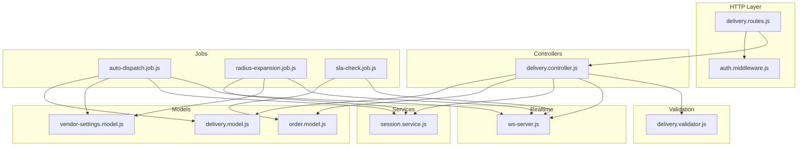

**Diagram sources**
- [delivery.routes.js:1-31](file://apps/server/routes/delivery.routes.js#L1-L31)
- [auth.middleware.js:1-123](file://apps/server/middleware/auth.middleware.js#L1-L123)
- [delivery.controller.js:1-313](file://apps/server/controllers/delivery.controller.js#L1-L313)
- [delivery.model.js:1-98](file://apps/server/models/delivery.model.js#L1-L98)
- [order.model.js:1-178](file://apps/server/models/order.model.js#L1-L178)
- [vendor-settings.model.js:1-51](file://apps/server/models/vendor-settings.model.js#L1-L51)
- [session.service.js:1-180](file://apps/server/services/session.service.js#L1-L180)
- [auto-dispatch.job.js:1-97](file://apps/server/jobs/auto-dispatch.job.js#L1-L97)
- [radius-expansion.job.js:1-87](file://apps/server/jobs/radius-expansion.job.js#L1-L87)
- [sla-check.job.js:1-59](file://apps/server/jobs/sla-check.job.js#L1-L59)
- [ws-server.js:1-237](file://apps/server/websocket/ws-server.js#L1-L237)
- [delivery.validator.js:1-27](file://apps/server/validators/delivery.validator.js#L1-L27)

**Section sources**
- [delivery.routes.js:1-31](file://apps/server/routes/delivery.routes.js#L1-L31)
- [auth.middleware.js:1-123](file://apps/server/middleware/auth.middleware.js#L1-L123)

## Core Components
- Delivery controller: Implements endpoints for listing deliveries, claiming deliveries, updating statuses, updating rider locations, retrieving cached locations, marking rider arrival, assigning riders, reassigning deliveries, and assigning external riders.
- Delivery model: Manages delivery records, status transitions, availability queries, and location logging.
- Order model: Manages order lifecycle, status transitions, SLA deadlines, and cancellations/refunds.
- Session service: Provides caching for rider locations, availability, and delivery search radius with rate limiting.
- WebSocket server: Broadcasts real-time events to project members and individual users.
- Auto-dispatch job: Creates delivery records for ready orders and notifies nearby online riders.
- Radius expansion job: Increases the search radius for pending deliveries to find riders.
- SLA check job: Monitors SLA breaches and notifies stakeholders.
- Validators: Define request schemas for delivery-related endpoints.

**Section sources**
- [delivery.controller.js:1-313](file://apps/server/controllers/delivery.controller.js#L1-L313)
- [delivery.model.js:1-98](file://apps/server/models/delivery.model.js#L1-L98)
- [order.model.js:1-178](file://apps/server/models/order.model.js#L1-L178)
- [session.service.js:1-180](file://apps/server/services/session.service.js#L1-L180)
- [ws-server.js:1-237](file://apps/server/websocket/ws-server.js#L1-L237)
- [auto-dispatch.job.js:1-97](file://apps/server/jobs/auto-dispatch.job.js#L1-L97)
- [radius-expansion.job.js:1-87](file://apps/server/jobs/radius-expansion.job.js#L1-L87)
- [sla-check.job.js:1-59](file://apps/server/jobs/sla-check.job.js#L1-L59)
- [delivery.validator.js:1-27](file://apps/server/validators/delivery.validator.js#L1-L27)

## Architecture Overview
The system integrates HTTP endpoints, background jobs, and WebSocket broadcasting to coordinate deliveries and riders. Authentication middleware attaches identities to requests, while validators enforce request schemas. Controllers orchestrate model updates and notifications, and jobs handle automatic dispatch and radius expansion. WebSocket broadcasts keep clients informed of status changes and location updates.

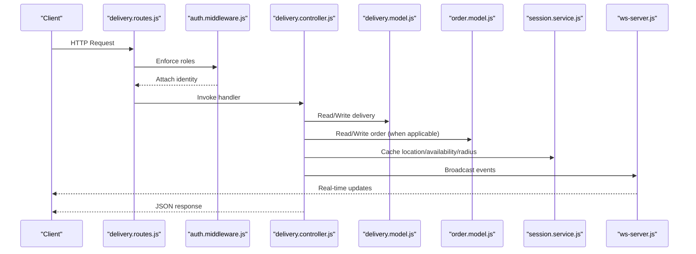

**Diagram sources**
- [delivery.routes.js:1-31](file://apps/server/routes/delivery.routes.js#L1-L31)
- [auth.middleware.js:1-123](file://apps/server/middleware/auth.middleware.js#L1-L123)
- [delivery.controller.js:1-313](file://apps/server/controllers/delivery.controller.js#L1-L313)
- [delivery.model.js:1-98](file://apps/server/models/delivery.model.js#L1-L98)
- [order.model.js:1-178](file://apps/server/models/order.model.js#L1-L178)
- [session.service.js:1-180](file://apps/server/services/session.service.js#L1-L180)
- [ws-server.js:1-237](file://apps/server/websocket/ws-server.js#L1-L237)

## Detailed Component Analysis

### Delivery Endpoints
Endpoints support listing deliveries, claiming, status updates, location updates, rider arrival, vendor/admin assignments, reassignment, and external rider assignment. Role-based access ensures riders can only act on their assigned deliveries.

- GET /rider/deliveries
  - Query params: zoneId (optional), status (optional)
  - Returns available or rider-specific deliveries
- POST /:id/claim
  - Claims an unassigned delivery with optimistic locking
- POST /:id/status
  - Updates delivery status with validation
- POST /:id/location
  - Updates rider location with rate limiting and caches availability
- GET /:id/location
  - Retrieves cached location for a delivery
- POST /rider/location
  - Updates rider availability location for matching
- POST /:id/arrived
  - Marks rider arrival and notifies
- POST /:id/assign
  - Vendor/Admin assigns a specific rider
- POST /:id/reassign
  - Reverts delivery to pending and notifies
- POST /:id/assign-external
  - Assigns external rider with name and phone

**Section sources**
- [delivery.routes.js:14-28](file://apps/server/routes/delivery.routes.js#L14-L28)
- [delivery.controller.js:10-313](file://apps/server/controllers/delivery.controller.js#L10-L313)
- [delivery.validator.js:1-27](file://apps/server/validators/delivery.validator.js#L1-L27)

### Delivery Model
The delivery model encapsulates:
- Finding deliveries by order, for a rider, or available for claiming
- Creating deliveries with initial state and optional zone/ETA
- Claiming deliveries with optimistic locking
- Updating status with validation against allowed statuses
- Reassigning deliveries back to pending
- Logging location pings to a dedicated table

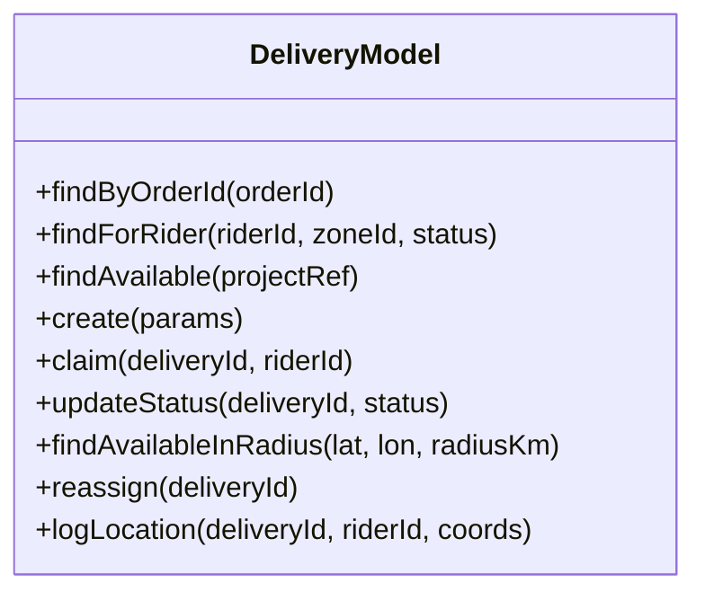

**Diagram sources**
- [delivery.model.js:9-95](file://apps/server/models/delivery.model.js#L9-L95)

**Section sources**
- [delivery.model.js:14-95](file://apps/server/models/delivery.model.js#L14-L95)

### Order Model and SLA Management
The order model manages order lifecycles and SLA:
- Validates status transitions
- Sets SLA deadline based on prep time
- Marks SLA breach and supports cancellations/refunds
- Schedules future orders

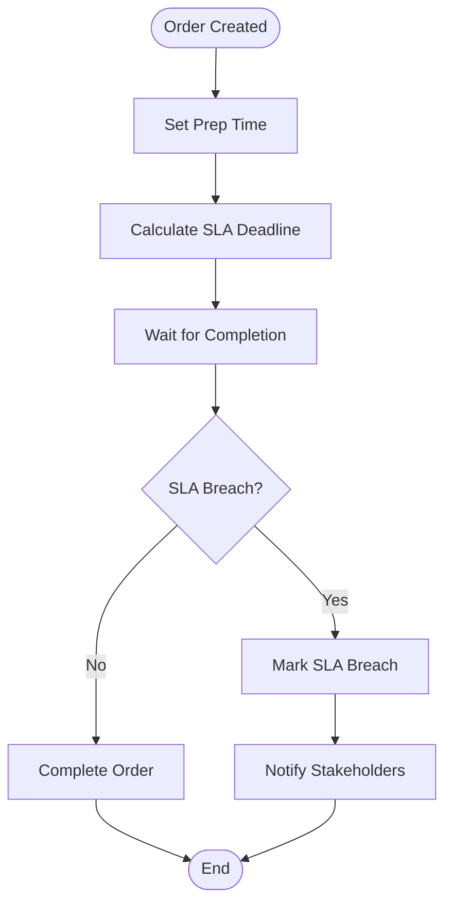

**Diagram sources**
- [order.model.js:141-155](file://apps/server/models/order.model.js#L141-L155)
- [sla-check.job.js:15-56](file://apps/server/jobs/sla-check.job.js#L15-L56)

**Section sources**
- [order.model.js:12-21](file://apps/server/models/order.model.js#L12-L21)
- [order.model.js:105-155](file://apps/server/models/order.model.js#L105-L155)
- [sla-check.job.js:15-56](file://apps/server/jobs/sla-check.job.js#L15-L56)

### Session Service and Location Caching
Session service provides:
- Rate limiting for location updates (per delivery)
- Caching of rider locations and availability
- Caching of delivery search radius with TTL
- OTP and reset token management

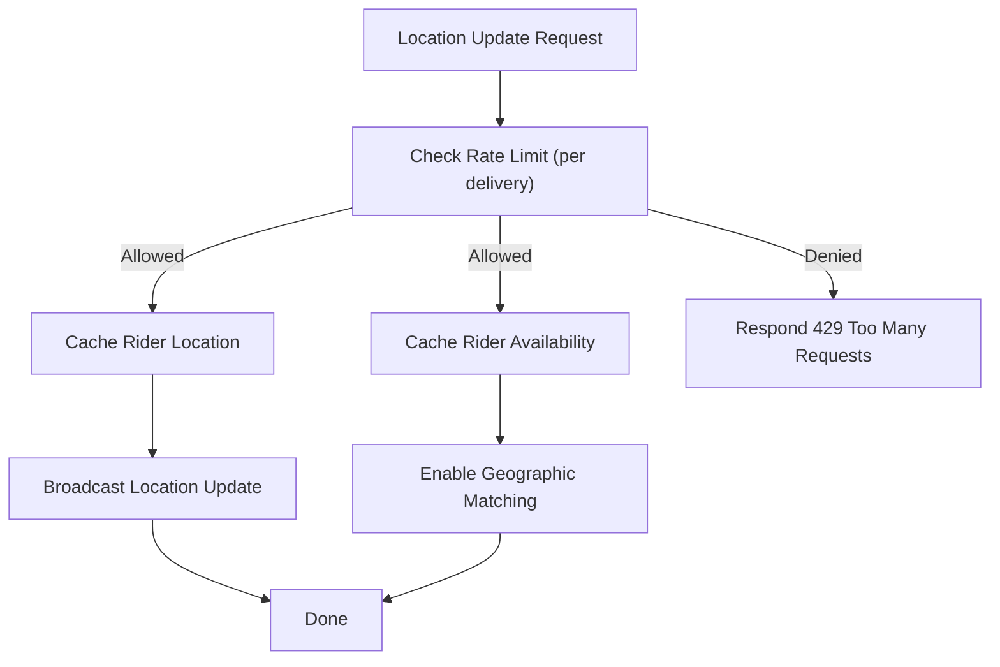

**Diagram sources**
- [session.service.js:124-144](file://apps/server/services/session.service.js#L124-L144)
- [delivery.controller.js:80-114](file://apps/server/controllers/delivery.controller.js#L80-L114)
- [ws-server.js:162-175](file://apps/server/websocket/ws-server.js#L162-L175)

**Section sources**
- [session.service.js:108-153](file://apps/server/services/session.service.js#L108-L153)
- [delivery.controller.js:80-114](file://apps/server/controllers/delivery.controller.js#L80-L114)

### Auto-Dispatch Algorithm
Auto-dispatch creates deliveries for ready orders and notifies nearby online riders:
- Lock-based job execution
- Vendor settings for dispatch delay and radius
- Spatial filtering using Haversine distance
- Fallback to project-wide broadcast if no nearby riders

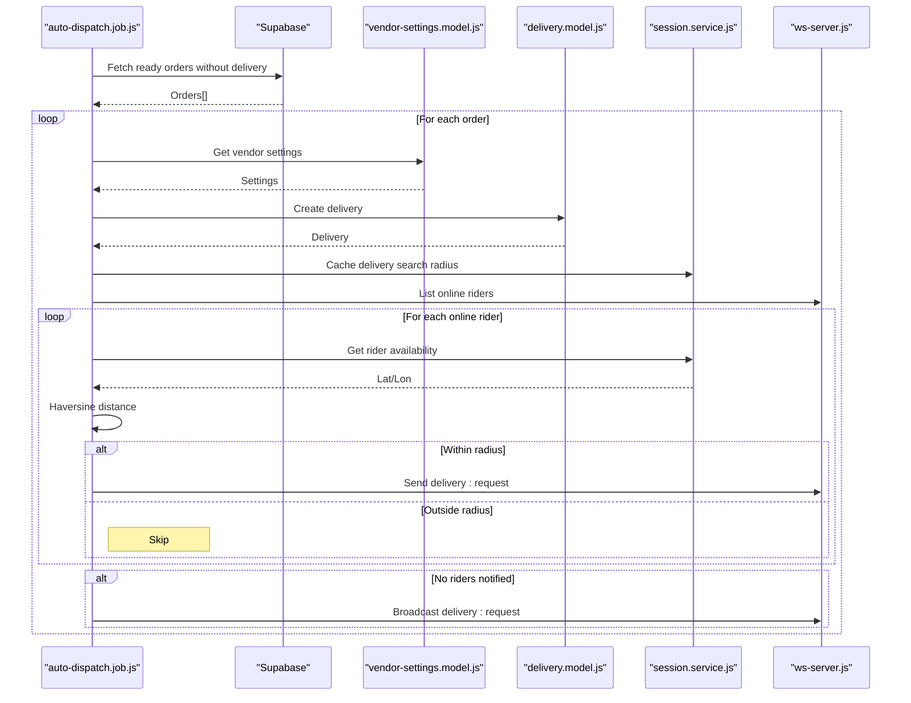

**Diagram sources**
- [auto-dispatch.job.js:18-94](file://apps/server/jobs/auto-dispatch.job.js#L18-L94)
- [vendor-settings.model.js:14-47](file://apps/server/models/vendor-settings.model.js#L14-L47)
- [delivery.model.js:37-47](file://apps/server/models/delivery.model.js#L37-L47)
- [session.service.js:146-153](file://apps/server/services/session.service.js#L146-L153)
- [ws-server.js:211-220](file://apps/server/websocket/ws-server.js#L211-L220)
- [geo.js:3-11](file://apps/server/lib/geo.js#L3-L11)

**Section sources**
- [auto-dispatch.job.js:18-94](file://apps/server/jobs/auto-dispatch.job.js#L18-L94)
- [vendor-settings.model.js:14-47](file://apps/server/models/vendor-settings.model.js#L14-L47)
- [delivery.model.js:29-35](file://apps/server/models/delivery.model.js#L29-L35)
- [session.service.js:146-153](file://apps/server/services/session.service.js#L146-L153)
- [ws-server.js:211-220](file://apps/server/websocket/ws-server.js#L211-L220)
- [geo.js:3-11](file://apps/server/lib/geo.js#L3-L11)

### Radius Expansion Logic
The radius expansion job progressively increases the search radius for stale pending deliveries:
- Lock-based periodic execution
- Increment radius by fixed steps up to a maximum
- Broadcast expanded search radius to nearby riders

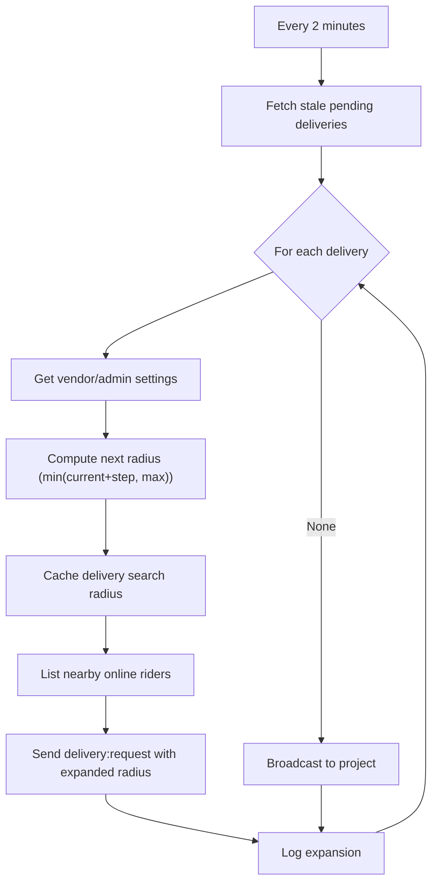

**Diagram sources**
- [radius-expansion.job.js:13-84](file://apps/server/jobs/radius-expansion.job.js#L13-L84)
- [vendor-settings.model.js:14-47](file://apps/server/models/vendor-settings.model.js#L14-L47)
- [session.service.js:146-153](file://apps/server/services/session.service.js#L146-L153)
- [ws-server.js:162-175](file://apps/server/websocket/ws-server.js#L162-L175)

**Section sources**
- [radius-expansion.job.js:13-84](file://apps/server/jobs/radius-expansion.job.js#L13-L84)
- [vendor-settings.model.js:14-47](file://apps/server/models/vendor-settings.model.js#L14-L47)
- [session.service.js:146-153](file://apps/server/services/session.service.js#L146-L153)

### SLA Monitoring
The SLA check job periodically identifies overdue orders and marks them as breached:
- Lock-based execution
- Filters orders by status and deadline
- Broadcasts order:delayed events and sends notifications

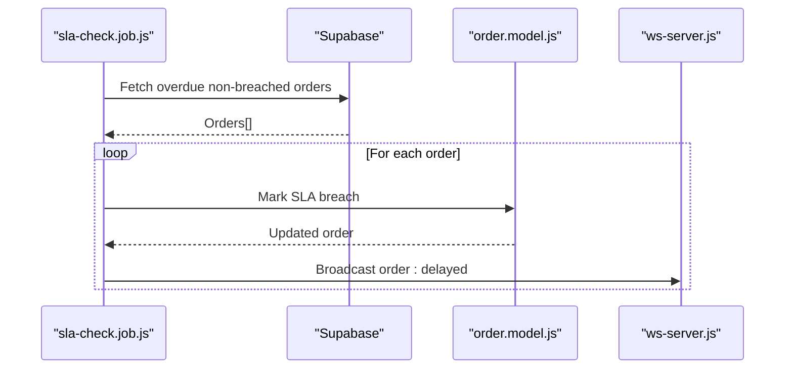

**Diagram sources**
- [sla-check.job.js:15-56](file://apps/server/jobs/sla-check.job.js#L15-L56)
- [order.model.js:150-155](file://apps/server/models/order.model.js#L150-L155)
- [ws-server.js:162-175](file://apps/server/websocket/ws-server.js#L162-L175)

**Section sources**
- [sla-check.job.js:15-56](file://apps/server/jobs/sla-check.job.js#L15-L56)
- [order.model.js:150-155](file://apps/server/models/order.model.js#L150-L155)

### Real-Time Events and Broadcasting
WebSocket server supports:
- Connection registry by project and role
- Broadcast and targeted messages
- Online user discovery by role
- Event types for delivery and order updates

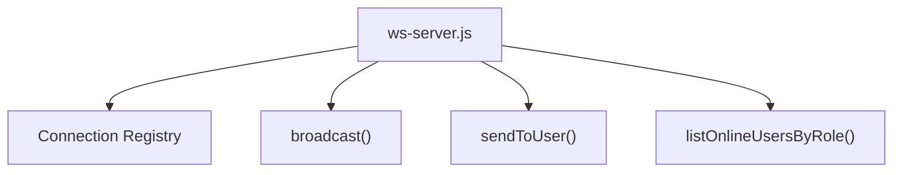

**Diagram sources**
- [ws-server.js:14-89](file://apps/server/websocket/ws-server.js#L14-L89)
- [ws-server.js:162-220](file://apps/server/websocket/ws-server.js#L162-L220)

**Section sources**
- [ws-server.js:14-89](file://apps/server/websocket/ws-server.js#L14-L89)
- [ws-server.js:162-220](file://apps/server/websocket/ws-server.js#L162-L220)

### API Definitions and Schemas

- List Deliveries
  - Method: GET
  - Path: /rider/deliveries
  - Auth: requireRole('rider', 'admin')
  - Query:
    - zoneId: string (UUID)
    - status: string
  - Response: { deliveries: Delivery[] }

- Claim Delivery
  - Method: POST
  - Path: /:id/claim
  - Auth: requireRole('rider', 'admin')
  - Response: { delivery: Delivery }

- Update Delivery Status
  - Method: POST
  - Path: /:id/status
  - Auth: requireRole('rider', 'admin')
  - Body: { status: enum['assigned','picked_up','delivered'] }
  - Response: { delivery: Delivery }

- Update Rider Location
  - Method: POST
  - Path: /:id/location
  - Auth: requireRole('rider', 'admin')
  - Body: { lat: number, lon: number, heading?: number, speed?: number }
  - Response: { ok: true } or 429 with rate limit message

- Get Rider Location
  - Method: GET
  - Path: /:id/location
  - Auth: requireRole('rider', 'admin', 'vendor')
  - Response: { location: RiderLocation }

- Update Rider Availability
  - Method: POST
  - Path: /rider/location
  - Auth: requireRole('rider', 'admin')
  - Body: { lat: number, lon: number, heading?: number, speed?: number }
  - Response: { ok: true }

- Rider Arrived
  - Method: POST
  - Path: /:id/arrived
  - Auth: requireRole('rider', 'admin')
  - Response: { delivery: Delivery }

- Assign Rider
  - Method: POST
  - Path: /:id/assign
  - Auth: requireRole('vendor', 'admin')
  - Body: { riderId: string }
  - Response: { delivery: Delivery }

- Reassign Delivery
  - Method: POST
  - Path: /:id/reassign
  - Auth: requireRole('vendor', 'admin')
  - Response: { ok: true }

- Assign External Rider
  - Method: POST
  - Path: /:id/assign-external
  - Auth: requireRole('vendor', 'admin')
  - Body: { name: string, phone: string }
  - Response: { ok: true }

**Section sources**
- [delivery.routes.js:14-28](file://apps/server/routes/delivery.routes.js#L14-L28)
- [delivery.validator.js:5-24](file://apps/server/validators/delivery.validator.js#L5-L24)
- [delivery.controller.js:10-313](file://apps/server/controllers/delivery.controller.js#L10-L313)

### Delivery Lifecycle Management Examples
- Creation: Auto-dispatch job creates a delivery when an order becomes ready.
- Assignment: Riders claim deliveries or vendors/admins assign specific riders.
- Tracking: Real-time location updates are rate-limited and broadcast.
- Arrival: Rider taps arrived to signal proximity.
- Completion: Status transitions to delivered upon completion.

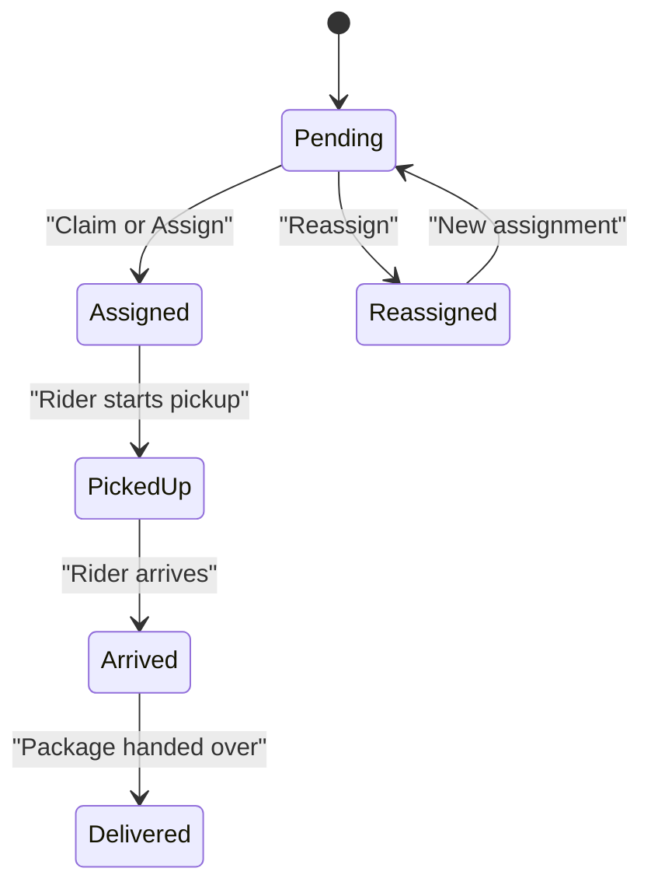

**Diagram sources**
- [delivery.model.js:7-81](file://apps/server/models/delivery.model.js#L7-L81)
- [order.model.js:12-21](file://apps/server/models/order.model.js#L12-L21)

**Section sources**
- [delivery.model.js:7-81](file://apps/server/models/delivery.model.js#L7-L81)
- [order.model.js:12-21](file://apps/server/models/order.model.js#L12-L21)

### Performance Metrics Collection
- Job execution logs for auto-dispatch and radius expansion
- SLA breach notifications and broadcasts
- Connection statistics via WebSocket server
- Rate limiting counters for location updates

**Section sources**
- [auto-dispatch.job.js:79-84](file://apps/server/jobs/auto-dispatch.job.js#L79-L84)
- [radius-expansion.job.js:73](file://apps/server/jobs/radius-expansion.job.js#L73)
- [sla-check.job.js:27-46](file://apps/server/jobs/sla-check.job.js#L27-L46)
- [ws-server.js:228-234](file://apps/server/websocket/ws-server.js#L228-L234)
- [session.service.js:124-130](file://apps/server/services/session.service.js#L124-L130)

## Dependency Analysis
The delivery coordination stack exhibits clear separation of concerns:
- Routes depend on middleware for authentication and role checks.
- Controllers depend on models, services, and WebSocket server.
- Jobs depend on models, services, and WebSocket server.
- Validators enforce request schemas for controllers.

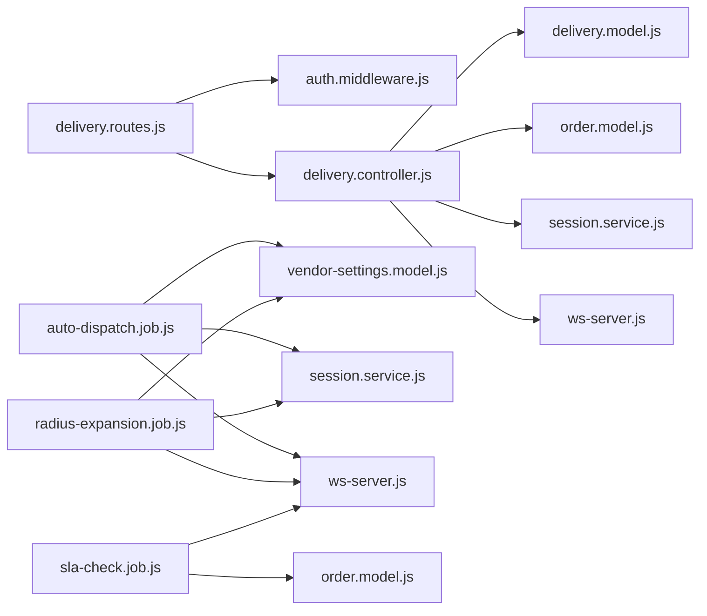

**Diagram sources**
- [delivery.routes.js:1-31](file://apps/server/routes/delivery.routes.js#L1-L31)
- [auth.middleware.js:1-123](file://apps/server/middleware/auth.middleware.js#L1-L123)
- [delivery.controller.js:1-313](file://apps/server/controllers/delivery.controller.js#L1-L313)
- [delivery.model.js:1-98](file://apps/server/models/delivery.model.js#L1-L98)
- [order.model.js:1-178](file://apps/server/models/order.model.js#L1-L178)
- [session.service.js:1-180](file://apps/server/services/session.service.js#L1-L180)
- [ws-server.js:1-237](file://apps/server/websocket/ws-server.js#L1-L237)
- [auto-dispatch.job.js:1-97](file://apps/server/jobs/auto-dispatch.job.js#L1-L97)
- [radius-expansion.job.js:1-87](file://apps/server/jobs/radius-expansion.job.js#L1-L87)
- [sla-check.job.js:1-59](file://apps/server/jobs/sla-check.job.js#L1-L59)
- [vendor-settings.model.js:1-51](file://apps/server/models/vendor-settings.model.js#L1-L51)

**Section sources**
- [delivery.routes.js:1-31](file://apps/server/routes/delivery.routes.js#L1-L31)
- [delivery.controller.js:1-313](file://apps/server/controllers/delivery.controller.js#L1-L313)

## Performance Considerations
- Rate limiting for location updates prevents excessive writes and network traffic.
- Redis-backed session storage improves scalability compared to in-memory stores.
- Background jobs use distributed locks to avoid concurrent execution.
- Broadcasting is scoped to project references to minimize fan-out.
- Haversine distance computation is used for spatial filtering; consider indexing and PostGIS for large-scale deployments.

[No sources needed since this section provides general guidance]

## Troubleshooting Guide
Common issues and resolutions:
- Authentication failures: Ensure admin_session cookie or Bearer token is present and valid.
- Insufficient permissions: Verify user role includes required roles for endpoint.
- Delivery not found: Confirm delivery ID exists and belongs to the project.
- Access denied for non-owning riders: Controllers enforce ownership checks for location/status updates.
- Location update throttled: Respect the 3-second rate limit per delivery.
- SLA breach notifications: Verify SLA check job is running and orders meet criteria.

**Section sources**
- [auth.middleware.js:56-76](file://apps/server/middleware/auth.middleware.js#L56-L76)
- [delivery.controller.js:30-35](file://apps/server/controllers/delivery.controller.js#L30-L35)
- [delivery.controller.js:88-95](file://apps/server/controllers/delivery.controller.js#L88-L95)
- [session.service.js:124-130](file://apps/server/services/session.service.js#L124-L130)
- [sla-check.job.js:15-56](file://apps/server/jobs/sla-check.job.js#L15-L56)

## Conclusion
The delivery and rider coordination system provides robust HTTP endpoints, background automation, and real-time communication. It supports flexible dispatch strategies, geographic matching, and SLA monitoring. The modular design enables scaling and maintenance while preserving clear data and control flows.

[No sources needed since this section summarizes without analyzing specific files]

## Appendices

### Endpoint Reference Summary
- GET /rider/deliveries
- POST /:id/claim
- POST /:id/status
- POST /:id/location
- GET /:id/location
- POST /rider/location
- POST /:id/arrived
- POST /:id/assign
- POST /:id/reassign
- POST /:id/assign-external

**Section sources**
- [delivery.routes.js:14-28](file://apps/server/routes/delivery.routes.js#L14-L28)