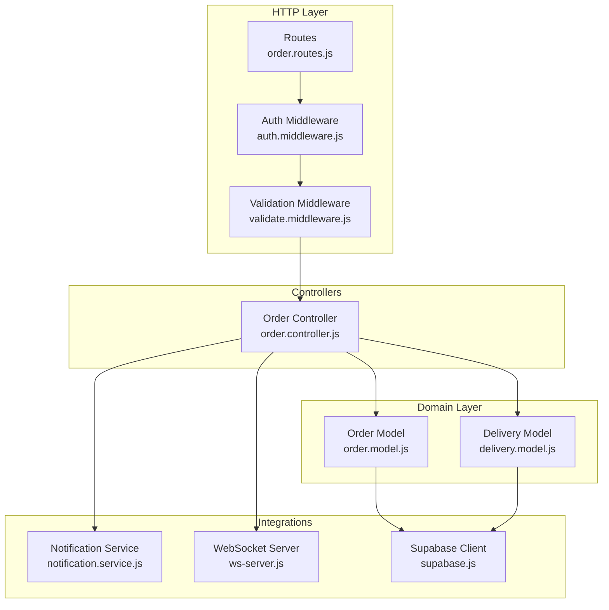
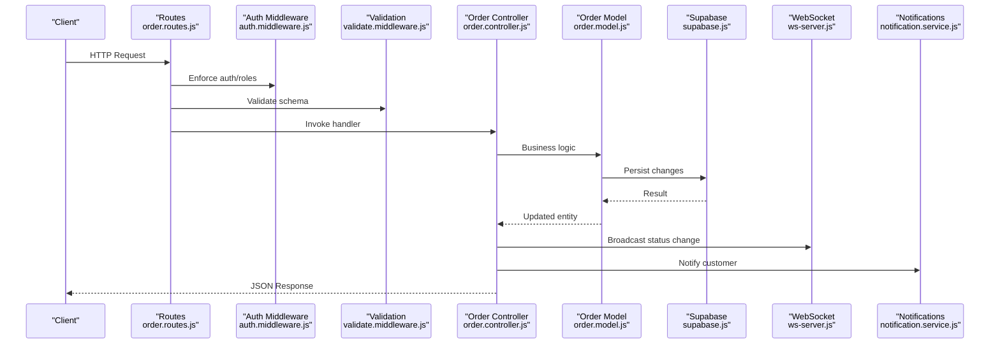
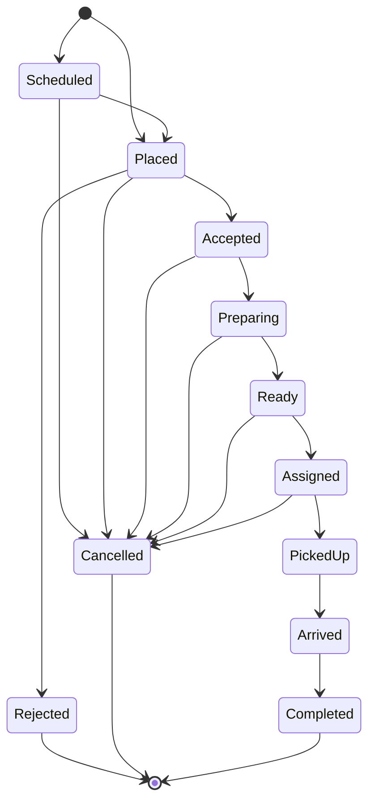
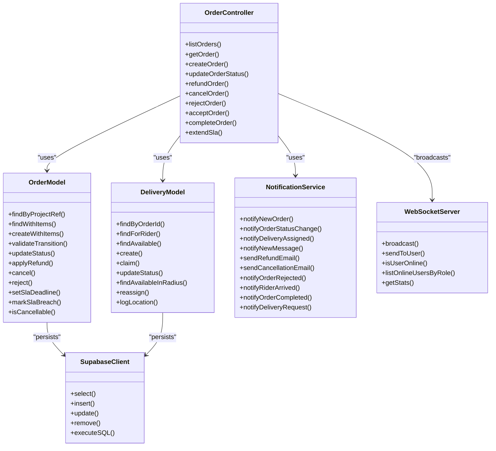

# Order Management System

<cite>
**Referenced Files in This Document**
- [order.controller.js](file://apps/server/controllers/order.controller.js)
- [order.routes.js](file://apps/server/routes/order.routes.js)
- [order.validator.js](file://apps/server/validators/order.validator.js)
- [order.model.js](file://apps/server/models/order.model.js)
- [delivery.model.js](file://apps/server/models/delivery.model.js)
- [notification.service.js](file://apps/server/services/notification.service.js)
- [auth.middleware.js](file://apps/server/middleware/auth.middleware.js)
- [validate.middleware.js](file://apps/server/middleware/validate.middleware.js)
- [supabase.js](file://apps/server/lib/supabase.js)
- [ws-server.js](file://apps/server/websocket/ws-server.js)
- [000_core_schema.sql](file://apps/server/migrations/000_core_schema.sql)
- [009_order_lifecycle.sql](file://apps/server/migrations/009_order_lifecycle.sql)
- [use-orders.ts](file://apps/customer/src/hooks/use-orders.ts)
- [api.ts](file://apps/customer/src/lib/api.ts)
- [app.js](file://apps/server/app.js)
</cite>

## Table of Contents
1. [Introduction](#introduction)
2. [Project Structure](#project-structure)
3. [Core Components](#core-components)
4. [Architecture Overview](#architecture-overview)
5. [Detailed Component Analysis](#detailed-component-analysis)
6. [Dependency Analysis](#dependency-analysis)
7. [Performance Considerations](#performance-considerations)
8. [Troubleshooting Guide](#troubleshooting-guide)
9. [Conclusion](#conclusion)
10. [Appendices](#appendices)

## Introduction
This document provides comprehensive API documentation for the order management system. It covers order creation, retrieval, updates, cancellations, and status transitions. It also documents filtering, pagination, and search capabilities, along with real-time updates, notifications, and audit logging. The documentation includes request/response schemas, state machine transitions, business rule enforcement, validation, conflict resolution, and error handling patterns.

## Project Structure
The order management system is implemented as part of the server application with clear separation of concerns:
- Routes define the HTTP endpoints and apply middleware for authentication, authorization, and validation.
- Controllers implement the business logic for order operations, status transitions, refunds, and cancellations.
- Models encapsulate data access and enforce domain rules (status transitions, cancellability).
- Services handle notifications and integrations (e.g., Stripe refunds).
- Middleware enforces authentication/authorization and validates requests.
- WebSockets broadcast real-time order updates.
- Migrations define the database schema and lifecycle extensions.

**Diagram sources**
- [order.routes.js:1-39](file://apps/server/routes/order.routes.js#L1-L39)
- [auth.middleware.js:1-123](file://apps/server/middleware/auth.middleware.js#L1-L123)
- [validate.middleware.js:1-28](file://apps/server/middleware/validate.middleware.js#L1-L28)
- [order.controller.js:1-513](file://apps/server/controllers/order.controller.js#L1-L513)
- [order.model.js:1-178](file://apps/server/models/order.model.js#L1-L178)
- [delivery.model.js:1-98](file://apps/server/models/delivery.model.js#L1-L98)
- [notification.service.js:1-180](file://apps/server/services/notification.service.js#L1-L180)
- [ws-server.js:1-237](file://apps/server/websocket/ws-server.js#L1-L237)
- [supabase.js:1-151](file://apps/server/lib/supabase.js#L1-L151)

**Section sources**
- [order.routes.js:1-39](file://apps/server/routes/order.routes.js#L1-L39)
- [order.controller.js:1-513](file://apps/server/controllers/order.controller.js#L1-L513)
- [order.model.js:1-178](file://apps/server/models/order.model.js#L1-L178)
- [delivery.model.js:1-98](file://apps/server/models/delivery.model.js#L1-L98)
- [notification.service.js:1-180](file://apps/server/services/notification.service.js#L1-L180)
- [ws-server.js:1-237](file://apps/server/websocket/ws-server.js#L1-L237)
- [supabase.js:1-151](file://apps/server/lib/supabase.js#L1-L151)

## Core Components
- Order controller: Implements all order operations including listing, retrieving, creating, updating status, accepting/rejecting, extending SLA, refunding, cancelling, and completing.
- Order model: Defines valid statuses, status transitions, cancellability, and persistence operations.
- Delivery model: Manages delivery lifecycle and rider assignments.
- Notification service: Sends push notifications and emails for order events.
- Validation middleware and Zod validators: Enforce request schemas for all endpoints.
- Authentication middleware: Handles admin/customer sessions and JWT-based authentication.
- WebSocket server: Broadcasts real-time order/delivery events.
- Supabase client: Provides database access via REST and helper functions.

**Section sources**
- [order.controller.js:1-513](file://apps/server/controllers/order.controller.js#L1-L513)
- [order.model.js:1-178](file://apps/server/models/order.model.js#L1-L178)
- [delivery.model.js:1-98](file://apps/server/models/delivery.model.js#L1-L98)
- [notification.service.js:1-180](file://apps/server/services/notification.service.js#L1-L180)
- [order.validator.js:1-66](file://apps/server/validators/order.validator.js#L1-L66)
- [auth.middleware.js:1-123](file://apps/server/middleware/auth.middleware.js#L1-L123)
- [validate.middleware.js:1-28](file://apps/server/middleware/validate.middleware.js#L1-L28)
- [ws-server.js:1-237](file://apps/server/websocket/ws-server.js#L1-L237)
- [supabase.js:1-151](file://apps/server/lib/supabase.js#L1-L151)

## Architecture Overview
The order lifecycle is orchestrated by the controller, validated by middleware, persisted by models, and propagated to clients via websockets and notifications.

**Diagram sources**
- [order.routes.js:12-39](file://apps/server/routes/order.routes.js#L12-L39)
- [auth.middleware.js:11-123](file://apps/server/middleware/auth.middleware.js#L11-L123)
- [validate.middleware.js:9-28](file://apps/server/middleware/validate.middleware.js#L9-L28)
- [order.controller.js:142-191](file://apps/server/controllers/order.controller.js#L142-L191)
- [order.model.js:95-113](file://apps/server/models/order.model.js#L95-L113)
- [supabase.js:107-139](file://apps/server/lib/supabase.js#L107-L139)
- [ws-server.js:162-175](file://apps/server/websocket/ws-server.js#L162-L175)
- [notification.service.js:42-53](file://apps/server/services/notification.service.js#L42-L53)

## Detailed Component Analysis

### API Endpoints

#### List Orders
- Method: GET
- Path: /api/orders
- Auth: Any authenticated user (customer/admin/vendor)
- Query Params:
  - status: string (optional)
  - customerId: uuid (optional)
  - limit: number (default 50, max 100)
  - offset: number (default 0)
- Response: { orders: Order[] }

Behavior:
- Filters by project reference, optional status, and optional customer ID.
- Returns paginated results ordered by creation time descending.

**Section sources**
- [order.routes.js:15](file://apps/server/routes/order.routes.js#L15)
- [order.controller.js:30-46](file://apps/server/controllers/order.controller.js#L30-L46)
- [order.validator.js:45-50](file://apps/server/validators/order.validator.js#L45-L50)
- [order.model.js:30-42](file://apps/server/models/order.model.js#L30-L42)

#### Get Order
- Method: GET
- Path: /api/orders/:id
- Auth: Any authenticated user; customer can only access their own orders
- Response: { order: OrderWithItems }

Behavior:
- Enforces project reference and ownership for customers.
- Includes delivery and vendor metadata for UI.

**Section sources**
- [order.routes.js:19](file://apps/server/routes/order.routes.js#L19)
- [order.controller.js:50-82](file://apps/server/controllers/order.controller.js#L50-L82)
- [order.model.js:44-50](file://apps/server/models/order.model.js#L44-L50)

#### Create Order (Internal)
- Method: POST
- Path: /api/orders
- Auth: Admin only
- Body Schema: createOrderSchema
- Response: { order: OrderWithItems }

Behavior:
- Creates order with items atomically.
- Automatically accepts based on vendor settings if configured.
- Broadcasts real-time updates and notifies vendor.

**Section sources**
- [order.routes.js:18](file://apps/server/routes/order.routes.js#L18)
- [order.controller.js:86-138](file://apps/server/controllers/order.controller.js#L86-L138)
- [order.validator.js:12-18](file://apps/server/validators/order.validator.js#L12-L18)
- [order.model.js:56-93](file://apps/server/models/order.model.js#L56-L93)

#### Update Order Status (Admin/Vendor)
- Method: PATCH
- Path: /api/orders/:id/status
- Auth: Admin or vendor
- Body Schema: updateStatusSchema
- Response: { order: Order } or { order: Order, idempotent: true }

Behavior:
- Validates transition against allowed status graph.
- Broadcasts real-time updates and pushes customer notifications.

**Section sources**
- [order.routes.js:22](file://apps/server/routes/order.routes.js#L22)
- [order.controller.js:142-191](file://apps/server/controllers/order.controller.js#L142-L191)
- [order.validator.js:20-25](file://apps/server/validators/order.validator.js#L20-L25)
- [order.model.js:95-103](file://apps/server/models/order.model.js#L95-L103)

#### Refund Order (Admin/Vendor)
- Method: POST
- Path: /api/orders/:id/refund
- Auth: Admin or vendor
- Body Schema: refundSchema
- Response: { ok: true, refundAmount: number }

Behavior:
- Requires payment status to be paid.
- Supports partial or full refunds via Stripe service.
- Updates payment status and logs audit.

**Section sources**
- [order.routes.js:25](file://apps/server/routes/order.routes.js#L25)
- [order.controller.js:195-234](file://apps/server/controllers/order.controller.js#L195-L234)
- [order.validator.js:35-38](file://apps/server/validators/order.validator.js#L35-L38)
- [order.model.js:115-122](file://apps/server/models/order.model.js#L115-L122)

#### Cancel Order (Customer/Admin/Vendor)
- Method: POST
- Path: /api/orders/:id/cancel
- Auth: Customer (own order) or admin/vendor
- Body Schema: cancelSchema
- Response: { ok: true } or { ok: true, idempotent: true }

Behavior:
- Enforces cancellability rules.
- Auto-refunds if already paid.
- Broadcasts real-time updates and sends cancellation email.

**Section sources**
- [order.routes.js:28](file://apps/server/routes/order.routes.js#L28)
- [order.controller.js:238-296](file://apps/server/controllers/order.controller.js#L238-L296)
- [order.validator.js:40-43](file://apps/server/validators/order.validator.js#L40-L43)
- [order.model.js:124-131](file://apps/server/models/order.model.js#L124-L131)
- [order.model.js:157-159](file://apps/server/models/order.model.js#L157-L159)

#### Accept Order (Vendor/Admin)
- Method: POST
- Path: /api/orders/:id/accept
- Auth: Vendor or admin
- Body Schema: acceptSchema
- Response: { order: Order }

Behavior:
- Validates current status is placed.
- Sets SLA deadline based on vendor settings or provided prep time.
- Broadcasts updates and notifies customer.

**Section sources**
- [order.routes.js:31](file://apps/server/routes/order.routes.js#L31)
- [order.controller.js:346-398](file://apps/server/controllers/order.controller.js#L346-L398)
- [order.validator.js:31-33](file://apps/server/validators/order.validator.js#L31-L33)
- [order.model.js:141-148](file://apps/server/models/order.model.js#L141-L148)

#### Reject Order (Vendor/Admin)
- Method: POST
- Path: /api/orders/:id/reject
- Auth: Vendor or admin
- Body Schema: rejectSchema
- Response: { order: Order } or { order: Order, idempotent: true }

Behavior:
- Broadcasts rejection event and notifies customer.

**Section sources**
- [order.routes.js:32](file://apps/server/routes/order.routes.js#L32)
- [order.controller.js:299-342](file://apps/server/controllers/order.controller.js#L299-L342)
- [order.validator.js:27-29](file://apps/server/validators/order.validator.js#L27-L29)

#### Extend SLA (Vendor/Admin)
- Method: POST
- Path: /api/orders/:id/extend-sla
- Auth: Vendor or admin
- Body Schema: extendSlaSchema
- Response: { ok: true, newDeadline: string }

Behavior:
- Can only be applied to accepted/preparing orders.
- Extends SLA deadline and resets breach flag.

**Section sources**
- [order.routes.js:33](file://apps/server/routes/order.routes.js#L33)
- [order.controller.js:456-499](file://apps/server/controllers/order.controller.js#L456-L499)
- [order.validator.js:52-54](file://apps/server/validators/order.validator.js#L52-L54)

#### Complete Order (Rider/Admin)
- Method: POST
- Path: /api/orders/:id/complete
- Auth: Rider or admin
- Body: none
- Response: { order: Order }

Behavior:
- Requires associated delivery to be in arrived status.
- Completes both delivery and order.

**Section sources**
- [order.routes.js:36](file://apps/server/routes/order.routes.js#L36)
- [order.controller.js:402-452](file://apps/server/controllers/order.controller.js#L402-L452)
- [delivery.model.js:57-66](file://apps/server/models/delivery.model.js#L57-L66)

### Request/Response Schemas

#### Order Creation Payload
- items: array of order items (min 1)
  - productId: uuid (optional)
  - name: string (required)
  - quantity: positive integer (required)
  - unitPriceCents: positive integer (required)
- totalCents: positive integer (required)
- paymentIntentId: string (optional)
- scheduledFor: datetime string (optional)
- customerId: uuid (optional)

**Section sources**
- [order.validator.js:12-18](file://apps/server/validators/order.validator.js#L12-L18)

#### Order Status Update Payload
- status: one of placed, accepted, rejected, preparing, ready, assigned, picked_up, arrived, completed, cancelled, scheduled

**Section sources**
- [order.validator.js:20-25](file://apps/server/validators/order.validator.js#L20-L25)

#### Accept Order Payload
- prepTimeMinutes: integer between 5 and 120 (optional)

**Section sources**
- [order.validator.js:31-33](file://apps/server/validators/order.validator.js#L31-L33)

#### Reject Order Payload
- reason: string up to 500 chars (optional)

**Section sources**
- [order.validator.js:27-29](file://apps/server/validators/order.validator.js#L27-L29)

#### Refund Order Payload
- amountCents: positive integer (optional)
- reason: string up to 500 chars (optional)

**Section sources**
- [order.validator.js:35-38](file://apps/server/validators/order.validator.js#L35-L38)

#### Cancel Order Payload
- reason: string up to 500 chars (optional)
- initiator: enum customer | vendor | admin (optional)

**Section sources**
- [order.validator.js:40-43](file://apps/server/validators/order.validator.js#L40-L43)

#### Extend SLA Payload
- additionalMinutes: integer between 5 and 60 (optional)

**Section sources**
- [order.validator.js:52-54](file://apps/server/validators/order.validator.js#L52-L54)

### Order State Machine and Transitions
Allowed transitions are enforced by the model and documented below.

**Diagram sources**
- [order.model.js:12-21](file://apps/server/models/order.model.js#L12-L21)

### Order Filtering, Pagination, and Search
- Filtering: status, customerId
- Pagination: limit (default 50, max 100), offset (default 0)
- Ordering: created_at desc
- Search: Not implemented in the controller; filtering by status and customer supported.

**Section sources**
- [order.controller.js:30-46](file://apps/server/controllers/order.controller.js#L30-L46)
- [order.validator.js:45-50](file://apps/server/validators/order.validator.js#L45-L50)
- [order.model.js:30-42](file://apps/server/models/order.model.js#L30-L42)

### Real-Time Updates and Notifications
- WebSocket broadcasts:
  - order:status_changed
  - order:rejected
  - order:delayed
- Push notifications:
  - Customer receives status change notifications.
  - Vendor receives new order notifications.
  - Rider receives delivery assignment and availability notifications.

**Section sources**
- [order.controller.js:162-168](file://apps/server/controllers/order.controller.js#L162-L168)
- [order.controller.js:316-321](file://apps/server/controllers/order.controller.js#L316-L321)
- [ws-server.js:162-175](file://apps/server/websocket/ws-server.js#L162-L175)
- [notification.service.js:42-53](file://apps/server/services/notification.service.js#L42-L53)
- [notification.service.js:27-37](file://apps/server/services/notification.service.js#L27-L37)

### Audit Logging
- All order operations write audit logs with caller identity, action, resource details, and IP.

**Section sources**
- [order.controller.js:178-185](file://apps/server/controllers/order.controller.js#L178-L185)
- [order.controller.js:283-290](file://apps/server/controllers/order.controller.js#L283-L290)
- [order.controller.js:385-392](file://apps/server/controllers/order.controller.js#L385-L392)
- [order.controller.js:439-446](file://apps/server/controllers/order.controller.js#L439-L446)

### Payment Linking
- The order model supports linking a payment intent and marking payment as paid.
- Used during order creation from the Stripe webhook.

**Section sources**
- [order.model.js:168-174](file://apps/server/models/order.model.js#L168-L174)
- [order.controller.js:86-97](file://apps/server/controllers/order.controller.js#L86-L97)

### Restaurant Acceptance and Preparation Tracking
- Accept endpoint sets SLA deadline based on vendor settings or provided prep time.
- Extend SLA endpoint adjusts deadlines for accepted/preparing orders.

**Section sources**
- [order.controller.js:362-367](file://apps/server/controllers/order.controller.js#L362-L367)
- [order.controller.js:464-472](file://apps/server/controllers/order.controller.js#L464-L472)
- [order.model.js:141-148](file://apps/server/models/order.model.js#L141-L148)

### Delivery Coordination
- Delivery model manages delivery lifecycle and rider assignments.
- Complete order endpoint requires delivery status to be arrived.

**Section sources**
- [delivery.model.js:14-66](file://apps/server/models/delivery.model.js#L14-L66)
- [order.controller.js:410-418](file://apps/server/controllers/order.controller.js#L410-L418)

### Examples: Order Lifecycle Management
- Customer places order via checkout; backend creates order with items.
- Restaurant auto-accepts or vendor manually accepts; SLA deadline set.
- Customer receives push notifications at each stage.
- Rider claims delivery and updates status; order marked completed upon arrival.

**Section sources**
- [order.controller.js:86-138](file://apps/server/controllers/order.controller.js#L86-L138)
- [order.controller.js:346-398](file://apps/server/controllers/order.controller.js#L346-L398)
- [order.controller.js:402-452](file://apps/server/controllers/order.controller.js#L402-L452)
- [notification.service.js:42-53](file://apps/server/services/notification.service.js#L42-L53)

## Dependency Analysis

**Diagram sources**
- [order.controller.js:1-513](file://apps/server/controllers/order.controller.js#L1-L513)
- [order.model.js:1-178](file://apps/server/models/order.model.js#L1-L178)
- [delivery.model.js:1-98](file://apps/server/models/delivery.model.js#L1-L98)
- [notification.service.js:1-180](file://apps/server/services/notification.service.js#L1-L180)
- [ws-server.js:1-237](file://apps/server/websocket/ws-server.js#L1-L237)
- [supabase.js:1-151](file://apps/server/lib/supabase.js#L1-L151)

**Section sources**
- [order.controller.js:1-513](file://apps/server/controllers/order.controller.js#L1-L513)
- [order.model.js:1-178](file://apps/server/models/order.model.js#L1-L178)
- [delivery.model.js:1-98](file://apps/server/models/delivery.model.js#L1-L98)
- [notification.service.js:1-180](file://apps/server/services/notification.service.js#L1-L180)
- [ws-server.js:1-237](file://apps/server/websocket/ws-server.js#L1-L237)
- [supabase.js:1-151](file://apps/server/lib/supabase.js#L1-L151)

## Performance Considerations
- Pagination defaults prevent large result sets; ensure consumers use limit and offset appropriately.
- WebSocket broadcasting is per-project; consider scaling strategies for high-volume workspaces.
- Supabase REST queries use indexed columns (project_ref, status, created_at); maintain indexes for optimal performance.
- Avoid excessive real-time updates by batching or debouncing where appropriate in clients.

[No sources needed since this section provides general guidance]

## Troubleshooting Guide
Common issues and resolutions:
- Access Denied: Ensure proper authentication and role (admin/vendor/customer). Check project reference and ownership rules.
- Validation Errors: Review request schemas and ensure required fields meet constraints (enums, min/max values).
- Invalid Status Transition: Confirm current status allows the requested transition.
- Cannot Cancel: Verify order status is in cancellable set.
- No Delivery Found: Complete requires an associated delivery in arrived status.
- WebSocket Authentication Failures: Confirm session cookies or JWT token validity.

**Section sources**
- [order.controller.js:147-149](file://apps/server/controllers/order.controller.js#L147-L149)
- [order.controller.js:247-250](file://apps/server/controllers/order.controller.js#L247-L250)
- [order.controller.js:410-411](file://apps/server/controllers/order.controller.js#L410-L411)
- [auth.middleware.js:11-123](file://apps/server/middleware/auth.middleware.js#L11-L123)
- [validate.middleware.js:9-28](file://apps/server/middleware/validate.middleware.js#L9-L28)
- [order.model.js:95-103](file://apps/server/models/order.model.js#L95-L103)
- [ws-server.js:95-124](file://apps/server/websocket/ws-server.js#L95-L124)

## Conclusion
The order management system provides a robust, secure, and real-time-driven API for managing the complete order lifecycle. It enforces business rules through explicit state transitions, comprehensive validation, and role-based access control. The combination of websockets, notifications, and audit logging ensures transparency and responsiveness across customer, vendor, and rider experiences.

[No sources needed since this section summarizes without analyzing specific files]

## Appendices

### Database Schema Highlights
- Orders table includes lifecycle fields (SLA, prep time, delivery mode, rejection reason) and canonical status constraints.
- Order items table links products to orders with quantities and pricing.
- Deliveries table tracks rider assignments and statuses.

**Section sources**
- [000_core_schema.sql:67-118](file://apps/server/migrations/000_core_schema.sql#L67-L118)
- [009_order_lifecycle.sql:4-46](file://apps/server/migrations/009_order_lifecycle.sql#L4-L46)

### Frontend Integration Notes
- Client-side hooks poll order lists and individual orders and subscribe to real-time events to refresh data.
- API client uses environment-specific base URLs.

**Section sources**
- [use-orders.ts:6-45](file://apps/customer/src/hooks/use-orders.ts#L6-L45)
- [api.ts:3-10](file://apps/customer/src/lib/api.ts#L3-L10)