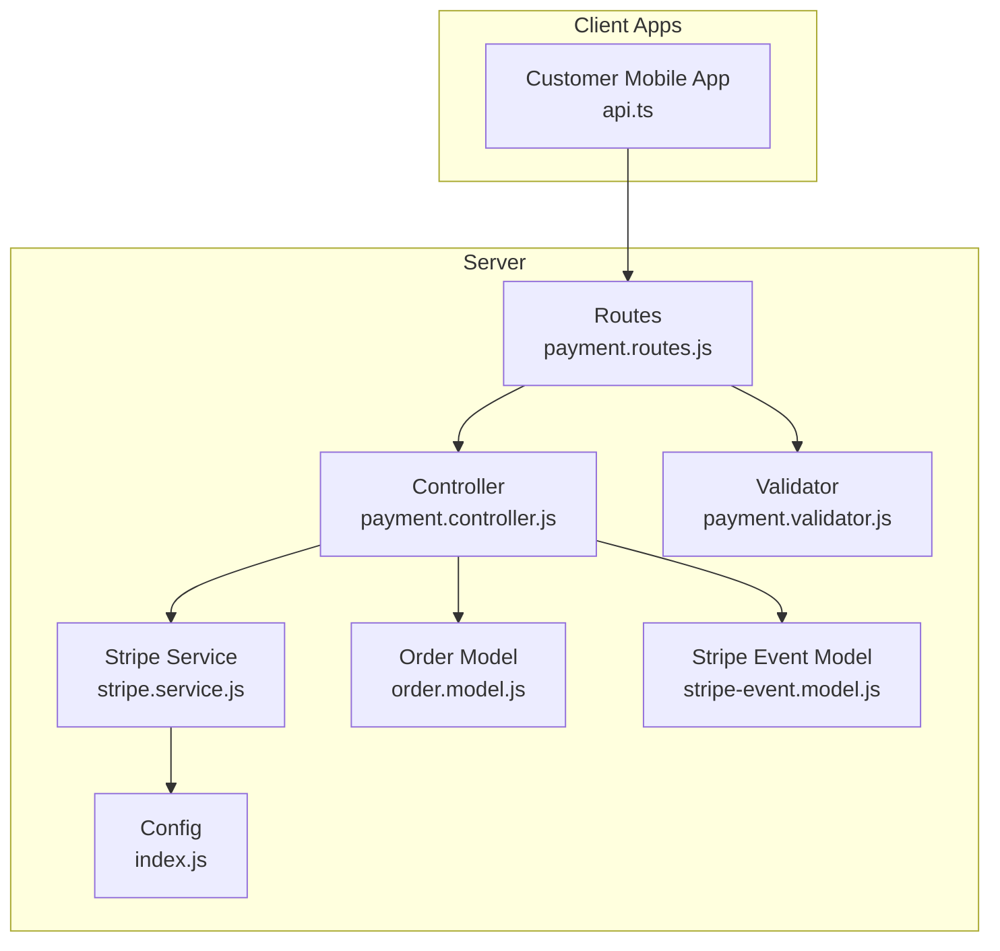
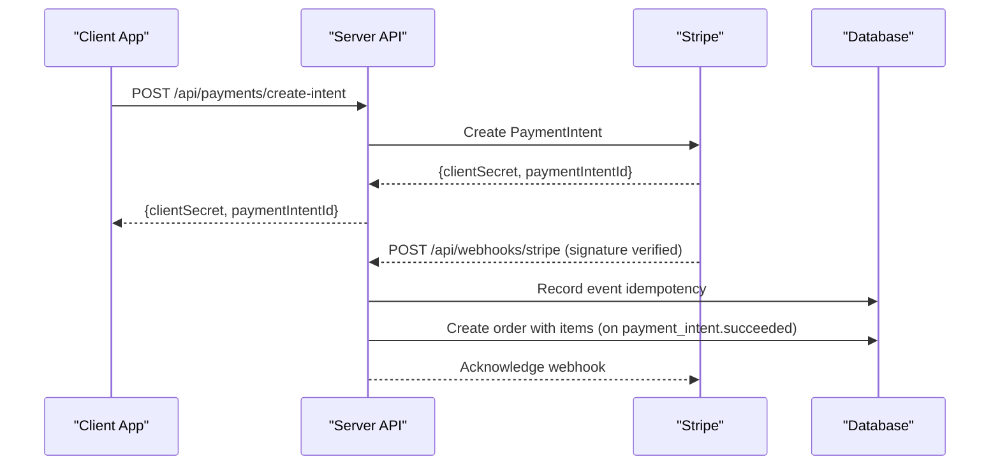
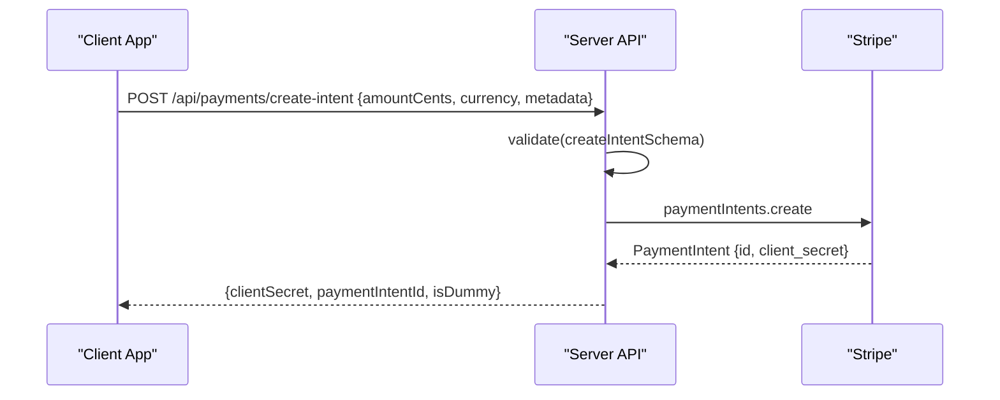
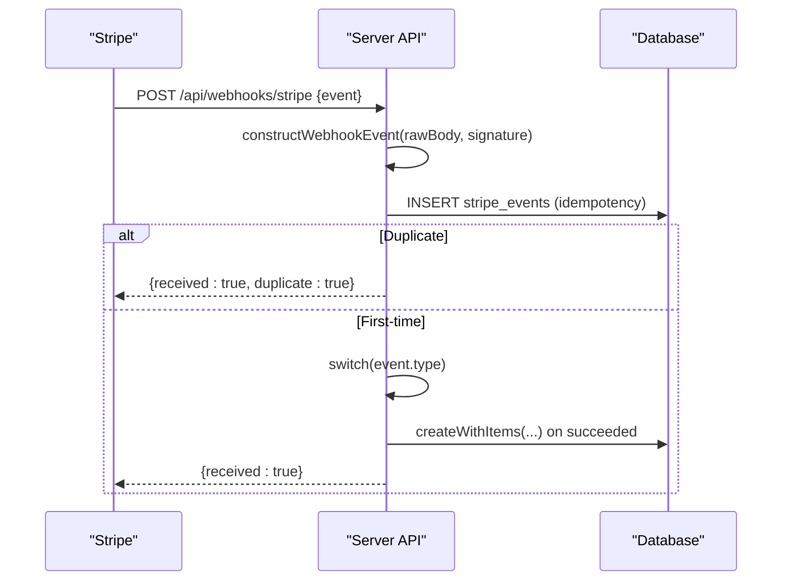
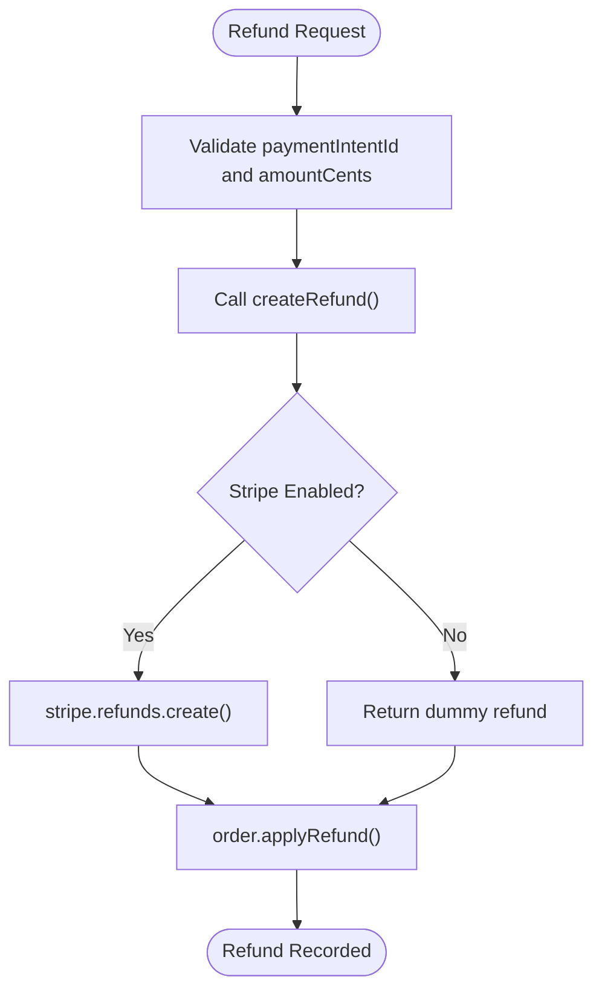
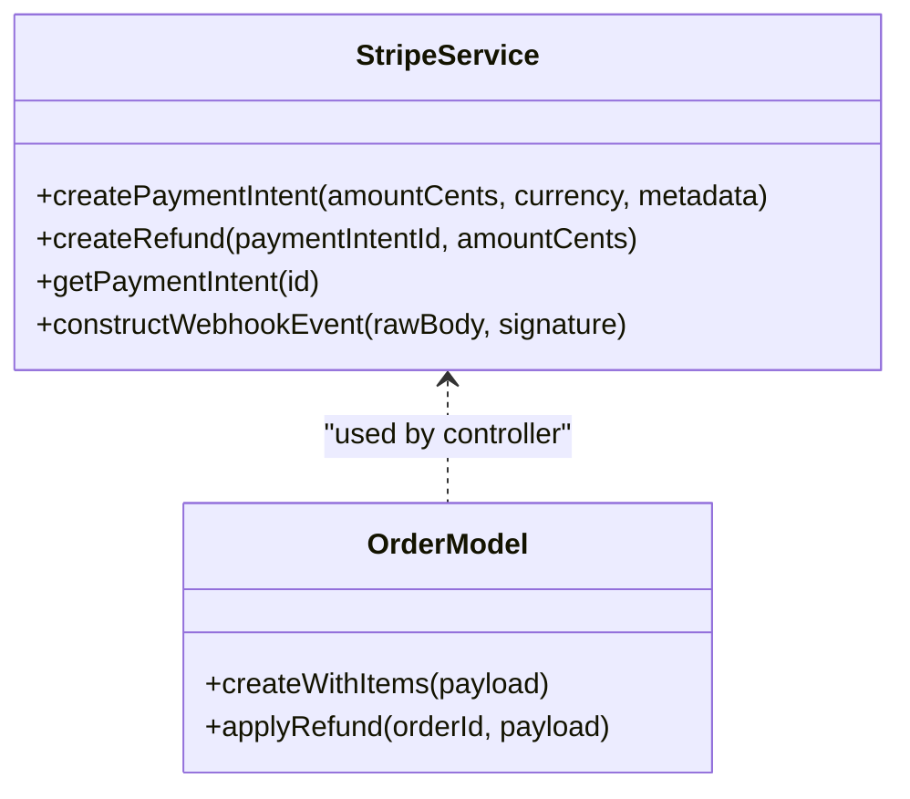
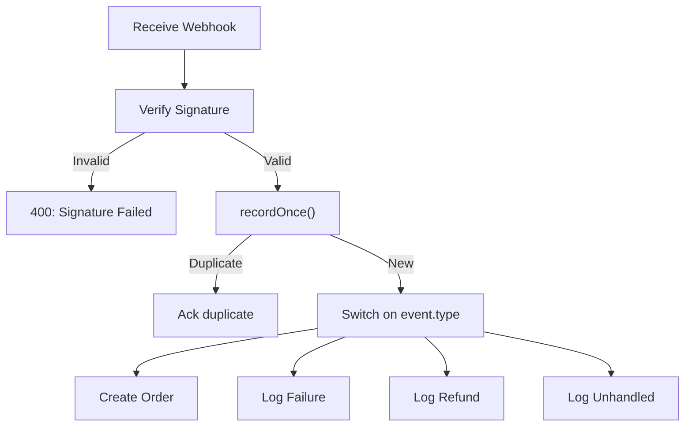
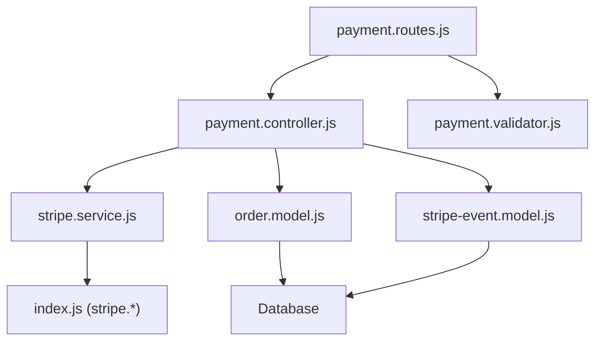

# Payment Processing

<cite>
**Referenced Files in This Document**
- [payment.controller.js](file://apps/server/controllers/payment.controller.js)
- [payment.routes.js](file://apps/server/routes/payment.routes.js)
- [stripe.service.js](file://apps/server/services/stripe.service.js)
- [payment.validator.js](file://apps/server/validators/payment.validator.js)
- [stripe-event.model.js](file://apps/server/models/stripe-event.model.js)
- [order.model.js](file://apps/server/models/order.model.js)
- [index.js](file://apps/server/config/index.js)
- [013_stripe_events.sql](file://apps/server/migrations/013_stripe_events.sql)
- [002_refund_columns.sql](file://apps/server/migrations/002_refund_columns.sql)
- [009_order_lifecycle.sql](file://apps/server/migrations/009_order_lifecycle.sql)
- [api.ts](file://apps/customer-mobile/src/lib/api.ts)
</cite>

## Table of Contents
1. [Introduction](#introduction)
2. [Project Structure](#project-structure)
3. [Core Components](#core-components)
4. [Architecture Overview](#architecture-overview)
5. [Detailed Component Analysis](#detailed-component-analysis)
6. [Dependency Analysis](#dependency-analysis)
7. [Performance Considerations](#performance-considerations)
8. [Troubleshooting Guide](#troubleshooting-guide)
9. [Conclusion](#conclusion)
10. [Appendices](#appendices)

## Introduction
This document provides comprehensive API documentation for payment processing endpoints, focusing on Stripe integration within the backend server. It covers payment intent creation, confirmation orchestration, webhook handling, refund operations, and schemas for payment methods and card processing. It also documents webhook endpoints for payment events, dispute handling, and subscription management, along with examples of payment flow orchestration, error handling for failed payments, and reconciliation processes. Security best practices, PCI compliance considerations, and payment method validation are addressed throughout.

## Project Structure
The payment processing functionality is implemented in the server application under apps/server. Key areas include:
- Routes: Define HTTP endpoints for payment intents and Stripe webhooks.
- Controllers: Implement request handling and orchestrate service/model interactions.
- Services: Interact with Stripe SDK and encapsulate payment logic.
- Validators: Enforce request payload schemas.
- Models: Persist order and Stripe event records.
- Migrations: Define database schema for Stripe events and order refund tracking.

**Diagram sources**
- [payment.routes.js:1-38](file://apps/server/routes/payment.routes.js#L1-L38)
- [payment.controller.js:1-109](file://apps/server/controllers/payment.controller.js#L1-L109)
- [stripe.service.js:1-83](file://apps/server/services/stripe.service.js#L1-L83)
- [order.model.js:1-178](file://apps/server/models/order.model.js#L1-L178)
- [stripe-event.model.js:1-25](file://apps/server/models/stripe-event.model.js#L1-L25)
- [payment.validator.js:1-17](file://apps/server/validators/payment.validator.js#L1-L17)
- [index.js:60-66](file://apps/server/config/index.js#L60-L66)

**Section sources**
- [payment.routes.js:1-38](file://apps/server/routes/payment.routes.js#L1-L38)
- [payment.controller.js:1-109](file://apps/server/controllers/payment.controller.js#L1-L109)
- [stripe.service.js:1-83](file://apps/server/services/stripe.service.js#L1-L83)
- [order.model.js:1-178](file://apps/server/models/order.model.js#L1-L178)
- [stripe-event.model.js:1-25](file://apps/server/models/stripe-event.model.js#L1-L25)
- [payment.validator.js:1-17](file://apps/server/validators/payment.validator.js#L1-L17)
- [index.js:60-66](file://apps/server/config/index.js#L60-L66)

## Core Components
- Payment Intent Creation Endpoint
  - Method: POST
  - Path: /api/payments/create-intent
  - Authentication: Session parsed, requires any auth, project reference attached
  - Rate Limiting: Payments-specific limiter
  - Validation: createIntentSchema
  - Behavior: Delegates to Stripe service to create a PaymentIntent; returns clientSecret and paymentIntentId

- Stripe Webhook Endpoint
  - Method: POST
  - Path: /api/webhooks/stripe
  - Body: Raw JSON required (registered before express.json)
  - Signature Verification: Uses Stripe webhook secret
  - Idempotency: Records events in stripe_events table to prevent duplicate processing
  - Event Handling:
    - payment_intent.succeeded: Creates order via order model with items and metadata
    - payment_intent.payment_failed: Logs failure
    - charge.refunded: Logs refund
    - Other events: Logged as unhandled

- Stripe Service
  - createPaymentIntent: Creates PaymentIntent with automatic_payment_methods enabled
  - createRefund: Issues refunds for a payment intent (partial or full)
  - getPaymentIntent: Retrieves PaymentIntent by ID
  - constructWebhookEvent: Verifies webhook signatures using webhook secret

- Order Model
  - createWithItems: Atomic creation of order and items; called from webhook only
  - applyRefund: Updates order payment_status and refund metadata
  - Status transitions and validations are enforced

- Stripe Event Model
  - recordOnce: Ensures idempotent processing of events via unique constraint

- Validators
  - createIntentSchema: Validates amountCents, currency, and optional metadata

- Configuration
  - stripe.secretKey and stripe.webhookSecret enable/disable Stripe features and webhook verification

**Section sources**
- [payment.routes.js:14-35](file://apps/server/routes/payment.routes.js#L14-L35)
- [payment.controller.js:11-106](file://apps/server/controllers/payment.controller.js#L11-L106)
- [stripe.service.js:19-80](file://apps/server/services/stripe.service.js#L19-L80)
- [order.model.js:56-93](file://apps/server/models/order.model.js#L56-L93)
- [stripe-event.model.js:9-20](file://apps/server/models/stripe-event.model.js#L9-L20)
- [payment.validator.js:5-9](file://apps/server/validators/payment.validator.js#L5-L9)
- [index.js:60-66](file://apps/server/config/index.js#L60-L66)

## Architecture Overview
The payment flow integrates client applications with the server, which interacts with Stripe via the Stripe service. Webhooks from Stripe trigger order creation and payment reconciliation.

**Diagram sources**
- [payment.routes.js:16-35](file://apps/server/routes/payment.routes.js#L16-L35)
- [payment.controller.js:29-106](file://apps/server/controllers/payment.controller.js#L29-L106)
- [stripe.service.js:74-80](file://apps/server/services/stripe.service.js#L74-L80)
- [order.model.js:56-93](file://apps/server/models/order.model.js#L56-L93)
- [013_stripe_events.sql:3-7](file://apps/server/migrations/013_stripe_events.sql#L3-L7)

## Detailed Component Analysis

### Payment Intent Creation API
- Purpose: Generate a Stripe PaymentIntent for client-side confirmation.
- Request Schema (validated):
  - amountCents: positive integer
  - currency: 3-character ISO code (default: gbp)
  - metadata: optional record of strings
- Response:
  - clientSecret: used by client to confirm payment
  - paymentIntentId: unique identifier for the intent
  - isDummy: indicates fallback mode when Stripe is disabled

**Diagram sources**
- [payment.routes.js:27-35](file://apps/server/routes/payment.routes.js#L27-L35)
- [payment.validator.js:5-9](file://apps/server/validators/payment.validator.js#L5-L9)
- [stripe.service.js:19-43](file://apps/server/services/stripe.service.js#L19-L43)

**Section sources**
- [payment.routes.js:27-35](file://apps/server/routes/payment.routes.js#L27-L35)
- [payment.validator.js:5-9](file://apps/server/validators/payment.validator.js#L5-L9)
- [stripe.service.js:19-43](file://apps/server/services/stripe.service.js#L19-L43)

### Stripe Webhook Handling
- Endpoint: POST /api/webhooks/stripe
- Raw Body Requirement: Registered before express.json to preserve signature verification.
- Signature Verification: constructWebhookEvent validates webhook secret.
- Idempotency: recordOnce prevents duplicate processing using stripe_events table.
- Event Types:
  - payment_intent.succeeded: Creates order with items and metadata; broadcasts order status change; writes audit log.
  - payment_intent.payment_failed: Logs failure.
  - charge.refunded: Logs refund.
  - Other events: Logged as unhandled.

**Diagram sources**
- [payment.routes.js:16-24](file://apps/server/routes/payment.routes.js#L16-L24)
- [payment.controller.js:29-106](file://apps/server/controllers/payment.controller.js#L29-L106)
- [stripe.service.js:74-80](file://apps/server/services/stripe.service.js#L74-L80)
- [stripe-event.model.js:9-20](file://apps/server/models/stripe-event.model.js#L9-L20)
- [order.model.js:56-93](file://apps/server/models/order.model.js#L56-L93)
- [013_stripe_events.sql:3-7](file://apps/server/migrations/013_stripe_events.sql#L3-L7)

**Section sources**
- [payment.routes.js:14-24](file://apps/server/routes/payment.routes.js#L14-L24)
- [payment.controller.js:29-106](file://apps/server/controllers/payment.controller.js#L29-L106)
- [stripe.service.js:74-80](file://apps/server/services/stripe.service.js#L74-L80)
- [stripe-event.model.js:9-20](file://apps/server/models/stripe-event.model.js#L9-L20)
- [order.model.js:56-93](file://apps/server/models/order.model.js#L56-L93)
- [013_stripe_events.sql:3-7](file://apps/server/migrations/013_stripe_events.sql#L3-L7)

### Refund Operations
- createRefund:
  - Full or partial refund based on paymentIntentId and optional amountCents.
  - Returns refund object from Stripe or a dummy response when Stripe is disabled.
- applyRefund (Order Model):
  - Updates order payment_status to refunded or partially_refunded.
  - Stores refund amount and reason.

**Diagram sources**
- [stripe.service.js:48-59](file://apps/server/services/stripe.service.js#L48-L59)
- [order.model.js:115-122](file://apps/server/models/order.model.js#L115-L122)

**Section sources**
- [stripe.service.js:48-59](file://apps/server/services/stripe.service.js#L48-L59)
- [order.model.js:115-122](file://apps/server/models/order.model.js#L115-L122)
- [002_refund_columns.sql:4-8](file://apps/server/migrations/002_refund_columns.sql#L4-L8)

### Payment Methods and Card Processing
- Automatic Payment Methods: PaymentIntent creation enables automatic_payment_methods, allowing cards and other methods.
- Client-Side Confirmation: Client uses clientSecret to confirm payment via Stripe SDK.
- PCI Compliance:
  - Full primary account numbers and CVC must not be stored or logged.
  - The Stripe React Native library warns about dangerous full-card detail retrieval and emphasizes PCI compliance requirements.

**Diagram sources**
- [stripe.service.js:19-80](file://apps/server/services/stripe.service.js#L19-L80)
- [order.model.js:56-122](file://apps/server/models/order.model.js#L56-L122)

**Section sources**
- [stripe.service.js:31-36](file://apps/server/services/stripe.service.js#L31-L36)
- [002_refund_columns.sql:14-16](file://apps/server/migrations/002_refund_columns.sql#L14-L16)

### Webhook Endpoints and Event Types
- Endpoint: POST /api/webhooks/stripe
- Required Headers: stripe-signature
- Raw Body Middleware: Ensures signature verification uses original body.
- Supported Events:
  - payment_intent.succeeded: Triggers order creation with items and metadata.
  - payment_intent.payment_failed: Logs failure.
  - charge.refunded: Logs refund.
  - Others: Unhandled logs included for observability.

**Diagram sources**
- [payment.controller.js:29-106](file://apps/server/controllers/payment.controller.js#L29-L106)
- [stripe.service.js:74-80](file://apps/server/services/stripe.service.js#L74-L80)
- [stripe-event.model.js:9-20](file://apps/server/models/stripe-event.model.js#L9-L20)

**Section sources**
- [payment.routes.js:16-24](file://apps/server/routes/payment.routes.js#L16-L24)
- [payment.controller.js:29-106](file://apps/server/controllers/payment.controller.js#L29-L106)
- [stripe.service.js:74-80](file://apps/server/services/stripe.service.js#L74-L80)
- [stripe-event.model.js:9-20](file://apps/server/models/stripe-event.model.js#L9-L20)

### Subscription Management
- Current Implementation: No explicit subscription endpoints are defined in the payment routes.
- Recommendation: Introduce dedicated endpoints for subscription creation, modification, and cancellation, leveraging Stripe billing features and webhook handling for subscription events.

[No sources needed since this section provides recommendations without analyzing specific files]

### Payment Flow Orchestration Examples
- Successful Payment:
  - Client requests PaymentIntent creation.
  - Client confirms payment using clientSecret.
  - Stripe notifies server via webhook.
  - Server creates order and broadcasts status updates.

- Failed Payment:
  - payment_intent.payment_failed webhook triggers logging.
  - Server does not create an order; failure is recorded.

- Refund:
  - createRefund invoked; Stripe processes refund.
  - applyRefund updates order payment_status and refund metadata.

**Section sources**
- [payment.controller.js:50-100](file://apps/server/controllers/payment.controller.js#L50-L100)
- [order.model.js:115-122](file://apps/server/models/order.model.js#L115-L122)

### Error Handling and Reconciliation
- Signature Verification Failures: Returned as 400 with error message.
- Duplicate Webhooks: Acknowledged as duplicates; idempotency enforced.
- Stripe Disabled: Dummy responses are returned for PaymentIntent and Refund operations.
- Audit Logging: Payment successes are logged with paymentIntentId for reconciliation.

**Section sources**
- [payment.controller.js:34-46](file://apps/server/controllers/payment.controller.js#L34-L46)
- [stripe.service.js:22-29](file://apps/server/services/stripe.service.js#L22-L29)
- [stripe.service.js:50-53](file://apps/server/services/stripe.service.js#L50-L53)

## Dependency Analysis

**Diagram sources**
- [payment.routes.js:1-38](file://apps/server/routes/payment.routes.js#L1-L38)
- [payment.controller.js:1-109](file://apps/server/controllers/payment.controller.js#L1-L109)
- [stripe.service.js:1-83](file://apps/server/services/stripe.service.js#L1-L83)
- [order.model.js:1-178](file://apps/server/models/order.model.js#L1-L178)
- [stripe-event.model.js:1-25](file://apps/server/models/stripe-event.model.js#L1-L25)
- [payment.validator.js:1-17](file://apps/server/validators/payment.validator.js#L1-L17)
- [index.js:60-66](file://apps/server/config/index.js#L60-L66)

**Section sources**
- [payment.routes.js:1-38](file://apps/server/routes/payment.routes.js#L1-L38)
- [payment.controller.js:1-109](file://apps/server/controllers/payment.controller.js#L1-L109)
- [stripe.service.js:1-83](file://apps/server/services/stripe.service.js#L1-L83)
- [order.model.js:1-178](file://apps/server/models/order.model.js#L1-L178)
- [stripe-event.model.js:1-25](file://apps/server/models/stripe-event.model.js#L1-L25)
- [payment.validator.js:1-17](file://apps/server/validators/payment.validator.js#L1-L17)
- [index.js:60-66](file://apps/server/config/index.js#L60-L66)

## Performance Considerations
- Idempotency: Using stripe_events table prevents redundant processing and reduces load.
- Rate Limiting: Payment-specific rate limits protect the endpoint from abuse.
- Asynchronous Work: Webhook processing occurs after acknowledgment; heavy operations should be offloaded to jobs if needed.
- Caching: Consider caching frequently accessed PaymentIntent data where appropriate.

[No sources needed since this section provides general guidance]

## Troubleshooting Guide
- Webhook Signature Failure
  - Symptom: 400 response with signature verification failed.
  - Cause: Missing or incorrect stripe-signature header.
  - Fix: Ensure raw body middleware precedes webhook route and webhook secret is configured.

- Duplicate Webhook Received
  - Symptom: Acknowledgement with duplicate flag.
  - Cause: Stripe retries; idempotency already recorded.
  - Fix: No action required; safe to ignore.

- Stripe Not Configured
  - Symptom: Dummy PaymentIntent/Refund responses.
  - Cause: STRIPE_SECRET_KEY not set.
  - Fix: Configure environment variables or disable payment features accordingly.

- Order Not Created After Payment
  - Symptom: Payment succeeds but no order appears.
  - Cause: Missing projectRef or metadata in PaymentIntent.
  - Fix: Verify metadata includes projectRef and other required fields.

**Section sources**
- [payment.controller.js:34-46](file://apps/server/controllers/payment.controller.js#L34-L46)
- [payment.controller.js:53-58](file://apps/server/controllers/payment.controller.js#L53-L58)
- [index.js:60-66](file://apps/server/config/index.js#L60-L66)

## Conclusion
The payment processing implementation provides a robust foundation for handling PaymentIntents, webhook-driven order creation, and refund operations. It enforces idempotency, validates inputs, and maintains audit trails. To further strengthen the system, consider adding explicit subscription endpoints, enhancing webhook coverage for subscription events, and implementing asynchronous job processing for heavy reconciliation tasks.

[No sources needed since this section summarizes without analyzing specific files]

## Appendices

### API Definitions

- Create Payment Intent
  - Method: POST
  - Path: /api/payments/create-intent
  - Auth: Session parsed, requires any auth, project reference attached
  - Rate Limit: Payments-specific
  - Request Schema:
    - amountCents: number (positive integer)
    - currency: string (3 characters, default: gbp)
    - metadata: object (optional)
  - Response:
    - clientSecret: string
    - paymentIntentId: string
    - isDummy: boolean (fallback mode)

- Stripe Webhook
  - Method: POST
  - Path: /api/webhooks/stripe
  - Headers: stripe-signature required
  - Body: raw application/json
  - Events:
    - payment_intent.succeeded: Creates order with items and metadata
    - payment_intent.payment_failed: Logs failure
    - charge.refunded: Logs refund
    - others: Unhandled logs

**Section sources**
- [payment.routes.js:16-35](file://apps/server/routes/payment.routes.js#L16-L35)
- [payment.validator.js:5-9](file://apps/server/validators/payment.validator.js#L5-L9)
- [payment.controller.js:29-106](file://apps/server/controllers/payment.controller.js#L29-L106)

### Database Schemas

- stripe_events
  - event_id: text (primary key)
  - type: text
  - created_at: timestamptz

- orders (refund columns)
  - refund_amount_cents: integer
  - refund_reason: text
  - cancellation_reason: text
  - cancelled_by: text
  - payment_status check constraint includes refunded and partially_refunded

**Section sources**
- [013_stripe_events.sql:3-7](file://apps/server/migrations/013_stripe_events.sql#L3-L7)
- [002_refund_columns.sql:4-8](file://apps/server/migrations/002_refund_columns.sql#L4-L8)

### Client Integration Notes
- The customer mobile app initializes an API client pointing to the backend server. Payment flows originate from the client using the PaymentIntent clientSecret returned by the server.

**Section sources**
- [api.ts:1-12](file://apps/customer-mobile/src/lib/api.ts#L1-L12)