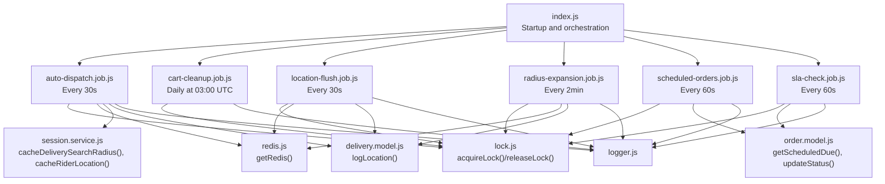
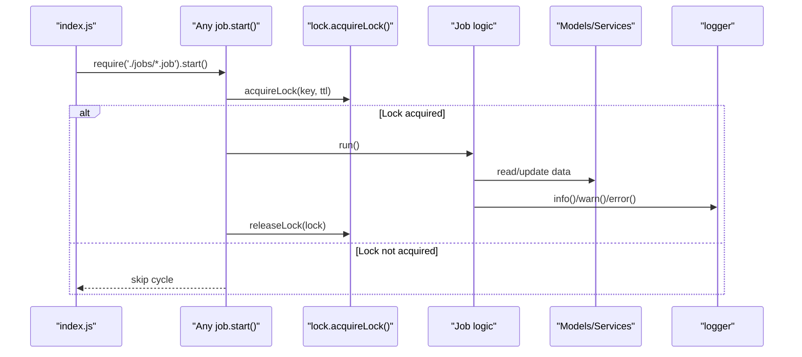
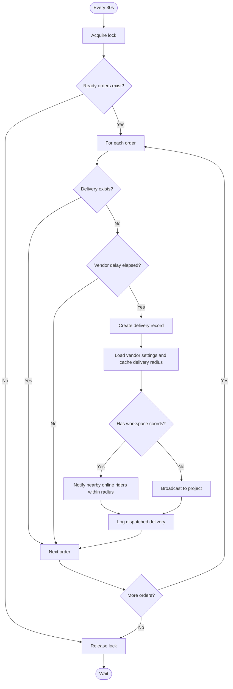
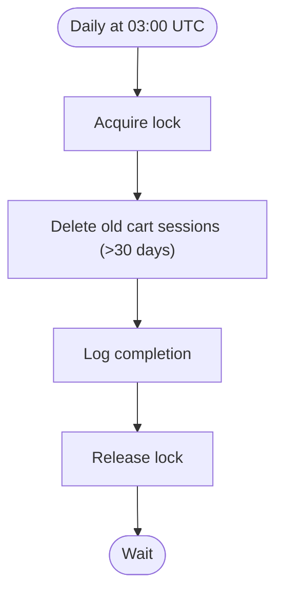
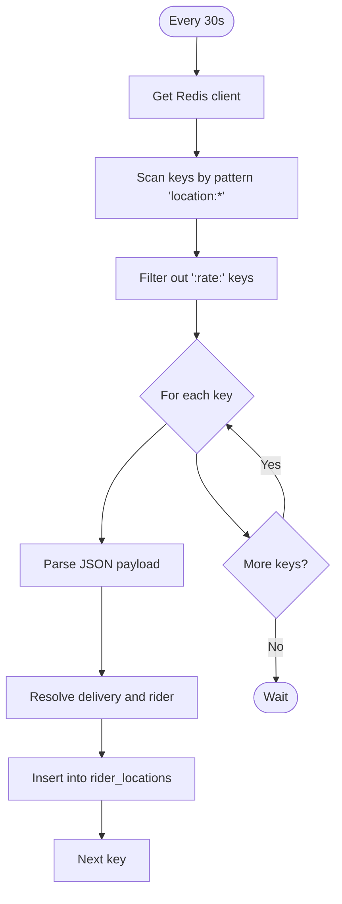
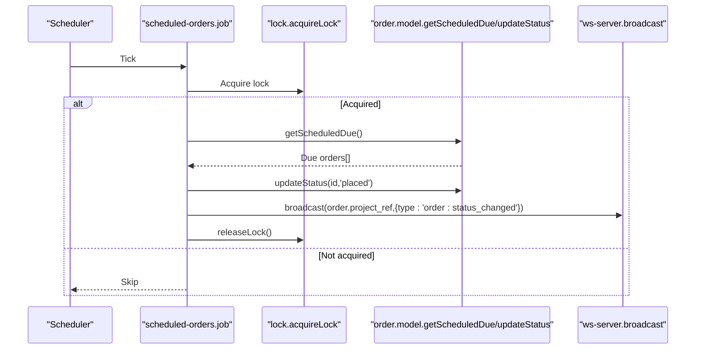
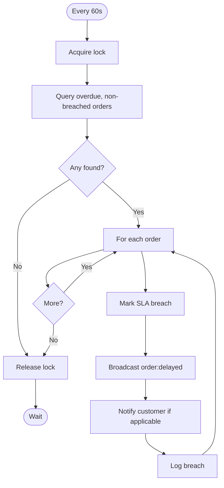
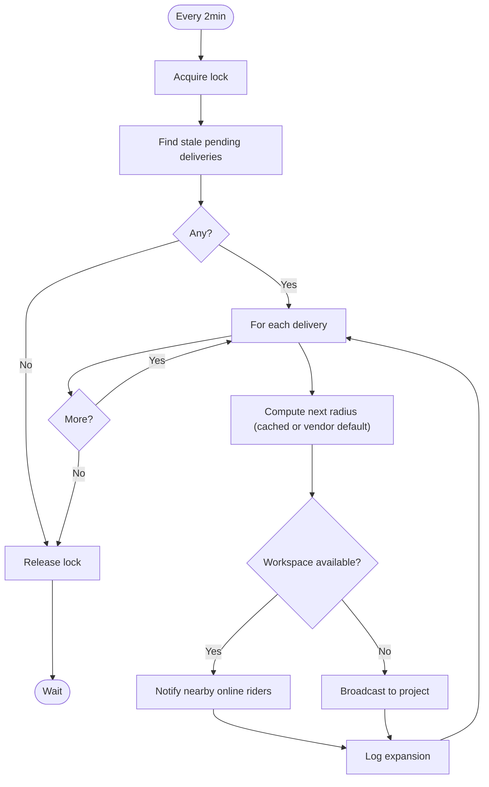
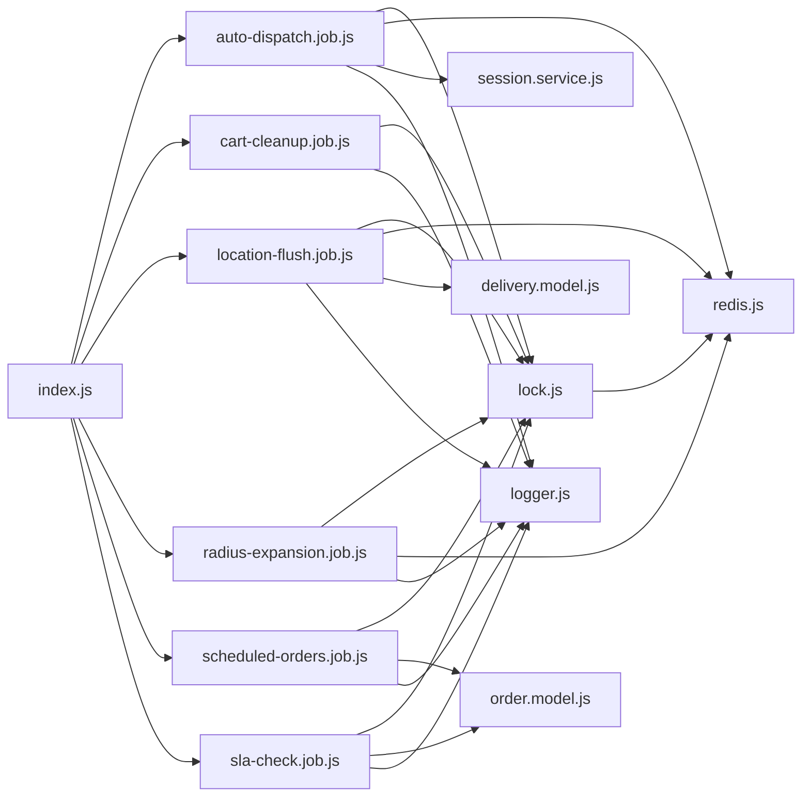

# Background Jobs & Automation

<cite>
**Referenced Files in This Document**
- [index.js](file://apps/server/index.js)
- [app.js](file://apps/server/app.js)
- [auto-dispatch.job.js](file://apps/server/jobs/auto-dispatch.job.js)
- [cart-cleanup.job.js](file://apps/server/jobs/cart-cleanup.job.js)
- [location-flush.job.js](file://apps/server/jobs/location-flush.job.js)
- [radius-expansion.job.js](file://apps/server/jobs/radius-expansion.job.js)
- [scheduled-orders.job.js](file://apps/server/jobs/scheduled-orders.job.js)
- [sla-check.job.js](file://apps/server/jobs/sla-check.job.js)
- [lock.js](file://apps/server/lib/lock.js)
- [redis.js](file://apps/server/lib/redis.js)
- [logger.js](file://apps/server/lib/logger.js)
- [session.service.js](file://apps/server/services/session.service.js)
- [delivery.model.js](file://apps/server/models/delivery.model.js)
- [order.model.js](file://apps/server/models/order.model.js)
</cite>

## Table of Contents
1. [Introduction](#introduction)
2. [Project Structure](#project-structure)
3. [Core Components](#core-components)
4. [Architecture Overview](#architecture-overview)
5. [Detailed Component Analysis](#detailed-component-analysis)
6. [Dependency Analysis](#dependency-analysis)
7. [Performance Considerations](#performance-considerations)
8. [Troubleshooting Guide](#troubleshooting-guide)
9. [Conclusion](#conclusion)

## Introduction
This document explains the Delivio background job system and automation features. It covers the job scheduling architecture, cron expression patterns, execution monitoring, and operational guarantees. It also documents the auto-dispatch algorithm for rider assignment, SLA breach detection, cart cleanup, scheduled order processing, location data flushing, and system maintenance jobs. Job locking mechanisms, error handling, retry strategies, prioritization, resource management, and performance considerations are included, along with monitoring, logging, and debugging techniques for reliable automation.

## Project Structure
The background jobs are implemented as standalone modules under apps/server/jobs and are initialized at server startup in apps/server/index.js. Each job module exports a start function that registers a cron schedule and runs periodic tasks. Shared infrastructure includes Redis-backed locking and caching via apps/server/lib/lock.js and apps/server/services/session.service.js, and logging via apps/server/lib/logger.js.

**Diagram sources**
- [index.js:12-45](file://apps/server/index.js#L12-L45)
- [auto-dispatch.job.js:18-94](file://apps/server/jobs/auto-dispatch.job.js#L18-L94)
- [cart-cleanup.job.js:11-28](file://apps/server/jobs/cart-cleanup.job.js#L11-L28)
- [location-flush.job.js:13-57](file://apps/server/jobs/location-flush.job.js#L13-L57)
- [radius-expansion.job.js:13-84](file://apps/server/jobs/radius-expansion.job.js#L13-L84)
- [scheduled-orders.job.js:13-46](file://apps/server/jobs/scheduled-orders.job.js#L13-L46)
- [sla-check.job.js:15-56](file://apps/server/jobs/sla-check.job.js#L15-L56)
- [lock.js:17-58](file://apps/server/lib/lock.js#L17-L58)
- [redis.js:8-39](file://apps/server/lib/redis.js#L8-L39)
- [session.service.js:146-153](file://apps/server/services/session.service.js#L146-L153)
- [delivery.model.js:83-94](file://apps/server/models/delivery.model.js#L83-L94)
- [order.model.js:161-166](file://apps/server/models/order.model.js#L161-L166)
- [logger.js:24-33](file://apps/server/lib/logger.js#L24-L33)

**Section sources**
- [index.js:12-45](file://apps/server/index.js#L12-L45)

## Core Components
- Job orchestrator: Initializes and starts all background jobs at server startup.
- Cron scheduling: Each job defines a node-cron pattern and runs an async task.
- Locking: Distributed locks prevent concurrent executions of the same job across instances.
- Redis integration: Used for session caching, location caching, and job locking; falls back to in-memory when unavailable.
- Models and services: Encapsulate data access and caching for delivery, order, and session state.
- Logging: Structured logs for monitoring and debugging.

**Section sources**
- [index.js:12-45](file://apps/server/index.js#L12-L45)
- [lock.js:17-58](file://apps/server/lib/lock.js#L17-L58)
- [redis.js:8-39](file://apps/server/lib/redis.js#L8-L39)
- [logger.js:24-33](file://apps/server/lib/logger.js#L24-L33)

## Architecture Overview
The background job system is event-driven and time-based. At startup, the server loads each job module and schedules it with node-cron. Each job attempts to acquire a distributed lock before executing, performs its work, and releases the lock. Jobs interact with Supabase for queries, with Redis for caching and locking, and with models/services for persistence and state updates. Logging records progress and errors.

**Diagram sources**
- [index.js:12-45](file://apps/server/index.js#L12-L45)
- [lock.js:17-58](file://apps/server/lib/lock.js#L17-L58)
- [logger.js:24-33](file://apps/server/lib/logger.js#L24-L33)

## Detailed Component Analysis

### Auto-Dispatch Job
Purpose: Periodically discover ready orders without a delivery record, optionally delay by vendor settings, create a delivery, and broadcast to nearby online riders or fallback to project-wide broadcast.

Key behaviors:
- Schedule: Every 30 seconds.
- Lock TTL: ~25 seconds to allow a tight window.
- Vendor delay: Respects vendor auto_dispatch_delay_minutes.
- Spatial matching: Uses vendor workspace coordinates and haversine distance to filter nearby riders.
- Fallback: Broadcasts to the entire project if none are within base radius.
- Logging: Records number of notified riders.

**Diagram sources**
- [auto-dispatch.job.js:18-94](file://apps/server/jobs/auto-dispatch.job.js#L18-L94)
- [session.service.js:146-153](file://apps/server/services/session.service.js#L146-L153)
- [delivery.model.js:37-47](file://apps/server/models/delivery.model.js#L37-L47)

**Section sources**
- [auto-dispatch.job.js:14-97](file://apps/server/jobs/auto-dispatch.job.js#L14-L97)
- [session.service.js:146-153](file://apps/server/services/session.service.js#L146-L153)
- [delivery.model.js:37-47](file://apps/server/models/delivery.model.js#L37-L47)

### Cart Cleanup Job
Purpose: Remove expired cart sessions on a daily schedule.

Key behaviors:
- Schedule: 03:00 UTC daily.
- Lock TTL: ~5 minutes.
- Action: Deletes carts older than 30 days.
- Logging: Starts and completes messages.

**Diagram sources**
- [cart-cleanup.job.js:11-28](file://apps/server/jobs/cart-cleanup.job.js#L11-L28)

**Section sources**
- [cart-cleanup.job.js:8-31](file://apps/server/jobs/cart-cleanup.job.js#L8-L31)

### Location Flush Job
Purpose: Periodically flush in-flight rider location updates from Redis cache into the rider_locations audit table.

Key behaviors:
- Schedule: Every 30 seconds.
- Lock TTL: ~25 seconds.
- Redis scanning: Finds keys prefixed with location: excluding rate-limit keys.
- Validation: Skips entries without a current rider assigned.
- Persistence: Inserts location records with lat, lon, heading, speed.
- Logging: Warns on parse failures; logs errors.

**Diagram sources**
- [location-flush.job.js:13-57](file://apps/server/jobs/location-flush.job.js#L13-L57)
- [delivery.model.js:83-94](file://apps/server/models/delivery.model.js#L83-L94)

**Section sources**
- [location-flush.job.js:9-60](file://apps/server/jobs/location-flush.job.js#L9-L60)
- [delivery.model.js:83-94](file://apps/server/models/delivery.model.js#L83-L94)

### Scheduled Orders Job
Purpose: Transition overdue scheduled orders into pending status and broadcast the change.

Key behaviors:
- Schedule: Every 60 seconds.
- Lock TTL: ~55 seconds.
- Query: Finds scheduled orders whose scheduled_for has passed.
- State update: Transitions to placed.
- Broadcast: Sends order:status_changed to the project channel.
- Logging: Reports number of processed orders.

**Diagram sources**
- [scheduled-orders.job.js:13-46](file://apps/server/jobs/scheduled-orders.job.js#L13-L46)
- [order.model.js:161-166](file://apps/server/models/order.model.js#L161-L166)

**Section sources**
- [scheduled-orders.job.js:9-49](file://apps/server/jobs/scheduled-orders.job.js#L9-L49)
- [order.model.js:161-166](file://apps/server/models/order.model.js#L161-L166)

### SLA Breach Detection Job
Purpose: Detect orders past their SLA deadline and mark them as breached, then notify stakeholders.

Key behaviors:
- Schedule: Every 60 seconds.
- Lock TTL: ~55 seconds.
- Query: Selects orders with sla_deadline < now, not yet breached, and in accepted/preparing.
- Mark: Sets sla_breached flag.
- Notification: Broadcasts order:delayed and sends customer notification if present.
- Logging: Reports counts and per-order actions.

**Diagram sources**
- [sla-check.job.js:15-56](file://apps/server/jobs/sla-check.job.js#L15-L56)
- [order.model.js:150-155](file://apps/server/models/order.model.js#L150-L155)

**Section sources**
- [sla-check.job.js:11-59](file://apps/server/jobs/sla-check.job.js#L11-L59)
- [order.model.js:150-155](file://apps/server/models/order.model.js#L150-L155)

### Radius Expansion Job
Purpose: Expand the search radius for pending deliveries that remain unassigned after a period, increasing coverage to nearby riders.

Key behaviors:
- Schedule: Every 2 minutes.
- Lock TTL: ~110 seconds.
- Query: Finds pending deliveries without a rider older than 5 minutes.
- Radius calculation: Adds a fixed step to the cached delivery radius until a configurable maximum.
- Spatial matching: Same haversine-based proximity check as auto-dispatch.
- Broadcast: Sends delivery:request with expandedSearch flag.
- Logging: Reports radius and number of notifications.

**Diagram sources**
- [radius-expansion.job.js:13-84](file://apps/server/jobs/radius-expansion.job.js#L13-L84)
- [session.service.js:146-153](file://apps/server/services/session.service.js#L146-L153)

**Section sources**
- [radius-expansion.job.js:13-87](file://apps/server/jobs/radius-expansion.job.js#L13-L87)
- [session.service.js:146-153](file://apps/server/services/session.service.js#L146-L153)

## Dependency Analysis
- Startup dependency: index.js depends on each job module and initializes them after the HTTP server is ready.
- Locking dependency: All jobs depend on lock.js for mutual exclusion.
- Redis dependency: lock.js and session.service.js depend on redis.js for distributed locking and caching.
- Data access: Jobs use models (order.model.js, delivery.model.js) and services (session.service.js) for persistence and caching.
- Logging: All jobs depend on logger.js for structured logs.

**Diagram sources**
- [index.js:12-45](file://apps/server/index.js#L12-L45)
- [lock.js:17-58](file://apps/server/lib/lock.js#L17-L58)
- [redis.js:8-39](file://apps/server/lib/redis.js#L8-L39)
- [session.service.js:146-153](file://apps/server/services/session.service.js#L146-L153)
- [delivery.model.js:83-94](file://apps/server/models/delivery.model.js#L83-L94)
- [order.model.js:161-166](file://apps/server/models/order.model.js#L161-L166)
- [logger.js:24-33](file://apps/server/lib/logger.js#L24-L33)

**Section sources**
- [index.js:12-45](file://apps/server/index.js#L12-L45)
- [lock.js:17-58](file://apps/server/lib/lock.js#L17-L58)
- [redis.js:8-39](file://apps/server/lib/redis.js#L8-L39)
- [session.service.js:146-153](file://apps/server/services/session.service.js#L146-L153)
- [delivery.model.js:83-94](file://apps/server/models/delivery.model.js#L83-L94)
- [order.model.js:161-166](file://apps/server/models/order.model.js#L161-L166)
- [logger.js:24-33](file://apps/server/lib/logger.js#L24-L33)

## Performance Considerations
- Concurrency control: Distributed locks ensure only one instance executes a job at a time, preventing duplicate work and race conditions.
- Lock TTL tuning: Jobs use conservative TTLs to avoid long-held locks while allowing work cycles to complete. Adjust per workload characteristics.
- Redis availability: When Redis is unavailable, the system falls back to in-memory storage for locks and sessions. This is acceptable for single-instance deployments but not recommended for production scaling.
- Query efficiency: Jobs perform targeted queries (by status, timestamps, and filters) to minimize database load.
- Spatial checks: Haversine distance filtering reduces unnecessary broadcasts to distant riders.
- Rate limiting: Location updates are rate-limited per delivery to avoid excessive writes.
- Logging overhead: Structured logs are emitted at info/warn/error levels; keep metadata concise to reduce I/O.

[No sources needed since this section provides general guidance]

## Troubleshooting Guide
Common issues and remedies:
- Job not running:
  - Verify startup logs indicate background jobs started.
  - Confirm cron schedule matches expectations and environment timezone.
- Duplicate executions:
  - Check that acquireLock returns a lock object; if null, another instance holds the lock.
  - Ensure Redis is reachable and functional.
- Redis connectivity problems:
  - When REDIS_URL is unset, Redis client returns null; expect in-memory fallback for sessions and locks.
  - Monitor Redis connection events and retry strategy logs.
- Location flush failures:
  - Parse errors for location payloads are logged as warnings; inspect payload format and delivery/rider associations.
- Broadcasting issues:
  - Ensure WebSocket server is initialized before jobs start.
  - Verify project_ref correctness and online rider presence.
- Logging and debugging:
  - Use structured logs to correlate job runs, lock acquisition, and errors.
  - Increase log level in development for more verbose output.

Operational checks:
- Confirm graceful shutdown closes HTTP server and Redis connections.
- Watch for uncaught exceptions and unhandled rejections during job execution.

**Section sources**
- [index.js:47-93](file://apps/server/index.js#L47-L93)
- [redis.js:8-39](file://apps/server/lib/redis.js#L8-L39)
- [lock.js:17-58](file://apps/server/lib/lock.js#L17-L58)
- [logger.js:24-33](file://apps/server/lib/logger.js#L24-L33)

## Conclusion
The Delivio background job system provides robust automation for order lifecycle management, rider dispatch, SLA monitoring, cart maintenance, and location auditing. Distributed locking ensures safe concurrent execution, while Redis-backed caching and logging support scalability and observability. By tuning lock TTLs, monitoring Redis connectivity, and leveraging structured logs, operators can maintain reliable and performant automation across environments.