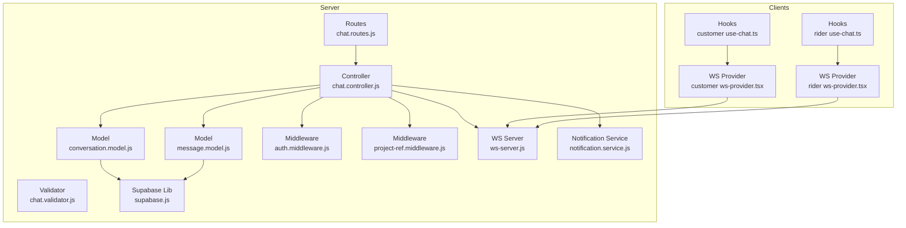
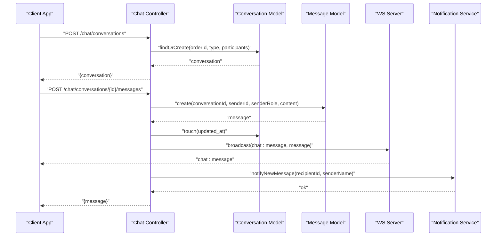
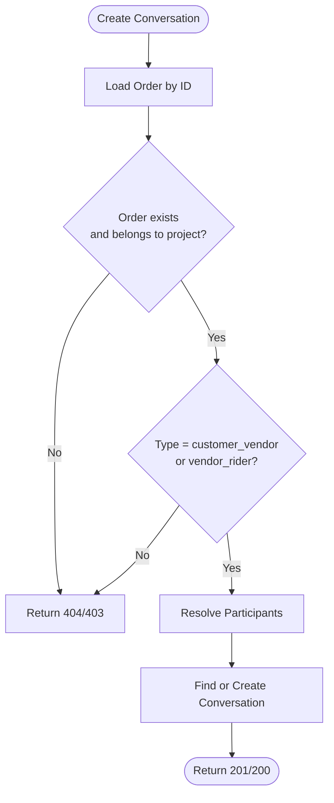
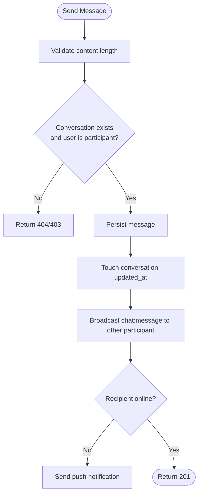
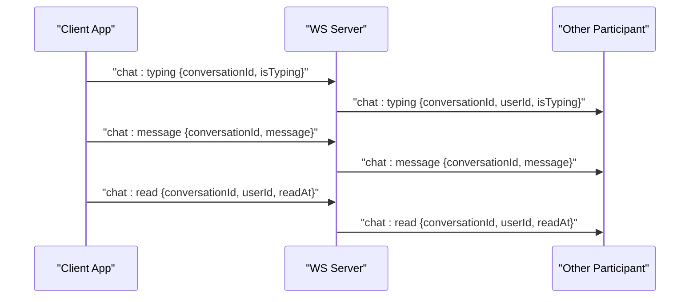
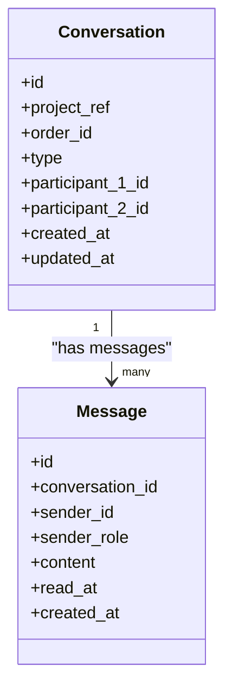
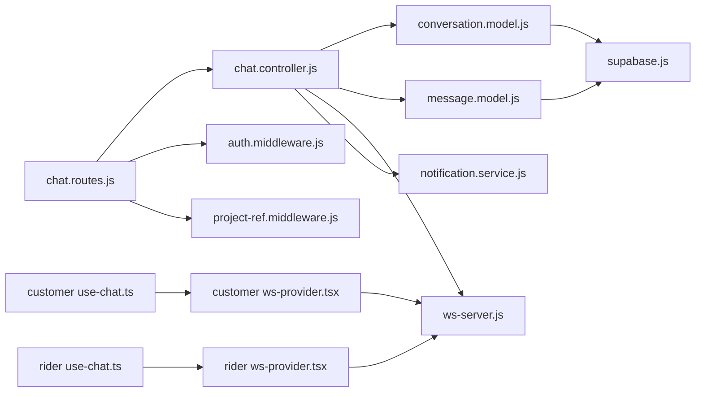

# Chat & Communication

<cite>
**Referenced Files in This Document**
- [chat.controller.js](file://apps/server/controllers/chat.controller.js)
- [chat.routes.js](file://apps/server/routes/chat.routes.js)
- [chat.validator.js](file://apps/server/validators/chat.validator.js)
- [conversation.model.js](file://apps/server/models/conversation.model.js)
- [message.model.js](file://apps/server/models/message.model.js)
- [ws-server.js](file://apps/server/websocket/ws-server.js)
- [notification.service.js](file://apps/server/services/notification.service.js)
- [supabase.js](file://apps/server/lib/supabase.js)
- [auth.middleware.js](file://apps/server/middleware/auth.middleware.js)
- [project-ref.middleware.js](file://apps/server/middleware/project-ref.middleware.js)
- [005_conversations_messages.sql](file://apps/server/migrations/005_conversations_messages.sql)
- [config/index.js](file://apps/server/config/index.js)
- [customer use-chat.ts](file://apps/customer/src/hooks/use-chat.ts)
- [rider use-chat.ts](file://apps/rider/src/hooks/use-chat.ts)
- [customer ws-provider.tsx](file://apps/customer/src/providers/ws-provider.tsx)
- [rider ws-provider.tsx](file://apps/rider/src/providers/ws-provider.tsx)
</cite>

## Table of Contents
1. [Introduction](#introduction)
2. [Project Structure](#project-structure)
3. [Core Components](#core-components)
4. [Architecture Overview](#architecture-overview)
5. [Detailed Component Analysis](#detailed-component-analysis)
6. [Dependency Analysis](#dependency-analysis)
7. [Performance Considerations](#performance-considerations)
8. [Security and Moderation](#security-and-moderation)
9. [Troubleshooting Guide](#troubleshooting-guide)
10. [Conclusion](#conclusion)

## Introduction
This document describes the Delivio chat and communication system. It covers conversation management, message threading, and real-time messaging between customers, vendors, and riders. It explains multi-party chat creation, participant management, message persistence, message types and limits, attachment handling, WebSocket integration for live updates and typing indicators, read receipts, delivery guarantees, offline messaging, cross-device synchronization, and security and moderation considerations.

## Project Structure
The chat system spans the server (Express + Supabase), WebSocket server, and client applications (Next.js web apps and mobile apps). Key areas:
- Server API: routes, controllers, validators, models, middleware, and services
- Real-time: WebSocket server and client providers
- Persistence: Supabase-backed models and migrations
- Clients: React Query hooks and WebSocket providers

**Diagram sources**
- [chat.routes.js:1-21](file://apps/server/routes/chat.routes.js#L1-L21)
- [chat.controller.js:1-174](file://apps/server/controllers/chat.controller.js#L1-L174)
- [conversation.model.js:1-62](file://apps/server/models/conversation.model.js#L1-L62)
- [message.model.js:1-61](file://apps/server/models/message.model.js#L1-L61)
- [ws-server.js:1-237](file://apps/server/websocket/ws-server.js#L1-L237)
- [notification.service.js:1-180](file://apps/server/services/notification.service.js#L1-L180)
- [supabase.js:1-151](file://apps/server/lib/supabase.js#L1-L151)
- [auth.middleware.js:1-123](file://apps/server/middleware/auth.middleware.js#L1-L123)
- [project-ref.middleware.js:1-36](file://apps/server/middleware/project-ref.middleware.js#L1-L36)
- [customer use-chat.ts:1-20](file://apps/customer/src/hooks/use-chat.ts#L1-L20)
- [rider use-chat.ts:1-20](file://apps/rider/src/hooks/use-chat.ts#L1-L20)
- [customer ws-provider.tsx:1-86](file://apps/customer/src/providers/ws-provider.tsx#L1-L86)
- [rider ws-provider.tsx:1-83](file://apps/rider/src/providers/ws-provider.tsx#L1-L83)

**Section sources**
- [chat.routes.js:1-21](file://apps/server/routes/chat.routes.js#L1-L21)
- [chat.controller.js:1-174](file://apps/server/controllers/chat.controller.js#L1-L174)
- [conversation.model.js:1-62](file://apps/server/models/conversation.model.js#L1-L62)
- [message.model.js:1-61](file://apps/server/models/message.model.js#L1-L61)
- [ws-server.js:1-237](file://apps/server/websocket/ws-server.js#L1-L237)
- [notification.service.js:1-180](file://apps/server/services/notification.service.js#L1-L180)
- [supabase.js:1-151](file://apps/server/lib/supabase.js#L1-L151)
- [auth.middleware.js:1-123](file://apps/server/middleware/auth.middleware.js#L1-L123)
- [project-ref.middleware.js:1-36](file://apps/server/middleware/project-ref.middleware.js#L1-L36)
- [customer use-chat.ts:1-20](file://apps/customer/src/hooks/use-chat.ts#L1-L20)
- [rider use-chat.ts:1-20](file://apps/rider/src/hooks/use-chat.ts#L1-L20)
- [customer ws-provider.tsx:1-86](file://apps/customer/src/providers/ws-provider.tsx#L1-L86)
- [rider ws-provider.tsx:1-83](file://apps/rider/src/providers/ws-provider.tsx#L1-L83)

## Core Components
- Conversation management
  - Creation: determines participants by order and conversation type, enforces workspace isolation, persists conversation
  - Listing: returns user’s conversations filtered by project
  - Participant checks: ensures only participants can access a conversation
- Message management
  - History pagination: pages through messages per conversation
  - Creation: validates content length, persists message, updates conversation timestamps
  - Read receipts: marks messages as read for the reader
- Real-time messaging
  - WebSocket server: authenticates connections, maintains registry, handles typing indicators, broadcasts events
  - Client providers: connect to /ws, subscribe to events, invalidate queries on updates
- Notifications
  - Push notifications: sent when recipients are offline or not connected to WebSocket
- Persistence
  - Supabase REST: centralized DB access via helpers
  - Migrations: define conversations and messages tables with indexes and constraints

**Section sources**
- [chat.controller.js:12-171](file://apps/server/controllers/chat.controller.js#L12-L171)
- [conversation.model.js:15-58](file://apps/server/models/conversation.model.js#L15-L58)
- [message.model.js:13-57](file://apps/server/models/message.model.js#L13-L57)
- [ws-server.js:22-147](file://apps/server/websocket/ws-server.js#L22-L147)
- [notification.service.js:73-83](file://apps/server/services/notification.service.js#L73-L83)
- [supabase.js:26-117](file://apps/server/lib/supabase.js#L26-L117)
- [005_conversations_messages.sql:4-33](file://apps/server/migrations/005_conversations_messages.sql#L4-L33)

## Architecture Overview
The chat system integrates REST APIs with a WebSocket server. Clients authenticate via session cookies or JWT and receive real-time updates. Messages are persisted in Supabase and retrieved with pagination. Offline users receive push notifications.

**Diagram sources**
- [chat.controller.js:12-140](file://apps/server/controllers/chat.controller.js#L12-L140)
- [conversation.model.js:15-32](file://apps/server/models/conversation.model.js#L15-L32)
- [message.model.js:24-37](file://apps/server/models/message.model.js#L24-L37)
- [ws-server.js:162-175](file://apps/server/websocket/ws-server.js#L162-L175)
- [notification.service.js:73-83](file://apps/server/services/notification.service.js#L73-L83)

## Detailed Component Analysis

### Conversation Management
- Creation
  - Validates order ownership within the current project reference
  - Determines participants based on conversation type:
    - customer_vendor: caller vs order customer
    - vendor_rider: vendor vs assigned rider (requires an active delivery)
  - Creates or retrieves a single conversation per order and type
- Listing
  - Returns conversations where the user is participant_1 or participant_2, scoped by project_ref
- Access control
  - Enforces project_ref isolation and participant checks on reads and writes

**Diagram sources**
- [chat.controller.js:12-51](file://apps/server/controllers/chat.controller.js#L12-L51)
- [conversation.model.js:15-32](file://apps/server/models/conversation.model.js#L15-L32)

**Section sources**
- [chat.controller.js:12-51](file://apps/server/controllers/chat.controller.js#L12-L51)
- [conversation.model.js:15-41](file://apps/server/models/conversation.model.js#L15-L41)

### Message Threading and Persistence
- Pagination
  - Retrieves messages ordered by created_at descending with configurable page size
- Creation
  - Enforces maximum message length
  - Persists message with sender role and null read_at
- Read receipts
  - Marks all messages in the conversation as read for the reader (excluding their own messages)
- Unread counting
  - Counts unread messages excluding the reader’s own messages

**Diagram sources**
- [chat.controller.js:88-140](file://apps/server/controllers/chat.controller.js#L88-L140)
- [message.model.js:24-37](file://apps/server/models/message.model.js#L24-L37)
- [conversation.model.js:50-58](file://apps/server/models/conversation.model.js#L50-L58)
- [ws-server.js:162-175](file://apps/server/websocket/ws-server.js#L162-L175)
- [notification.service.js:73-83](file://apps/server/services/notification.service.js#L73-L83)

**Section sources**
- [chat.controller.js:63-86](file://apps/server/controllers/chat.controller.js#L63-L86)
- [message.model.js:13-49](file://apps/server/models/message.model.js#L13-L49)

### Real-Time Messaging and Typing Indicators
- WebSocket server
  - Authentication via admin_session, customer_session cookies, or JWT query param
  - Maintains connection registry keyed by project reference
  - Handles typing indicators by relaying chat:typing events
  - Broadcasts events to all connections in a project
- Client providers
  - Connect to /ws, subscribe to events, and invalidate React Query caches to reflect updates instantly
- Read receipts
  - Controller emits chat:read events when a user marks a conversation as read

**Diagram sources**
- [ws-server.js:25-89](file://apps/server/websocket/ws-server.js#L25-L89)
- [ws-server.js:126-147](file://apps/server/websocket/ws-server.js#L126-L147)
- [ws-server.js:162-175](file://apps/server/websocket/ws-server.js#L162-L175)
- [chat.controller.js:142-171](file://apps/server/controllers/chat.controller.js#L142-L171)

**Section sources**
- [ws-server.js:22-147](file://apps/server/websocket/ws-server.js#L22-L147)
- [customer ws-provider.tsx:27-53](file://apps/customer/src/providers/ws-provider.tsx#L27-L53)
- [rider ws-provider.tsx:27-50](file://apps/rider/src/providers/ws-provider.tsx#L27-L50)

### Multi-Party Chat Between Customers, Vendors, and Riders
- Types
  - customer_vendor: direct customer–vendor support
  - vendor_rider: vendor initiates chat with the assigned rider for logistics coordination
- Participants
  - Conversation participants are stored as participant_1_id and participant_2_id
  - Controllers enforce participant checks for reads/writes
- Order-scoped
  - Conversations are associated with an order_id and are created per order and type

**Diagram sources**
- [005_conversations_messages.sql:4-33](file://apps/server/migrations/005_conversations_messages.sql#L4-L33)
- [conversation.model.js:15-32](file://apps/server/models/conversation.model.js#L15-L32)
- [message.model.js:24-37](file://apps/server/models/message.model.js#L24-L37)

**Section sources**
- [chat.controller.js:22-41](file://apps/server/controllers/chat.controller.js#L22-L41)
- [conversation.model.js:43-58](file://apps/server/models/conversation.model.js#L43-L58)

### Message Types, Formatting, and Attachments
- Message types
  - Text messages only; no rich-text formatting is enforced by the validator and model
- Limits
  - Maximum message length enforced by both validator and model
- Attachments
  - No file upload or attachment fields are present in the schema or models; attachments are not supported in the current implementation

**Section sources**
- [chat.validator.js:11-16](file://apps/server/validators/chat.validator.js#L11-L16)
- [message.model.js:25-27](file://apps/server/models/message.model.js#L25-L27)
- [005_conversations_messages.sql:24-25](file://apps/server/migrations/005_conversations_messages.sql#L24-L25)

### Offline Messaging and Cross-Device Synchronization
- Offline messaging
  - When the recipient has no active WebSocket connection, the server sends a push notification
- Cross-device synchronization
  - Clients poll message lists periodically and rely on WebSocket events to invalidate and refresh data
  - Read receipts are broadcast to synchronize read status across devices

**Section sources**
- [chat.controller.js:129-134](file://apps/server/controllers/chat.controller.js#L129-L134)
- [notification.service.js:73-83](file://apps/server/services/notification.service.js#L73-L83)
- [customer use-chat.ts:12-19](file://apps/customer/src/hooks/use-chat.ts#L12-L19)
- [rider use-chat.ts:12-19](file://apps/rider/src/hooks/use-chat.ts#L12-L19)

## Dependency Analysis
- Controllers depend on models, middleware, WebSocket server, and notification service
- Models depend on Supabase helpers for database operations
- Routes apply authentication and project reference middleware before invoking controllers
- Clients depend on WebSocket providers and React Query for state synchronization

**Diagram sources**
- [chat.routes.js:12-18](file://apps/server/routes/chat.routes.js#L12-L18)
- [chat.controller.js:3-10](file://apps/server/controllers/chat.controller.js#L3-L10)
- [conversation.model.js:3-5](file://apps/server/models/conversation.model.js#L3-L5)
- [message.model.js:3-6](file://apps/server/models/message.model.js#L3-L6)
- [ws-server.js:3-9](file://apps/server/websocket/ws-server.js#L3-L9)
- [notification.service.js:3-6](file://apps/server/services/notification.service.js#L3-L6)
- [supabase.js:26-63](file://apps/server/lib/supabase.js#L26-L63)
- [auth.middleware.js:11-51](file://apps/server/middleware/auth.middleware.js#L11-L51)
- [project-ref.middleware.js:13-23](file://apps/server/middleware/project-ref.middleware.js#L13-L23)
- [customer use-chat.ts:1-19](file://apps/customer/src/hooks/use-chat.ts#L1-L19)
- [rider use-chat.ts:1-19](file://apps/rider/src/hooks/use-chat.ts#L1-L19)
- [customer ws-provider.tsx:27-53](file://apps/customer/src/providers/ws-provider.tsx#L27-L53)
- [rider ws-provider.tsx:27-50](file://apps/rider/src/providers/ws-provider.tsx#L27-L50)

**Section sources**
- [chat.routes.js:12-18](file://apps/server/routes/chat.routes.js#L12-L18)
- [chat.controller.js:3-10](file://apps/server/controllers/chat.controller.js#L3-L10)
- [conversation.model.js:3-5](file://apps/server/models/conversation.model.js#L3-L5)
- [message.model.js:3-6](file://apps/server/models/message.model.js#L3-L6)
- [ws-server.js:3-9](file://apps/server/websocket/ws-server.js#L3-L9)
- [notification.service.js:3-6](file://apps/server/services/notification.service.js#L3-L6)
- [supabase.js:26-63](file://apps/server/lib/supabase.js#L26-L63)
- [auth.middleware.js:11-51](file://apps/server/middleware/auth.middleware.js#L11-L51)
- [project-ref.middleware.js:13-23](file://apps/server/middleware/project-ref.middleware.js#L13-L23)
- [customer use-chat.ts:1-19](file://apps/customer/src/hooks/use-chat.ts#L1-L19)
- [rider use-chat.ts:1-19](file://apps/rider/src/hooks/use-chat.ts#L1-L19)
- [customer ws-provider.tsx:27-53](file://apps/customer/src/providers/ws-provider.tsx#L27-L53)
- [rider ws-provider.tsx:27-50](file://apps/rider/src/providers/ws-provider.tsx#L27-L50)

## Performance Considerations
- Pagination
  - Page size and offset are used to limit message retrieval per request
- Indexes
  - Conversations and messages tables include indexes on project_ref, order_id, participant IDs, and created_at for efficient queries
- WebSocket scaling
  - Heartbeat and cleanup help maintain healthy connections; consider connection limits and message batching for high concurrency
- Client polling
  - Periodic polling reduces real-time pressure but increases network usage; adjust intervals based on UX needs

**Section sources**
- [message.model.js:13-22](file://apps/server/models/message.model.js#L13-L22)
- [005_conversations_messages.sql:15-32](file://apps/server/migrations/005_conversations_messages.sql#L15-L32)
- [ws-server.js:74-85](file://apps/server/websocket/ws-server.js#L74-L85)
- [customer use-chat.ts:17](file://apps/customer/src/hooks/use-chat.ts#L17)
- [rider use-chat.ts:17](file://apps/rider/src/hooks/use-chat.ts#L17)

## Security and Moderation
- Authentication and authorization
  - Controllers require valid sessions or JWT and enforce participant checks
  - Project reference is attached and required for all chat operations
- Data access isolation
  - Queries are scoped to project_ref to prevent cross-tenant access
- Content limits
  - Strict maximum message length enforced by validator and model
- Transport security
  - WebSocket supports JWT query param authentication for mobile/public contexts
- Moderation and spam
  - No built-in content moderation or spam filtering is implemented in the current codebase; consider adding input sanitization, rate limiting, and content scanning at the controller level if needed

**Section sources**
- [auth.middleware.js:11-51](file://apps/server/middleware/auth.middleware.js#L11-L51)
- [project-ref.middleware.js:13-33](file://apps/server/middleware/project-ref.middleware.js#L13-L33)
- [chat.controller.js:100-109](file://apps/server/controllers/chat.controller.js#L100-L109)
- [chat.validator.js:11-16](file://apps/server/validators/chat.validator.js#L11-L16)
- [ws-server.js:95-124](file://apps/server/websocket/ws-server.js#L95-L124)

## Troubleshooting Guide
- Authentication failures
  - Ensure admin_session, customer_session cookies, or JWT Authorization header is present and valid
- Access denied or not a participant
  - Confirm the user is a participant in the conversation and the project_ref matches
- No rider assigned
  - vendor_rider conversations require an active delivery assignment
- WebSocket not receiving events
  - Verify connection to /ws and that the client provider subscribes to events
- Offline notifications not received
  - Confirm push tokens exist for the user and the notification service is configured

**Section sources**
- [auth.middleware.js:11-51](file://apps/server/middleware/auth.middleware.js#L11-L51)
- [chat.controller.js:18-37](file://apps/server/controllers/chat.controller.js#L18-L37)
- [ws-server.js:25-89](file://apps/server/websocket/ws-server.js#L25-L89)
- [notification.service.js:11-22](file://apps/server/services/notification.service.js#L11-L22)

## Conclusion
Delivio’s chat system provides robust conversation and message management with real-time updates via WebSocket and offline support through push notifications. It enforces strong access control and project isolation, supports two primary conversation types for customer–vendor and vendor–rider interactions, and offers pagination and read receipts. Future enhancements could include richer message types, content moderation, and improved offline synchronization strategies.