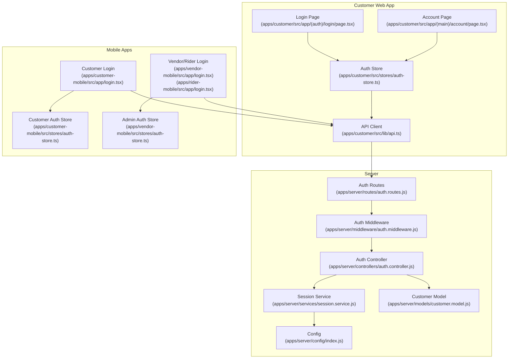
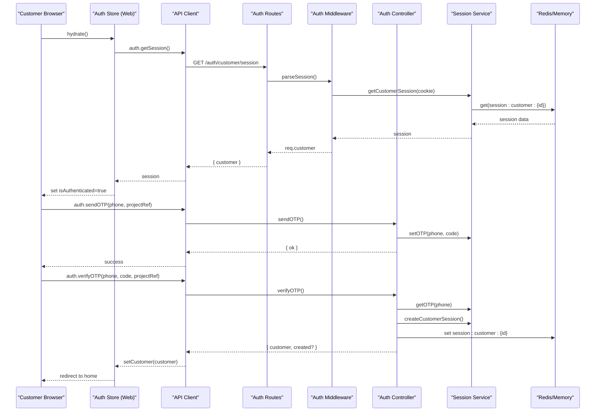
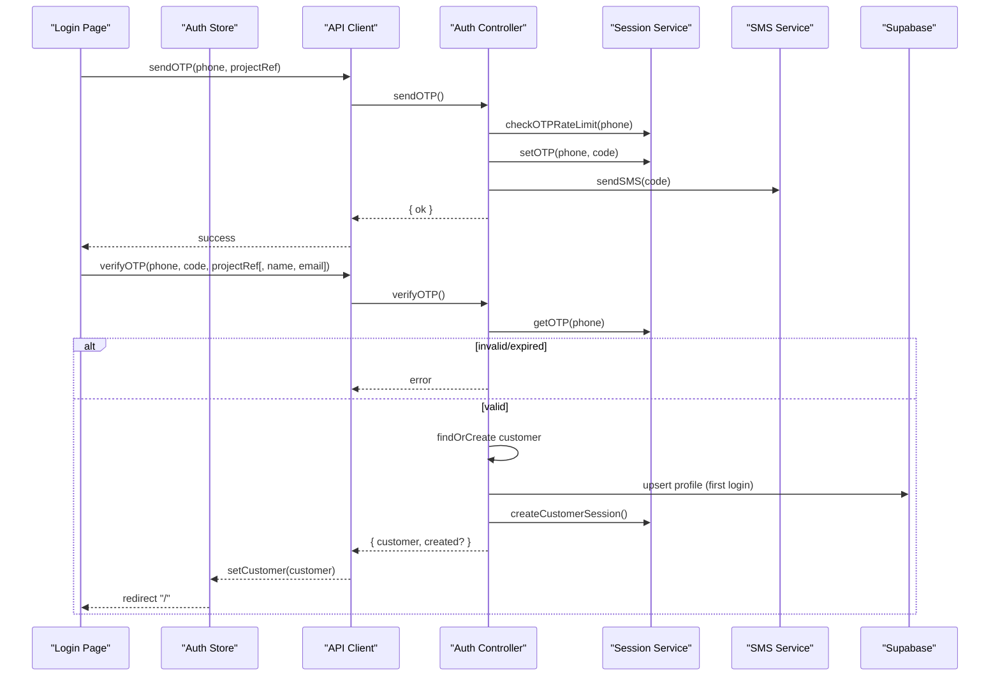
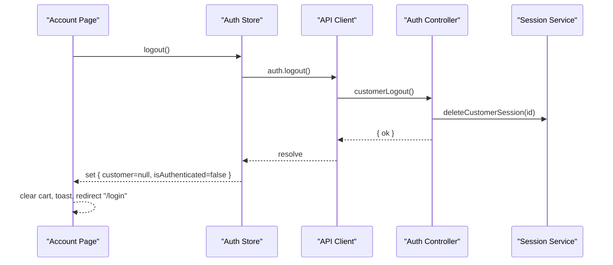
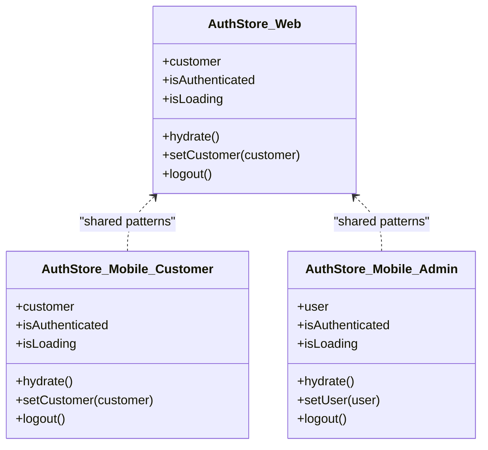
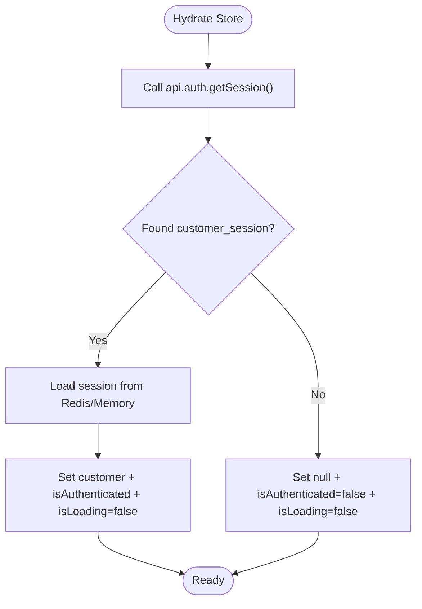
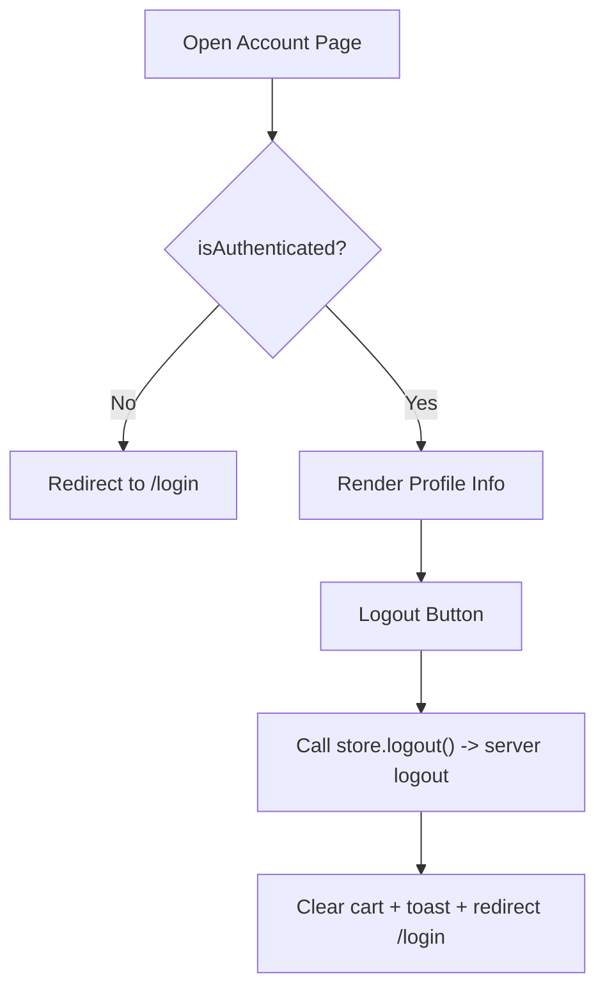
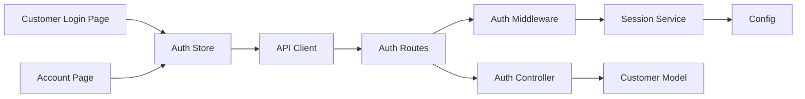

# Authentication & User Profiles

<cite>
**Referenced Files in This Document**
- [apps/customer/src/stores/auth-store.ts](file://apps/customer/src/stores/auth-store.ts)
- [apps/customer/src/app/(auth)/login/page.tsx](file://apps/customer/src/app/(auth)/login/page.tsx)
- [apps/customer/src/app/(main)/account/page.tsx](file://apps/customer/src/app/(main)/account/page.tsx)
- [apps/customer/src/lib/api.ts](file://apps/customer/src/lib/api.ts)
- [apps/server/controllers/auth.controller.js](file://apps/server/controllers/auth.controller.js)
- [apps/server/middleware/auth.middleware.js](file://apps/server/middleware/auth.middleware.js)
- [apps/server/services/session.service.js](file://apps/server/services/session.service.js)
- [apps/server/routes/auth.routes.js](file://apps/server/routes/auth.routes.js)
- [apps/server/models/customer.model.js](file://apps/server/models/customer.model.js)
- [apps/server/config/index.js](file://apps/server/config/index.js)
- [apps/customer-mobile/src/stores/auth-store.ts](file://apps/customer-mobile/src/stores/auth-store.ts)
- [apps/customer-mobile/src/app/login.tsx](file://apps/customer-mobile/src/app/login.tsx)
- [apps/vendor-mobile/src/stores/auth-store.ts](file://apps/vendor-mobile/src/stores/auth-store.ts)
- [apps/rider-mobile/src/app/login.tsx](file://apps/rider-mobile/src/app/login.tsx)
- [apps/vendor-mobile/src/app/login.tsx](file://apps/vendor-mobile/src/app/login.tsx)
</cite>

## Table of Contents
1. [Introduction](#introduction)
2. [Project Structure](#project-structure)
3. [Core Components](#core-components)
4. [Architecture Overview](#architecture-overview)
5. [Detailed Component Analysis](#detailed-component-analysis)
6. [Dependency Analysis](#dependency-analysis)
7. [Performance Considerations](#performance-considerations)
8. [Troubleshooting Guide](#troubleshooting-guide)
9. [Conclusion](#conclusion)

## Introduction
This document describes the customer authentication and user profile management system across the web and mobile applications. It covers login/logout flows, session management, user state persistence, and the integration with the shared authentication store. It also explains the OTP-based customer authentication flow, security measures, and how the system persists and exposes user preferences and account settings.

## Project Structure
The authentication system spans three primary areas:
- Frontend (Next.js customer app): login UI, account page, and a Zustand-based auth store.
- Mobile apps (React Native): customer and vendor/rider login screens and auth stores.
- Backend (Node.js/Express): authentication routes, controllers, middleware, session storage, and models.

**Diagram sources**
- [apps/customer/src/app/(auth)/login/page.tsx](file://apps/customer/src/app/(auth)/login/page.tsx#L1-L196)
- [apps/customer/src/app/(main)/account/page.tsx](file://apps/customer/src/app/(main)/account/page.tsx#L1-L88)
- [apps/customer/src/stores/auth-store.ts:1-48](file://apps/customer/src/stores/auth-store.ts#L1-L48)
- [apps/customer/src/lib/api.ts:1-11](file://apps/customer/src/lib/api.ts#L1-L11)
- [apps/customer-mobile/src/app/login.tsx:1-288](file://apps/customer-mobile/src/app/login.tsx#L1-L288)
- [apps/customer-mobile/src/stores/auth-store.ts:1-44](file://apps/customer-mobile/src/stores/auth-store.ts#L1-L44)
- [apps/vendor-mobile/src/app/login.tsx:1-147](file://apps/vendor-mobile/src/app/login.tsx#L1-L147)
- [apps/rider-mobile/src/app/login.tsx:1-160](file://apps/rider-mobile/src/app/login.tsx#L1-L160)
- [apps/vendor-mobile/src/stores/auth-store.ts:1-43](file://apps/vendor-mobile/src/stores/auth-store.ts#L1-L43)
- [apps/server/routes/auth.routes.js:1-37](file://apps/server/routes/auth.routes.js#L1-L37)
- [apps/server/middleware/auth.middleware.js:1-123](file://apps/server/middleware/auth.middleware.js#L1-L123)
- [apps/server/controllers/auth.controller.js:1-321](file://apps/server/controllers/auth.controller.js#L1-L321)
- [apps/server/services/session.service.js:1-180](file://apps/server/services/session.service.js#L1-L180)
- [apps/server/config/index.js:1-117](file://apps/server/config/index.js#L1-L117)
- [apps/server/models/customer.model.js:1-61](file://apps/server/models/customer.model.js#L1-L61)

**Section sources**
- [apps/customer/src/app/(auth)/login/page.tsx](file://apps/customer/src/app/(auth)/login/page.tsx#L1-L196)
- [apps/customer/src/app/(main)/account/page.tsx](file://apps/customer/src/app/(main)/account/page.tsx#L1-L88)
- [apps/customer/src/stores/auth-store.ts:1-48](file://apps/customer/src/stores/auth-store.ts#L1-L48)
- [apps/customer/src/lib/api.ts:1-11](file://apps/customer/src/lib/api.ts#L1-L11)
- [apps/customer-mobile/src/app/login.tsx:1-288](file://apps/customer-mobile/src/app/login.tsx#L1-L288)
- [apps/customer-mobile/src/stores/auth-store.ts:1-44](file://apps/customer-mobile/src/stores/auth-store.ts#L1-L44)
- [apps/vendor-mobile/src/app/login.tsx:1-147](file://apps/vendor-mobile/src/app/login.tsx#L1-L147)
- [apps/rider-mobile/src/app/login.tsx:1-160](file://apps/rider-mobile/src/app/login.tsx#L1-L160)
- [apps/vendor-mobile/src/stores/auth-store.ts:1-43](file://apps/vendor-mobile/src/stores/auth-store.ts#L1-L43)
- [apps/server/routes/auth.routes.js:1-37](file://apps/server/routes/auth.routes.js#L1-L37)
- [apps/server/middleware/auth.middleware.js:1-123](file://apps/server/middleware/auth.middleware.js#L1-L123)
- [apps/server/controllers/auth.controller.js:1-321](file://apps/server/controllers/auth.controller.js#L1-L321)
- [apps/server/services/session.service.js:1-180](file://apps/server/services/session.service.js#L1-L180)
- [apps/server/config/index.js:1-117](file://apps/server/config/index.js#L1-L117)
- [apps/server/models/customer.model.js:1-61](file://apps/server/models/customer.model.js#L1-L61)

## Core Components
- Customer auth store (web and mobile): centralizes customer state, hydration from session, login mutation, and logout.
- Login pages: OTP-based customer login (web and mobile) and email/password login for admin roles.
- Session service: manages session keys, OTP tokens, and rate limits in Redis or in-memory store.
- Auth controller: OTP send/verify, session retrieval, logout, and related flows.
- Auth middleware: parses cookies or JWTs, attaches identities, and enforces auth requirements.
- Customer model: CRUD for customer records and address management.

**Section sources**
- [apps/customer/src/stores/auth-store.ts:1-48](file://apps/customer/src/stores/auth-store.ts#L1-L48)
- [apps/customer-mobile/src/stores/auth-store.ts:1-44](file://apps/customer-mobile/src/stores/auth-store.ts#L1-L44)
- [apps/customer/src/app/(auth)/login/page.tsx](file://apps/customer/src/app/(auth)/login/page.tsx#L1-L196)
- [apps/customer-mobile/src/app/login.tsx:1-288](file://apps/customer-mobile/src/app/login.tsx#L1-L288)
- [apps/server/controllers/auth.controller.js:144-232](file://apps/server/controllers/auth.controller.js#L144-L232)
- [apps/server/services/session.service.js:1-180](file://apps/server/services/session.service.js#L1-L180)
- [apps/server/middleware/auth.middleware.js:1-123](file://apps/server/middleware/auth.middleware.js#L1-L123)
- [apps/server/models/customer.model.js:1-61](file://apps/server/models/customer.model.js#L1-L61)

## Architecture Overview
The system uses cookie-based sessions for browser clients and JWT-based bearer tokens for mobile clients. The OTP flow authenticates customers without passwords, while admin users log in with email/password. Sessions are stored in Redis when available, otherwise in-memory.

**Diagram sources**
- [apps/customer/src/stores/auth-store.ts:19-46](file://apps/customer/src/stores/auth-store.ts#L19-L46)
- [apps/customer/src/lib/api.ts:1-11](file://apps/customer/src/lib/api.ts#L1-L11)
- [apps/server/routes/auth.routes.js:25-29](file://apps/server/routes/auth.routes.js#L25-L29)
- [apps/server/middleware/auth.middleware.js:11-51](file://apps/server/middleware/auth.middleware.js#L11-L51)
- [apps/server/controllers/auth.controller.js:144-232](file://apps/server/controllers/auth.controller.js#L144-L232)
- [apps/server/services/session.service.js:47-92](file://apps/server/services/session.service.js#L47-L92)

## Detailed Component Analysis

### Customer OTP Authentication Flow (Web)
End-to-end flow for phone-number-based login using OTP.

**Diagram sources**
- [apps/customer/src/app/(auth)/login/page.tsx](file://apps/customer/src/app/(auth)/login/page.tsx#L28-L67)
- [apps/server/controllers/auth.controller.js:144-232](file://apps/server/controllers/auth.controller.js#L144-L232)
- [apps/server/services/session.service.js:66-92](file://apps/server/services/session.service.js#L66-L92)
- [apps/server/models/customer.model.js:16-31](file://apps/server/models/customer.model.js#L16-L31)

**Section sources**
- [apps/customer/src/app/(auth)/login/page.tsx](file://apps/customer/src/app/(auth)/login/page.tsx#L1-L196)
- [apps/server/controllers/auth.controller.js:144-232](file://apps/server/controllers/auth.controller.js#L144-L232)
- [apps/server/services/session.service.js:66-92](file://apps/server/services/session.service.js#L66-L92)
- [apps/server/models/customer.model.js:16-31](file://apps/server/models/customer.model.js#L16-L31)

### Customer Logout Flow (Web)
- Clears server session cookie.
- Clears local auth store state.
- Redirects to login.

**Diagram sources**
- [apps/customer/src/app/(main)/account/page.tsx](file://apps/customer/src/app/(main)/account/page.tsx#L30-L35)
- [apps/customer/src/stores/auth-store.ts:39-46](file://apps/customer/src/stores/auth-store.ts#L39-L46)
- [apps/server/controllers/auth.controller.js:222-232](file://apps/server/controllers/auth.controller.js#L222-L232)
- [apps/server/services/session.service.js:59-62](file://apps/server/services/session.service.js#L59-L62)

**Section sources**
- [apps/customer/src/app/(main)/account/page.tsx](file://apps/customer/src/app/(main)/account/page.tsx#L1-L88)
- [apps/customer/src/stores/auth-store.ts:39-46](file://apps/customer/src/stores/auth-store.ts#L39-L46)
- [apps/server/controllers/auth.controller.js:222-232](file://apps/server/controllers/auth.controller.js#L222-L232)

### Shared Auth Store Patterns (Web vs Mobile)
Both web and mobile use Zustand stores to manage authentication state consistently:
- Hydration: fetch current session on app launch.
- Login: update local state after successful auth.
- Logout: clear session on server and local store.

**Diagram sources**
- [apps/customer/src/stores/auth-store.ts:5-12](file://apps/customer/src/stores/auth-store.ts#L5-L12)
- [apps/customer-mobile/src/stores/auth-store.ts:6-13](file://apps/customer-mobile/src/stores/auth-store.ts#L6-L13)
- [apps/vendor-mobile/src/stores/auth-store.ts:6-13](file://apps/vendor-mobile/src/stores/auth-store.ts#L6-L13)

**Section sources**
- [apps/customer/src/stores/auth-store.ts:1-48](file://apps/customer/src/stores/auth-store.ts#L1-L48)
- [apps/customer-mobile/src/stores/auth-store.ts:1-44](file://apps/customer-mobile/src/stores/auth-store.ts#L1-L44)
- [apps/vendor-mobile/src/stores/auth-store.ts:1-43](file://apps/vendor-mobile/src/stores/auth-store.ts#L1-L43)

### Session Management and Persistence
- Cookies: customer_session for browsers; admin_session for staff.
- TTLs: customer sessions last 30 days; admin sessions last 24 hours.
- Storage: Redis-backed when available; falls back to in-memory store.
- Rate limiting: OTP requests limited per phone number/window.
- OTP lifecycle: generated, stored with TTL, validated, and deleted upon success.

**Diagram sources**
- [apps/customer/src/stores/auth-store.ts:19-34](file://apps/customer/src/stores/auth-store.ts#L19-L34)
- [apps/server/services/session.service.js:12-24](file://apps/server/services/session.service.js#L12-L24)
- [apps/server/config/index.js:16-20](file://apps/server/config/index.js#L16-L20)

**Section sources**
- [apps/server/services/session.service.js:1-180](file://apps/server/services/session.service.js#L1-L180)
- [apps/server/config/index.js:16-20](file://apps/server/config/index.js#L16-L20)
- [apps/customer/src/stores/auth-store.ts:19-34](file://apps/customer/src/stores/auth-store.ts#L19-L34)

### Security Measures
- OTP rate limiting and attempt caps.
- Strict cookie attributes (HttpOnly, Secure, SameSite).
- JWT-based pre-auth for 2FA flows.
- Centralized rate limiters for auth endpoints.
- Environment-driven secrets and timeouts.

**Section sources**
- [apps/server/controllers/auth.controller.js:144-232](file://apps/server/controllers/auth.controller.js#L144-L232)
- [apps/server/middleware/auth.middleware.js:17-22](file://apps/server/middleware/auth.middleware.js#L17-L22)
- [apps/server/config/index.js:86-96](file://apps/server/config/index.js#L86-L96)

### Account Management and Profile Editing
- Current account page displays customer name, phone, and email if present.
- Logout clears cart and redirects to login.
- Profile updates occur during first OTP login (optional name/email).
- Address management is encapsulated in the customer model (add/update/remove/default handling).

**Diagram sources**
- [apps/customer/src/app/(main)/account/page.tsx](file://apps/customer/src/app/(main)/account/page.tsx#L19-L35)
- [apps/server/controllers/auth.controller.js:190-210](file://apps/server/controllers/auth.controller.js#L190-L210)
- [apps/server/models/customer.model.js:33-57](file://apps/server/models/customer.model.js#L33-L57)

**Section sources**
- [apps/customer/src/app/(main)/account/page.tsx](file://apps/customer/src/app/(main)/account/page.tsx#L1-L88)
- [apps/server/controllers/auth.controller.js:190-210](file://apps/server/controllers/auth.controller.js#L190-L210)
- [apps/server/models/customer.model.js:29-57](file://apps/server/models/customer.model.js#L29-L57)

### Mobile Login Variants
- Customer app: OTP-based login with 6-digit input and auto-focus between boxes.
- Vendor/Rider apps: email/password login with form validation and alerts.

**Section sources**
- [apps/customer-mobile/src/app/login.tsx:1-288](file://apps/customer-mobile/src/app/login.tsx#L1-L288)
- [apps/vendor-mobile/src/app/login.tsx:1-147](file://apps/vendor-mobile/src/app/login.tsx#L1-L147)
- [apps/rider-mobile/src/app/login.tsx:1-160](file://apps/rider-mobile/src/app/login.tsx#L1-L160)

## Dependency Analysis
- Frontend depends on the API client for auth operations.
- Routes depend on middleware for parsing sessions and enforcing auth.
- Controllers depend on session service for storage and on models for data access.
- Config drives session TTLs, OTP limits, and security flags.

**Diagram sources**
- [apps/customer/src/app/(auth)/login/page.tsx](file://apps/customer/src/app/(auth)/login/page.tsx#L1-L196)
- [apps/customer/src/app/(main)/account/page.tsx](file://apps/customer/src/app/(main)/account/page.tsx#L1-L88)
- [apps/customer/src/stores/auth-store.ts:1-48](file://apps/customer/src/stores/auth-store.ts#L1-L48)
- [apps/customer/src/lib/api.ts:1-11](file://apps/customer/src/lib/api.ts#L1-L11)
- [apps/server/routes/auth.routes.js:1-37](file://apps/server/routes/auth.routes.js#L1-L37)
- [apps/server/middleware/auth.middleware.js:1-123](file://apps/server/middleware/auth.middleware.js#L1-L123)
- [apps/server/services/session.service.js:1-180](file://apps/server/services/session.service.js#L1-L180)
- [apps/server/config/index.js:1-117](file://apps/server/config/index.js#L1-L117)
- [apps/server/controllers/auth.controller.js:1-321](file://apps/server/controllers/auth.controller.js#L1-L321)
- [apps/server/models/customer.model.js:1-61](file://apps/server/models/customer.model.js#L1-L61)

**Section sources**
- [apps/server/routes/auth.routes.js:1-37](file://apps/server/routes/auth.routes.js#L1-L37)
- [apps/server/middleware/auth.middleware.js:1-123](file://apps/server/middleware/auth.middleware.js#L1-L123)
- [apps/server/services/session.service.js:1-180](file://apps/server/services/session.service.js#L1-L180)
- [apps/server/config/index.js:1-117](file://apps/server/config/index.js#L1-L117)
- [apps/server/controllers/auth.controller.js:1-321](file://apps/server/controllers/auth.controller.js#L1-L321)
- [apps/server/models/customer.model.js:1-61](file://apps/server/models/customer.model.js#L1-L61)

## Performance Considerations
- Prefer Redis-backed session storage for horizontal scaling and reliability.
- Keep OTP TTLs and rate limits aligned with expected usage patterns.
- Minimize redundant session reads by hydrating once on app start.
- Use optimistic UI updates for login forms with proper error rollback.

## Troubleshooting Guide
Common issues and resolutions:
- OTP expired or invalid: ensure code freshness and correct length; verify rate limits.
- Too many OTP attempts: controller deletes OTP after max attempts; instruct user to request a new code.
- Session not found: verify cookie presence and correct domain/path; confirm server-side session exists.
- CORS/cookie errors: check SameSite and Secure flags against environment; ensure cookies are sent with credentials.
- Mobile logout not persisting: confirm SecureStore cleanup and server logout are both invoked.

**Section sources**
- [apps/server/controllers/auth.controller.js:173-186](file://apps/server/controllers/auth.controller.js#L173-L186)
- [apps/server/controllers/auth.controller.js:177-181](file://apps/server/controllers/auth.controller.js#L177-L181)
- [apps/server/middleware/auth.middleware.js:17-32](file://apps/server/middleware/auth.middleware.js#L17-L32)
- [apps/server/config/index.js:17-22](file://apps/server/config/index.js#L17-L22)
- [apps/customer-mobile/src/stores/auth-store.ts:36-42](file://apps/customer-mobile/src/stores/auth-store.ts#L36-L42)

## Conclusion
The system provides robust, scalable authentication for customers via OTP and for admins via email/password. State is centralized in shared stores, sessions are securely managed with configurable TTLs, and mobile clients integrate seamlessly through the same API surface. The design balances usability (SMS-based login) with strong security controls (rate limits, OTP attempts, and secure cookies).