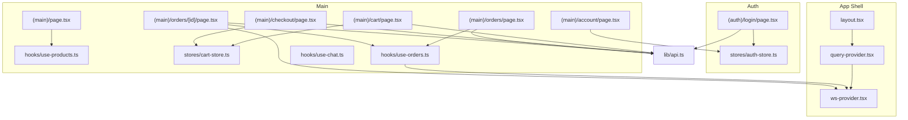
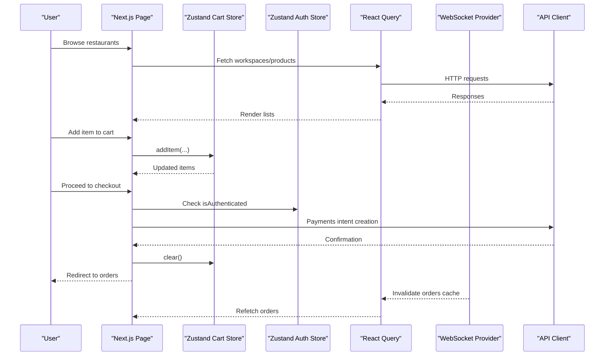
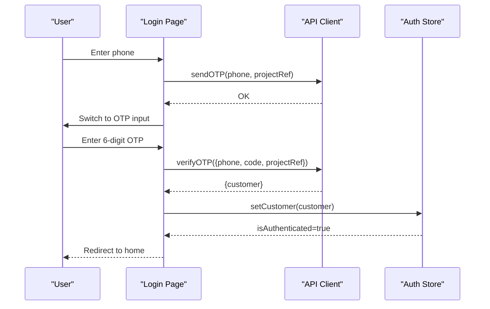
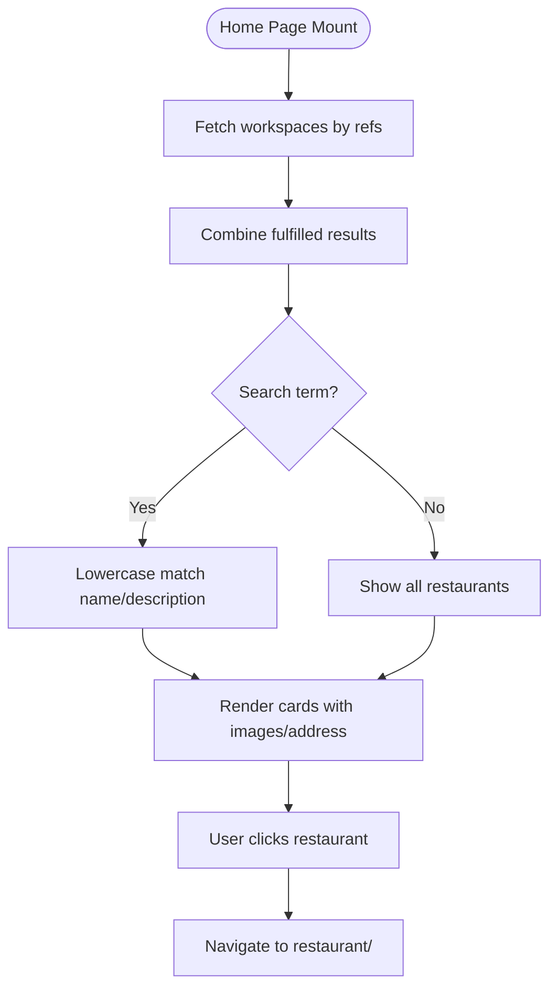
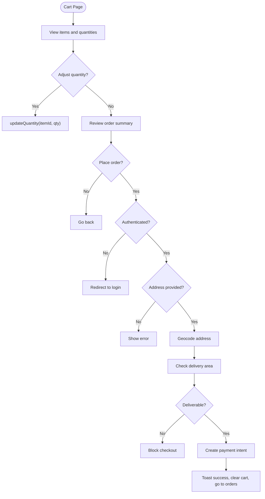
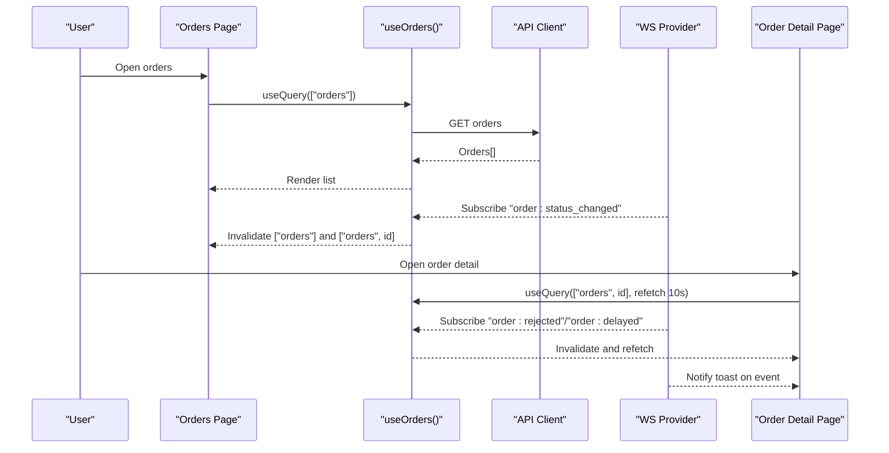
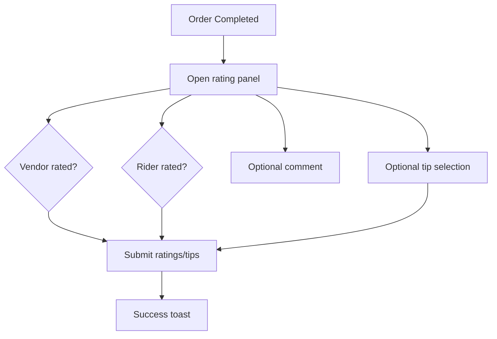
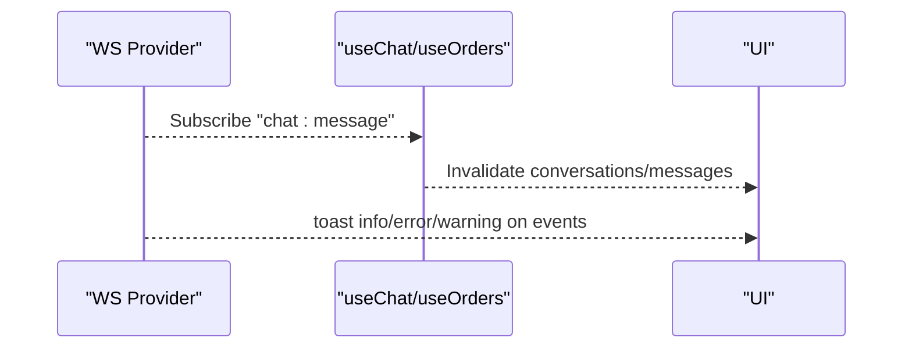
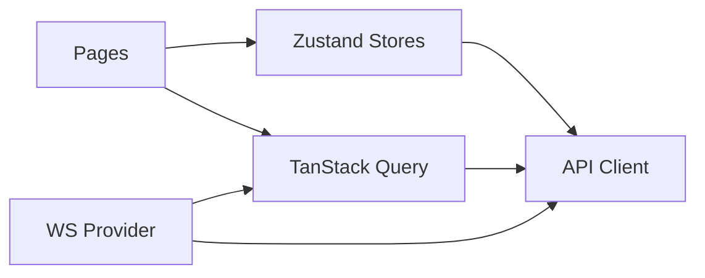

# Customer Application

<cite>
**Referenced Files in This Document**
- [auth-store.ts](file://apps/customer/src/stores/auth-store.ts)
- [cart-store.ts](file://apps/customer/src/stores/cart-store.ts)
- [api.ts](file://apps/customer/src/lib/api.ts)
- [use-orders.ts](file://apps/customer/src/hooks/use-orders.ts)
- [use-products.ts](file://apps/customer/src/hooks/use-products.ts)
- [use-chat.ts](file://apps/customer/src/hooks/use-chat.ts)
- [page.tsx (Home)](file://apps/customer/src/app/(main)/page.tsx)
- [page.tsx (Cart)](file://apps/customer/src/app/(main)/cart/page.tsx)
- [page.tsx (Checkout)](file://apps/customer/src/app/(main)/checkout/page.tsx)
- [page.tsx (Orders)](file://apps/customer/src/app/(main)/orders/page.tsx)
- [page.tsx (Order Detail)](file://apps/customer/src/app/(main)/orders/[id]/page.tsx)
- [page.tsx (Login)](file://apps/customer/src/app/(auth)/login/page.tsx)
- [page.tsx (Account)](file://apps/customer/src/app/(main)/account/page.tsx)
- [layout.tsx](file://apps/customer/src/app/layout.tsx)
- [query-provider.tsx](file://apps/customer/src/providers/query-provider.tsx)
- [ws-provider.tsx](file://apps/customer/src/providers/ws-provider.tsx)
</cite>

## Table of Contents
1. [Introduction](#introduction)
2. [Project Structure](#project-structure)
3. [Core Components](#core-components)
4. [Architecture Overview](#architecture-overview)
5. [Detailed Component Analysis](#detailed-component-analysis)
6. [Dependency Analysis](#dependency-analysis)
7. [Performance Considerations](#performance-considerations)
8. [Troubleshooting Guide](#troubleshooting-guide)
9. [Conclusion](#conclusion)
10. [Appendices](#appendices)

## Introduction
This document describes the customer-facing web application for placing food orders, browsing restaurants, managing carts, checking out, tracking orders, and rating experiences. It explains the application architecture, component hierarchy, and state management using Zustand stores. It also covers authentication, session hydration, real-time updates via WebSocket, order lifecycle tracking, and mobile responsiveness considerations.

## Project Structure
The customer app is a Next.js application organized by feature routes under app/(main) and app/(auth). Shared state is managed with Zustand stores, data fetching uses TanStack Query, and real-time events are handled via a WebSocket provider. The UI leverages a shared design system package.

**Diagram sources**
- [layout.tsx:15-28](file://apps/customer/src/app/layout.tsx#L15-L28)
- [query-provider.tsx:6-23](file://apps/customer/src/providers/query-provider.tsx#L6-L23)
- [ws-provider.tsx:27-60](file://apps/customer/src/providers/ws-provider.tsx#L27-L60)
- [page.tsx (Login)](file://apps/customer/src/app/(auth)/login/page.tsx#L13-L196)
- [auth-store.ts:14-47](file://apps/customer/src/stores/auth-store.ts#L14-L47)
- [page.tsx (Home)](file://apps/customer/src/app/(main)/page.tsx#L26-L152)
- [use-products.ts:5-19](file://apps/customer/src/hooks/use-products.ts#L5-L19)
- [page.tsx (Cart)](file://apps/customer/src/app/(main)/cart/page.tsx#L15-L127)
- [cart-store.ts:28-82](file://apps/customer/src/stores/cart-store.ts#L28-L82)
- [page.tsx (Checkout)](file://apps/customer/src/app/(main)/checkout/page.tsx#L22-L187)
- [page.tsx (Orders)](file://apps/customer/src/app/(main)/orders/page.tsx#L18-L87)
- [use-orders.ts:6-45](file://apps/customer/src/hooks/use-orders.ts#L6-L45)
- [page.tsx (Order Detail)](file://apps/customer/src/app/(main)/orders/[id]/page.tsx#L138-L506)
- [use-chat.ts:5-19](file://apps/customer/src/hooks/use-chat.ts#L5-L19)
- [api.ts:1-11](file://apps/customer/src/lib/api.ts#L1-L11)

**Section sources**
- [layout.tsx:1-29](file://apps/customer/src/app/layout.tsx#L1-L29)
- [query-provider.tsx:1-24](file://apps/customer/src/providers/query-provider.tsx#L1-L24)
- [ws-provider.tsx:1-86](file://apps/customer/src/providers/ws-provider.tsx#L1-L86)
- [api.ts:1-11](file://apps/customer/src/lib/api.ts#L1-L11)

## Core Components
- Authentication store: hydrates session, sets customer, logs out.
- Cart store: persists items to localStorage, supports add/update/remove/clear, totals computation.
- Data fetching: TanStack Query for restaurants, products, orders, conversations/messages.
- Real-time updates: WebSocket provider subscribing to order/chat events.
- API client: centralized HTTP and WebSocket URLs.

Key responsibilities:
- Auth store manages customer identity and authentication state.
- Cart store encapsulates cart operations and persistence.
- Hooks coordinate data fetching and subscriptions.
- Providers wire up caching, refetching, and live updates.

**Section sources**
- [auth-store.ts:5-47](file://apps/customer/src/stores/auth-store.ts#L5-L47)
- [cart-store.ts:15-82](file://apps/customer/src/stores/cart-store.ts#L15-L82)
- [use-orders.ts:6-45](file://apps/customer/src/hooks/use-orders.ts#L6-L45)
- [use-products.ts:5-19](file://apps/customer/src/hooks/use-products.ts#L5-L19)
- [use-chat.ts:5-19](file://apps/customer/src/hooks/use-chat.ts#L5-L19)
- [ws-provider.tsx:27-60](file://apps/customer/src/providers/ws-provider.tsx#L27-L60)
- [api.ts:3-11](file://apps/customer/src/lib/api.ts#L3-L11)

## Architecture Overview
The app follows a layered architecture:
- UI pages and components in app/(main)/(auth)
- State management with Zustand stores
- Data fetching with TanStack Query and React Query
- Real-time updates via WebSocket subscription
- API abstraction wrapping HTTP and WebSocket clients

**Diagram sources**
- [page.tsx (Home)](file://apps/customer/src/app/(main)/page.tsx#L29-L42)
- [use-products.ts:5-11](file://apps/customer/src/hooks/use-products.ts#L5-L11)
- [cart-store.ts:37-52](file://apps/customer/src/stores/cart-store.ts#L37-L52)
- [page.tsx (Checkout)](file://apps/customer/src/app/(main)/checkout/page.tsx#L57-L88)
- [auth-store.ts:36-46](file://apps/customer/src/stores/auth-store.ts#L36-L46)
- [use-orders.ts:6-14](file://apps/customer/src/hooks/use-orders.ts#L6-L14)
- [ws-provider.tsx:34-47](file://apps/customer/src/providers/ws-provider.tsx#L34-L47)
- [api.ts:3-11](file://apps/customer/src/lib/api.ts#L3-L11)

## Detailed Component Analysis

### Authentication Flow and Session Management
- Two-step login: phone number submission followed by OTP verification.
- Session hydration on app load using a server endpoint.
- Logout clears local state and invokes backend logout.

**Diagram sources**
- [page.tsx (Login)](file://apps/customer/src/app/(auth)/login/page.tsx#L28-L67)
- [auth-store.ts:36-37](file://apps/customer/src/stores/auth-store.ts#L36-L37)
- [api.ts:3-11](file://apps/customer/src/lib/api.ts#L3-L11)

**Section sources**
- [page.tsx (Login)](file://apps/customer/src/app/(auth)/login/page.tsx#L13-L196)
- [auth-store.ts:19-46](file://apps/customer/src/stores/auth-store.ts#L19-L46)
- [layout.tsx:1-29](file://apps/customer/src/app/layout.tsx#L1-L29)

### Restaurant Browsing and Menu Display
- Home page fetches multiple workspaces concurrently and filters by search.
- Products and workspace queries enable per-restaurant menu rendering.
- Responsive grid layout adapts to small screens.

**Diagram sources**
- [page.tsx (Home)](file://apps/customer/src/app/(main)/page.tsx#L29-L53)
- [use-products.ts:5-11](file://apps/customer/src/hooks/use-products.ts#L5-L11)
- [use-products.ts:13-19](file://apps/customer/src/hooks/use-products.ts#L13-L19)

**Section sources**
- [page.tsx (Home)](file://apps/customer/src/app/(main)/page.tsx#L17-L152)
- [use-products.ts:1-20](file://apps/customer/src/hooks/use-products.ts#L1-L20)

### Shopping Cart, Persistence, and Checkout
- Cart operations: add, increase/decrease quantity, remove, clear.
- Persistence: localStorage-backed via Zustand persist.
- Checkout validates authentication, checks delivery eligibility, creates payment intent, and redirects to orders.

**Diagram sources**
- [page.tsx (Cart)](file://apps/customer/src/app/(main)/cart/page.tsx#L15-L127)
- [cart-store.ts:37-79](file://apps/customer/src/stores/cart-store.ts#L37-L79)
- [page.tsx (Checkout)](file://apps/customer/src/app/(main)/checkout/page.tsx#L22-L187)

**Section sources**
- [cart-store.ts:1-83](file://apps/customer/src/stores/cart-store.ts#L1-L83)
- [page.tsx (Cart)](file://apps/customer/src/app/(main)/cart/page.tsx#L1-L127)
- [page.tsx (Checkout)](file://apps/customer/src/app/(main)/checkout/page.tsx#L1-L187)

### Order Tracking Dashboard and Real-Time Updates
- Orders list shows recent orders with status badges and dates.
- Per-order detail displays a status timeline, SLA countdown, late indicators, and optional rating/tip flow.
- WebSocket subscriptions invalidate queries and trigger user notifications for order/status changes.

**Diagram sources**
- [page.tsx (Orders)](file://apps/customer/src/app/(main)/orders/page.tsx#L18-L87)
- [use-orders.ts:6-28](file://apps/customer/src/hooks/use-orders.ts#L6-L28)
- [page.tsx (Order Detail)](file://apps/customer/src/app/(main)/orders/[id]/page.tsx#L138-L174)
- [ws-provider.tsx:34-47](file://apps/customer/src/providers/ws-provider.tsx#L34-L47)

**Section sources**
- [page.tsx (Orders)](file://apps/customer/src/app/(main)/orders/page.tsx#L1-L87)
- [use-orders.ts:1-46](file://apps/customer/src/hooks/use-orders.ts#L1-L46)
- [page.tsx (Order Detail)](file://apps/customer/src/app/(main)/orders/[id]/page.tsx#L1-L506)
- [ws-provider.tsx:1-86](file://apps/customer/src/providers/ws-provider.tsx#L1-L86)

### Rating and Tip Submission
- After completion, users can rate vendor and/or rider, and optionally add a tip.
- Submissions call ratings and tips endpoints; UI disables submission until valid selections.

**Diagram sources**
- [page.tsx (Order Detail)](file://apps/customer/src/app/(main)/orders/[id]/page.tsx#L191-L231)

**Section sources**
- [page.tsx (Order Detail)](file://apps/customer/src/app/(main)/orders/[id]/page.tsx#L104-L136)
- [page.tsx (Order Detail)](file://apps/customer/src/app/(main)/orders/[id]/page.tsx#L191-L231)

### Push Notifications and Chat Integration
- Toast notifications inform users of order updates (rejected, delayed, status change).
- Chat hooks support listing conversations and polling messages.
- WebSocket subscriptions keep conversations fresh.

**Diagram sources**
- [ws-provider.tsx:44-46](file://apps/customer/src/providers/ws-provider.tsx#L44-L46)
- [use-chat.ts:5-19](file://apps/customer/src/hooks/use-chat.ts#L5-L19)
- [use-orders.ts:30-42](file://apps/customer/src/hooks/use-orders.ts#L30-L42)

**Section sources**
- [ws-provider.tsx:1-86](file://apps/customer/src/providers/ws-provider.tsx#L1-L86)
- [use-chat.ts:1-20](file://apps/customer/src/hooks/use-chat.ts#L1-L20)
- [use-orders.ts:1-46](file://apps/customer/src/hooks/use-orders.ts#L1-L46)

### User Profile and Account
- Displays customer profile details and provides logout.
- On logout, clears cart and redirects to login.

**Section sources**
- [page.tsx (Account)](file://apps/customer/src/app/(main)/account/page.tsx#L1-L88)
- [auth-store.ts:39-46](file://apps/customer/src/stores/auth-store.ts#L39-L46)
- [cart-store.ts:69-69](file://apps/customer/src/stores/cart-store.ts#L69-L69)

## Dependency Analysis
- UI pages depend on Zustand stores for state and TanStack Query for data.
- WebSocket provider depends on the API client’s configured WebSocket URL.
- Auth store depends on API auth endpoints.
- Cart store depends on localStorage via a safe storage wrapper.

**Diagram sources**
- [cart-store.ts:5-13](file://apps/customer/src/stores/cart-store.ts#L5-L13)
- [auth-store.ts:1-3](file://apps/customer/src/stores/auth-store.ts#L1-L3)
- [api.ts:3-11](file://apps/customer/src/lib/api.ts#L3-L11)
- [ws-provider.tsx:17-25](file://apps/customer/src/providers/ws-provider.tsx#L17-L25)

**Section sources**
- [cart-store.ts:1-83](file://apps/customer/src/stores/cart-store.ts#L1-L83)
- [auth-store.ts:1-48](file://apps/customer/src/stores/auth-store.ts#L1-L48)
- [api.ts:1-11](file://apps/customer/src/lib/api.ts#L1-L11)
- [ws-provider.tsx:1-86](file://apps/customer/src/providers/ws-provider.tsx#L1-L86)

## Performance Considerations
- Query caching and staleness: default staleTime reduces redundant network calls.
- Debounced geocoding and delivery checks prevent excessive API calls during typing.
- Persisted cart avoids re-fetching items across sessions.
- WebSocket subscriptions invalidate only necessary queries to minimize re-renders.

Recommendations:
- Consider optimistic updates for cart adjustments.
- Lazy-load restaurant banners to improve initial render performance.
- Implement pagination for orders and messages if datasets grow large.

**Section sources**
- [query-provider.tsx:7-18](file://apps/customer/src/providers/query-provider.tsx#L7-L18)
- [page.tsx (Checkout)](file://apps/customer/src/app/(main)/checkout/page.tsx#L32-L51)
- [cart-store.ts:28-82](file://apps/customer/src/stores/cart-store.ts#L28-L82)
- [ws-provider.tsx:34-47](file://apps/customer/src/providers/ws-provider.tsx#L34-L47)

## Troubleshooting Guide
Common issues and resolutions:
- Cannot place order
  - Ensure authentication; the checkout route checks authentication and redirects to login if missing.
  - Verify delivery address is entered; the checkout route validates presence and shows an error.
  - Confirm the restaurant delivers to the given address; delivery check blocks checkout if not deliverable.
- Cart items disappear after refresh
  - The cart store persists to localStorage; confirm browser storage is enabled and not cleared.
- Orders not updating
  - Ensure WebSocket connection is established; events like order:status_changed trigger cache invalidation and refetch.
- Login fails
  - Confirm OTP length and correctness; the login route enforces a six-digit code and shows user-friendly errors.

Operational checks:
- Network tab: verify API endpoints for orders, payments, ratings, tips.
- Console: inspect WebSocket connection and subscription logs.
- Storage: confirm localStorage entries for the cart.

**Section sources**
- [page.tsx (Checkout)](file://apps/customer/src/app/(main)/checkout/page.tsx#L57-L88)
- [cart-store.ts:28-82](file://apps/customer/src/stores/cart-store.ts#L28-L82)
- [use-orders.ts:30-42](file://apps/customer/src/hooks/use-orders.ts#L30-L42)
- [page.tsx (Login)](file://apps/customer/src/app/(auth)/login/page.tsx#L28-L67)

## Conclusion
The customer application integrates UI pages, Zustand stores, TanStack Query, and WebSocket subscriptions to deliver a responsive ordering experience. Authentication, cart persistence, real-time order updates, and rating/tip submission are implemented cohesively. Following the outlined workflows and troubleshooting steps ensures reliable operation across devices.

## Appendices
- Mobile responsiveness
  - Pages use constrained max widths and responsive grids suitable for small screens.
  - Buttons and inputs are sized for touch interaction.

[No sources needed since this section provides general guidance]