# Order Management & Tracking

<cite>
**Referenced Files in This Document**
- [use-orders.ts](file://apps/customer/src/hooks/use-orders.ts)
- [ws-provider.tsx](file://apps/customer/src/providers/ws-provider.tsx)
- [api.ts](file://apps/customer/src/lib/api.ts)
- [order.controller.js](file://apps/server/controllers/order.controller.js)
- [order.model.js](file://apps/server/models/order.model.js)
- [order.routes.js](file://apps/server/routes/order.routes.js)
- [ws-server.js](file://apps/server/websocket/ws-server.js)
- [notification.service.js](file://apps/server/services/notification.service.js)
- [index.ts](file://packages/types/src/index.ts)
</cite>

## Table of Contents
1. [Introduction](#introduction)
2. [Project Structure](#project-structure)
3. [Core Components](#core-components)
4. [Architecture Overview](#architecture-overview)
5. [Detailed Component Analysis](#detailed-component-analysis)
6. [Dependency Analysis](#dependency-analysis)
7. [Performance Considerations](#performance-considerations)
8. [Troubleshooting Guide](#troubleshooting-guide)
9. [Conclusion](#conclusion)
10. [Appendices](#appendices)

## Introduction
This document describes the customer-facing order management and tracking system. It covers how customers view order history, track order status, receive real-time updates via WebSocket, and see delivery information. It also documents the rating and review system, order cancellation and refund tracking, and the full order lifecycle from placement to completion. Examples of state transitions, user actions, and notification handling are included to help developers and operators understand the end-to-end flow.

## Project Structure
The order management system spans three primary areas:
- Frontend (customer app): React hooks and WebSocket provider for live updates and order queries.
- Backend (server): Express routes, controllers, models, and WebSocket server for real-time events.
- Shared types: TypeScript interfaces and enums used across frontend and backend.

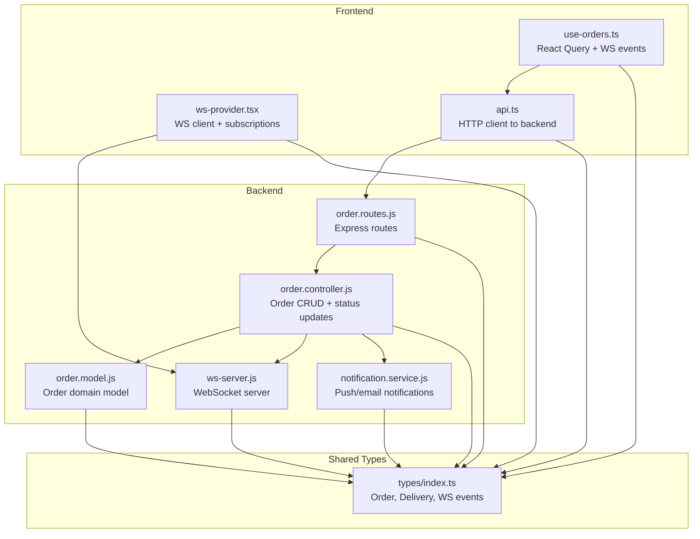

**Diagram sources**
- [use-orders.ts:1-46](file://apps/customer/src/hooks/use-orders.ts#L1-L46)
- [ws-provider.tsx:1-86](file://apps/customer/src/providers/ws-provider.tsx#L1-L86)
- [api.ts:1-11](file://apps/customer/src/lib/api.ts#L1-L11)
- [order.routes.js:1-39](file://apps/server/routes/order.routes.js#L1-L39)
- [order.controller.js:1-513](file://apps/server/controllers/order.controller.js#L1-L513)
- [order.model.js:1-178](file://apps/server/models/order.model.js#L1-L178)
- [ws-server.js:1-237](file://apps/server/websocket/ws-server.js#L1-L237)
- [notification.service.js:1-180](file://apps/server/services/notification.service.js#L1-L180)
- [index.ts:1-363](file://packages/types/src/index.ts#L1-L363)

**Section sources**
- [use-orders.ts:1-46](file://apps/customer/src/hooks/use-orders.ts#L1-L46)
- [ws-provider.tsx:1-86](file://apps/customer/src/providers/ws-provider.tsx#L1-L86)
- [api.ts:1-11](file://apps/customer/src/lib/api.ts#L1-L11)
- [order.routes.js:1-39](file://apps/server/routes/order.routes.js#L1-L39)
- [order.controller.js:1-513](file://apps/server/controllers/order.controller.js#L1-L513)
- [order.model.js:1-178](file://apps/server/models/order.model.js#L1-L178)
- [ws-server.js:1-237](file://apps/server/websocket/ws-server.js#L1-L237)
- [notification.service.js:1-180](file://apps/server/services/notification.service.js#L1-L180)
- [index.ts:1-363](file://packages/types/src/index.ts#L1-L363)

## Core Components
- Order history interface: Lists recent orders for a customer with pagination and filtering by status.
- Order details view: Retrieves a single order with items and delivery metadata for display.
- Real-time order updates: WebSocket subscriptions to order status changes, rejections, and delays.
- Status timeline: Displays ordered status transitions with timestamps.
- Delivery information: Rider assignment, location pings, and arrival notifications.
- Rating and review system: Post-completion rating submission for vendor and/or rider.
- Cancellation and refunds: Customer-initiated cancellations and automatic refunds when applicable.
- Order lifecycle: End-to-end state machine from placement to completion.

**Section sources**
- [use-orders.ts:6-46](file://apps/customer/src/hooks/use-orders.ts#L6-L46)
- [order.controller.js:30-82](file://apps/server/controllers/order.controller.js#L30-L82)
- [order.controller.js:142-191](file://apps/server/controllers/order.controller.js#L142-L191)
- [order.model.js:12-21](file://apps/server/models/order.model.js#L12-L21)
- [order.model.js:23-23](file://apps/server/models/order.model.js#L23-L23)
- [ws-server.js:152-161](file://apps/server/websocket/ws-server.js#L152-L161)
- [notification.service.js:42-53](file://apps/server/services/notification.service.js#L42-53)

## Architecture Overview
The system integrates HTTP APIs and WebSocket streams:
- Frontend uses React Query to fetch orders and a WebSocket client to subscribe to live events.
- Backend exposes REST endpoints for order operations and broadcasts real-time events over WebSocket.
- Notifications are sent via push and email channels when statuses change.

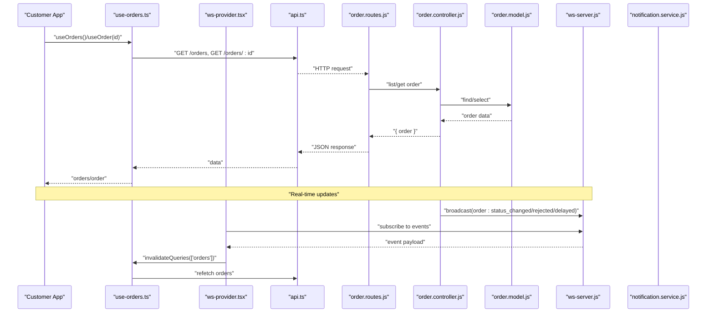

**Diagram sources**
- [use-orders.ts:6-46](file://apps/customer/src/hooks/use-orders.ts#L6-L46)
- [ws-provider.tsx:27-60](file://apps/customer/src/providers/ws-provider.tsx#L27-L60)
- [api.ts:1-11](file://apps/customer/src/lib/api.ts#L1-L11)
- [order.routes.js:14-36](file://apps/server/routes/order.routes.js#L14-L36)
- [order.controller.js:30-82](file://apps/server/controllers/order.controller.js#L30-L82)
- [order.controller.js:142-191](file://apps/server/controllers/order.controller.js#L142-L191)
- [order.model.js:30-50](file://apps/server/models/order.model.js#L30-L50)
- [ws-server.js:162-175](file://apps/server/websocket/ws-server.js#L162-L175)
- [notification.service.js:42-53](file://apps/server/services/notification.service.js#L42-53)

## Detailed Component Analysis

### Order History Interface
- Purpose: Allow customers to list orders with optional filters (status, pagination).
- Implementation highlights:
  - Uses React Query to cache and fetch orders.
  - Limits results and sorts by recency.
  - Enforces access control via caller role and customer ID.

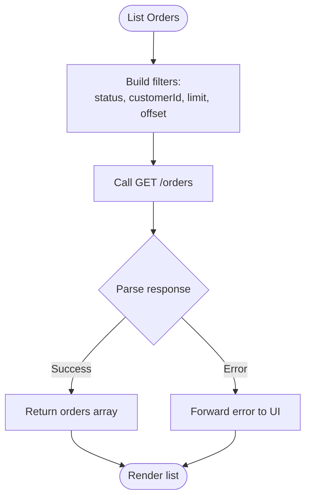

**Diagram sources**
- [order.controller.js:30-46](file://apps/server/controllers/order.controller.js#L30-L46)
- [order.routes.js:14-15](file://apps/server/routes/order.routes.js#L14-L15)
- [use-orders.ts:7-13](file://apps/customer/src/hooks/use-orders.ts#L7-L13)

**Section sources**
- [order.controller.js:30-46](file://apps/server/controllers/order.controller.js#L30-L46)
- [order.routes.js:14-15](file://apps/server/routes/order.routes.js#L14-L15)
- [use-orders.ts:7-13](file://apps/customer/src/hooks/use-orders.ts#L7-L13)

### Order Details View
- Purpose: Load a single order with items and delivery metadata for display.
- Implementation highlights:
  - Fetches order with nested items.
  - Augments response with delivery and vendor info for rating/tip UI.
  - Applies access control per project/workspace and customer ownership.

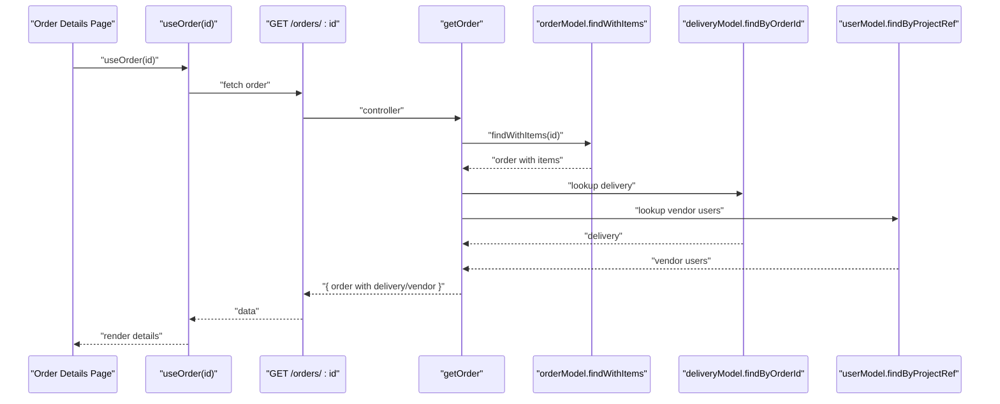

**Diagram sources**
- [order.controller.js:50-82](file://apps/server/controllers/order.controller.js#L50-L82)
- [order.model.js:44-50](file://apps/server/models/order.model.js#L44-L50)
- [use-orders.ts:16-28](file://apps/customer/src/hooks/use-orders.ts#L16-L28)

**Section sources**
- [order.controller.js:50-82](file://apps/server/controllers/order.controller.js#L50-L82)
- [order.model.js:44-50](file://apps/server/models/order.model.js#L44-L50)
- [use-orders.ts:16-28](file://apps/customer/src/hooks/use-orders.ts#L16-L28)

### Real-Time Order Updates
- Purpose: Keep the UI synchronized with live order state changes.
- Implementation highlights:
  - WebSocket provider connects to /ws and subscribes to order-related events.
  - On receiving events, invalidates React Query caches to trigger refetch.
  - Specific events: order status changed, rejected, delayed.

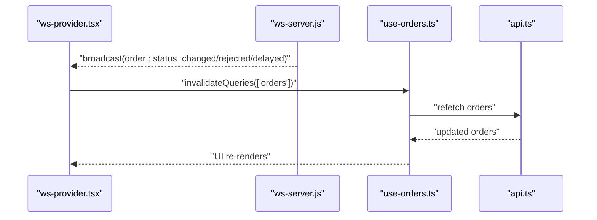

**Diagram sources**
- [ws-provider.tsx:27-60](file://apps/customer/src/providers/ws-provider.tsx#L27-L60)
- [ws-server.js:162-175](file://apps/server/websocket/ws-server.js#L162-L175)
- [use-orders.ts:30-44](file://apps/customer/src/hooks/use-orders.ts#L30-L44)

**Section sources**
- [ws-provider.tsx:27-60](file://apps/customer/src/providers/ws-provider.tsx#L27-L60)
- [ws-server.js:162-175](file://apps/server/websocket/ws-server.js#L162-L175)
- [use-orders.ts:30-44](file://apps/customer/src/hooks/use-orders.ts#L30-L44)

### Status Timeline and Delivery Information
- Purpose: Visualize order progress and delivery updates.
- Implementation highlights:
  - Timeline entries derived from order status transitions and timestamps.
  - Delivery info includes rider assignment, location pings, and arrival.
  - Notifications are sent on status changes and special events (e.g., rider arrived).

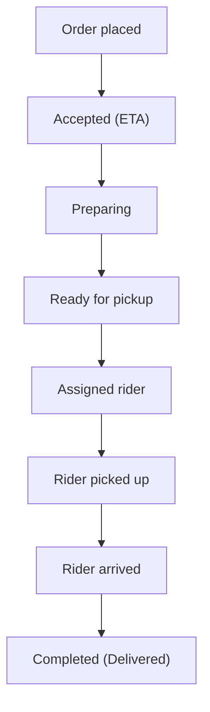

**Diagram sources**
- [order.model.js:12-21](file://apps/server/models/order.model.js#L12-L21)
- [order.controller.js:170-176](file://apps/server/controllers/order.controller.js#L170-L176)
- [notification.service.js:120-135](file://apps/server/services/notification.service.js#L120-135)

**Section sources**
- [order.model.js:12-21](file://apps/server/models/order.model.js#L12-L21)
- [order.controller.js:170-176](file://apps/server/controllers/order.controller.js#L170-L176)
- [notification.service.js:120-135](file://apps/server/services/notification.service.js#L120-135)

### Rating and Review System
- Purpose: Capture customer feedback after delivery.
- Implementation highlights:
  - The order response includes vendor metadata to enable rating UI.
  - Ratings are modeled separately with roles (vendor/rider) and numeric scores.
  - Rating endpoints are exposed via dedicated routes.

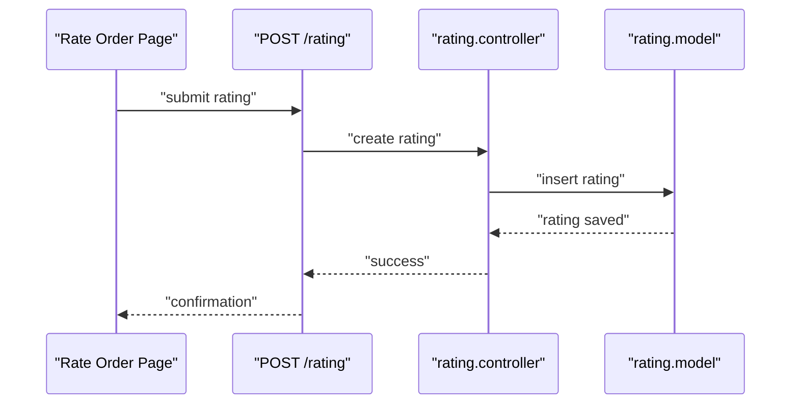

**Diagram sources**
- [index.ts:154-163](file://packages/types/src/index.ts#L154-L163)
- [order.controller.js:61-76](file://apps/server/controllers/order.controller.js#L61-L76)

**Section sources**
- [index.ts:154-163](file://packages/types/src/index.ts#L154-L163)
- [order.controller.js:61-76](file://apps/server/controllers/order.controller.js#L61-L76)

### Order Cancellation and Refund Tracking
- Purpose: Enable cancellations and track refund outcomes.
- Implementation highlights:
  - Cancellations are allowed in specific statuses and can be initiated by customer or admin/vendor.
  - Automatic refund via payment provider when payment has been made.
  - Audit logs record cancellation details; customer receives cancellation email.

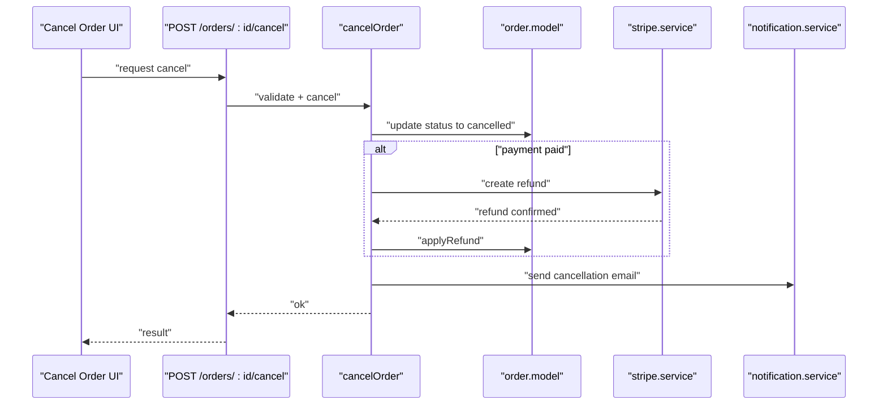

**Diagram sources**
- [order.controller.js:238-296](file://apps/server/controllers/order.controller.js#L238-L296)
- [order.model.js:124-131](file://apps/server/models/order.model.js#L124-L131)
- [notification.service.js:97-101](file://apps/server/services/notification.service.js#L97-L101)

**Section sources**
- [order.controller.js:238-296](file://apps/server/controllers/order.controller.js#L238-L296)
- [order.model.js:124-131](file://apps/server/models/order.model.js#L124-L131)
- [notification.service.js:97-101](file://apps/server/services/notification.service.js#L97-L101)

### Order Lifecycle Management
- Purpose: Define allowed state transitions and enforce validity.
- Implementation highlights:
  - Valid statuses and transitions are defined centrally.
  - Status updates are validated against the transition matrix.
  - SLA deadlines can be set and extended; breaches are tracked.

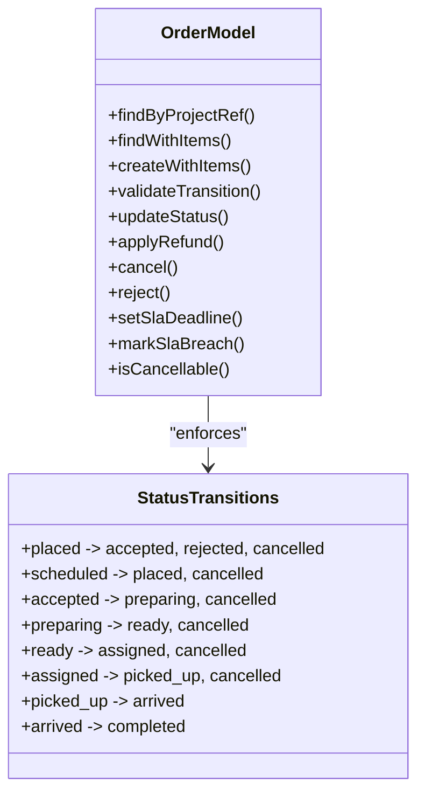

**Diagram sources**
- [order.model.js:12-21](file://apps/server/models/order.model.js#L12-L21)
- [order.model.js:95-103](file://apps/server/models/order.model.js#L95-L103)
- [order.model.js:157-159](file://apps/server/models/order.model.js#L157-L159)

**Section sources**
- [order.model.js:12-21](file://apps/server/models/order.model.js#L12-L21)
- [order.model.js:95-103](file://apps/server/models/order.model.js#L95-L103)
- [order.model.js:157-159](file://apps/server/models/order.model.js#L157-L159)

### WebSocket Integration and Notification Handling
- Purpose: Deliver live updates and notify users of important events.
- Implementation highlights:
  - WebSocket server authenticates via session cookies or JWT and maintains a registry per project.
  - Broadcasts supported events include order status changes, rejections, delays, and delivery updates.
  - Push notifications are sent to registered devices; emails are dispatched for refunds and cancellations.

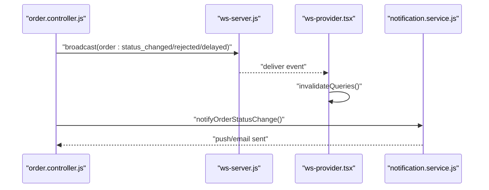

**Diagram sources**
- [order.controller.js:161-168](file://apps/server/controllers/order.controller.js#L161-L168)
- [order.controller.js:316-321](file://apps/server/controllers/order.controller.js#L316-L321)
- [order.controller.js:425-431](file://apps/server/controllers/order.controller.js#L425-L431)
- [ws-server.js:162-175](file://apps/server/websocket/ws-server.js#L162-L175)
- [ws-provider.tsx:34-47](file://apps/customer/src/providers/ws-provider.tsx#L34-L47)
- [notification.service.js:42-53](file://apps/server/services/notification.service.js#L42-53)

**Section sources**
- [order.controller.js:161-168](file://apps/server/controllers/order.controller.js#L161-L168)
- [order.controller.js:316-321](file://apps/server/controllers/order.controller.js#L316-L321)
- [order.controller.js:425-431](file://apps/server/controllers/order.controller.js#L425-L431)
- [ws-server.js:162-175](file://apps/server/websocket/ws-server.js#L162-L175)
- [ws-provider.tsx:34-47](file://apps/customer/src/providers/ws-provider.tsx#L34-L47)
- [notification.service.js:42-53](file://apps/server/services/notification.service.js#L42-53)

## Dependency Analysis
- Frontend depends on shared types for order and event contracts.
- Controllers depend on models for persistence and on the WebSocket server for broadcasting.
- Notifications depend on push/email services and user push tokens.

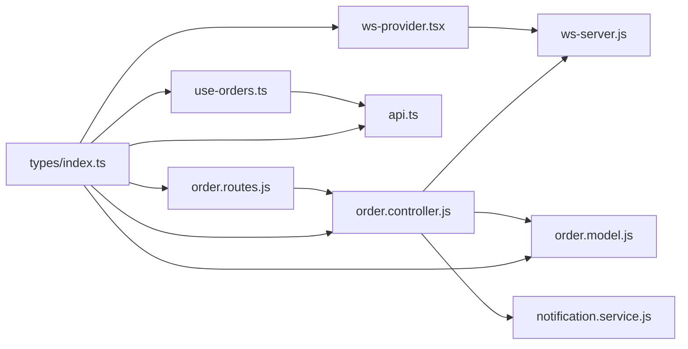

**Diagram sources**
- [index.ts:1-363](file://packages/types/src/index.ts#L1-L363)
- [use-orders.ts:1-5](file://apps/customer/src/hooks/use-orders.ts#L1-L5)
- [ws-provider.tsx:11-12](file://apps/customer/src/providers/ws-provider.tsx#L11-L12)
- [api.ts:1-11](file://apps/customer/src/lib/api.ts#L1-L11)
- [order.routes.js:1-39](file://apps/server/routes/order.routes.js#L1-L39)
- [order.controller.js:1-15](file://apps/server/controllers/order.controller.js#L1-L15)
- [order.model.js:1-178](file://apps/server/models/order.model.js#L1-L178)
- [ws-server.js:1-237](file://apps/server/websocket/ws-server.js#L1-L237)
- [notification.service.js:1-180](file://apps/server/services/notification.service.js#L1-L180)

**Section sources**
- [index.ts:1-363](file://packages/types/src/index.ts#L1-L363)
- [use-orders.ts:1-5](file://apps/customer/src/hooks/use-orders.ts#L1-L5)
- [ws-provider.tsx:11-12](file://apps/customer/src/providers/ws-provider.tsx#L11-L12)
- [api.ts:1-11](file://apps/customer/src/lib/api.ts#L1-L11)
- [order.routes.js:1-39](file://apps/server/routes/order.routes.js#L1-L39)
- [order.controller.js:1-15](file://apps/server/controllers/order.controller.js#L1-L15)
- [order.model.js:1-178](file://apps/server/models/order.model.js#L1-L178)
- [ws-server.js:1-237](file://apps/server/websocket/ws-server.js#L1-L237)
- [notification.service.js:1-180](file://apps/server/services/notification.service.js#L1-L180)

## Performance Considerations
- Use pagination and filtering on order lists to avoid large payloads.
- Leverage React Query’s caching and background refetch to minimize redundant network calls.
- WebSocket subscriptions should be scoped to relevant order IDs to reduce unnecessary invalidations.
- Batch notifications and avoid sending duplicate push messages for the same event.
- Monitor SLA deadlines and extend them judiciously to prevent frequent “delayed” events.

## Troubleshooting Guide
- No real-time updates:
  - Verify WebSocket connection and authentication (session cookie or JWT).
  - Confirm subscriptions for order-related events are active.
- Stale order data:
  - Ensure refetch intervals are configured and React Query caches are invalidated on events.
- Incorrect status transitions:
  - Check the transition matrix and preconditions enforced by the controller/model.
- Missing notifications:
  - Confirm push tokens exist for the user and the notification service is reachable.
- Cancellation errors:
  - Validate that the order is in a cancellable state and payment conditions are met for refunds.

**Section sources**
- [ws-provider.tsx:27-60](file://apps/customer/src/providers/ws-provider.tsx#L27-L60)
- [use-orders.ts:26-28](file://apps/customer/src/hooks/use-orders.ts#L26-L28)
- [order.model.js:95-103](file://apps/server/models/order.model.js#L95-L103)
- [notification.service.js:11-22](file://apps/server/services/notification.service.js#L11-L22)
- [order.controller.js:254-256](file://apps/server/controllers/order.controller.js#L254-L256)

## Conclusion
The order management and tracking system combines robust backend state management with real-time frontend updates to deliver a responsive customer experience. By enforcing strict status transitions, broadcasting meaningful events, and integrating notifications, the system supports a clear lifecycle from placement to completion. Developers can rely on the documented components and flows to extend functionality, troubleshoot issues, and maintain consistency across the customer and rider experiences.

## Appendices
- Example order state transitions:
  - placed → accepted (ETA set)
  - accepted → preparing
  - preparing → ready
  - ready → assigned
  - assigned → picked_up
  - picked_up → arrived
  - arrived → completed
- User actions:
  - Place order (via payment webhook)
  - Cancel order (customer/admin/vendor)
  - Rate vendor/rider (after completion)
- Notification handling:
  - Push notifications on status changes and special events
  - Email confirmations for refunds and cancellations