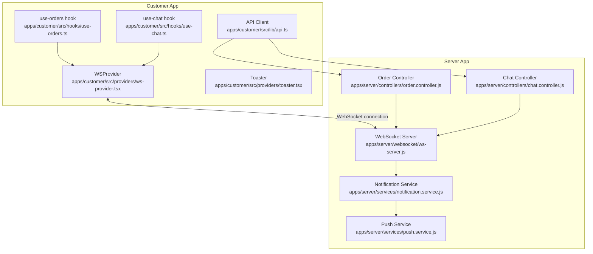
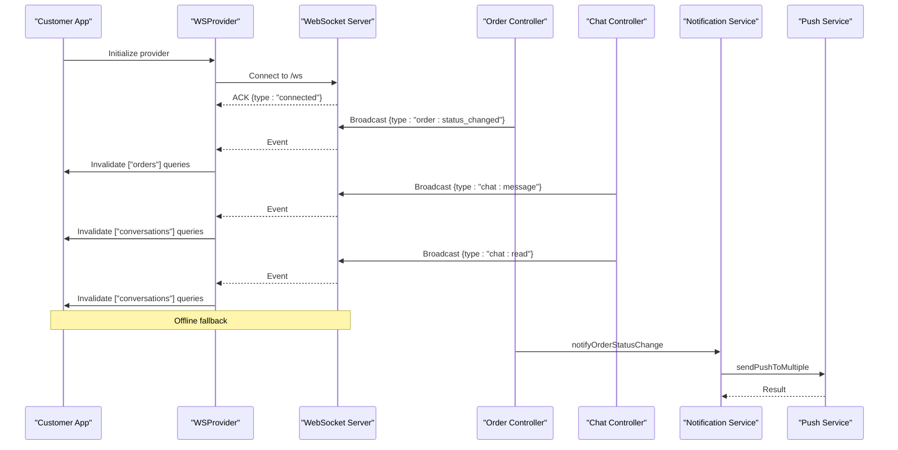
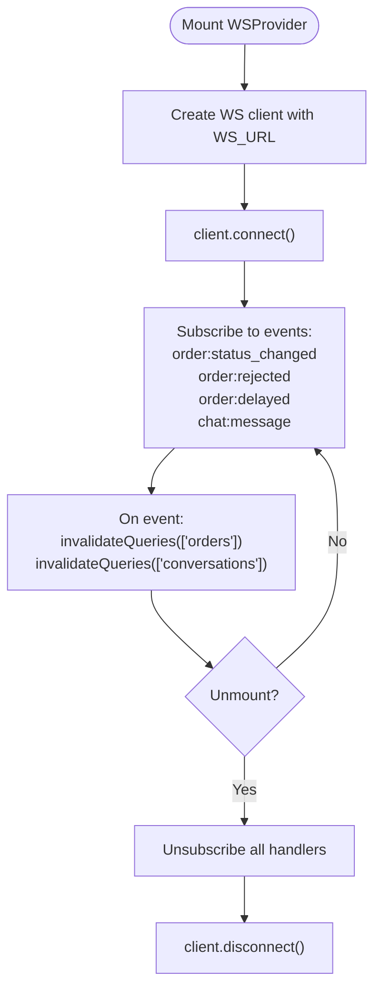
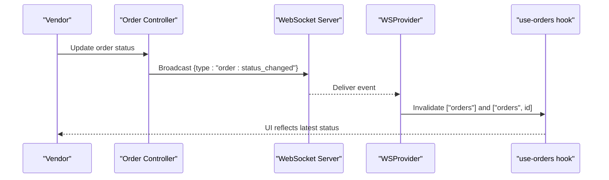
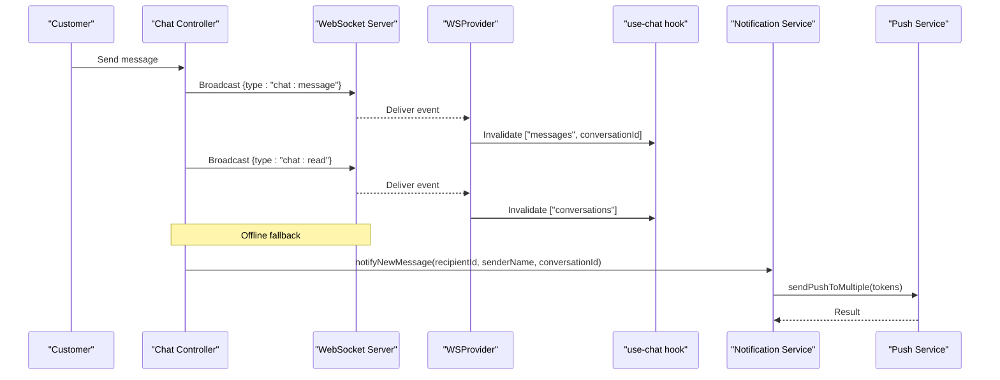
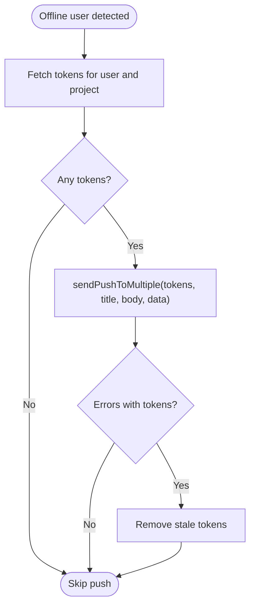
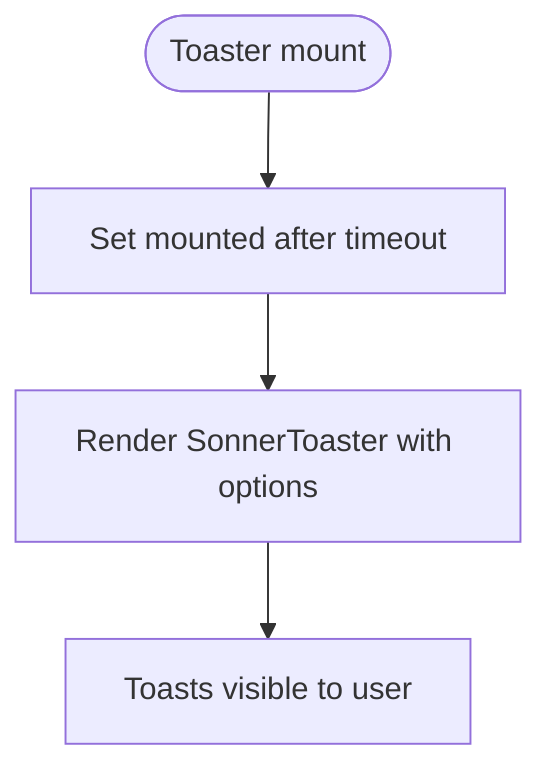
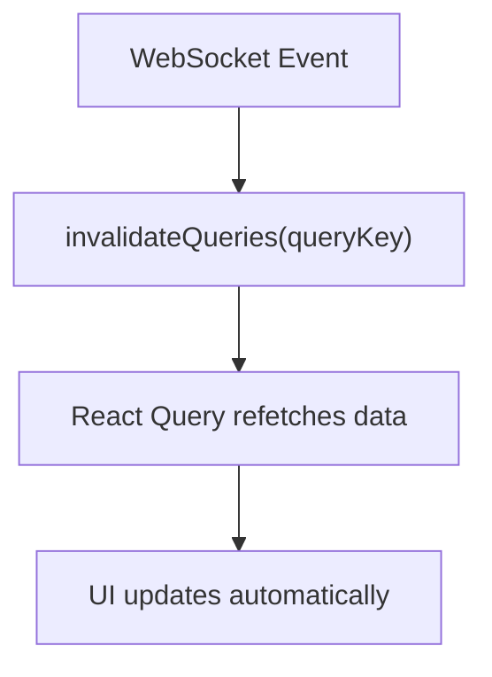
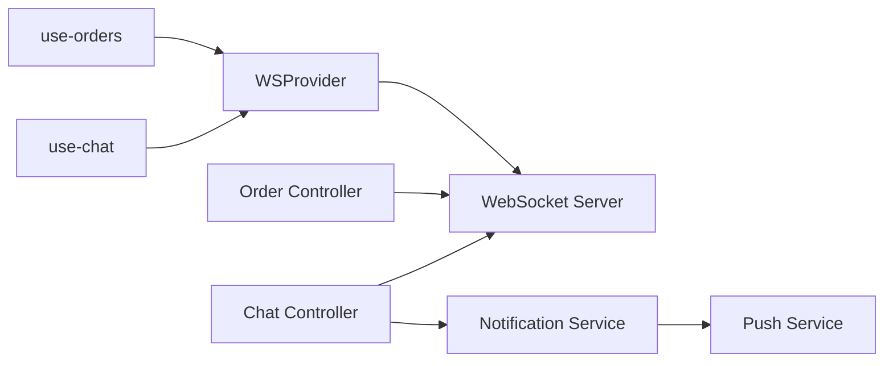

# Real-time Features

<cite>
**Referenced Files in This Document**
- [ws-provider.tsx](file://apps/customer/src/providers/ws-provider.tsx)
- [toaster.tsx](file://apps/customer/src/providers/toaster.tsx)
- [use-orders.ts](file://apps/customer/src/hooks/use-orders.ts)
- [use-chat.ts](file://apps/customer/src/hooks/use-chat.ts)
- [api.ts](file://apps/customer/src/lib/api.ts)
- [ws-server.js](file://apps/server/websocket/ws-server.js)
- [order.controller.js](file://apps/server/controllers/order.controller.js)
- [chat.controller.js](file://apps/server/controllers/chat.controller.js)
- [notification.service.js](file://apps/server/services/notification.service.js)
- [push.service.js](file://apps/server/services/push.service.js)
</cite>

## Table of Contents
1. [Introduction](#introduction)
2. [Project Structure](#project-structure)
3. [Core Components](#core-components)
4. [Architecture Overview](#architecture-overview)
5. [Detailed Component Analysis](#detailed-component-analysis)
6. [Dependency Analysis](#dependency-analysis)
7. [Performance Considerations](#performance-considerations)
8. [Troubleshooting Guide](#troubleshooting-guide)
9. [Conclusion](#conclusion)

## Introduction
This document explains the customer application's real-time features, focusing on WebSocket connections, live updates, and instant notifications. It covers the WebSocket provider implementation, connection lifecycle, event handling patterns, real-time order status updates, chat functionality, and push notification integration. It also details the toast notification system, error handling for connection failures, reconnection strategies, and performance optimization techniques for real-time features.

## Project Structure
The real-time system spans the customer frontend and the server backend:
- Frontend (customer app): WebSocket provider, hooks for orders and chat, toast provider, and API client.
- Backend (server app): WebSocket server, controllers for orders and chat, and notification services.

**Diagram sources**
- [ws-provider.tsx:1-86](file://apps/customer/src/providers/ws-provider.tsx#L1-L86)
- [use-orders.ts:1-46](file://apps/customer/src/hooks/use-orders.ts#L1-L46)
- [use-chat.ts:1-20](file://apps/customer/src/hooks/use-chat.ts#L1-L20)
- [toaster.tsx:1-15](file://apps/customer/src/providers/toaster.tsx#L1-L15)
- [api.ts:1-11](file://apps/customer/src/lib/api.ts#L1-L11)
- [ws-server.js:1-237](file://apps/server/websocket/ws-server.js#L1-L237)
- [order.controller.js:1-513](file://apps/server/controllers/order.controller.js#L1-L513)
- [chat.controller.js:1-174](file://apps/server/controllers/chat.controller.js#L1-L174)
- [notification.service.js:1-180](file://apps/server/services/notification.service.js#L1-L180)
- [push.service.js:1-99](file://apps/server/services/push.service.js#L1-L99)

**Section sources**
- [ws-provider.tsx:1-86](file://apps/customer/src/providers/ws-provider.tsx#L1-L86)
- [use-orders.ts:1-46](file://apps/customer/src/hooks/use-orders.ts#L1-L46)
- [use-chat.ts:1-20](file://apps/customer/src/hooks/use-chat.ts#L1-L20)
- [toaster.tsx:1-15](file://apps/customer/src/providers/toaster.tsx#L1-L15)
- [api.ts:1-11](file://apps/customer/src/lib/api.ts#L1-L11)
- [ws-server.js:1-237](file://apps/server/websocket/ws-server.js#L1-L237)
- [order.controller.js:1-513](file://apps/server/controllers/order.controller.js#L1-L513)
- [chat.controller.js:1-174](file://apps/server/controllers/chat.controller.js#L1-L174)
- [notification.service.js:1-180](file://apps/server/services/notification.service.js#L1-L180)
- [push.service.js:1-99](file://apps/server/services/push.service.js#L1-L99)

## Core Components
- WebSocket Provider: Establishes and manages a persistent WebSocket connection, subscribes to real-time events, and invalidates React Query caches to trigger UI updates.
- Hooks: React Query-based hooks for orders and chat that automatically refresh data and subscribe to specific events.
- Notification Services: Server-side services that broadcast real-time events over WebSocket and send push notifications when users are offline.
- Toast Provider: Renders toast notifications for user feedback.

Key responsibilities:
- Maintain a single WebSocket connection per session.
- Subscribe to domain-specific events (order status, chat).
- Invalidate queries on event reception to keep UI synchronized.
- Fall back to push notifications when users are offline.

**Section sources**
- [ws-provider.tsx:27-64](file://apps/customer/src/providers/ws-provider.tsx#L27-L64)
- [use-orders.ts:6-28](file://apps/customer/src/hooks/use-orders.ts#L6-L28)
- [use-chat.ts:5-19](file://apps/customer/src/hooks/use-chat.ts#L5-L19)
- [notification.service.js:42-53](file://apps/server/services/notification.service.js#L42-L53)
- [toaster.tsx:6-14](file://apps/customer/src/providers/toaster.tsx#L6-L14)

## Architecture Overview
The real-time architecture combines WebSocket subscriptions with React Query cache invalidation and push notifications.

**Diagram sources**
- [ws-provider.tsx:34-47](file://apps/customer/src/providers/ws-provider.tsx#L34-L47)
- [ws-server.js:162-175](file://apps/server/websocket/ws-server.js#L162-L175)
- [order.controller.js:161-168](file://apps/server/controllers/order.controller.js#L161-L168)
- [chat.controller.js:120-127](file://apps/server/controllers/chat.controller.js#L120-L127)
- [notification.service.js:42-53](file://apps/server/services/notification.service.js#L42-L53)
- [push.service.js:59-88](file://apps/server/services/push.service.js#L59-L88)

## Detailed Component Analysis

### WebSocket Provider Implementation
The provider creates a WebSocket client, connects on mount, subscribes to domain events, and cleans up on unmount. It invalidates React Query caches to synchronize UI state.

**Diagram sources**
- [ws-provider.tsx:27-64](file://apps/customer/src/providers/ws-provider.tsx#L27-L64)

**Section sources**
- [ws-provider.tsx:27-64](file://apps/customer/src/providers/ws-provider.tsx#L27-L64)

### Real-time Order Status Updates
Order status changes trigger WebSocket broadcasts. The customer app listens for these events and invalidates order-related queries to refresh the UI. Specific handlers in the orders hook react to rejection and delay events for targeted refresh.

**Diagram sources**
- [order.controller.js:161-168](file://apps/server/controllers/order.controller.js#L161-L168)
- [ws-server.js:162-175](file://apps/server/websocket/ws-server.js#L162-L175)
- [ws-provider.tsx:34-43](file://apps/customer/src/providers/ws-provider.tsx#L34-L43)
- [use-orders.ts:30-42](file://apps/customer/src/hooks/use-orders.ts#L30-L42)

**Section sources**
- [order.controller.js:142-191](file://apps/server/controllers/order.controller.js#L142-L191)
- [use-orders.ts:30-42](file://apps/customer/src/hooks/use-orders.ts#L30-L42)
- [ws-provider.tsx:34-43](file://apps/customer/src/providers/ws-provider.tsx#L34-L43)

### Chat Functionality and Typing Indicators
The chat controller handles message creation and read receipts. Messages are broadcast to participants via WebSocket. Typing indicators are relayed using a dedicated message type. When a user is offline, the system sends push notifications.

**Diagram sources**
- [chat.controller.js:120-134](file://apps/server/controllers/chat.controller.js#L120-L134)
- [chat.controller.js:160-166](file://apps/server/controllers/chat.controller.js#L160-L166)
- [ws-server.js:139-146](file://apps/server/websocket/ws-server.js#L139-L146)
- [notification.service.js:73-83](file://apps/server/services/notification.service.js#L73-L83)
- [push.service.js:59-88](file://apps/server/services/push.service.js#L59-L88)

**Section sources**
- [chat.controller.js:88-140](file://apps/server/controllers/chat.controller.js#L88-L140)
- [chat.controller.js:142-171](file://apps/server/controllers/chat.controller.js#L142-L171)
- [ws-server.js:126-147](file://apps/server/websocket/ws-server.js#L126-L147)
- [notification.service.js:73-83](file://apps/server/services/notification.service.js#L73-L83)
- [push.service.js:59-88](file://apps/server/services/push.service.js#L59-L88)

### Push Notification Integration
When a user is offline, the backend sends push notifications via Firebase. Tokens are fetched per user and project, and stale tokens are cleaned up upon errors.

**Diagram sources**
- [notification.service.js:11-22](file://apps/server/services/notification.service.js#L11-L22)
- [notification.service.js:42-53](file://apps/server/services/notification.service.js#L42-L53)
- [push.service.js:59-88](file://apps/server/services/push.service.js#L59-L88)
- [push.service.js:90-96](file://apps/server/services/push.service.js#L90-L96)

**Section sources**
- [notification.service.js:42-53](file://apps/server/services/notification.service.js#L42-L53)
- [push.service.js:31-54](file://apps/server/services/push.service.js#L31-L54)
- [push.service.js:59-88](file://apps/server/services/push.service.js#L59-L88)
- [push.service.js:90-96](file://apps/server/services/push.service.js#L90-L96)

### Toast Notification System
The toast provider renders a global toast container positioned at the top-right corner. It ensures the component mounts after hydration to avoid SSR mismatches.

**Diagram sources**
- [toaster.tsx:6-14](file://apps/customer/src/providers/toaster.tsx#L6-L14)

**Section sources**
- [toaster.tsx:6-14](file://apps/customer/src/providers/toaster.tsx#L6-L14)

### Real-time Data Synchronization Patterns
React Query is used to manage real-time data:
- Queries are invalidated on WebSocket events to force refetch.
- Polling intervals are configured for continuous updates (e.g., chat messages).
- Event-specific handlers ensure targeted invalidation for precise UI updates.

**Diagram sources**
- [ws-provider.tsx:34-47](file://apps/customer/src/providers/ws-provider.tsx#L34-L47)
- [use-orders.ts:30-42](file://apps/customer/src/hooks/use-orders.ts#L30-L42)
- [use-chat.ts:12-18](file://apps/customer/src/hooks/use-chat.ts#L12-L18)

**Section sources**
- [use-orders.ts:6-28](file://apps/customer/src/hooks/use-orders.ts#L6-L28)
- [use-chat.ts:12-18](file://apps/customer/src/hooks/use-chat.ts#L12-L18)
- [ws-provider.tsx:34-47](file://apps/customer/src/providers/ws-provider.tsx#L34-L47)

## Dependency Analysis
The real-time system exhibits clear separation of concerns:
- Frontend depends on the WebSocket provider and React Query for state synchronization.
- Backend controllers depend on the WebSocket server for broadcasting and on notification services for offline fallback.
- Push service encapsulates Firebase integration and token cleanup.

**Diagram sources**
- [ws-provider.tsx:27-64](file://apps/customer/src/providers/ws-provider.tsx#L27-L64)
- [use-orders.ts:1-46](file://apps/customer/src/hooks/use-orders.ts#L1-L46)
- [use-chat.ts:1-20](file://apps/customer/src/hooks/use-chat.ts#L1-L20)
- [ws-server.js:162-175](file://apps/server/websocket/ws-server.js#L162-L175)
- [order.controller.js:161-168](file://apps/server/controllers/order.controller.js#L161-L168)
- [chat.controller.js:120-127](file://apps/server/controllers/chat.controller.js#L120-L127)
- [notification.service.js:42-53](file://apps/server/services/notification.service.js#L42-L53)
- [push.service.js:59-88](file://apps/server/services/push.service.js#L59-L88)

**Section sources**
- [ws-provider.tsx:27-64](file://apps/customer/src/providers/ws-provider.tsx#L27-L64)
- [ws-server.js:162-175](file://apps/server/websocket/ws-server.js#L162-L175)
- [order.controller.js:161-168](file://apps/server/controllers/order.controller.js#L161-L168)
- [chat.controller.js:120-127](file://apps/server/controllers/chat.controller.js#L120-L127)
- [notification.service.js:42-53](file://apps/server/services/notification.service.js#L42-L53)
- [push.service.js:59-88](file://apps/server/services/push.service.js#L59-L88)

## Performance Considerations
- Efficient invalidation: Only invalidate targeted query keys to minimize unnecessary refetches.
- Polling intervals: Tune polling intervals for chat to balance freshness and bandwidth (currently set to a fixed interval).
- Connection health: The WebSocket server implements heartbeats to detect and terminate unresponsive connections.
- Token cleanup: Stale push tokens are removed to reduce redundant requests and improve delivery rates.
- Conditional rendering: The toast provider defers mounting until after hydration to prevent SSR mismatches.

[No sources needed since this section provides general guidance]

## Troubleshooting Guide
Common issues and resolutions:
- Authentication failures: WebSocket connections close with an authentication error if cookies or JWT are missing or invalid.
- Offline fallback: When users are offline, push notifications are sent; verify token storage and Firebase configuration.
- Connection drops: Heartbeat mechanism terminates unresponsive connections; reconnect logic should be implemented at the provider level.
- Excessive refetches: Ensure targeted query invalidation and avoid broad cache invalidations.

**Section sources**
- [ws-server.js:25-39](file://apps/server/websocket/ws-server.js#L25-L39)
- [ws-server.js:74-83](file://apps/server/websocket/ws-server.js#L74-L83)
- [push.service.js:46-53](file://apps/server/services/push.service.js#L46-L53)

## Conclusion
The customer application’s real-time features combine a robust WebSocket provider, React Query-driven synchronization, and push notifications for offline scenarios. The architecture ensures timely updates for orders and chat while maintaining reliability through heartbeat monitoring and token cleanup. By following the outlined patterns and best practices, developers can extend and optimize real-time capabilities effectively.