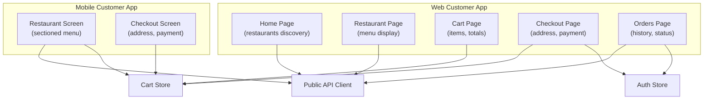
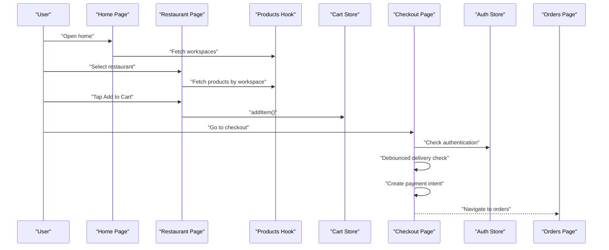
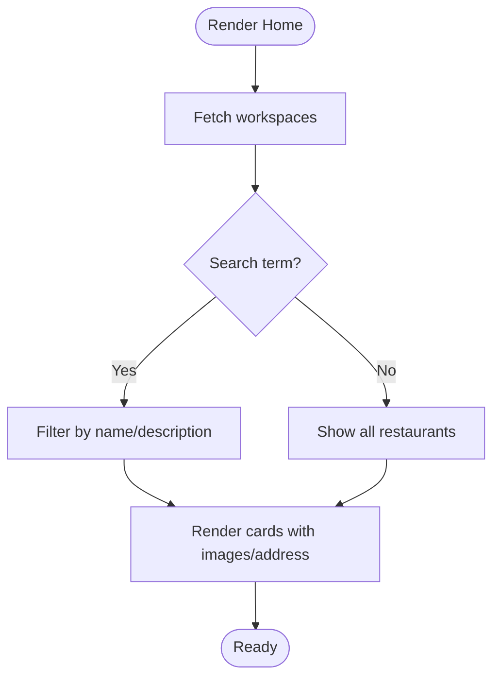
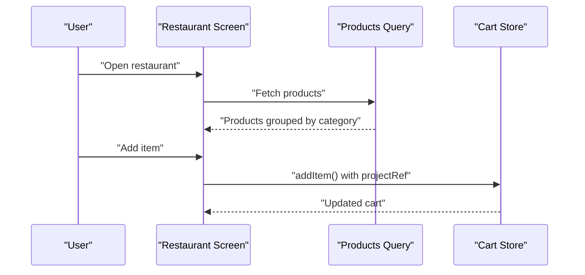
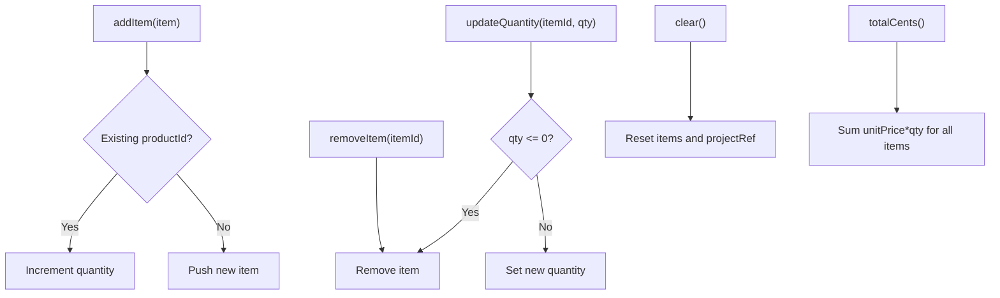
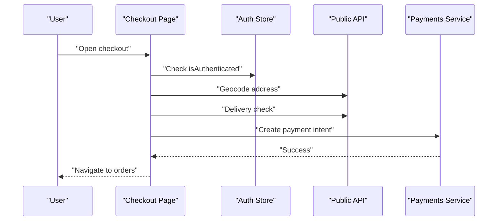
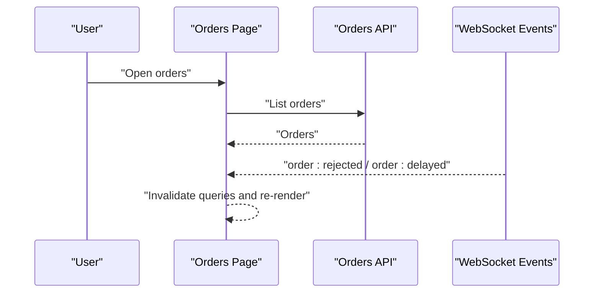
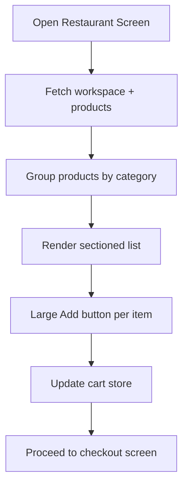
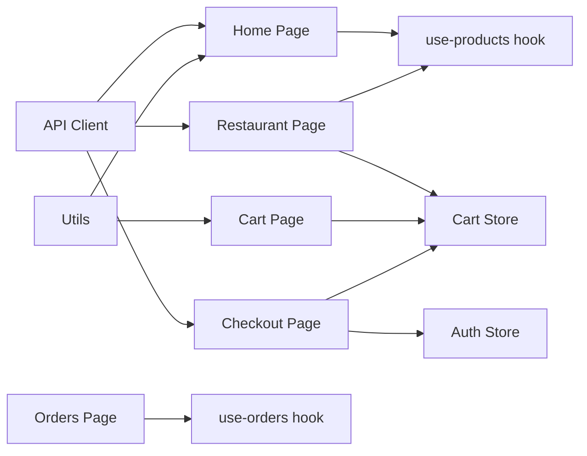

# Shopping Experience

<cite>
**Referenced Files in This Document**
- [apps/customer/src/app/(main)/page.tsx](file://apps/customer/src/app/(main)/page.tsx)
- [apps/customer/src/hooks/use-products.ts](file://apps/customer/src/hooks/use-products.ts)
- [apps/customer/src/lib/api.ts](file://apps/customer/src/lib/api.ts)
- [apps/customer/src/stores/cart-store.ts](file://apps/customer/src/stores/cart-store.ts)
- [apps/customer/src/app/(main)/cart/page.tsx](file://apps/customer/src/app/(main)/cart/page.tsx)
- [apps/customer/src/app/(main)/checkout/page.tsx](file://apps/customer/src/app/(main)/checkout/page.tsx)
- [apps/customer/src/stores/auth-store.ts](file://apps/customer/src/stores/auth-store.ts)
- [apps/customer/src/app/(main)/orders/page.tsx](file://apps/customer/src/app/(main)/orders/page.tsx)
- [apps/customer/src/hooks/use-orders.ts](file://apps/customer/src/hooks/use-orders.ts)
- [apps/customer/src/lib/utils.ts](file://apps/customer/src/lib/utils.ts)
- [apps/customer-mobile/src/app/restaurant/[ref].tsx](file://apps/customer-mobile/src/app/restaurant/[ref].tsx)
- [apps/customer-mobile/src/app/checkout.tsx](file://apps/customer-mobile/src/app/checkout.tsx)
</cite>

## Table of Contents
1. [Introduction](#introduction)
2. [Project Structure](#project-structure)
3. [Core Components](#core-components)
4. [Architecture Overview](#architecture-overview)
5. [Detailed Component Analysis](#detailed-component-analysis)
6. [Dependency Analysis](#dependency-analysis)
7. [Performance Considerations](#performance-considerations)
8. [Troubleshooting Guide](#troubleshooting-guide)
9. [Conclusion](#conclusion)

## Introduction
This document describes the customer shopping experience across web and mobile applications. It covers restaurant discovery and browsing, menu presentation, cart management, checkout and payment processing, and order tracking. It also highlights mobile responsiveness and touch-friendly design patterns used in the customer-facing apps.

## Project Structure
The shopping experience spans two primary frontends:
- Web customer app: Next.js application under apps/customer
- Mobile customer app: Expo React Native application under apps/customer-mobile

Key areas:
- Restaurant discovery and search: homepage and restaurant pages
- Menu display and product selection: product queries and sectioned lists
- Cart management: local state with persistence
- Checkout and payments: address validation, delivery checks, payment intent creation
- Orders: listing and real-time updates via WebSocket events

**Diagram sources**
- [apps/customer/src/app/(main)/page.tsx](file://apps/customer/src/app/(main)/page.tsx#L26-L152)
- [apps/customer/src/hooks/use-products.ts:5-19](file://apps/customer/src/hooks/use-products.ts#L5-L19)
- [apps/customer/src/lib/api.ts:1-11](file://apps/customer/src/lib/api.ts#L1-L11)
- [apps/customer/src/stores/cart-store.ts:28-83](file://apps/customer/src/stores/cart-store.ts#L28-L83)
- [apps/customer/src/app/(main)/cart/page.tsx](file://apps/customer/src/app/(main)/cart/page.tsx#L15-L127)
- [apps/customer/src/app/(main)/checkout/page.tsx](file://apps/customer/src/app/(main)/checkout/page.tsx#L22-L187)
- [apps/customer/src/stores/auth-store.ts:14-48](file://apps/customer/src/stores/auth-store.ts#L14-L48)
- [apps/customer/src/app/(main)/orders/page.tsx](file://apps/customer/src/app/(main)/orders/page.tsx#L18-L87)
- [apps/customer-mobile/src/app/restaurant/[ref].tsx](file://apps/customer-mobile/src/app/restaurant/[ref].tsx#L23-L179)
- [apps/customer-mobile/src/app/checkout.tsx:25-223](file://apps/customer-mobile/src/app/checkout.tsx#L25-L223)

**Section sources**
- [apps/customer/src/app/(main)/page.tsx](file://apps/customer/src/app/(main)/page.tsx#L26-L152)
- [apps/customer/src/hooks/use-products.ts:5-19](file://apps/customer/src/hooks/use-products.ts#L5-L19)
- [apps/customer/src/lib/api.ts:1-11](file://apps/customer/src/lib/api.ts#L1-L11)
- [apps/customer/src/stores/cart-store.ts:28-83](file://apps/customer/src/stores/cart-store.ts#L28-L83)
- [apps/customer/src/app/(main)/cart/page.tsx](file://apps/customer/src/app/(main)/cart/page.tsx#L15-L127)
- [apps/customer/src/app/(main)/checkout/page.tsx](file://apps/customer/src/app/(main)/checkout/page.tsx#L22-L187)
- [apps/customer/src/stores/auth-store.ts:14-48](file://apps/customer/src/stores/auth-store.ts#L14-L48)
- [apps/customer/src/app/(main)/orders/page.tsx](file://apps/customer/src/app/(main)/orders/page.tsx#L18-L87)
- [apps/customer-mobile/src/app/restaurant/[ref].tsx](file://apps/customer-mobile/src/app/restaurant/[ref].tsx#L23-L179)
- [apps/customer-mobile/src/app/checkout.tsx:25-223](file://apps/customer-mobile/src/app/checkout.tsx#L25-L223)

## Core Components
- Restaurant Discovery and Search (Web): Homepage renders a grid of restaurants with search and skeleton loaders, filters by name/description.
- Menu Display (Web and Mobile): Products fetched per workspace, grouped by category for easy scanning.
- Cart Management: Local-first store with persistence, supports add/update/remove/clear, and computes totals.
- Checkout: Validates authentication, collects delivery address, debounced delivery availability check, creates payment intent, and navigates to orders.
- Orders: Lists recent orders and subscribes to real-time status updates via WebSocket events.

**Section sources**
- [apps/customer/src/app/(main)/page.tsx](file://apps/customer/src/app/(main)/page.tsx#L26-L152)
- [apps/customer/src/hooks/use-products.ts:5-19](file://apps/customer/src/hooks/use-products.ts#L5-L19)
- [apps/customer/src/stores/cart-store.ts:28-83](file://apps/customer/src/stores/cart-store.ts#L28-L83)
- [apps/customer/src/app/(main)/checkout/page.tsx](file://apps/customer/src/app/(main)/checkout/page.tsx#L22-L187)
- [apps/customer/src/app/(main)/orders/page.tsx](file://apps/customer/src/app/(main)/orders/page.tsx#L18-L87)

## Architecture Overview
The shopping experience relies on:
- Public API client for workspace and product data, geocoding, delivery checks, and payment intents
- Zustand stores for cart and authentication state
- React Query for caching and fetching
- WebSocket events for live order updates

**Diagram sources**
- [apps/customer/src/app/(main)/page.tsx](file://apps/customer/src/app/(main)/page.tsx#L26-L152)
- [apps/customer/src/hooks/use-products.ts:5-19](file://apps/customer/src/hooks/use-products.ts#L5-L19)
- [apps/customer/src/stores/cart-store.ts:28-83](file://apps/customer/src/stores/cart-store.ts#L28-L83)
- [apps/customer/src/app/(main)/checkout/page.tsx](file://apps/customer/src/app/(main)/checkout/page.tsx#L22-L187)
- [apps/customer/src/stores/auth-store.ts:14-48](file://apps/customer/src/stores/auth-store.ts#L14-L48)
- [apps/customer/src/app/(main)/orders/page.tsx](file://apps/customer/src/app/(main)/orders/page.tsx#L18-L87)

## Detailed Component Analysis

### Restaurant Discovery and Search (Web)
- Fetches multiple workspaces concurrently and flattens results
- Implements client-side search across name and description
- Renders skeleton cards while loading and empty state when none match
- Uses a responsive grid layout and links to restaurant pages

**Diagram sources**
- [apps/customer/src/app/(main)/page.tsx](file://apps/customer/src/app/(main)/page.tsx#L26-L152)

**Section sources**
- [apps/customer/src/app/(main)/page.tsx](file://apps/customer/src/app/(main)/page.tsx#L26-L152)

### Menu Display and Product Selection (Web and Mobile)
- Products are grouped by category and rendered in a sectioned list
- Adds items to cart with a local identifier and sets the restaurant project reference
- Handles cross-restaurant cart clearing with confirmation

**Diagram sources**
- [apps/customer-mobile/src/app/restaurant/[ref].tsx](file://apps/customer-mobile/src/app/restaurant/[ref].tsx#L23-L179)
- [apps/customer/src/hooks/use-products.ts:5-19](file://apps/customer/src/hooks/use-products.ts#L5-L19)
- [apps/customer/src/stores/cart-store.ts:28-83](file://apps/customer/src/stores/cart-store.ts#L28-L83)

**Section sources**
- [apps/customer-mobile/src/app/restaurant/[ref].tsx](file://apps/customer-mobile/src/app/restaurant/[ref].tsx#L23-L179)
- [apps/customer/src/hooks/use-products.ts:5-19](file://apps/customer/src/hooks/use-products.ts#L5-L19)

### Cart Management
- Supports adding items, increasing/decreasing quantities, removing items, and clearing the cart
- Persists cart to local storage and computes totals and item counts
- Enforces single-restaurant constraint; warns and clears when switching restaurants

**Diagram sources**
- [apps/customer/src/stores/cart-store.ts:28-83](file://apps/customer/src/stores/cart-store.ts#L28-L83)

**Section sources**
- [apps/customer/src/stores/cart-store.ts:28-83](file://apps/customer/src/stores/cart-store.ts#L28-L83)
- [apps/customer/src/app/(main)/cart/page.tsx](file://apps/customer/src/app/(main)/cart/page.tsx#L15-L127)

### Checkout Flow and Payment Processing
- Validates authentication and requires a delivery address
- Debounces address input to check delivery eligibility
- Creates a payment intent with metadata and navigates to orders upon success
- Displays subtotal, delivery fee, and total

**Diagram sources**
- [apps/customer/src/app/(main)/checkout/page.tsx](file://apps/customer/src/app/(main)/checkout/page.tsx#L22-L187)
- [apps/customer/src/stores/auth-store.ts:14-48](file://apps/customer/src/stores/auth-store.ts#L14-L48)
- [apps/customer/src/lib/api.ts:1-11](file://apps/customer/src/lib/api.ts#L1-L11)

**Section sources**
- [apps/customer/src/app/(main)/checkout/page.tsx](file://apps/customer/src/app/(main)/checkout/page.tsx#L22-L187)
- [apps/customer/src/stores/auth-store.ts:14-48](file://apps/customer/src/stores/auth-store.ts#L14-L48)
- [apps/customer/src/lib/api.ts:1-11](file://apps/customer/src/lib/api.ts#L1-L11)

### Orders Tracking and Real-Time Updates
- Lists recent orders with status badges and prices
- Subscribes to WebSocket events to refresh order lists and details

**Diagram sources**
- [apps/customer/src/app/(main)/orders/page.tsx](file://apps/customer/src/app/(main)/orders/page.tsx#L18-L87)
- [apps/customer/src/hooks/use-orders.ts:6-45](file://apps/customer/src/hooks/use-orders.ts#L6-L45)

**Section sources**
- [apps/customer/src/app/(main)/orders/page.tsx](file://apps/customer/src/app/(main)/orders/page.tsx#L18-L87)
- [apps/customer/src/hooks/use-orders.ts:6-45](file://apps/customer/src/hooks/use-orders.ts#L6-L45)

### Mobile Responsiveness and Touch-Friendly Design
- Uses SectionList for efficient scrolling and grouped categories
- Large, tappable “Add” buttons with visible feedback
- Sticky section headers, concise typography, and clear affordances
- Debounced delivery checks with loader indicators
- Prominent call-to-action buttons and clear visual hierarchy

**Diagram sources**
- [apps/customer-mobile/src/app/restaurant/[ref].tsx](file://apps/customer-mobile/src/app/restaurant/[ref].tsx#L23-L179)
- [apps/customer-mobile/src/app/checkout.tsx:25-223](file://apps/customer-mobile/src/app/checkout.tsx#L25-L223)

**Section sources**
- [apps/customer-mobile/src/app/restaurant/[ref].tsx](file://apps/customer-mobile/src/app/restaurant/[ref].tsx#L23-L179)
- [apps/customer-mobile/src/app/checkout.tsx:25-223](file://apps/customer-mobile/src/app/checkout.tsx#L25-L223)

## Dependency Analysis
- Components depend on shared hooks and stores for data and state
- API client encapsulates environment-aware base URLs
- Utilities consolidate Tailwind class merging

**Diagram sources**
- [apps/customer/src/app/(main)/page.tsx](file://apps/customer/src/app/(main)/page.tsx#L26-L152)
- [apps/customer/src/hooks/use-products.ts:5-19](file://apps/customer/src/hooks/use-products.ts#L5-L19)
- [apps/customer/src/stores/cart-store.ts:28-83](file://apps/customer/src/stores/cart-store.ts#L28-L83)
- [apps/customer/src/app/(main)/cart/page.tsx](file://apps/customer/src/app/(main)/cart/page.tsx#L15-L127)
- [apps/customer/src/app/(main)/checkout/page.tsx](file://apps/customer/src/app/(main)/checkout/page.tsx#L22-L187)
- [apps/customer/src/stores/auth-store.ts:14-48](file://apps/customer/src/stores/auth-store.ts#L14-L48)
- [apps/customer/src/app/(main)/orders/page.tsx](file://apps/customer/src/app/(main)/orders/page.tsx#L18-L87)
- [apps/customer/src/lib/api.ts:1-11](file://apps/customer/src/lib/api.ts#L1-L11)
- [apps/customer/src/lib/utils.ts:4-6](file://apps/customer/src/lib/utils.ts#L4-L6)

**Section sources**
- [apps/customer/src/lib/api.ts:1-11](file://apps/customer/src/lib/api.ts#L1-L11)
- [apps/customer/src/lib/utils.ts:4-6](file://apps/customer/src/lib/utils.ts#L4-L6)

## Performance Considerations
- Debounced address validation reduces unnecessary geocoding and delivery checks during typing
- Concurrent workspace fetching avoids redundant requests and deduplicates refs
- Local storage persistence prevents cart loss and reduces server round-trips
- Sectioned lists improve scroll performance for long menus
- Skeleton loaders and empty states keep UI responsive while data loads

## Troubleshooting Guide
- Empty cart on checkout: Ensure items were added and cart store is hydrated
- Cross-restaurant warnings: Clearing the cart is required when switching restaurants
- Authentication errors: Users must be logged in to place orders; redirect to login if needed
- Delivery unavailable: Confirm address validity and retry; delivery checks are debounced
- Order not updating: WebSocket events trigger refetch; wait briefly for updates

**Section sources**
- [apps/customer/src/app/(main)/checkout/page.tsx](file://apps/customer/src/app/(main)/checkout/page.tsx#L57-L88)
- [apps/customer-mobile/src/app/restaurant/[ref].tsx](file://apps/customer-mobile/src/app/restaurant/[ref].tsx#L55-L94)
- [apps/customer/src/stores/auth-store.ts:19-34](file://apps/customer/src/stores/auth-store.ts#L19-L34)
- [apps/customer/src/hooks/use-orders.ts:30-42](file://apps/customer/src/hooks/use-orders.ts#L30-L42)

## Conclusion
The shopping experience integrates restaurant discovery, menu browsing, cart management, and checkout with robust state management and real-time updates. The dual web and mobile implementations share core logic while adapting UI patterns for each platform, emphasizing responsiveness and usability.