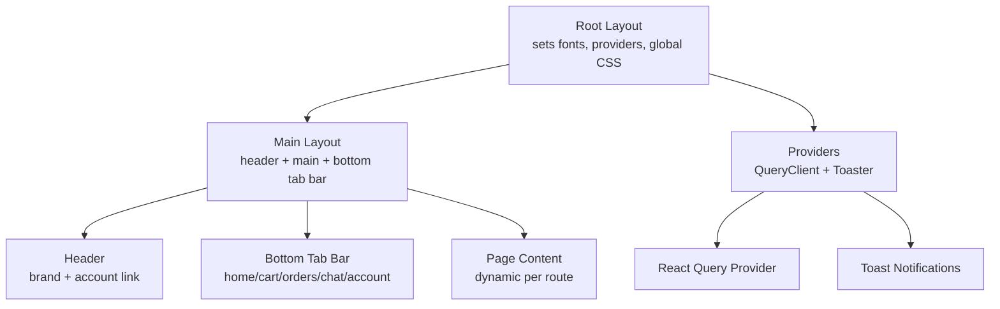
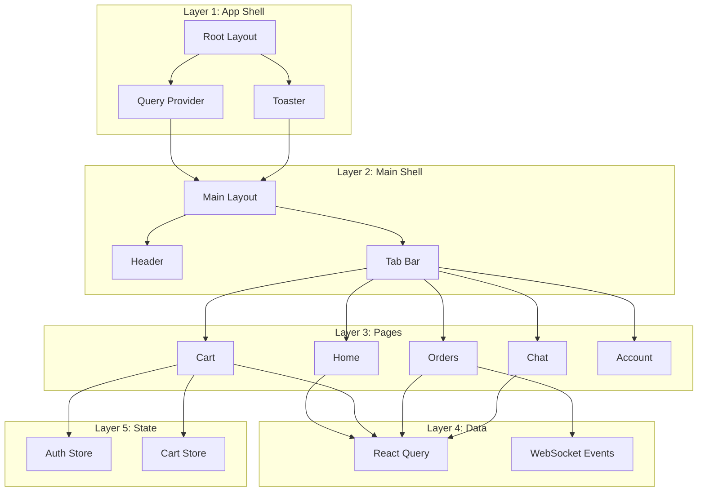
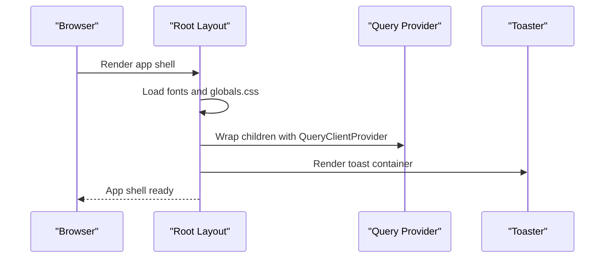
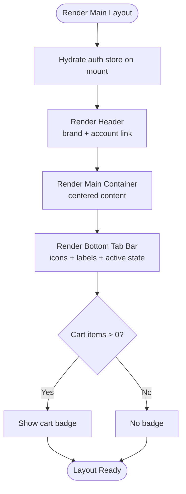
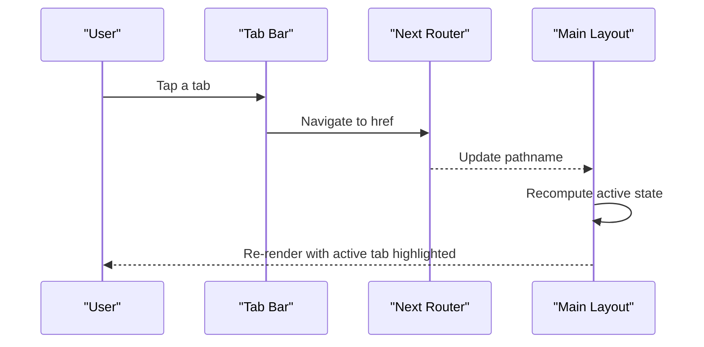
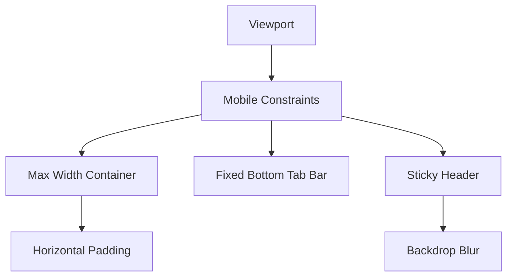
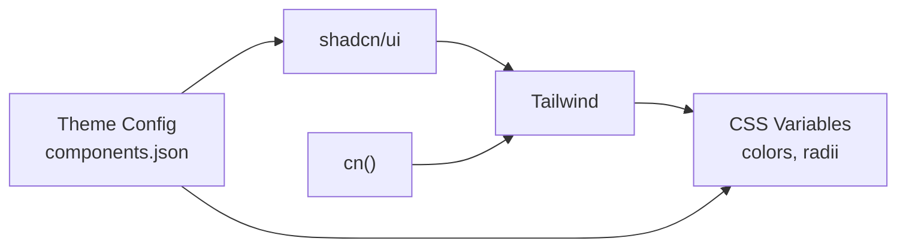
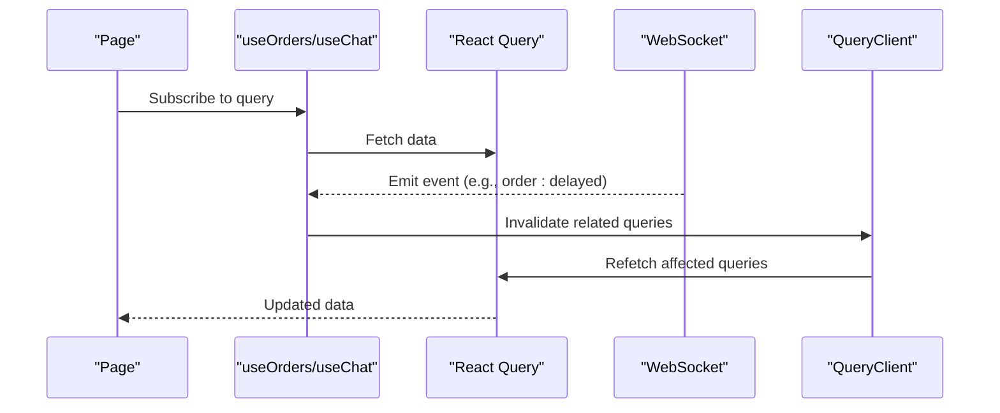
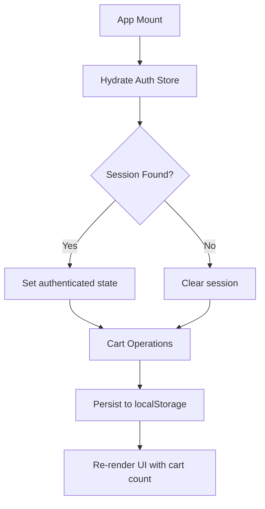
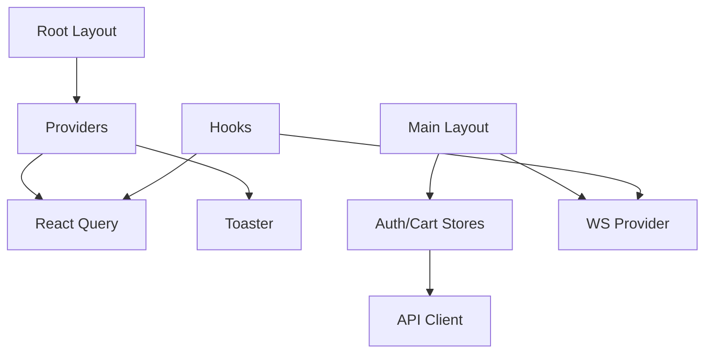

# User Interface & Navigation

<cite>
**Referenced Files in This Document**
- [layout.tsx](file://apps/customer/src/app/layout.tsx)
- [layout.tsx](file://apps/customer/src/app/(main)/layout.tsx)
- [globals.css](file://apps/customer/src/app/globals.css)
- [components.json](file://apps/customer/components.json)
- [query-provider.tsx](file://apps/customer/src/providers/query-provider.tsx)
- [toaster.tsx](file://apps/customer/src/providers/toaster.tsx)
- [auth-store.ts](file://apps/customer/src/stores/auth-store.ts)
- [cart-store.ts](file://apps/customer/src/stores/cart-store.ts)
- [utils.ts](file://apps/customer/src/lib/utils.ts)
- [use-products.ts](file://apps/customer/src/hooks/use-products.ts)
- [use-orders.ts](file://apps/customer/src/hooks/use-orders.ts)
- [use-chat.ts](file://apps/customer/src/hooks/use-chat.ts)
</cite>

## Table of Contents
1. [Introduction](#introduction)
2. [Project Structure](#project-structure)
3. [Core Components](#core-components)
4. [Architecture Overview](#architecture-overview)
5. [Detailed Component Analysis](#detailed-component-analysis)
6. [Dependency Analysis](#dependency-analysis)
7. [Performance Considerations](#performance-considerations)
8. [Troubleshooting Guide](#troubleshooting-guide)
9. [Conclusion](#conclusion)

## Introduction
This document describes the customer application’s user interface and navigation system. It covers the main layout structure, global styling approach, component hierarchy, navigation patterns (including tab-based navigation and route handling), responsive design, and the UI component library usage. It also documents the header and footer components, the overall user experience flow, and provides examples of component composition, prop interfaces, and styling conventions.

## Project Structure
The customer application is a Next.js app that defines:
- A root layout that sets fonts, global CSS, providers, and toast notifications.
- A main layout that wraps page content with a sticky header, a scrollable main area, and a fixed tab bar at the bottom.
- Global styles using Tailwind, shadcn/ui, and a custom theme with CSS variables.
- Providers for data fetching (React Query), real-time updates (WebSocket), and toast notifications.
- Zustand stores for authentication and cart state.
- Shared utilities and hooks for API interactions and UI composition.

**Diagram sources**
- [layout.tsx:15-28](file://apps/customer/src/app/layout.tsx#L15-L28)
- [layout.tsx](file://apps/customer/src/app/(main)/layout.tsx#L20-L104)
- [query-provider.tsx:6-23](file://apps/customer/src/providers/query-provider.tsx#L6-L23)
- [toaster.tsx:6-14](file://apps/customer/src/providers/toaster.tsx#L6-L14)

**Section sources**
- [layout.tsx:1-29](file://apps/customer/src/app/layout.tsx#L1-L29)
- [layout.tsx](file://apps/customer/src/app/(main)/layout.tsx#L1-L105)
- [globals.css:1-131](file://apps/customer/src/app/globals.css#L1-L131)
- [components.json:1-26](file://apps/customer/components.json#L1-L26)

## Core Components
- Root layout: Initializes fonts, global CSS, and providers.
- Main layout: Provides header, main content container, and a bottom tab bar with five destinations.
- Providers: React Query client and toast notifications.
- Stores: Authentication and cart state management.
- Utilities: Tailwind class merging helper.
- Hooks: Data fetching for products, orders, and chat.

Key responsibilities:
- Root layout ensures consistent typography and theme across the app.
- Main layout enforces a mobile-first, bottom-tab navigation pattern with active state indicators and a cart badge.
- Providers enable optimistic UI, caching, and real-time updates.
- Stores keep user session and cart synchronized locally and with the server.

**Section sources**
- [layout.tsx:15-28](file://apps/customer/src/app/layout.tsx#L15-L28)
- [layout.tsx](file://apps/customer/src/app/(main)/layout.tsx#L20-L104)
- [query-provider.tsx:6-23](file://apps/customer/src/providers/query-provider.tsx#L6-L23)
- [toaster.tsx:6-14](file://apps/customer/src/providers/toaster.tsx#L6-L14)
- [auth-store.ts:14-47](file://apps/customer/src/stores/auth-store.ts#L14-L47)
- [cart-store.ts:28-82](file://apps/customer/src/stores/cart-store.ts#L28-L82)
- [utils.ts:4-6](file://apps/customer/src/lib/utils.ts#L4-L6)

## Architecture Overview
The UI architecture follows a layered approach:
- Layer 1: Root layout and providers.
- Layer 2: Main layout with header and bottom tab bar.
- Layer 3: Page-level routes under the main layout.
- Layer 4: Data fetching via React Query and WebSocket events.
- Layer 5: Local state via Zustand stores.

**Diagram sources**
- [layout.tsx:15-28](file://apps/customer/src/app/layout.tsx#L15-L28)
- [layout.tsx](file://apps/customer/src/app/(main)/layout.tsx#L20-L104)
- [query-provider.tsx:6-23](file://apps/customer/src/providers/query-provider.tsx#L6-L23)
- [toaster.tsx:6-14](file://apps/customer/src/providers/toaster.tsx#L6-L14)
- [use-orders.ts:6-45](file://apps/customer/src/hooks/use-orders.ts#L6-L45)
- [use-chat.ts:5-19](file://apps/customer/src/hooks/use-chat.ts#L5-L19)
- [use-products.ts:5-19](file://apps/customer/src/hooks/use-products.ts#L5-L19)
- [auth-store.ts:14-47](file://apps/customer/src/stores/auth-store.ts#L14-L47)
- [cart-store.ts:28-82](file://apps/customer/src/stores/cart-store.ts#L28-L82)

## Detailed Component Analysis

### Root Layout and Providers
- Sets up fonts (Geist Sans and Mono) and applies global CSS.
- Wraps children with a QueryClient provider and a toast provider.
- Ensures a consistent theme via CSS variables and Tailwind configuration.

**Diagram sources**
- [layout.tsx:15-28](file://apps/customer/src/app/layout.tsx#L15-L28)
- [query-provider.tsx:6-23](file://apps/customer/src/providers/query-provider.tsx#L6-L23)
- [toaster.tsx:6-14](file://apps/customer/src/providers/toaster.tsx#L6-L14)

**Section sources**
- [layout.tsx:15-28](file://apps/customer/src/app/layout.tsx#L15-L28)
- [query-provider.tsx:6-23](file://apps/customer/src/providers/query-provider.tsx#L6-L23)
- [toaster.tsx:6-14](file://apps/customer/src/providers/toaster.tsx#L6-L14)

### Main Layout: Header, Main Content, and Bottom Tab Bar
- Header: Sticky, backdrop-blur, brand identity, and an account link that highlights when active.
- Main: Centered content inside a max-width container with padding.
- Bottom Tab Bar: Fixed at the bottom with five icons and labels, active state detection, and a cart badge when items are present.

**Diagram sources**
- [layout.tsx](file://apps/customer/src/app/(main)/layout.tsx#L20-L104)
- [cart-store.ts:77-78](file://apps/customer/src/stores/cart-store.ts#L77-L78)

**Section sources**
- [layout.tsx](file://apps/customer/src/app/(main)/layout.tsx#L20-L104)
- [cart-store.ts:28-82](file://apps/customer/src/stores/cart-store.ts#L28-L82)

### Navigation Patterns: Route Handling and Active States
- Uses Next.js routing with dynamic segments and named groups.
- Active tab detection compares current path with each tab’s href, with special handling for the home route.
- Cart badge updates reactively from the cart store.

**Diagram sources**
- [layout.tsx](file://apps/customer/src/app/(main)/layout.tsx#L70-L96)

**Section sources**
- [layout.tsx](file://apps/customer/src/app/(main)/layout.tsx#L70-L96)

### Responsive Design Implementation
- Mobile-first layout with a fixed bottom tab bar.
- Max-width constrained content with horizontal padding.
- Sticky header with backdrop blur for readability on scroll.
- CSS variables and Tailwind utilities ensure consistent spacing and typography.

**Diagram sources**
- [layout.tsx](file://apps/customer/src/app/(main)/layout.tsx#L37-L68)
- [layout.tsx](file://apps/customer/src/app/(main)/layout.tsx#L68-L99)
- [globals.css:121-131](file://apps/customer/src/app/globals.css#L121-L131)

**Section sources**
- [layout.tsx](file://apps/customer/src/app/(main)/layout.tsx#L37-L99)
- [globals.css:121-131](file://apps/customer/src/app/globals.css#L121-L131)

### UI Component Library Usage and Styling Conventions
- Tailwind CSS with CSS variables for theme tokens.
- shadcn/ui configured with a base style and Lucide icons.
- Utility class merging via a shared cn function.
- Theme toggling handled via CSS custom properties and a dark variant.

**Diagram sources**
- [globals.css:9-50](file://apps/customer/src/app/globals.css#L9-L50)
- [components.json:6-13](file://apps/customer/components.json#L6-L13)
- [utils.ts:4-6](file://apps/customer/src/lib/utils.ts#L4-L6)

**Section sources**
- [globals.css:1-131](file://apps/customer/src/app/globals.css#L1-L131)
- [components.json:1-26](file://apps/customer/components.json#L1-L26)
- [utils.ts:4-6](file://apps/customer/src/lib/utils.ts#L4-L6)

### Data Fetching and Real-Time Updates
- React Query manages caching, retries, and refetch intervals.
- WebSocket events invalidate relevant queries to keep UI fresh.
- Example hooks:
  - Products and workspace queries.
  - Orders list and single order with periodic refresh.
  - Conversations and messages with polling.

**Diagram sources**
- [use-orders.ts:6-45](file://apps/customer/src/hooks/use-orders.ts#L6-L45)
- [use-chat.ts:5-19](file://apps/customer/src/hooks/use-chat.ts#L5-L19)
- [query-provider.tsx:6-23](file://apps/customer/src/providers/query-provider.tsx#L6-L23)

**Section sources**
- [use-products.ts:5-19](file://apps/customer/src/hooks/use-products.ts#L5-L19)
- [use-orders.ts:6-45](file://apps/customer/src/hooks/use-orders.ts#L6-L45)
- [use-chat.ts:5-19](file://apps/customer/src/hooks/use-chat.ts#L5-L19)
- [query-provider.tsx:6-23](file://apps/customer/src/providers/query-provider.tsx#L6-L23)

### State Management: Authentication and Cart
- Authentication store hydrates session on mount and exposes helpers to update or log out.
- Cart store persists items to local storage, supports add/update/remove/clear, and computes totals and counts.

**Diagram sources**
- [auth-store.ts:19-46](file://apps/customer/src/stores/auth-store.ts#L19-L46)
- [cart-store.ts:37-78](file://apps/customer/src/stores/cart-store.ts#L37-L78)

**Section sources**
- [auth-store.ts:14-47](file://apps/customer/src/stores/auth-store.ts#L14-L47)
- [cart-store.ts:28-82](file://apps/customer/src/stores/cart-store.ts#L28-L82)

## Dependency Analysis
- Root layout depends on providers and global CSS.
- Main layout depends on:
  - Navigation utilities (pathname).
  - Icons from Lucide.
  - Stores for hydration and cart count.
  - WebSocket provider for real-time updates.
- Providers depend on external libraries (React Query, Sonner).
- Stores depend on the API client and local storage.
- Hooks depend on React Query and the API client.

**Diagram sources**
- [layout.tsx:15-28](file://apps/customer/src/app/layout.tsx#L15-L28)
- [layout.tsx](file://apps/customer/src/app/(main)/layout.tsx#L20-L104)
- [query-provider.tsx:6-23](file://apps/customer/src/providers/query-provider.tsx#L6-L23)
- [toaster.tsx:6-14](file://apps/customer/src/providers/toaster.tsx#L6-L14)
- [use-orders.ts:6-45](file://apps/customer/src/hooks/use-orders.ts#L6-L45)
- [use-chat.ts:5-19](file://apps/customer/src/hooks/use-chat.ts#L5-L19)
- [auth-store.ts:14-47](file://apps/customer/src/stores/auth-store.ts#L14-L47)
- [cart-store.ts:28-82](file://apps/customer/src/stores/cart-store.ts#L28-L82)

**Section sources**
- [layout.tsx](file://apps/customer/src/app/(main)/layout.tsx#L20-L104)
- [query-provider.tsx:6-23](file://apps/customer/src/providers/query-provider.tsx#L6-L23)
- [use-orders.ts:6-45](file://apps/customer/src/hooks/use-orders.ts#L6-L45)
- [use-chat.ts:5-19](file://apps/customer/src/hooks/use-chat.ts#L5-L19)
- [auth-store.ts:14-47](file://apps/customer/src/stores/auth-store.ts#L14-L47)
- [cart-store.ts:28-82](file://apps/customer/src/stores/cart-store.ts#L28-L82)

## Performance Considerations
- Caching and staleTime reduce redundant network requests.
- Local persistence for the cart avoids repeated server fetches.
- Backdrop blur and minimal re-renders improve perceived performance.
- Polling intervals for messages and order updates should be tuned to balance freshness and battery/network usage.

[No sources needed since this section provides general guidance]

## Troubleshooting Guide
- If tabs appear inactive, verify the active detection logic and ensure the href matches the current path.
- If cart badge does not show, confirm the cart store’s item count and that the tab bar reads it.
- If toasts do not appear, check the mounted state initialization in the toast provider.
- If data does not refresh, confirm WebSocket events and query invalidation logic.

**Section sources**
- [layout.tsx](file://apps/customer/src/app/(main)/layout.tsx#L70-L96)
- [cart-store.ts:77-78](file://apps/customer/src/stores/cart-store.ts#L77-L78)
- [toaster.tsx:6-14](file://apps/customer/src/providers/toaster.tsx#L6-L14)
- [use-orders.ts:30-42](file://apps/customer/src/hooks/use-orders.ts#L30-L42)

## Conclusion
The customer application employs a clean, mobile-first UI with a fixed bottom tab bar, a sticky header, and a centered content area. It leverages a robust provider stack (React Query, WebSocket, and toast notifications), a consistent theme via Tailwind and CSS variables, and local state management for authentication and cart. The navigation is straightforward and responsive, with clear active states and contextual indicators like the cart badge. The hooks and stores encapsulate data fetching and state updates, enabling a smooth user experience across routes.