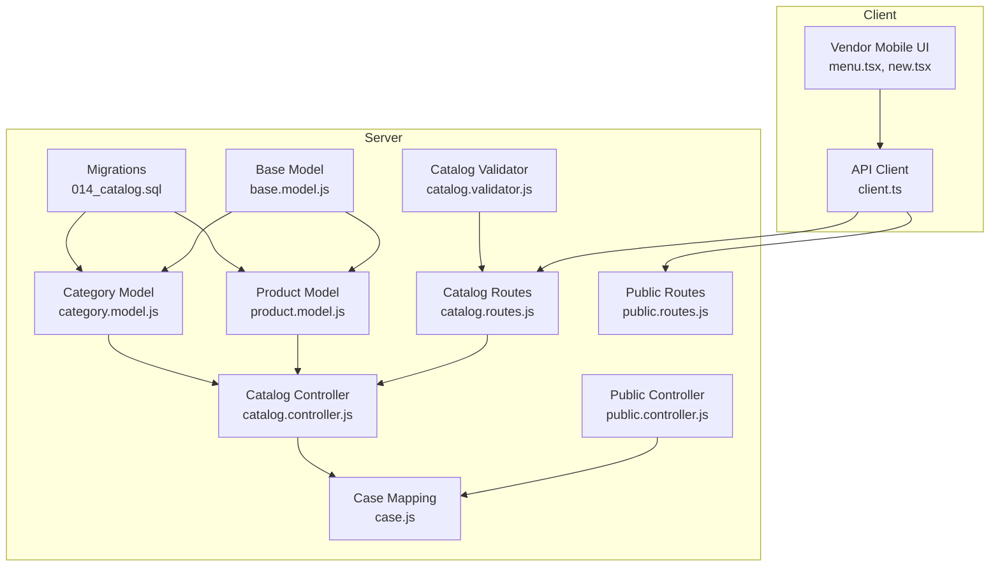
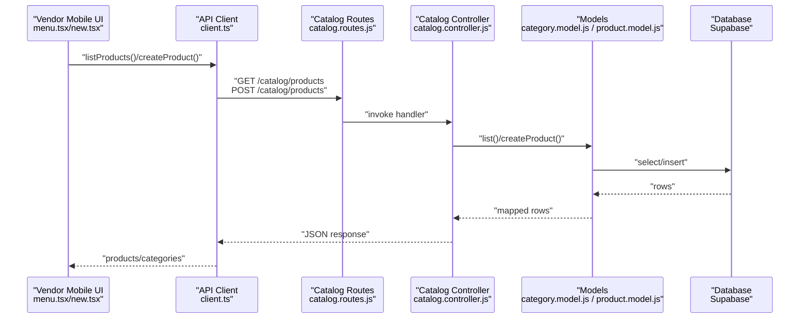
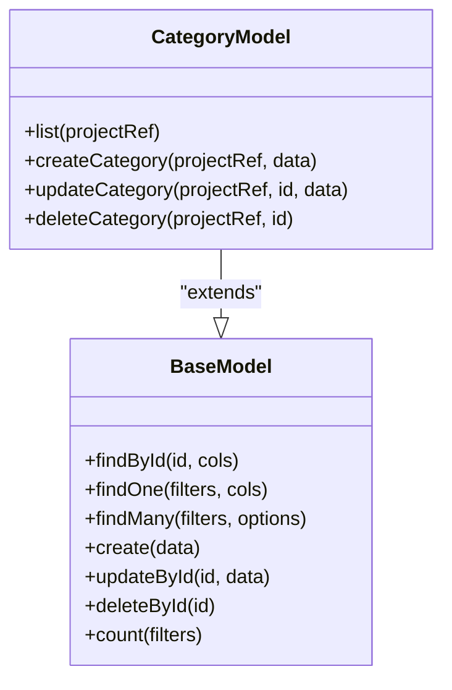
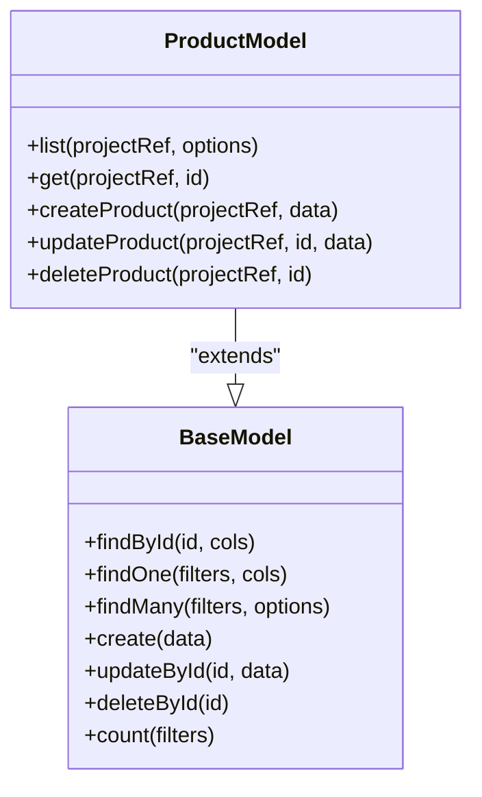
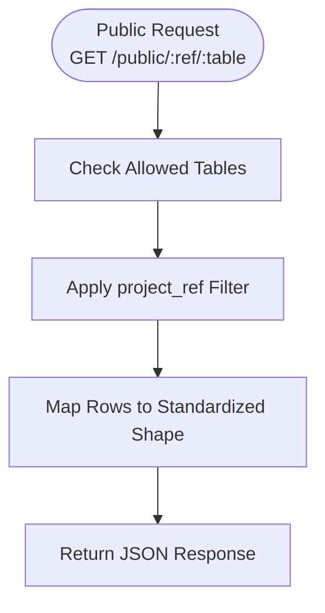
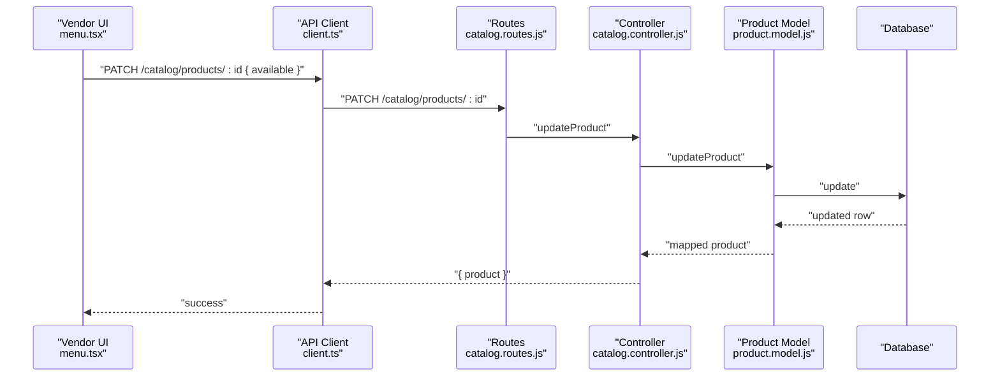
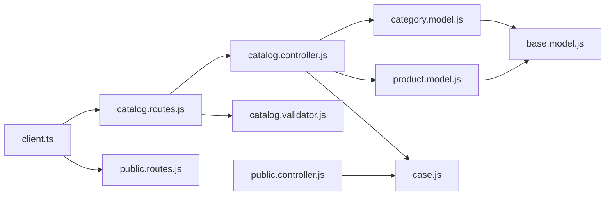

# Catalog Management

<cite>
**Referenced Files in This Document**
- [014_catalog.sql](file://apps/server/migrations/014_catalog.sql)
- [category.model.js](file://apps/server/models/category.model.js)
- [product.model.js](file://apps/server/models/product.model.js)
- [base.model.js](file://apps/server/models/base.model.js)
- [catalog.controller.js](file://apps/server/controllers/catalog.controller.js)
- [catalog.routes.js](file://apps/server/routes/catalog.routes.js)
- [catalog.validator.js](file://apps/server/validators/catalog.validator.js)
- [case.js](file://apps/server/lib/case.js)
- [public.controller.js](file://apps/server/controllers/public.controller.js)
- [public.routes.js](file://apps/server/routes/public.routes.js)
- [client.ts](file://packages/api/src/client.ts)
- [menu.tsx](file://apps/vendor-mobile/src/app/(tabs)/menu.tsx)
- [new.tsx](file://apps/vendor-mobile/src/app/product/new.tsx)
- [000_core_schema.sql](file://apps/server/migrations/000_core_schema.sql)
</cite>

## Table of Contents
1. [Introduction](#introduction)
2. [Project Structure](#project-structure)
3. [Core Components](#core-components)
4. [Architecture Overview](#architecture-overview)
5. [Detailed Component Analysis](#detailed-component-analysis)
6. [Dependency Analysis](#dependency-analysis)
7. [Performance Considerations](#performance-considerations)
8. [Troubleshooting Guide](#troubleshooting-guide)
9. [Conclusion](#conclusion)
10. [Appendices](#appendices)

## Introduction
This document provides comprehensive data model documentation for the catalog management system. It covers the Categories and Products tables, their relationships, workspace associations, and the APIs used to manage them. It also documents product visibility controls, filtering capabilities, and how the catalog is exposed to the public via the public API. Where applicable, it outlines lifecycle management, performance considerations, and operational guidance derived from the repository’s code and migrations.

## Project Structure
The catalog management system spans database migrations, models, controllers, routes, validators, and client libraries. The relevant components are organized by domain and responsibility:

- Database schema: migration files define the canonical schema for categories and products.
- Models: encapsulate CRUD operations against the database.
- Controllers: orchestrate request handling and response mapping.
- Routes: expose REST endpoints with authentication and validation.
- Validators: enforce input constraints for create/update operations.
- Public API: exposes selected catalog data to clients via a controlled public endpoint.
- Client library: defines the API surface for catalog operations.
- Frontend consumers: mobile applications consume the catalog APIs.

**Diagram sources**
- [014_catalog.sql:1-34](file://apps/server/migrations/014_catalog.sql#L1-L34)
- [category.model.js:1-50](file://apps/server/models/category.model.js#L1-L50)
- [product.model.js:1-67](file://apps/server/models/product.model.js#L1-L67)
- [base.model.js:1-55](file://apps/server/models/base.model.js#L1-L55)
- [catalog.controller.js:1-99](file://apps/server/controllers/catalog.controller.js#L1-L99)
- [catalog.routes.js:1-28](file://apps/server/routes/catalog.routes.js#L1-L28)
- [catalog.validator.js:1-42](file://apps/server/validators/catalog.validator.js#L1-L42)
- [case.js:1-52](file://apps/server/lib/case.js#L1-L52)
- [public.controller.js:1-109](file://apps/server/controllers/public.controller.js#L1-L109)
- [public.routes.js:1-14](file://apps/server/routes/public.routes.js#L1-L14)
- [client.ts:172-206](file://packages/api/src/client.ts#L172-L206)
- [menu.tsx](file://apps/vendor-mobile/src/app/(tabs)/menu.tsx#L1-L76)
- [new.tsx:1-68](file://apps/vendor-mobile/src/app/product/new.tsx#L1-L68)

**Section sources**
- [014_catalog.sql:1-34](file://apps/server/migrations/014_catalog.sql#L1-L34)
- [catalog.controller.js:1-99](file://apps/server/controllers/catalog.controller.js#L1-L99)
- [catalog.routes.js:1-28](file://apps/server/routes/catalog.routes.js#L1-L28)
- [catalog.validator.js:1-42](file://apps/server/validators/catalog.validator.js#L1-L42)
- [case.js:1-52](file://apps/server/lib/case.js#L1-L52)
- [public.controller.js:1-109](file://apps/server/controllers/public.controller.js#L1-L109)
- [public.routes.js:1-14](file://apps/server/routes/public.routes.js#L1-L14)
- [client.ts:172-206](file://packages/api/src/client.ts#L172-L206)
- [menu.tsx](file://apps/vendor-mobile/src/app/(tabs)/menu.tsx#L1-L76)
- [new.tsx:1-68](file://apps/vendor-mobile/src/app/product/new.tsx#L1-L68)

## Core Components
This section documents the core data structures and their relationships, focusing on Categories and Products, and how they connect to workspaces and the public API.

- Categories table
  - Purpose: Organize products into logical groupings per workspace (project reference).
  - Key attributes: identifier, project reference, name, sort order, timestamps.
  - Indexes: project reference, unique constraint on project reference and name.
  - Behavior: Ordered by sort order and name for consistent presentation.

- Products table
  - Purpose: Store product definitions, pricing, availability, and display metadata.
  - Key attributes: identifier, project reference, name, description, price in cents, category reference, image URL, availability flag, sort order, timestamps.
  - Indexes: project reference, project reference with availability, project reference with category.
  - Behavior: Supports listing with optional inclusion of unavailable items; ordered by sort order and creation date.

- Relationship
  - Products reference categories by name (stored as text). There is no foreign key enforcement at the database level; referential integrity is application-managed.

- Workspace association
  - Both categories and products are scoped by project_ref, aligning with the workspaces table definition. This ensures catalog data is isolated per workspace.

- Public exposure
  - The public API exposes categories and products via a controlled endpoint, enabling clients to fetch catalog data for a given workspace reference.

**Section sources**
- [014_catalog.sql:4-11](file://apps/server/migrations/014_catalog.sql#L4-L11)
- [014_catalog.sql:16-28](file://apps/server/migrations/014_catalog.sql#L16-L28)
- [000_core_schema.sql:37-52](file://apps/server/migrations/000_core_schema.sql#L37-L52)
- [public.controller.js:20-51](file://apps/server/controllers/public.controller.js#L20-L51)

## Architecture Overview
The catalog management architecture follows a layered pattern:

- Presentation: Vendor mobile app consumes catalog APIs via the client library.
- Routing: Express routes handle requests and apply middleware for authentication, role checks, and project reference attachment.
- Validation: Zod schemas validate request payloads for create/update operations.
- Control: Controllers coordinate model operations and map results to standardized shapes.
- Persistence: Models encapsulate database operations using shared helpers.
- Data: Migrations define canonical schema and indexes.

**Diagram sources**
- [menu.tsx](file://apps/vendor-mobile/src/app/(tabs)/menu.tsx#L28-L38)
- [new.tsx:32-51](file://apps/vendor-mobile/src/app/product/new.tsx#L32-L51)
- [client.ts:172-206](file://packages/api/src/client.ts#L172-L206)
- [catalog.routes.js:14-24](file://apps/server/routes/catalog.routes.js#L14-L24)
- [catalog.controller.js:47-97](file://apps/server/controllers/catalog.controller.js#L47-L97)
- [category.model.js:12-31](file://apps/server/models/category.model.js#L12-L31)
- [product.model.js:12-43](file://apps/server/models/product.model.js#L12-L43)

## Detailed Component Analysis

### Categories Data Model
- Schema highlights
  - Identifier, project reference, name, sort order, timestamps.
  - Unique constraint on (project_ref, name) prevents duplicates within a workspace.
  - Index on project_ref supports efficient workspace-scoped queries.
- Lifecycle operations
  - List: Returns categories sorted by sort_order and name.
  - Create: Generates a UUID, sets timestamps, persists row.
  - Update: Allows partial updates to name and sort order; updates modified timestamp.
  - Delete: Removes by id and project reference.
- Validation
  - Name length limits and sort order range enforced by validator schema.

**Diagram sources**
- [category.model.js:7-46](file://apps/server/models/category.model.js#L7-L46)
- [base.model.js:9-52](file://apps/server/models/base.model.js#L9-L52)

**Section sources**
- [014_catalog.sql:4-11](file://apps/server/migrations/014_catalog.sql#L4-L11)
- [category.model.js:12-45](file://apps/server/models/category.model.js#L12-L45)
- [catalog.validator.js:5-13](file://apps/server/validators/catalog.validator.js#L5-L13)
- [case.js:20-30](file://apps/server/lib/case.js#L20-L30)

### Products Data Model
- Schema highlights
  - Identifier, project reference, name, description, price in cents, category name, image URL, availability flag, sort order, timestamps.
  - Indexes on project_ref, (project_ref, available), and (project_ref, category) support filtering and faceting.
- Lifecycle operations
  - List: Supports inclusion/exclusion of unavailable items; sorts by sort_order then by created_at desc.
  - Get: Retrieves a single product by id and project reference.
  - Create: Generates UUID, normalizes fields, sets timestamps.
  - Update: Supports partial updates including price, category, image, availability, sort order; updates modified timestamp.
  - Delete: Removes by id and project reference.
- Validation
  - Enforces name length, price range, optional nullable fields, and sort order bounds.

**Diagram sources**
- [product.model.js:7-63](file://apps/server/models/product.model.js#L7-L63)
- [base.model.js:9-52](file://apps/server/models/base.model.js#L9-L52)

**Section sources**
- [014_catalog.sql:16-28](file://apps/server/migrations/014_catalog.sql#L16-L28)
- [product.model.js:12-62](file://apps/server/models/product.model.js#L12-L62)
- [catalog.validator.js:15-33](file://apps/server/validators/catalog.validator.js#L15-L33)
- [case.js:3-18](file://apps/server/lib/case.js#L3-L18)

### Category-Product Relationship and Catalog Visibility
- Relationship semantics
  - Products reference categories by storing the category name as text. No foreign key constraint exists; referential integrity is application-managed.
  - Ordering: Categories are ordered by sort_order and name; products are ordered by sort_order and created_at.
- Catalog visibility
  - Public API exposes categories and products via a public endpoint filtered by project_ref.
  - The public controller maps rows to standardized shapes and restricts access to allowed tables.

**Diagram sources**
- [public.controller.js:20-51](file://apps/server/controllers/public.controller.js#L20-L51)
- [case.js:3-18](file://apps/server/lib/case.js#L3-L18)

**Section sources**
- [public.controller.js:20-51](file://apps/server/controllers/public.controller.js#L20-L51)
- [case.js:3-18](file://apps/server/lib/case.js#L3-L18)

### Product Variations and Catalog Synchronization
- Variations
  - The current schema does not define a dedicated variations table or explicit variation fields on products. Variants would typically be modeled as separate product records linked by a parent identifier or a dedicated variations table. No such schema exists in the repository.
- Synchronization across workspaces
  - Catalog data is scoped by project_ref. There is no cross-workspace synchronization mechanism defined in the repository; each workspace maintains its own categories and products.

**Section sources**
- [014_catalog.sql:4-28](file://apps/server/migrations/014_catalog.sql#L4-L28)
- [000_core_schema.sql:37-52](file://apps/server/migrations/000_core_schema.sql#L37-L52)

### Product Search Indexing and Filtering
- Indexes
  - Categories: project_ref, unique (project_ref, name).
  - Products: project_ref, (project_ref, available), (project_ref, category).
- Filtering capabilities
  - Workspace scoping via project_ref.
  - Availability filtering via (project_ref, available).
  - Category filtering via (project_ref, category).
  - Sorting: categories by sort_order, name; products by sort_order, created_at.
- Search indexing
  - No dedicated search index (e.g., full-text) is defined in the repository. Free-text search would require additional indexes or external search infrastructure.

**Section sources**
- [014_catalog.sql:13-32](file://apps/server/migrations/014_catalog.sql#L13-L32)
- [product.model.js:12-18](file://apps/server/models/product.model.js#L12-L18)

### Product Lifecycle Management
- Creation
  - UUID generation, normalization of optional fields, default availability and sort order, timestamps.
- Updates
  - Partial updates supported; availability toggles are exposed via the vendor UI.
- Deletion
  - Soft deletion is not implemented; deletion removes records from the database.
- Availability flags
  - Products include an availability flag; the vendor UI exposes a switch to toggle availability.

**Diagram sources**
- [menu.tsx](file://apps/vendor-mobile/src/app/(tabs)/menu.tsx#L43-L48)
- [client.ts:186-195](file://packages/api/src/client.ts#L186-L195)
- [catalog.routes.js:22-24](file://apps/server/routes/catalog.routes.js#L22-L24)
- [catalog.controller.js:66-76](file://apps/server/controllers/catalog.controller.js#L66-L76)
- [product.model.js:45-58](file://apps/server/models/product.model.js#L45-L58)

**Section sources**
- [product.model.js:26-58](file://apps/server/models/product.model.js#L26-L58)
- [catalog.controller.js:66-76](file://apps/server/controllers/catalog.controller.js#L66-L76)
- [menu.tsx](file://apps/vendor-mobile/src/app/(tabs)/menu.tsx#L43-L48)

### Pricing Updates and Catalog Analytics
- Pricing updates
  - Products store price in cents; updates are supported via the updateProduct operation.
- Analytics
  - No built-in analytics tables or aggregation endpoints are present in the repository. Analytics would require additional metrics tables and reporting endpoints.

**Section sources**
- [014_catalog.sql](file://apps/server/migrations/014_catalog.sql#L21)
- [product.model.js:49-52](file://apps/server/models/product.model.js#L49-L52)

### Recommendations, Seasonal Availability, and Performance Optimization
- Recommendations
  - No recommendation engine or related tables are defined in the repository.
- Seasonal availability
  - No seasonality fields or scheduling logic are present in the repository.
- Performance optimization
  - Indexes on project_ref, (project_ref, available), and (project_ref, category) are defined to support filtering and sorting.
  - The product listing endpoint supports an includeUnavailable query parameter to reduce result size by excluding unavailable items.

**Section sources**
- [014_catalog.sql:13-32](file://apps/server/migrations/014_catalog.sql#L13-L32)
- [catalog.controller.js](file://apps/server/controllers/catalog.controller.js#L49)

## Dependency Analysis
The following diagram shows key dependencies among components involved in catalog management:

**Diagram sources**
- [category.model.js:1-50](file://apps/server/models/category.model.js#L1-L50)
- [product.model.js:1-67](file://apps/server/models/product.model.js#L1-L67)
- [base.model.js:1-55](file://apps/server/models/base.model.js#L1-L55)
- [catalog.controller.js:1-99](file://apps/server/controllers/catalog.controller.js#L1-L99)
- [catalog.routes.js:1-28](file://apps/server/routes/catalog.routes.js#L1-L28)
- [catalog.validator.js:1-42](file://apps/server/validators/catalog.validator.js#L1-L42)
- [case.js:1-52](file://apps/server/lib/case.js#L1-L52)
- [public.controller.js:1-109](file://apps/server/controllers/public.controller.js#L1-L109)
- [public.routes.js:1-14](file://apps/server/routes/public.routes.js#L1-L14)
- [client.ts:172-206](file://packages/api/src/client.ts#L172-L206)

**Section sources**
- [catalog.controller.js:1-99](file://apps/server/controllers/catalog.controller.js#L1-L99)
- [catalog.routes.js:1-28](file://apps/server/routes/catalog.routes.js#L1-L28)
- [catalog.validator.js:1-42](file://apps/server/validators/catalog.validator.js#L1-L42)
- [case.js:1-52](file://apps/server/lib/case.js#L1-L52)
- [public.controller.js:1-109](file://apps/server/controllers/public.controller.js#L1-L109)
- [public.routes.js:1-14](file://apps/server/routes/public.routes.js#L1-L14)
- [client.ts:172-206](file://packages/api/src/client.ts#L172-L206)

## Performance Considerations
- Index utilization
  - Use project_ref-scoped queries to leverage indexes on categories and products.
  - Prefer filtering by available and category to benefit from composite indexes.
- Query patterns
  - The product listing endpoint supports includeUnavailable=false to minimize result size.
  - Sorting by sort_order and created_at reduces UI rendering overhead.
- Scalability
  - Consider adding full-text search indexes or external search infrastructure for improved product discovery.
  - Monitor query performance on high-volume workspaces and adjust indexes accordingly.

[No sources needed since this section provides general guidance]

## Troubleshooting Guide
- Common errors
  - Not found: Updating a product that does not exist returns a not-found error.
  - Validation failures: Requests violating validator schemas are rejected before reaching models.
  - Access control: Catalog endpoints require vendor or admin roles and a valid project reference.
- Diagnostics
  - Verify project_ref is attached and required by middleware.
  - Confirm validator schemas match payload expectations.
  - Check mapped fields in case.js to ensure consistent field names across layers.

**Section sources**
- [catalog.controller.js:69-71](file://apps/server/controllers/catalog.controller.js#L69-L71)
- [catalog.validator.js:1-42](file://apps/server/validators/catalog.validator.js#L1-L42)
- [catalog.routes.js](file://apps/server/routes/catalog.routes.js#L12)

## Conclusion
The catalog management system provides a clean, workspace-scoped schema for categories and products with straightforward CRUD operations, validation, and public exposure. While the current design supports essential catalog management tasks, advanced features such as product variations, cross-workspace synchronization, search indexing, recommendations, and analytics are not present in the repository and would require additional schema and implementation work.

## Appendices

### API Surface Summary
- Catalog endpoints (vendor/admin only)
  - GET /catalog/categories
  - POST /catalog/categories
  - PATCH /catalog/categories/:id
  - DELETE /catalog/categories/:id
  - GET /catalog/products
  - POST /catalog/products
  - PATCH /catalog/products/:id
  - DELETE /catalog/products/:id
- Public endpoints
  - GET /public/:ref/:table (allowed tables: products, categories, menus, workspaces, orders, deliveries)
  - GET /public/:ref/delivery-check?lat=&lon=
  - GET /public/geocode?address=

**Section sources**
- [client.ts:172-206](file://packages/api/src/client.ts#L172-L206)
- [catalog.routes.js:14-24](file://apps/server/routes/catalog.routes.js#L14-L24)
- [public.routes.js:8-11](file://apps/server/routes/public.routes.js#L8-L11)
- [public.controller.js:20-51](file://apps/server/controllers/public.controller.js#L20-L51)