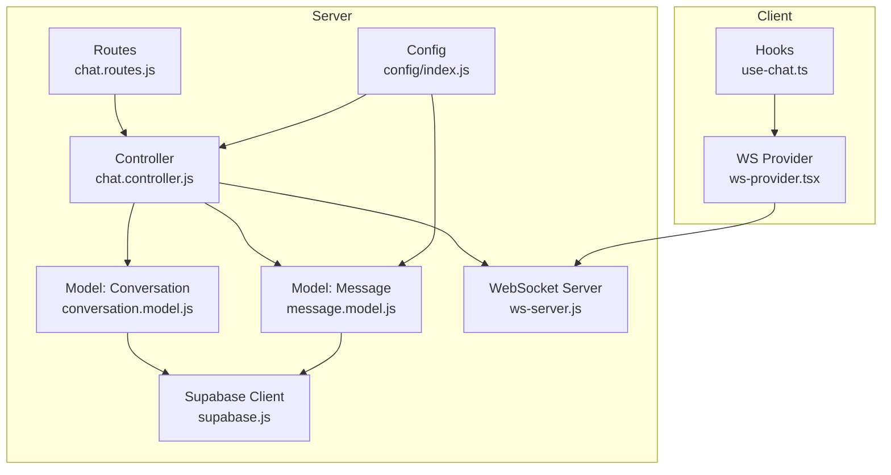
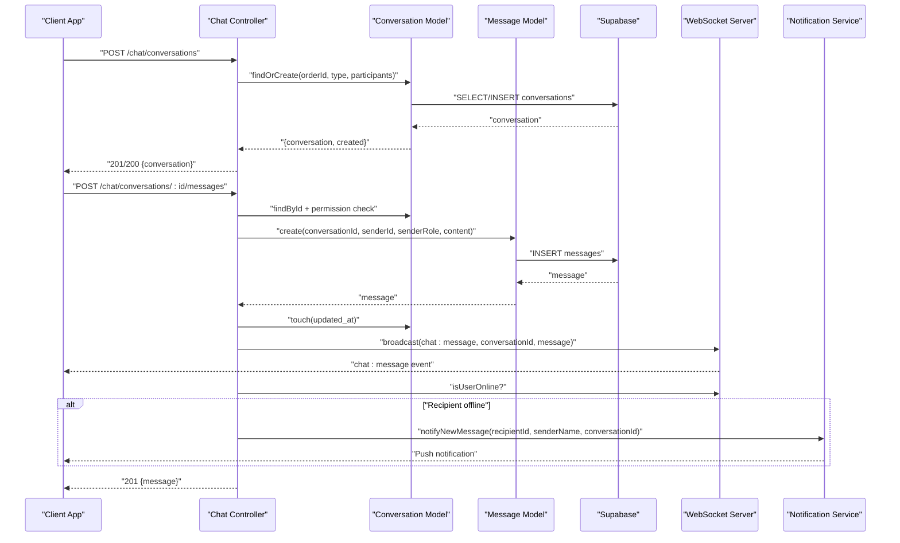
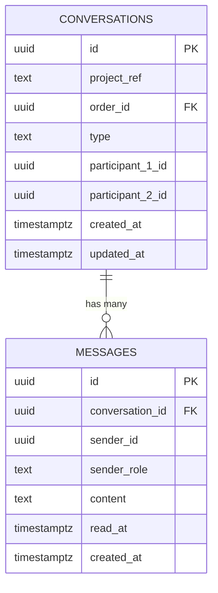
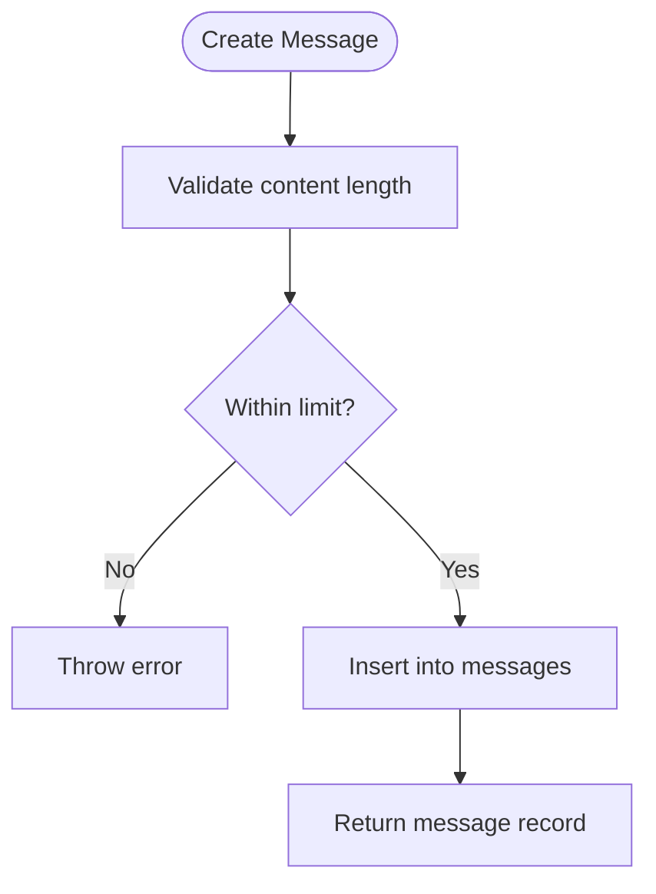
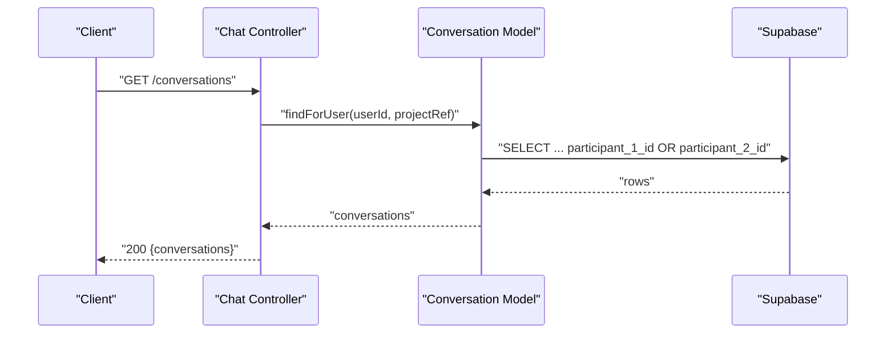
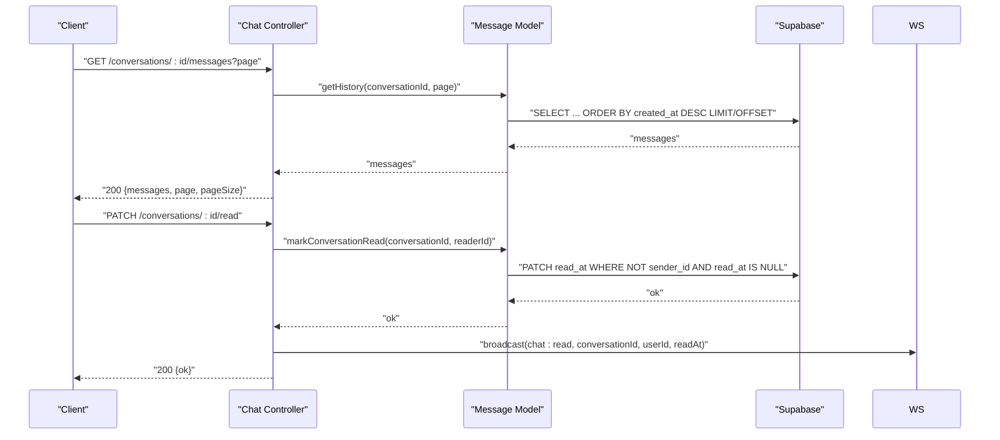
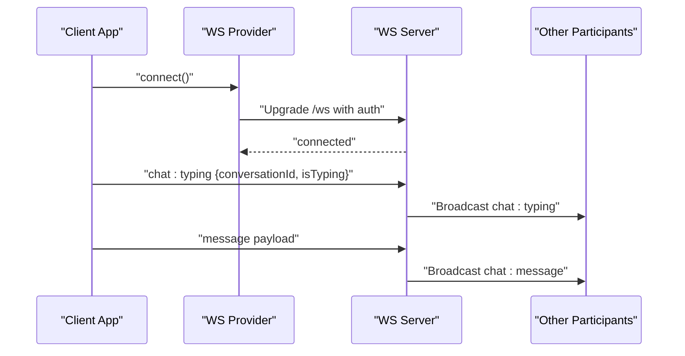
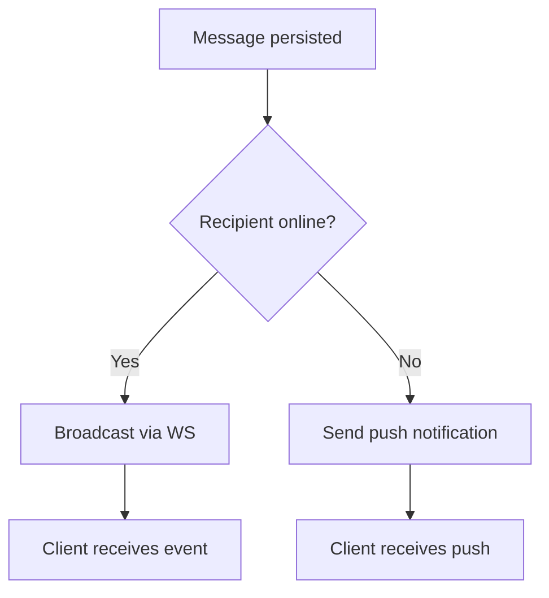
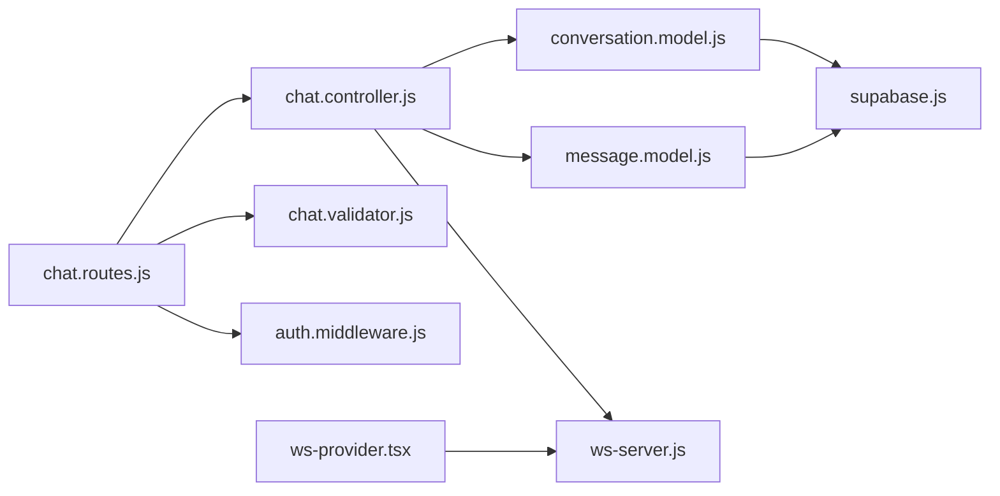

# Communication System

<cite>
**Referenced Files in This Document**
- [005_conversations_messages.sql](file://apps/server/migrations/005_conversations_messages.sql)
- [conversation.model.js](file://apps/server/models/conversation.model.js)
- [message.model.js](file://apps/server/models/message.model.js)
- [chat.controller.js](file://apps/server/controllers/chat.controller.js)
- [chat.routes.js](file://apps/server/routes/chat.routes.js)
- [ws-server.js](file://apps/server/websocket/ws-server.js)
- [ws-provider.tsx](file://apps/customer/src/providers/ws-provider.tsx)
- [use-chat.ts](file://apps/customer/src/hooks/use-chat.ts)
- [supabase.js](file://apps/server/lib/supabase.js)
- [chat.validator.js](file://apps/server/validators/chat.validator.js)
- [notification.service.js](file://apps/server/services/notification.service.js)
- [auth.middleware.js](file://apps/server/middleware/auth.middleware.js)
- [index.js](file://apps/server/config/index.js)
</cite>

## Table of Contents
1. [Introduction](#introduction)
2. [Project Structure](#project-structure)
3. [Core Components](#core-components)
4. [Architecture Overview](#architecture-overview)
5. [Detailed Component Analysis](#detailed-component-analysis)
6. [Dependency Analysis](#dependency-analysis)
7. [Performance Considerations](#performance-considerations)
8. [Troubleshooting Guide](#troubleshooting-guide)
9. [Conclusion](#conclusion)
10. [Appendices](#appendices)

## Introduction
This document describes the real-time communication system for conversations and messages. It covers the database schema, models, controllers, routing, WebSocket integration, and client-side consumption. It also documents conversation types, participant tracking, message ordering, read receipts, offline messaging via push notifications, and operational considerations such as delivery guarantees, encryption, audit trails, and archiving strategies.

## Project Structure
The communication system spans the server-side API, database migrations, models, controllers, WebSocket server, and client-side providers/hooks.

**Diagram sources**
- [chat.routes.js:1-21](file://apps/server/routes/chat.routes.js#L1-L21)
- [chat.controller.js:1-174](file://apps/server/controllers/chat.controller.js#L1-L174)
- [conversation.model.js:1-62](file://apps/server/models/conversation.model.js#L1-L62)
- [message.model.js:1-61](file://apps/server/models/message.model.js#L1-L61)
- [ws-server.js:1-237](file://apps/server/websocket/ws-server.js#L1-L237)
- [supabase.js:1-151](file://apps/server/lib/supabase.js#L1-L151)
- [index.js:104-107](file://apps/server/config/index.js#L104-L107)
- [ws-provider.tsx:1-86](file://apps/customer/src/providers/ws-provider.tsx#L1-L86)
- [use-chat.ts:1-20](file://apps/customer/src/hooks/use-chat.ts#L1-L20)

**Section sources**
- [chat.routes.js:1-21](file://apps/server/routes/chat.routes.js#L1-L21)
- [chat.controller.js:1-174](file://apps/server/controllers/chat.controller.js#L1-L174)
- [conversation.model.js:1-62](file://apps/server/models/conversation.model.js#L1-L62)
- [message.model.js:1-61](file://apps/server/models/message.model.js#L1-L61)
- [ws-server.js:1-237](file://apps/server/websocket/ws-server.js#L1-L237)
- [supabase.js:1-151](file://apps/server/lib/supabase.js#L1-L151)
- [index.js:104-107](file://apps/server/config/index.js#L104-L107)
- [ws-provider.tsx:1-86](file://apps/customer/src/providers/ws-provider.tsx#L1-L86)
- [use-chat.ts:1-20](file://apps/customer/src/hooks/use-chat.ts#L1-L20)

## Core Components
- Conversations table: Stores conversation metadata, participants, type, and timestamps.
- Messages table: Stores message content, sender identity, read receipts, and timestamps.
- Conversation model: Finds or creates conversations, checks participation, touches updated_at, and resolves other participant.
- Message model: Retrieves paginated history, enforces content limits, marks messages as read, and computes unread counts.
- Chat controller: Orchestrates creation, listing, message retrieval, sending, and read marking; integrates with WebSocket broadcasting and push notifications.
- WebSocket server: Authenticates connections, maintains registries per project, handles typing indicators, and broadcasts events.
- Frontend provider: Establishes WebSocket connection and subscribes to events; queries use React Query with periodic polling.

**Section sources**
- [005_conversations_messages.sql:4-33](file://apps/server/migrations/005_conversations_messages.sql#L4-L33)
- [conversation.model.js:7-62](file://apps/server/models/conversation.model.js#L7-L62)
- [message.model.js:8-61](file://apps/server/models/message.model.js#L8-L61)
- [chat.controller.js:12-174](file://apps/server/controllers/chat.controller.js#L12-L174)
- [ws-server.js:22-237](file://apps/server/websocket/ws-server.js#L22-L237)
- [ws-provider.tsx:27-86](file://apps/customer/src/providers/ws-provider.tsx#L27-L86)
- [use-chat.ts:5-19](file://apps/customer/src/hooks/use-chat.ts#L5-L19)

## Architecture Overview
The system combines REST APIs for CRUD operations with WebSocket broadcasts for real-time updates. Clients subscribe to chat events and poll message history at intervals. Offline recipients receive push notifications when the other participant is not online.

**Diagram sources**
- [chat.controller.js:12-140](file://apps/server/controllers/chat.controller.js#L12-L140)
- [conversation.model.js:15-33](file://apps/server/models/conversation.model.js#L15-L33)
- [message.model.js:24-37](file://apps/server/models/message.model.js#L24-L37)
- [supabase.js:107-139](file://apps/server/lib/supabase.js#L107-L139)
- [ws-server.js:126-147](file://apps/server/websocket/ws-server.js#L126-L147)
- [notification.service.js:73-83](file://apps/server/services/notification.service.js#L73-L83)

## Detailed Component Analysis

### Conversations Data Model
- Purpose: Track multi-tenant conversations scoped by project_ref, associated with an order when applicable, and define two participants.
- Key attributes:
  - id: UUID primary key
  - project_ref: TEXT, multi-tenant isolation
  - order_id: UUID, optional foreign key to orders
  - type: TEXT with enum-like constraint ('customer_vendor', 'vendor_rider')
  - participant_1_id, participant_2_id: UUIDs of the two participants
  - created_at, updated_at: TIMESTAMPTZ timestamps
- Indexes: project_ref, order_id, participant_1_id, participant_2_id for efficient filtering and joins.

**Diagram sources**
- [005_conversations_messages.sql:4-33](file://apps/server/migrations/005_conversations_messages.sql#L4-L33)

**Section sources**
- [005_conversations_messages.sql:4-18](file://apps/server/migrations/005_conversations_messages.sql#L4-L18)
- [conversation.model.js:15-33](file://apps/server/models/conversation.model.js#L15-L33)

### Messages Data Model
- Purpose: Persist message content, sender identity, read receipts, and timestamps.
- Key attributes:
  - id: UUID primary key
  - conversation_id: UUID foreign key to conversations with cascade delete
  - sender_id: UUID
  - sender_role: TEXT constrained to ('customer', 'vendor', 'rider', 'admin')
  - content: TEXT with a maximum length enforced by migration and model
  - read_at: TIMESTAMPTZ nullable
  - created_at: TIMESTAMPTZ
- Indexes: conversation_id, sender_id, created_at DESC for ordering and filtering.

**Diagram sources**
- [message.model.js:24-37](file://apps/server/models/message.model.js#L24-L37)
- [005_conversations_messages.sql:20-28](file://apps/server/migrations/005_conversations_messages.sql#L20-L28)

**Section sources**
- [005_conversations_messages.sql:20-28](file://apps/server/migrations/005_conversations_messages.sql#L20-L28)
- [message.model.js:13-37](file://apps/server/models/message.model.js#L13-L37)

### Conversation Lifecycle and Permissions
- Creation:
  - Endpoint: POST /chat/conversations
  - Validates type and orderId; determines participants based on type and order context; ensures multi-tenant isolation; creates conversation if none exists.
- Listing:
  - Endpoint: GET /chat/conversations
  - Returns conversations where the user is participant_1 or participant_2, scoped by project_ref.
- Participant checks:
  - Controllers verify conversation existence, project_ref match, and participant membership before allowing operations.

**Diagram sources**
- [chat.controller.js:53-61](file://apps/server/controllers/chat.controller.js#L53-L61)
- [conversation.model.js:35-41](file://apps/server/models/conversation.model.js#L35-L41)

**Section sources**
- [chat.controller.js:12-61](file://apps/server/controllers/chat.controller.js#L12-L61)
- [conversation.model.js:35-58](file://apps/server/models/conversation.model.js#L35-L58)

### Message Persistence, Retrieval, and Ordering
- Retrieval:
  - Endpoint: GET /chat/conversations/:id/messages?page=N
  - Paginates by pageSize from config; orders by created_at descending.
- Ordering:
  - Messages are ordered newest-first by created_at DESC.
- Read receipts:
  - markRead endpoint patches read_at for all messages except the reader’s own messages.
  - Unread count computed client-side by counting messages without read_at where sender_id differs from reader.

**Diagram sources**
- [chat.controller.js:63-171](file://apps/server/controllers/chat.controller.js#L63-L171)
- [message.model.js:13-57](file://apps/server/models/message.model.js#L13-L57)
- [supabase.js:107-139](file://apps/server/lib/supabase.js#L107-L139)

**Section sources**
- [chat.controller.js:63-171](file://apps/server/controllers/chat.controller.js#L63-L171)
- [message.model.js:13-57](file://apps/server/models/message.model.js#L13-L57)
- [index.js:104-107](file://apps/server/config/index.js#L104-L107)

### Real-Time Updates via WebSocket
- Authentication:
  - Supports admin_session cookie, customer_session cookie, or JWT via query parameter.
- Event types:
  - chat:typing: Relay typing indicators to all connections in the same project.
  - chat:message: Broadcast new messages to both participants.
  - chat:read: Broadcast read receipts to the project.
- Client integration:
  - WS provider connects to /ws and subscribes to events.
  - React Query invalidation triggers re-fetch of conversations/messages.

**Diagram sources**
- [ws-server.js:22-89](file://apps/server/websocket/ws-server.js#L22-L89)
- [ws-server.js:126-147](file://apps/server/websocket/ws-server.js#L126-L147)
- [ws-provider.tsx:27-60](file://apps/customer/src/providers/ws-provider.tsx#L27-L60)

**Section sources**
- [ws-server.js:95-124](file://apps/server/websocket/ws-server.js#L95-L124)
- [ws-server.js:126-175](file://apps/server/websocket/ws-server.js#L126-L175)
- [ws-provider.tsx:27-86](file://apps/customer/src/providers/ws-provider.tsx#L27-L86)

### Offline Messaging and Delivery Guarantees
- Offline delivery:
  - If the recipient has no active WebSocket connection, the system sends a push notification containing a concise message preview and navigation hint.
- Delivery guarantees:
  - REST endpoints return immediate acknowledgment upon successful persistence and broadcast.
  - WebSocket broadcasts occur after successful database writes.
  - No at-least-once retry mechanism is implemented in the current code; clients should handle transient failures by re-polling and re-subscribing.

**Diagram sources**
- [chat.controller.js:120-135](file://apps/server/controllers/chat.controller.js#L120-L135)
- [notification.service.js:73-83](file://apps/server/services/notification.service.js#L73-L83)

**Section sources**
- [chat.controller.js:120-135](file://apps/server/controllers/chat.controller.js#L120-L135)
- [notification.service.js:73-83](file://apps/server/services/notification.service.js#L73-L83)

### Threading Patterns and Message Ordering
- Threading:
  - Messages belong to a single conversation via conversation_id.
  - Ordering is strictly by created_at DESC per page.
- Pagination:
  - pageSize configured centrally; page number parsed from query string.

**Section sources**
- [message.model.js:13-22](file://apps/server/models/message.model.js#L13-L22)
- [chat.validator.js:18-20](file://apps/server/validators/chat.validator.js#L18-L20)
- [index.js:104-107](file://apps/server/config/index.js#L104-L107)

### Conversation Types and Participant Tracking
- Types:
  - customer_vendor: Participants are the caller and the order’s customer.
  - vendor_rider: Participants are the caller and the assigned rider for the order.
- Participant resolution:
  - Controllers compute participant_2 based on order context; models expose helper to resolve the other participant.

**Section sources**
- [chat.controller.js:22-45](file://apps/server/controllers/chat.controller.js#L22-L45)
- [conversation.model.js:54-58](file://apps/server/models/conversation.model.js#L54-L58)

### Audit Trail and Security Considerations
- Access control:
  - Middleware enforces session parsing and multi-tenant isolation via project_ref.
  - Controllers verify conversation existence and participant membership before operations.
- Validation:
  - Zod schemas enforce content length and pagination parameters.
- Encryption:
  - No in-transit or at-rest encryption is implemented in the current codebase. Consider TLS termination at the edge and application-level encryption for sensitive content as future enhancements.

**Section sources**
- [auth.middleware.js:11-51](file://apps/server/middleware/auth.middleware.js#L11-L51)
- [chat.controller.js:72-109](file://apps/server/controllers/chat.controller.js#L72-L109)
- [chat.validator.js:6-20](file://apps/server/validators/chat.validator.js#L6-L20)

### Conversation Archiving Strategies
- Current state:
  - No explicit archive flag or soft-delete is present in the schema or models.
- Recommended approach:
  - Add an archived boolean flag to conversations with appropriate indexes.
  - Implement a background job to move old conversations/messages to archival storage.
  - Enforce read-only access for archived conversations.

[No sources needed since this section provides general guidance]

## Dependency Analysis
- Controllers depend on models and WebSocket server.
- Models depend on Supabase client for database operations.
- Routes depend on validation middleware and authentication middleware.
- Frontend depends on WebSocket provider and React Query.

**Diagram sources**
- [chat.routes.js:12-18](file://apps/server/routes/chat.routes.js#L12-L18)
- [chat.controller.js:3-10](file://apps/server/controllers/chat.controller.js#L3-L10)
- [conversation.model.js:4-5](file://apps/server/models/conversation.model.js#L4-L5)
- [message.model.js:4-6](file://apps/server/models/message.model.js#L4-L6)
- [ws-server.js:3-9](file://apps/server/websocket/ws-server.js#L3-L9)
- [supabase.js:3-8](file://apps/server/lib/supabase.js#L3-L8)
- [chat.validator.js:3-4](file://apps/server/validators/chat.validator.js#L3-L4)
- [auth.middleware.js:5-6](file://apps/server/middleware/auth.middleware.js#L5-L6)
- [ws-provider.tsx:11](file://apps/customer/src/providers/ws-provider.tsx#L11)

**Section sources**
- [chat.routes.js:12-18](file://apps/server/routes/chat.routes.js#L12-L18)
- [chat.controller.js:3-10](file://apps/server/controllers/chat.controller.js#L3-L10)
- [conversation.model.js:4-5](file://apps/server/models/conversation.model.js#L4-L5)
- [message.model.js:4-6](file://apps/server/models/message.model.js#L4-L6)
- [ws-server.js:3-9](file://apps/server/websocket/ws-server.js#L3-L9)
- [supabase.js:3-8](file://apps/server/lib/supabase.js#L3-L8)
- [chat.validator.js:3-4](file://apps/server/validators/chat.validator.js#L3-L4)
- [auth.middleware.js:5-6](file://apps/server/middleware/auth.middleware.js#L5-L6)
- [ws-provider.tsx:11](file://apps/customer/src/providers/ws-provider.tsx#L11)

## Performance Considerations
- Database:
  - Indexes on conversations (project_ref, order_id, participant_*), and messages (conversation_id, created_at DESC) support efficient queries.
- Pagination:
  - Centralized pageSize reduces payload sizes; clients should use reasonable page sizes.
- WebSocket:
  - Heartbeat pings and registry per project minimize overhead.
- Recommendations:
  - Consider partitioning or materialized views for very large histories.
  - Add caching for recent messages per conversation.

[No sources needed since this section provides general guidance]

## Troubleshooting Guide
- Authentication failures:
  - Ensure admin_session, customer_session, or JWT token is present and valid.
- Access denied:
  - Verify project_ref matches the conversation and caller is a participant.
- Message too long:
  - Respect the configured maximum length enforced by both validator and model.
- No WebSocket events:
  - Confirm client subscription and that the server is broadcasting chat events.

**Section sources**
- [ws-server.js:95-124](file://apps/server/websocket/ws-server.js#L95-L124)
- [chat.controller.js:72-109](file://apps/server/controllers/chat.controller.js#L72-L109)
- [chat.validator.js:11-16](file://apps/server/validators/chat.validator.js#L11-L16)

## Conclusion
The communication system provides a robust foundation for real-time conversations with clear separation of concerns, strong multi-tenancy, and scalable persistence. It supports essential features like participant-based access, read receipts, offline delivery via push notifications, and real-time updates through WebSockets. Future enhancements could include encryption, archiving, and improved delivery guarantees.

## Appendices

### API Definitions
- Create conversation
  - Method: POST
  - Path: /chat/conversations
  - Body: { orderId: string, type: "customer_vendor" | "vendor_rider" }
  - Responses: 201 Created with conversation if created; 200 OK if already exists
- List conversations
  - Method: GET
  - Path: /chat/conversations
  - Responses: 200 OK with array of conversations
- Get messages
  - Method: GET
  - Path: /chat/conversations/:id/messages?page=N
  - Responses: 200 OK with messages, page, pageSize
- Send message
  - Method: POST
  - Path: /chat/conversations/:id/messages
  - Body: { content: string }
  - Responses: 201 Created with message
- Mark conversation read
  - Method: PATCH
  - Path: /chat/conversations/:id/read
  - Responses: 200 OK { ok: true }

**Section sources**
- [chat.routes.js:14-18](file://apps/server/routes/chat.routes.js#L14-L18)
- [chat.validator.js:6-20](file://apps/server/validators/chat.validator.js#L6-L20)
- [index.js:104-107](file://apps/server/config/index.js#L104-L107)