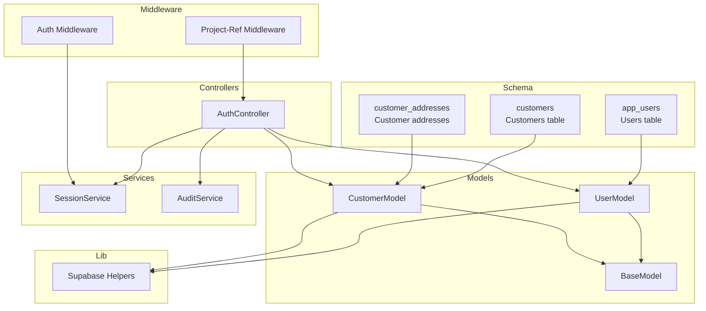
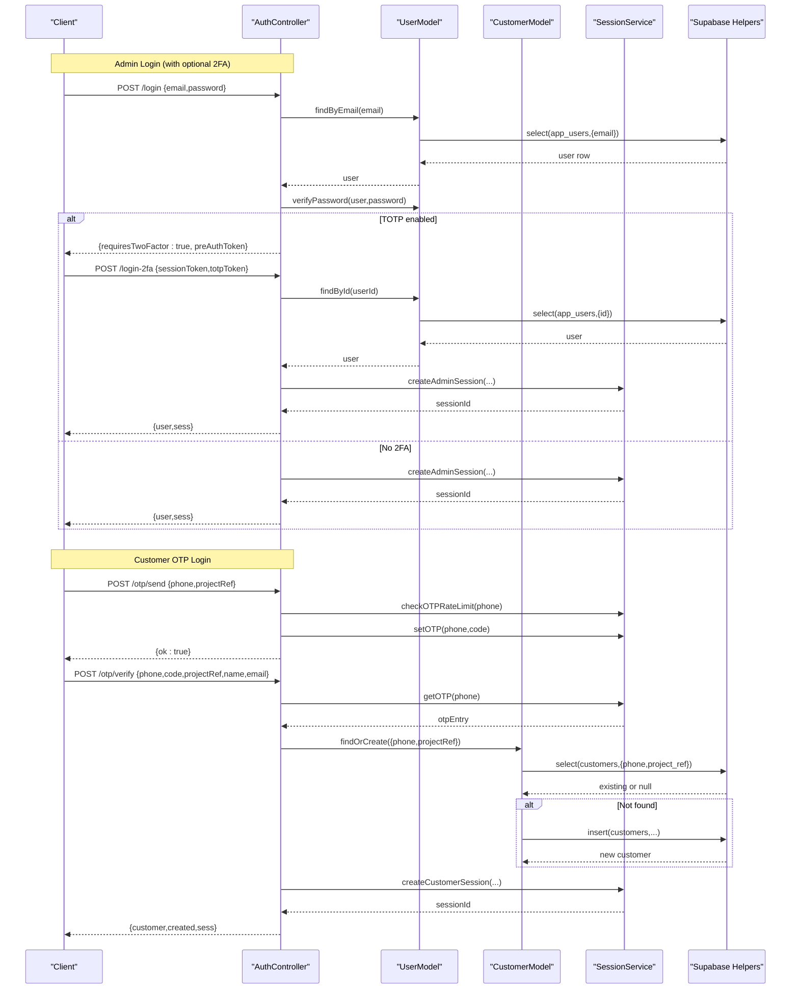
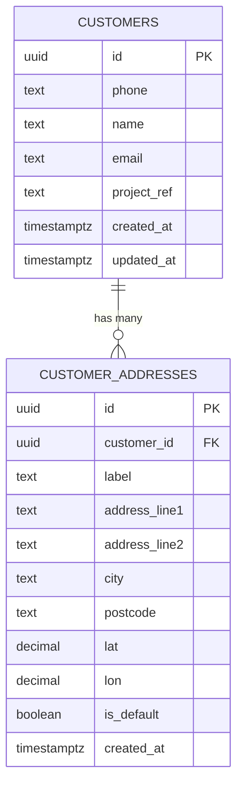
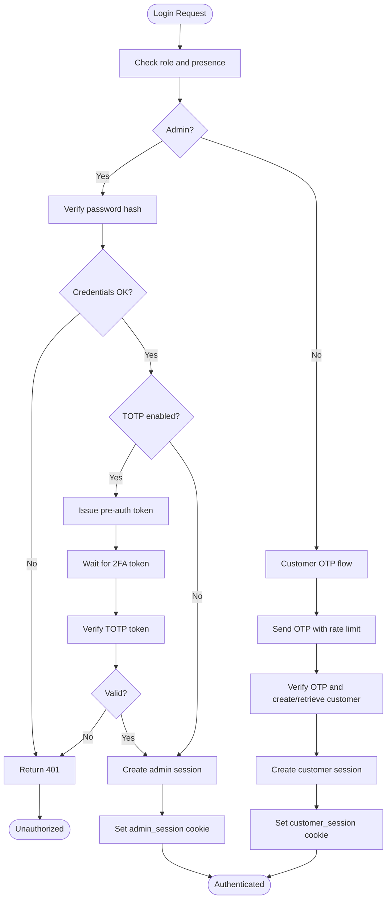
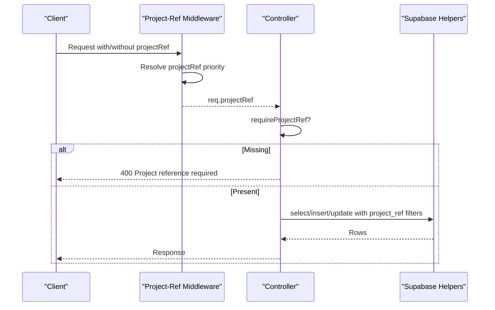
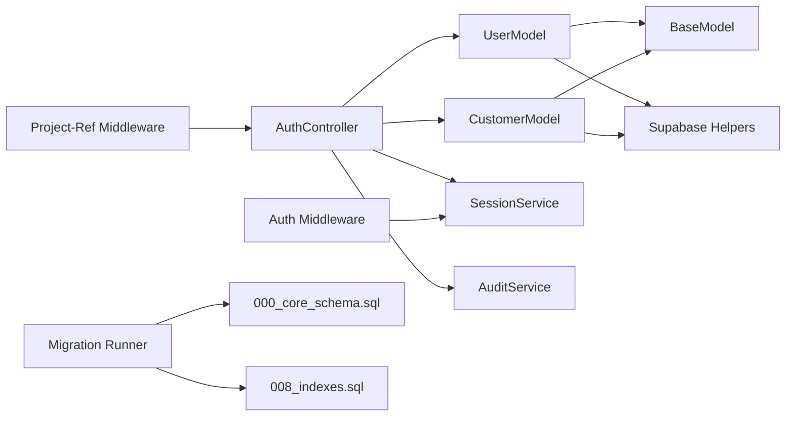

# Core Entities

<cite>
**Referenced Files in This Document**
- [000_core_schema.sql](file://apps/server/migrations/000_core_schema.sql)
- [001_customer_addresses.sql](file://apps/server/migrations/001_customer_addresses.sql)
- [008_indexes.sql](file://apps/server/migrations/008_indexes.sql)
- [base.model.js](file://apps/server/models/base.model.js)
- [user.model.js](file://apps/server/models/user.model.js)
- [customer.model.js](file://apps/server/models/customer.model.js)
- [supabase.js](file://apps/server/lib/supabase.js)
- [auth.controller.js](file://apps/server/controllers/auth.controller.js)
- [auth.middleware.js](file://apps/server/middleware/auth.middleware.js)
- [project-ref.middleware.js](file://apps/server/middleware/project-ref.middleware.js)
- [session.service.js](file://apps/server/services/session.service.js)
- [audit.js](file://apps/server/lib/audit.js)
- [runner.js](file://apps/server/migrations/runner.js)
- [index.js](file://apps/server/config/index.js)
</cite>

## Table of Contents
1. [Introduction](#introduction)
2. [Project Structure](#project-structure)
3. [Core Components](#core-components)
4. [Architecture Overview](#architecture-overview)
5. [Detailed Component Analysis](#detailed-component-analysis)
6. [Dependency Analysis](#dependency-analysis)
7. [Performance Considerations](#performance-considerations)
8. [Troubleshooting Guide](#troubleshooting-guide)
9. [Conclusion](#conclusion)

## Introduction
This document describes the core database entities and their associated data models in Delivio. It focuses on the Users and Customers tables, role-based access control, authentication fields, multi-tenant isolation via project_ref, and the repository pattern implementation. It also covers query optimization strategies, data validation rules, and security considerations including password hashing and TOTP-based two-factor authentication.

## Project Structure
The core schema is defined in SQL migrations and consumed by JavaScript models and controllers. The repository pattern is implemented via a base model that wraps Supabase REST helpers. Authentication and session management are handled by dedicated services and middleware.



**Diagram sources**
- [000_core_schema.sql:10-36](file://apps/server/migrations/000_core_schema.sql#L10-L36)
- [001_customer_addresses.sql:4-19](file://apps/server/migrations/001_customer_addresses.sql#L4-L19)
- [base.model.js:9-52](file://apps/server/models/base.model.js#L9-L52)
- [user.model.js:10-61](file://apps/server/models/user.model.js#L10-L61)
- [customer.model.js:7-58](file://apps/server/models/customer.model.js#L7-L58)
- [supabase.js:107-148](file://apps/server/lib/supabase.js#L107-L148)
- [auth.controller.js:26-321](file://apps/server/controllers/auth.controller.js#L26-L321)
- [auth.middleware.js:11-123](file://apps/server/middleware/auth.middleware.js#L11-L123)
- [project-ref.middleware.js:13-35](file://apps/server/middleware/project-ref.middleware.js#L13-L35)
- [session.service.js:28-180](file://apps/server/services/session.service.js#L28-L180)
- [audit.js:18-32](file://apps/server/lib/audit.js#L18-L32)

**Section sources**
- [000_core_schema.sql:10-36](file://apps/server/migrations/000_core_schema.sql#L10-L36)
- [base.model.js:9-52](file://apps/server/models/base.model.js#L9-L52)
- [supabase.js:107-148](file://apps/server/lib/supabase.js#L107-L148)
- [auth.controller.js:26-321](file://apps/server/controllers/auth.controller.js#L26-L321)
- [auth.middleware.js:11-123](file://apps/server/middleware/auth.middleware.js#L11-L123)
- [project-ref.middleware.js:13-35](file://apps/server/middleware/project-ref.middleware.js#L13-L35)
- [session.service.js:28-180](file://apps/server/services/session.service.js#L28-L180)
- [audit.js:18-32](file://apps/server/lib/audit.js#L18-L32)

## Core Components
This section documents the Users and Customers entities, their fields, constraints, indexes, and how they are accessed via the repository pattern.

- Users (app_users)
  - Purpose: Stores administrative, vendor, and rider identities with credentials and 2FA support.
  - Multi-tenancy: Isolated by project_ref.
  - Role-based access control: role is constrained to admin, vendor, rider.
  - Authentication fields: password_hash, totp_enabled, totp_secret.
  - Indexes: unique email (lowercased), project_ref, role.
  - Related queries: find by email, find by project_ref and role, create with hashed password, verify password, update password, enable/disable TOTP, sanitize sensitive fields.

- Customers (customers)
  - Purpose: Stores customer identity and contact info with temporal tracking.
  - Multi-tenancy: Isolated by project_ref.
  - Phone verification: OTP-based login flow; unique constraint on (project_ref, phone).
  - Temporal tracking: created_at, updated_at.
  - Related queries: find by phone, find or create with project_ref, update profile, manage addresses.

- Relationship and inheritance patterns
  - Users and Customers are independent entities.
  - The relationship is indirect: orders reference customers; riders are app_users; vendors are app_users.
  - Address management is decoupled into customer_addresses with a foreign key to customers.

- Repository pattern
  - BaseModel provides generic CRUD and counting via Supabase REST helpers.
  - UserModel and CustomerModel extend BaseModel with domain-specific methods.
  - Supabase helpers encapsulate REST calls, filter building, and error handling.

- Query optimization
  - Core indexes: app_users (email, project_ref, role), customers (project_ref, phone), orders (project_ref, customer_id, status, created_at), deliveries (order_id, rider_id), cart_items (session_id).
  - Additional hot indexes are provisioned in a separate migration.

- Security considerations
  - Password hashing: bcrypt with configurable salt rounds.
  - TOTP: secret stored securely; QR setup and verification via time-based tokens.
  - Session storage: Redis-backed or in-memory; cookies configured for production readiness.
  - Audit logging: non-blocking writes for compliance events.

**Section sources**
- [000_core_schema.sql:10-36](file://apps/server/migrations/000_core_schema.sql#L10-L36)
- [001_customer_addresses.sql:4-19](file://apps/server/migrations/001_customer_addresses.sql#L4-L19)
- [008_indexes.sql:4-10](file://apps/server/migrations/008_indexes.sql#L4-L10)
- [base.model.js:9-52](file://apps/server/models/base.model.js#L9-L52)
- [user.model.js:10-61](file://apps/server/models/user.model.js#L10-L61)
- [customer.model.js:7-58](file://apps/server/models/customer.model.js#L7-L58)
- [supabase.js:93-102](file://apps/server/lib/supabase.js#L93-L102)
- [supabase.js:107-148](file://apps/server/lib/supabase.js#L107-L148)
- [session.service.js:28-180](file://apps/server/services/session.service.js#L28-L180)
- [auth.controller.js:26-321](file://apps/server/controllers/auth.controller.js#L26-L321)
- [audit.js:18-32](file://apps/server/lib/audit.js#L18-L32)

## Architecture Overview
The authentication and identity flow integrates models, controllers, middleware, sessions, and audit logging.



**Diagram sources**
- [auth.controller.js:26-321](file://apps/server/controllers/auth.controller.js#L26-L321)
- [user.model.js:15-40](file://apps/server/models/user.model.js#L15-L40)
- [customer.model.js:16-31](file://apps/server/models/customer.model.js#L16-L31)
- [session.service.js:28-180](file://apps/server/services/session.service.js#L28-L180)
- [supabase.js:107-148](file://apps/server/lib/supabase.js#L107-L148)

## Detailed Component Analysis

### Users (app_users) Data Model
- Fields and types
  - id: UUID (primary key)
  - email: text (non-null)
  - password_hash: text (non-null)
  - role: text (check constraint: admin | vendor | rider)
  - project_ref: text (non-null, tenant identifier)
  - totp_enabled: boolean (default false)
  - totp_secret: text
  - created_at: timestamptz (default now())
- Constraints and indexes
  - Unique index on lower(email)
  - Indexes on project_ref and role
- Repository methods
  - findByEmail, findByProjectRef(role optional), create (hashed password), verifyPassword, updatePassword, enableTOTP, disableTOTP, sanitise (removes sensitive fields)
- Security
  - Password hashing via bcrypt with configurable rounds.
  - TOTP secret stored and verified using time-based tokens.
  - Sensitive fields excluded from returned user objects.

```mermaid
classDiagram
class BaseModel {
+findById(id, cols)
+findOne(filters, cols)
+findMany(filters, options)
+create(data)
+updateById(id, data)
+deleteById(id)
+count(filters)
}
class UserModel {
+findByEmail(email)
+findByProjectRef(projectRef, role)
+create({email,password,role,projectRef})
+verifyPassword(user, password)
+updatePassword(userId, newPassword)
+enableTOTP(userId, totpSecret)
+disableTOTP(userId)
+sanitise(user)
}
class SupabaseHelpers {
+select(table, options)
+insert(table, data)
+update(table, data, filters)
+remove(table, filters)
+buildFilters(filters)
}
UserModel --|> BaseModel
UserModel --> SupabaseHelpers : "uses"
```

**Diagram sources**
- [base.model.js:9-52](file://apps/server/models/base.model.js#L9-L52)
- [user.model.js:10-61](file://apps/server/models/user.model.js#L10-L61)
- [supabase.js:107-148](file://apps/server/lib/supabase.js#L107-L148)

**Section sources**
- [000_core_schema.sql:10-22](file://apps/server/migrations/000_core_schema.sql#L10-L22)
- [user.model.js:15-61](file://apps/server/models/user.model.js#L15-L61)
- [supabase.js:107-148](file://apps/server/lib/supabase.js#L107-L148)

### Customers (customers) Data Model
- Fields and types
  - id: UUID (primary key)
  - phone: text (non-null)
  - name: text
  - email: text
  - project_ref: text (non-null)
  - created_at: timestamptz (default now())
  - updated_at: timestamptz (default now())
- Constraints and indexes
  - Unique index on (project_ref, phone)
  - Index on project_ref
- Repository methods
  - findByPhone, findOrCreate (creates with UUID and timestamps), updateProfile, getAddresses, addAddress (manages defaults), deleteAddress
- Relationship to addresses
  - customer_addresses table references customers(id) with ON DELETE CASCADE



**Diagram sources**
- [000_core_schema.sql:25-35](file://apps/server/migrations/000_core_schema.sql#L25-L35)
- [001_customer_addresses.sql:4-19](file://apps/server/migrations/001_customer_addresses.sql#L4-L19)

**Section sources**
- [000_core_schema.sql:25-35](file://apps/server/migrations/000_core_schema.sql#L25-L35)
- [001_customer_addresses.sql:4-19](file://apps/server/migrations/001_customer_addresses.sql#L4-L19)
- [customer.model.js:12-58](file://apps/server/models/customer.model.js#L12-L58)

### Authentication and Session Flow
- Admin login
  - Validates credentials; if TOTP enabled, returns a short-lived pre-auth token; otherwise creates admin session and sets cookie.
- Customer OTP login
  - Sends OTP via SMS with rate limiting; verifies OTP; creates or retrieves customer; sets customer session cookie.
- Session storage
  - Redis-backed store preferred; falls back to in-memory for development.
- Audit logging
  - Non-blocking writes for authentication and security events.



**Diagram sources**
- [auth.controller.js:26-321](file://apps/server/controllers/auth.controller.js#L26-L321)
- [session.service.js:66-92](file://apps/server/services/session.service.js#L66-L92)
- [customer.model.js:16-31](file://apps/server/models/customer.model.js#L16-L31)

**Section sources**
- [auth.controller.js:26-321](file://apps/server/controllers/auth.controller.js#L26-L321)
- [session.service.js:28-180](file://apps/server/services/session.service.js#L28-L180)
- [audit.js:18-32](file://apps/server/lib/audit.js#L18-L32)

### Multi-Tenant Isolation and Access Control
- Multi-tenancy
  - project_ref is present on Users, Customers, Orders, Deliveries, Workspaces, Block Content, and Cart Sessions.
  - Middleware attaches project_ref from route params, session, header, or query string.
  - Controllers enforce requirement for project_ref on protected routes.
- Role-based access control
  - Admin role is enforced by middleware guards.
  - Role checks can be performed with requireRole.



**Diagram sources**
- [project-ref.middleware.js:13-35](file://apps/server/middleware/project-ref.middleware.js#L13-L35)
- [auth.middleware.js:56-76](file://apps/server/middleware/auth.middleware.js#L56-L76)

**Section sources**
- [000_core_schema.sql:14,30,69,123:14-14](file://apps/server/migrations/000_core_schema.sql#L14-L14)
- [000_core_schema.sql:30,69,123:30-30](file://apps/server/migrations/000_core_schema.sql#L30-L30)
- [000_core_schema.sql:69,123:69-69](file://apps/server/migrations/000_core_schema.sql#L69-L69)
- [project-ref.middleware.js:13-35](file://apps/server/middleware/project-ref.middleware.js#L13-L35)
- [auth.middleware.js:56-76](file://apps/server/middleware/auth.middleware.js#L56-L76)

## Dependency Analysis
The following diagram shows how core components depend on each other.



**Diagram sources**
- [auth.controller.js:26-321](file://apps/server/controllers/auth.controller.js#L26-L321)
- [user.model.js:10-61](file://apps/server/models/user.model.js#L10-L61)
- [customer.model.js:7-58](file://apps/server/models/customer.model.js#L7-L58)
- [base.model.js:9-52](file://apps/server/models/base.model.js#L9-L52)
- [supabase.js:107-148](file://apps/server/lib/supabase.js#L107-L148)
- [auth.middleware.js:11-123](file://apps/server/middleware/auth.middleware.js#L11-L123)
- [project-ref.middleware.js:13-35](file://apps/server/middleware/project-ref.middleware.js#L13-L35)
- [runner.js:87-116](file://apps/server/migrations/runner.js#L87-L116)
- [000_core_schema.sql:10-165](file://apps/server/migrations/000_core_schema.sql#L10-L165)
- [008_indexes.sql:4-10](file://apps/server/migrations/008_indexes.sql#L4-L10)

**Section sources**
- [runner.js:87-116](file://apps/server/migrations/runner.js#L87-L116)
- [supabase.js:107-148](file://apps/server/lib/supabase.js#L107-L148)

## Performance Considerations
- Index coverage
  - Users: email (unique), project_ref, role
  - Customers: project_ref, (project_ref, phone) unique
  - Orders: project_ref, customer_id, status, created_at desc
  - Deliveries: order_id, rider_id
  - Cart items: session_id
- Query patterns
  - Use project_ref filters consistently to leverage indexes.
  - Prefer findOne/findMany with selective columns to reduce payload size.
  - Use order and limit parameters for paginated reads.
- Storage and sessions
  - Redis-backed session store recommended for production scalability.
- Migration management
  - Migrations executed via Supabase Management API; ensures reproducibility and auditability.

[No sources needed since this section provides general guidance]

## Troubleshooting Guide
- Authentication issues
  - Invalid credentials: controller returns unauthorized; ensure email normalization and bcrypt rounds are consistent.
  - TOTP errors: verify token against stored secret; confirm pre-auth token validity and session setup window.
  - OTP rate limits: review rate limiter thresholds and TTLs.
- Session problems
  - Missing session cookie: verify secure, sameSite, and path settings; ensure session store availability.
  - Session expiry: adjust TTLs in configuration.
- Multi-tenancy
  - Missing project_ref: ensure middleware attaches projectRef and routes require it.
  - Cross-tenant data leakage: verify all queries filter by project_ref.
- Database errors
  - Supabase fetch failures: inspect logs for status and body; confirm Supabase URL and keys.
  - Migration failures: check runner logs and Management API responses.

**Section sources**
- [auth.controller.js:26-321](file://apps/server/controllers/auth.controller.js#L26-L321)
- [session.service.js:66-92](file://apps/server/services/session.service.js#L66-L92)
- [auth.middleware.js:56-76](file://apps/server/middleware/auth.middleware.js#L56-L76)
- [project-ref.middleware.js:28-33](file://apps/server/middleware/project-ref.middleware.js#L28-L33)
- [supabase.js:47-62](file://apps/server/lib/supabase.js#L47-L62)
- [runner.js:87-116](file://apps/server/migrations/runner.js#L87-L116)

## Conclusion
The Users and Customers entities form the foundation of Delivio’s identity and access model. The repository pattern, combined with Supabase REST helpers, provides a clean abstraction for database operations. Multi-tenancy is enforced via project_ref across core tables, while role-based access control and TOTP-based 2FA strengthen security. Proper indexing and session management are essential for performance and reliability.