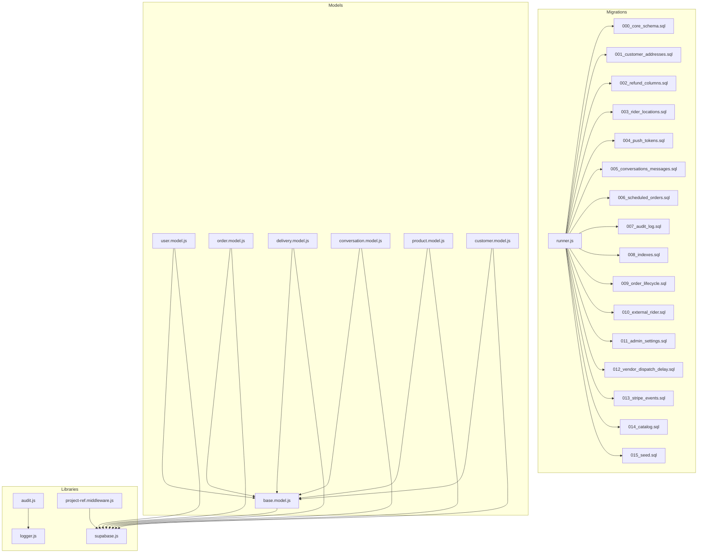
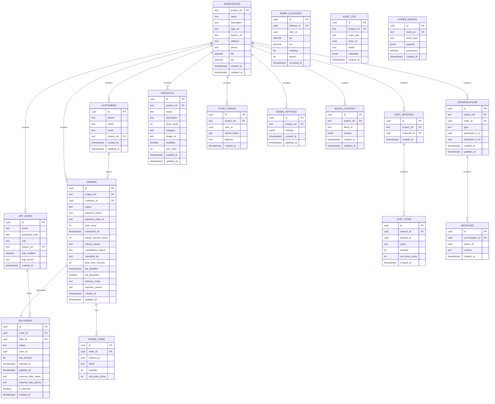
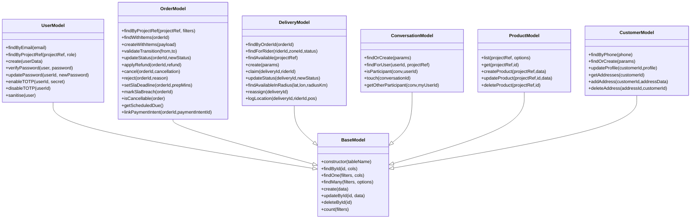
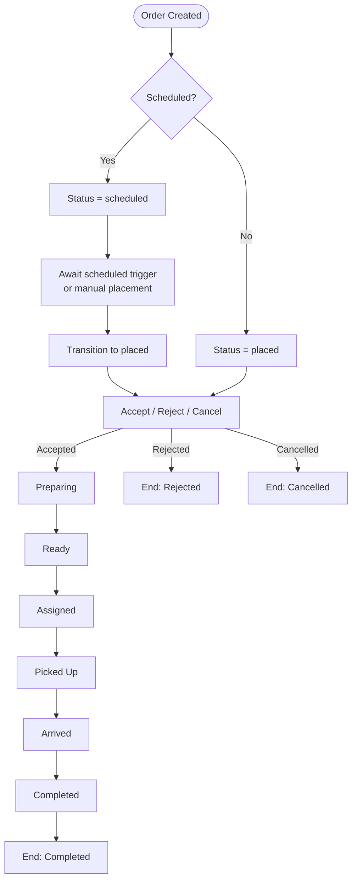
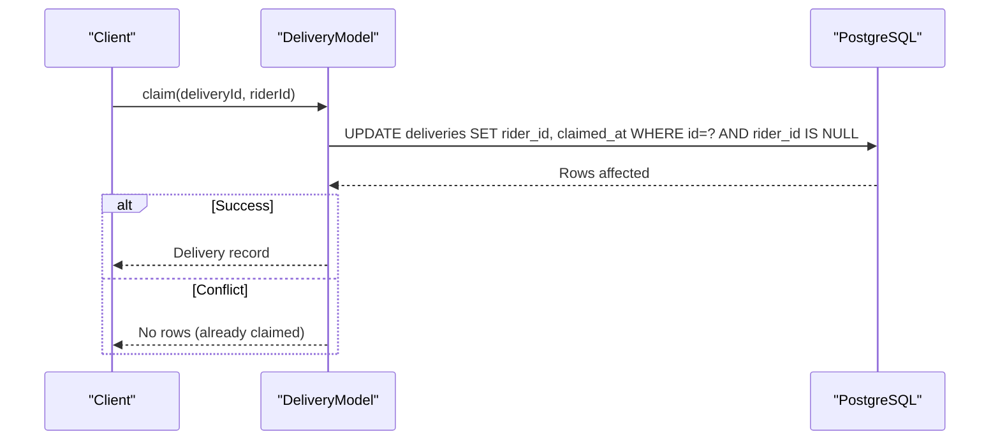
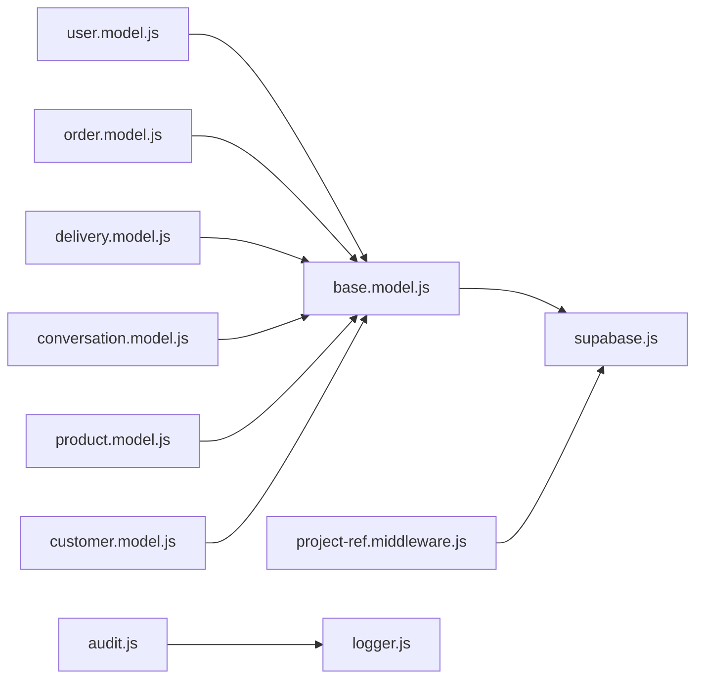

# Database Design

<cite>
**Referenced Files in This Document**
- [000_core_schema.sql](file://apps/server/migrations/000_core_schema.sql)
- [001_customer_addresses.sql](file://apps/server/migrations/001_customer_addresses.sql)
- [002_refund_columns.sql](file://apps/server/migrations/002_refund_columns.sql)
- [003_rider_locations.sql](file://apps/server/migrations/003_rider_locations.sql)
- [004_push_tokens.sql](file://apps/server/migrations/004_push_tokens.sql)
- [005_conversations_messages.sql](file://apps/server/migrations/005_conversations_messages.sql)
- [006_scheduled_orders.sql](file://apps/server/migrations/006_scheduled_orders.sql)
- [007_audit_log.sql](file://apps/server/migrations/007_audit_log.sql)
- [008_indexes.sql](file://apps/server/migrations/008_indexes.sql)
- [009_order_lifecycle.sql](file://apps/server/migrations/009_order_lifecycle.sql)
- [009_order_lifecycle.sql](file://apps/server/migrations/009_order_lifecycle.sql)
- [010_external_rider.sql](file://apps/server/migrations/010_external_rider.sql)
- [011_admin_settings.sql](file://apps/server/migrations/011_admin_settings.sql)
- [012_vendor_dispatch_delay.sql](file://apps/server/migrations/012_vendor_dispatch_delay.sql)
- [013_stripe_events.sql](file://apps/server/migrations/013_stripe_events.sql)
- [014_catalog.sql](file://apps/server/migrations/014_catalog.sql)
- [015_seed.sql](file://apps/server/migrations/015_seed.sql)
- [runner.js](file://apps/server/migrations/runner.js)
- [base.model.js](file://apps/server/models/base.model.js)
- [user.model.js](file://apps/server/models/user.model.js)
- [order.model.js](file://apps/server/models/order.model.js)
- [delivery.model.js](file://apps/server/models/delivery.model.js)
- [conversation.model.js](file://apps/server/models/conversation.model.js)
- [product.model.js](file://apps/server/models/product.model.js)
- [customer.model.js](file://apps/server/models/customer.model.js)
- [audit.js](file://apps/server/lib/audit.js)
- [logger.js](file://apps/server/lib/logger.js)
- [supabase.js](file://apps/server/lib/supabase.js)
- [project-ref.middleware.js](file://apps/server/middleware/project-ref.middleware.js)
</cite>

## Table of Contents
1. [Introduction](#introduction)
2. [Project Structure](#project-structure)
3. [Core Components](#core-components)
4. [Architecture Overview](#architecture-overview)
5. [Detailed Component Analysis](#detailed-component-analysis)
6. [Dependency Analysis](#dependency-analysis)
7. [Performance Considerations](#performance-considerations)
8. [Troubleshooting Guide](#troubleshooting-guide)
9. [Conclusion](#conclusion)
10. [Appendices](#appendices)

## Introduction
This document describes the Delivio database design and schema evolution. It focuses on the core data models (Users, Orders, Deliveries, Conversations, Products, Customers, Workspaces), their relationships, constraints, indexes, and multi-tenant isolation via workspace-scoped identifiers. It also documents migration practices, repository pattern implementation, query optimization strategies, lifecycle and audit logging, and compliance-relevant fields.

## Project Structure
Delivio’s persistence layer is implemented as a set of SQL migrations executed against a Supabase-managed PostgreSQL instance, complemented by a thin Node.js repository layer built on top of Supabase’s REST and PostgREST APIs.

- Migrations: Stored under apps/server/migrations/*.sql and orchestrated by a runner script.
- Models: Thin repositories extending a shared base that encapsulate CRUD and domain queries.
- Middleware and libraries: Enforce workspace scoping and provide REST helpers and auditing.

**Diagram sources**
- [runner.js:1-122](file://apps/server/migrations/runner.js#L1-L122)
- [000_core_schema.sql:1-165](file://apps/server/migrations/000_core_schema.sql#L1-L165)
- [base.model.js:1-55](file://apps/server/models/base.model.js#L1-L55)
- [user.model.js:1-64](file://apps/server/models/user.model.js#L1-L64)
- [order.model.js:1-178](file://apps/server/models/order.model.js#L1-L178)
- [delivery.model.js:1-98](file://apps/server/models/delivery.model.js#L1-L98)
- [conversation.model.js:1-62](file://apps/server/models/conversation.model.js#L1-L62)
- [product.model.js:1-67](file://apps/server/models/product.model.js#L1-L67)
- [customer.model.js:1-61](file://apps/server/models/customer.model.js#L1-L61)
- [supabase.js](file://apps/server/lib/supabase.js)
- [audit.js](file://apps/server/lib/audit.js)
- [logger.js](file://apps/server/lib/logger.js)
- [project-ref.middleware.js](file://apps/server/middleware/project-ref.middleware.js)

**Section sources**
- [runner.js:1-122](file://apps/server/migrations/runner.js#L1-L122)
- [base.model.js:1-55](file://apps/server/models/base.model.js#L1-L55)

## Core Components
This section defines the core entities, their fields, data types, constraints, and indexes. It also explains multi-tenancy and workspace isolation.

- Workspaces
  - Purpose: Vendor storefront profiles and tenant boundary.
  - Key fields: id (PK), project_ref (unique tenant identifier), name, description, media URLs, address, phone, lat, lon, timestamps.
  - Constraints: project_ref is unique; composite unique index on (project_ref, block_id) for CMS-like content.
  - Indexes: project_ref, block_content.project_ref.
  - Multi-tenancy: All other tables include project_ref to isolate data per workspace.

- Users (app_users)
  - Purpose: Admin, vendor, and rider accounts.
  - Key fields: id (PK), email (unique), password_hash, role (check constraint), project_ref (tenant), TOTP fields, timestamps.
  - Constraints: role must be one of admin, vendor, rider; unique index on lower(email); indexes on project_ref and role.
  - Multi-tenancy: Scoped by project_ref.

- Customers
  - Purpose: End-user profiles.
  - Key fields: id (PK), phone (unique per project_ref), name, email, project_ref, timestamps.
  - Constraints: unique index on (project_ref, phone); indexes on project_ref.
  - Multi-tenancy: Scoped by project_ref.

- Orders
  - Purpose: Purchase records and lifecycle tracking.
  - Key fields: id (PK), project_ref, customer_id (FK), status (check constraint), payment_status (check constraint), payment_intent_id, totals, scheduling, refunds/cancellations, SLA fields, delivery_mode, timestamps.
  - Constraints: status and payment_status constrained sets; order_items.quantity > 0, unit_price_cents >= 0.
  - Indexes: project_ref, customer_id, status, created_at desc; order_items(order_id).
  - Lifecycle: Status transitions validated in the order model; SLA breach marking and deadlines set via model methods.

- Order Items
  - Purpose: Line items for orders.
  - Key fields: id (PK), order_id (FK), product_id, name, quantity, unit_price_cents.
  - Constraints: quantity > 0, unit_price_cents >= 0; cascade delete on order deletion.

- Deliveries
  - Purpose: Rider assignment and delivery state machine.
  - Key fields: id (PK), order_id (FK), rider_id (FK), status (check constraint), zone_id, eta_minutes, claimed_at, timestamps; external rider fields and flag.
  - Constraints: status constrained set; indexes on order_id, rider_id.
  - Multi-tenancy: Implicitly scoped via inner join with orders.project_ref in queries.

- Cart Sessions and Cart Items
  - Purpose: Shopping cart persistence.
  - Key fields: cart_sessions.id (PK), customer_id (FK), project_ref; cart_items.session_id (FK), product_id, name, quantity, unit_price_cents, timestamps.
  - Constraints: quantity > 0, unit_price_cents >= 0; cascade delete on session deletion.
  - Indexes: project_ref, customer_id; session_id, product_id.

- Conversations and Messages
  - Purpose: Messaging between participants in the context of an order.
  - Key fields: conversations (id, project_ref, order_id, type, participants, timestamps); messages (id, conversation_id, author_id, content, timestamps).
  - Indexes: project_ref; messages.conversation_id.

- Products
  - Purpose: Catalog items for sale.
  - Key fields: id (PK), project_ref, name, description, price_cents, category, image_url, available, sort_order, timestamps.
  - Indexes: project_ref; composite index on (project_ref, available) recommended for availability queries.

- Rider Locations
  - Purpose: Location telemetry for active deliveries.
  - Key fields: id (PK), delivery_id (FK), rider_id, lat, lon, heading, speed, recorded_at.

- Push Tokens
  - Purpose: Device push notification tokens.
  - Key fields: id (PK), project_ref, user_id, device_token, platform, created_at.

- Audit Log
  - Purpose: Compliance and operational audit trail.
  - Key fields: id (PK), workspace_id, actor_type, actor_id, action, metadata, created_at.

- Stripe Events
  - Purpose: Payment event synchronization.
  - Key fields: id (PK), event_id (unique), event_type, payload, processed, created_at.

- Admin/Vendor Settings
  - Purpose: Workspace-level configuration.
  - Key fields: id (PK), project_ref, settings (JSON), timestamps.

- Block Content
  - Purpose: CMS-like content keyed by block_id per workspace.
  - Key fields: id (PK), project_ref, block_id, content (JSON), timestamps.
  - Unique constraint: (project_ref, block_id).

**Section sources**
- [000_core_schema.sql:1-165](file://apps/server/migrations/000_core_schema.sql#L1-L165)
- [001_customer_addresses.sql](file://apps/server/migrations/001_customer_addresses.sql)
- [002_refund_columns.sql](file://apps/server/migrations/002_refund_columns.sql)
- [003_rider_locations.sql](file://apps/server/migrations/003_rider_locations.sql)
- [004_push_tokens.sql](file://apps/server/migrations/004_push_tokens.sql)
- [005_conversations_messages.sql](file://apps/server/migrations/005_conversations_messages.sql)
- [006_scheduled_orders.sql](file://apps/server/migrations/006_scheduled_orders.sql)
- [007_audit_log.sql](file://apps/server/migrations/007_audit_log.sql)
- [008_indexes.sql](file://apps/server/migrations/008_indexes.sql)
- [009_order_lifecycle.sql](file://apps/server/migrations/009_order_lifecycle.sql)
- [010_external_rider.sql](file://apps/server/migrations/010_external_rider.sql)
- [011_admin_settings.sql](file://apps/server/migrations/011_admin_settings.sql)
- [012_vendor_dispatch_delay.sql](file://apps/server/migrations/012_vendor_dispatch_delay.sql)
- [013_stripe_events.sql](file://apps/server/migrations/013_stripe_events.sql)
- [014_catalog.sql](file://apps/server/migrations/014_catalog.sql)
- [015_seed.sql](file://apps/server/migrations/015_seed.sql)

## Architecture Overview
The database architecture follows a multi-tenant design centered on project_ref. All core tables include project_ref to ensure data isolation between workspaces. The repository pattern abstracts Supabase REST and PostgREST usage behind simple methods. Middleware enforces workspace scoping for requests.

**Diagram sources**
- [000_core_schema.sql:1-165](file://apps/server/migrations/000_core_schema.sql#L1-L165)
- [001_customer_addresses.sql](file://apps/server/migrations/001_customer_addresses.sql)
- [002_refund_columns.sql](file://apps/server/migrations/002_refund_columns.sql)
- [003_rider_locations.sql](file://apps/server/migrations/003_rider_locations.sql)
- [004_push_tokens.sql](file://apps/server/migrations/004_push_tokens.sql)
- [005_conversations_messages.sql](file://apps/server/migrations/005_conversations_messages.sql)
- [006_scheduled_orders.sql](file://apps/server/migrations/006_scheduled_orders.sql)
- [007_audit_log.sql](file://apps/server/migrations/007_audit_log.sql)
- [008_indexes.sql](file://apps/server/migrations/008_indexes.sql)
- [009_order_lifecycle.sql](file://apps/server/migrations/009_order_lifecycle.sql)
- [010_external_rider.sql](file://apps/server/migrations/010_external_rider.sql)
- [011_admin_settings.sql](file://apps/server/migrations/011_admin_settings.sql)
- [012_vendor_dispatch_delay.sql](file://apps/server/migrations/012_vendor_dispatch_delay.sql)
- [013_stripe_events.sql](file://apps/server/migrations/013_stripe_events.sql)
- [014_catalog.sql](file://apps/server/migrations/014_catalog.sql)
- [015_seed.sql](file://apps/server/migrations/015_seed.sql)

## Detailed Component Analysis

### Multi-Tenant Design and Workspace Isolation
- All core tables include project_ref to enforce tenant isolation.
- Queries commonly filter by project_ref; several models expose methods that internally scope results to the current workspace.
- Middleware extracts project_ref from requests and enforces scoping in controllers.

**Section sources**
- [000_core_schema.sql:10-52](file://apps/server/migrations/000_core_schema.sql#L10-L52)
- [project-ref.middleware.js](file://apps/server/middleware/project-ref.middleware.js)

### Repository Pattern Implementation
- BaseModel provides generic CRUD and counting helpers that delegate to Supabase REST helpers.
- Domain models (e.g., user.model.js, order.model.js, delivery.model.js, conversation.model.js, product.model.js, customer.model.js) extend BaseModel and encapsulate business logic and workspace-aware queries.

**Diagram sources**
- [base.model.js:1-55](file://apps/server/models/base.model.js#L1-L55)
- [user.model.js:1-64](file://apps/server/models/user.model.js#L1-L64)
- [order.model.js:1-178](file://apps/server/models/order.model.js#L1-L178)
- [delivery.model.js:1-98](file://apps/server/models/delivery.model.js#L1-L98)
- [conversation.model.js:1-62](file://apps/server/models/conversation.model.js#L1-L62)
- [product.model.js:1-67](file://apps/server/models/product.model.js#L1-L67)
- [customer.model.js:1-61](file://apps/server/models/customer.model.js#L1-L61)

**Section sources**
- [base.model.js:1-55](file://apps/server/models/base.model.js#L1-L55)
- [user.model.js:1-64](file://apps/server/models/user.model.js#L1-L64)
- [order.model.js:1-178](file://apps/server/models/order.model.js#L1-L178)
- [delivery.model.js:1-98](file://apps/server/models/delivery.model.js#L1-L98)
- [conversation.model.js:1-62](file://apps/server/models/conversation.model.js#L1-L62)
- [product.model.js:1-67](file://apps/server/models/product.model.js#L1-L67)
- [customer.model.js:1-61](file://apps/server/models/customer.model.js#L1-L61)

### Order Lifecycle and Status Management
- Status transitions are validated by the OrderModel to ensure business correctness.
- SLA tracking and refund/cancellation fields are maintained in the orders table.
- Scheduled orders are supported with a scheduled_for timestamp and a dedicated status.

**Diagram sources**
- [order.model.js:12-21](file://apps/server/models/order.model.js#L12-L21)
- [009_order_lifecycle.sql](file://apps/server/migrations/009_order_lifecycle.sql)

**Section sources**
- [order.model.js:95-103](file://apps/server/models/order.model.js#L95-L103)
- [009_order_lifecycle.sql](file://apps/server/migrations/009_order_lifecycle.sql)

### Delivery Assignment and Availability
- Deliveries are created with status pending and claimed by riders optimistically.
- Availability queries filter by unclaimed deliveries and optionally zone and status groups.

**Diagram sources**
- [delivery.model.js:49-55](file://apps/server/models/delivery.model.js#L49-L55)

**Section sources**
- [delivery.model.js:19-35](file://apps/server/models/delivery.model.js#L19-L35)

### Conversations and Participant Scoping
- Conversations are created per order and type, with two participants.
- Queries scope to project_ref and filter by either participant ID.

**Section sources**
- [conversation.model.js:15-41](file://apps/server/models/conversation.model.js#L15-L41)
- [005_conversations_messages.sql](file://apps/server/migrations/005_conversations_messages.sql)

### Products Catalog and Availability
- Products are workspace-scoped with availability and ordering controls.
- Listing supports filtering by availability and sorting by sort_order and created_at.

**Section sources**
- [product.model.js:12-19](file://apps/server/models/product.model.js#L12-L19)
- [014_catalog.sql](file://apps/server/migrations/014_catalog.sql)

### Customers and Addresses
- Customer profiles are workspace-scoped; addresses are managed separately with default selection logic.

**Section sources**
- [customer.model.js:16-57](file://apps/server/models/customer.model.js#L16-L57)
- [001_customer_addresses.sql](file://apps/server/migrations/001_customer_addresses.sql)

### Data Validation Rules
- Role and status fields use check constraints to restrict values.
- Numeric fields enforce non-negative and positive bounds (e.g., quantities, prices).
- Unique indexes prevent duplicate emails and (project_ref, phone) combinations.

**Section sources**
- [000_core_schema.sql:14-103](file://apps/server/migrations/000_core_schema.sql#L14-L103)

## Dependency Analysis
The runtime depends on Supabase REST and PostgREST for data access, with a central library module providing select/insert/update/remove wrappers. Middleware ensures workspace scoping.

**Diagram sources**
- [base.model.js:1-55](file://apps/server/models/base.model.js#L1-L55)
- [user.model.js:1-64](file://apps/server/models/user.model.js#L1-L64)
- [order.model.js:1-178](file://apps/server/models/order.model.js#L1-L178)
- [delivery.model.js:1-98](file://apps/server/models/delivery.model.js#L1-L98)
- [conversation.model.js:1-62](file://apps/server/models/conversation.model.js#L1-L62)
- [product.model.js:1-67](file://apps/server/models/product.model.js#L1-L67)
- [customer.model.js:1-61](file://apps/server/models/customer.model.js#L1-L61)
- [supabase.js](file://apps/server/lib/supabase.js)
- [project-ref.middleware.js](file://apps/server/middleware/project-ref.middleware.js)
- [audit.js](file://apps/server/lib/audit.js)
- [logger.js](file://apps/server/lib/logger.js)

**Section sources**
- [base.model.js:1-55](file://apps/server/models/base.model.js#L1-L55)
- [supabase.js](file://apps/server/lib/supabase.js)
- [project-ref.middleware.js](file://apps/server/middleware/project-ref.middleware.js)

## Performance Considerations
- Indexes
  - Essential single-column indexes: app_users(project_ref), app_users(role), customers(project_ref), orders(project_ref), orders(customer_id), orders(status), orders(created_at desc), deliveries(order_id), deliveries(rider_id), cart_sessions(project_ref), cart_items(session_id), cart_items(product_id), conversations(project_ref).
  - Additional indexes: customers(phone, project_ref), block_content(project_ref, block_id), products(project_ref).
- Query patterns
  - Use selective filters (project_ref) and pagination (limit/offset) in models.
  - Prefer exact-match filters and range filters on indexed columns.
  - Aggregate counts via HEAD requests with Prefer=count=exact for large datasets.
- Caching and background jobs
  - Consider caching frequently accessed catalog data and workspace settings.
  - Offload heavy computations (e.g., geofencing) to background jobs.
- Cost control
  - Limit SELECT lists to required columns.
  - Use EXPLAIN/ANALYZE to review slow queries and add missing indexes.

[No sources needed since this section provides general guidance]

## Troubleshooting Guide
- Migration failures
  - The runner script ensures a schema_migrations table and applies migrations in order, logging errors and exiting on failure. Verify SUPABASE_URL and access token configuration.
- Workspace scoping issues
  - Ensure project_ref middleware is active and that all queries include project_ref filters.
- Audit and logs
  - Use audit logging for compliance events and monitor via the audit log table.
- Common errors
  - Status constraint violations: validate transitions using model helpers.
  - Duplicate entries: verify unique indexes on email and (project_ref, phone).
  - Unclaimed delivery conflicts: handle optimistic locking in delivery claiming.

**Section sources**
- [runner.js:47-85](file://apps/server/migrations/runner.js#L47-L85)
- [audit.js](file://apps/server/lib/audit.js)
- [order.model.js:95-103](file://apps/server/models/order.model.js#L95-L103)
- [000_core_schema.sql:14-103](file://apps/server/migrations/000_core_schema.sql#L14-L103)

## Conclusion
Delivio’s database design centers on a robust multi-tenant schema using project_ref for isolation, a clear order and delivery lifecycle, and a repository pattern that simplifies data access. Migrations provide deterministic schema evolution, while indexes and query patterns support performance. Compliance is addressed via audit logging and explicit data retention fields.

[No sources needed since this section summarizes without analyzing specific files]

## Appendices

### Schema Evolution and Migration Patterns
- Versioned migrations are applied in order and tracked in schema_migrations.
- New features typically add tables (e.g., conversations, messages), indexes, and constraints incrementally.
- Backward-compatible changes (e.g., adding optional columns) are introduced in later migrations.

**Section sources**
- [runner.js:87-116](file://apps/server/migrations/runner.js#L87-L116)
- [005_conversations_messages.sql](file://apps/server/migrations/005_conversations_messages.sql)
- [008_indexes.sql](file://apps/server/migrations/008_indexes.sql)
- [014_catalog.sql](file://apps/server/migrations/014_catalog.sql)

### Compliance and Data Retention Fields
- Audit log captures actions with metadata for compliance.
- Orders include refund/cancellation fields and SLA tracking for regulatory reporting.
- Personal data (email, phone) is stored with constraints ensuring uniqueness and controlled updates.

**Section sources**
- [007_audit_log.sql](file://apps/server/migrations/007_audit_log.sql)
- [002_refund_columns.sql](file://apps/server/migrations/002_refund_columns.sql)
- [009_order_lifecycle.sql](file://apps/server/migrations/009_order_lifecycle.sql)
- [000_core_schema.sql:12-18](file://apps/server/migrations/000_core_schema.sql#L12-L18)