# Order & Delivery System

<cite>
**Referenced Files in This Document**
- [order.model.js](file://apps/server/models/order.model.js)
- [delivery.model.js](file://apps/server/models/delivery.model.js)
- [cart.model.js](file://apps/server/models/cart.model.js)
- [order.controller.js](file://apps/server/controllers/order.controller.js)
- [delivery.controller.js](file://apps/server/controllers/delivery.controller.js)
- [cart.controller.js](file://apps/server/controllers/cart.controller.js)
- [order.routes.js](file://apps/server/routes/order.routes.js)
- [delivery.routes.js](file://apps/server/routes/delivery.routes.js)
- [cart.routes.js](file://apps/server/routes/cart.routes.js)
- [009_order_lifecycle.sql](file://apps/server/migrations/009_order_lifecycle.sql)
- [006_scheduled_orders.sql](file://apps/server/migrations/006_scheduled_orders.sql)
- [002_refund_columns.sql](file://apps/server/migrations/002_refund_columns.sql)
- [scheduled-orders.job.js](file://apps/server/jobs/scheduled-orders.job.js)
- [sla-check.job.js](file://apps/server/jobs/sla-check.job.js)
- [rating.model.js](file://apps/server/models/rating.model.js)
- [tip.model.js](file://apps/server/models/tip.model.js)
- [vendor-settings.model.js](file://apps/server/models/vendor-settings.model.js)
</cite>

## Table of Contents
1. [Introduction](#introduction)
2. [Project Structure](#project-structure)
3. [Core Components](#core-components)
4. [Architecture Overview](#architecture-overview)
5. [Detailed Component Analysis](#detailed-component-analysis)
6. [Dependency Analysis](#dependency-analysis)
7. [Performance Considerations](#performance-considerations)
8. [Troubleshooting Guide](#troubleshooting-guide)
9. [Conclusion](#conclusion)

## Introduction
This document provides comprehensive data model documentation for the order and delivery management system. It covers the Orders table lifecycle, payment integration fields, SLA monitoring, the Orders-Deliveries relationship, state machine transitions, the Cart system for guest and authenticated customers, order itemization and pricing, scheduling capabilities, refund/cancellation workflows, delivery assignment logic, rider tracking, and order fulfillment analytics.

## Project Structure
The system is organized around three primary domains:
- Orders and lifecycle management
- Deliveries and rider assignment
- Shopping cart for guest and authenticated users

Controllers expose REST endpoints grouped by domain, backed by models that encapsulate database operations and business logic. Migrations define schema evolution, while background jobs handle scheduled transitions and SLA checks.

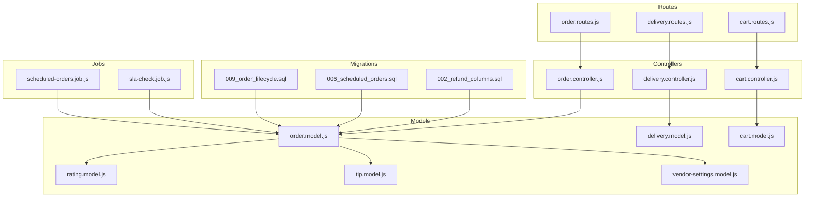

**Diagram sources**
- [order.controller.js:1-513](file://apps/server/controllers/order.controller.js#L1-L513)
- [delivery.controller.js:1-313](file://apps/server/controllers/delivery.controller.js#L1-L313)
- [cart.controller.js:1-83](file://apps/server/controllers/cart.controller.js#L1-L83)
- [order.model.js:1-178](file://apps/server/models/order.model.js#L1-L178)
- [delivery.model.js:1-98](file://apps/server/models/delivery.model.js#L1-L98)
- [cart.model.js:1-124](file://apps/server/models/cart.model.js#L1-L124)
- [rating.model.js:1-59](file://apps/server/models/rating.model.js#L1-L59)
- [tip.model.js:1-44](file://apps/server/models/tip.model.js#L1-L44)
- [vendor-settings.model.js:1-51](file://apps/server/models/vendor-settings.model.js#L1-L51)
- [order.routes.js:1-39](file://apps/server/routes/order.routes.js#L1-L39)
- [delivery.routes.js:1-31](file://apps/server/routes/delivery.routes.js#L1-L31)
- [cart.routes.js:1-22](file://apps/server/routes/cart.routes.js#L1-L22)
- [009_order_lifecycle.sql:1-53](file://apps/server/migrations/009_order_lifecycle.sql#L1-L53)
- [006_scheduled_orders.sql:1-19](file://apps/server/migrations/006_scheduled_orders.sql#L1-L19)
- [002_refund_columns.sql:1-17](file://apps/server/migrations/002_refund_columns.sql#L1-L17)
- [scheduled-orders.job.js:1-49](file://apps/server/jobs/scheduled-orders.job.js#L1-L49)
- [sla-check.job.js:1-59](file://apps/server/jobs/sla-check.job.js#L1-L59)

**Section sources**
- [order.controller.js:1-513](file://apps/server/controllers/order.controller.js#L1-L513)
- [delivery.controller.js:1-313](file://apps/server/controllers/delivery.controller.js#L1-L313)
- [cart.controller.js:1-83](file://apps/server/controllers/cart.controller.js#L1-L83)
- [order.routes.js:1-39](file://apps/server/routes/order.routes.js#L1-L39)
- [delivery.routes.js:1-31](file://apps/server/routes/delivery.routes.js#L1-L31)
- [cart.routes.js:1-22](file://apps/server/routes/cart.routes.js#L1-L22)

## Core Components
This section documents the core data models and their responsibilities.

- Orders table lifecycle and state machine
  - Statuses: placed, accepted, rejected, preparing, ready, assigned, picked_up, arrived, completed, cancelled, scheduled
  - Validation and transitions enforced by the state machine
  - Payment integration fields: payment_intent_id, total_cents, payment_status
  - SLA monitoring: sla_deadline, sla_breached
  - Scheduling: scheduled_for
  - Refund tracking: refund_amount_cents, refund_reason, cancellation_reason, cancelled_by
  - Vendor settings influence acceptance and SLA deadlines

- Deliveries table and rider assignment
  - Statuses: pending, assigned, picked_up, arrived, delivered
  - Rider assignment and reassignment logic
  - Location logging for rider tracking
  - External rider assignment support

- Cart system
  - cart_sessions and cart_items for guest and authenticated ordering
  - Itemization, pricing calculations, and merging on login
  - Session management and cleanup

- Supporting entities
  - Ratings and Tips tables for order feedback and incentives
  - Vendor settings for delivery mode and preparation defaults

**Section sources**
- [order.model.js:7-21](file://apps/server/models/order.model.js#L7-L21)
- [order.model.js:56-93](file://apps/server/models/order.model.js#L56-L93)
- [order.model.js:141-155](file://apps/server/models/order.model.js#L141-L155)
- [delivery.model.js:7-8](file://apps/server/models/delivery.model.js#L7-L8)
- [delivery.model.js:37-47](file://apps/server/models/delivery.model.js#L37-L47)
- [cart.model.js:12-24](file://apps/server/models/cart.model.js#L12-L24)
- [cart.model.js:26-40](file://apps/server/models/cart.model.js#L26-L40)
- [009_order_lifecycle.sql:14-34](file://apps/server/migrations/009_order_lifecycle.sql#L14-L34)
- [006_scheduled_orders.sql:4-18](file://apps/server/migrations/006_scheduled_orders.sql#L4-L18)
- [002_refund_columns.sql:4-16](file://apps/server/migrations/002_refund_columns.sql#L4-L16)

## Architecture Overview
The system follows a layered architecture:
- Routes define the API surface and enforce authentication/authorization
- Controllers orchestrate business logic and coordinate models/services
- Models encapsulate database operations and enforce invariants
- Jobs handle periodic tasks (scheduled order transitions and SLA breach detection)
- Real-time updates are broadcast via WebSocket

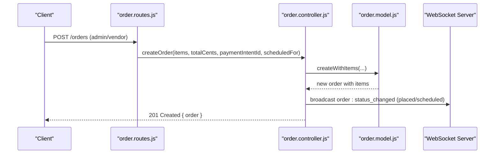

**Diagram sources**
- [order.routes.js:17-18](file://apps/server/routes/order.routes.js#L17-L18)
- [order.controller.js:86-138](file://apps/server/controllers/order.controller.js#L86-L138)
- [order.model.js:56-93](file://apps/server/models/order.model.js#L56-L93)

## Detailed Component Analysis

### Orders Data Model and Lifecycle
The Orders model defines the complete lifecycle, payment integration, and SLA tracking. It enforces valid transitions and supports scheduled orders, refunds, cancellations, and rejection.

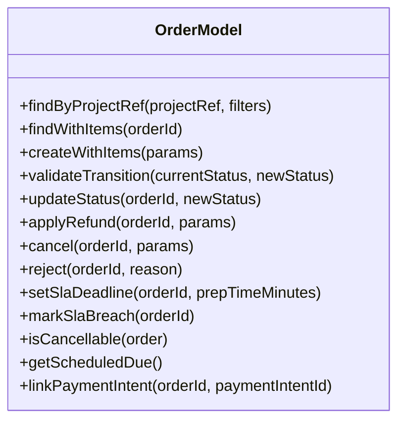

**Diagram sources**
- [order.model.js:25-175](file://apps/server/models/order.model.js#L25-L175)

Key lifecycle behaviors:
- Scheduled orders automatically transition to placed when the scheduled time arrives
- SLA deadline is computed from prep time; breaches are detected periodically
- Payment linkage updates payment status to paid
- Refunds update payment_status and track amounts and reasons
- Cancellations depend on cancellable statuses and may trigger automatic refunds

**Section sources**
- [order.model.js:7-21](file://apps/server/models/order.model.js#L7-L21)
- [order.model.js:95-103](file://apps/server/models/order.model.js#L95-L103)
- [order.model.js:105-113](file://apps/server/models/order.model.js#L105-L113)
- [order.model.js:115-122](file://apps/server/models/order.model.js#L115-L122)
- [order.model.js:124-139](file://apps/server/models/order.model.js#L124-L139)
- [order.model.js:141-155](file://apps/server/models/order.model.js#L141-L155)
- [order.model.js:161-166](file://apps/server/models/order.model.js#L161-L166)
- [order.model.js:168-174](file://apps/server/models/order.model.js#L168-L174)

### Orders State Machine and Transitions
The state machine defines allowed transitions and cancellable states.

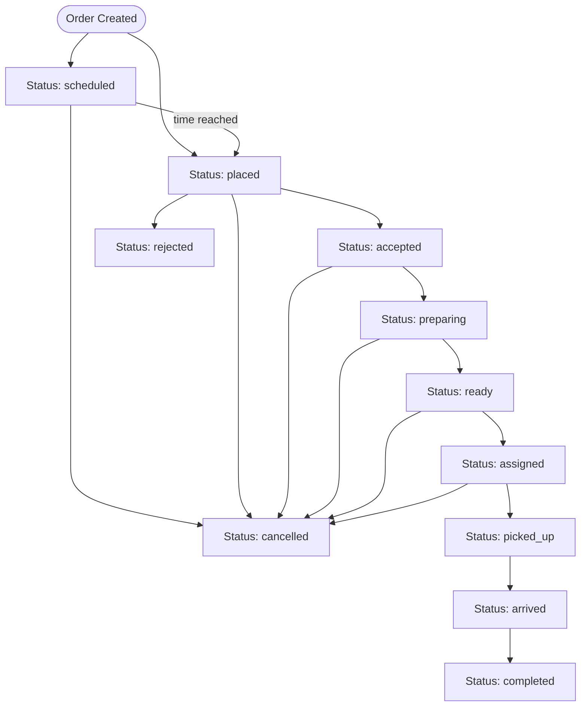

**Diagram sources**
- [order.model.js:12-21](file://apps/server/models/order.model.js#L12-L21)

**Section sources**
- [order.model.js:12-21](file://apps/server/models/order.model.js#L12-L21)
- [order.model.js:23-23](file://apps/server/models/order.model.js#L23-L23)

### Payment Integration Fields
- payment_intent_id: links to external payment provider
- total_cents: order total in cents
- payment_status: unpaid, paid, refunded, partially_refunded
- Refund tracking: refund_amount_cents, refund_reason
- Cancellation metadata: cancellation_reason, cancelled_by

Constraints and migrations ensure data integrity for payment states and refund fields.

**Section sources**
- [order.model.js:67-68](file://apps/server/models/order.model.js#L67-L68)
- [order.model.js:116-121](file://apps/server/models/order.model.js#L116-L121)
- [order.model.js:125-129](file://apps/server/models/order.model.js#L125-L129)
- [order.model.js:134-138](file://apps/server/models/order.model.js#L134-L138)
- [002_refund_columns.sql:4-16](file://apps/server/migrations/002_refund_columns.sql#L4-L16)

### SLA Monitoring
- prep_time_minutes: configured preparation time
- sla_deadline: computed deadline timestamp
- sla_breached: boolean flag for SLA violations
- Background job detects overdue orders and marks breaches

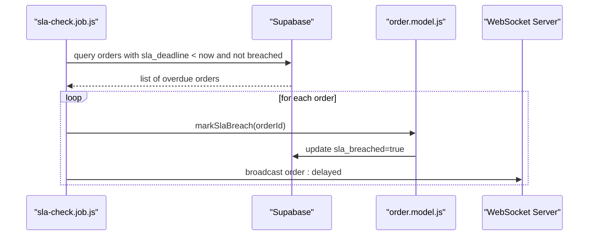

**Diagram sources**
- [sla-check.job.js:15-52](file://apps/server/jobs/sla-check.job.js#L15-L52)
- [order.model.js:150-154](file://apps/server/models/order.model.js#L150-L154)

**Section sources**
- [order.model.js:141-148](file://apps/server/models/order.model.js#L141-L148)
- [order.model.js:150-155](file://apps/server/models/order.model.js#L150-L155)
- [sla-check.job.js:15-52](file://apps/server/jobs/sla-check.job.js#L15-L52)

### Deliveries Relationship and Assignment Logic
Each order has one associated delivery record. The delivery model manages assignment, status updates, and rider location logging.

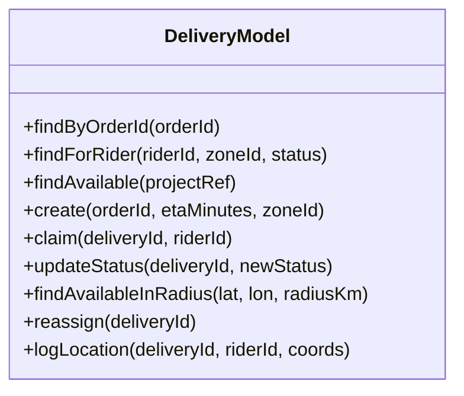

**Diagram sources**
- [delivery.model.js:9-95](file://apps/server/models/delivery.model.js#L9-L95)

Assignment and tracking:
- Riders claim deliveries with optimistic locking to prevent race conditions
- Status updates propagate to clients via WebSocket
- Rider locations are cached and broadcast for tracking

**Section sources**
- [delivery.model.js:14-17](file://apps/server/models/delivery.model.js#L14-L17)
- [delivery.model.js:29-35](file://apps/server/models/delivery.model.js#L29-L35)
- [delivery.model.js:37-47](file://apps/server/models/delivery.model.js#L37-L47)
- [delivery.model.js:49-55](file://apps/server/models/delivery.model.js#L49-L55)
- [delivery.model.js:57-66](file://apps/server/models/delivery.model.js#L57-L66)
- [delivery.model.js:83-94](file://apps/server/models/delivery.model.js#L83-L94)

### Cart System: Guest and Authenticated Ordering
The cart system supports guest sessions and merges into authenticated customer carts upon login.

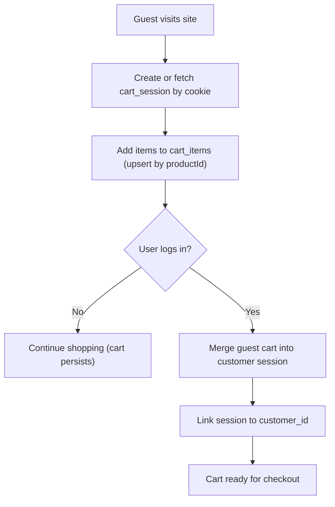

**Diagram sources**
- [cart.controller.js:9-16](file://apps/server/controllers/cart.controller.js#L9-L16)
- [cart.controller.js:59-80](file://apps/server/controllers/cart.controller.js#L59-L80)
- [cart.model.js:12-24](file://apps/server/models/cart.model.js#L12-L24)
- [cart.model.js:26-40](file://apps/server/models/cart.model.js#L26-L40)
- [cart.model.js:92-106](file://apps/server/models/cart.model.js#L92-L106)

Pricing and itemization:
- Total is calculated as sum of unit_price_cents × quantity
- Items are returned with session context for checkout

**Section sources**
- [cart.model.js:35-37](file://apps/server/models/cart.model.js#L35-L37)
- [cart.controller.js:18-26](file://apps/server/controllers/cart.controller.js#L18-L26)
- [cart.controller.js:28-37](file://apps/server/controllers/cart.controller.js#L28-L37)
- [cart.controller.js:39-57](file://apps/server/controllers/cart.controller.js#L39-L57)
- [cart.controller.js:59-80](file://apps/server/controllers/cart.controller.js#L59-L80)

### Order Itemization and Pricing Calculations
Order creation accepts items with product identifiers, names, quantities, and unit prices in cents. The system constructs order_items records and returns the order with embedded items for display and checkout.

**Section sources**
- [order.model.js:80-90](file://apps/server/models/order.model.js#L80-L90)
- [order.controller.js:86-97](file://apps/server/controllers/order.controller.js#L86-L97)

### Scheduling Capabilities
Scheduled orders are supported with a scheduled_for timestamp. A background job periodically transitions overdue scheduled orders to placed, aligning with the lifecycle state machine.

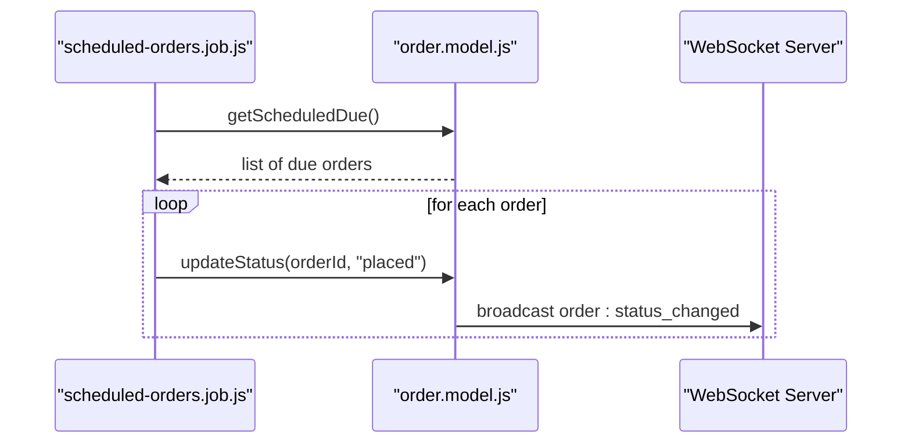

**Diagram sources**
- [scheduled-orders.job.js:13-42](file://apps/server/jobs/scheduled-orders.job.js#L13-L42)
- [order.model.js:161-166](file://apps/server/models/order.model.js#L161-L166)
- [order.model.js:20-21](file://apps/server/models/order.model.js#L20-L21)

**Section sources**
- [006_scheduled_orders.sql:4-18](file://apps/server/migrations/006_scheduled_orders.sql#L4-L18)
- [scheduled-orders.job.js:13-42](file://apps/server/jobs/scheduled-orders.job.js#L13-L42)

### Refund and Cancellation Workflows
Refund workflow:
- Validates payment status is paid
- Calls payment service to process refund
- Updates order payment_status and refund metadata

Cancellation workflow:
- Enforces cancellable statuses
- Supports customer-initiated cancellations and admin/vendor actions
- Automatically refunds paid orders and updates payment_status

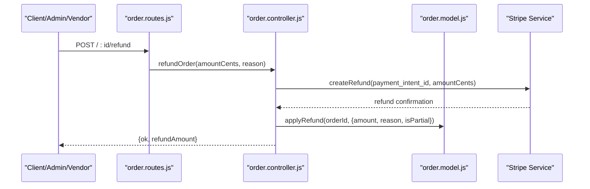

**Diagram sources**
- [order.routes.js:24-25](file://apps/server/routes/order.routes.js#L24-L25)
- [order.controller.js:195-234](file://apps/server/controllers/order.controller.js#L195-L234)
- [order.model.js:115-122](file://apps/server/models/order.model.js#L115-L122)

**Section sources**
- [order.controller.js:195-234](file://apps/server/controllers/order.controller.js#L195-L234)
- [order.controller.js:238-296](file://apps/server/controllers/order.controller.js#L238-L296)
- [order.model.js:115-122](file://apps/server/models/order.model.js#L115-L122)
- [order.model.js:124-131](file://apps/server/models/order.model.js#L124-L131)
- [002_refund_columns.sql:4-8](file://apps/server/migrations/002_refund_columns.sql#L4-L8)

### Delivery Assignment Logic and Rider Tracking
Rider assignment:
- Riders claim deliveries with optimistic locking
- Status transitions to assigned after successful claim
- External riders can be assigned with contact details

Rider tracking:
- Location updates are rate-limited and cached
- Broadcasts location updates to clients
- Availability cache enables dispatch matching

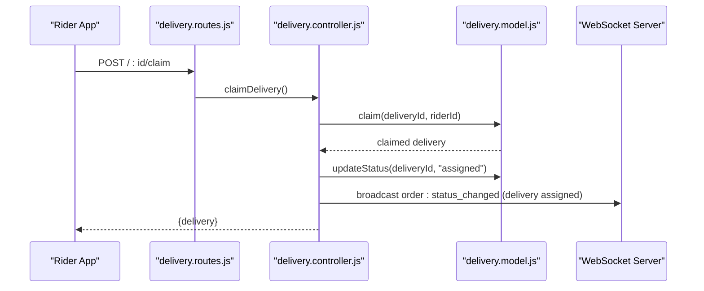

**Diagram sources**
- [delivery.routes.js:16-16](file://apps/server/routes/delivery.routes.js#L16-L16)
- [delivery.controller.js:25-52](file://apps/server/controllers/delivery.controller.js#L25-L52)
- [delivery.model.js:49-55](file://apps/server/models/delivery.model.js#L49-L55)

**Section sources**
- [delivery.controller.js:25-52](file://apps/server/controllers/delivery.controller.js#L25-L52)
- [delivery.controller.js:185-220](file://apps/server/controllers/delivery.controller.js#L185-L220)
- [delivery.controller.js:262-299](file://apps/server/controllers/delivery.controller.js#L262-L299)
- [delivery.controller.js:80-114](file://apps/server/controllers/delivery.controller.js#L80-L114)
- [delivery.model.js:49-55](file://apps/server/models/delivery.model.js#L49-L55)
- [delivery.model.js:74-81](file://apps/server/models/delivery.model.js#L74-L81)
- [delivery.model.js:83-94](file://apps/server/models/delivery.model.js#L83-L94)

### Order Fulfillment Analytics
Supporting entities enable analytics:
- Ratings: order_id, from_user_id, to_user_id, to_role, rating, comment
- Tips: order_id, from_customer_id, to_rider_id, amount_cents
- Vendor settings: delivery_mode, default_prep_time_minutes, delivery_radius_km

These tables provide insights into customer satisfaction, rider incentives, and operational metrics.

**Section sources**
- [009_order_lifecycle.sql:15-34](file://apps/server/migrations/009_order_lifecycle.sql#L15-L34)
- [rating.model.js:14-32](file://apps/server/models/rating.model.js#L14-L32)
- [tip.model.js:12-25](file://apps/server/models/tip.model.js#L12-L25)
- [vendor-settings.model.js:14-47](file://apps/server/models/vendor-settings.model.js#L14-L47)

## Dependency Analysis
The following diagram shows key dependencies among controllers, models, and supporting services.

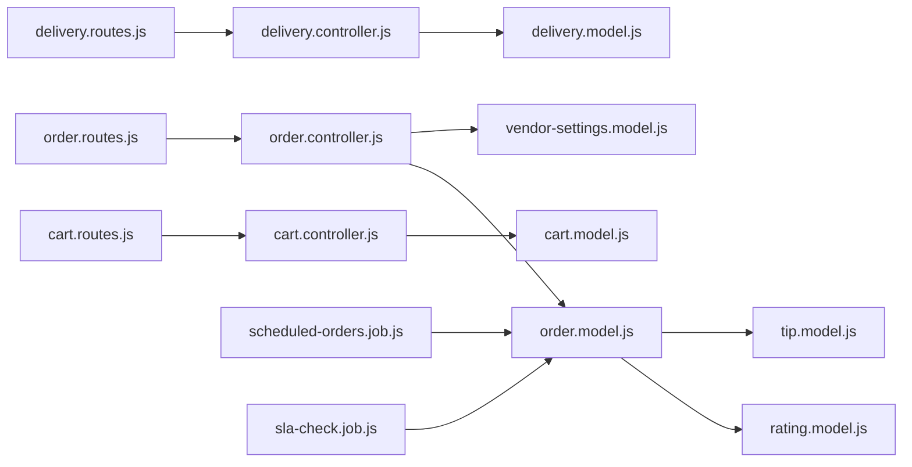

**Diagram sources**
- [order.routes.js:1-39](file://apps/server/routes/order.routes.js#L1-L39)
- [delivery.routes.js:1-31](file://apps/server/routes/delivery.routes.js#L1-L31)
- [cart.routes.js:1-22](file://apps/server/routes/cart.routes.js#L1-L22)
- [order.controller.js:1-15](file://apps/server/controllers/order.controller.js#L1-L15)
- [delivery.controller.js:1-9](file://apps/server/controllers/delivery.controller.js#L1-L9)
- [cart.controller.js:1-7](file://apps/server/controllers/cart.controller.js#L1-L7)
- [order.model.js:1-6](file://apps/server/models/order.model.js#L1-L6)
- [delivery.model.js:1-6](file://apps/server/models/delivery.model.js#L1-L6)
- [cart.model.js:1-6](file://apps/server/models/cart.model.js#L1-L6)
- [vendor-settings.model.js:1-6](file://apps/server/models/vendor-settings.model.js#L1-L6)
- [rating.model.js:1-6](file://apps/server/models/rating.model.js#L1-L6)
- [tip.model.js:1-6](file://apps/server/models/tip.model.js#L1-L6)
- [scheduled-orders.job.js:1-8](file://apps/server/jobs/scheduled-orders.job.js#L1-L8)
- [sla-check.job.js:1-9](file://apps/server/jobs/sla-check.job.js#L1-L9)

**Section sources**
- [order.controller.js:1-15](file://apps/server/controllers/order.controller.js#L1-L15)
- [delivery.controller.js:1-9](file://apps/server/controllers/delivery.controller.js#L1-L9)
- [cart.controller.js:1-7](file://apps/server/controllers/cart.controller.js#L1-L7)

## Performance Considerations
- Use indexes on frequently filtered columns (e.g., idx_orders_scheduled for scheduled orders)
- Batch processing in background jobs with locking to avoid contention
- Limit real-time broadcasts to essential events to reduce bandwidth
- Cache rider locations and availability to minimize repeated queries
- Validate and constrain payment states to maintain referential integrity

[No sources needed since this section provides general guidance]

## Troubleshooting Guide
Common issues and resolutions:
- Invalid status transitions: Ensure new status is allowed from current status per state machine
- Access denied errors: Verify caller role and project context
- Delivery already claimed: Optimistic locking prevents race conditions; retry if needed
- Location update throttling: Respect rate limits for location updates
- SLA breach notifications: Confirm SLA job is running and orders meet criteria

**Section sources**
- [order.controller.js:142-191](file://apps/server/controllers/order.controller.js#L142-L191)
- [delivery.controller.js:25-52](file://apps/server/controllers/delivery.controller.js#L25-L52)
- [delivery.controller.js:80-114](file://apps/server/controllers/delivery.controller.js#L80-L114)
- [sla-check.job.js:15-52](file://apps/server/jobs/sla-check.job.js#L15-L52)

## Conclusion
The order and delivery management system provides a robust, event-driven architecture with strong lifecycle enforcement, payment integration, SLA monitoring, and real-time delivery tracking. The separation of concerns across routes, controllers, and models, combined with background jobs and supporting analytics tables, delivers a scalable foundation for order fulfillment and rider operations.