# System Infrastructure

<cite>
**Referenced Files in This Document**
- [audit.js](file://apps/server/lib/audit.js)
- [geo.js](file://apps/server/lib/geo.js)
- [redis.js](file://apps/server/lib/redis.js)
- [supabase.js](file://apps/server/lib/supabase.js)
- [logger.js](file://apps/server/lib/logger.js)
- [index.js](file://apps/server/config/index.js)
- [007_audit_log.sql](file://apps/server/migrations/007_audit_log.sql)
- [008_indexes.sql](file://apps/server/migrations/008_indexes.sql)
- [000_core_schema.sql](file://apps/server/migrations/000_core_schema.sql)
- [003_rider_locations.sql](file://apps/server/migrations/003_rider_locations.sql)
- [005_conversations_messages.sql](file://apps/server/migrations/005_conversations_messages.sql)
- [location-flush.job.js](file://apps/server/jobs/location-flush.job.js)
- [radius-expansion.job.js](file://apps/server/jobs/radius-expansion.job.js)
- [memory-session-store.js](file://apps/server/services/memory-session-store.js)
- [redis-session-store.js](file://apps/server/services/redis-session-store.js)
</cite>

## Table of Contents
1. [Introduction](#introduction)
2. [Project Structure](#project-structure)
3. [Core Components](#core-components)
4. [Architecture Overview](#architecture-overview)
5. [Detailed Component Analysis](#detailed-component-analysis)
6. [Dependency Analysis](#dependency-analysis)
7. [Performance Considerations](#performance-considerations)
8. [Troubleshooting Guide](#troubleshooting-guide)
9. [Conclusion](#conclusion)
10. [Appendices](#appendices)

## Introduction
This document describes the system infrastructure tables and utilities that underpin compliance, location-aware dispatch, caching, session management, logging, and operational observability. It focuses on:
- Audit Log table for compliance tracking, user actions, and system changes
- Geographic utilities for distance calculations and proximity-based dispatch
- Redis integration for caching, session management, and real-time data persistence
- Database indexing strategies and performance optimization patterns
- Monitoring, error tracking, and operational metrics storage
- Data retention policies, backup strategies, and system health monitoring capabilities

## Project Structure
The infrastructure spans several layers:
- Migrations define canonical database schemas and indexes
- Libraries encapsulate database access, logging, Redis connectivity, and geographic utilities
- Jobs orchestrate periodic tasks for location flushing and radius expansion
- Services implement session stores (memory and Redis-backed)
- Configuration centralizes environment-driven settings

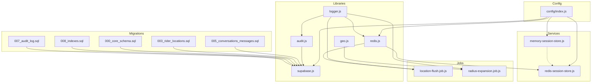

**Diagram sources**
- [007_audit_log.sql:1-24](file://apps/server/migrations/007_audit_log.sql#L1-L24)
- [008_indexes.sql:1-10](file://apps/server/migrations/008_indexes.sql#L1-L10)
- [000_core_schema.sql:1-165](file://apps/server/migrations/000_core_schema.sql#L1-L165)
- [003_rider_locations.sql:1-23](file://apps/server/migrations/003_rider_locations.sql#L1-L23)
- [005_conversations_messages.sql:1-33](file://apps/server/migrations/005_conversations_messages.sql#L1-L33)
- [supabase.js:1-151](file://apps/server/lib/supabase.js#L1-L151)
- [audit.js:1-35](file://apps/server/lib/audit.js#L1-L35)
- [geo.js:1-15](file://apps/server/lib/geo.js#L1-L15)
- [redis.js:1-42](file://apps/server/lib/redis.js#L1-L42)
- [logger.js:1-36](file://apps/server/lib/logger.js#L1-L36)
- [location-flush.job.js:1-60](file://apps/server/jobs/location-flush.job.js#L1-L60)
- [radius-expansion.job.js:1-87](file://apps/server/jobs/radius-expansion.job.js#L1-L87)
- [memory-session-store.js:1-46](file://apps/server/services/memory-session-store.js#L1-L46)
- [redis-session-store.js:1-37](file://apps/server/services/redis-session-store.js#L1-L37)
- [index.js:1-117](file://apps/server/config/index.js#L1-L117)

**Section sources**
- [007_audit_log.sql:1-24](file://apps/server/migrations/007_audit_log.sql#L1-L24)
- [008_indexes.sql:1-10](file://apps/server/migrations/008_indexes.sql#L1-L10)
- [000_core_schema.sql:1-165](file://apps/server/migrations/000_core_schema.sql#L1-L165)
- [003_rider_locations.sql:1-23](file://apps/server/migrations/003_rider_locations.sql#L1-L23)
- [005_conversations_messages.sql:1-33](file://apps/server/migrations/005_conversations_messages.sql#L1-L33)
- [supabase.js:1-151](file://apps/server/lib/supabase.js#L1-L151)
- [audit.js:1-35](file://apps/server/lib/audit.js#L1-L35)
- [geo.js:1-15](file://apps/server/lib/geo.js#L1-L15)
- [redis.js:1-42](file://apps/server/lib/redis.js#L1-L42)
- [logger.js:1-36](file://apps/server/lib/logger.js#L1-L36)
- [location-flush.job.js:1-60](file://apps/server/jobs/location-flush.job.js#L1-L60)
- [radius-expansion.job.js:1-87](file://apps/server/jobs/radius-expansion.job.js#L1-L87)
- [memory-session-store.js:1-46](file://apps/server/services/memory-session-store.js#L1-L46)
- [redis-session-store.js:1-37](file://apps/server/services/redis-session-store.js#L1-L37)
- [index.js:1-117](file://apps/server/config/index.js#L1-L117)

## Core Components
- Audit logging: Non-blocking write to audit_log with user context, action, resource, and details.
- Geographic utilities: Haversine distance calculation for proximity checks.
- Redis integration: Lazy client initialization with retry/backoff, event logging, and session stores.
- Database access: Centralized Supabase REST/Management API wrapper with safe query builders.
- Logging: Structured Winston logger with console transport and environment-aware formatting.
- Background jobs: Location flushing and radius expansion with distributed locking and rate limiting.

**Section sources**
- [audit.js:1-35](file://apps/server/lib/audit.js#L1-L35)
- [geo.js:1-15](file://apps/server/lib/geo.js#L1-L15)
- [redis.js:1-42](file://apps/server/lib/redis.js#L1-L42)
- [supabase.js:1-151](file://apps/server/lib/supabase.js#L1-L151)
- [logger.js:1-36](file://apps/server/lib/logger.js#L1-L36)
- [location-flush.job.js:1-60](file://apps/server/jobs/location-flush.job.js#L1-L60)
- [radius-expansion.job.js:1-87](file://apps/server/jobs/radius-expansion.job.js#L1-L87)

## Architecture Overview
The infrastructure integrates database migrations, a Supabase abstraction layer, Redis-backed caching and sessions, geographic utilities, and background jobs. The following diagram maps the major components and their interactions.

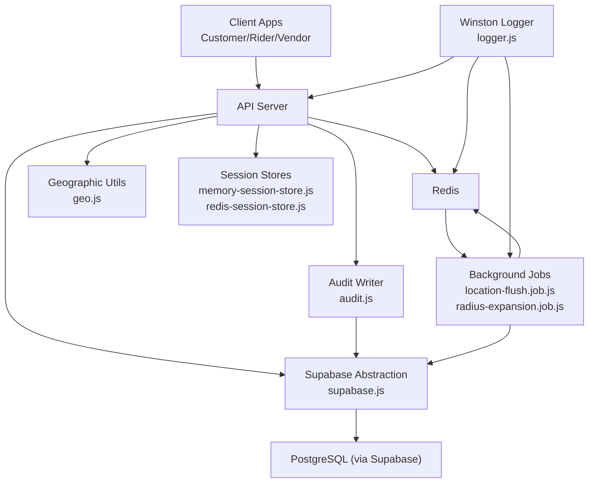

**Diagram sources**
- [supabase.js:1-151](file://apps/server/lib/supabase.js#L1-L151)
- [audit.js:1-35](file://apps/server/lib/audit.js#L1-L35)
- [geo.js:1-15](file://apps/server/lib/geo.js#L1-L15)
- [redis.js:1-42](file://apps/server/lib/redis.js#L1-L42)
- [logger.js:1-36](file://apps/server/lib/logger.js#L1-L36)
- [location-flush.job.js:1-60](file://apps/server/jobs/location-flush.job.js#L1-L60)
- [radius-expansion.job.js:1-87](file://apps/server/jobs/radius-expansion.job.js#L1-L87)
- [memory-session-store.js:1-46](file://apps/server/services/memory-session-store.js#L1-L46)
- [redis-session-store.js:1-37](file://apps/server/services/redis-session-store.js#L1-L37)

## Detailed Component Analysis

### Audit Log Data Model and Utilities
- Data model: audit_log captures user identity, action, resource context, IP, and structured details with timestamps.
- Indexing: Composite and time-based indexes optimize filtering and chronological queries.
- Audit writer: Non-blocking insertion with JSON serialization of details and robust error logging.

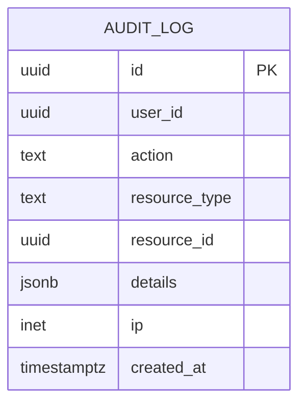

**Diagram sources**
- [007_audit_log.sql:4-13](file://apps/server/migrations/007_audit_log.sql#L4-L13)

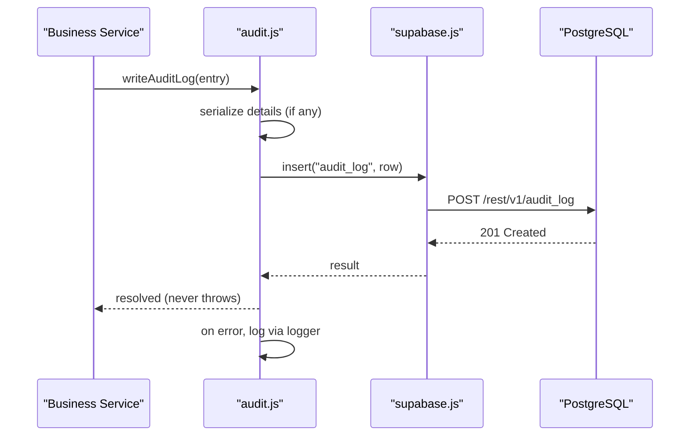

**Diagram sources**
- [audit.js:18-32](file://apps/server/lib/audit.js#L18-L32)
- [supabase.js:122-127](file://apps/server/lib/supabase.js#L122-L127)
- [logger.js:1-36](file://apps/server/lib/logger.js#L1-L36)

Operational notes:
- Compliance: Timestamped entries with user context enable audit trails for regulatory reporting.
- Resilience: The writer swallows errors to prevent audit failures from breaking business logic.
- Query patterns: Indexes support filtering by user, action, resource, and time range.

**Section sources**
- [007_audit_log.sql:1-24](file://apps/server/migrations/007_audit_log.sql#L1-L24)
- [audit.js:1-35](file://apps/server/lib/audit.js#L1-L35)
- [supabase.js:1-151](file://apps/server/lib/supabase.js#L1-L151)
- [logger.js:1-36](file://apps/server/lib/logger.js#L1-L36)

### Geographic Utilities and Proximity-Based Dispatch
- Distance calculation: Haversine formula computes kilometers between two lat/lon pairs.
- Dispatch expansion: Periodic job expands search radius for stale pending deliveries and notifies nearby riders.

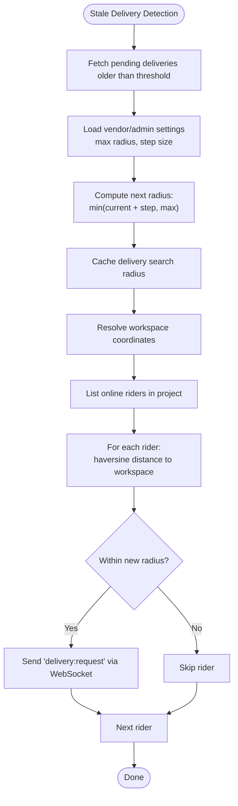

**Diagram sources**
- [radius-expansion.job.js:13-84](file://apps/server/jobs/radius-expansion.job.js#L13-L84)
- [geo.js:3-11](file://apps/server/lib/geo.js#L3-L11)

Operational notes:
- Rate limiting: Job runs periodically with distributed locks to avoid concurrent execution.
- Real-time signals: WebSocket notifications are sent to eligible riders within the expanded radius.

**Section sources**
- [radius-expansion.job.js:1-87](file://apps/server/jobs/radius-expansion.job.js#L1-L87)
- [geo.js:1-15](file://apps/server/lib/geo.js#L1-L15)

### Redis Integration for Caching and Sessions
- Client initialization: Lazy connect with retry strategy and connection event logging.
- Session stores:
  - Memory store: Development fallback with TTL pruning.
  - Redis store: Production-grade store with JSON serialization and TTL support.
- Location flushing: Background job reads cached rider positions from Redis and persists them to the audit table.

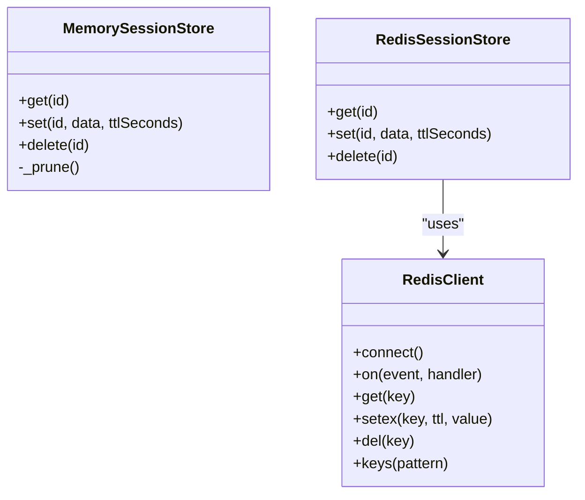

**Diagram sources**
- [redis.js:8-39](file://apps/server/lib/redis.js#L8-L39)
- [memory-session-store.js:7-43](file://apps/server/services/memory-session-store.js#L7-L43)
- [redis-session-store.js:7-34](file://apps/server/services/redis-session-store.js#L7-L34)

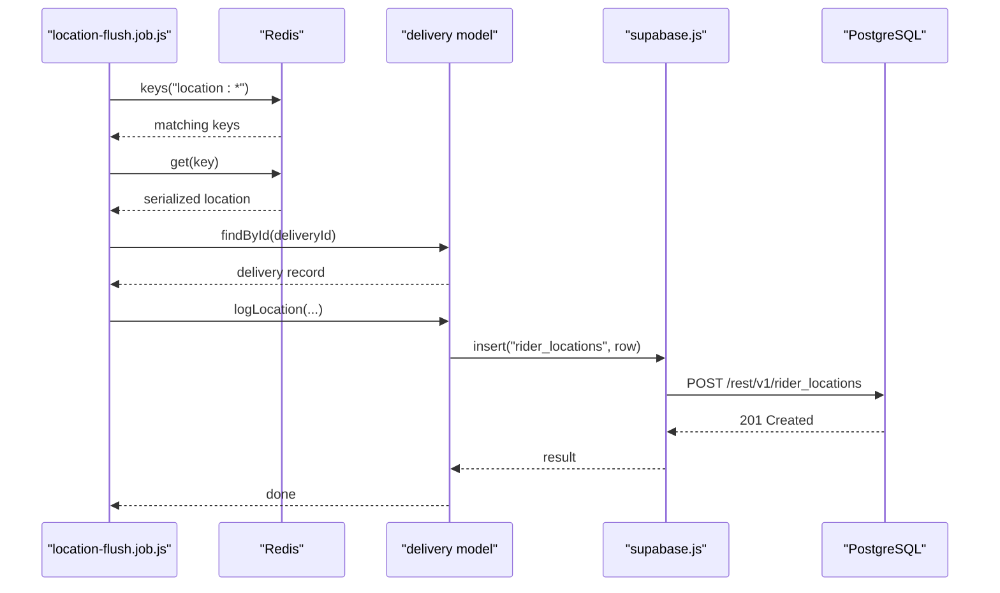

**Diagram sources**
- [location-flush.job.js:13-57](file://apps/server/jobs/location-flush.job.js#L13-L57)
- [redis.js:8-39](file://apps/server/lib/redis.js#L8-L39)
- [supabase.js:122-127](file://apps/server/lib/supabase.js#L122-L127)
- [003_rider_locations.sql:4-13](file://apps/server/migrations/003_rider_locations.sql#L4-L13)

Operational notes:
- Fallback behavior: If Redis URL is missing, the system logs a warning and avoids session persistence.
- Reliability: Retry strategy and reconnect-on-error reduce transient failure impact.

**Section sources**
- [redis.js:1-42](file://apps/server/lib/redis.js#L1-L42)
- [memory-session-store.js:1-46](file://apps/server/services/memory-session-store.js#L1-L46)
- [redis-session-store.js:1-37](file://apps/server/services/redis-session-store.js#L1-L37)
- [location-flush.job.js:1-60](file://apps/server/jobs/location-flush.job.js#L1-L60)
- [003_rider_locations.sql:1-23](file://apps/server/migrations/003_rider_locations.sql#L1-L23)

### Database Access Layer and Indexing Strategies
- Supabase abstraction: Centralized fetch helper, safe filter builder, and convenience CRUD wrappers.
- Indexing strategy: Hot-path indexes on foreign keys, status, timestamps, and composite resource keys.
- Core schema: Canonical tables for users, customers, orders, deliveries, cart, and conversations.

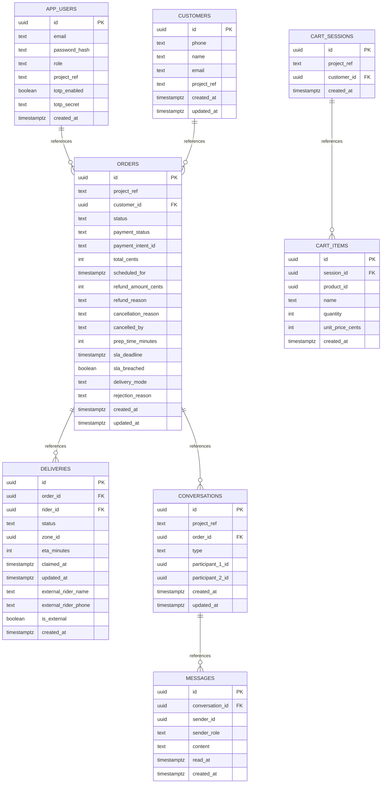

**Diagram sources**
- [000_core_schema.sql:9-165](file://apps/server/migrations/000_core_schema.sql#L9-L165)
- [005_conversations_messages.sql:4-33](file://apps/server/migrations/005_conversations_messages.sql#L4-L33)

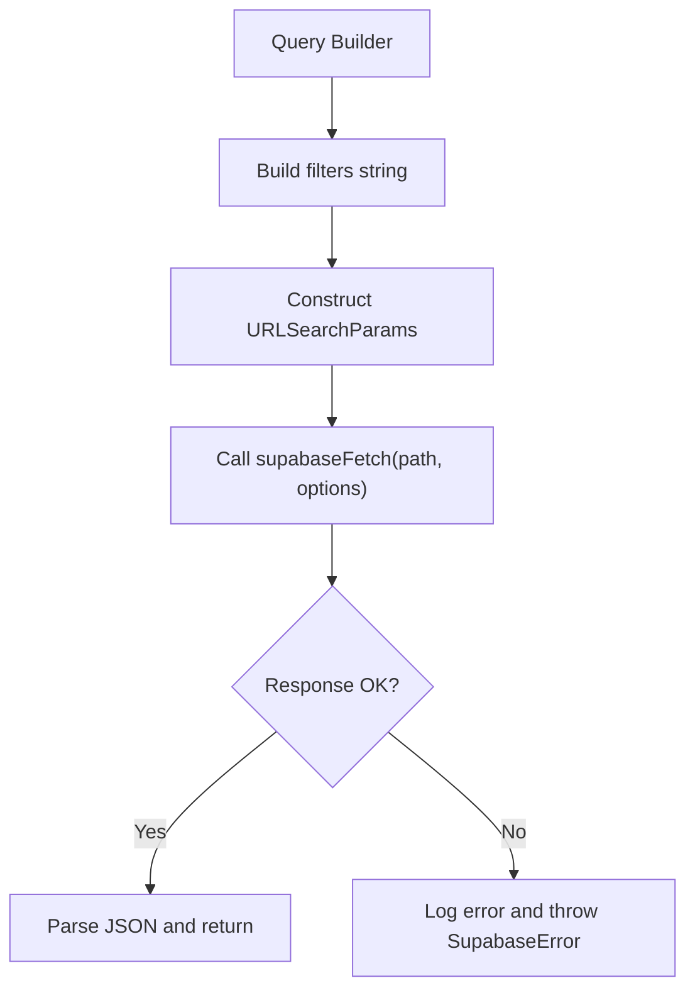

**Diagram sources**
- [supabase.js:93-117](file://apps/server/lib/supabase.js#L93-L117)
- [supabase.js:26-63](file://apps/server/lib/supabase.js#L26-L63)

Performance considerations:
- Hot-path indexes: project_ref, customer_id, status, created_at DESC, session_id.
- Resource-scoped queries: Composite indexes on resource_type/resource_id for audit_log.

**Section sources**
- [supabase.js:1-151](file://apps/server/lib/supabase.js#L1-L151)
- [008_indexes.sql:1-10](file://apps/server/migrations/008_indexes.sql#L1-L10)
- [007_audit_log.sql:15-18](file://apps/server/migrations/007_audit_log.sql#L15-L18)
- [000_core_schema.sql:1-165](file://apps/server/migrations/000_core_schema.sql#L1-L165)
- [005_conversations_messages.sql:1-33](file://apps/server/migrations/005_conversations_messages.sql#L1-L33)

### System Monitoring, Error Tracking, and Operational Metrics
- Logging: Winston logger configured with console transport, environment-aware formatting, and structured metadata.
- Error handling: Supabase fetch logs detailed error context; audit writer logs failures without throwing.
- Health monitoring: Redis client emits connect/error/close events; jobs log info/warn/error.

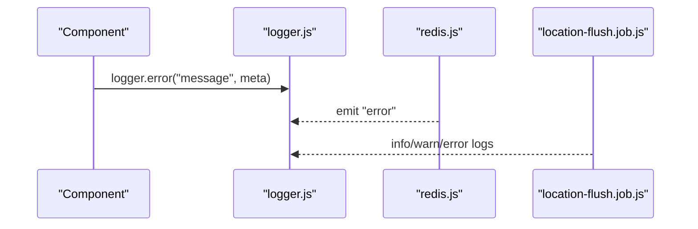

**Diagram sources**
- [logger.js:24-33](file://apps/server/lib/logger.js#L24-L33)
- [redis.js:34-36](file://apps/server/lib/redis.js#L34-L36)
- [location-flush.job.js:49-50](file://apps/server/jobs/location-flush.job.js#L49-L50)

Operational notes:
- Structured logs enable correlation with traces and dashboards.
- Redis events surface connectivity issues proactively.

**Section sources**
- [logger.js:1-36](file://apps/server/lib/logger.js#L1-L36)
- [redis.js:1-42](file://apps/server/lib/redis.js#L1-L42)
- [location-flush.job.js:1-60](file://apps/server/jobs/location-flush.job.js#L1-L60)

## Dependency Analysis
The following diagram highlights key dependencies among infrastructure components.

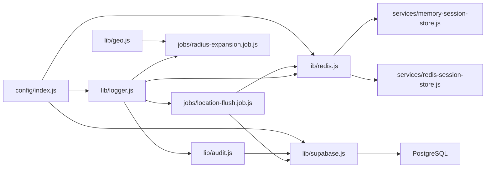

**Diagram sources**
- [index.js:1-117](file://apps/server/config/index.js#L1-L117)
- [redis.js:1-42](file://apps/server/lib/redis.js#L1-L42)
- [supabase.js:1-151](file://apps/server/lib/supabase.js#L1-L151)
- [logger.js:1-36](file://apps/server/lib/logger.js#L1-L36)
- [memory-session-store.js:1-46](file://apps/server/services/memory-session-store.js#L1-L46)
- [redis-session-store.js:1-37](file://apps/server/services/redis-session-store.js#L1-L37)
- [audit.js:1-35](file://apps/server/lib/audit.js#L1-L35)
- [geo.js:1-15](file://apps/server/lib/geo.js#L1-L15)
- [location-flush.job.js:1-60](file://apps/server/jobs/location-flush.job.js#L1-L60)
- [radius-expansion.job.js:1-87](file://apps/server/jobs/radius-expansion.job.js#L1-L87)

**Section sources**
- [index.js:1-117](file://apps/server/config/index.js#L1-L117)
- [redis.js:1-42](file://apps/server/lib/redis.js#L1-L42)
- [supabase.js:1-151](file://apps/server/lib/supabase.js#L1-L151)
- [logger.js:1-36](file://apps/server/lib/logger.js#L1-L36)
- [memory-session-store.js:1-46](file://apps/server/services/memory-session-store.js#L1-L46)
- [redis-session-store.js:1-37](file://apps/server/services/redis-session-store.js#L1-L37)
- [audit.js:1-35](file://apps/server/lib/audit.js#L1-L35)
- [geo.js:1-15](file://apps/server/lib/geo.js#L1-L15)
- [location-flush.job.js:1-60](file://apps/server/jobs/location-flush.job.js#L1-L60)
- [radius-expansion.job.js:1-87](file://apps/server/jobs/radius-expansion.job.js#L1-L87)

## Performance Considerations
- Index coverage:
  - Orders: project_ref, customer_id, status, created_at DESC
  - Deliveries: order_id, rider_id
  - Cart items: session_id
  - Audit log: user_id, action, resource_type/resource_id, created_at DESC
- Query patterns:
  - Use indexed columns for filters and sorts (e.g., status, created_at)
  - Leverage composite indexes for resource-scoped queries
- Redis performance:
  - Use TTL for ephemeral caches (e.g., session data)
  - Batch operations where feasible (e.g., bulk flush in jobs)
- Geographic scaling:
  - Precompute and cache derived metrics (e.g., delivery search radius)
  - Limit per-iteration work in jobs to avoid contention

[No sources needed since this section provides general guidance]

## Troubleshooting Guide
Common issues and diagnostics:
- Redis connectivity:
  - Symptoms: Warning about missing REDIS_URL; session store falls back to memory
  - Actions: Set REDIS_URL; monitor Redis events (connect/error/close)
- Audit log failures:
  - Symptoms: Errors logged but no crash
  - Actions: Inspect logger output; verify Supabase service key and network
- Job contention:
  - Symptoms: Jobs skip execution due to locks
  - Actions: Verify distributed lock acquisition; adjust intervals if needed
- Supabase errors:
  - Symptoms: Detailed error logs with status/body
  - Actions: Review Supabase dashboard; validate service key permissions

**Section sources**
- [redis.js:11-14](file://apps/server/lib/redis.js#L11-L14)
- [redis.js:34-36](file://apps/server/lib/redis.js#L34-L36)
- [audit.js:29-31](file://apps/server/lib/audit.js#L29-L31)
- [logger.js:47-59](file://apps/server/lib/logger.js#L47-L59)
- [location-flush.job.js:18-19](file://apps/server/jobs/location-flush.job.js#L18-L19)

## Conclusion
The system infrastructure combines a canonical database schema, a robust Supabase abstraction, Redis-backed caching and sessions, geographic utilities, and resilient background jobs. Together, these components provide:
- Compliance-ready audit trails with timestamped entries and user context
- Scalable proximity-based dispatch with incremental radius expansion
- Reliable caching and session management with production-grade Redis
- Indexed queries optimized for hot-path operations
- Observability through structured logging and Redis event hooks

[No sources needed since this section summarizes without analyzing specific files]

## Appendices

### Data Retention Policies
- Audit log retention: Define TTL or archival policy for audit_log rows to meet compliance requirements.
- Rider location history: Consider retention windows for rider_locations to balance SLA monitoring and storage costs.
- Chat messages: Apply project-level retention policies for conversations/messages.

[No sources needed since this section provides general guidance]

### Backup Strategies
- Database backups: Use managed PostgreSQL snapshot/backup features exposed by the hosting platform.
- Redis data: Enable persistence (AOF/RDB) or snapshotting depending on deployment; consider replication for HA.
- Application logs: Ship logs to centralized logging systems for long-term retention.

[No sources needed since this section provides general guidance]

### System Health Monitoring Capabilities
- Database: Monitor query latency, slow queries, and index usage via platform tools.
- Redis: Track connection counts, memory usage, command latency, and error rates.
- Jobs: Observe job runtime, success/failure rates, and lock contention.

[No sources needed since this section provides general guidance]