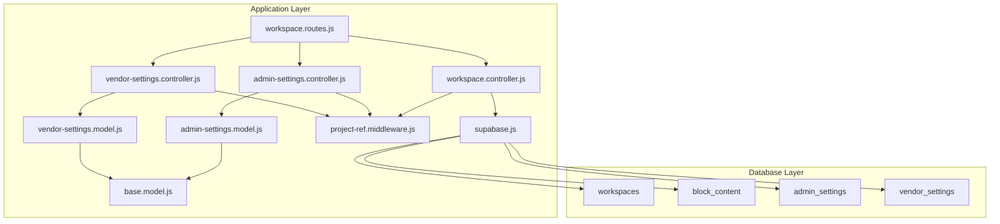
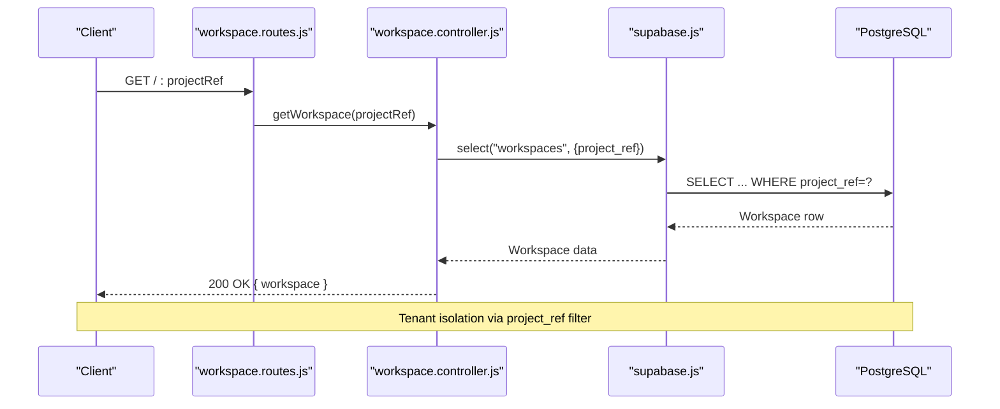
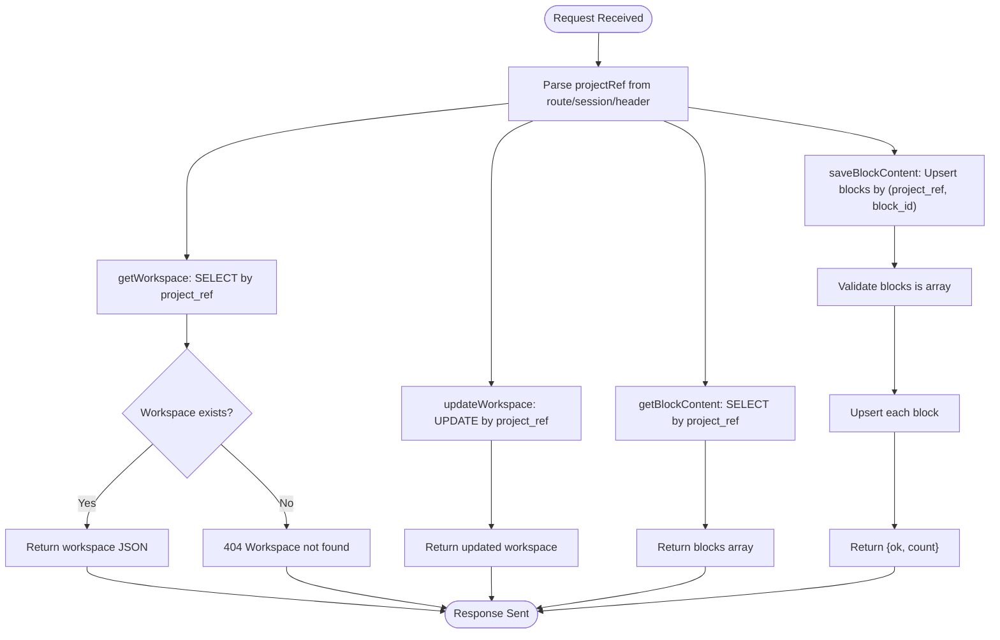
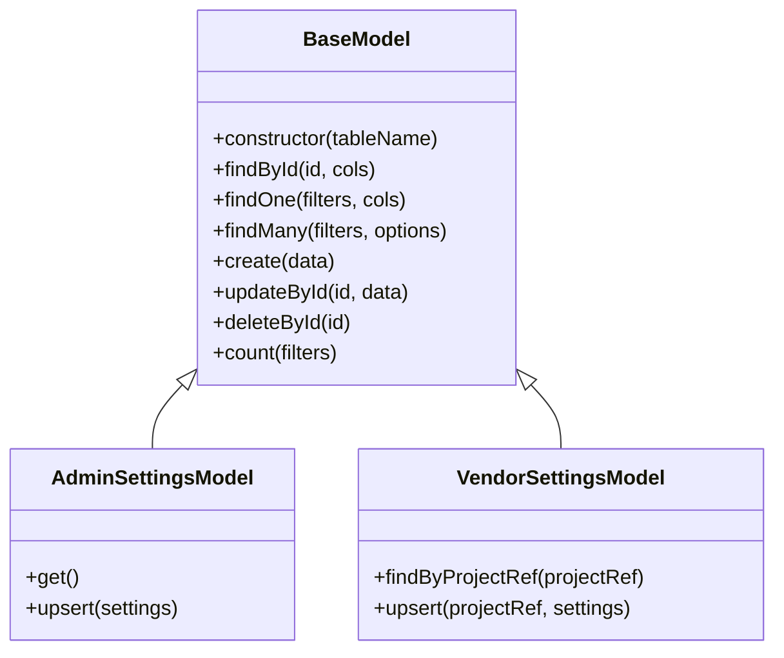
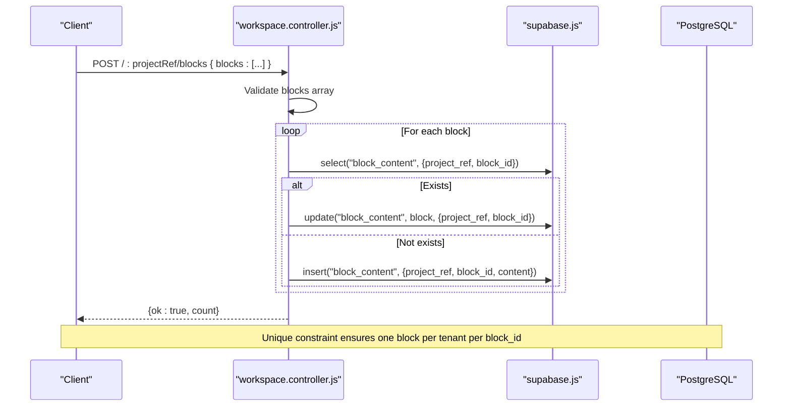
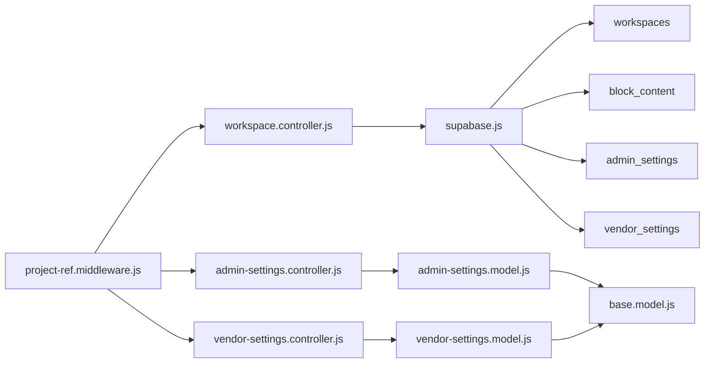

# Workspace Management

<cite>
**Referenced Files in This Document**
- [000_core_schema.sql](file://apps/server/migrations/000_core_schema.sql)
- [008_indexes.sql](file://apps/server/migrations/008_indexes.sql)
- [011_admin_settings.sql](file://apps/server/migrations/011_admin_settings.sql)
- [012_vendor_dispatch_delay.sql](file://apps/server/migrations/012_vendor_dispatch_delay.sql)
- [workspace.controller.js](file://apps/server/controllers/workspace.controller.js)
- [workspace.routes.js](file://apps/server/routes/workspace.routes.js)
- [admin-settings.controller.js](file://apps/server/controllers/admin-settings.controller.js)
- [vendor-settings.controller.js](file://apps/server/controllers/vendor-settings.controller.js)
- [admin-settings.model.js](file://apps/server/models/admin-settings.model.js)
- [vendor-settings.model.js](file://apps/server/models/vendor-settings.model.js)
- [base.model.js](file://apps/server/models/base.model.js)
- [project-ref.middleware.js](file://apps/server/middleware/project-ref.middleware.js)
- [supabase.js](file://apps/server/lib/supabase.js)
</cite>

## Table of Contents
1. [Introduction](#introduction)
2. [Project Structure](#project-structure)
3. [Core Components](#core-components)
4. [Architecture Overview](#architecture-overview)
5. [Detailed Component Analysis](#detailed-component-analysis)
6. [Dependency Analysis](#dependency-analysis)
7. [Performance Considerations](#performance-considerations)
8. [Troubleshooting Guide](#troubleshooting-guide)
9. [Conclusion](#conclusion)

## Introduction
This document provides comprehensive data model documentation for workspace management in Delivio. It covers the Workspaces table structure with project_ref multi-tenancy, business profile fields, location coordinates, and address information. It documents the BlockContent table for dynamic workspace content management using JSONB storage and block_id indexing. It explains VendorSettings and AdminSettings models for workspace configuration, dispatch delays, and operational parameters. The document also details workspace isolation patterns, data partitioning strategies, tenant-specific queries, settings management, content blocks architecture, and workspace lifecycle management.

## Project Structure
Workspace management spans several layers:
- Database schema and migrations define tables, constraints, and indexes
- Controllers handle HTTP endpoints for workspace and content operations
- Models encapsulate persistence logic and tenant-aware queries
- Middleware enforces authentication, authorization, and project reference attachment
- Supabase client library provides database abstraction and filtering

**Diagram sources**
- [workspace.routes.js:1-18](file://apps/server/routes/workspace.routes.js#L1-L18)
- [workspace.controller.js:1-72](file://apps/server/controllers/workspace.controller.js#L1-L72)
- [admin-settings.controller.js:1-30](file://apps/server/controllers/admin-settings.controller.js#L1-L30)
- [vendor-settings.controller.js:1-30](file://apps/server/controllers/vendor-settings.controller.js#L1-L30)
- [admin-settings.model.js:1-35](file://apps/server/models/admin-settings.model.js#L1-L35)
- [vendor-settings.model.js:1-51](file://apps/server/models/vendor-settings.model.js#L1-L51)
- [base.model.js:1-55](file://apps/server/models/base.model.js#L1-L55)
- [project-ref.middleware.js:1-36](file://apps/server/middleware/project-ref.middleware.js#L1-L36)
- [supabase.js:1-151](file://apps/server/lib/supabase.js#L1-L151)
- [000_core_schema.sql:37-65](file://apps/server/migrations/000_core_schema.sql#L37-L65)
- [011_admin_settings.sql:1-9](file://apps/server/migrations/011_admin_settings.sql#L1-L9)
- [012_vendor_dispatch_delay.sql:1-2](file://apps/server/migrations/012_vendor_dispatch_delay.sql#L1-L2)

**Section sources**
- [workspace.routes.js:1-18](file://apps/server/routes/workspace.routes.js#L1-L18)
- [workspace.controller.js:1-72](file://apps/server/controllers/workspace.controller.js#L1-L72)
- [admin-settings.controller.js:1-30](file://apps/server/controllers/admin-settings.controller.js#L1-L30)
- [vendor-settings.controller.js:1-30](file://apps/server/controllers/vendor-settings.controller.js#L1-L30)
- [admin-settings.model.js:1-35](file://apps/server/models/admin-settings.model.js#L1-L35)
- [vendor-settings.model.js:1-51](file://apps/server/models/vendor-settings.model.js#L1-L51)
- [base.model.js:1-55](file://apps/server/models/base.model.js#L1-L55)
- [project-ref.middleware.js:1-36](file://apps/server/middleware/project-ref.middleware.js#L1-L36)
- [supabase.js:1-151](file://apps/server/lib/supabase.js#L1-L151)
- [000_core_schema.sql:37-65](file://apps/server/migrations/000_core_schema.sql#L37-L65)
- [011_admin_settings.sql:1-9](file://apps/server/migrations/011_admin_settings.sql#L1-L9)
- [012_vendor_dispatch_delay.sql:1-2](file://apps/server/migrations/012_vendor_dispatch_delay.sql#L1-L2)

## Core Components
This section documents the core data structures and their relationships.

### Workspaces Table
The Workspaces table defines the vendor storefront profile with multi-tenant isolation via project_ref.

- Primary key: id (UUID)
- Tenant identifier: project_ref (text, unique, not null)
- Business profile fields:
  - name (text, not null)
  - description (text)
  - logo_url (text)
  - banner_url (text)
- Address and location:
  - address (text)
  - phone (text)
  - lat (decimal(10,8))
  - lon (decimal(11,8))
- Timestamps: created_at, updated_at (timestamptz)

Indexing:
- Unique index on project_ref for fast tenant lookup
- Additional index on project_ref for filtered queries

Isolation pattern:
- All workspace operations filter by project_ref to ensure tenant separation

**Section sources**
- [000_core_schema.sql:37-52](file://apps/server/migrations/000_core_schema.sql#L37-L52)
- [workspace.controller.js:6-24](file://apps/server/controllers/workspace.controller.js#L6-L24)

### BlockContent Table
The BlockContent table manages dynamic workspace content using JSONB storage with block_id indexing.

- Primary key: id (UUID)
- Tenant identifier: project_ref (text, not null)
- Content identification: block_id (text, not null)
- Content storage: content (jsonb)
- Constraints:
  - Unique constraint on (project_ref, block_id) ensuring per-tenant uniqueness of block identifiers
- Timestamps: created_at, updated_at (timestamptz)

Indexing:
- Index on project_ref for tenant-scoped queries
- Implicit unique index from the unique constraint on (project_ref, block_id)

Content architecture:
- JSONB enables flexible, schema-less content structures
- block_id serves as a logical key for content retrieval and updates

**Section sources**
- [000_core_schema.sql:54-65](file://apps/server/migrations/000_core_schema.sql#L54-L65)
- [workspace.controller.js:26-69](file://apps/server/controllers/workspace.controller.js#L26-L69)

### VendorSettings Model
VendorSettings stores per-tenant vendor configuration and operational parameters.

Fields:
- project_ref (via upsert mechanism)
- auto_accept (boolean, default false)
- default_prep_time_minutes (integer, default 20)
- delivery_mode (enum: 'third_party' or 'vendor_rider', default 'third_party')
- delivery_radius_km (float, default 5.0)
- auto_dispatch_delay_minutes (integer, default 0)
- Timestamps: created_at, updated_at

Validation:
- delivery_mode restricted to predefined values

Persistence:
- findByProjectRef filters by project_ref
- upsert creates or updates settings for a tenant

**Section sources**
- [vendor-settings.model.js:14-47](file://apps/server/models/vendor-settings.model.js#L14-L47)
- [012_vendor_dispatch_delay.sql:1-2](file://apps/server/migrations/012_vendor_dispatch_delay.sql#L1-L2)

### AdminSettings Model
AdminSettings stores global operational parameters affecting all tenants.

Fields:
- avg_delivery_time_minutes (integer, default 30)
- auto_dispatch_delay_minutes (integer, default 5)
- max_search_radius_km (float, default 15.0)
- Timestamps: created_at, updated_at

Persistence:
- get retrieves the single settings record
- upsert inserts or updates the settings record

**Section sources**
- [011_admin_settings.sql:1-9](file://apps/server/migrations/011_admin_settings.sql#L1-L9)
- [admin-settings.model.js:12-31](file://apps/server/models/admin-settings.model.js#L12-L31)

## Architecture Overview
The workspace management architecture follows a layered pattern with explicit tenant isolation and content flexibility.

**Diagram sources**
- [workspace.routes.js:10-15](file://apps/server/routes/workspace.routes.js#L10-L15)
- [workspace.controller.js:6-15](file://apps/server/controllers/workspace.controller.js#L6-L15)
- [supabase.js:107-117](file://apps/server/lib/supabase.js#L107-L117)

**Section sources**
- [workspace.routes.js:1-18](file://apps/server/routes/workspace.routes.js#L1-L18)
- [workspace.controller.js:1-72](file://apps/server/controllers/workspace.controller.js#L1-L72)
- [supabase.js:107-117](file://apps/server/lib/supabase.js#L107-L117)

## Detailed Component Analysis

### Workspace Controller Operations
The workspace controller implements four primary operations with tenant isolation:

**Diagram sources**
- [workspace.controller.js:6-69](file://apps/server/controllers/workspace.controller.js#L6-L69)

**Section sources**
- [workspace.controller.js:1-72](file://apps/server/controllers/workspace.controller.js#L1-L72)

### Settings Management Models
Both AdminSettings and VendorSettings leverage a shared BaseModel for consistent CRUD operations:

**Diagram sources**
- [base.model.js:9-52](file://apps/server/models/base.model.js#L9-L52)
- [admin-settings.model.js:7-32](file://apps/server/models/admin-settings.model.js#L7-L32)
- [vendor-settings.model.js:9-48](file://apps/server/models/vendor-settings.model.js#L9-L48)

**Section sources**
- [base.model.js:1-55](file://apps/server/models/base.model.js#L1-L55)
- [admin-settings.model.js:1-35](file://apps/server/models/admin-settings.model.js#L1-L35)
- [vendor-settings.model.js:1-51](file://apps/server/models/vendor-settings.model.js#L1-L51)

### Content Blocks Architecture
Dynamic content management uses a flexible JSONB approach with per-tenant uniqueness:

**Diagram sources**
- [workspace.controller.js:35-69](file://apps/server/controllers/workspace.controller.js#L35-L69)
- [000_core_schema.sql:54-65](file://apps/server/migrations/000_core_schema.sql#L54-L65)

**Section sources**
- [workspace.controller.js:26-69](file://apps/server/controllers/workspace.controller.js#L26-L69)
- [000_core_schema.sql:54-65](file://apps/server/migrations/000_core_schema.sql#L54-L65)

## Dependency Analysis
Workspace management depends on middleware for tenant isolation and a centralized Supabase client for database operations.

**Diagram sources**
- [project-ref.middleware.js:13-33](file://apps/server/middleware/project-ref.middleware.js#L13-L33)
- [workspace.controller.js:1-72](file://apps/server/controllers/workspace.controller.js#L1-L72)
- [admin-settings.controller.js:1-30](file://apps/server/controllers/admin-settings.controller.js#L1-L30)
- [vendor-settings.controller.js:1-30](file://apps/server/controllers/vendor-settings.controller.js#L1-L30)
- [admin-settings.model.js:1-35](file://apps/server/models/admin-settings.model.js#L1-L35)
- [vendor-settings.model.js:1-51](file://apps/server/models/vendor-settings.model.js#L1-L51)
- [base.model.js:1-55](file://apps/server/models/base.model.js#L1-L55)
- [supabase.js:1-151](file://apps/server/lib/supabase.js#L1-L151)

**Section sources**
- [project-ref.middleware.js:1-36](file://apps/server/middleware/project-ref.middleware.js#L1-L36)
- [workspace.controller.js:1-72](file://apps/server/controllers/workspace.controller.js#L1-L72)
- [admin-settings.controller.js:1-30](file://apps/server/controllers/admin-settings.controller.js#L1-L30)
- [vendor-settings.controller.js:1-30](file://apps/server/controllers/vendor-settings.controller.js#L1-L30)
- [admin-settings.model.js:1-35](file://apps/server/models/admin-settings.model.js#L1-L35)
- [vendor-settings.model.js:1-51](file://apps/server/models/vendor-settings.model.js#L1-L51)
- [base.model.js:1-55](file://apps/server/models/base.model.js#L1-L55)
- [supabase.js:1-151](file://apps/server/lib/supabase.js#L1-L151)

## Performance Considerations
- Multi-tenancy filtering: All workspace and content queries filter by project_ref, requiring appropriate indexes for performance
- Indexes: The core schema includes hot-path indexes on orders and cart items; similar tenant-focused indexes should be considered for workspaces and block_content
- JSONB content: JSONB enables flexible storage but may benefit from targeted GIN indexes for frequently queried fields within content
- Batch operations: Content block updates use Promise.all for concurrent upserts, balancing throughput with database load

**Section sources**
- [000_core_schema.sql:37-65](file://apps/server/migrations/000_core_schema.sql#L37-L65)
- [008_indexes.sql:1-10](file://apps/server/migrations/008_indexes.sql#L1-L10)
- [workspace.controller.js:43-63](file://apps/server/controllers/workspace.controller.js#L43-L63)

## Troubleshooting Guide
Common issues and resolutions:

- Workspace not found
  - Cause: project_ref mismatch or missing workspace record
  - Resolution: Verify projectRef middleware attaches correct project_ref; ensure workspace exists for tenant

- Invalid delivery_mode
  - Cause: vendor settings include unsupported delivery mode
  - Resolution: Use 'third_party' or 'vendor_rider' values only

- Content block validation errors
  - Cause: blocks payload not an array or missing blockId
  - Resolution: Ensure POST body contains blocks array with blockId field per block

- Tenant isolation failures
  - Cause: Missing or incorrect project_ref in requests
  - Resolution: Confirm x-project-ref header or route/session contains correct project_ref

**Section sources**
- [workspace.controller.js:10-14](file://apps/server/controllers/workspace.controller.js#L10-L14)
- [vendor-settings.model.js:26-28](file://apps/server/models/vendor-settings.model.js#L26-L28)
- [workspace.controller.js:38-40](file://apps/server/controllers/workspace.controller.js#L38-L40)
- [project-ref.middleware.js:13-33](file://apps/server/middleware/project-ref.middleware.js#L13-L33)

## Conclusion
Delivio's workspace management implements robust multi-tenancy through project_ref isolation across workspaces, content blocks, and vendor settings. The design leverages JSONB for flexible content while maintaining tenant boundaries. Admin settings provide centralized operational controls. The layered architecture with middleware, controllers, models, and a unified Supabase client ensures maintainable and scalable tenant-aware operations.