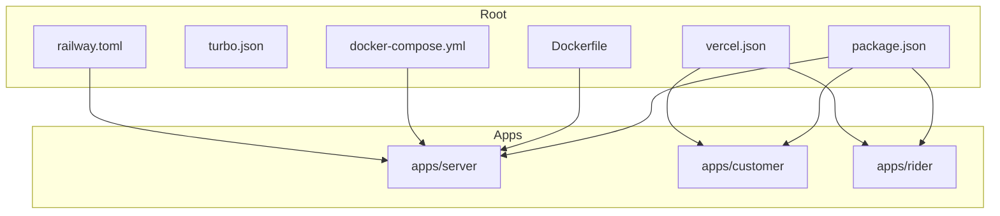
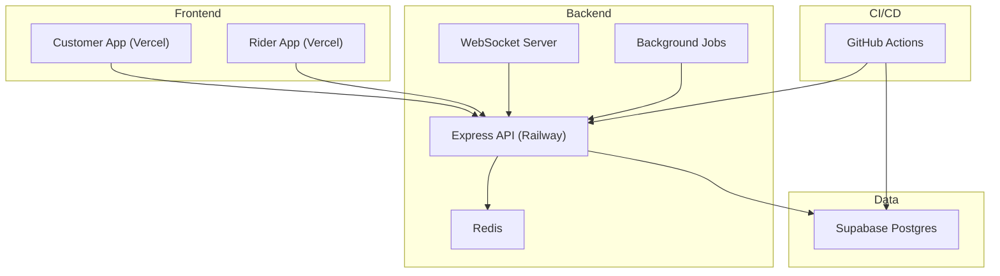
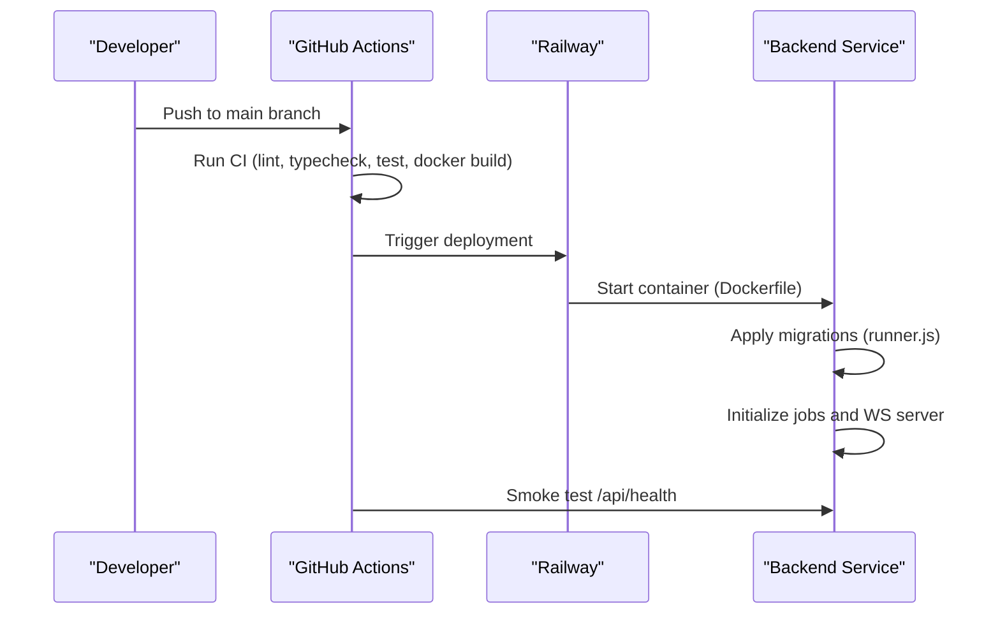
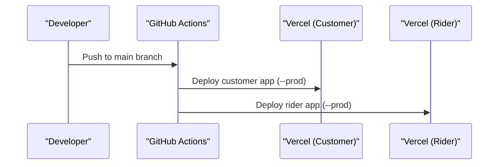
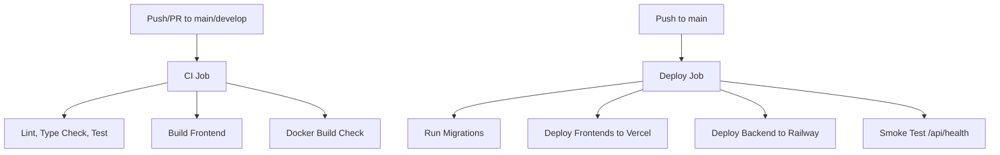
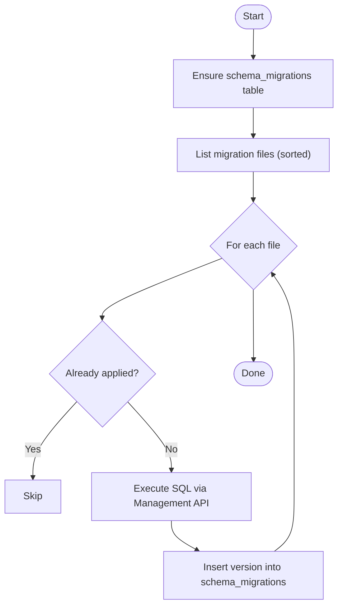
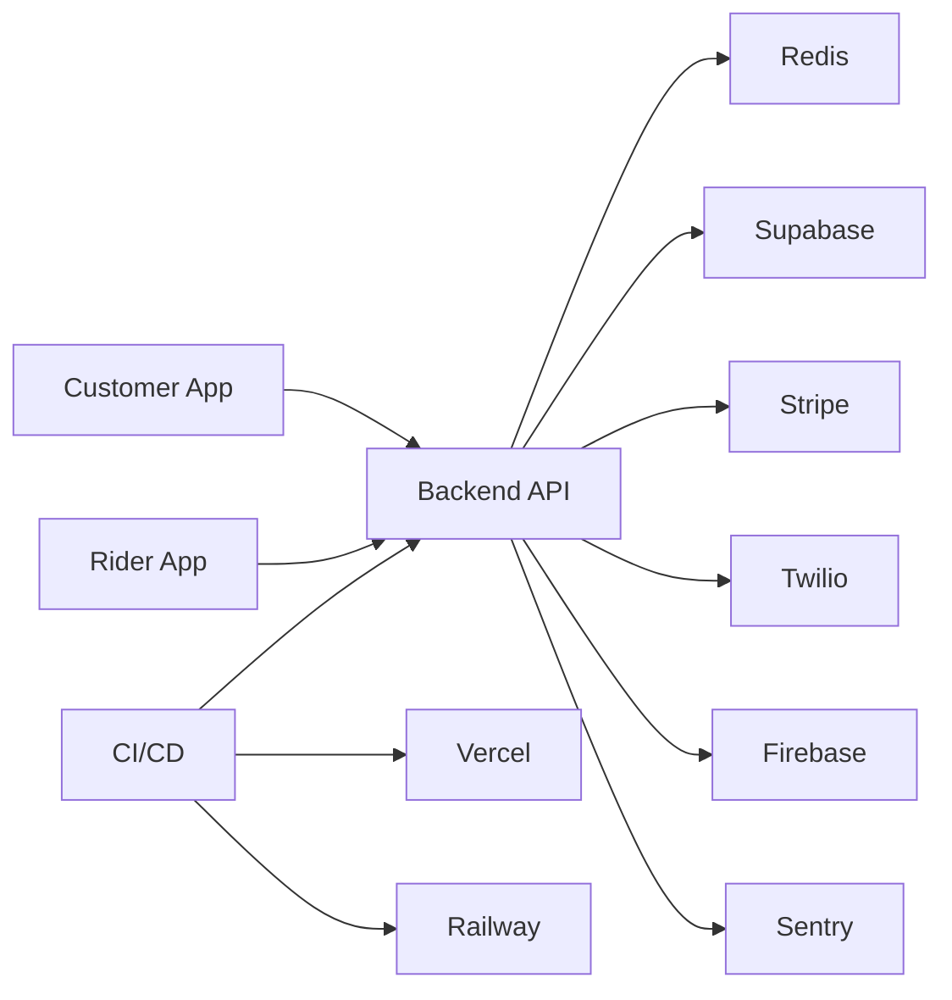

# Deployment & Operations

<cite>
**Referenced Files in This Document**
- [Dockerfile](file://Dockerfile)
- [docker-compose.yml](file://docker-compose.yml)
- [railway.toml](file://railway.toml)
- [vercel.json](file://vercel.json)
- [.github/workflows/ci.yml](file://.github/workflows/ci.yml)
- [.github/workflows/deploy.yml](file://.github/workflows/deploy.yml)
- [apps/server/index.js](file://apps/server/index.js)
- [apps/server/app.js](file://apps/server/app.js)
- [apps/server/config/index.js](file://apps/server/config/index.js)
- [apps/server/lib/logger.js](file://apps/server/lib/logger.js)
- [apps/server/lib/supabase.js](file://apps/server/lib/supabase.js)
- [apps/server/lib/redis.js](file://apps/server/lib/redis.js)
- [apps/server/migrations/runner.js](file://apps/server/migrations/runner.js)
- [apps/customer/vercel.json](file://apps/customer/vercel.json)
- [apps/rider/vercel.json](file://apps/rider/vercel.json)
- [package.json](file://package.json)
- [turbo.json](file://turbo.json)
- [apps/server/package.json](file://apps/server/package.json)
</cite>

## Table of Contents
1. [Introduction](#introduction)
2. [Project Structure](#project-structure)
3. [Core Components](#core-components)
4. [Architecture Overview](#architecture-overview)
5. [Detailed Component Analysis](#detailed-component-analysis)
6. [Dependency Analysis](#dependency-analysis)
7. [Performance Considerations](#performance-considerations)
8. [Troubleshooting Guide](#troubleshooting-guide)
9. [Conclusion](#conclusion)
10. [Appendices](#appendices)

## Introduction
This document describes the end-to-end deployment and operations procedures for Delivio. It covers containerization with Docker, orchestration via docker-compose, production deployment to Railway for the backend, and Vercel deployments for frontend applications. It also documents the CI/CD pipeline automation, monitoring and logging, database deployment and migrations, performance tuning, scaling, load balancing, disaster recovery, and operational troubleshooting.

## Project Structure
Delivio follows a monorepo layout with Turborepo orchestration:
- Root orchestrates workspaces for apps and packages.
- Backend service is under apps/server.
- Frontend apps under apps/customer and apps/rider.
- CI/CD under .github/workflows.
- Deployment configurations for Docker, Railway, and Vercel are at the repository root.

**Diagram sources**
- [package.json:1-20](file://package.json#L1-L20)
- [turbo.json:1-20](file://turbo.json#L1-L20)
- [Dockerfile:1-30](file://Dockerfile#L1-L30)
- [docker-compose.yml:1-43](file://docker-compose.yml#L1-L43)
- [railway.toml:1-17](file://railway.toml#L1-L17)
- [vercel.json:1-9](file://vercel.json#L1-L9)
- [apps/server/package.json:1-49](file://apps/server/package.json#L1-L49)

**Section sources**
- [package.json:1-20](file://package.json#L1-L20)
- [turbo.json:1-20](file://turbo.json#L1-L20)

## Core Components
- Backend service (Node.js): Express server with WebSockets, background jobs, rate limiting, Sentry, Winston logging, Redis session storage, Stripe, Twilio, Firebase, and Supabase integration.
- Database: Supabase Postgres accessed via REST and Management API; migrations executed via a runner script.
- Frontends: Next.js apps for customer and rider deployed to Vercel.
- Orchestration: Docker image built from root; docker-compose for local development; Railway for production backend; GitHub Actions for CI/CD.

**Section sources**
- [apps/server/index.js:1-93](file://apps/server/index.js#L1-L93)
- [apps/server/app.js:1-88](file://apps/server/app.js#L1-L88)
- [apps/server/config/index.js:1-117](file://apps/server/config/index.js#L1-L117)
- [apps/server/lib/logger.js:1-36](file://apps/server/lib/logger.js#L1-L36)
- [apps/server/lib/supabase.js:1-151](file://apps/server/lib/supabase.js#L1-L151)
- [apps/server/lib/redis.js:1-42](file://apps/server/lib/redis.js#L1-L42)
- [apps/server/migrations/runner.js:1-122](file://apps/server/migrations/runner.js#L1-L122)
- [apps/customer/vercel.json:1-5](file://apps/customer/vercel.json#L1-L5)
- [apps/rider/vercel.json:1-5](file://apps/rider/vercel.json#L1-L5)

## Architecture Overview
High-level runtime architecture:
- Frontends (Vercel) communicate with the backend (Railway).
- Backend uses Redis for sessions and caching.
- Database is Supabase Postgres; migrations are applied via Management API.
- CI/CD automates linting, testing, Docker build, migrations, and deployments.

**Diagram sources**
- [apps/server/index.js:1-93](file://apps/server/index.js#L1-L93)
- [apps/server/app.js:1-88](file://apps/server/app.js#L1-L88)
- [apps/server/lib/redis.js:1-42](file://apps/server/lib/redis.js#L1-L42)
- [apps/server/lib/supabase.js:1-151](file://apps/server/lib/supabase.js#L1-L151)
- [.github/workflows/deploy.yml:1-54](file://.github/workflows/deploy.yml#L1-L54)

## Detailed Component Analysis

### Containerization Strategy (Docker)
- Base image: Node.js Alpine.
- Non-root user for security.
- Installs production dependencies for the backend app only.
- Copies backend source and sets working directory to apps/server.
- Exposes port 8080 and defines health check against /api/health.
- Environment: NODE_ENV=production, PORT=8080.

Operational notes:
- Use docker-compose for local development with Redis and health checks.
- Railway builds from the Dockerfile at the repository root.

**Section sources**
- [Dockerfile:1-30](file://Dockerfile#L1-L30)
- [docker-compose.yml:1-43](file://docker-compose.yml#L1-L43)
- [railway.toml:1-17](file://railway.toml#L1-L17)

### Environment Configuration
- Centralized via apps/server/config/index.js, loading from environment variables.
- Required keys validated at startup; missing keys cause immediate failure.
- Key categories:
  - Runtime: NODE_ENV, PORT
  - Sessions: SESSION_SECRET, TTLs
  - CORS: ALLOWED_ORIGINS
  - Supabase: SUPABASE_URL, SUPABASE_SERVICE_ROLE_KEY/SUPABASE_SERVICE_KEY, SUPABASE_ACCESS_TOKEN
  - Redis: REDIS_URL
  - Payments: STRIPE_SECRET_KEY, STRIPE_WEBHOOK_SECRET
  - SMS: TWILIO_ACCOUNT_SID, TWILIO_AUTH_TOKEN, TWILIO_PHONE_NUMBER
  - Email: EMAIL_PROVIDER, EMAIL_API_KEY, EMAIL_FROM_ADDRESS
  - Notifications: FIREBASE_SERVICE_ACCOUNT_JSON
  - Maps: GOOGLE_MAPS_API_KEY
  - Monitoring: SENTRY_DSN
  - JWT: JWT_SECRET, JWT_EXPIRES_IN
  - Rate limits and chat/message sizes

Security and reliability:
- Health checks configured in Docker and docker-compose.
- Graceful shutdown handles SIGTERM/SIGINT and uncaught exceptions/rejections.

**Section sources**
- [apps/server/config/index.js:1-117](file://apps/server/config/index.js#L1-L117)
- [apps/server/index.js:1-93](file://apps/server/index.js#L1-L93)

### Production Deployment Workflows

#### Backend to Railway
- Build: Dockerfile at root; watch patterns include apps/server and Dockerfile.
- Deploy: Single replica with restart policy ON_FAILURE, max retries 5.
- Health check: /api/health endpoint with 60s timeout.
- Environment: PORT=8080, NODE_ENV=production.

**Diagram sources**
- [.github/workflows/deploy.yml:1-54](file://.github/workflows/deploy.yml#L1-L54)
- [apps/server/migrations/runner.js:1-122](file://apps/server/migrations/runner.js#L1-L122)
- [apps/server/index.js:1-93](file://apps/server/index.js#L1-L93)

**Section sources**
- [railway.toml:1-17](file://railway.toml#L1-L17)
- [.github/workflows/deploy.yml:1-54](file://.github/workflows/deploy.yml#L1-L54)

#### Frontend to Vercel
- Customer app: framework inferred as Next.js; output directory configured.
- Rider app: framework inferred as Next.js.
- Root vercel.json defines build/install commands and output directory for customer app.

**Diagram sources**
- [.github/workflows/deploy.yml:1-54](file://.github/workflows/deploy.yml#L1-L54)
- [apps/customer/vercel.json:1-5](file://apps/customer/vercel.json#L1-L5)
- [apps/rider/vercel.json:1-5](file://apps/rider/vercel.json#L1-L5)
- [vercel.json:1-9](file://vercel.json#L1-L9)

**Section sources**
- [apps/customer/vercel.json:1-5](file://apps/customer/vercel.json#L1-L5)
- [apps/rider/vercel.json:1-5](file://apps/rider/vercel.json#L1-L5)
- [vercel.json:1-9](file://vercel.json#L1-L9)

### CI/CD Pipeline Automation
- CI job:
  - Runs on push to main/develop and PR to main.
  - Sets up Node.js, installs dependencies, type checks and lints frontend, runs backend tests with coverage, builds frontend.
  - Starts a Redis service for tests.
  - Uploads coverage artifacts.
- Deploy job:
  - On push to main, runs migrations, deploys frontends to Vercel, deploys backend to Railway, performs smoke test on /api/health.

**Diagram sources**
- [.github/workflows/ci.yml:1-88](file://.github/workflows/ci.yml#L1-L88)
- [.github/workflows/deploy.yml:1-54](file://.github/workflows/deploy.yml#L1-L54)

**Section sources**
- [.github/workflows/ci.yml:1-88](file://.github/workflows/ci.yml#L1-L88)
- [.github/workflows/deploy.yml:1-54](file://.github/workflows/deploy.yml#L1-L54)

### Monitoring Setup and Logging
- Winston logger:
  - Console transport with JSON in production, colored/dev format in development.
  - Logs HTTP requests via Morgan, with Sentry integration when enabled.
- Sentry:
  - Conditionally initialized; request and error handlers registered before routes and after.
  - Sampling controlled by environment.
- Health checks:
  - Docker HEALTHCHECK probes /api/health.
  - docker-compose healthcheck mirrors the same probe.
  - Railway healthcheck configured in railway.toml.

**Section sources**
- [apps/server/lib/logger.js:1-36](file://apps/server/lib/logger.js#L1-L36)
- [apps/server/app.js:1-88](file://apps/server/app.js#L1-L88)
- [Dockerfile:25-27](file://Dockerfile#L25-L27)
- [docker-compose.yml:19-24](file://docker-compose.yml#L19-L24)
- [railway.toml:11-12](file://railway.toml#L11-L12)

### Database Deployment, Migrations, and Backup Strategies
- Database: Supabase Postgres.
- Migrations:
  - Numbered SQL files under apps/server/migrations.
  - Runner ensures a schema_migrations table, reads applied versions, and applies pending migrations via Management API.
  - Extracts project reference from SUPABASE_URL.
- Backup:
  - Supabase provides automated backups; configure retention and snapshot policies per Supabase settings.
  - For custom offloading, export logical dumps periodically and store securely.

**Diagram sources**
- [apps/server/migrations/runner.js:1-122](file://apps/server/migrations/runner.js#L1-L122)

**Section sources**
- [apps/server/migrations/runner.js:1-122](file://apps/server/migrations/runner.js#L1-L122)
- [apps/server/lib/supabase.js:1-151](file://apps/server/lib/supabase.js#L1-L151)

### Redis and Session Store
- Lazy connection with retry strategy and reconnect-on-error behavior.
- If REDIS_URL is absent, session store falls back to in-memory mode (not suitable for multi-instance deployments).
- Health checks for Redis container in docker-compose.

**Section sources**
- [apps/server/lib/redis.js:1-42](file://apps/server/lib/redis.js#L1-L42)
- [docker-compose.yml:26-39](file://docker-compose.yml#L26-L39)

### Background Jobs and WebSocket Server
- Background jobs include scheduled orders, location flush, cart cleanup, SLA checks, auto dispatch, and radius expansion.
- WebSocket server initializes on the HTTP server and is part of the production lifecycle.

**Section sources**
- [apps/server/index.js:12-45](file://apps/server/index.js#L12-L45)

## Dependency Analysis
Runtime dependencies and relationships:
- Backend depends on Supabase for persistence, Redis for sessions, Sentry for observability, Stripe/Twilio/Firebase for integrations.
- Frontends depend on backend for API and WebSocket connections.
- CI/CD depends on GitHub Actions, Vercel, and Railway.

**Diagram sources**
- [apps/server/app.js:1-88](file://apps/server/app.js#L1-L88)
- [apps/server/lib/supabase.js:1-151](file://apps/server/lib/supabase.js#L1-L151)
- [apps/server/lib/redis.js:1-42](file://apps/server/lib/redis.js#L1-L42)
- [.github/workflows/deploy.yml:1-54](file://.github/workflows/deploy.yml#L1-L54)

**Section sources**
- [apps/server/package.json:18-41](file://apps/server/package.json#L18-L41)

## Performance Considerations
- Container sizing: Ensure Railway instances have adequate CPU/memory for concurrent WebSocket connections and background jobs.
- Redis memory: Configure maxmemory and policy in docker-compose for local environments; tune accordingly in production.
- Request limits: Body parsing limits and rate limiting are configured centrally; adjust windows and thresholds as needed.
- Logging overhead: Production uses JSON logs; avoid excessive debug-level logs in high-throughput scenarios.
- Background jobs: Monitor job durations and queue backlogs; scale horizontally if needed.
- CDN and caching: Leverage Vercel edge caching for static assets; cache API responses where appropriate.

[No sources needed since this section provides general guidance]

## Troubleshooting Guide
Common deployment and operational issues:

- Missing environment variables
  - Symptom: Immediate startup failure due to missing required keys.
  - Action: Review apps/server/config/index.js and set all required environment variables in Railway/Vercel secrets.

- Redis connectivity issues
  - Symptom: Session store fallback to in-memory; intermittent connection errors.
  - Action: Verify REDIS_URL; ensure Redis service is healthy and reachable; review retry logs.

- Supabase connectivity or migration failures
  - Symptom: Migration runner fails or Supabase fetch errors.
  - Action: Confirm SUPABASE_URL and access tokens; verify project reference extraction; check Management API availability.

- Health check failures
  - Symptom: Containers marked unhealthy or smoke test fails.
  - Action: Check /api/health endpoint; verify backend started successfully; inspect logs for initialization errors.

- Sentry initialization problems
  - Symptom: Missing request/error handlers in production logs.
  - Action: Ensure SENTRY_DSN is set; verify Sentry SDK compatibility.

- Frontend build failures on Vercel
  - Symptom: Build errors or missing output.
  - Action: Validate framework detection and output directory in vercel.json; confirm build/install commands.

- Graceful shutdown hangs
  - Symptom: SIGTERM/SIGINT not terminating cleanly.
  - Action: Inspect long-running operations; ensure Redis quit completes within timeout.

**Section sources**
- [apps/server/config/index.js:3-7](file://apps/server/config/index.js#L3-L7)
- [apps/server/lib/redis.js:11-32](file://apps/server/lib/redis.js#L11-L32)
- [apps/server/lib/supabase.js:47-59](file://apps/server/lib/supabase.js#L47-L59)
- [Dockerfile:25-27](file://Dockerfile#L25-L27)
- [railway.toml:11-12](file://railway.toml#L11-L12)
- [apps/server/app.js:46-81](file://apps/server/app.js#L46-L81)
- [apps/customer/vercel.json:1-5](file://apps/customer/vercel.json#L1-L5)
- [apps/server/index.js:48-77](file://apps/server/index.js#L48-L77)

## Conclusion
Delivio’s deployment model leverages modern cloud platforms with clear separation of concerns:
- Backend: Railway with Docker, CI/CD automation, and robust health checks.
- Frontends: Vercel with framework-aware builds.
- Data: Supabase with a managed migration runner.
- Observability: Winston, Morgan, and Sentry integration.
Adhering to the documented environment variables, migration procedures, and CI/CD steps ensures reliable deployments and smooth operations.

[No sources needed since this section summarizes without analyzing specific files]

## Appendices

### Appendix A: Environment Variables Reference
- Required
  - NODE_ENV, PORT
  - SUPABASE_URL, SUPABASE_SERVICE_ROLE_KEY or SUPABASE_SERVICE_KEY, SUPABASE_ACCESS_TOKEN
  - SESSION_SECRET, JWT_SECRET
- Optional
  - ALLOWED_ORIGINS, REDIS_URL, STRIPE_SECRET_KEY, STRIPE_WEBHOOK_SECRET, TWILIO_* credentials, EMAIL_* settings, FIREBASE_SERVICE_ACCOUNT_JSON, GOOGLE_MAPS_API_KEY, SENTRY_DSN, JWT_EXPIRES_IN

**Section sources**
- [apps/server/config/index.js:11-117](file://apps/server/config/index.js#L11-L117)

### Appendix B: Local Development with docker-compose
- Builds backend image from root.
- Mounts .env for environment injection.
- Depends on Redis; health checks ensure readiness.
- Exposes ports 8080 (backend) and 6379 (Redis).

**Section sources**
- [docker-compose.yml:1-43](file://docker-compose.yml#L1-L43)

### Appendix C: CI/CD Artifacts and Smoke Testing
- Coverage reports uploaded after backend tests.
- Smoke test validates /api/health endpoint post-deploy.

**Section sources**
- [.github/workflows/ci.yml:61-66](file://.github/workflows/ci.yml#L61-L66)
- [.github/workflows/deploy.yml:48-53](file://.github/workflows/deploy.yml#L48-L53)