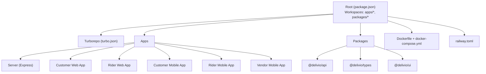
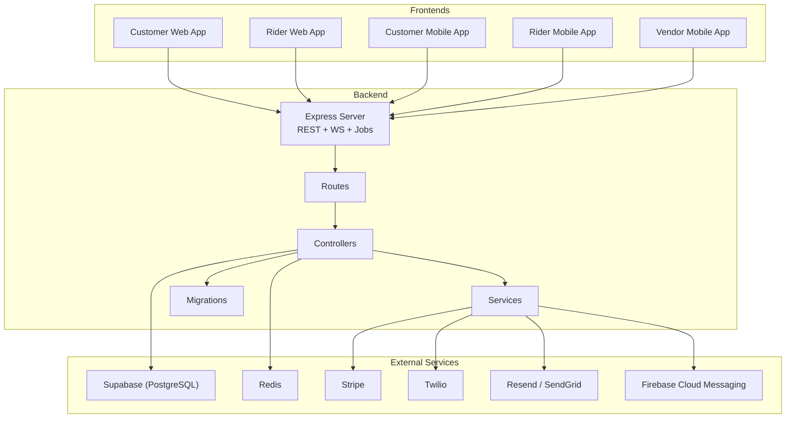
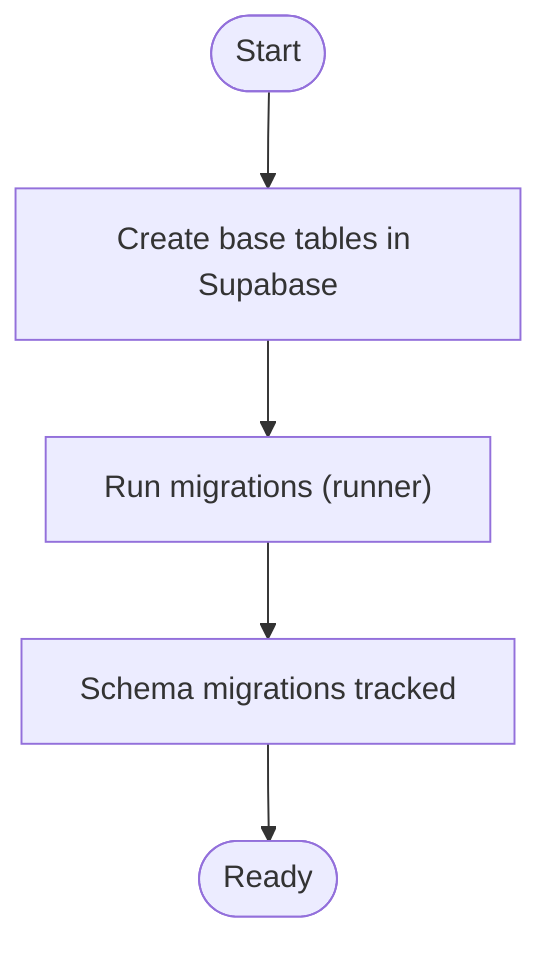
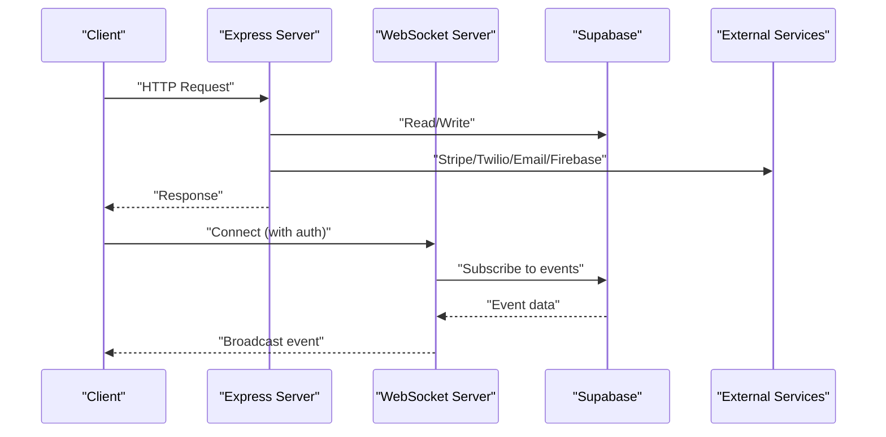
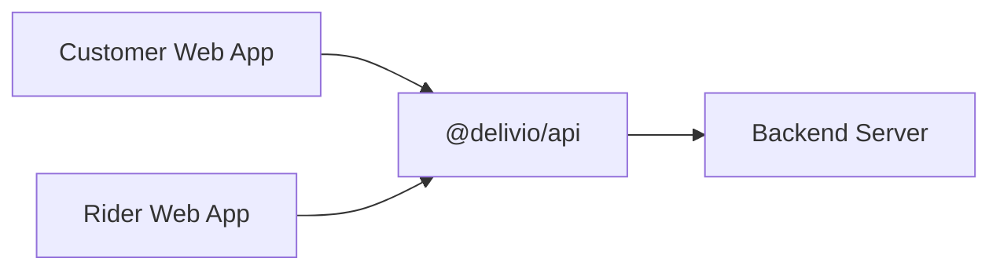
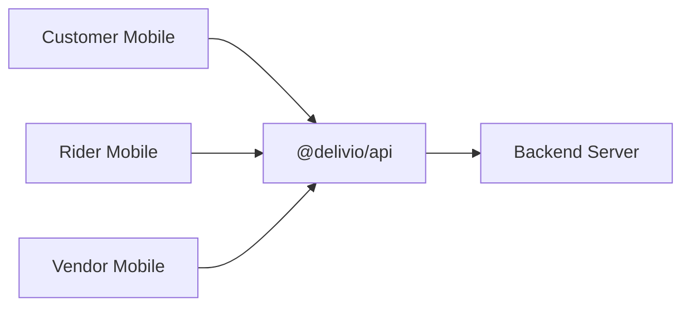
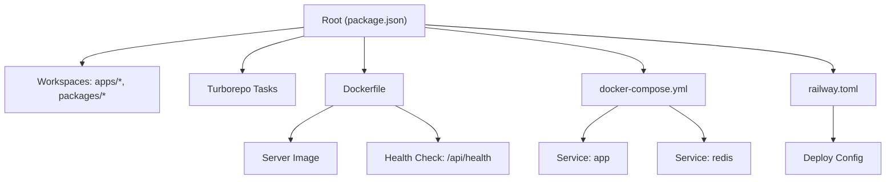

# Getting Started

<cite>
**Referenced Files in This Document**
- [package.json](file://package.json)
- [turbo.json](file://turbo.json)
- [Dockerfile](file://Dockerfile)
- [docker-compose.yml](file://docker-compose.yml)
- [railway.toml](file://railway.toml)
- [apps/server/package.json](file://apps/server/package.json)
- [apps/server/setup.sh](file://apps/server/setup.sh)
- [apps/server/migrations/runner.js](file://apps/server/migrations/runner.js)
- [apps/server/routes/index.js](file://apps/server/routes/index.js)
- [apps/server/websocket/ws-server.js](file://apps/server/websocket/ws-server.js)
- [apps/server/lib/supabase.js](file://apps/server/lib/supabase.js)
- [apps/server/lib/redis.js](file://apps/server/lib/redis.js)
- [apps/server/controllers/auth.controller.js](file://apps/server/controllers/auth.controller.js)
- [apps/server/controllers/order.controller.js](file://apps/server/controllers/order.controller.js)
- [apps/server/controllers/chat.controller.js](file://apps/server/controllers/chat.controller.js)
- [apps/server/controllers/delivery.controller.js](file://apps/server/controllers/delivery.controller.js)
- [apps/server/controllers/cart.controller.js](file://apps/server/controllers/cart.controller.js)
- [apps/server/controllers/public.controller.js](file://apps/server/controllers/public.controller.js)
- [apps/server/services/stripe.service.js](file://apps/server/services/stripe.service.js)
- [apps/server/services/sms.service.js](file://apps/server/services/sms.service.js)
- [apps/server/services/email.service.js](file://apps/server/services/email.service.js)
- [apps/server/services/push.service.js](file://apps/server/services/push.service.js)
- [apps/server/jobs/auto-dispatch.job.js](file://apps/server/jobs/auto-dispatch.job.js)
- [apps/server/jobs/cart-cleanup.job.js](file://apps/server/jobs/cart-cleanup.job.js)
- [apps/server/jobs/location-flush.job.js](file://apps/server/jobs/location-flush.job.js)
- [apps/server/jobs/sla-check.job.js](file://apps/server/jobs/sla-check.job.js)
- [apps/server/migrations/000_core_schema.sql](file://apps/server/migrations/000_core_schema.sql)
- [apps/server/migrations/015_seed.sql](file://apps/server/migrations/015_seed.sql)
- [apps/customer/package.json](file://apps/customer/package.json)
- [apps/customer/README.md](file://apps/customer/README.md)
- [apps/rider/package.json](file://apps/rider/package.json)
- [apps/customer-mobile/package.json](file://apps/customer-mobile/package.json)
- [apps/customer-mobile/app.json](file://apps/customer-mobile/app.json)
- [apps/rider-mobile/package.json](file://apps/rider-mobile/package.json)
- [apps/rider-mobile/app.json](file://apps/rider-mobile/app.json)
- [apps/vendor-mobile/package.json](file://apps/vendor-mobile/package.json)
- [apps/vendor-mobile/app.json](file://apps/vendor-mobile/app.json)
- [docs/SETUP.md](file://docs/SETUP.md)
- [docs/Delivio-Backend.postman_collection.json](file://docs/Delivio-Backend.postman_collection.json)
</cite>

## Table of Contents
1. [Introduction](#introduction)
2. [Project Structure](#project-structure)
3. [Core Components](#core-components)
4. [Architecture Overview](#architecture-overview)
5. [Detailed Component Analysis](#detailed-component-analysis)
6. [Dependency Analysis](#dependency-analysis)
7. [Performance Considerations](#performance-considerations)
8. [Troubleshooting Guide](#troubleshooting-guide)
9. [Conclusion](#conclusion)
10. [Appendices](#appendices)

## Introduction
Delivio is a multi-tenant delivery platform with a modern monorepo built on Turborepo. It includes:
- A Node.js/Express backend server with database migrations, background jobs, and WebSocket support
- A customer web app (Next.js)
- A rider web app (Next.js)
- Three mobile apps (Expo/React Native for customer, rider, and vendor)
- Shared packages for API, types, and UI components
- Containerized deployment via Docker and Docker Compose

This guide helps you set up the entire platform locally, configure environment variables, run database migrations, and verify all components are working.

## Project Structure
The repository follows a monorepo layout with workspaces for apps and packages. Turborepo orchestrates builds, tests, and development across all packages.

**Diagram sources**
- [package.json:1-20](file://package.json#L1-L20)
- [turbo.json:1-20](file://turbo.json#L1-L20)

Key characteristics:
- Workspaces define where apps and packages live
- Turborepo tasks orchestrate dev/build/lint/test across workspaces
- Docker images build the server app and expose health checks
- Railway configuration aligns with Docker deployment

**Section sources**
- [package.json:1-20](file://package.json#L1-L20)
- [turbo.json:1-20](file://turbo.json#L1-L20)
- [Dockerfile:1-30](file://Dockerfile#L1-L30)
- [docker-compose.yml:1-43](file://docker-compose.yml#L1-L43)
- [railway.toml:1-17](file://railway.toml#L1-L17)

## Core Components
- Backend server (Express):
  - Entry point initializes HTTP server, WebSocket server, and background jobs
  - Routes are mounted centrally and grouped by feature
  - Controllers handle business logic; services integrate external APIs
  - Migrations manage database schema evolution
- Frontend apps:
  - Customer and rider Next.js apps share @delivio/api, @delivio/types, and @delivio/ui
- Mobile apps:
  - Customer, rider, and vendor apps use Expo and integrate with the backend
- Shared packages:
  - @delivio/api, @delivio/types, @delivio/ui enable code reuse across platforms

Verification steps:
- Confirm backend health endpoint responds
- Run automated tests to validate integrations
- Use Postman collection to exercise key API flows

**Section sources**
- [apps/server/package.json:1-49](file://apps/server/package.json#L1-L49)
- [apps/customer/package.json:1-42](file://apps/customer/package.json#L1-L42)
- [apps/rider/package.json:1-39](file://apps/rider/package.json#L1-L39)
- [apps/customer-mobile/package.json:1-44](file://apps/customer-mobile/package.json#L1-L44)
- [apps/rider-mobile/package.json:1-43](file://apps/rider-mobile/package.json#L1-L43)
- [apps/vendor-mobile/package.json:1-41](file://apps/vendor-mobile/package.json#L1-L41)

## Architecture Overview
The platform consists of:
- Backend server exposing REST endpoints and WebSocket channels
- Database (Supabase) for persistence and migrations
- Optional Redis for sessions and caching
- External services for payments (Stripe), SMS (Twilio), email (Resend/SendGrid), and push notifications (Firebase)
- Frontend web apps and mobile apps consuming the backend

**Diagram sources**
- [apps/server/routes/index.js](file://apps/server/routes/index.js)
- [apps/server/controllers/auth.controller.js](file://apps/server/controllers/auth.controller.js)
- [apps/server/controllers/order.controller.js](file://apps/server/controllers/order.controller.js)
- [apps/server/controllers/chat.controller.js](file://apps/server/controllers/chat.controller.js)
- [apps/server/controllers/delivery.controller.js](file://apps/server/controllers/delivery.controller.js)
- [apps/server/controllers/cart.controller.js](file://apps/server/controllers/cart.controller.js)
- [apps/server/controllers/public.controller.js](file://apps/server/controllers/public.controller.js)
- [apps/server/services/stripe.service.js](file://apps/server/services/stripe.service.js)
- [apps/server/services/sms.service.js](file://apps/server/services/sms.service.js)
- [apps/server/services/email.service.js](file://apps/server/services/email.service.js)
- [apps/server/services/push.service.js](file://apps/server/services/push.service.js)
- [apps/server/lib/supabase.js](file://apps/server/lib/supabase.js)
- [apps/server/lib/redis.js](file://apps/server/lib/redis.js)
- [apps/server/migrations/runner.js](file://apps/server/migrations/runner.js)

## Detailed Component Analysis

### Backend Server Setup
- Prerequisites:
  - Node.js 20+ and npm 10+
  - Git
  - Docker (optional, for Redis and containerized deployment)
- Environment variables:
  - Required: SUPABASE_URL, SUPABASE_SERVICE_KEY, SUPABASE_ACCESS_TOKEN, SESSION_SECRET, ALLOWED_ORIGINS
  - Optional: REDIS_URL, STRIPE_SECRET_KEY, STRIPE_WEBHOOK_SECRET, TWILIO_* credentials, EMAIL_API_KEY, FIREBASE_SERVICE_ACCOUNT_JSON, GOOGLE_MAPS_API_KEY, SENTRY_DSN, JWT_SECRET
- Database:
  - Create base tables as documented, then run migrations
- Redis:
  - Use Docker, local install, or skip for development (in-memory fallback)
- Stripe:
  - Use Stripe CLI to forward webhooks locally
- Twilio:
  - Optional; otherwise OTP prints to console
- Email:
  - Resend or SendGrid; otherwise emails print to console
- Firebase:
  - Optional; otherwise push notifications are skipped
- Start:
  - Development: run the server dev script
  - Production: Docker image exposes port 8080 with health checks

Verification:
- Health check endpoint returns status OK
- Automated tests pass
- Postman collection exercises key flows

**Section sources**
- [docs/SETUP.md:30-776](file://docs/SETUP.md#L30-L776)
- [apps/server/setup.sh:1-183](file://apps/server/setup.sh#L1-L183)
- [apps/server/package.json:1-49](file://apps/server/package.json#L1-L49)
- [Dockerfile:1-30](file://Dockerfile#L1-L30)
- [docker-compose.yml:1-43](file://docker-compose.yml#L1-L43)
- [railway.toml:1-17](file://railway.toml#L1-L17)

### Database Setup and Migrations
- Pre-create base tables as documented
- Run migrations to apply schema changes and indexes
- Migrations are tracked and idempotent

**Diagram sources**
- [docs/SETUP.md:258-278](file://docs/SETUP.md#L258-L278)
- [apps/server/migrations/runner.js](file://apps/server/migrations/runner.js)
- [apps/server/migrations/000_core_schema.sql](file://apps/server/migrations/000_core_schema.sql)
- [apps/server/migrations/015_seed.sql](file://apps/server/migrations/015_seed.sql)

**Section sources**
- [docs/SETUP.md:258-278](file://docs/SETUP.md#L258-L278)
- [apps/server/migrations/runner.js](file://apps/server/migrations/runner.js)

### API Configuration and Endpoints
- REST endpoints are mounted centrally and grouped by feature
- WebSocket server supports real-time events for orders, deliveries, and chat
- Background jobs automate dispatch, cleanup, location flush, and SLA checks

**Diagram sources**
- [apps/server/routes/index.js](file://apps/server/routes/index.js)
- [apps/server/websocket/ws-server.js](file://apps/server/websocket/ws-server.js)
- [apps/server/controllers/order.controller.js](file://apps/server/controllers/order.controller.js)
- [apps/server/controllers/delivery.controller.js](file://apps/server/controllers/delivery.controller.js)
- [apps/server/controllers/chat.controller.js](file://apps/server/controllers/chat.controller.js)
- [apps/server/lib/supabase.js](file://apps/server/lib/supabase.js)
- [apps/server/services/stripe.service.js](file://apps/server/services/stripe.service.js)
- [apps/server/services/sms.service.js](file://apps/server/services/sms.service.js)
- [apps/server/services/email.service.js](file://apps/server/services/email.service.js)
- [apps/server/services/push.service.js](file://apps/server/services/push.service.js)

**Section sources**
- [apps/server/routes/index.js](file://apps/server/routes/index.js)
- [apps/server/websocket/ws-server.js](file://apps/server/websocket/ws-server.js)

### Frontend Applications (Customer and Rider)
- Both Next.js apps share common packages (@delivio/api, @delivio/types, @delivio/ui)
- Development servers run on different ports for both apps
- Use the provided README to start development

**Diagram sources**
- [apps/customer/package.json:1-42](file://apps/customer/package.json#L1-L42)
- [apps/rider/package.json:1-39](file://apps/rider/package.json#L1-L39)

**Section sources**
- [apps/customer/README.md:1-37](file://apps/customer/README.md#L1-L37)
- [apps/customer/package.json:1-42](file://apps/customer/package.json#L1-L42)
- [apps/rider/package.json:1-39](file://apps/rider/package.json#L1-L39)

### Mobile Applications
- Customer, rider, and vendor apps are Expo projects
- They depend on shared packages and integrate with the backend
- Use Expo CLI to start development and target Android/iOS

**Diagram sources**
- [apps/customer-mobile/package.json:1-44](file://apps/customer-mobile/package.json#L1-L44)
- [apps/rider-mobile/package.json:1-43](file://apps/rider-mobile/package.json#L1-L43)
- [apps/vendor-mobile/package.json:1-41](file://apps/vendor-mobile/package.json#L1-L41)

**Section sources**
- [apps/customer-mobile/package.json:1-44](file://apps/customer-mobile/package.json#L1-L44)
- [apps/rider-mobile/package.json:1-43](file://apps/rider-mobile/package.json#L1-L43)
- [apps/vendor-mobile/package.json:1-41](file://apps/vendor-mobile/package.json#L1-L41)

## Dependency Analysis
- Workspaces:
  - Root defines workspaces for apps and packages
  - Turborepo tasks control build/dev/lint/test
- Docker:
  - Single-container build for the server with health checks
  - Compose adds Redis as a dependency
- Railway:
  - Uses Dockerfile with health check path aligned to backend

**Diagram sources**
- [package.json:1-20](file://package.json#L1-L20)
- [turbo.json:1-20](file://turbo.json#L1-L20)
- [Dockerfile:1-30](file://Dockerfile#L1-L30)
- [docker-compose.yml:1-43](file://docker-compose.yml#L1-L43)
- [railway.toml:1-17](file://railway.toml#L1-L17)

**Section sources**
- [package.json:1-20](file://package.json#L1-L20)
- [turbo.json:1-20](file://turbo.json#L1-L20)
- [Dockerfile:1-30](file://Dockerfile#L1-L30)
- [docker-compose.yml:1-43](file://docker-compose.yml#L1-L43)
- [railway.toml:1-17](file://railway.toml#L1-L17)

## Performance Considerations
- Use Redis for session storage and caching to avoid in-memory limitations during development
- Keep migrations idempotent and incremental for efficient schema evolution
- Monitor external service integrations (Stripe, Twilio, Firebase) for latency and error rates
- Use Turborepo caching and persistent tasks for faster local development cycles

[No sources needed since this section provides general guidance]

## Troubleshooting Guide
Common issues and resolutions:
- Missing environment variables:
  - The server logs which variable is missing; ensure .env is at the project root
- CORS errors:
  - Add frontend origins to ALLOWED_ORIGINS
- Redis connection refused:
  - Start Redis locally or via Docker; otherwise use in-memory fallback (development only)
- Twilio OTP not received:
  - Verify all Twilio credentials; in dev mode OTP prints to console
- Stripe webhook 400:
  - Ensure webhook secret matches Stripe CLI or production dashboard
- Migration failures:
  - Confirm SUPABASE_ACCESS_TOKEN and URL correctness
- Tests failing:
  - Run tests with verbose output; ensure dependencies are installed

**Section sources**
- [docs/SETUP.md:708-754](file://docs/SETUP.md#L708-L754)

## Conclusion
You now have a complete understanding of the Delivio platform’s architecture, monorepo structure, and how to set up the backend, database, and frontend/mobile apps. Use the verification steps and troubleshooting tips to ensure a smooth local development experience.

[No sources needed since this section summarizes without analyzing specific files]

## Appendices

### Step-by-Step Installation and Verification

- Backend server
  - Prerequisites: Node.js 20+, npm 10+, optional Docker
  - Environment variables: create .env from .env.example and fill required values
  - Database: create base tables, then run migrations
  - Redis: start via Docker or locally; optional for development
  - Stripe: use Stripe CLI to forward webhooks locally
  - Twilio: optional; otherwise OTP prints to console
  - Email: Resend/SendGrid or console logging
  - Firebase: optional; otherwise push notifications skipped
  - Start: run server dev script; verify health endpoint
  - Tests: run automated tests to validate integrations

- Customer web app
  - Start development server on port 3000
  - Access http://localhost:3000

- Rider web app
  - Start development server on port 3002
  - Access http://localhost:3002

- Mobile apps
  - Customer mobile: use Expo CLI to start development
  - Rider mobile: use Expo CLI to start development
  - Vendor mobile: use Expo CLI to start development

- Verification checklist
  - Backend health endpoint responds
  - Automated tests pass
  - Postman collection runs successfully
  - Frontend apps start without errors
  - Mobile apps connect to backend

**Section sources**
- [docs/SETUP.md:30-776](file://docs/SETUP.md#L30-L776)
- [apps/customer/README.md:1-37](file://apps/customer/README.md#L1-L37)
- [apps/server/setup.sh:151-183](file://apps/server/setup.sh#L151-L183)