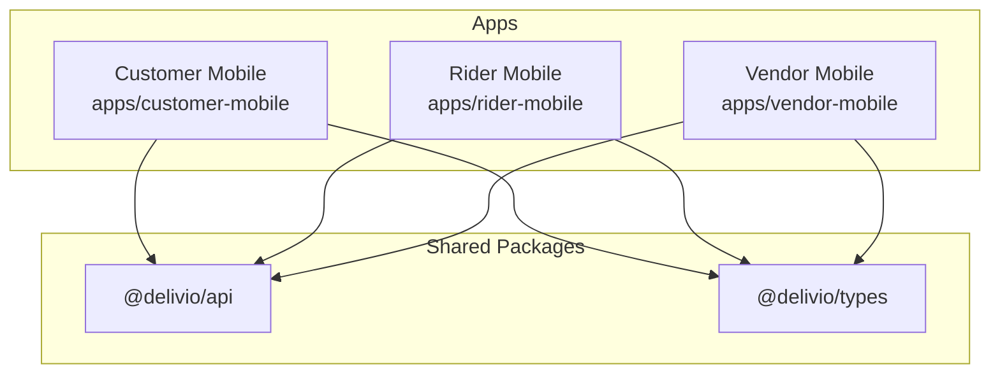
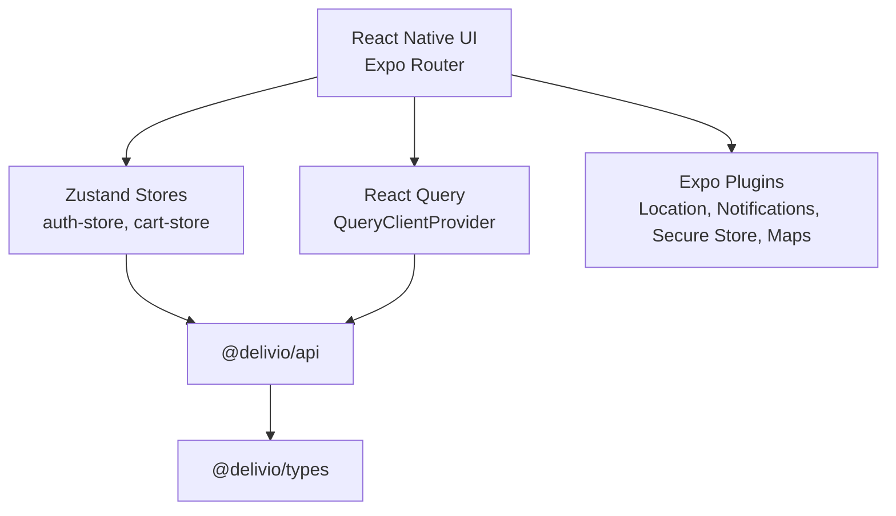
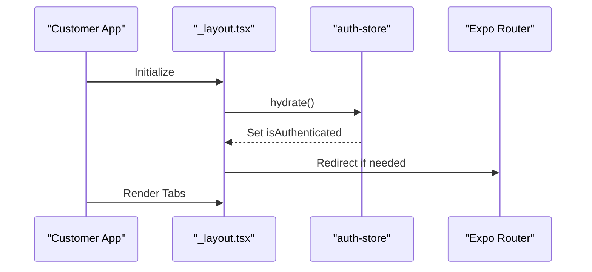
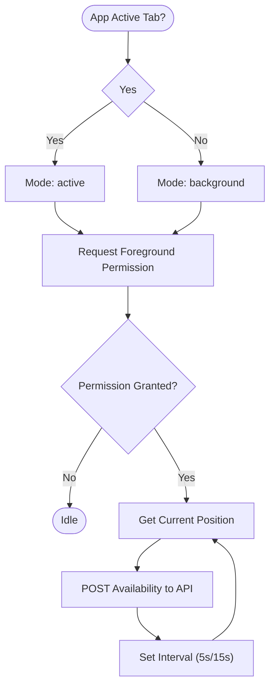
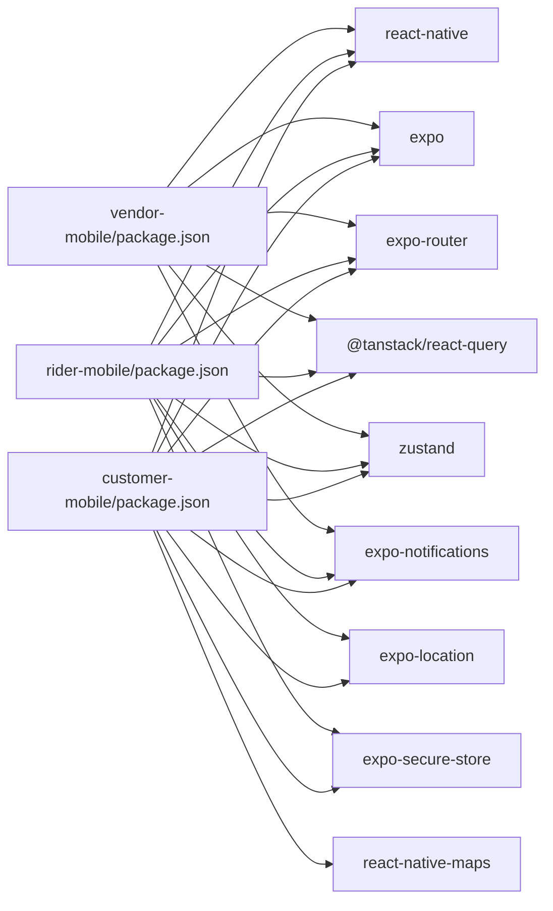

# Mobile Applications

<cite>
**Referenced Files in This Document**
- [apps/customer-mobile/package.json](file://apps/customer-mobile/package.json)
- [apps/customer-mobile/app.json](file://apps/customer-mobile/app.json)
- [apps/customer-mobile/metro.config.js](file://apps/customer-mobile/metro.config.js)
- [apps/customer-mobile/babel.config.js](file://apps/customer-mobile/babel.config.js)
- [apps/customer-mobile/src/app/_layout.tsx](file://apps/customer-mobile/src/app/_layout.tsx)
- [apps/customer-mobile/src/app/(tabs)/_layout.tsx](file://apps/customer-mobile/src/app/(tabs)/_layout.tsx)
- [apps/customer-mobile/src/lib/theme.ts](file://apps/customer-mobile/src/lib/theme.ts)
- [apps/customer-mobile/src/stores/auth-store.ts](file://apps/customer-mobile/src/stores/auth-store.ts)
- [apps/customer-mobile/src/stores/cart-store.ts](file://apps/customer-mobile/src/stores/cart-store.ts)
- [apps/rider-mobile/package.json](file://apps/rider-mobile/package.json)
- [apps/rider-mobile/app.json](file://apps/rider-mobile/app.json)
- [apps/rider-mobile/src/app/_layout.tsx](file://apps/rider-mobile/src/app/_layout.tsx)
- [apps/rider-mobile/src/lib/delivery-utils.ts](file://apps/rider-mobile/src/lib/delivery-utils.ts)
- [apps/rider-mobile/src/lib/use-rider-availability.ts](file://apps/rider-mobile/src/lib/use-rider-availability.ts)
- [apps/vendor-mobile/package.json](file://apps/vendor-mobile/package.json)
- [apps/vendor-mobile/app.json](file://apps/vendor-mobile/app.json)
- [.github/workflows/ci.yml](file://.github/workflows/ci.yml)
- [.github/workflows/deploy.yml](file://.github/workflows/deploy.yml)
</cite>

## Table of Contents
1. [Introduction](#introduction)
2. [Project Structure](#project-structure)
3. [Core Components](#core-components)
4. [Architecture Overview](#architecture-overview)
5. [Detailed Component Analysis](#detailed-component-analysis)
6. [Dependency Analysis](#dependency-analysis)
7. [Performance Considerations](#performance-considerations)
8. [Troubleshooting Guide](#troubleshooting-guide)
9. [Conclusion](#conclusion)
10. [Appendices](#appendices)

## Introduction
This document describes the Delivio mobile applications built with React Native and Expo. It covers the cross-platform architecture, native module integration, platform-specific optimizations, GPS location tracking, push notifications, offline-awareness considerations, mobile-specific UI patterns, navigation flows, and user experience considerations. It also documents native dependencies, build configurations, deployment processes, and debugging and performance strategies tailored for iOS and Android.

## Project Structure
The repository organizes three distinct mobile apps under the apps/ directory:
- Customer app: a consumer-facing ordering and chat experience
- Rider app: a delivery driver experience with availability and live tracking
- Vendor app: a vendor-side dashboard for managing orders and menu

Each app is structured as an Expo Router-based React Native application with shared packages for API and types. The customer and rider apps integrate GPS location and push notifications; the vendor app focuses on administrative tasks.

**Section sources**
- [apps/customer-mobile/package.json:13-36](file://apps/customer-mobile/package.json#L13-L36)
- [apps/rider-mobile/package.json:13-35](file://apps/rider-mobile/package.json#L13-L35)
- [apps/vendor-mobile/package.json:13-33](file://apps/vendor-mobile/package.json#L13-L33)

## Core Components
- Navigation and Routing
  - Expo Router Stack and Tabs are used to define screens and tab layouts.
  - Authentication guards redirect unauthenticated users to login and authenticated users away from it.
- State Management
  - Zustand stores manage authentication state and shopping cart state in the customer app.
- Offline Awareness
  - React Query provides caching and background refetching with configurable stale times.
- Platform Integrations
  - Expo Location, Notifications, Secure Store, and Maps are integrated via Expo SDK plugins and native modules.
- Theming
  - Shared theme constants define colors, spacing, font sizes, and border radii.

**Section sources**
- [apps/customer-mobile/src/app/_layout.tsx:11-40](file://apps/customer-mobile/src/app/_layout.tsx#L11-L40)
- [apps/customer-mobile/src/app/(tabs)/_layout.tsx:6-65](file://apps/customer-mobile/src/app/(tabs)/_layout.tsx#L6-L65)
- [apps/customer-mobile/src/stores/auth-store.ts:15-43](file://apps/customer-mobile/src/stores/auth-store.ts#L15-L43)
- [apps/customer-mobile/src/stores/cart-store.ts:17-47](file://apps/customer-mobile/src/stores/cart-store.ts#L17-L47)
- [apps/customer-mobile/src/lib/theme.ts:1-43](file://apps/customer-mobile/src/lib/theme.ts#L1-L43)

## Architecture Overview
The mobile apps share a common architecture:
- UI layer built with React Native and Expo Router
- State managed by Zustand stores
- Data fetching powered by React Query
- Platform integrations handled by Expo SDK plugins
- Shared API client and TypeScript types

**Diagram sources**
- [apps/customer-mobile/src/app/_layout.tsx:3-9](file://apps/customer-mobile/src/app/_layout.tsx#L3-L9)
- [apps/customer-mobile/src/stores/auth-store.ts:1-4](file://apps/customer-mobile/src/stores/auth-store.ts#L1-L4)
- [apps/customer-mobile/src/stores/cart-store.ts:1-2](file://apps/customer-mobile/src/stores/cart-store.ts#L1-L2)
- [apps/customer-mobile/package.json:13-36](file://apps/customer-mobile/package.json#L13-L36)

## Detailed Component Analysis

### Customer App Navigation and Authentication
- Root layout initializes React Query and applies authentication guards.
- Tab layout defines bottom tabs with badges and icons.
- Theme constants are used for consistent visuals.

**Diagram sources**
- [apps/customer-mobile/src/app/_layout.tsx:11-32](file://apps/customer-mobile/src/app/_layout.tsx#L11-L32)
- [apps/customer-mobile/src/stores/auth-store.ts:20-31](file://apps/customer-mobile/src/stores/auth-store.ts#L20-L31)

**Section sources**
- [apps/customer-mobile/src/app/_layout.tsx:11-40](file://apps/customer-mobile/src/app/_layout.tsx#L11-L40)
- [apps/customer-mobile/src/app/(tabs)/_layout.tsx:6-65](file://apps/customer-mobile/src/app/(tabs)/_layout.tsx#L6-L65)
- [apps/customer-mobile/src/lib/theme.ts:1-43](file://apps/customer-mobile/src/lib/theme.ts#L1-L43)

### Rider App Availability and Location Tracking
- The root layout conditionally enables high-frequency location updates when the active tab is visible.
- A dedicated hook requests location permissions and periodically sends location to the backend.

**Diagram sources**
- [apps/rider-mobile/src/app/_layout.tsx:21-22](file://apps/rider-mobile/src/app/_layout.tsx#L21-L22)
- [apps/rider-mobile/src/lib/use-rider-availability.ts:8-49](file://apps/rider-mobile/src/lib/use-rider-availability.ts#L8-L49)

**Section sources**
- [apps/rider-mobile/src/app/_layout.tsx:12-32](file://apps/rider-mobile/src/app/_layout.tsx#L12-L32)
- [apps/rider-mobile/src/lib/use-rider-availability.ts:1-54](file://apps/rider-mobile/src/lib/use-rider-availability.ts#L1-L54)

### Vendor App
- Minimal mobile footprint focused on administrative tasks.
- Uses Expo Router and shared packages for authentication and data access.

**Section sources**
- [apps/vendor-mobile/package.json:13-33](file://apps/vendor-mobile/package.json#L13-L33)
- [apps/vendor-mobile/app.json:23-28](file://apps/vendor-mobile/app.json#L23-L28)

## Dependency Analysis
- Cross-platform dependencies
  - React Native, Expo, Expo Router, React Query, Zustand, Expo Status Bar, Safe Area Context, Screens, Reanimated, Vector Icons.
- Platform-specific dependencies
  - expo-location, expo-notifications, expo-secure-store, react-native-maps (customer), and additional Android permissions for background location and foreground services (rider).
- Build-time dependencies
  - Metro bundler configuration supports monorepo watch folders and node modules resolution.
  - Babel preset for Expo with Reanimated plugin.

**Diagram sources**
- [apps/customer-mobile/package.json:13-36](file://apps/customer-mobile/package.json#L13-L36)
- [apps/rider-mobile/package.json:13-35](file://apps/rider-mobile/package.json#L13-L35)
- [apps/vendor-mobile/package.json:13-33](file://apps/vendor-mobile/package.json#L13-L33)

**Section sources**
- [apps/customer-mobile/metro.config.js:1-19](file://apps/customer-mobile/metro.config.js#L1-L19)
- [apps/customer-mobile/babel.config.js:1-8](file://apps/customer-mobile/babel.config.js#L1-L8)

## Performance Considerations
- Caching and stale times
  - React Query default stale time reduces redundant network calls.
- Background vs foreground location frequency
  - Rider app switches between higher frequency during active tab and lower frequency otherwise to balance battery and accuracy.
- Reanimated and animations
  - Reanimated plugin improves animation performance; ensure heavy animations are throttled or disabled in low-power scenarios.
- Bundle size and monorepo setup
  - Metro watchFolders and nodeModulesPaths reduce rebuild overhead in a monorepo; keep unused assets pruned.

**Section sources**
- [apps/customer-mobile/src/app/_layout.tsx:7-9](file://apps/customer-mobile/src/app/_layout.tsx#L7-L9)
- [apps/rider-mobile/src/lib/use-rider-availability.ts:23-43](file://apps/rider-mobile/src/lib/use-rider-availability.ts#L23-L43)
- [apps/customer-mobile/babel.config.js:5](file://apps/customer-mobile/babel.config.js#L5)

## Troubleshooting Guide
- Authentication redirects
  - If stuck on login or home, verify hydration and segment checks in the root layout.
- Location permission prompts
  - Ensure permissions are requested and granted; rider app requires foreground/background location depending on mode.
- Push notifications
  - Verify Expo Notifications plugin is enabled and tokens are registered server-side.
- Build and bundling
  - Confirm Metro watchFolders and nodeModulesPaths are correct for monorepo.
- CI/CD
  - Review CI and Deploy workflows for environment variables and build steps.

**Section sources**
- [apps/customer-mobile/src/app/_layout.tsx:18-32](file://apps/customer-mobile/src/app/_layout.tsx#L18-L32)
- [apps/rider-mobile/src/lib/use-rider-availability.ts:13-18](file://apps/rider-mobile/src/lib/use-rider-availability.ts#L13-L18)
- [apps/customer-mobile/metro.config.js:9-14](file://apps/customer-mobile/metro.config.js#L9-L14)
- [.github/workflows/ci.yml](file://.github/workflows/ci.yml)
- [.github/workflows/deploy.yml](file://.github/workflows/deploy.yml)

## Conclusion
The Delivio mobile apps leverage a clean, modular architecture with shared packages, robust navigation via Expo Router, and state management with Zustand. Platform integrations are handled through Expo SDK plugins, enabling GPS location tracking and push notifications. The rider app optimizes location updates based on visibility, while the customer app provides a streamlined ordering experience with cart persistence and authentication guards. The monorepo build setup and CI/CD workflows support efficient development and deployment.

## Appendices

### Platform-Specific Configurations
- Customer app
  - iOS bundle identifier and location usage description; Android permissions for coarse/fine location.
- Rider app
  - Additional iOS background modes and Android background location and foreground service permissions; high/low accuracy toggles based on active tab.
- Vendor app
  - Minimal configuration; relies on Expo Notifications plugin.

**Section sources**
- [apps/customer-mobile/app.json:13-26](file://apps/customer-mobile/app.json#L13-L26)
- [apps/rider-mobile/app.json:13-28](file://apps/rider-mobile/app.json#L13-L28)
- [apps/rider-mobile/app.json:34-42](file://apps/rider-mobile/app.json#L34-L42)
- [apps/vendor-mobile/app.json:13-22](file://apps/vendor-mobile/app.json#L13-L22)

### Mobile Features and Integrations
- GPS location tracking
  - Requested via expo-location; customer app uses it for nearby restaurants; rider app sends periodic availability.
- Push notifications
  - Enabled via expo-notifications plugin; tokens are registered server-side.
- Offline functionality
  - React Query caching and background refetching; authentication state persisted via expo-secure-store.
- Camera and device permissions
  - Not present in current configuration; camera integration would require expo-camera and appropriate permissions.
- Background processing
  - Rider app uses foreground services and background location on Android; iOS background modes configured.

**Section sources**
- [apps/customer-mobile/package.json:24-25](file://apps/customer-mobile/package.json#L24-L25)
- [apps/rider-mobile/package.json:23-24](file://apps/rider-mobile/package.json#L23-L24)
- [apps/rider-mobile/app.json:34-42](file://apps/rider-mobile/app.json#L34-L42)
- [apps/customer-mobile/src/stores/auth-store.ts:2-4](file://apps/customer-mobile/src/stores/auth-store.ts#L2-L4)

### UI Patterns and Navigation
- Bottom tab bar with badges for cart count
- Headerless stack navigation
- Typed routes experiment enabled for safer navigation

**Section sources**
- [apps/customer-mobile/src/app/(tabs)/_layout.tsx:6-65](file://apps/customer-mobile/src/app/(tabs)/_layout.tsx#L6-L65)
- [apps/customer-mobile/src/app/_layout.tsx:34-39](file://apps/customer-mobile/src/app/_layout.tsx#L34-L39)
- [apps/customer-mobile/app.json:39-41](file://apps/customer-mobile/app.json#L39-L41)

### Build and Deployment
- Scripts for dev, android, ios, lint
- EAS Build recommended for production builds
- CI/CD workflows for automated testing and deployment

**Section sources**
- [apps/customer-mobile/package.json:6-11](file://apps/customer-mobile/package.json#L6-L11)
- [apps/rider-mobile/package.json:6-11](file://apps/rider-mobile/package.json#L6-L11)
- [apps/vendor-mobile/package.json:6-11](file://apps/vendor-mobile/package.json#L6-L11)
- [.github/workflows/ci.yml](file://.github/workflows/ci.yml)
- [.github/workflows/deploy.yml](file://.github/workflows/deploy.yml)