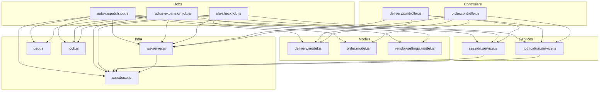
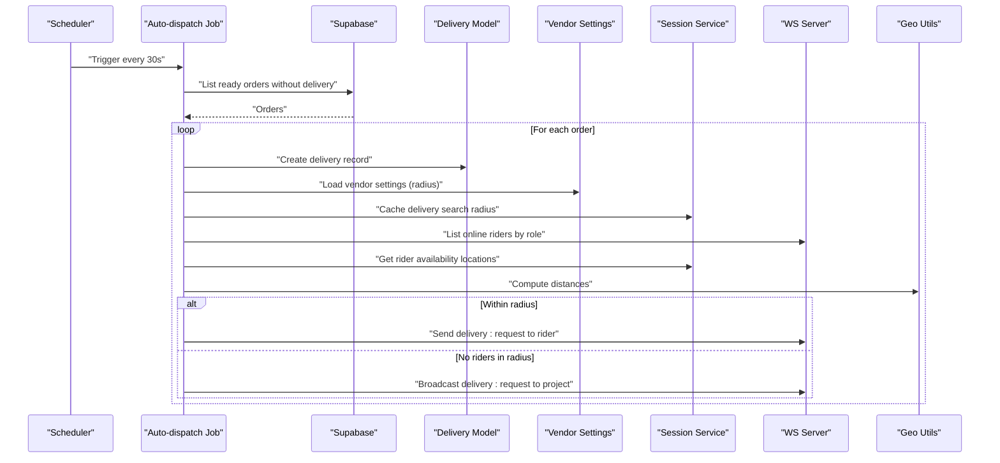
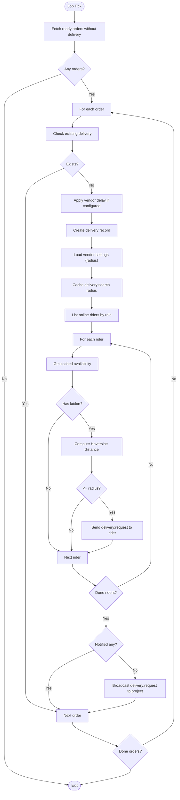
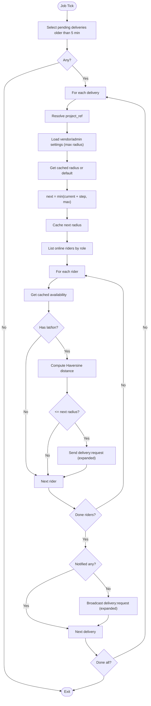
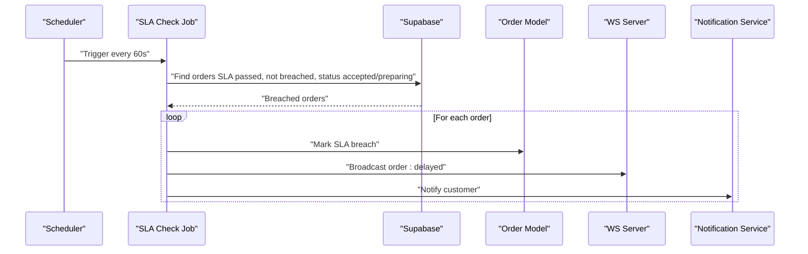
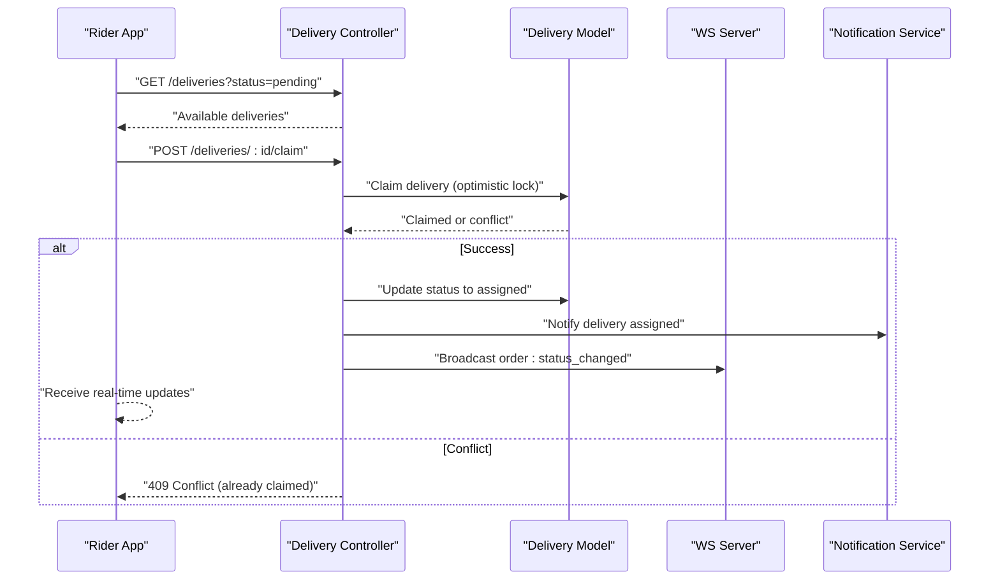
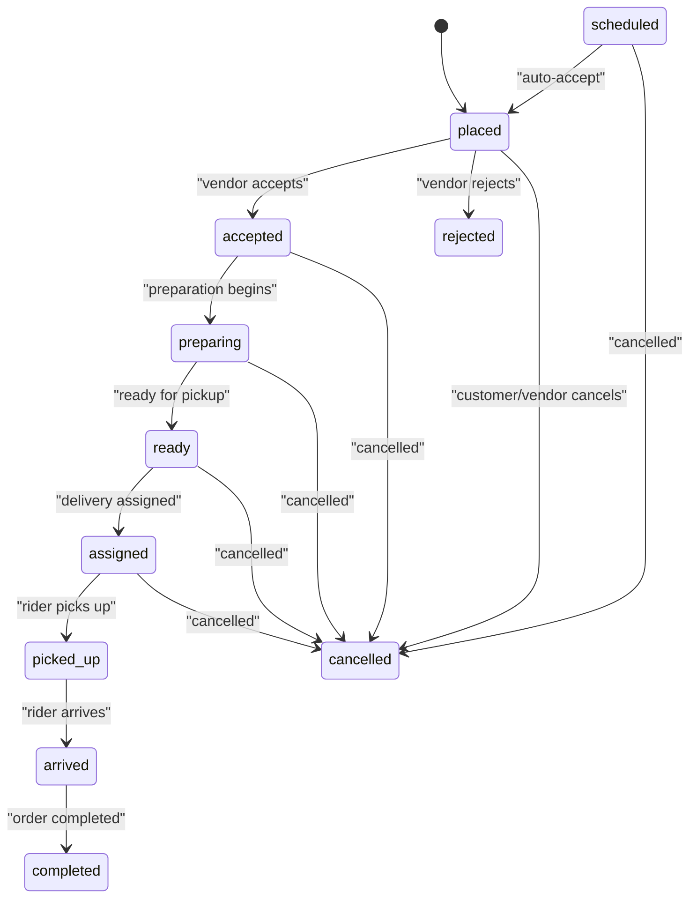
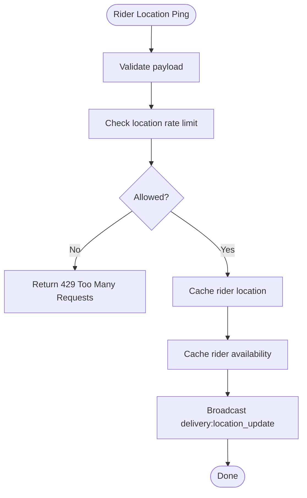
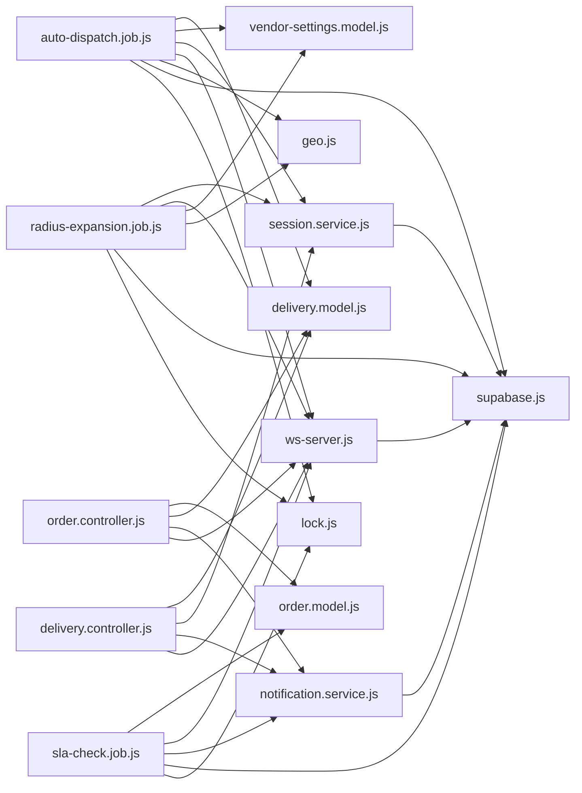

# Auto-dispatch & Rider Assignment

<cite>
**Referenced Files in This Document**
- [auto-dispatch.job.js](file://apps/server/jobs/auto-dispatch.job.js)
- [radius-expansion.job.js](file://apps/server/jobs/radius-expansion.job.js)
- [sla-check.job.js](file://apps/server/jobs/sla-check.job.js)
- [delivery.controller.js](file://apps/server/controllers/delivery.controller.js)
- [order.controller.js](file://apps/server/controllers/order.controller.js)
- [delivery.model.js](file://apps/server/models/delivery.model.js)
- [order.model.js](file://apps/server/models/order.model.js)
- [vendor-settings.model.js](file://apps/server/models/vendor-settings.model.js)
- [session.service.js](file://apps/server/services/session.service.js)
- [notification.service.js](file://apps/server/services/notification.service.js)
- [ws-server.js](file://apps/server/websocket/ws-server.js)
- [geo.js](file://apps/server/lib/geo.js)
- [supabase.js](file://apps/server/lib/supabase.js)
- [lock.js](file://apps/server/lib/lock.js)
- [use-deliveries.ts](file://apps/rider/src/hooks/use-deliveries.ts)
- [delivery-utils.ts](file://apps/rider-mobile/src/lib/delivery-utils.ts)
</cite>

## Table of Contents
1. [Introduction](#introduction)
2. [Project Structure](#project-structure)
3. [Core Components](#core-components)
4. [Architecture Overview](#architecture-overview)
5. [Detailed Component Analysis](#detailed-component-analysis)
6. [Dependency Analysis](#dependency-analysis)
7. [Performance Considerations](#performance-considerations)
8. [Troubleshooting Guide](#troubleshooting-guide)
9. [Conclusion](#conclusion)
10. [Appendices](#appendices)

## Introduction
This document explains the Delivio auto-dispatch and rider assignment system. It covers how orders become eligible for dispatch, how riders are matched based on proximity and availability, how geographic constraints are enforced, and how background jobs manage periodic checks and radius expansion. It also documents rider claim mechanics, delivery assignment workflows, real-time notifications, integration with location services, and fallback strategies when no nearby riders are available.

## Project Structure
The auto-dispatch system spans several layers:
- Background jobs orchestrate periodic dispatch checks and radius expansion.
- Controllers expose endpoints for listing deliveries, claiming assignments, updating statuses, and managing rider locations.
- Models encapsulate persistence and status transitions for orders and deliveries.
- Services handle session caching, notifications, and Supabase interactions.
- WebSockets enable real-time broadcasts to riders and vendors.
- Utilities provide geographic distance calculations and distributed locking.

**Diagram sources**
- [auto-dispatch.job.js:1-97](file://apps/server/jobs/auto-dispatch.job.js#L1-L97)
- [radius-expansion.job.js:1-87](file://apps/server/jobs/radius-expansion.job.js#L1-L87)
- [sla-check.job.js:1-59](file://apps/server/jobs/sla-check.job.js#L1-L59)
- [delivery.controller.js:1-313](file://apps/server/controllers/delivery.controller.js#L1-L313)
- [order.controller.js:1-513](file://apps/server/controllers/order.controller.js#L1-L513)
- [delivery.model.js:1-98](file://apps/server/models/delivery.model.js#L1-L98)
- [order.model.js:1-178](file://apps/server/models/order.model.js#L1-L178)
- [vendor-settings.model.js:1-51](file://apps/server/models/vendor-settings.model.js#L1-L51)
- [session.service.js:1-180](file://apps/server/services/session.service.js#L1-L180)
- [notification.service.js:1-180](file://apps/server/services/notification.service.js#L1-L180)
- [ws-server.js:1-237](file://apps/server/websocket/ws-server.js#L1-L237)
- [geo.js:1-15](file://apps/server/lib/geo.js#L1-L15)
- [supabase.js:1-151](file://apps/server/lib/supabase.js#L1-L151)
- [lock.js:1-62](file://apps/server/lib/lock.js#L1-L62)

**Section sources**
- [auto-dispatch.job.js:1-97](file://apps/server/jobs/auto-dispatch.job.js#L1-L97)
- [radius-expansion.job.js:1-87](file://apps/server/jobs/radius-expansion.job.js#L1-L87)
- [sla-check.job.js:1-59](file://apps/server/jobs/sla-check.job.js#L1-L59)
- [delivery.controller.js:1-313](file://apps/server/controllers/delivery.controller.js#L1-L313)
- [order.controller.js:1-513](file://apps/server/controllers/order.controller.js#L1-L513)
- [delivery.model.js:1-98](file://apps/server/models/delivery.model.js#L1-L98)
- [order.model.js:1-178](file://apps/server/models/order.model.js#L1-L178)
- [vendor-settings.model.js:1-51](file://apps/server/models/vendor-settings.model.js#L1-L51)
- [session.service.js:1-180](file://apps/server/services/session.service.js#L1-L180)
- [notification.service.js:1-180](file://apps/server/services/notification.service.js#L1-L180)
- [ws-server.js:1-237](file://apps/server/websocket/ws-server.js#L1-L237)
- [geo.js:1-15](file://apps/server/lib/geo.js#L1-L15)
- [supabase.js:1-151](file://apps/server/lib/supabase.js#L1-L151)
- [lock.js:1-62](file://apps/server/lib/lock.js#L1-L62)

## Core Components
- Auto-dispatch job: Periodically scans for ready orders without a delivery record, creates a delivery, caches the search radius, and notifies nearby online riders within the vendor’s configured radius. Falls back to broadcasting to the entire project if none are nearby.
- Radius expansion job: For pending deliveries older than a threshold, expands the search radius incrementally and re-broadcasts delivery requests.
- SLA check job: Detects orders past their SLA deadline and marks them as breached, broadcasting delays and sending notifications.
- Delivery controller: Handles listing available deliveries, claiming assignments, updating delivery statuses, logging rider locations, and assigning riders manually or externally.
- Order controller: Manages order lifecycle, status transitions, cancellations, refunds, and SLA extensions.
- Session service: Caches rider availability and delivery search radii, enforces location update rate limits, and persists location pings.
- WebSocket server: Maintains connection registries, authenticates clients, and broadcasts real-time events to project-specific channels.
- Vendor settings model: Stores per-project delivery radius, auto-accept behavior, and delivery mode.
- Notification service: Sends push notifications to users for order and delivery events.
- Geographic utilities: Provides Haversine distance calculation for proximity checks.
- Supabase integration: Centralized REST and SQL helpers for database operations.
- Distributed locking: Ensures only one instance runs expensive background tasks concurrently.

**Section sources**
- [auto-dispatch.job.js:14-97](file://apps/server/jobs/auto-dispatch.job.js#L14-L97)
- [radius-expansion.job.js:13-87](file://apps/server/jobs/radius-expansion.job.js#L13-L87)
- [sla-check.job.js:11-59](file://apps/server/jobs/sla-check.job.js#L11-L59)
- [delivery.controller.js:10-313](file://apps/server/controllers/delivery.controller.js#L10-L313)
- [order.controller.js:140-513](file://apps/server/controllers/order.controller.js#L140-L513)
- [session.service.js:108-153](file://apps/server/services/session.service.js#L108-L153)
- [ws-server.js:11-237](file://apps/server/websocket/ws-server.js#L11-L237)
- [vendor-settings.model.js:9-51](file://apps/server/models/vendor-settings.model.js#L9-L51)
- [notification.service.js:1-180](file://apps/server/services/notification.service.js#L1-L180)
- [geo.js:1-15](file://apps/server/lib/geo.js#L1-L15)
- [supabase.js:18-151](file://apps/server/lib/supabase.js#L18-L151)
- [lock.js:17-62](file://apps/server/lib/lock.js#L17-L62)

## Architecture Overview
The system uses a background-job-driven auto-dispatch pipeline combined with real-time messaging and session caching to match riders to orders efficiently.

**Diagram sources**
- [auto-dispatch.job.js:18-90](file://apps/server/jobs/auto-dispatch.job.js#L18-L90)
- [delivery.model.js:37-47](file://apps/server/models/delivery.model.js#L37-L47)
- [vendor-settings.model.js:14-20](file://apps/server/models/vendor-settings.model.js#L14-L20)
- [session.service.js:142-148](file://apps/server/services/session.service.js#L142-L148)
- [ws-server.js:211-220](file://apps/server/websocket/ws-server.js#L211-L220)
- [geo.js:3-11](file://apps/server/lib/geo.js#L3-L11)

## Detailed Component Analysis

### Auto-dispatch Job
- Purpose: Periodic scanning and dispatch initiation for ready orders.
- Eligibility: Orders with status “ready” and no existing delivery record.
- Vendor delay: Optional vendor-configured delay prevents immediate dispatch.
- Delivery creation: Creates a pending delivery record linked to the order.
- Search radius: Loads vendor delivery radius and caches it per delivery.
- Proximity matching: Iterates online riders, retrieves cached availability, computes Haversine distance against workspace center, and sends targeted notifications if within radius.
- Fallback: If no nearby riders are found, broadcasts to the entire project.

**Diagram sources**
- [auto-dispatch.job.js:18-90](file://apps/server/jobs/auto-dispatch.job.js#L18-L90)
- [geo.js:3-11](file://apps/server/lib/geo.js#L3-L11)
- [session.service.js:142-148](file://apps/server/services/session.service.js#L142-L148)
- [ws-server.js:211-220](file://apps/server/websocket/ws-server.js#L211-L220)

**Section sources**
- [auto-dispatch.job.js:18-90](file://apps/server/jobs/auto-dispatch.job.js#L18-L90)
- [vendor-settings.model.js:14-20](file://apps/server/models/vendor-settings.model.js#L14-L20)
- [delivery.model.js:37-47](file://apps/server/models/delivery.model.js#L37-L47)
- [session.service.js:142-148](file://apps/server/services/session.service.js#L142-L148)
- [ws-server.js:211-220](file://apps/server/websocket/ws-server.js#L211-L220)
- [geo.js:3-11](file://apps/server/lib/geo.js#L3-L11)

### Radius Expansion Job
- Purpose: Expand the search radius for stale pending deliveries to improve assignment chances.
- Trigger: Runs every two minutes; identifies pending deliveries older than five minutes without an assigned rider.
- Behavior: Increments the cached radius per delivery up to a maximum, then re-notifies nearby riders or broadcasts to the project.

**Diagram sources**
- [radius-expansion.job.js:13-87](file://apps/server/jobs/radius-expansion.job.js#L13-L87)
- [geo.js:3-11](file://apps/server/lib/geo.js#L3-L11)
- [session.service.js:142-153](file://apps/server/services/session.service.js#L142-L153)
- [ws-server.js:211-220](file://apps/server/websocket/ws-server.js#L211-L220)

**Section sources**
- [radius-expansion.job.js:13-87](file://apps/server/jobs/radius-expansion.job.js#L13-L87)
- [session.service.js:142-153](file://apps/server/services/session.service.js#L142-L153)
- [ws-server.js:211-220](file://apps/server/websocket/ws-server.js#L211-L220)
- [geo.js:3-11](file://apps/server/lib/geo.js#L3-L11)

### SLA Breach Detection
- Purpose: Monitor orders past their SLA deadline and mark them as breached.
- Trigger: Runs every minute.
- Behavior: Updates order status and broadcasts “order:delayed” events, optionally notifying customers.

**Diagram sources**
- [sla-check.job.js:15-56](file://apps/server/jobs/sla-check.job.js#L15-L56)
- [order.controller.js:140-191](file://apps/server/controllers/order.controller.js#L140-L191)
- [notification.service.js:106-117](file://apps/server/services/notification.service.js#L106-L117)

**Section sources**
- [sla-check.job.js:15-56](file://apps/server/jobs/sla-check.job.js#L15-L56)
- [order.controller.js:140-191](file://apps/server/controllers/order.controller.js#L140-L191)
- [notification.service.js:106-117](file://apps/server/services/notification.service.js#L106-L117)

### Delivery Assignment Workflow
- Listing available deliveries: Riders can list deliveries with status “pending”.
- Claiming a delivery: A rider claims a delivery via endpoint; the model performs an optimistic lock to ensure only unassigned deliveries are claimed.
- Updating status: After claiming, the delivery status transitions to “assigned”; further status updates are broadcast to the project.
- Real-time location updates: Riders can push location pings; the system caches them and broadcasts updates to the project.
- Reassignment: Administrators can reassign a delivery by clearing rider association and broadcasting a new request.

**Diagram sources**
- [delivery.controller.js:10-52](file://apps/server/controllers/delivery.controller.js#L10-L52)
- [delivery.controller.js:25-52](file://apps/server/controllers/delivery.controller.js#L25-L52)
- [delivery.model.js:49-66](file://apps/server/models/delivery.model.js#L49-L66)
- [notification.service.js:58-68](file://apps/server/services/notification.service.js#L58-L68)
- [ws-server.js:162-175](file://apps/server/websocket/ws-server.js#L162-L175)

**Section sources**
- [delivery.controller.js:10-52](file://apps/server/controllers/delivery.controller.js#L10-L52)
- [delivery.controller.js:54-78](file://apps/server/controllers/delivery.controller.js#L54-L78)
- [delivery.controller.js:80-114](file://apps/server/controllers/delivery.controller.js#L80-L114)
- [delivery.controller.js:185-220](file://apps/server/controllers/delivery.controller.js#L185-L220)
- [delivery.controller.js:224-258](file://apps/server/controllers/delivery.controller.js#L224-L258)
- [delivery.model.js:49-66](file://apps/server/models/delivery.model.js#L49-L66)
- [notification.service.js:58-68](file://apps/server/services/notification.service.js#L58-L68)
- [ws-server.js:162-175](file://apps/server/websocket/ws-server.js#L162-L175)

### Order Lifecycle and Status Transitions
- Order statuses include placed, accepted, rejected, preparing, ready, assigned, picked_up, arrived, completed, cancelled, and scheduled.
- Controllers enforce valid transitions and broadcast real-time updates.
- SLA deadlines are set upon acceptance and can be extended; breaches are detected by the SLA job.

**Diagram sources**
- [order.model.js:7-21](file://apps/server/models/order.model.js#L7-L21)
- [order.controller.js:140-191](file://apps/server/controllers/order.controller.js#L140-L191)

**Section sources**
- [order.model.js:7-21](file://apps/server/models/order.model.js#L7-L21)
- [order.controller.js:140-191](file://apps/server/controllers/order.controller.js#L140-L191)

### Location Services, Geofencing, and Distance Calculations
- Riders push location pings with lat/lon, heading, and speed; the system caches them and rate-limits updates to one per three seconds per delivery.
- Availability locations are cached separately to support matching even when riders are not in the dispatch UI.
- Proximity checks use Haversine distance between rider availability coordinates and the workspace center.
- Delivery search radius is cached per delivery and expanded by the radius expansion job.

**Diagram sources**
- [delivery.controller.js:80-114](file://apps/server/controllers/delivery.controller.js#L80-L114)
- [session.service.js:110-130](file://apps/server/services/session.service.js#L110-L130)
- [session.service.js:134-144](file://apps/server/services/session.service.js#L134-L144)
- [ws-server.js:162-175](file://apps/server/websocket/ws-server.js#L162-L175)

**Section sources**
- [delivery.controller.js:80-114](file://apps/server/controllers/delivery.controller.js#L80-L114)
- [session.service.js:110-130](file://apps/server/services/session.service.js#L110-L130)
- [session.service.js:134-144](file://apps/server/services/session.service.js#L134-L144)
- [ws-server.js:162-175](file://apps/server/websocket/ws-server.js#L162-L175)
- [geo.js:3-11](file://apps/server/lib/geo.js#L3-L11)

### Vendor Settings and Dispatch Constraints
- Delivery radius: Per-project radius used for proximity matching and caching.
- Auto-accept: Optional vendor behavior to automatically accept orders upon placement.
- Delivery modes: Third-party or vendor-rider delivery modes are validated.

**Section sources**
- [vendor-settings.model.js:14-47](file://apps/server/models/vendor-settings.model.js#L14-L47)
- [order.controller.js:86-138](file://apps/server/controllers/order.controller.js#L86-L138)

### Notifications and Real-time Events
- Delivery assigned: Push notification and broadcast to the project.
- Rider arrived: Broadcast and optional customer notification.
- Order status changes: Broadcast and customer push notifications.
- Delivery request: Targeted or broadcast depending on proximity.

**Section sources**
- [notification.service.js:58-68](file://apps/server/services/notification.service.js#L58-L68)
- [notification.service.js:122-135](file://apps/server/services/notification.service.js#L122-L135)
- [order.controller.js:161-177](file://apps/server/controllers/order.controller.js#L161-L177)
- [delivery.controller.js:146-181](file://apps/server/controllers/delivery.controller.js#L146-L181)
- [auto-dispatch.job.js:58-77](file://apps/server/jobs/auto-dispatch.job.js#L58-L77)

### Frontend Integration
- Rider mobile and web apps query available deliveries and active deliveries at intervals and receive real-time updates via WebSocket.
- Delivery normalization handles snake_case conversion for cross-platform compatibility.

**Section sources**
- [use-deliveries.ts:5-20](file://apps/rider/src/hooks/use-deliveries.ts#L5-L20)
- [delivery-utils.ts:6-22](file://apps/rider-mobile/src/lib/delivery-utils.ts#L6-L22)

## Dependency Analysis
The auto-dispatch system exhibits clear separation of concerns:
- Jobs depend on models, vendor settings, session service, WebSocket server, geographic utilities, Supabase, and distributed locks.
- Controllers depend on models, session service, notification service, and WebSocket server.
- Session service depends on Redis/Memory stores and configuration.
- WebSocket server depends on authentication and connection registries.
- Supabase utilities centralize database access and error handling.
- Locking ensures safe concurrent execution of long-running jobs.

**Diagram sources**
- [auto-dispatch.job.js:1-12](file://apps/server/jobs/auto-dispatch.job.js#L1-L12)
- [radius-expansion.job.js:1-11](file://apps/server/jobs/radius-expansion.job.js#L1-L11)
- [sla-check.job.js:1-9](file://apps/server/jobs/sla-check.job.js#L1-L9)
- [delivery.controller.js:1-8](file://apps/server/controllers/delivery.controller.js#L1-L8)
- [order.controller.js:1-14](file://apps/server/controllers/order.controller.js#L1-L14)
- [session.service.js:1-8](file://apps/server/services/session.service.js#L1-L8)
- [notification.service.js:1-6](file://apps/server/services/notification.service.js#L1-L6)
- [ws-server.js:1-9](file://apps/server/websocket/ws-server.js#L1-L9)
- [geo.js:1-15](file://apps/server/lib/geo.js#L1-L15)
- [supabase.js:1-16](file://apps/server/lib/supabase.js#L1-L16)
- [lock.js:1-6](file://apps/server/lib/lock.js#L1-L6)

**Section sources**
- [auto-dispatch.job.js:1-12](file://apps/server/jobs/auto-dispatch.job.js#L1-L12)
- [radius-expansion.job.js:1-11](file://apps/server/jobs/radius-expansion.job.js#L1-L11)
- [sla-check.job.js:1-9](file://apps/server/jobs/sla-check.job.js#L1-L9)
- [delivery.controller.js:1-8](file://apps/server/controllers/delivery.controller.js#L1-L8)
- [order.controller.js:1-14](file://apps/server/controllers/order.controller.js#L1-L14)
- [session.service.js:1-8](file://apps/server/services/session.service.js#L1-L8)
- [notification.service.js:1-6](file://apps/server/services/notification.service.js#L1-L6)
- [ws-server.js:1-9](file://apps/server/websocket/ws-server.js#L1-L9)
- [geo.js:1-15](file://apps/server/lib/geo.js#L1-L15)
- [supabase.js:1-16](file://apps/server/lib/supabase.js#L1-L16)
- [lock.js:1-6](file://apps/server/lib/lock.js#L1-L6)

## Performance Considerations
- Concurrency control: Distributed locks prevent overlapping executions of heavy jobs.
- Rate limiting: Location updates are throttled to reduce network and storage overhead.
- Caching: Delivery search radius and rider availability are cached to minimize repeated computations and DB queries.
- Incremental radius expansion: Prevents immediate broad broadcasts while progressively widening reach.
- Efficient broadcasting: WebSocket server maintains lightweight registries keyed by project and user role.

[No sources needed since this section provides general guidance]

## Troubleshooting Guide
- No deliveries appear for a rider:
  - Verify the rider is online and has an availability location cached.
  - Confirm the vendor’s delivery radius is sufficient and the rider is within it.
  - Check that orders are “ready” and have no existing delivery record.
- Rider claims fail:
  - Race conditions can cause conflicts; ensure the delivery is still unassigned before claiming.
- Excessive notifications:
  - Review vendor delay settings and radius expansion behavior.
- SLA breaches:
  - Confirm SLA deadlines are set and the SLA check job is running; verify customer notifications are configured.

**Section sources**
- [auto-dispatch.job.js:23-40](file://apps/server/jobs/auto-dispatch.job.js#L23-L40)
- [delivery.controller.js:25-52](file://apps/server/controllers/delivery.controller.js#L25-L52)
- [session.service.js:134-144](file://apps/server/services/session.service.js#L134-L144)
- [sla-check.job.js:20-27](file://apps/server/jobs/sla-check.job.js#L20-L27)

## Conclusion
Delivio’s auto-dispatch system combines periodic background jobs, real-time messaging, and session caching to deliver efficient, scalable rider assignment. Proximity-based matching, vendor-configurable delays and radii, incremental radius expansion, and robust fallback mechanisms ensure reliable dispatch outcomes. The system’s modular design and centralized Supabase integration facilitate maintainability and extensibility.

[No sources needed since this section summarizes without analyzing specific files]

## Appendices

### Dispatch Scenarios
- Scenario A: New order becomes ready → Auto-dispatch creates delivery → Nearby riders receive targeted notifications → First to claim wins.
- Scenario B: No nearby riders → Auto-dispatch broadcasts to project → Any available rider can claim.
- Scenario C: Pending delivery remains unassigned after five minutes → Radius expansion increases search range → Re-notifies riders within expanded radius.
- Scenario D: Rider location pings arrive → System caches and rate-limits → Broadcasts live updates to project.

**Section sources**
- [auto-dispatch.job.js:44-77](file://apps/server/jobs/auto-dispatch.job.js#L44-L77)
- [radius-expansion.job.js:35-71](file://apps/server/jobs/radius-expansion.job.js#L35-L71)
- [delivery.controller.js:80-114](file://apps/server/controllers/delivery.controller.js#L80-L114)

### Rider Capacity and Peak Adjustments
- Current implementation does not enforce explicit rider capacity limits or peak-hour adjustments. Consider adding:
  - Rider capacity tracking per shift/time slot.
  - Dynamic radius adjustments during peak hours.
  - Priority queues or surge pricing hooks integrated with vendor settings.

[No sources needed since this section provides general guidance]

### Fallback Assignment Strategies
- If no riders are within the vendor radius, the system falls back to broadcasting to the entire project.
- If still no takers, administrators can manually assign or reassign deliveries.

**Section sources**
- [auto-dispatch.job.js:69-77](file://apps/server/jobs/auto-dispatch.job.js#L69-L77)
- [delivery.controller.js:224-258](file://apps/server/controllers/delivery.controller.js#L224-L258)