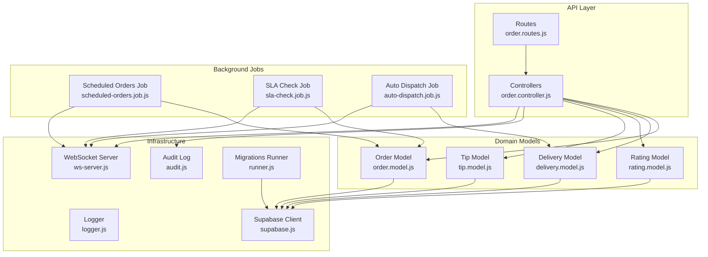
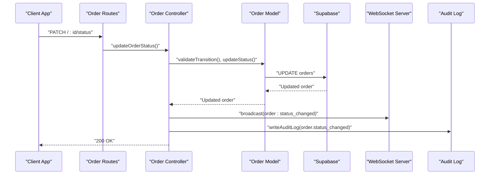
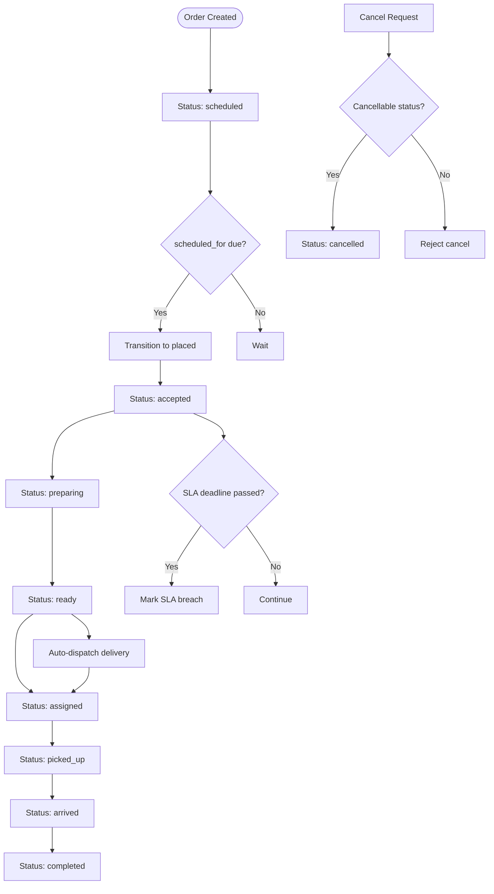
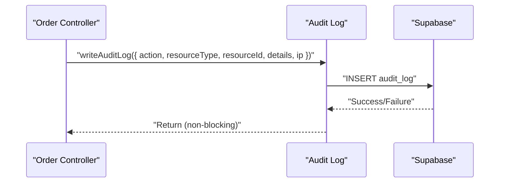
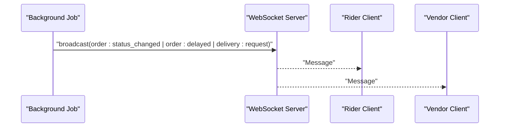
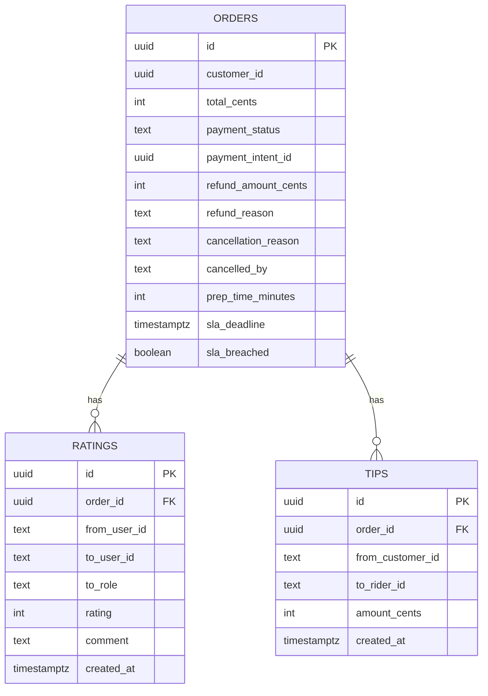
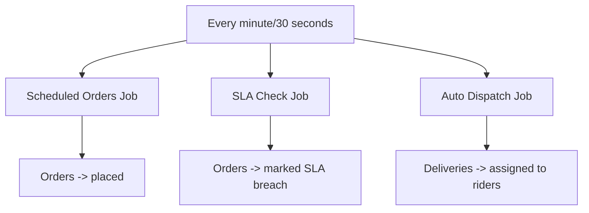
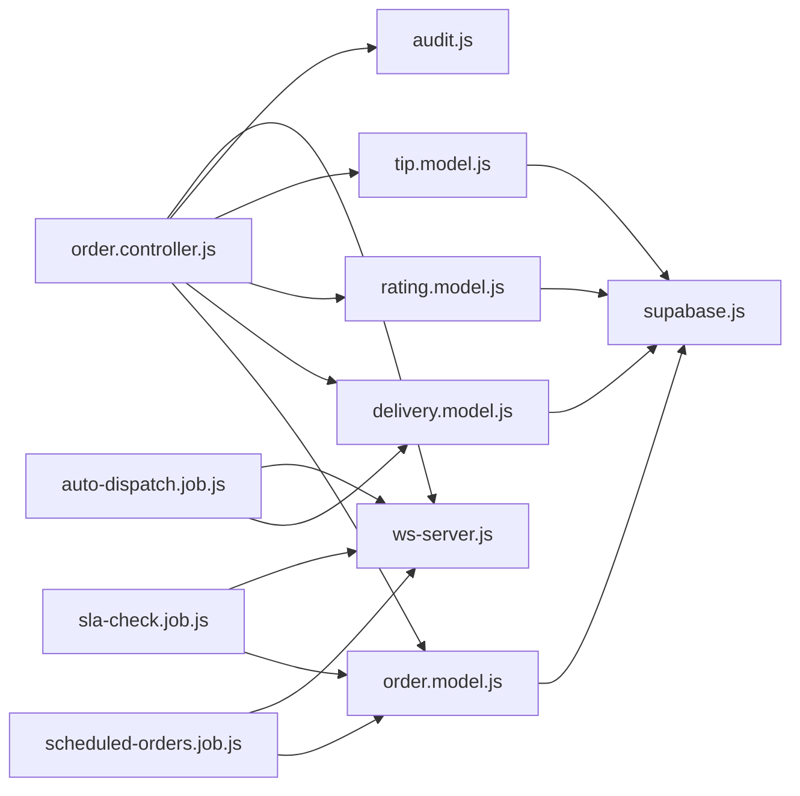

# Order Analytics & Reporting

<cite>
**Referenced Files in This Document**
- [audit.js](file://apps/server/lib/audit.js)
- [order.model.js](file://apps/server/models/order.model.js)
- [order.controller.js](file://apps/server/controllers/order.controller.js)
- [order.routes.js](file://apps/server/routes/order.routes.js)
- [scheduled-orders.job.js](file://apps/server/jobs/scheduled-orders.job.js)
- [sla-check.job.js](file://apps/server/jobs/sla-check.job.js)
- [auto-dispatch.job.js](file://apps/server/jobs/auto-dispatch.job.js)
- [007_audit_log.sql](file://apps/server/migrations/007_audit_log.sql)
- [009_order_lifecycle.sql](file://apps/server/migrations/009_order_lifecycle.sql)
- [rating.model.js](file://apps/server/models/rating.model.js)
- [tip.model.js](file://apps/server/models/tip.model.js)
- [delivery.model.js](file://apps/server/models/delivery.model.js)
- [email.service.js](file://apps/server/services/email.service.js)
- [logger.js](file://apps/server/lib/logger.js)
- [supabase.js](file://apps/server/lib/supabase.js)
- [ws-server.js](file://apps/server/websocket/ws-server.js)
- [runner.js](file://apps/server/migrations/runner.js)
</cite>

## Table of Contents
1. [Introduction](#introduction)
2. [Project Structure](#project-structure)
3. [Core Components](#core-components)
4. [Architecture Overview](#architecture-overview)
5. [Detailed Component Analysis](#detailed-component-analysis)
6. [Dependency Analysis](#dependency-analysis)
7. [Performance Considerations](#performance-considerations)
8. [Troubleshooting Guide](#troubleshooting-guide)
9. [Conclusion](#conclusion)
10. [Appendices](#appendices)

## Introduction
This document describes the Delivio order analytics and reporting system. It explains how order metrics, performance indicators, and business KPIs are collected and exposed, how the reporting dashboard and historical analysis capabilities operate, and how audit logging supports compliance and operational insights. It also covers scheduled order processing, SLA breach detection, peak demand analysis, seasonal trends, revenue analytics, cancellation rates, customer satisfaction metrics, real-time dashboards, automated report generation, and export capabilities. Finally, it provides examples of common analytical queries, custom report creation, and data-driven decision-making processes.

## Project Structure
The analytics and reporting functionality spans several layers:
- Data persistence and schema: Supabase-backed models and migrations define order lifecycles, ratings, tips, and audit logs.
- Business logic: Controllers orchestrate order state transitions, notifications, and audit logging.
- Background jobs: Scheduled tasks manage scheduled orders, SLA checks, and auto-dispatch.
- Real-time updates: WebSocket broadcasting powers live dashboards and notifications.
- Logging and observability: Structured logging and audit trails support compliance and debugging.

**Diagram sources**
- [order.routes.js:1-39](file://apps/server/routes/order.routes.js#L1-L39)
- [order.controller.js:1-513](file://apps/server/controllers/order.controller.js#L1-L513)
- [order.model.js:1-178](file://apps/server/models/order.model.js#L1-L178)
- [delivery.model.js:1-98](file://apps/server/models/delivery.model.js#L1-L98)
- [rating.model.js:1-59](file://apps/server/models/rating.model.js#L1-L59)
- [tip.model.js:1-44](file://apps/server/models/tip.model.js#L1-L44)
- [scheduled-orders.job.js:1-49](file://apps/server/jobs/scheduled-orders.job.js#L1-L49)
- [sla-check.job.js:1-59](file://apps/server/jobs/sla-check.job.js#L1-L59)
- [auto-dispatch.job.js:1-97](file://apps/server/jobs/auto-dispatch.job.js#L1-L97)
- [ws-server.js:1-237](file://apps/server/websocket/ws-server.js#L1-L237)
- [audit.js:1-35](file://apps/server/lib/audit.js#L1-L35)
- [logger.js:1-36](file://apps/server/lib/logger.js#L1-L36)
- [supabase.js:1-151](file://apps/server/lib/supabase.js#L1-L151)
- [runner.js:1-122](file://apps/server/migrations/runner.js#L1-L122)

**Section sources**
- [order.routes.js:1-39](file://apps/server/routes/order.routes.js#L1-L39)
- [order.controller.js:1-513](file://apps/server/controllers/order.controller.js#L1-L513)
- [order.model.js:1-178](file://apps/server/models/order.model.js#L1-L178)
- [delivery.model.js:1-98](file://apps/server/models/delivery.model.js#L1-L98)
- [rating.model.js:1-59](file://apps/server/models/rating.model.js#L1-L59)
- [tip.model.js:1-44](file://apps/server/models/tip.model.js#L1-L44)
- [scheduled-orders.job.js:1-49](file://apps/server/jobs/scheduled-orders.job.js#L1-L49)
- [sla-check.job.js:1-59](file://apps/server/jobs/sla-check.job.js#L1-L59)
- [auto-dispatch.job.js:1-97](file://apps/server/jobs/auto-dispatch.job.js#L1-L97)
- [ws-server.js:1-237](file://apps/server/websocket/ws-server.js#L1-L237)
- [audit.js:1-35](file://apps/server/lib/audit.js#L1-L35)
- [logger.js:1-36](file://apps/server/lib/logger.js#L1-L36)
- [supabase.js:1-151](file://apps/server/lib/supabase.js#L1-L151)
- [runner.js:1-122](file://apps/server/migrations/runner.js#L1-L122)

## Core Components
- Order lifecycle and metrics
  - Orders track status, SLA metadata, cancellations, and refunds. Metrics include cancellation rate, completion rate, SLA breach rate, and scheduled-to-pending conversion.
  - Key model methods: status transitions, SLA deadline and breach handling, scheduled order retrieval, and refund application.
- Delivery and dispatch analytics
  - Deliveries capture assignment, pick-up, arrival, and delivery events. Dispatch jobs enable peak demand analysis and real-time availability insights.
- Ratings and tips
  - Ratings and tips tables support customer satisfaction metrics and rider compensation analytics.
- Audit logging and compliance
  - Audit entries record actions, resources, and IP addresses for compliance and debugging.
- Real-time dashboards and notifications
  - WebSocket broadcasts deliver live updates for status changes, delays, and delivery requests.
- Background jobs
  - Scheduled orders, SLA checks, and auto-dispatch jobs automate operational insights and reduce manual intervention.

**Section sources**
- [order.model.js:1-178](file://apps/server/models/order.model.js#L1-L178)
- [delivery.model.js:1-98](file://apps/server/models/delivery.model.js#L1-L98)
- [rating.model.js:1-59](file://apps/server/models/rating.model.js#L1-L59)
- [tip.model.js:1-44](file://apps/server/models/tip.model.js#L1-L44)
- [audit.js:1-35](file://apps/server/lib/audit.js#L1-L35)
- [ws-server.js:1-237](file://apps/server/websocket/ws-server.js#L1-L237)
- [scheduled-orders.job.js:1-49](file://apps/server/jobs/scheduled-orders.job.js#L1-L49)
- [sla-check.job.js:1-59](file://apps/server/jobs/sla-check.job.js#L1-L59)
- [auto-dispatch.job.js:1-97](file://apps/server/jobs/auto-dispatch.job.js#L1-L97)

## Architecture Overview
The analytics pipeline integrates REST APIs, domain models, background jobs, and real-time messaging to collect, process, and expose order metrics.

**Diagram sources**
- [order.routes.js:21-22](file://apps/server/routes/order.routes.js#L21-L22)
- [order.controller.js:142-191](file://apps/server/controllers/order.controller.js#L142-L191)
- [order.model.js:95-113](file://apps/server/models/order.model.js#L95-L113)
- [ws-server.js:162-175](file://apps/server/websocket/ws-server.js#L162-L175)
- [audit.js:18-32](file://apps/server/lib/audit.js#L18-L32)

**Section sources**
- [order.controller.js:142-191](file://apps/server/controllers/order.controller.js#L142-L191)
- [order.model.js:95-113](file://apps/server/models/order.model.js#L95-L113)
- [ws-server.js:162-175](file://apps/server/websocket/ws-server.js#L162-L175)
- [audit.js:18-32](file://apps/server/lib/audit.js#L18-L32)

## Detailed Component Analysis

### Order Lifecycle and Metrics
- Status transitions and validations ensure accurate lifecycle tracking.
- SLA metadata (prep time, deadline, breach flag) enables SLA performance analytics.
- Scheduled orders automatically transition to pending, supporting peak demand forecasting.
- Refunds and cancellations feed cancellation and revenue analytics.

**Diagram sources**
- [order.model.js:12-21](file://apps/server/models/order.model.js#L12-L21)
- [order.model.js:161-166](file://apps/server/models/order.model.js#L161-L166)
- [sla-check.job.js:20-37](file://apps/server/jobs/sla-check.job.js#L20-L37)
- [scheduled-orders.job.js:18-36](file://apps/server/jobs/scheduled-orders.job.js#L18-L36)
- [auto-dispatch.job.js:23-42](file://apps/server/jobs/auto-dispatch.job.js#L23-L42)

**Section sources**
- [order.model.js:12-21](file://apps/server/models/order.model.js#L12-L21)
- [order.model.js:161-166](file://apps/server/models/order.model.js#L161-L166)
- [sla-check.job.js:20-37](file://apps/server/jobs/sla-check.job.js#L20-L37)
- [scheduled-orders.job.js:18-36](file://apps/server/jobs/scheduled-orders.job.js#L18-L36)
- [auto-dispatch.job.js:23-42](file://apps/server/jobs/auto-dispatch.job.js#L23-L42)

### Audit Logging System
- Audit entries capture user actions, resource types/IDs, details, and IP addresses.
- Non-blocking writes ensure business continuity while maintaining compliance.
- Indexes on audit_log accelerate compliance queries and debugging.

**Diagram sources**
- [order.controller.js:178-185](file://apps/server/controllers/order.controller.js#L178-L185)
- [audit.js:18-32](file://apps/server/lib/audit.js#L18-L32)
- [007_audit_log.sql:4-18](file://apps/server/migrations/007_audit_log.sql#L4-L18)

**Section sources**
- [audit.js:18-32](file://apps/server/lib/audit.js#L18-L32)
- [order.controller.js:178-185](file://apps/server/controllers/order.controller.js#L178-L185)
- [007_audit_log.sql:4-18](file://apps/server/migrations/007_audit_log.sql#L4-L18)

### Real-Time Dashboards and Notifications
- WebSocket broadcasts deliver live updates for order status changes, SLA delays, and delivery requests.
- Clients subscribe to project-specific channels and receive filtered messages.

**Diagram sources**
- [ws-server.js:162-175](file://apps/server/websocket/ws-server.js#L162-L175)
- [sla-check.job.js:32-37](file://apps/server/jobs/sla-check.job.js#L32-L37)
- [auto-dispatch.job.js:58-77](file://apps/server/jobs/auto-dispatch.job.js#L58-L77)
- [scheduled-orders.job.js:27-33](file://apps/server/jobs/scheduled-orders.job.js#L27-L33)

**Section sources**
- [ws-server.js:162-175](file://apps/server/websocket/ws-server.js#L162-L175)
- [sla-check.job.js:32-37](file://apps/server/jobs/sla-check.job.js#L32-L37)
- [auto-dispatch.job.js:58-77](file://apps/server/jobs/auto-dispatch.job.js#L58-L77)
- [scheduled-orders.job.js:27-33](file://apps/server/jobs/scheduled-orders.job.js#L27-L33)

### Revenue Analytics, Cancellations, and Satisfaction
- Revenue: orders table tracks total_cents and payment status; refunds modify payment_status and refund fields.
- Cancellations: cancellation_reason and cancelled_by fields enable cancellation rate tracking.
- Satisfaction: ratings and tips tables provide star ratings and tip amounts for performance analysis.

**Diagram sources**
- [order.model.js:56-122](file://apps/server/models/order.model.js#L56-L122)
- [rating.model.js:14-32](file://apps/server/models/rating.model.js#L14-L32)
- [tip.model.js:12-25](file://apps/server/models/tip.model.js#L12-L25)
- [009_order_lifecycle.sql:14-34](file://apps/server/migrations/009_order_lifecycle.sql#L14-L34)

**Section sources**
- [order.model.js:56-122](file://apps/server/models/order.model.js#L56-L122)
- [rating.model.js:14-32](file://apps/server/models/rating.model.js#L14-L32)
- [tip.model.js:12-25](file://apps/server/models/tip.model.js#L12-L25)
- [009_order_lifecycle.sql:14-34](file://apps/server/migrations/009_order_lifecycle.sql#L14-L34)

### Automated Report Generation and Export
- Background jobs generate operational insights:
  - Scheduled orders: convert scheduled orders to pending for peak demand analysis.
  - SLA checks: detect breaches and notify stakeholders.
  - Auto-dispatch: match ready orders to nearby riders for capacity utilization analysis.
- Reports can be derived from Supabase queries and exported via client-side integrations.

**Diagram sources**
- [scheduled-orders.job.js:14-42](file://apps/server/jobs/scheduled-orders.job.js#L14-L42)
- [sla-check.job.js:16-52](file://apps/server/jobs/sla-check.job.js#L16-L52)
- [auto-dispatch.job.js:19-90](file://apps/server/jobs/auto-dispatch.job.js#L19-L90)

**Section sources**
- [scheduled-orders.job.js:14-42](file://apps/server/jobs/scheduled-orders.job.js#L14-L42)
- [sla-check.job.js:16-52](file://apps/server/jobs/sla-check.job.js#L16-L52)
- [auto-dispatch.job.js:19-90](file://apps/server/jobs/auto-dispatch.job.js#L19-L90)

## Dependency Analysis
- Controllers depend on models, services, and infrastructure components.
- Models encapsulate Supabase interactions and enforce domain rules.
- Jobs coordinate with models and broadcast updates via WebSocket.
- Audit logging is invoked from controllers to maintain non-invasive compliance.

**Diagram sources**
- [order.controller.js:1-14](file://apps/server/controllers/order.controller.js#L1-L14)
- [order.model.js:1-6](file://apps/server/models/order.model.js#L1-L6)
- [delivery.model.js:1-6](file://apps/server/models/delivery.model.js#L1-L6)
- [rating.model.js:1-6](file://apps/server/models/rating.model.js#L1-L6)
- [tip.model.js:1-6](file://apps/server/models/tip.model.js#L1-L6)
- [audit.js:1-4](file://apps/server/lib/audit.js#L1-L4)
- [supabase.js:1-151](file://apps/server/lib/supabase.js#L1-L151)
- [scheduled-orders.job.js:1-8](file://apps/server/jobs/scheduled-orders.job.js#L1-L8)
- [sla-check.job.js:1-9](file://apps/server/jobs/sla-check.job.js#L1-L9)
- [auto-dispatch.job.js:1-12](file://apps/server/jobs/auto-dispatch.job.js#L1-L12)
- [ws-server.js:1-16](file://apps/server/websocket/ws-server.js#L1-L16)

**Section sources**
- [order.controller.js:1-14](file://apps/server/controllers/order.controller.js#L1-L14)
- [order.model.js:1-6](file://apps/server/models/order.model.js#L1-L6)
- [delivery.model.js:1-6](file://apps/server/models/delivery.model.js#L1-L6)
- [rating.model.js:1-6](file://apps/server/models/rating.model.js#L1-L6)
- [tip.model.js:1-6](file://apps/server/models/tip.model.js#L1-L6)
- [audit.js:1-4](file://apps/server/lib/audit.js#L1-L4)
- [supabase.js:1-151](file://apps/server/lib/supabase.js#L1-L151)
- [scheduled-orders.job.js:1-8](file://apps/server/jobs/scheduled-orders.job.js#L1-L8)
- [sla-check.job.js:1-9](file://apps/server/jobs/sla-check.job.js#L1-L9)
- [auto-dispatch.job.js:1-12](file://apps/server/jobs/auto-dispatch.job.js#L1-L12)
- [ws-server.js:1-16](file://apps/server/websocket/ws-server.js#L1-L16)

## Performance Considerations
- Background jobs use locking to prevent concurrent execution and reduce contention.
- Supabase REST queries are used consistently; ensure appropriate indexing on frequently filtered columns (e.g., status, created_at, project_ref).
- WebSocket broadcasting scales with connection counts; monitor heartbeats and prune stale connections.
- Audit logging is non-blocking to avoid impacting transactional performance.

[No sources needed since this section provides general guidance]

## Troubleshooting Guide
- Audit log write failures are logged but do not interrupt business logic.
- Supabase fetch errors are captured with structured logs and status codes.
- Logger configuration adapts to development vs production environments.

**Section sources**
- [audit.js:29-31](file://apps/server/lib/audit.js#L29-L31)
- [supabase.js:47-59](file://apps/server/lib/supabase.js#L47-L59)
- [logger.js:24-33](file://apps/server/lib/logger.js#L24-L33)

## Conclusion
Delivio’s analytics and reporting system combines robust order lifecycle tracking, real-time dashboards, and automated background jobs to provide actionable insights. Audit logging ensures compliance, while ratings and tips enrich customer satisfaction analytics. Scheduled order processing, SLA monitoring, and dispatch automation support peak demand and capacity planning. Together, these components enable revenue analytics, cancellation tracking, and data-driven decision-making.

[No sources needed since this section summarizes without analyzing specific files]

## Appendices

### Common Analytical Queries
- Revenue by day and by product category
  - Use Supabase SELECT with date truncation and joins to orders and order_items.
- Cancellation rate by hour and by restaurant
  - Filter orders by status 'cancelled' and group by time and vendor.
- SLA breach rate and average delay
  - Count orders with sla_breached = true and compute mean difference between sla_deadline and completion timestamps.
- Peak demand hours and zones
  - Aggregate order counts by hour and delivery zone to identify high-demand periods.
- Seasonal trends
  - Group by month/year and compute rolling averages for orders and revenue.
- Customer satisfaction scores
  - Average ratings per vendor and per rider; correlate with tip amounts.

[No sources needed since this section provides general guidance]

### Custom Report Creation
- Use Supabase SQL via the management API to build custom aggregations and time-series views.
- Export results to CSV or integrate with BI tools using the Supabase REST API.

[No sources needed since this section provides general guidance]

### Data-Driven Decision Making
- Operational decisions: adjust prep_time_minutes and delivery_radius_km based on SLA and dispatch metrics.
- Capacity planning: leverage auto-dispatch and delivery assignment logs to optimize rider allocation.
- Compliance: audit logs provide traceability for order status changes and financial actions.

[No sources needed since this section provides general guidance]