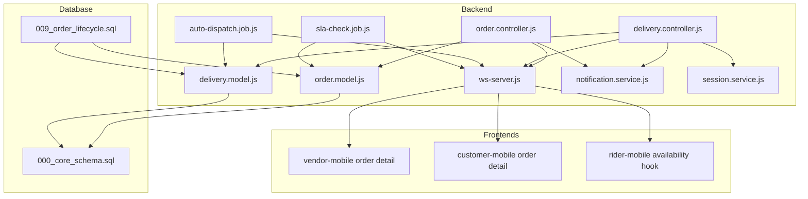
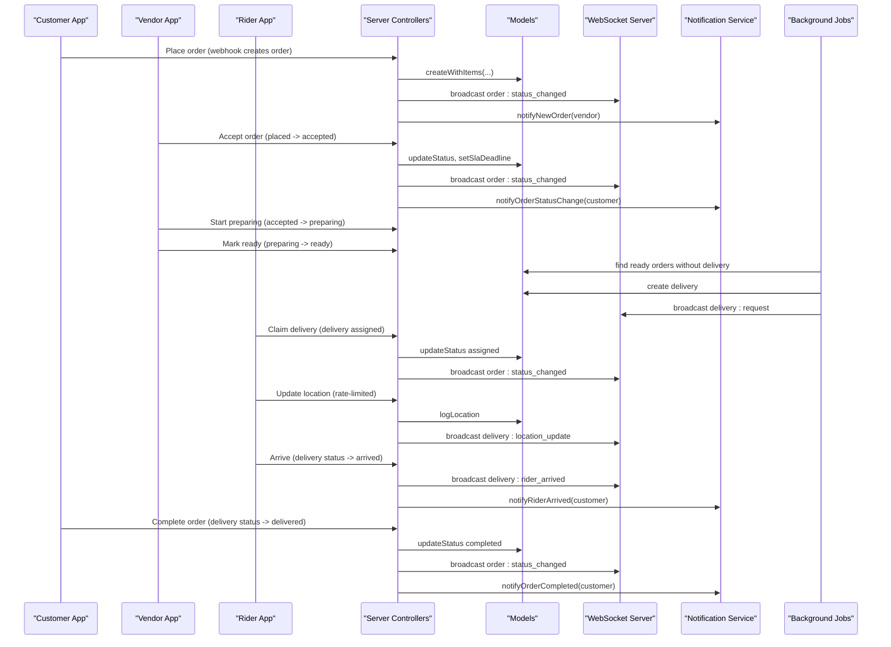
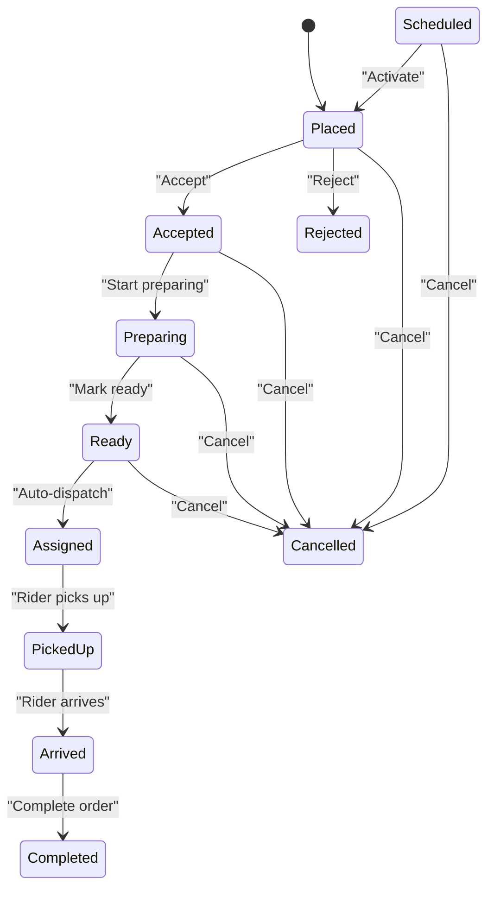
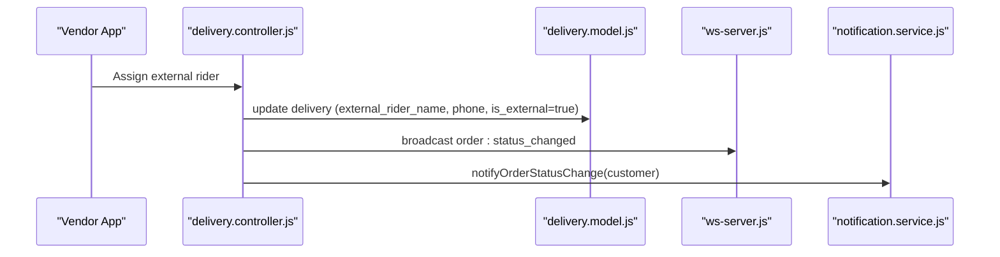
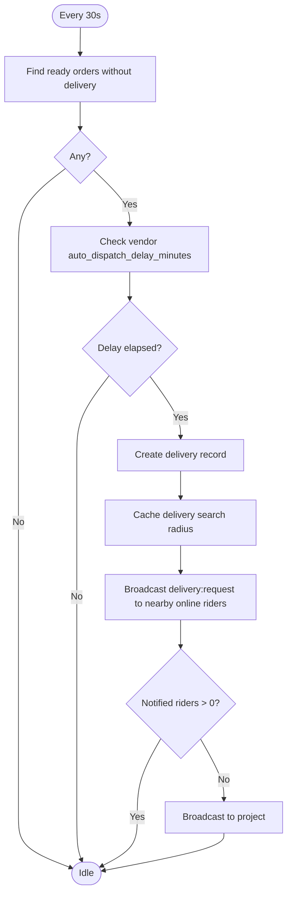
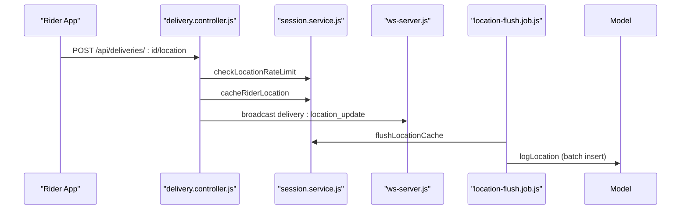
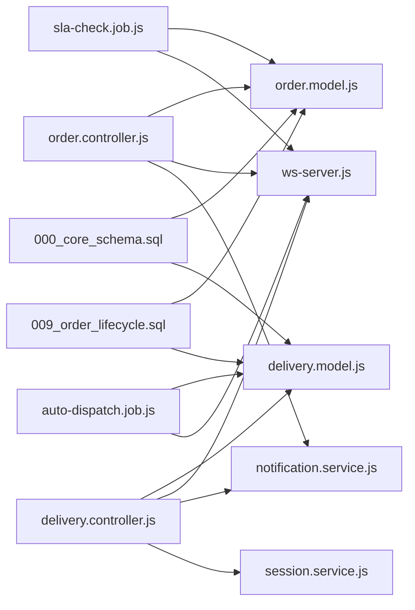

# Order Fulfillment Workflows

<cite>
**Referenced Files in This Document**
- [order.model.js](file://apps/server/models/order.model.js)
- [order.controller.js](file://apps/server/controllers/order.controller.js)
- [delivery.model.js](file://apps/server/models/delivery.model.js)
- [delivery.controller.js](file://apps/server/controllers/delivery.controller.js)
- [auto-dispatch.job.js](file://apps/server/jobs/auto-dispatch.job.js)
- [sla-check.job.js](file://apps/server/jobs/sla-check.job.js)
- [ws-server.js](file://apps/server/websocket/ws-server.js)
- [notification.service.js](file://apps/server/services/notification.service.js)
- [session.service.js](file://apps/server/services/session.service.js)
- [order_lifecycle.sql](file://apps/server/migrations/009_order_lifecycle.sql)
- [core_schema.sql](file://apps/server/migrations/000_core_schema.sql)
- [vendor-mobile order detail](file://apps/vendor-mobile/src/app/order/[id].tsx)
- [vendor-mobile tabs index](file://apps/vendor-mobile/src/app/(tabs)/index.tsx)
- [customer-mobile order detail](file://apps/customer-mobile/src/app/order/[id].tsx)
- [rider-mobile availability hook](file://apps/rider-mobile/src/lib/use-rider-availability.ts)
- [rider-web availability hook](file://apps/rider/src/hooks/use-rider-availability.ts)
- [location-flush.job.js](file://apps/server/jobs/location-flush.job.js)
- [delivio-production-gameplan.md](file://docs/delivio-production-gameplan.md)
</cite>

## Table of Contents
1. [Introduction](#introduction)
2. [Project Structure](#project-structure)
3. [Core Components](#core-components)
4. [Architecture Overview](#architecture-overview)
5. [Detailed Component Analysis](#detailed-component-analysis)
6. [Dependency Analysis](#dependency-analysis)
7. [Performance Considerations](#performance-considerations)
8. [Troubleshooting Guide](#troubleshooting-guide)
9. [Conclusion](#conclusion)
10. [Appendices](#appendices)

## Introduction
This document explains the end-to-end order-to-delivery workflows in Delivio. It covers preparation from accepted to ready, pickup and delivery handoffs, rider assignment and location sharing, real-time coordination among restaurants, riders, and customers, automation and manual intervention points, exception handling, tracking visibility, customer communications, and performance metrics. Typical scenarios, bottleneck identification, and optimization strategies are included to help operators improve fulfillment efficiency.

## Project Structure
The fulfillment system spans backend services, database migrations, and three client applications:
- Backend: Express controllers, models, jobs, WebSocket server, and services
- Database: Migrations define order lifecycle, delivery statuses, vendor settings, and supporting tables
- Frontends: Restaurant vendor app, customer app, and rider app

**Diagram sources**
- [order.controller.js:1-513](file://apps/server/controllers/order.controller.js#L1-L513)
- [order.model.js:1-178](file://apps/server/models/order.model.js#L1-L178)
- [delivery.controller.js:1-313](file://apps/server/controllers/delivery.controller.js#L1-L313)
- [delivery.model.js:1-98](file://apps/server/models/delivery.model.js#L1-L98)
- [auto-dispatch.job.js:1-97](file://apps/server/jobs/auto-dispatch.job.js#L1-L97)
- [sla-check.job.js:1-59](file://apps/server/jobs/sla-check.job.js#L1-L59)
- [ws-server.js:1-237](file://apps/server/websocket/ws-server.js#L1-L237)
- [notification.service.js:1-180](file://apps/server/services/notification.service.js#L1-L180)
- [session.service.js:102-137](file://apps/server/services/session.service.js#L102-L137)
- [order_lifecycle.sql:1-53](file://apps/server/migrations/009_order_lifecycle.sql#L1-L53)
- [core_schema.sql:54-89](file://apps/server/migrations/000_core_schema.sql#L54-L89)
- [vendor-mobile order detail:1-763](file://apps/vendor-mobile/src/app/order/[id].tsx#L1-L763)
- [customer-mobile order detail:101-120](file://apps/customer-mobile/src/app/order/[id].tsx#L101-L120)
- [rider-mobile availability hook:1-52](file://apps/rider-mobile/src/lib/use-rider-availability.ts#L1-L52)

**Section sources**
- [order.controller.js:1-513](file://apps/server/controllers/order.controller.js#L1-L513)
- [order.model.js:1-178](file://apps/server/models/order.model.js#L1-L178)
- [delivery.controller.js:1-313](file://apps/server/controllers/delivery.controller.js#L1-L313)
- [delivery.model.js:1-98](file://apps/server/models/delivery.model.js#L1-L98)
- [auto-dispatch.job.js:1-97](file://apps/server/jobs/auto-dispatch.job.js#L1-L97)
- [sla-check.job.js:1-59](file://apps/server/jobs/sla-check.job.js#L1-L59)
- [ws-server.js:1-237](file://apps/server/websocket/ws-server.js#L1-L237)
- [notification.service.js:1-180](file://apps/server/services/notification.service.js#L1-L180)
- [session.service.js:102-137](file://apps/server/services/session.service.js#L102-L137)
- [order_lifecycle.sql:1-53](file://apps/server/migrations/009_order_lifecycle.sql#L1-L53)
- [core_schema.sql:54-89](file://apps/server/migrations/000_core_schema.sql#L54-L89)
- [vendor-mobile order detail:1-763](file://apps/vendor-mobile/src/app/order/[id].tsx#L1-L763)
- [customer-mobile order detail:101-120](file://apps/customer-mobile/src/app/order/[id].tsx#L101-L120)
- [rider-mobile availability hook:1-52](file://apps/rider-mobile/src/lib/use-rider-availability.ts#L1-L52)

## Core Components
- Order lifecycle and state machine: Defines valid order statuses, transitions, SLA deadline calculation, and cancellation/refund logic.
- Delivery lifecycle: Tracks delivery creation, claiming, status progression, and external rider assignment.
- Real-time orchestration: WebSocket broadcasts for order/delivery events and live rider location updates.
- Automation: Background jobs for auto-dispatch and SLA breach detection.
- Notifications: Push notifications to vendors, riders, and customers for status changes and events.
- Location services: Cached rider locations with rate limiting and periodic flush to database.

**Section sources**
- [order.model.js:7-21](file://apps/server/models/order.model.js#L7-L21)
- [order.controller.js:16-26](file://apps/server/controllers/order.controller.js#L16-L26)
- [delivery.model.js:7-8](file://apps/server/models/delivery.model.js#L7-L8)
- [delivery.controller.js:144-181](file://apps/server/controllers/delivery.controller.js#L144-L181)
- [ws-server.js:150-175](file://apps/server/websocket/ws-server.js#L150-L175)
- [auto-dispatch.job.js:14-94](file://apps/server/jobs/auto-dispatch.job.js#L14-L94)
- [sla-check.job.js:11-56](file://apps/server/jobs/sla-check.job.js#L11-L56)
- [notification.service.js:24-53](file://apps/server/services/notification.service.js#L24-L53)
- [session.service.js:110-130](file://apps/server/services/session.service.js#L110-L130)

## Architecture Overview
The system uses a controller-model pattern with background jobs and a WebSocket server for real-time updates. Vendor, rider, and customer clients subscribe to live updates and interact via REST endpoints.

**Diagram sources**
- [order.controller.js:84-138](file://apps/server/controllers/order.controller.js#L84-L138)
- [order.controller.js:344-398](file://apps/server/controllers/order.controller.js#L344-L398)
- [order.controller.js:140-191](file://apps/server/controllers/order.controller.js#L140-L191)
- [delivery.controller.js:25-52](file://apps/server/controllers/delivery.controller.js#L25-L52)
- [delivery.controller.js:80-114](file://apps/server/controllers/delivery.controller.js#L80-L114)
- [delivery.controller.js:144-181](file://apps/server/controllers/delivery.controller.js#L144-L181)
- [delivery.controller.js:400-452](file://apps/server/controllers/delivery.controller.js#L400-L452)
- [auto-dispatch.job.js:18-94](file://apps/server/jobs/auto-dispatch.job.js#L18-L94)
- [ws-server.js:162-175](file://apps/server/websocket/ws-server.js#L162-L175)
- [notification.service.js:27-53](file://apps/server/services/notification.service.js#L27-L53)
- [notification.service.js:122-135](file://apps/server/services/notification.service.js#L122-L135)
- [notification.service.js:140-151](file://apps/server/services/notification.service.js#L140-L151)

## Detailed Component Analysis

### Order Lifecycle and SLA Management
- Valid statuses and transitions: placed, accepted, rejected, preparing, ready, assigned, picked_up, arrived, completed, cancelled, scheduled.
- SLA deadline: set upon acceptance; can be extended for accepted/preparing orders.
- Breach detection: background job marks orders as breached when SLA passes.
- Cancellations and refunds: cancellable in placed, accepted, scheduled; auto-refund if paid.

**Diagram sources**
- [order.model.js:12-21](file://apps/server/models/order.model.js#L12-L21)
- [order.controller.js:454-499](file://apps/server/controllers/order.controller.js#L454-L499)
- [sla-check.job.js:15-56](file://apps/server/jobs/sla-check.job.js#L15-L56)

**Section sources**
- [order.model.js:7-21](file://apps/server/models/order.model.js#L7-L21)
- [order.controller.js:16-26](file://apps/server/controllers/order.controller.js#L16-L26)
- [order.controller.js:454-499](file://apps/server/controllers/order.controller.js#L454-L499)
- [sla-check.job.js:15-56](file://apps/server/jobs/sla-check.job.js#L15-L56)

### Delivery Lifecycle and Rider Assignment
- Delivery creation when an order becomes ready.
- Rider claim flow with optimistic locking to prevent race conditions.
- Delivery status progression: pending → assigned → picked_up → arrived → delivered.
- External rider assignment for vendor-managed delivery modes.

**Diagram sources**
- [delivery.controller.js:260-299](file://apps/server/controllers/delivery.controller.js#L260-L299)
- [delivery.model.js:74-81](file://apps/server/models/delivery.model.js#L74-L81)
- [ws-server.js:162-175](file://apps/server/websocket/ws-server.js#L162-L175)
- [notification.service.js:282-293](file://apps/server/services/notification.service.js#L282-L293)

**Section sources**
- [delivery.controller.js:183-220](file://apps/server/controllers/delivery.controller.js#L183-L220)
- [delivery.controller.js:260-299](file://apps/server/controllers/delivery.controller.js#L260-L299)
- [delivery.model.js:49-66](file://apps/server/models/delivery.model.js#L49-L66)

### Auto-Dispatch and Rider Matching
- Every 30 seconds, scan for ready orders without a delivery record.
- Apply vendor auto-dispatch delay if configured.
- Create delivery and broadcast delivery requests to nearby online riders.
- Fallback to global broadcast if no suitable riders found.

**Diagram sources**
- [auto-dispatch.job.js:18-94](file://apps/server/jobs/auto-dispatch.job.js#L18-L94)

**Section sources**
- [auto-dispatch.job.js:14-94](file://apps/server/jobs/auto-dispatch.job.js#L14-L94)

### Real-Time Tracking and Location Sharing
- Riders periodically report location; rate-limited to one update per 3 seconds per delivery.
- Latest location cached in session storage and broadcast to clients.
- Background job flushes cached locations to the rider_locations table at intervals.
- Production plan defines mobile hooks and web components for live tracking.

**Diagram sources**
- [delivery.controller.js:80-114](file://apps/server/controllers/delivery.controller.js#L80-L114)
- [session.service.js:110-130](file://apps/server/services/session.service.js#L110-L130)
- [ws-server.js:162-175](file://apps/server/websocket/ws-server.js#L162-L175)
- [location-flush.job.js:39-59](file://apps/server/jobs/location-flush.job.js#L39-L59)
- [rider-mobile availability hook:20-49](file://apps/rider-mobile/src/lib/use-rider-availability.ts#L20-L49)
- [rider-web availability hook:13-55](file://apps/rider/src/hooks/use-rider-availability.ts#L13-L55)
- [delivio-production-gameplan.md:210-223](file://docs/delivio-production-gameplan.md#L210-L223)

**Section sources**
- [delivery.controller.js:80-114](file://apps/server/controllers/delivery.controller.js#L80-L114)
- [session.service.js:110-130](file://apps/server/services/session.service.js#L110-L130)
- [location-flush.job.js:39-59](file://apps/server/jobs/location-flush.job.js#L39-L59)
- [rider-mobile availability hook:20-49](file://apps/rider-mobile/src/lib/use-rider-availability.ts#L20-L49)
- [rider-web availability hook:13-55](file://apps/rider/src/hooks/use-rider-availability.ts#L13-L55)
- [delivio-production-gameplan.md:210-223](file://docs/delivio-production-gameplan.md#L210-L223)

### Customer Communication and Notifications
- Push notifications for order status changes, rider arrival, completion, and rejections.
- Email notifications for refunds and cancellations.
- WebSocket typing indicators relay for chat.

**Section sources**
- [notification.service.js:24-53](file://apps/server/services/notification.service.js#L24-L53)
- [notification.service.js:104-151](file://apps/server/services/notification.service.js#L104-L151)
- [order.controller.js:170-176](file://apps/server/controllers/order.controller.js#L170-L176)
- [delivery.controller.js:158-167](file://apps/server/controllers/delivery.controller.js#L158-L167)

### Frontend Coordination
- Vendor app: Accept/reject orders, start preparing, mark ready, extend SLA, assign riders, reassign deliveries, and external rider assignment.
- Customer app: Real-time SLA countdown and status updates via WebSocket subscription.
- Rider app: Availability location reporting and active delivery tracking.

**Section sources**
- [vendor-mobile order detail:73-606](file://apps/vendor-mobile/src/app/order/[id].tsx#L73-L606)
- [vendor-mobile tabs index](file://apps/vendor-mobile/src/app/(tabs)/index.tsx#L125-L164)
- [customer-mobile order detail:101-120](file://apps/customer-mobile/src/app/order/[id].tsx#L101-L120)
- [rider-mobile availability hook:20-49](file://apps/rider-mobile/src/lib/use-rider-availability.ts#L20-L49)

## Dependency Analysis
The following diagram shows key dependencies between components involved in fulfillment.

**Diagram sources**
- [order.controller.js:1-15](file://apps/server/controllers/order.controller.js#L1-L15)
- [order.model.js:1-6](file://apps/server/models/order.model.js#L1-L6)
- [delivery.controller.js:1-9](file://apps/server/controllers/delivery.controller.js#L1-L9)
- [delivery.model.js:1-6](file://apps/server/models/delivery.model.js#L1-L6)
- [auto-dispatch.job.js:1-12](file://apps/server/jobs/auto-dispatch.job.js#L1-L12)
- [sla-check.job.js:1-9](file://apps/server/jobs/sla-check.job.js#L1-L9)
- [ws-server.js:1-10](file://apps/server/websocket/ws-server.js#L1-L10)
- [notification.service.js:1-7](file://apps/server/services/notification.service.js#L1-L7)
- [session.service.js:102-137](file://apps/server/services/session.service.js#L102-L137)
- [core_schema.sql:54-89](file://apps/server/migrations/000_core_schema.sql#L54-L89)
- [order_lifecycle.sql:1-53](file://apps/server/migrations/009_order_lifecycle.sql#L1-L53)

**Section sources**
- [order.controller.js:1-15](file://apps/server/controllers/order.controller.js#L1-L15)
- [delivery.controller.js:1-9](file://apps/server/controllers/delivery.controller.js#L1-L9)
- [auto-dispatch.job.js:1-12](file://apps/server/jobs/auto-dispatch.job.js#L1-L12)
- [sla-check.job.js:1-9](file://apps/server/jobs/sla-check.job.js#L1-L9)
- [ws-server.js:1-10](file://apps/server/websocket/ws-server.js#L1-L10)
- [notification.service.js:1-7](file://apps/server/services/notification.service.js#L1-L7)
- [session.service.js:102-137](file://apps/server/services/session.service.js#L102-L137)
- [core_schema.sql:54-89](file://apps/server/migrations/000_core_schema.sql#L54-L89)
- [order_lifecycle.sql:1-53](file://apps/server/migrations/009_order_lifecycle.sql#L1-L53)

## Performance Considerations
- Background jobs run on fixed schedules; ensure adequate intervals to balance responsiveness and load.
- WebSocket broadcasting scales with active connections; monitor connection counts and implement heartbeats.
- Location updates are rate-limited to reduce network overhead and database writes.
- Use indexes from migrations to optimize queries on orders, deliveries, ratings, and tips.
- Consider spatial indexing for advanced geofencing in future enhancements.

[No sources needed since this section provides general guidance]

## Troubleshooting Guide
Common issues and remedies:
- Order status stuck: Verify transitions and idempotency handling; check logs for errors.
- Auto-dispatch not triggering: Confirm vendor settings, delay configuration, and job execution logs.
- Rider location not updating: Check rate limit responses and cached location TTL.
- SLA breach notifications missing: Ensure SLA check job runs and customer has push tokens registered.
- Rider claim conflicts: Optimistic locking prevents race conditions; retry logic is handled by the claim method.

**Section sources**
- [order.controller.js:140-191](file://apps/server/controllers/order.controller.js#L140-L191)
- [auto-dispatch.job.js:18-94](file://apps/server/jobs/auto-dispatch.job.js#L18-L94)
- [delivery.controller.js:80-114](file://apps/server/controllers/delivery.controller.js#L80-L114)
- [sla-check.job.js:15-56](file://apps/server/jobs/sla-check.job.js#L15-L56)
- [delivery.controller.js:25-52](file://apps/server/controllers/delivery.controller.js#L25-L52)

## Conclusion
Delivio’s order fulfillment system integrates a robust state machine, real-time messaging, automated dispatch, and comprehensive notifications. The architecture supports restaurant coordination, rider matching, and customer transparency while providing operational controls for SLA management, manual interventions, and exception handling.

[No sources needed since this section summarizes without analyzing specific files]

## Appendices

### Typical Fulfillment Scenarios
- Standard order: placed → accepted (with SLA) → preparing → ready → assigned → picked_up → arrived → completed.
- SLA extension: accepted/preparing orders can have additional minutes; customer receives a notification.
- Rider reassignment: vendor can reassign an active delivery; customer is notified.
- External rider: vendor-managed delivery mode allows assigning external rider with contact info.

**Section sources**
- [order.controller.js:454-499](file://apps/server/controllers/order.controller.js#L454-L499)
- [delivery.controller.js:222-258](file://apps/server/controllers/delivery.controller.js#L222-L258)
- [delivery.controller.js:260-299](file://apps/server/controllers/delivery.controller.js#L260-L299)

### Bottleneck Identification and Optimization Strategies
- Bottlenecks:
  - Long preparation times leading to SLA breaches; mitigate via accurate prep time estimation and extensions.
  - Sparse rider availability in radius; expand radius or adjust vendor settings.
  - High message volume overwhelming WebSocket servers; monitor connection stats and implement throttling.
- Optimization strategies:
  - Tune auto-dispatch delay and delivery radius based on historical performance.
  - Monitor SLA breach rates and adjust vendor default prep times.
  - Batch flush location updates to reduce database load.
  - Add spatial indexes and optimize queries for readiness checks.

**Section sources**
- [auto-dispatch.job.js:36-48](file://apps/server/jobs/auto-dispatch.job.js#L36-L48)
- [sla-check.job.js:20-46](file://apps/server/jobs/sla-check.job.js#L20-L46)
- [session.service.js:118-120](file://apps/server/services/session.service.js#L118-L120)
- [order_lifecycle.sql:48-53](file://apps/server/migrations/009_order_lifecycle.sql#L48-L53)