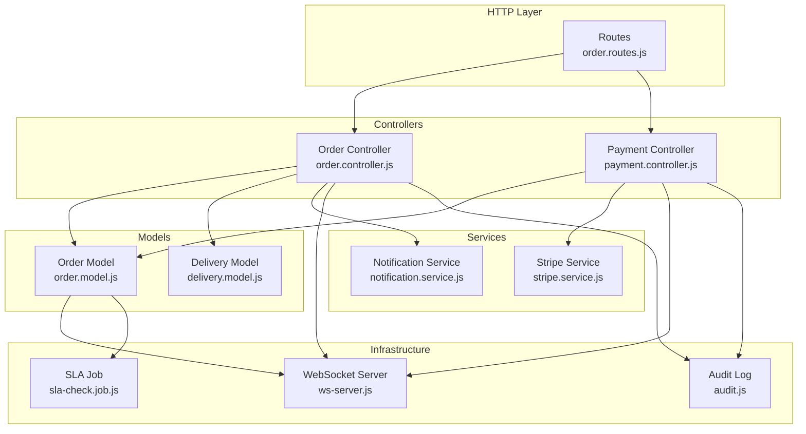
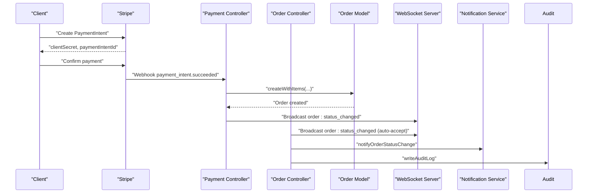
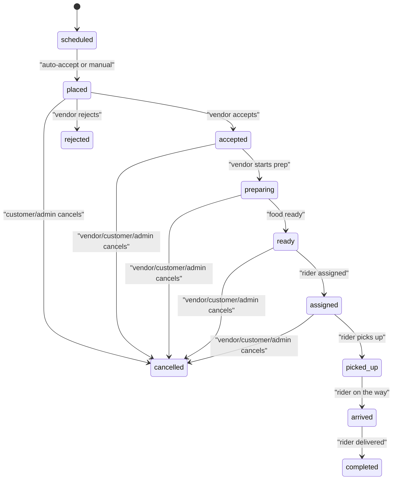
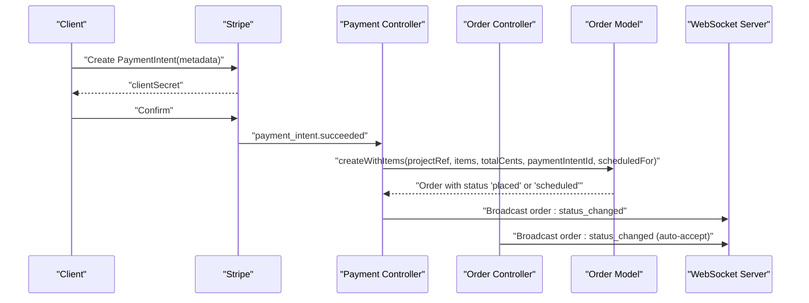
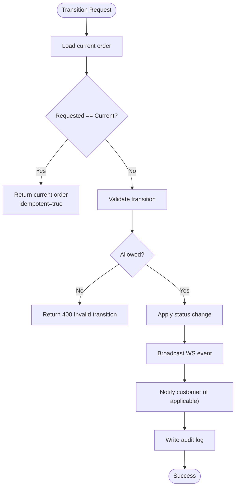
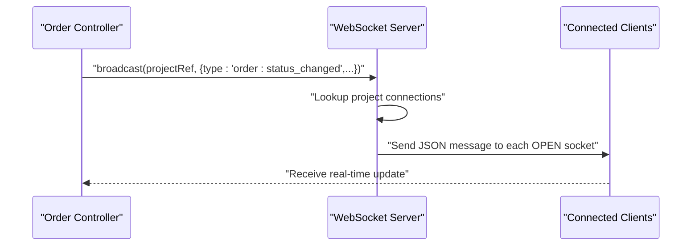
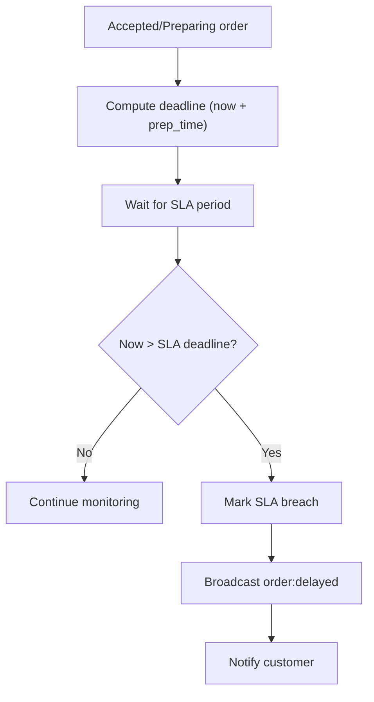
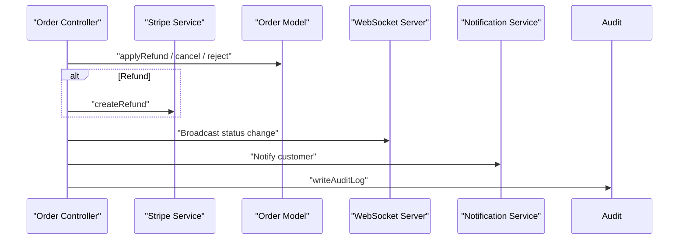
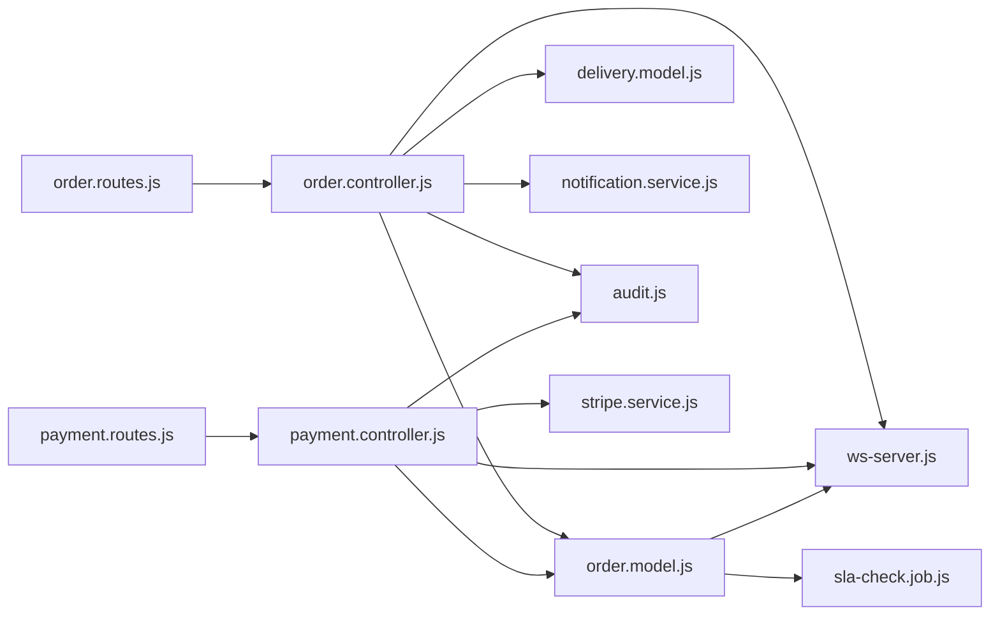

# Order Lifecycle & State Management

<cite>
**Referenced Files in This Document**
- [order.model.js](file://apps/server/models/order.model.js)
- [order.controller.js](file://apps/server/controllers/order.controller.js)
- [order.routes.js](file://apps/server/routes/order.routes.js)
- [order.validator.js](file://apps/server/validators/order.validator.js)
- [payment.controller.js](file://apps/server/controllers/payment.controller.js)
- [payment.routes.js](file://apps/server/routes/payment.routes.js)
- [stripe.service.js](file://apps/server/services/stripe.service.js)
- [notification.service.js](file://apps/server/services/notification.service.js)
- [ws-server.js](file://apps/server/websocket/ws-server.js)
- [audit.js](file://apps/server/lib/audit.js)
- [sla-check.job.js](file://apps/server/jobs/sla-check.job.js)
- [auth.middleware.js](file://apps/server/middleware/auth.middleware.js)
- [delivery.model.js](file://apps/server/models/delivery.model.js)
- [009_order_lifecycle.sql](file://apps/server/migrations/009_order_lifecycle.sql)
- [orders.test.js](file://apps/server/tests/orders.test.js)
</cite>

## Table of Contents
1. [Introduction](#introduction)
2. [Project Structure](#project-structure)
3. [Core Components](#core-components)
4. [Architecture Overview](#architecture-overview)
5. [Detailed Component Analysis](#detailed-component-analysis)
6. [Dependency Analysis](#dependency-analysis)
7. [Performance Considerations](#performance-considerations)
8. [Troubleshooting Guide](#troubleshooting-guide)
9. [Conclusion](#conclusion)
10. [Appendices](#appendices)

## Introduction
This document describes the Delivio order lifecycle and state management system. It covers all order states, state transitions, validation logic, business constraints, real-time updates, SLA handling, notifications, audit logging, and the end-to-end order creation flow from payment confirmation to initial state assignment. It also documents idempotency handling, error conditions, and practical troubleshooting guidance.

## Project Structure
The order lifecycle spans several layers:
- Routes define the API surface and authorization requirements
- Controllers implement business logic, enforce constraints, and orchestrate cross-service operations
- Models encapsulate persistence and state validation
- Services handle external integrations (Stripe, notifications, push)
- WebSockets provide real-time broadcast
- Jobs implement background checks (e.g., SLA breaches)
- Tests validate behavior and constraints

**Diagram sources**
- [order.routes.js:1-39](file://apps/server/routes/order.routes.js#L1-L39)
- [order.controller.js:1-513](file://apps/server/controllers/order.controller.js#L1-L513)
- [order.model.js:1-178](file://apps/server/models/order.model.js#L1-L178)
- [payment.controller.js:1-109](file://apps/server/controllers/payment.controller.js#L1-L109)
- [stripe.service.js:1-83](file://apps/server/services/stripe.service.js#L1-L83)
- [notification.service.js:1-180](file://apps/server/services/notification.service.js#L1-L180)
- [ws-server.js:1-237](file://apps/server/websocket/ws-server.js#L1-L237)
- [sla-check.job.js:1-59](file://apps/server/jobs/sla-check.job.js#L1-L59)
- [audit.js:1-35](file://apps/server/lib/audit.js#L1-L35)

**Section sources**
- [order.routes.js:1-39](file://apps/server/routes/order.routes.js#L1-L39)
- [order.controller.js:1-513](file://apps/server/controllers/order.controller.js#L1-L513)
- [order.model.js:1-178](file://apps/server/models/order.model.js#L1-L178)
- [payment.controller.js:1-109](file://apps/server/controllers/payment.controller.js#L1-L109)
- [stripe.service.js:1-83](file://apps/server/services/stripe.service.js#L1-L83)
- [notification.service.js:1-180](file://apps/server/services/notification.service.js#L1-L180)
- [ws-server.js:1-237](file://apps/server/websocket/ws-server.js#L1-L237)
- [sla-check.job.js:1-59](file://apps/server/jobs/sla-check.job.js#L1-L59)
- [audit.js:1-35](file://apps/server/lib/audit.js#L1-L35)

## Core Components
- Order states and transitions: The model defines valid statuses and allowed transitions, plus cancellable states and SLA fields.
- Order controller: Implements state transitions, validations, notifications, real-time broadcast, and audit logging.
- Payment controller and Stripe service: Handle payment confirmation and create orders via webhooks.
- Notification service: Sends push notifications and emails for order events.
- WebSocket server: Broadcasts real-time order updates to connected clients.
- SLA job: Detects and marks SLA breaches periodically.
- Audit log: Writes immutable audit entries for compliance.

**Section sources**
- [order.model.js:7-24](file://apps/server/models/order.model.js#L7-L24)
- [order.controller.js:16-26](file://apps/server/controllers/order.controller.js#L16-L26)
- [payment.controller.js:29-106](file://apps/server/controllers/payment.controller.js#L29-L106)
- [notification.service.js:42-53](file://apps/server/services/notification.service.js#L42-L53)
- [ws-server.js:162-175](file://apps/server/websocket/ws-server.js#L162-L175)
- [sla-check.job.js:15-56](file://apps/server/jobs/sla-check.job.js#L15-L56)
- [audit.js:18-32](file://apps/server/lib/audit.js#L18-L32)

## Architecture Overview
The order lifecycle integrates payment, state management, notifications, and real-time updates.

**Diagram sources**
- [payment.controller.js:29-106](file://apps/server/controllers/payment.controller.js#L29-L106)
- [order.controller.js:86-138](file://apps/server/controllers/order.controller.js#L86-L138)
- [order.model.js:56-93](file://apps/server/models/order.model.js#L56-L93)
- [ws-server.js:162-175](file://apps/server/websocket/ws-server.js#L162-L175)
- [notification.service.js:42-53](file://apps/server/services/notification.service.js#L42-L53)
- [audit.js:18-32](file://apps/server/lib/audit.js#L18-L32)

## Detailed Component Analysis

### Order States and Transitions
Delivio supports the following order statuses:
- placed, accepted, rejected, preparing, ready, assigned, picked_up, arrived, completed, cancelled, scheduled

Allowed transitions:
- placed → accepted | rejected | cancelled
- scheduled → placed | cancelled
- accepted → preparing | cancelled
- preparing → ready | cancelled
- ready → assigned | cancelled
- assigned → picked_up | cancelled
- picked_up → arrived
- arrived → completed

Cancellable states:
- placed, accepted, scheduled

**Diagram sources**
- [order.model.js:12-21](file://apps/server/models/order.model.js#L12-L21)
- [order.model.js:23](file://apps/server/models/order.model.js#L23)

Validation and constraints:
- Transition validation enforces allowed paths
- Cancellability checked against current status
- SLA deadline computed from prep time
- SLA breach detection via background job

**Section sources**
- [order.model.js:7-24](file://apps/server/models/order.model.js#L7-L24)
- [order.model.js:95-103](file://apps/server/models/order.model.js#L95-L103)
- [order.model.js:157-159](file://apps/server/models/order.model.js#L157-L159)
- [order.model.js:141-155](file://apps/server/models/order.model.js#L141-L155)

### Order Creation Flow (Payment Confirmation to Initial State)
- Frontend creates a PaymentIntent with metadata including project reference and order details
- Stripe emits a webhook upon successful payment
- Backend verifies webhook signature and deduplicates events
- Backend creates the order with items and sets initial status based on scheduling
- Real-time broadcast announces the new order status
- Optional auto-accept and SLA deadline assignment occur when vendor settings allow

**Diagram sources**
- [payment.controller.js:11-22](file://apps/server/controllers/payment.controller.js#L11-L22)
- [payment.controller.js:50-83](file://apps/server/controllers/payment.controller.js#L50-L83)
- [order.model.js:56-93](file://apps/server/models/order.model.js#L56-L93)
- [order.controller.js:86-138](file://apps/server/controllers/order.controller.js#L86-L138)
- [ws-server.js:162-175](file://apps/server/websocket/ws-server.js#L162-L175)

**Section sources**
- [payment.controller.js:29-106](file://apps/server/controllers/payment.controller.js#L29-L106)
- [order.model.js:56-93](file://apps/server/models/order.model.js#L56-L93)
- [order.controller.js:86-138](file://apps/server/controllers/order.controller.js#L86-L138)

### State Transition Rules and Validation Logic
- Transition validation ensures only allowed transitions occur
- Idempotency: If the requested status equals the current status, the controller returns the current order and marks the operation idempotent
- Role-based access control restricts who can perform actions (e.g., accept/reject, cancel, complete)
- Business constraints:
  - Accept requires status to be placed
  - Complete requires delivery status to be arrived
  - SLA extension allowed only for accepted/preparing
  - Cancellation allowed only for cancellable statuses

**Diagram sources**
- [order.controller.js:142-191](file://apps/server/controllers/order.controller.js#L142-L191)
- [order.model.js:95-103](file://apps/server/models/order.model.js#L95-L103)
- [auth.middleware.js:66-76](file://apps/server/middleware/auth.middleware.js#L66-L76)

**Section sources**
- [order.controller.js:142-191](file://apps/server/controllers/order.controller.js#L142-L191)
- [order.model.js:95-103](file://apps/server/models/order.model.js#L95-L103)
- [auth.middleware.js:66-76](file://apps/server/middleware/auth.middleware.js#L66-L76)

### Real-Time Broadcast Mechanism
- WebSocket server maintains a registry per project workspace
- Supported events include order status changes, rejections, delays, and delivery updates
- Broadcast sends messages to all connections in the project
- Authentication supports session cookies and JWT query parameters

**Diagram sources**
- [order.controller.js:161-168](file://apps/server/controllers/order.controller.js#L161-L168)
- [ws-server.js:162-175](file://apps/server/websocket/ws-server.js#L162-L175)

**Section sources**
- [ws-server.js:11-89](file://apps/server/websocket/ws-server.js#L11-L89)
- [ws-server.js:162-175](file://apps/server/websocket/ws-server.js#L162-L175)

### Order Status Messages System
- A centralized mapping defines human-friendly messages for each status
- These messages are sent to customers via push notifications on status changes

**Section sources**
- [order.controller.js:16-26](file://apps/server/controllers/order.controller.js#L16-L26)
- [notification.service.js:42-53](file://apps/server/services/notification.service.js#L42-L53)

### SLA Deadlines and Breach Detection
- SLA deadline is set when an order is accepted; it can be extended later
- A background job periodically checks for overdue orders and marks them as breached
- Breach events trigger real-time notifications and customer messaging

**Diagram sources**
- [order.controller.js:365-367](file://apps/server/controllers/order.controller.js#L365-L367)
- [order.model.js:141-155](file://apps/server/models/order.model.js#L141-L155)
- [sla-check.job.js:15-56](file://apps/server/jobs/sla-check.job.js#L15-L56)

**Section sources**
- [order.controller.js:456-499](file://apps/server/controllers/order.controller.js#L456-L499)
- [sla-check.job.js:15-56](file://apps/server/jobs/sla-check.job.js#L15-L56)

### Refund, Cancellation, and Rejection Workflows
- Refund: Requires paid status; processes a refund via Stripe and updates payment status
- Cancel: Allowed only for cancellable statuses; supports auto-refund for paid orders
- Reject: Sets status to rejected with optional reason; notifies customer

**Diagram sources**
- [order.controller.js:195-234](file://apps/server/controllers/order.controller.js#L195-L234)
- [order.controller.js:238-296](file://apps/server/controllers/order.controller.js#L238-L296)
- [order.controller.js:299-342](file://apps/server/controllers/order.controller.js#L299-L342)
- [stripe.service.js:48-59](file://apps/server/services/stripe.service.js#L48-L59)

**Section sources**
- [order.controller.js:195-234](file://apps/server/controllers/order.controller.js#L195-L234)
- [order.controller.js:238-296](file://apps/server/controllers/order.controller.js#L238-L296)
- [order.controller.js:299-342](file://apps/server/controllers/order.controller.js#L299-L342)
- [stripe.service.js:48-59](file://apps/server/services/stripe.service.js#L48-L59)

### Delivery Integration and Completion
- Completion requires a delivery record and that delivery status be arrived
- After completion, the delivery status is updated to delivered and the order to completed

**Section sources**
- [order.controller.js:400-452](file://apps/server/controllers/order.controller.js#L400-L452)
- [delivery.model.js:14-17](file://apps/server/models/delivery.model.js#L14-L17)
- [delivery.model.js:57-66](file://apps/server/models/delivery.model.js#L57-L66)

### Idempotency Handling
- If the requested status equals the current status, the controller returns the current order and marks the operation idempotent
- Stripe webhook deduplication prevents double-processing of events

**Section sources**
- [order.controller.js:152-155](file://apps/server/controllers/order.controller.js#L152-L155)
- [payment.controller.js:42-46](file://apps/server/controllers/payment.controller.js#L42-L46)

### Error Conditions and Validation
- Invalid status values and transitions return 400 errors
- Access control denies unauthorized operations
- Payment-related operations validate payment status before acting
- Tests demonstrate expected error responses for invalid inputs and forbidden access

**Section sources**
- [order.validator.js:20-25](file://apps/server/validators/order.validator.js#L20-L25)
- [order.controller.js:148-150](file://apps/server/controllers/order.controller.js#L148-L150)
- [orders.test.js:102-128](file://apps/server/tests/orders.test.js#L102-L128)
- [orders.test.js:133-141](file://apps/server/tests/orders.test.js#L133-L141)
- [orders.test.js:157-164](file://apps/server/tests/orders.test.js#L157-L164)

## Dependency Analysis

**Diagram sources**
- [order.routes.js:1-39](file://apps/server/routes/order.routes.js#L1-L39)
- [payment.routes.js:1-38](file://apps/server/routes/payment.routes.js#L1-L38)
- [order.controller.js:1-15](file://apps/server/controllers/order.controller.js#L1-L15)
- [payment.controller.js:1-9](file://apps/server/controllers/payment.controller.js#L1-L9)
- [order.model.js:1-6](file://apps/server/models/order.model.js#L1-L6)
- [delivery.model.js:1-6](file://apps/server/models/delivery.model.js#L1-L6)
- [notification.service.js:1-7](file://apps/server/services/notification.service.js#L1-L7)
- [ws-server.js:1-10](file://apps/server/websocket/ws-server.js#L1-L10)
- [audit.js:1-5](file://apps/server/lib/audit.js#L1-L5)
- [sla-check.job.js:1-9](file://apps/server/jobs/sla-check.job.js#L1-L9)

**Section sources**
- [order.routes.js:1-39](file://apps/server/routes/order.routes.js#L1-L39)
- [payment.routes.js:1-38](file://apps/server/routes/payment.routes.js#L1-L38)
- [order.controller.js:1-15](file://apps/server/controllers/order.controller.js#L1-L15)
- [payment.controller.js:1-9](file://apps/server/controllers/payment.controller.js#L1-L9)

## Performance Considerations
- WebSocket broadcasting is O(N) per project; monitor connection counts and implement client-side filtering
- Background SLA job runs every minute; ensure database indexing on SLA fields and statuses
- Stripe webhook processing includes deduplication and signature verification; keep these operations efficient
- Audit logging is non-blocking; ensure downstream storage does not become a bottleneck

## Troubleshooting Guide
Common issues and resolutions:
- Invalid status transition: Ensure the target status is allowed from the current state
- Access denied errors: Verify roles and sessions; customer endpoints require ownership checks
- SLA delay notifications not appearing: Confirm the SLA job is running and the order’s SLA deadline has passed
- Duplicate order creation: Stripe webhook deduplication prevents duplicates; check event IDs and logs
- Idempotent operations: Expect immediate return with idempotent flag when requesting the same status

**Section sources**
- [order.controller.js:148-150](file://apps/server/controllers/order.controller.js#L148-L150)
- [auth.middleware.js:66-76](file://apps/server/middleware/auth.middleware.js#L66-L76)
- [sla-check.job.js:15-56](file://apps/server/jobs/sla-check.job.js#L15-L56)
- [payment.controller.js:42-46](file://apps/server/controllers/payment.controller.js#L42-L46)
- [orders.test.js:102-128](file://apps/server/tests/orders.test.js#L102-L128)

## Conclusion
Delivio’s order lifecycle is governed by explicit state definitions, strict transition validation, robust authorization, and real-time communication. Payment confirmation drives order creation and initial state assignment, while SLA deadlines and background checks maintain timeliness. Notifications and audit logs provide transparency and compliance. The system emphasizes idempotency and defensive programming to ensure reliability across asynchronous events and concurrent operations.

## Appendices

### API Endpoints and Roles
- GET /api/orders – List orders (customer can filter own orders; admin can list project orders)
- POST /api/orders – Internal creation (admin only)
- GET /api/orders/:id – Get order details
- PATCH /api/orders/:id/status – Update order status (admin/vendor)
- POST /api/orders/:id/refund – Refund (admin/vendor)
- POST /api/orders/:id/cancel – Cancel (customer or admin/vendor)
- POST /api/orders/:id/accept – Accept (vendor/admin)
- POST /api/orders/:id/reject – Reject (vendor/admin)
- POST /api/orders/:id/extend-sla – Extend SLA (vendor/admin)
- POST /api/orders/:id/complete – Complete (rider/admin)

**Section sources**
- [order.routes.js:14-36](file://apps/server/routes/order.routes.js#L14-L36)

### Database Schema Notes
- Orders table includes SLA fields and rejection reason
- Vendor settings table includes auto-accept and default preparation time
- Ratings and tips tables support post-delivery feedback

**Section sources**
- [009_order_lifecycle.sql:4-46](file://apps/server/migrations/009_order_lifecycle.sql#L4-L46)