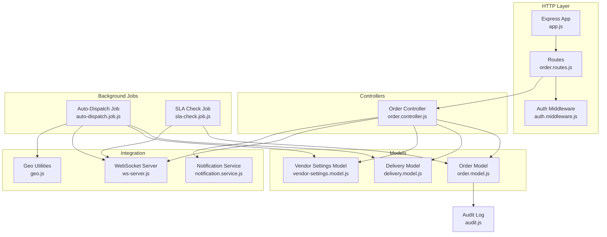
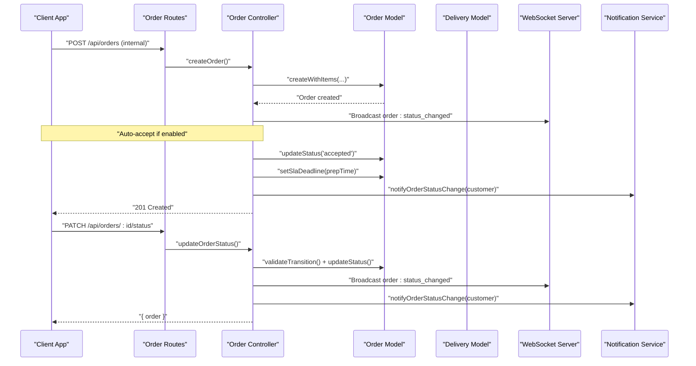
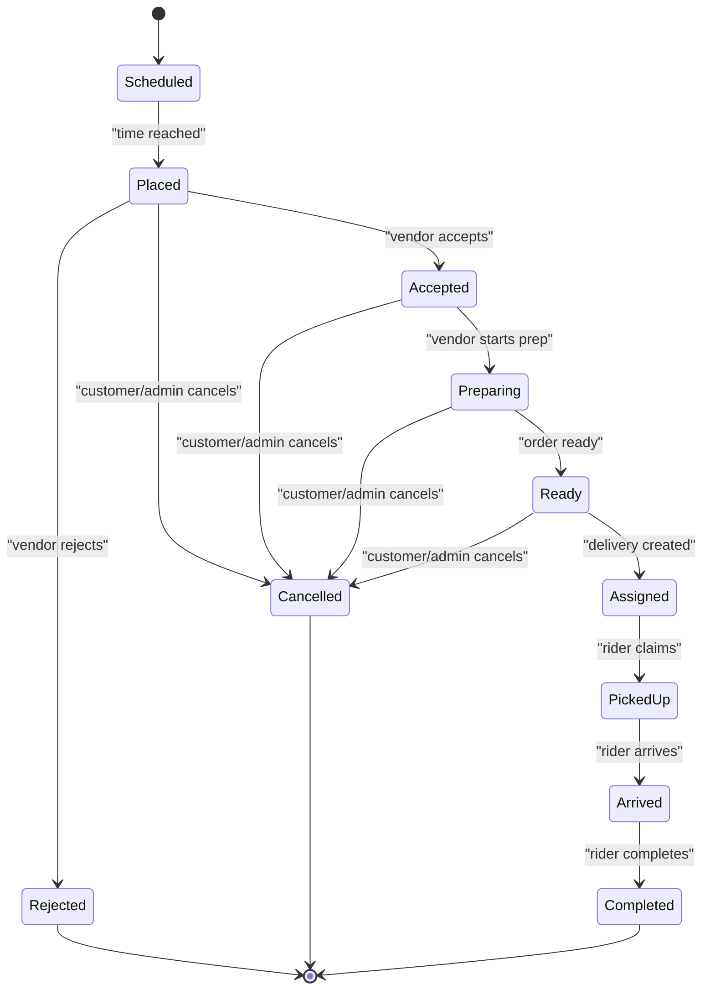
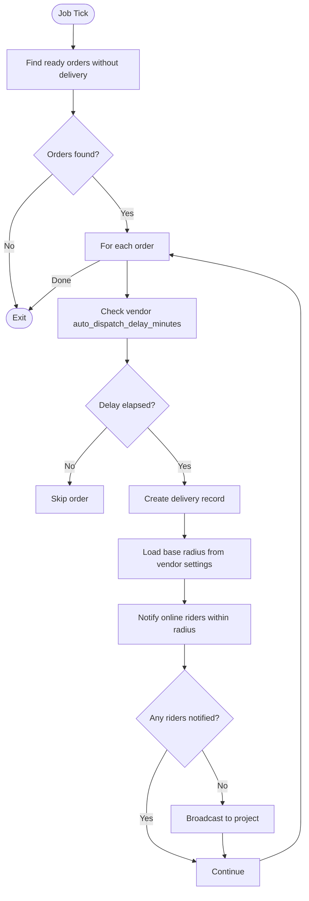
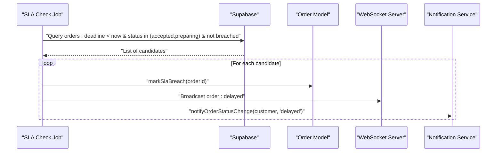
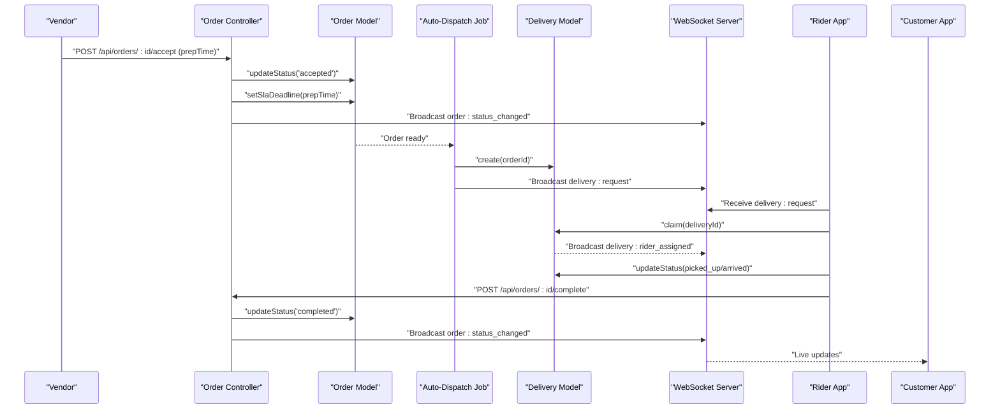
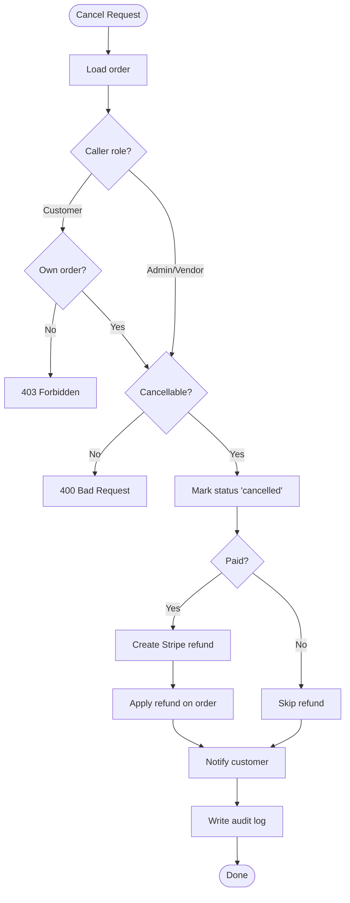
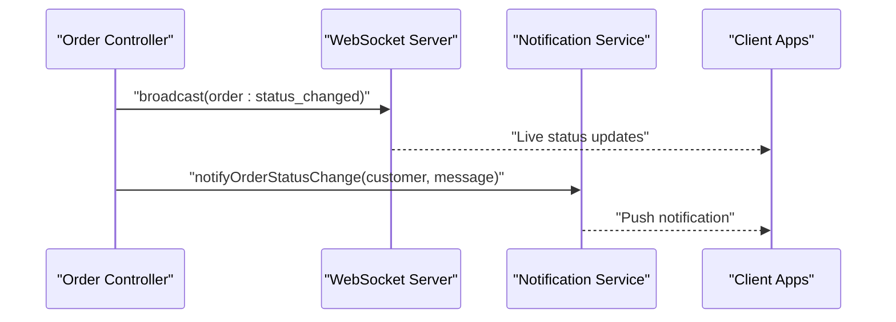
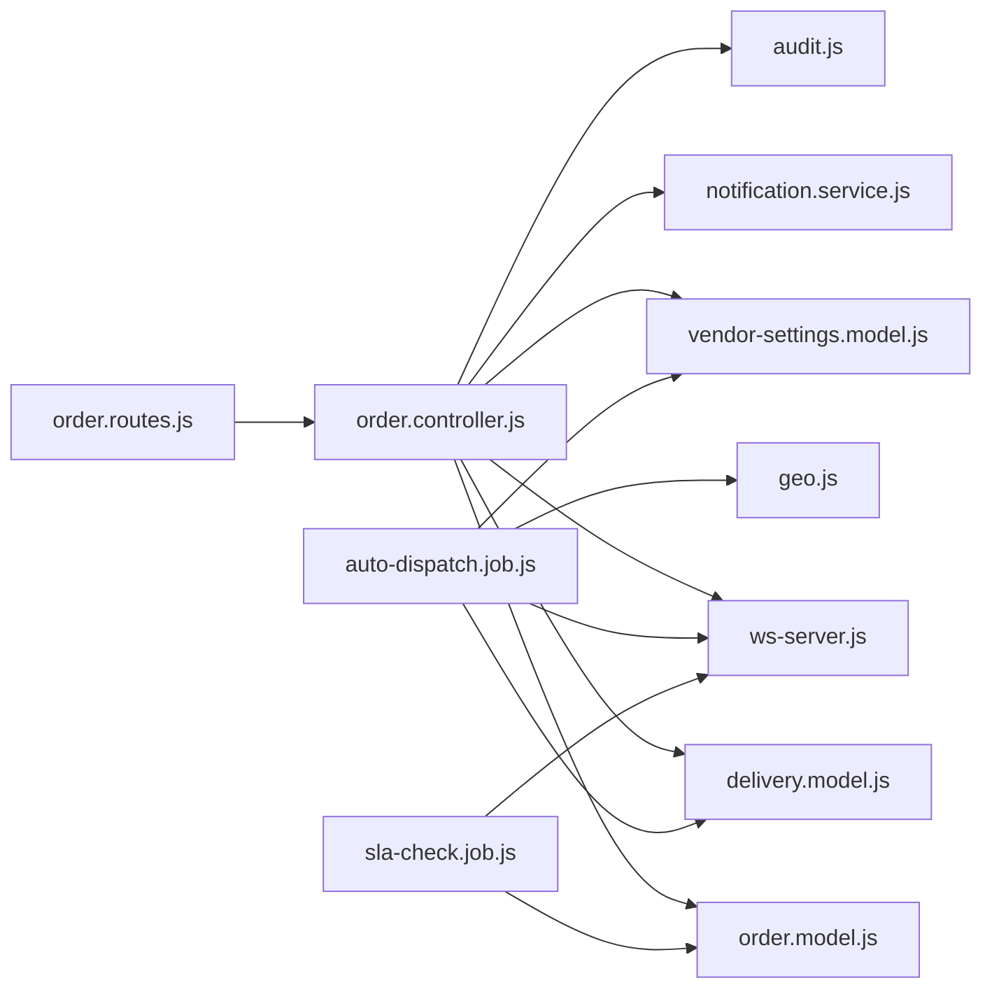

# Order Management System

<cite>
**Referenced Files in This Document**
- [order.model.js](file://apps/server/models/order.model.js)
- [order.controller.js](file://apps/server/controllers/order.controller.js)
- [order.routes.js](file://apps/server/routes/order.routes.js)
- [auto-dispatch.job.js](file://apps/server/jobs/auto-dispatch.job.js)
- [sla-check.job.js](file://apps/server/jobs/sla-check.job.js)
- [delivery.model.js](file://apps/server/models/delivery.model.js)
- [vendor-settings.model.js](file://apps/server/models/vendor-settings.model.js)
- [notification.service.js](file://apps/server/services/notification.service.js)
- [ws-server.js](file://apps/server/websocket/ws-server.js)
- [audit.js](file://apps/server/lib/audit.js)
- [auth.middleware.js](file://apps/server/middleware/auth.middleware.js)
- [app.js](file://apps/server/app.js)
- [geo.js](file://apps/server/lib/geo.js)
</cite>

## Table of Contents
1. [Introduction](#introduction)
2. [Project Structure](#project-structure)
3. [Core Components](#core-components)
4. [Architecture Overview](#architecture-overview)
5. [Detailed Component Analysis](#detailed-component-analysis)
6. [Dependency Analysis](#dependency-analysis)
7. [Performance Considerations](#performance-considerations)
8. [Troubleshooting Guide](#troubleshooting-guide)
9. [Conclusion](#conclusion)
10. [Appendices](#appendices)

## Introduction
This document describes the Delivio order management system end-to-end. It covers the complete order lifecycle from placement to completion, including state transitions, business rules, SLA enforcement, auto-dispatch and rider assignment logic, location-based service areas, fulfillment workflow, preparation tracking, delivery coordination, SLA monitoring and escalation, status management, cancellation and refund processing, analytics and reporting, and practical troubleshooting guidance. The goal is to provide both operational clarity and technical depth for stakeholders across engineering, operations, and support teams.

## Project Structure
The order management system is implemented as a modular backend service with clear separation of concerns:
- Routing and middleware define request boundaries and authentication/authorization.
- Controllers orchestrate business actions and coordinate model updates.
- Models encapsulate persistence and enforce domain constraints.
- Jobs implement background tasks for auto-dispatch and SLA monitoring.
- Services handle cross-cutting concerns like notifications and sessions.
- WebSockets power real-time updates to clients.

**Diagram sources**
- [app.js:1-88](file://apps/server/app.js#L1-L88)
- [order.routes.js:1-39](file://apps/server/routes/order.routes.js#L1-L39)
- [auth.middleware.js:1-123](file://apps/server/middleware/auth.middleware.js#L1-L123)
- [order.controller.js:1-513](file://apps/server/controllers/order.controller.js#L1-L513)
- [order.model.js:1-178](file://apps/server/models/order.model.js#L1-L178)
- [delivery.model.js:1-98](file://apps/server/models/delivery.model.js#L1-L98)
- [vendor-settings.model.js:1-51](file://apps/server/models/vendor-settings.model.js#L1-L51)
- [auto-dispatch.job.js:1-97](file://apps/server/jobs/auto-dispatch.job.js#L1-L97)
- [sla-check.job.js:1-59](file://apps/server/jobs/sla-check.job.js#L1-L59)
- [ws-server.js:1-237](file://apps/server/websocket/ws-server.js#L1-L237)
- [notification.service.js:1-180](file://apps/server/services/notification.service.js#L1-L180)
- [geo.js:1-15](file://apps/server/lib/geo.js#L1-L15)
- [audit.js:1-35](file://apps/server/lib/audit.js#L1-L35)

**Section sources**
- [app.js:1-88](file://apps/server/app.js#L1-L88)
- [order.routes.js:1-39](file://apps/server/routes/order.routes.js#L1-L39)
- [auth.middleware.js:1-123](file://apps/server/middleware/auth.middleware.js#L1-L123)

## Core Components
- Order lifecycle and state machine: Defines valid statuses and transitions, SLA deadline calculation, cancellation eligibility, and refund application.
- Order controller: Implements endpoints for listing, retrieving, creating, updating status, accepting/rejecting, cancelling, extending SLA, and completing orders. It also handles notifications, audit logging, and Stripe refunds.
- Delivery model: Manages delivery records, availability, claiming, status transitions, and location logging.
- Vendor settings: Stores per-project delivery mode, auto-accept behavior, default prep time, and delivery radius.
- Auto-dispatch job: Periodically finds ready orders without a delivery, creates delivery records, and notifies nearby online riders.
- SLA check job: Detects SLA breaches and broadcasts alerts.
- WebSocket server: Real-time event broadcasting for order status, delivery requests, and rider arrivals.
- Notification service: Push notifications and emails for order updates, cancellations, and refunds.
- Audit logging: Non-intrusive audit trail for all significant actions.

**Section sources**
- [order.model.js:1-178](file://apps/server/models/order.model.js#L1-L178)
- [order.controller.js:1-513](file://apps/server/controllers/order.controller.js#L1-L513)
- [delivery.model.js:1-98](file://apps/server/models/delivery.model.js#L1-L98)
- [vendor-settings.model.js:1-51](file://apps/server/models/vendor-settings.model.js#L1-L51)
- [auto-dispatch.job.js:1-97](file://apps/server/jobs/auto-dispatch.job.js#L1-L97)
- [sla-check.job.js:1-59](file://apps/server/jobs/sla-check.job.js#L1-L59)
- [ws-server.js:1-237](file://apps/server/websocket/ws-server.js#L1-L237)
- [notification.service.js:1-180](file://apps/server/services/notification.service.js#L1-L180)
- [audit.js:1-35](file://apps/server/lib/audit.js#L1-L35)

## Architecture Overview
The system follows a layered architecture:
- Presentation: HTTP routes and WebSocket endpoints.
- Application: Controllers and middleware.
- Domain: Models and business logic.
- Infrastructure: Background jobs, notifications, and persistence via Supabase.

**Diagram sources**
- [order.routes.js:14-36](file://apps/server/routes/order.routes.js#L14-L36)
- [order.controller.js:84-191](file://apps/server/controllers/order.controller.js#L84-L191)
- [order.model.js:52-113](file://apps/server/models/order.model.js#L52-L113)
- [ws-server.js:162-175](file://apps/server/websocket/ws-server.js#L162-L175)
- [notification.service.js:42-53](file://apps/server/services/notification.service.js#L42-L53)

## Detailed Component Analysis

### Order Lifecycle and State Machine
The order lifecycle is governed by explicit statuses and transitions:
- Valid statuses: placed, accepted, rejected, preparing, ready, assigned, picked_up, arrived, completed, cancelled, scheduled.
- Allowed transitions: enforced by a transition map to prevent invalid state changes.
- Cancellation policy: cancellable only in placed, accepted, and scheduled states.
- SLA: deadline computed from prep time; breaches tracked separately.

**Diagram sources**
- [order.model.js:7-21](file://apps/server/models/order.model.js#L7-L21)
- [order.model.js:157-159](file://apps/server/models/order.model.js#L157-L159)

Key behaviors:
- Creating orders: internal webhook-driven creation with optional scheduled timing.
- Auto-accept: vendor setting controls automatic acceptance and initial SLA deadline.
- Status updates: validated transitions, real-time broadcast, and audit logs.
- Cancellations: idempotent handling, payment refund when applicable, and notifications.
- Refunds: Stripe integration, partial or full, with audit trail and customer email.

**Section sources**
- [order.model.js:52-175](file://apps/server/models/order.model.js#L52-L175)
- [order.controller.js:84-296](file://apps/server/controllers/order.controller.js#L84-L296)
- [order.controller.js:195-234](file://apps/server/controllers/order.controller.js#L195-L234)
- [order.controller.js:238-296](file://apps/server/controllers/order.controller.js#L238-L296)

### Auto-Dispatch Algorithm and Rider Assignment
Auto-dispatch runs every 30 seconds and:
- Identifies ready orders without an associated delivery.
- Applies vendor auto-dispatch delay if configured.
- Creates a delivery record and calculates a base radius from vendor settings.
- Broadcasts delivery requests to online riders near the vendor’s location.
- Falls back to project-wide broadcast if no nearby riders are found.

**Diagram sources**
- [auto-dispatch.job.js:14-94](file://apps/server/jobs/auto-dispatch.job.js#L14-L94)
- [delivery.model.js:37-47](file://apps/server/models/delivery.model.js#L37-L47)
- [vendor-settings.model.js:14-47](file://apps/server/models/vendor-settings.model.js#L14-L47)
- [ws-server.js:162-175](file://apps/server/websocket/ws-server.js#L162-L175)
- [geo.js:3-11](file://apps/server/lib/geo.js#L3-L11)

Rider assignment logic:
- Riders claim deliveries optimistically; the first to act claims the delivery.
- Delivery status moves through pending → assigned → picked_up → arrived → delivered.
- Location pings are logged for tracking.

**Section sources**
- [auto-dispatch.job.js:14-94](file://apps/server/jobs/auto-dispatch.job.js#L14-L94)
- [delivery.model.js:49-81](file://apps/server/models/delivery.model.js#L49-L81)
- [ws-server.js:162-175](file://apps/server/websocket/ws-server.js#L162-L175)

### SLA Monitoring, Breach Detection, and Escalation
SLA monitoring runs every minute:
- Finds orders whose SLA deadline has passed but are still in accepted/preparing and not yet marked as breached.
- Marks orders as breached and broadcasts order:delayed events.
- Sends customer notifications and logs the incident.

**Diagram sources**
- [sla-check.job.js:11-56](file://apps/server/jobs/sla-check.job.js#L11-L56)
- [order.model.js:150-155](file://apps/server/models/order.model.js#L150-L155)
- [notification.service.js:42-53](file://apps/server/services/notification.service.js#L42-L53)
- [ws-server.js:162-175](file://apps/server/websocket/ws-server.js#L162-L175)

Escalation procedures:
- Immediate customer notification via push/email.
- Internal audit logging for compliance.
- Optional manual intervention to extend SLA deadlines.

**Section sources**
- [sla-check.job.js:11-56](file://apps/server/jobs/sla-check.job.js#L11-L56)
- [order.controller.js:456-499](file://apps/server/controllers/order.controller.js#L456-L499)
- [audit.js:18-32](file://apps/server/lib/audit.js#L18-L32)

### Order Fulfillment Workflow, Preparation Tracking, and Delivery Coordination
- Restaurant acceptance sets prep time and SLA deadline.
- Preparing → Ready triggers auto-dispatch.
- Delivery creation and rider notification occur automatically.
- Rider arrival and completion finalize the order.

**Diagram sources**
- [order.controller.js:346-398](file://apps/server/controllers/order.controller.js#L346-L398)
- [order.controller.js:402-452](file://apps/server/controllers/order.controller.js#L402-L452)
- [auto-dispatch.job.js:18-84](file://apps/server/jobs/auto-dispatch.job.js#L18-L84)
- [delivery.model.js:37-66](file://apps/server/models/delivery.model.js#L37-L66)
- [ws-server.js:162-175](file://apps/server/websocket/ws-server.js#L162-L175)

### Order Status Management, Cancellations, and Refunds
- Status updates are validated against allowed transitions and audited.
- Cancellations are role-aware and idempotent; paid orders are refunded via Stripe.
- Refunds can be partial or full; customer receives email confirmation.

**Diagram sources**
- [order.controller.js:238-296](file://apps/server/controllers/order.controller.js#L238-L296)
- [order.model.js:124-131](file://apps/server/models/order.model.js#L124-L131)
- [notification.service.js:97-101](file://apps/server/services/notification.service.js#L97-L101)
- [audit.js:18-32](file://apps/server/lib/audit.js#L18-L32)

**Section sources**
- [order.controller.js:238-296](file://apps/server/controllers/order.controller.js#L238-L296)
- [order.model.js:115-131](file://apps/server/models/order.model.js#L115-L131)

### Real-Time Updates and Notifications
- WebSocket server supports multiple authentication mechanisms and broadcasts order/delivery events.
- Notification service sends push notifications and emails for key lifecycle events.

**Diagram sources**
- [order.controller.js:161-176](file://apps/server/controllers/order.controller.js#L161-L176)
- [ws-server.js:162-175](file://apps/server/websocket/ws-server.js#L162-L175)
- [notification.service.js:42-53](file://apps/server/services/notification.service.js#L42-L53)

**Section sources**
- [ws-server.js:162-175](file://apps/server/websocket/ws-server.js#L162-L175)
- [notification.service.js:42-53](file://apps/server/services/notification.service.js#L42-L53)

### Analytics, Reporting, and Performance Metrics
- Audit logs capture all significant actions with IP and details for compliance and analysis.
- Background jobs provide operational visibility (dispatch counts, SLA breaches).
- WebSocket stats can be used to monitor live engagement per project.

Recommended metrics:
- Orders per time window by status.
- SLA compliance rate (on-time vs. breached).
- Average prep time and dispatch latency.
- Rider response rate and completion time.

**Section sources**
- [audit.js:18-32](file://apps/server/lib/audit.js#L18-L32)
- [sla-check.job.js:27-46](file://apps/server/jobs/sla-check.job.js#L27-L46)
- [auto-dispatch.job.js:79-84](file://apps/server/jobs/auto-dispatch.job.js#L79-L84)
- [ws-server.js:228-234](file://apps/server/websocket/ws-server.js#L228-L234)

## Dependency Analysis
The system exhibits clean separation of concerns with minimal coupling:
- Controllers depend on models and services.
- Jobs depend on models and services but are decoupled from HTTP.
- Models encapsulate persistence and domain rules.
- Middleware enforces auth and authorization.

**Diagram sources**
- [order.routes.js:1-39](file://apps/server/routes/order.routes.js#L1-L39)
- [order.controller.js:1-513](file://apps/server/controllers/order.controller.js#L1-L513)
- [order.model.js:1-178](file://apps/server/models/order.model.js#L1-L178)
- [delivery.model.js:1-98](file://apps/server/models/delivery.model.js#L1-L98)
- [vendor-settings.model.js:1-51](file://apps/server/models/vendor-settings.model.js#L1-L51)
- [auto-dispatch.job.js:1-97](file://apps/server/jobs/auto-dispatch.job.js#L1-L97)
- [sla-check.job.js:1-59](file://apps/server/jobs/sla-check.job.js#L1-L59)
- [ws-server.js:1-237](file://apps/server/websocket/ws-server.js#L1-L237)
- [notification.service.js:1-180](file://apps/server/services/notification.service.js#L1-L180)
- [geo.js:1-15](file://apps/server/lib/geo.js#L1-L15)
- [audit.js:1-35](file://apps/server/lib/audit.js#L1-L35)

**Section sources**
- [order.routes.js:1-39](file://apps/server/routes/order.routes.js#L1-L39)
- [order.controller.js:1-513](file://apps/server/controllers/order.controller.js#L1-L513)

## Performance Considerations
- Background jobs use locking to avoid concurrent execution conflicts.
- WebSocket heartbeats keep connections healthy; consider tuning intervals for scale.
- Geo calculations are lightweight; radius filtering is currently a placeholder and can be enhanced with spatial indexes if needed.
- Audit logging is non-blocking to avoid impacting transactional paths.
- Consider adding database indexes on frequently queried fields (e.g., status, updated_at, project_ref) to improve query performance.

[No sources needed since this section provides general guidance]

## Troubleshooting Guide
Common issues and resolutions:
- Order stuck in placed or accepted:
  - Verify vendor settings for auto-accept and default prep time.
  - Check SLA deadline and whether SLA check job is running.
- Auto-dispatch not triggering:
  - Confirm orders are ready and have no existing delivery.
  - Review vendor auto_dispatch_delay_minutes and job logs.
  - Ensure riders are online and within the configured radius.
- Rider not receiving delivery requests:
  - Validate WebSocket connectivity and authentication.
  - Confirm push tokens are registered for the rider.
- SLA breach notifications missing:
  - Check SLA check job schedule and logs.
  - Verify order status and deadline fields.
- Cancellation/refund errors:
  - Ensure payment is marked paid and a payment intent exists.
  - Confirm Stripe refund succeeds and refund fields are updated.

Operational checks:
- Inspect audit logs for recent actions and IPs.
- Monitor WebSocket stats for connection health.
- Review job logs for auto-dispatch and SLA checks.

**Section sources**
- [vendor-settings.model.js:14-47](file://apps/server/models/vendor-settings.model.js#L14-L47)
- [auto-dispatch.job.js:18-84](file://apps/server/jobs/auto-dispatch.job.js#L18-L84)
- [sla-check.job.js:16-52](file://apps/server/jobs/sla-check.job.js#L16-L52)
- [audit.js:18-32](file://apps/server/lib/audit.js#L18-L32)
- [ws-server.js:74-83](file://apps/server/websocket/ws-server.js#L74-L83)

## Conclusion
Delivio’s order management system combines a robust state machine, automated workflows, and real-time communication to deliver a reliable platform. The auto-dispatch and SLA monitoring jobs ensure efficient operations and timely deliveries, while notifications and audit logs provide transparency and compliance. By following the documented flows and troubleshooting steps, operators can maintain high service quality and quickly resolve issues.

[No sources needed since this section summarizes without analyzing specific files]

## Appendices

### Order Flow Scenarios

Scenario A: Standard order with auto-accept
- Customer places order → created with status placed.
- Vendor settings auto-accept enabled → order transitions to accepted and SLA deadline set.
- Customer receives push notification with ETA.
- Order reaches ready → auto-dispatch creates delivery and notifies nearby riders.
- Rider claims delivery → status assigned → picked_up → arrived → completed.

Scenario B: Manual acceptance and prep extension
- Vendor accepts order manually with custom prep time.
- Prep takes longer → vendor extends SLA deadline.
- Customer receives notification about extended ETA.

Scenario C: Cancellation and refund
- Order in accepted/preparing → customer cancels.
- If paid, system refunds via Stripe and updates order refund fields.
- Customer receives cancellation email and push notification.

**Section sources**
- [order.controller.js:86-138](file://apps/server/controllers/order.controller.js#L86-L138)
- [order.controller.js:346-398](file://apps/server/controllers/order.controller.js#L346-L398)
- [order.controller.js:456-499](file://apps/server/controllers/order.controller.js#L456-L499)
- [order.controller.js:238-296](file://apps/server/controllers/order.controller.js#L238-L296)
- [notification.service.js:97-101](file://apps/server/services/notification.service.js#L97-L101)