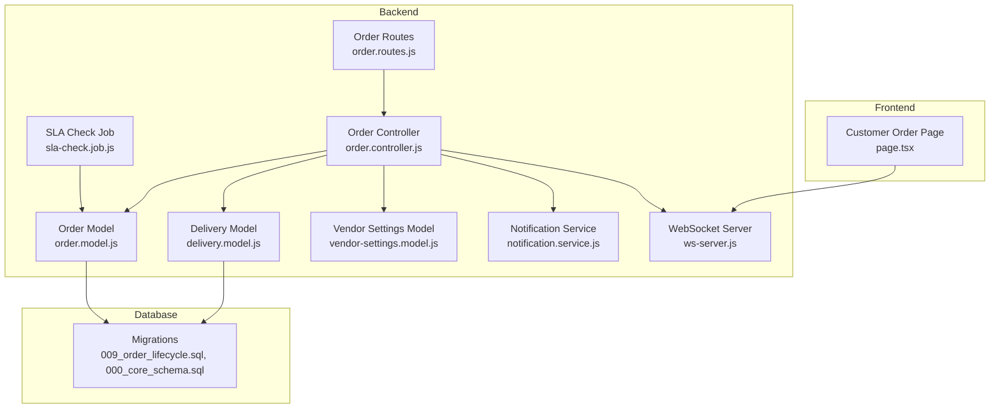
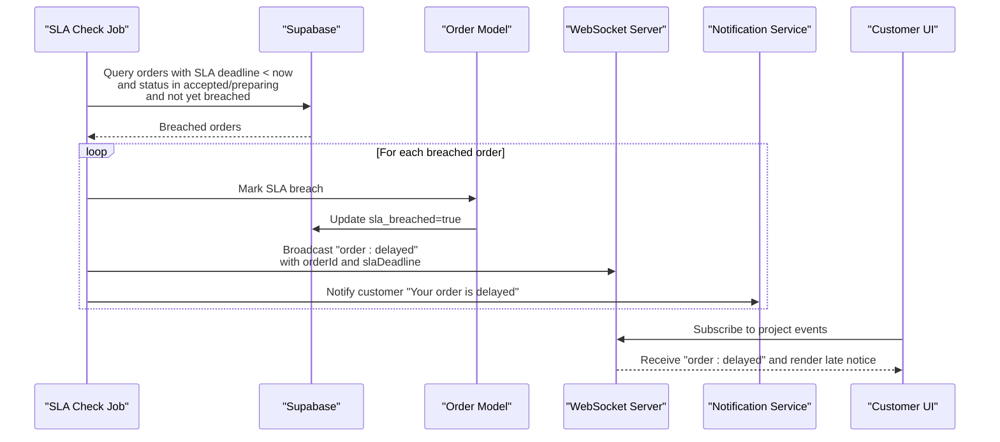
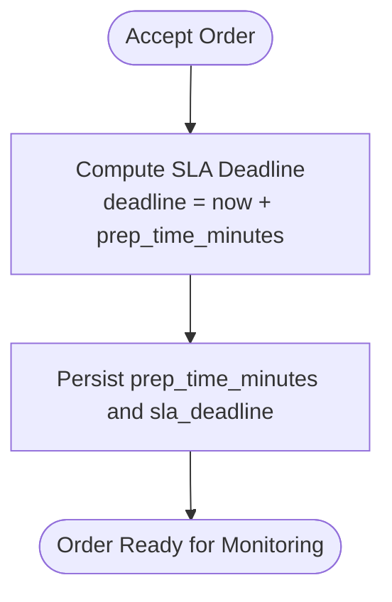
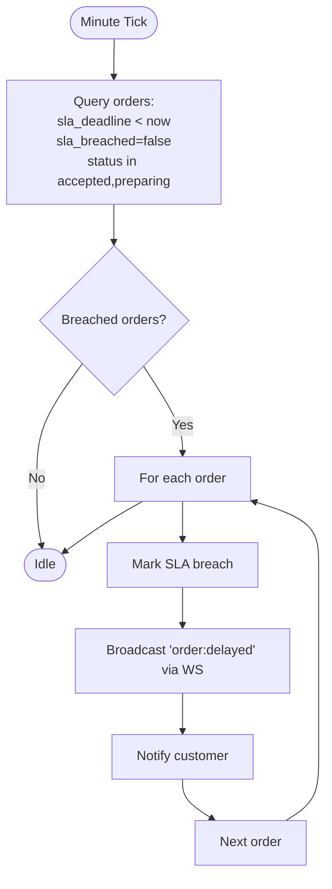
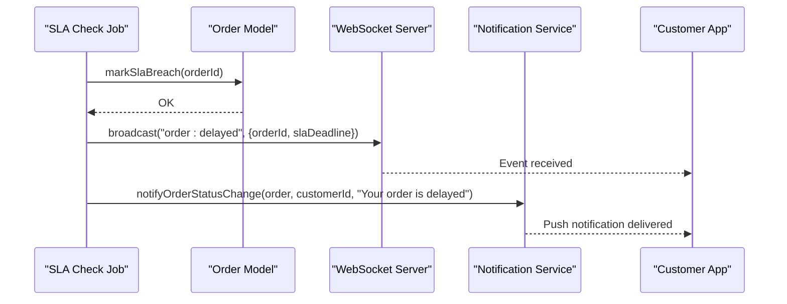
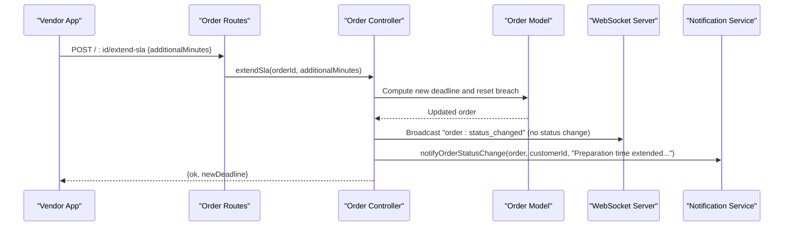
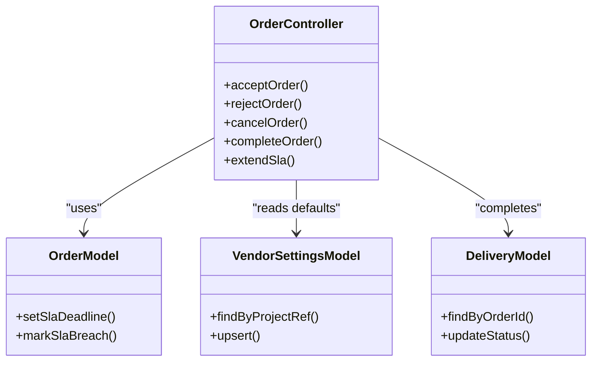
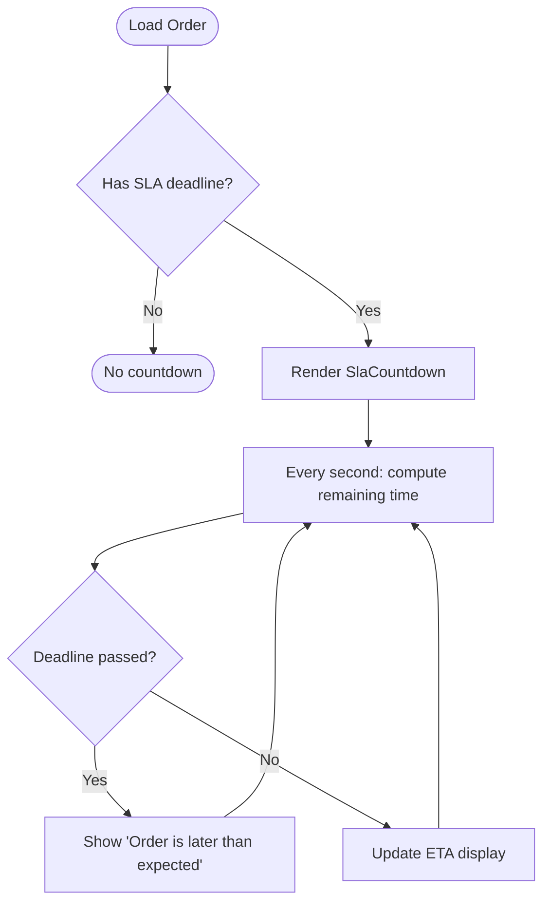
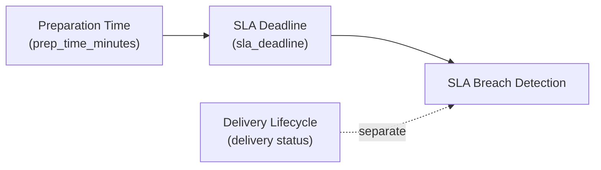
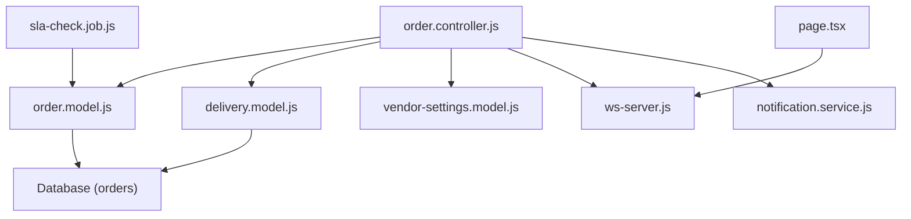

# SLA Monitoring & Enforcement

<cite>
**Referenced Files in This Document**
- [sla-check.job.js](file://apps/server/jobs/sla-check.job.js)
- [order.controller.js](file://apps/server/controllers/order.controller.js)
- [order.model.js](file://apps/server/models/order.model.js)
- [delivery.model.js](file://apps/server/models/delivery.model.js)
- [vendor-settings.model.js](file://apps/server/models/vendor-settings.model.js)
- [notification.service.js](file://apps/server/services/notification.service.js)
- [ws-server.js](file://apps/server/websocket/ws-server.js)
- [order.routes.js](file://apps/server/routes/order.routes.js)
- [009_order_lifecycle.sql](file://apps/server/migrations/009_order_lifecycle.sql)
- [012_vendor_dispatch_delay.sql](file://apps/server/migrations/012_vendor_dispatch_delay.sql)
- [page.tsx](file://apps/customer/src/app/(main)/orders/[id]/page.tsx)
- [000_core_schema.sql](file://apps/server/migrations/000_core_schema.sql)
</cite>

## Table of Contents
1. [Introduction](#introduction)
2. [Project Structure](#project-structure)
3. [Core Components](#core-components)
4. [Architecture Overview](#architecture-overview)
5. [Detailed Component Analysis](#detailed-component-analysis)
6. [Dependency Analysis](#dependency-analysis)
7. [Performance Considerations](#performance-considerations)
8. [Troubleshooting Guide](#troubleshooting-guide)
9. [Conclusion](#conclusion)
10. [Appendices](#appendices)

## Introduction
This document describes the Delivio Service Level Agreement (SLA) monitoring and enforcement system. It explains how SLA deadlines are calculated, how breaches are detected and escalated, and how the system supports SLA extensions and administrative overrides. It also documents the background job responsible for periodic SLA checks, the relationship between preparation time, delivery time, and overall order SLA, and the alerting and notification mechanisms. Finally, it outlines configuration options for different service levels and provides examples of SLA scenarios and handling procedures.

## Project Structure
The SLA system spans backend controllers, models, jobs, services, and frontend components:
- Backend job: Periodic SLA breach detection
- Controllers: Order lifecycle and SLA extension endpoints
- Models: Order and delivery persistence and SLA calculations
- Services: Notifications and WebSocket broadcasting
- Frontend: Real-time SLA countdown and breach alerts
- Migrations: Schema for SLA fields and vendor settings

**Diagram sources**
- [sla-check.job.js:15-56](file://apps/server/jobs/sla-check.job.js#L15-L56)
- [order.controller.js:454-499](file://apps/server/controllers/order.controller.js#L454-L499)
- [order.model.js:141-155](file://apps/server/models/order.model.js#L141-L155)
- [delivery.model.js:14-66](file://apps/server/models/delivery.model.js#L14-L66)
- [vendor-settings.model.js:14-47](file://apps/server/models/vendor-settings.model.js#L14-L47)
- [notification.service.js:42-53](file://apps/server/services/notification.service.js#L42-L53)
- [ws-server.js:162-175](file://apps/server/websocket/ws-server.js#L162-L175)
- [order.routes.js:33-33](file://apps/server/routes/order.routes.js#L33-L33)
- [page.tsx](file://apps/customer/src/app/(main)/orders/[id]/page.tsx#L73-L102)
- [009_order_lifecycle.sql:4-9](file://apps/server/migrations/009_order_lifecycle.sql#L4-L9)
- [000_core_schema.sql:67-89](file://apps/server/migrations/000_core_schema.sql#L67-L89)

**Section sources**
- [sla-check.job.js:15-56](file://apps/server/jobs/sla-check.job.js#L15-L56)
- [order.controller.js:454-499](file://apps/server/controllers/order.controller.js#L454-L499)
- [order.model.js:141-155](file://apps/server/models/order.model.js#L141-L155)
- [delivery.model.js:14-66](file://apps/server/models/delivery.model.js#L14-L66)
- [vendor-settings.model.js:14-47](file://apps/server/models/vendor-settings.model.js#L14-L47)
- [notification.service.js:42-53](file://apps/server/services/notification.service.js#L42-L53)
- [ws-server.js:162-175](file://apps/server/websocket/ws-server.js#L162-L175)
- [order.routes.js:33-33](file://apps/server/routes/order.routes.js#L33-L33)
- [page.tsx](file://apps/customer/src/app/(main)/orders/[id]/page.tsx#L73-L102)
- [009_order_lifecycle.sql:4-9](file://apps/server/migrations/009_order_lifecycle.sql#L4-L9)
- [000_core_schema.sql:67-89](file://apps/server/migrations/000_core_schema.sql#L67-L89)

## Core Components
- SLA deadline calculation: Preparation time is added to the current time to compute the SLA deadline.
- Breach detection: A background job queries orders whose SLA deadline has passed but are not yet marked as breached.
- Notification and escalation: On breach, the system marks the order as breached, broadcasts a delayed event via WebSocket, and notifies the customer.
- SLA extension: Vendors can extend the SLA deadline for accepted/preparing orders, optionally resetting breach status.
- Administrative controls: Admins and vendors can accept/reject orders and extend SLA via dedicated endpoints.
- Frontend SLA countdown: The customer UI displays a live countdown until the SLA deadline.

**Section sources**
- [order.model.js:141-148](file://apps/server/models/order.model.js#L141-L148)
- [sla-check.job.js:21-46](file://apps/server/jobs/sla-check.job.js#L21-L46)
- [order.controller.js:454-499](file://apps/server/controllers/order.controller.js#L454-L499)
- [notification.service.js:42-53](file://apps/server/services/notification.service.js#L42-L53)
- [ws-server.js:162-175](file://apps/server/websocket/ws-server.js#L162-L175)
- [page.tsx](file://apps/customer/src/app/(main)/orders/[id]/page.tsx#L73-L102)

## Architecture Overview
The SLA enforcement pipeline integrates controllers, models, background jobs, and real-time communication:

**Diagram sources**
- [sla-check.job.js:15-56](file://apps/server/jobs/sla-check.job.js#L15-L56)
- [order.model.js:150-155](file://apps/server/models/order.model.js#L150-L155)
- [ws-server.js:162-175](file://apps/server/websocket/ws-server.js#L162-L175)
- [notification.service.js:42-53](file://apps/server/services/notification.service.js#L42-L53)
- [page.tsx](file://apps/customer/src/app/(main)/orders/[id]/page.tsx#L170-L174)

## Detailed Component Analysis

### SLA Deadline Calculation and Storage
- Preparation time minutes are stored per order.
- The SLA deadline is computed as current time plus preparation time in minutes.
- The deadline and breach flag are persisted in the orders table.

**Diagram sources**
- [order.model.js:141-148](file://apps/server/models/order.model.js#L141-L148)
- [order.controller.js:365-367](file://apps/server/controllers/order.controller.js#L365-L367)
- [009_order_lifecycle.sql:4-9](file://apps/server/migrations/009_order_lifecycle.sql#L4-L9)

**Section sources**
- [order.model.js:141-148](file://apps/server/models/order.model.js#L141-L148)
- [order.controller.js:365-367](file://apps/server/controllers/order.controller.js#L365-L367)
- [009_order_lifecycle.sql:4-9](file://apps/server/migrations/009_order_lifecycle.sql#L4-L9)
- [000_core_schema.sql:67-89](file://apps/server/migrations/000_core_schema.sql#L67-L89)

### Breach Detection Mechanism
- A cron job runs every minute to find orders whose SLA deadline has passed but are not yet marked as breached.
- It filters orders by status to ensure only relevant lifecycle stages are considered.
- For each breached order, it updates the breach flag, broadcasts a delayed event, and sends a customer notification.

**Diagram sources**
- [sla-check.job.js:15-56](file://apps/server/jobs/sla-check.job.js#L15-L56)

**Section sources**
- [sla-check.job.js:21-46](file://apps/server/jobs/sla-check.job.js#L21-L46)

### Automated Escalation Procedures
- Breach marking is automatic upon detection.
- Real-time escalation via WebSocket ensures immediate UI updates for affected customers.
- Customer notifications are sent to inform them of delays.

**Diagram sources**
- [sla-check.job.js:29-43](file://apps/server/jobs/sla-check.job.js#L29-L43)
- [order.model.js:150-155](file://apps/server/models/order.model.js#L150-L155)
- [ws-server.js:162-175](file://apps/server/websocket/ws-server.js#L162-L175)
- [notification.service.js:42-53](file://apps/server/services/notification.service.js#L42-L53)

**Section sources**
- [sla-check.job.js:29-43](file://apps/server/jobs/sla-check.job.js#L29-L43)
- [order.model.js:150-155](file://apps/server/models/order.model.js#L150-L155)
- [ws-server.js:162-175](file://apps/server/websocket/ws-server.js#L162-L175)
- [notification.service.js:42-53](file://apps/server/services/notification.service.js#L42-L53)

### SLA Extension Functionality and Manual Overrides
- Vendors can extend the SLA deadline for accepted or preparing orders.
- The extension endpoint accepts additional minutes, computes a new deadline, and resets the breach flag.
- The change is broadcast to clients and optionally notifies the customer.

**Diagram sources**
- [order.routes.js:33-33](file://apps/server/routes/order.routes.js#L33-L33)
- [order.controller.js:456-499](file://apps/server/controllers/order.controller.js#L456-L499)
- [order.model.js:150-155](file://apps/server/models/order.model.js#L150-L155)
- [ws-server.js:162-175](file://apps/server/websocket/ws-server.js#L162-L175)
- [notification.service.js:42-53](file://apps/server/services/notification.service.js#L42-L53)

**Section sources**
- [order.controller.js:454-499](file://apps/server/controllers/order.controller.js#L454-L499)
- [order.routes.js:33-33](file://apps/server/routes/order.routes.js#L33-L33)

### Administrative Controls and Endpoints
- Accept order: Sets status to accepted and calculates SLA deadline using configured default prep time or provided value.
- Reject order: Marks order as rejected and notifies stakeholders.
- Cancel order: Supports cancellations with optional auto-refund for paid orders.
- Complete order: Finalizes delivery and order completion.

**Diagram sources**
- [order.controller.js:346-398](file://apps/server/controllers/order.controller.js#L346-L398)
- [order.controller.js:298-342](file://apps/server/controllers/order.controller.js#L298-L342)
- [order.controller.js:236-296](file://apps/server/controllers/order.controller.js#L236-L296)
- [order.controller.js:400-452](file://apps/server/controllers/order.controller.js#L400-L452)
- [order.controller.js:454-499](file://apps/server/controllers/order.controller.js#L454-L499)
- [order.model.js:141-155](file://apps/server/models/order.model.js#L141-L155)
- [vendor-settings.model.js:14-47](file://apps/server/models/vendor-settings.model.js#L14-L47)
- [delivery.model.js:14-66](file://apps/server/models/delivery.model.js#L14-L66)

**Section sources**
- [order.controller.js:346-398](file://apps/server/controllers/order.controller.js#L346-L398)
- [order.controller.js:298-342](file://apps/server/controllers/order.controller.js#L298-L342)
- [order.controller.js:236-296](file://apps/server/controllers/order.controller.js#L236-L296)
- [order.controller.js:400-452](file://apps/server/controllers/order.controller.js#L400-L452)
- [order.controller.js:454-499](file://apps/server/controllers/order.controller.js#L454-L499)

### SLA Countdown and Frontend Monitoring
- The customer UI renders a live countdown based on the SLA deadline.
- Late indicators appear when the SLA is overdue or marked as breached.
- Real-time events update the UI when SLA delays occur.

**Diagram sources**
- [page.tsx](file://apps/customer/src/app/(main)/orders/[id]/page.tsx#L73-L102)
- [page.tsx](file://apps/customer/src/app/(main)/orders/[id]/page.tsx#L254-L263)

**Section sources**
- [page.tsx](file://apps/customer/src/app/(main)/orders/[id]/page.tsx#L73-L102)
- [page.tsx](file://apps/customer/src/app/(main)/orders/[id]/page.tsx#L254-L263)

### Relationship Between Preparation Time, Delivery Time, and Overall Order SLA
- Preparation time contributes directly to the SLA deadline.
- Delivery time is tracked separately via the delivery lifecycle and does not alter the SLA deadline.
- The SLA focuses on readiness (preparation completion) rather than transportation time.

**Diagram sources**
- [order.model.js:141-148](file://apps/server/models/order.model.js#L141-L148)
- [delivery.model.js:14-66](file://apps/server/models/delivery.model.js#L14-L66)
- [sla-check.job.js:21-23](file://apps/server/jobs/sla-check.job.js#L21-L23)

**Section sources**
- [order.model.js:141-148](file://apps/server/models/order.model.js#L141-L148)
- [delivery.model.js:14-66](file://apps/server/models/delivery.model.js#L14-L66)
- [sla-check.job.js:21-23](file://apps/server/jobs/sla-check.job.js#L21-L23)

### Breach Penalty Systems, Compensation Triggers, and Vendor Performance Metrics
- The codebase implements automatic breach marking and notifications upon SLA expiration.
- No explicit penalty or compensation logic is present in the analyzed files.
- Vendor performance metrics are not computed within the examined components.

Recommendations:
- Introduce configurable penalty thresholds and compensation rules linked to breach counts or durations.
- Add vendor KPIs such as breach rate, average delay, and SLA compliance percentage derived from order history.

[No sources needed since this section provides general guidance]

### SLA Monitoring Dashboards, Alerting, and Reporting
- Real-time alerting: WebSocket broadcasts "order:delayed" and push notifications inform customers.
- No dedicated SLA dashboard is identified in the analyzed files.
- Reporting can leverage order history and status transitions captured in audits and order lifecycle.

[No sources needed since this section provides general guidance]

## Dependency Analysis
The SLA system exhibits clear separation of concerns:
- Controllers orchestrate business logic and enforce authorization.
- Models encapsulate persistence and SLA computations.
- Jobs handle periodic tasks independently.
- Services provide cross-cutting concerns like notifications and sessions.
- Frontend consumes real-time events and displays SLA status.

**Diagram sources**
- [order.controller.js:1-513](file://apps/server/controllers/order.controller.js#L1-L513)
- [order.model.js:1-178](file://apps/server/models/order.model.js#L1-L178)
- [delivery.model.js:1-98](file://apps/server/models/delivery.model.js#L1-L98)
- [vendor-settings.model.js:1-51](file://apps/server/models/vendor-settings.model.js#L1-L51)
- [sla-check.job.js:1-59](file://apps/server/jobs/sla-check.job.js#L1-L59)
- [ws-server.js:1-237](file://apps/server/websocket/ws-server.js#L1-L237)
- [notification.service.js:1-180](file://apps/server/services/notification.service.js#L1-L180)
- [page.tsx](file://apps/customer/src/app/(main)/orders/[id]/page.tsx#L1-L506)

**Section sources**
- [order.controller.js:1-513](file://apps/server/controllers/order.controller.js#L1-L513)
- [order.model.js:1-178](file://apps/server/models/order.model.js#L1-L178)
- [delivery.model.js:1-98](file://apps/server/models/delivery.model.js#L1-L98)
- [vendor-settings.model.js:1-51](file://apps/server/models/vendor-settings.model.js#L1-L51)
- [sla-check.job.js:1-59](file://apps/server/jobs/sla-check.job.js#L1-L59)
- [ws-server.js:1-237](file://apps/server/websocket/ws-server.js#L1-L237)
- [notification.service.js:1-180](file://apps/server/services/notification.service.js#L1-L180)
- [page.tsx](file://apps/customer/src/app/(main)/orders/[id]/page.tsx#L1-L506)

## Performance Considerations
- The SLA check job runs every minute and performs a single paginated query filtered by deadline, status, and breach flag. This minimizes load while ensuring timely detection.
- Locking prevents overlapping executions during long-running scans.
- WebSocket broadcasting is scoped to project workspaces, limiting fan-out overhead.
- Frontend countdowns update every second; consider throttling if needed in high-volume scenarios.

[No sources needed since this section provides general guidance]

## Troubleshooting Guide
Common issues and resolutions:
- SLA not updating: Verify that the order status is accepted or preparing and that the SLA deadline is set.
- Breach not detected: Confirm the background job is running and that orders meet the query criteria (deadline < now, not breached, status in accepted/preparing).
- No customer notification: Check notification service configuration and push token registration for the customer.
- Extension not applied: Ensure the order status is accepted or preparing and that the endpoint is invoked with appropriate permissions.

**Section sources**
- [sla-check.job.js:15-56](file://apps/server/jobs/sla-check.job.js#L15-L56)
- [order.controller.js:454-499](file://apps/server/controllers/order.controller.js#L454-L499)
- [notification.service.js:11-22](file://apps/server/services/notification.service.js#L11-L22)

## Conclusion
Delivio’s SLA system centers on accurate deadline computation, robust breach detection via a background job, and immediate customer notification and UI updates. Vendors retain control through acceptance, rejection, cancellation, and SLA extension capabilities. While the current implementation focuses on automation and visibility, extending it with penalties, compensation, and performance metrics would further strengthen SLA governance.

[No sources needed since this section summarizes without analyzing specific files]

## Appendices

### Configuration Options for Different Service Levels
- Default preparation time: Configured per project via vendor settings.
- Auto-accept behavior: Can automatically accept and set SLA deadline upon order placement.
- Dispatch delay: Additional vendor dispatch delay column enables extended readiness windows.

**Section sources**
- [vendor-settings.model.js:14-47](file://apps/server/models/vendor-settings.model.js#L14-L47)
- [order.controller.js:110-129](file://apps/server/controllers/order.controller.js#L110-L129)
- [012_vendor_dispatch_delay.sql:1-2](file://apps/server/migrations/012_vendor_dispatch_delay.sql#L1-L2)

### Example SLA Scenarios and Handling Procedures
- Scenario: Restaurant needs extra time to prepare an order.
  - Action: Vendor invokes SLA extension endpoint to increase deadline and reset breach flag.
  - Outcome: Customer receives a notification and the UI reflects the new ETA.
- Scenario: Order exceeds SLA deadline while preparing.
  - Action: Background job detects breach, marks order, broadcasts delayed event, and notifies customer.
  - Outcome: Customer sees a late notice and the system escalates internally.

**Section sources**
- [order.controller.js:454-499](file://apps/server/controllers/order.controller.js#L454-L499)
- [sla-check.job.js:21-46](file://apps/server/jobs/sla-check.job.js#L21-L46)
- [page.tsx](file://apps/customer/src/app/(main)/orders/[id]/page.tsx#L293-L303)