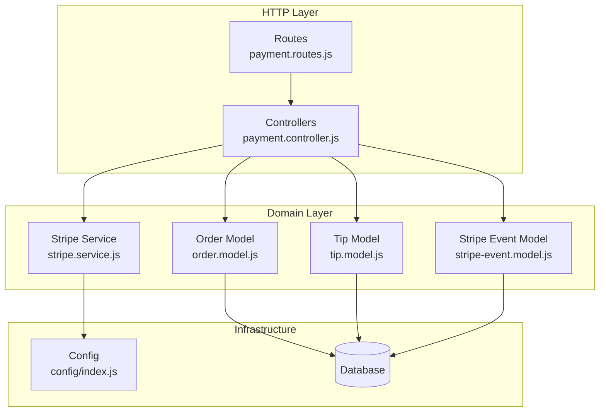
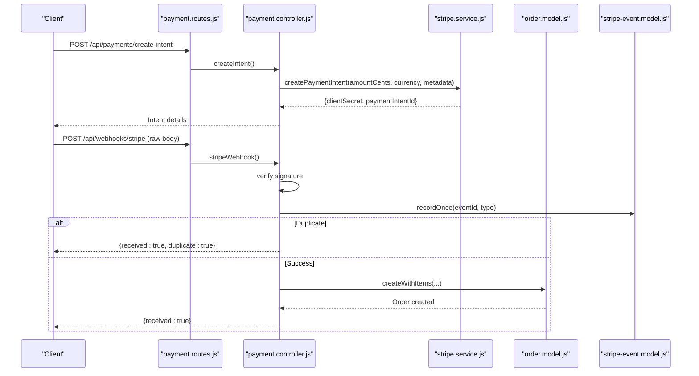
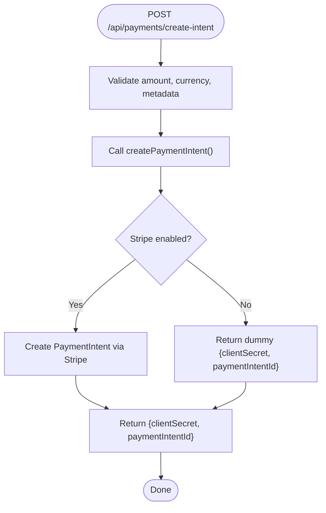
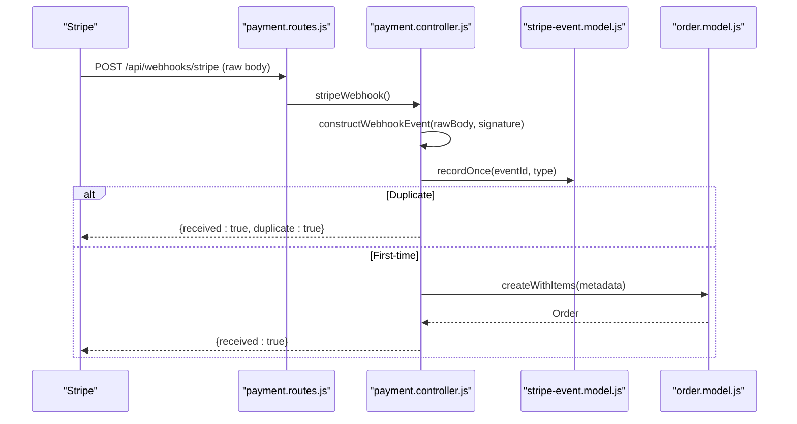
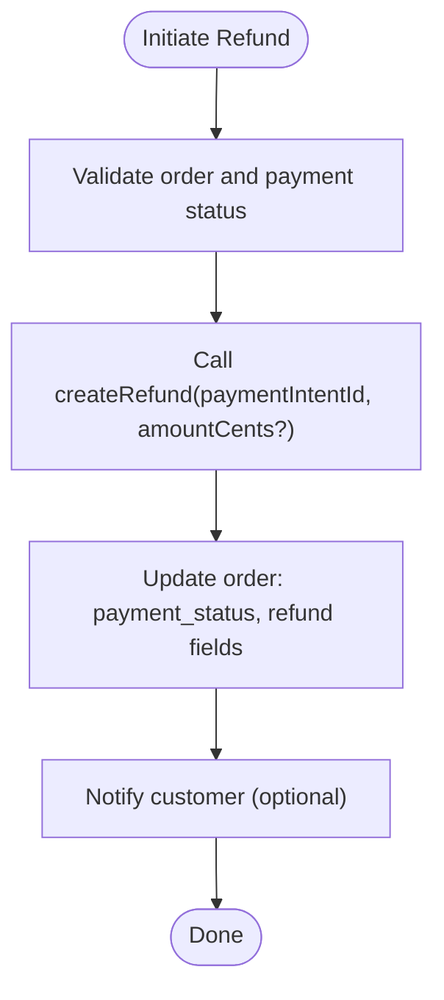
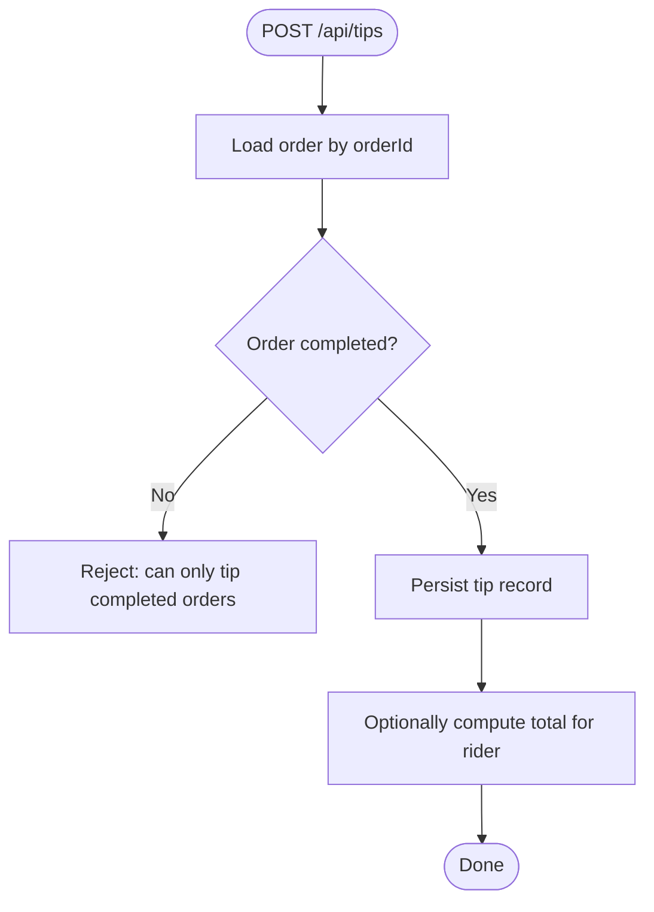
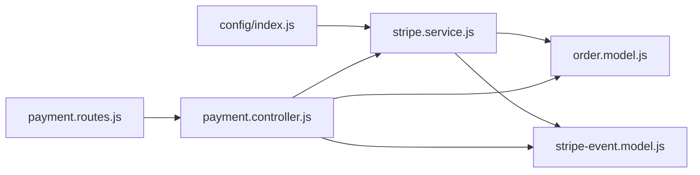

# Payment System

<cite>
**Referenced Files in This Document**
- [payment.controller.js](file://apps/server/controllers/payment.controller.js)
- [stripe.service.js](file://apps/server/services/stripe.service.js)
- [stripe-event.model.js](file://apps/server/models/stripe-event.model.js)
- [order.model.js](file://apps/server/models/order.model.js)
- [payment.routes.js](file://apps/server/routes/payment.routes.js)
- [config/index.js](file://apps/server/config/index.js)
- [013_stripe_events.sql](file://apps/server/migrations/013_stripe_events.sql)
- [002_refund_columns.sql](file://apps/server/migrations/002_refund_columns.sql)
- [tip.controller.js](file://apps/server/controllers/tip.controller.js)
- [tip.model.js](file://apps/server/models/tip.model.js)
- [payment.validator.js](file://apps/server/validators/payment.validator.js)
- [order.controller.js](file://apps/server/controllers/order.controller.js)
</cite>

## Table of Contents
1. [Introduction](#introduction)
2. [Project Structure](#project-structure)
3. [Core Components](#core-components)
4. [Architecture Overview](#architecture-overview)
5. [Detailed Component Analysis](#detailed-component-analysis)
6. [Dependency Analysis](#dependency-analysis)
7. [Performance Considerations](#performance-considerations)
8. [Troubleshooting Guide](#troubleshooting-guide)
9. [Conclusion](#conclusion)
10. [Appendices](#appendices)

## Introduction
This document describes the Delivio payment processing system integrated with Stripe. It explains the payment flow architecture, Stripe integration patterns, and webhook processing mechanisms. It covers payment intent creation, confirmation, refund handling, and the tip system. It also documents webhook endpoint behavior, event validation, idempotency, multi-currency support, and security considerations. Finally, it provides examples of payment flow scenarios, testing approaches, and troubleshooting guidance.

## Project Structure
The payment system spans controllers, services, models, routes, validators, and database migrations:

- Controllers handle HTTP requests and orchestrate payment lifecycle actions.
- Services encapsulate Stripe SDK interactions and provide fallback behavior when Stripe is disabled.
- Models manage persistence for orders, tips, and Stripe events.
- Routes define endpoints for payment intents and Stripe webhooks.
- Validators enforce input constraints.
- Migrations define database schema for refunds and webhook idempotency.

**Diagram sources**
- [payment.routes.js:1-38](file://apps/server/routes/payment.routes.js#L1-L38)
- [payment.controller.js:1-109](file://apps/server/controllers/payment.controller.js#L1-L109)
- [stripe.service.js:1-83](file://apps/server/services/stripe.service.js#L1-L83)
- [order.model.js:1-178](file://apps/server/models/order.model.js#L1-L178)
- [tip.model.js:1-44](file://apps/server/models/tip.model.js#L1-L44)
- [stripe-event.model.js:1-25](file://apps/server/models/stripe-event.model.js#L1-L25)
- [config/index.js:1-117](file://apps/server/config/index.js#L1-L117)

**Section sources**
- [payment.routes.js:1-38](file://apps/server/routes/payment.routes.js#L1-L38)
- [payment.controller.js:1-109](file://apps/server/controllers/payment.controller.js#L1-L109)
- [stripe.service.js:1-83](file://apps/server/services/stripe.service.js#L1-L83)
- [order.model.js:1-178](file://apps/server/models/order.model.js#L1-L178)
- [tip.model.js:1-44](file://apps/server/models/tip.model.js#L1-L44)
- [stripe-event.model.js:1-25](file://apps/server/models/stripe-event.model.js#L1-L25)
- [config/index.js:1-117](file://apps/server/config/index.js#L1-L117)

## Core Components
- Payment controller: Exposes endpoints to create PaymentIntents and to process Stripe webhooks. It validates signatures, ensures idempotency, and triggers order creation upon successful payments.
- Stripe service: Provides wrappers around Stripe SDK operations (create PaymentIntent, create refund, retrieve PaymentIntent, construct webhook event). Includes a fallback mode when Stripe is disabled.
- Order model: Manages order lifecycle and payment status, including linking PaymentIntents, applying refunds, and scheduling orders.
- Stripe event model: Ensures idempotency by recording events in the database and preventing duplicate processing.
- Tip controller and model: Handles customer tips for completed orders and aggregates totals per rider.
- Payment routes: Mounts raw-body webhook endpoint and validated payment intent endpoint.
- Payment validator: Enforces numeric amount, three-letter currency, and optional metadata.
- Config: Centralizes Stripe credentials and webhook secrets.

**Section sources**
- [payment.controller.js:11-109](file://apps/server/controllers/payment.controller.js#L11-L109)
- [stripe.service.js:19-82](file://apps/server/services/stripe.service.js#L19-L82)
- [order.model.js:56-174](file://apps/server/models/order.model.js#L56-L174)
- [stripe-event.model.js:9-20](file://apps/server/models/stripe-event.model.js#L9-L20)
- [tip.controller.js:8-43](file://apps/server/controllers/tip.controller.js#L8-L43)
- [tip.model.js:12-41](file://apps/server/models/tip.model.js#L12-L41)
- [payment.routes.js:14-35](file://apps/server/routes/payment.routes.js#L14-L35)
- [payment.validator.js:5-9](file://apps/server/validators/payment.validator.js#L5-L9)
- [config/index.js:60-66](file://apps/server/config/index.js#L60-L66)

## Architecture Overview
The payment system follows a layered architecture:
- HTTP endpoints are defined in routes and handled by controllers.
- Controllers delegate to the Stripe service for external interactions and to models for persistence.
- Webhooks are processed synchronously via a dedicated endpoint with strict signature verification and idempotency checks.
- Refunds are initiated via the Stripe service and reflected in the order model.

**Diagram sources**
- [payment.routes.js:16-35](file://apps/server/routes/payment.routes.js#L16-L35)
- [payment.controller.js:11-109](file://apps/server/controllers/payment.controller.js#L11-L109)
- [stripe.service.js:19-43](file://apps/server/services/stripe.service.js#L19-L43)
- [order.model.js:56-93](file://apps/server/models/order.model.js#L56-L93)
- [stripe-event.model.js:9-20](file://apps/server/models/stripe-event.model.js#L9-L20)

## Detailed Component Analysis

### Payment Intent Creation and Confirmation
- Endpoint: POST /api/payments/create-intent
- Validation: Amount must be a positive integer; currency defaults to three letters; metadata is optional.
- Behavior: Delegates to Stripe service to create a PaymentIntent with automatic payment methods enabled. Returns clientSecret and paymentIntentId. In disabled mode, returns a dummy response for development/testing.

**Diagram sources**
- [payment.routes.js:27-35](file://apps/server/routes/payment.routes.js#L27-L35)
- [payment.validator.js:5-9](file://apps/server/validators/payment.validator.js#L5-L9)
- [stripe.service.js:19-43](file://apps/server/services/stripe.service.js#L19-L43)

**Section sources**
- [payment.routes.js:27-35](file://apps/server/routes/payment.routes.js#L27-L35)
- [payment.validator.js:5-9](file://apps/server/validators/payment.validator.js#L5-L9)
- [stripe.service.js:19-43](file://apps/server/services/stripe.service.js#L19-L43)

### Webhook Processing and Idempotency
- Endpoint: POST /api/webhooks/stripe (raw body)
- Signature verification: Uses Stripe’s webhook secret to validate the event payload.
- Idempotency: Records event IDs and types in the database to prevent duplicate processing.
- Event handling:
  - payment_intent.succeeded: Creates an order with items and broadcasts a WebSocket update.
  - payment_intent.payment_failed: Logs failure.
  - charge.refunded: Logs refund.
  - Other events: Logged as unhandled.

**Diagram sources**
- [payment.routes.js:16-24](file://apps/server/routes/payment.routes.js#L16-L24)
- [payment.controller.js:29-106](file://apps/server/controllers/payment.controller.js#L29-L106)
- [stripe-event.model.js:9-20](file://apps/server/models/stripe-event.model.js#L9-L20)
- [order.model.js:56-93](file://apps/server/models/order.model.js#L56-L93)

**Section sources**
- [payment.routes.js:16-24](file://apps/server/routes/payment.routes.js#L16-L24)
- [payment.controller.js:29-106](file://apps/server/controllers/payment.controller.js#L29-L106)
- [stripe-event.model.js:9-20](file://apps/server/models/stripe-event.model.js#L9-L20)
- [order.model.js:56-93](file://apps/server/models/order.model.js#L56-L93)

### Refund Handling
- Initiation: The system supports full or partial refunds by calling the Stripe service with the PaymentIntent ID and optional amount.
- Persistence: After a successful refund, the order model updates payment status and records refund details.

**Diagram sources**
- [order.controller.js:195-216](file://apps/server/controllers/order.controller.js#L195-L216)
- [stripe.service.js:48-59](file://apps/server/services/stripe.service.js#L48-L59)
- [002_refund_columns.sql:4-16](file://apps/server/migrations/002_refund_columns.sql#L4-L16)

**Section sources**
- [order.controller.js:195-216](file://apps/server/controllers/order.controller.js#L195-L216)
- [stripe.service.js:48-59](file://apps/server/services/stripe.service.js#L48-L59)
- [002_refund_columns.sql:4-16](file://apps/server/migrations/002_refund_columns.sql#L4-L16)

### Tip Calculation and Processing
- Endpoint: POST /api/tips (via tip controller)
- Constraints: Tips are allowed only on completed orders; amount must be a positive integer.
- Persistence: Tips are stored with references to order, customer, and rider; totals can be aggregated per rider.

**Diagram sources**
- [tip.controller.js:8-30](file://apps/server/controllers/tip.controller.js#L8-L30)
- [tip.model.js:12-41](file://apps/server/models/tip.model.js#L12-L41)

**Section sources**
- [tip.controller.js:8-30](file://apps/server/controllers/tip.controller.js#L8-L30)
- [tip.model.js:12-41](file://apps/server/models/tip.model.js#L12-L41)

### Multi-Currency Support
- Currency is passed during PaymentIntent creation and defaults to three-letter codes.
- The system does not implement currency conversion; amounts are expected to match the chosen currency.

**Section sources**
- [stripe.service.js:19-43](file://apps/server/services/stripe.service.js#L19-L43)
- [payment.validator.js:7](file://apps/server/validators/payment.validator.js#L7)

### Payment Method Management
- Automatic payment methods are enabled for PaymentIntents.
- No explicit saved payment method management is present in the analyzed files.

**Section sources**
- [stripe.service.js:31-36](file://apps/server/services/stripe.service.js#L31-L36)

### Dispute Handling
- The current webhook handler does not process dispute-related events. Extending the switch statement to handle dispute events would be required to support automated actions.

**Section sources**
- [payment.controller.js:50-100](file://apps/server/controllers/payment.controller.js#L50-L100)

## Dependency Analysis

**Diagram sources**
- [config/index.js:60-66](file://apps/server/config/index.js#L60-L66)
- [stripe.service.js:3-13](file://apps/server/services/stripe.service.js#L3-L13)
- [payment.controller.js:3-9](file://apps/server/controllers/payment.controller.js#L3-L9)
- [payment.routes.js:5-10](file://apps/server/routes/payment.routes.js#L5-L10)

**Section sources**
- [config/index.js:60-66](file://apps/server/config/index.js#L60-L66)
- [stripe.service.js:3-13](file://apps/server/services/stripe.service.js#L3-L13)
- [payment.controller.js:3-9](file://apps/server/controllers/payment.controller.js#L3-L9)
- [payment.routes.js:5-10](file://apps/server/routes/payment.routes.js#L5-L10)

## Performance Considerations
- Webhook idempotency prevents redundant work and reduces load during retries.
- Using raw body for webhook verification avoids unnecessary parsing overhead.
- Stripe SDK calls are synchronous; consider asynchronous processing for high-volume scenarios.
- Database writes for orders and events are single-table inserts; ensure indexing on event_id and type for fast lookups.

[No sources needed since this section provides general guidance]

## Troubleshooting Guide
Common issues and resolutions:
- Webhook signature verification failed: Ensure the webhook secret is configured and the raw body middleware is applied before JSON parsing.
- Duplicate webhook events: Idempotency is enforced by storing event IDs; duplicates are ignored.
- Missing project reference in metadata: The webhook handler requires projectRef; ensure metadata is populated when creating the PaymentIntent.
- Payment failed or refunded logs: Investigate the PaymentIntent status and charge events; refunds are supported and tracked in the order model.
- Refund errors: Verify the PaymentIntent ID and amount; ensure the order is paid and not already refunded.

**Section sources**
- [payment.controller.js:34-46](file://apps/server/controllers/payment.controller.js#L34-L46)
- [payment.controller.js:53-58](file://apps/server/controllers/payment.controller.js#L53-L58)
- [order.controller.js:203-205](file://apps/server/controllers/order.controller.js#L203-L205)
- [stripe-event.model.js:13-18](file://apps/server/models/stripe-event.model.js#L13-L18)

## Conclusion
The Delivio payment system integrates Stripe via PaymentIntents and webhooks, with robust idempotency and logging. It supports refunds, tip processing, and multi-currency PaymentIntents. The architecture cleanly separates concerns across routes, controllers, services, and models, enabling maintainability and testability. Extending dispute handling and adding saved payment methods would further strengthen the system.

[No sources needed since this section summarizes without analyzing specific files]

## Appendices

### API Endpoints
- POST /api/payments/create-intent
  - Body: amountCents (integer), currency (3 chars, default gbp), metadata (object)
  - Response: { clientSecret, paymentIntentId, isDummy? }
- POST /api/webhooks/stripe
  - Headers: stripe-signature
  - Body: raw JSON
  - Response: { received: true, duplicate?: true }

**Section sources**
- [payment.routes.js:16-35](file://apps/server/routes/payment.routes.js#L16-L35)
- [payment.validator.js:5-9](file://apps/server/validators/payment.validator.js#L5-L9)
- [stripe.service.js:74-80](file://apps/server/services/stripe.service.js#L74-L80)

### Database Schema Notes
- stripe_events: Stores event_id and type for idempotency.
- orders: Extended with refund tracking columns and updated payment_status constraints.

**Section sources**
- [013_stripe_events.sql:3-11](file://apps/server/migrations/013_stripe_events.sql#L3-L11)
- [002_refund_columns.sql:4-16](file://apps/server/migrations/002_refund_columns.sql#L4-L16)

### Security Best Practices
- Always use raw body for webhook verification.
- Store and use webhook secrets securely.
- Validate and sanitize all inputs.
- Limit rate of payment-related requests.
- Audit sensitive actions (payments, refunds).

**Section sources**
- [payment.routes.js:18-22](file://apps/server/routes/payment.routes.js#L18-L22)
- [config/index.js:60-66](file://apps/server/config/index.js#L60-L66)
- [payment.validator.js:5-9](file://apps/server/validators/payment.validator.js#L5-L9)

### Testing Approaches
- Unit tests for controllers and services using mocked Stripe SDK and database.
- End-to-end tests simulating PaymentIntent creation and webhook events.
- Idempotency tests by replaying webhook payloads.
- Refund tests verifying order state transitions and refund fields.

[No sources needed since this section provides general guidance]