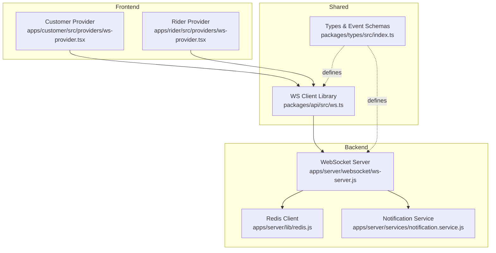
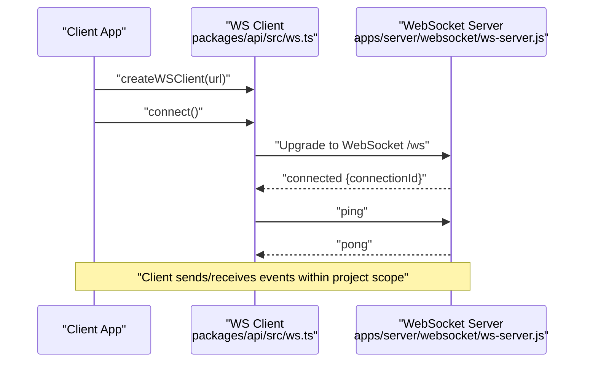
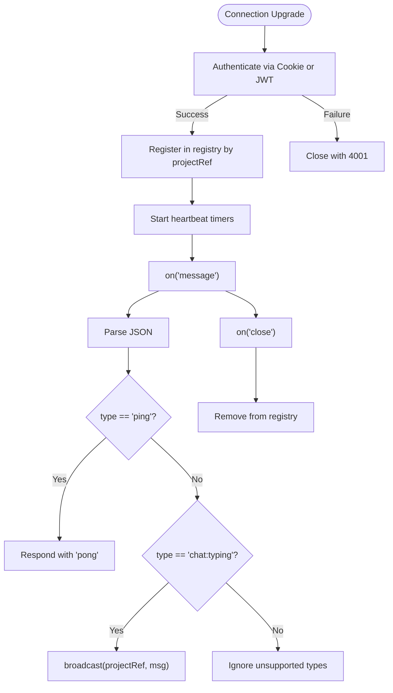
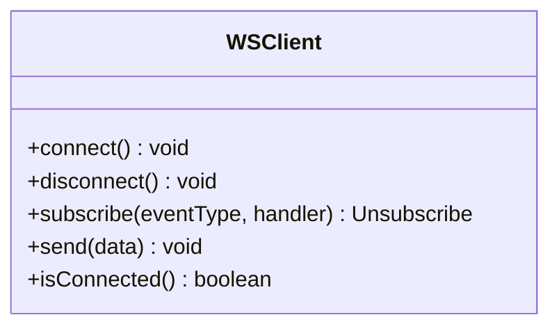
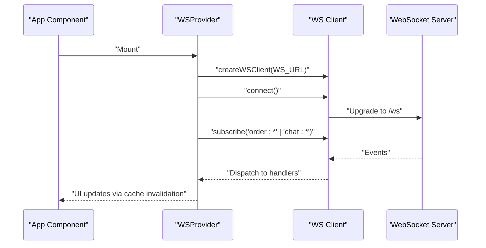
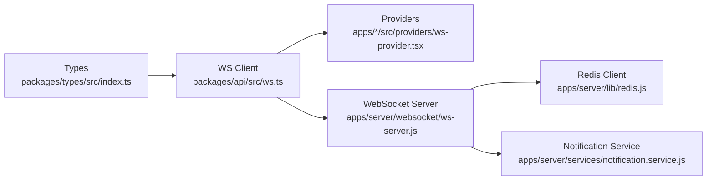

# Real-time Communication

<cite>
**Referenced Files in This Document**
- [ws-server.js](file://apps/server/websocket/ws-server.js)
- [redis.js](file://apps/server/lib/redis.js)
- [ws.ts](file://packages/api/src/ws.ts)
- [ws-provider.tsx (customer)](file://apps/customer/src/providers/ws-provider.tsx)
- [ws-provider.tsx (rider)](file://apps/rider/src/providers/ws-provider.tsx)
- [index.ts (types)](file://packages/types/src/index.ts)
- [notification.service.js](file://apps/server/services/notification.service.js)
</cite>

## Table of Contents
1. [Introduction](#introduction)
2. [Project Structure](#project-structure)
3. [Core Components](#core-components)
4. [Architecture Overview](#architecture-overview)
5. [Detailed Component Analysis](#detailed-component-analysis)
6. [Dependency Analysis](#dependency-analysis)
7. [Performance Considerations](#performance-considerations)
8. [Troubleshooting Guide](#troubleshooting-guide)
9. [Conclusion](#conclusion)
10. [Appendices](#appendices)

## Introduction
This document explains the Delivio real-time communication system with a focus on the WebSocket server, connection lifecycle, event broadcasting, and client integrations. It covers supported event types for order updates, chat messages, location sharing, and delivery status changes. It also documents client-side implementation patterns for web and mobile, connection handling and reconnection strategies, message serialization, error handling, and the current state of Redis pub/sub integration for scalability. Practical examples and debugging techniques are included to help developers implement and maintain real-time features effectively.

## Project Structure
The real-time stack spans three layers:
- Backend WebSocket server: handles authentication, connection lifecycle, heartbeats, and event broadcasting.
- Shared API client: a reusable WebSocket client used by web and mobile clients.
- Frontend providers: React providers that initialize the WebSocket client and subscribe to events.
- Types: shared TypeScript definitions for event schemas.
- Notifications: push/email fallbacks for offline users.

**Diagram sources**
- [ws-server.js:1-89](file://apps/server/websocket/ws-server.js#L1-L89)
- [redis.js:1-42](file://apps/server/lib/redis.js#L1-L42)
- [ws.ts:1-123](file://packages/api/src/ws.ts#L1-L123)
- [ws-provider.tsx (customer):1-86](file://apps/customer/src/providers/ws-provider.tsx#L1-L86)
- [ws-provider.tsx (rider):1-83](file://apps/rider/src/providers/ws-provider.tsx#L1-L83)
- [index.ts (types):272-347](file://packages/types/src/index.ts#L272-L347)
- [notification.service.js:1-180](file://apps/server/services/notification.service.js#L1-L180)

**Section sources**
- [ws-server.js:1-89](file://apps/server/websocket/ws-server.js#L1-L89)
- [ws.ts:1-123](file://packages/api/src/ws.ts#L1-L123)
- [ws-provider.tsx (customer):1-86](file://apps/customer/src/providers/ws-provider.tsx#L1-L86)
- [ws-provider.tsx (rider):1-83](file://apps/rider/src/providers/ws-provider.tsx#L1-L83)
- [index.ts (types):272-347](file://packages/types/src/index.ts#L272-L347)
- [redis.js:1-42](file://apps/server/lib/redis.js#L1-L42)
- [notification.service.js:1-180](file://apps/server/services/notification.service.js#L1-L180)

## Core Components
- WebSocket Server
  - Initializes a WebSocket server on the HTTP server at /ws.
  - Authenticates clients via cookies or JWT query parameter.
  - Maintains a connection registry per project workspace.
  - Implements periodic heartbeats and cleans stale connections.
  - Handles inbound messages and broadcasts events to project members.
- Shared WebSocket Client
  - Provides connect/disconnect, subscribe, send, and isConnected.
  - Implements exponential backoff reconnection and client-side heartbeat.
  - Parses inbound JSON and dispatches events to registered handlers.
- Frontend Providers
  - Initialize the shared WebSocket client and connect on mount.
  - Subscribe to relevant events and invalidate React Query caches to keep UIs fresh.
- Types
  - Defines the canonical WSEvent union and individual event interfaces for order, delivery, and chat events.
- Notification Service
  - Sends push/email notifications to users who are offline (no active WebSocket connection).

**Section sources**
- [ws-server.js:22-89](file://apps/server/websocket/ws-server.js#L22-L89)
- [ws.ts:6-123](file://packages/api/src/ws.ts#L6-L123)
- [ws-provider.tsx (customer):27-53](file://apps/customer/src/providers/ws-provider.tsx#L27-L53)
- [ws-provider.tsx (rider):27-50](file://apps/rider/src/providers/ws-provider.tsx#L27-L50)
- [index.ts (types):272-347](file://packages/types/src/index.ts#L272-L347)
- [notification.service.js:70-180](file://apps/server/services/notification.service.js#L70-L180)

## Architecture Overview
The system uses a single WebSocket endpoint (/ws) per project workspace. Clients authenticate using either:
- admin_session or customer_session cookies for browser clients.
- a JWT token passed as a query parameter (?token=...) for mobile/public tracking.

Once authenticated, clients receive a connection acknowledgment and participate in project-scoped event broadcasts. The server maintains an in-memory registry keyed by projectRef and connectionId. Heartbeats ensure liveness and automatic cleanup of dead connections.

**Diagram sources**
- [ws.ts:17-63](file://packages/api/src/ws.ts#L17-L63)
- [ws-server.js:22-71](file://apps/server/websocket/ws-server.js#L22-L71)

**Section sources**
- [ws-server.js:22-89](file://apps/server/websocket/ws-server.js#L22-L89)
- [ws.ts:17-63](file://packages/api/src/ws.ts#L17-L63)

## Detailed Component Analysis

### WebSocket Server
- Authentication
  - Checks admin_session and customer_session cookies.
  - Falls back to JWT verification via query parameter token.
- Connection Lifecycle
  - Generates a connectionId and registers the client under projectRef.
  - Starts a heartbeat listener and pinger.
  - On close/error, removes the connection and logs.
- Message Handling
  - Parses inbound JSON; responds to ping with pong.
  - Relays chat:typing events to the project channel.
- Broadcasting
  - broadcast(projectRef, message): Sends to all OPEN connections in a project.
  - sendToUser(projectRef, userId, message): Sends to a specific user’s connections.
  - isUserOnline(projectRef, userId): Checks if any of a user’s connections are open.
  - listOnlineUsersByRole(projectRef, role): Lists unique online user IDs by role.
  - getStats(): Returns connection counts per project.

**Diagram sources**
- [ws-server.js:25-89](file://apps/server/websocket/ws-server.js#L25-L89)
- [ws-server.js:95-147](file://apps/server/websocket/ws-server.js#L95-L147)
- [ws-server.js:162-175](file://apps/server/websocket/ws-server.js#L162-L175)

**Section sources**
- [ws-server.js:25-89](file://apps/server/websocket/ws-server.js#L25-L89)
- [ws-server.js:95-147](file://apps/server/websocket/ws-server.js#L95-L147)
- [ws-server.js:162-206](file://apps/server/websocket/ws-server.js#L162-L206)

### Shared WebSocket Client (Web/Mobile)
- Initialization
  - Exposes connect(), disconnect(), subscribe(eventType, handler), send(data), isConnected().
- Reconnection
  - Uses exponential backoff capped at 30 seconds.
  - Resets reconnectAttempt on successful open.
- Heartbeat
  - Sends ping every ~25 seconds while connected.
  - Ignores inbound pong messages.
- Event Dispatch
  - Parses JSON and dispatches to handlers registered for the event type.
  - Ignores malformed messages.

**Diagram sources**
- [ws.ts:6-15](file://packages/api/src/ws.ts#L6-L15)

**Section sources**
- [ws.ts:17-123](file://packages/api/src/ws.ts#L17-L123)

### Frontend Providers (React)
- Customer Provider
  - Creates a WS client with a ws:// URL derived from NEXT_PUBLIC_API_URL or defaults.
  - Subscribes to order and chat events and invalidates React Query caches.
- Rider Provider
  - Similar pattern tailored to delivery and chat events.

**Diagram sources**
- [ws-provider.tsx (customer):27-53](file://apps/customer/src/providers/ws-provider.tsx#L27-L53)
- [ws-provider.tsx (rider):27-50](file://apps/rider/src/providers/ws-provider.tsx#L27-L50)
- [ws.ts:99-110](file://packages/api/src/ws.ts#L99-L110)

**Section sources**
- [ws-provider.tsx (customer):17-53](file://apps/customer/src/providers/ws-provider.tsx#L17-L53)
- [ws-provider.tsx (rider):17-50](file://apps/rider/src/providers/ws-provider.tsx#L17-L50)

### Event Types and Payloads
Supported event types and their payloads are defined centrally and used by both server and client:

- order:status_changed
  - Fields: orderId, status, previousStatus, updatedAt, optional deliveryStatus.
- order:rejected
  - Fields: orderId, optional reason.
- order:delayed
  - Fields: orderId, slaDeadline.
- delivery:location_update
  - Fields: deliveryId, lat, lon, optional heading, optional speed.
- delivery:rider_arrived
  - Fields: deliveryId, orderId.
- delivery:request
  - Fields: deliveryId, orderId, optional vendorLat, optional vendorLon.
- chat:message
  - Fields: conversationId, message (Message object).
- chat:read
  - Fields: conversationId, userId, readAt.
- chat:typing
  - Fields: conversationId, userId, isTyping.

These types are used by the server’s broadcast and by the client’s event handlers.

**Section sources**
- [index.ts (types):272-347](file://packages/types/src/index.ts#L272-L347)
- [ws-server.js:150-161](file://apps/server/websocket/ws-server.js#L150-L161)

### Message Serialization and Error Handling
- Serialization
  - Outbound messages are JSON stringified before sending.
  - Inbound messages are parsed; malformed JSON triggers an error event to the sender.
- Error Handling
  - Server closes connections with code 4001 on authentication failure.
  - Client ignores malformed messages and continues operating.
  - Client closes socket on network errors and schedules reconnection.

**Section sources**
- [ws-server.js:126-137](file://apps/server/websocket/ws-server.js#L126-L137)
- [ws.ts:42-52](file://packages/api/src/ws.ts#L42-L52)
- [ws.ts:60-62](file://packages/api/src/ws.ts#L60-L62)

### Redis Pub/Sub Integration
- Current State
  - A Redis client is initialized and configured with retry and reconnect strategies.
  - The WebSocket server currently uses an in-memory registry for connection management.
  - No explicit Redis pub/sub usage is present in the WebSocket server or event broadcasting logic shown here.
- Scalability Implications
  - To scale beyond a single server instance, the broadcast mechanism should be backed by Redis channels so that events published by one instance are received by others.
  - The session store can also leverage Redis for distributed sessions.

**Section sources**
- [redis.js:8-39](file://apps/server/lib/redis.js#L8-L39)
- [ws-server.js:162-175](file://apps/server/websocket/ws-server.js#L162-L175)

### Practical Examples
- Web Client Integration
  - Initialize WSProvider at the app root.
  - Use useWSEvent to subscribe to order:status_changed and trigger cache invalidation.
  - Use useWSEvent to subscribe to chat:message and refresh conversations.
- Mobile Client Integration
  - Use the same shared createWSClient factory to create a WebSocket client.
  - Subscribe to delivery:request for riders and order:status_changed for customers.
  - Send chat:typing events by calling send({ type: 'chat:typing', conversationId, isTyping }).

**Section sources**
- [ws-provider.tsx (customer):27-53](file://apps/customer/src/providers/ws-provider.tsx#L27-L53)
- [ws-provider.tsx (rider):27-50](file://apps/rider/src/providers/ws-provider.tsx#L27-L50)
- [ws.ts:99-116](file://packages/api/src/ws.ts#L99-L116)
- [ws-server.js:139-146](file://apps/server/websocket/ws-server.js#L139-L146)

## Dependency Analysis
- Internal Dependencies
  - Frontend providers depend on the shared WS client library.
  - The WS client depends on the shared types for event typing.
  - The WebSocket server depends on session services for authentication and on logging for observability.
- External Dependencies
  - WebSocket server uses ws, uuid, cookie, jsonwebtoken.
  - Redis client uses ioredis with retry and reconnect strategies.
  - Notification service integrates with push/email services.

**Diagram sources**
- [index.ts (types):272-347](file://packages/types/src/index.ts#L272-L347)
- [ws.ts:1-123](file://packages/api/src/ws.ts#L1-L123)
- [ws-provider.tsx (customer):1-86](file://apps/customer/src/providers/ws-provider.tsx#L1-L86)
- [ws-provider.tsx (rider):1-83](file://apps/rider/src/providers/ws-provider.tsx#L1-L83)
- [ws-server.js:1-89](file://apps/server/websocket/ws-server.js#L1-L89)
- [redis.js:1-42](file://apps/server/lib/redis.js#L1-L42)
- [notification.service.js:1-180](file://apps/server/services/notification.service.js#L1-L180)

**Section sources**
- [index.ts (types):272-347](file://packages/types/src/index.ts#L272-L347)
- [ws.ts:1-123](file://packages/api/src/ws.ts#L1-L123)
- [ws-provider.tsx (customer):1-86](file://apps/customer/src/providers/ws-provider.tsx#L1-L86)
- [ws-provider.tsx (rider):1-83](file://apps/rider/src/providers/ws-provider.tsx#L1-L83)
- [ws-server.js:1-89](file://apps/server/websocket/ws-server.js#L1-L89)
- [redis.js:1-42](file://apps/server/lib/redis.js#L1-L42)
- [notification.service.js:1-180](file://apps/server/services/notification.service.js#L1-L180)

## Performance Considerations
- Connection Management
  - Heartbeat pings every 30 seconds; unresponsive connections are terminated automatically.
  - Use isUserOnline and listOnlineUsersByRole to optimize targeted notifications.
- Broadcasting
  - broadcast iterates over project connections and sends to OPEN sockets only.
  - Consider offloading to Redis pub/sub for multi-instance deployments.
- Client Behavior
  - Exponential backoff prevents thundering herd on server restarts.
  - Heartbeat reduces stale connection accumulation.

[No sources needed since this section provides general guidance]

## Troubleshooting Guide
- Authentication Failures
  - Verify cookies (admin_session, customer_session) or JWT token query parameter.
  - Check server logs for authentication warnings.
- Connection Drops
  - Confirm heartbeat timers are running and pongs are received.
  - Inspect client reconnection attempts and delays.
- Event Delivery Issues
  - Ensure the projectRef matches the workspace context.
  - Verify event types match the WSEvent union and that handlers are subscribed.
- Offline Users
  - Use notification service to send push/email alerts when WebSocket is unavailable.

**Section sources**
- [ws-server.js:25-39](file://apps/server/websocket/ws-server.js#L25-L39)
- [ws.ts:73-81](file://packages/api/src/ws.ts#L73-L81)
- [notification.service.js:70-83](file://apps/server/services/notification.service.js#L70-L83)

## Conclusion
Delivio’s real-time system centers on a lightweight WebSocket server with cookie/JWT authentication, project-scoped broadcasting, and a robust client library implementing heartbeats and exponential backoff. Event schemas are shared via types for consistency across the stack. While the current server uses an in-memory registry, integrating Redis pub/sub would enable horizontal scaling. Frontend providers streamline subscription and cache invalidation, ensuring responsive UI updates.

[No sources needed since this section summarizes without analyzing specific files]

## Appendices

### Event Reference
- order:status_changed
  - Triggered when an order transitions status.
- order:rejected
  - Triggered when a vendor rejects an order.
- order:delayed
  - Triggered when SLA deadline is missed.
- delivery:location_update
  - Periodic GPS updates from riders.
- delivery:rider_arrived
  - Triggered when a rider taps “arrived.”
- delivery:request
  - Triggered when a new delivery is available for riders.
- chat:message
  - Triggered when a new chat message arrives.
- chat:read
  - Triggered when a message is marked as read.
- chat:typing
  - Triggered when a participant starts/stops typing.

**Section sources**
- [index.ts (types):272-347](file://packages/types/src/index.ts#L272-L347)
- [ws-server.js:150-161](file://apps/server/websocket/ws-server.js#L150-L161)