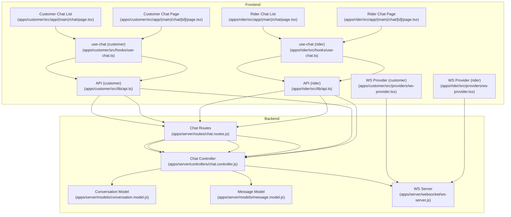
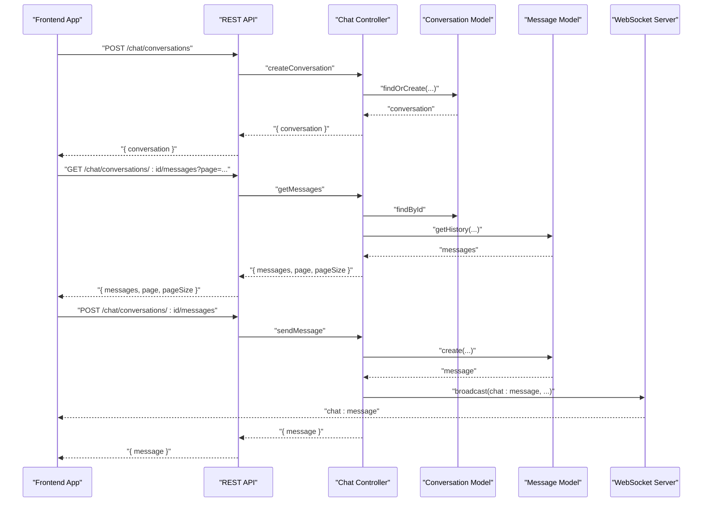
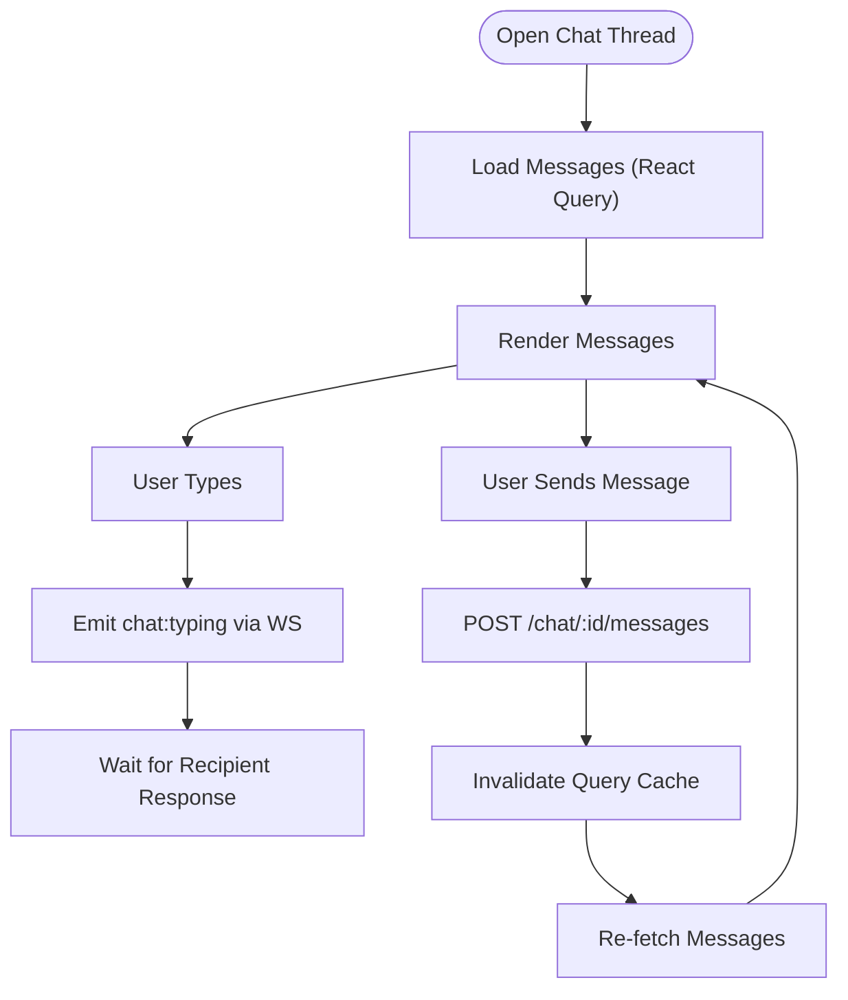
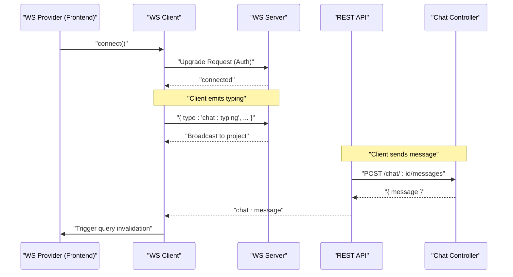
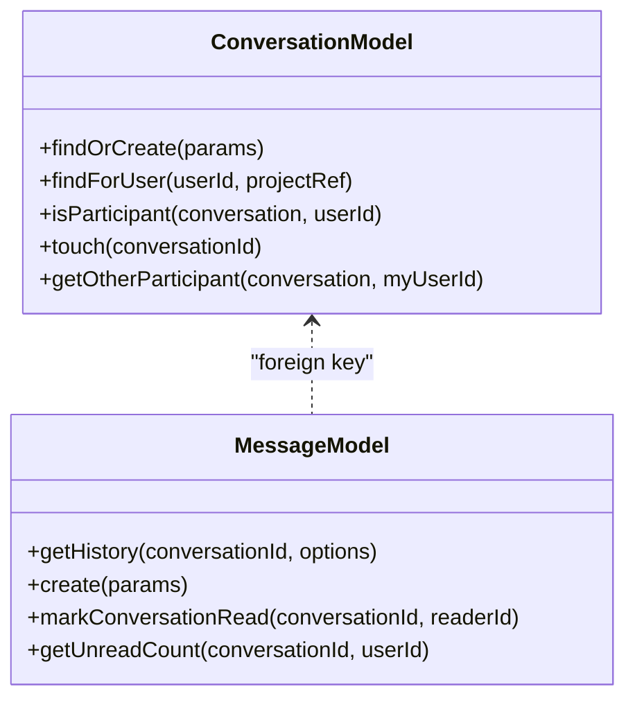
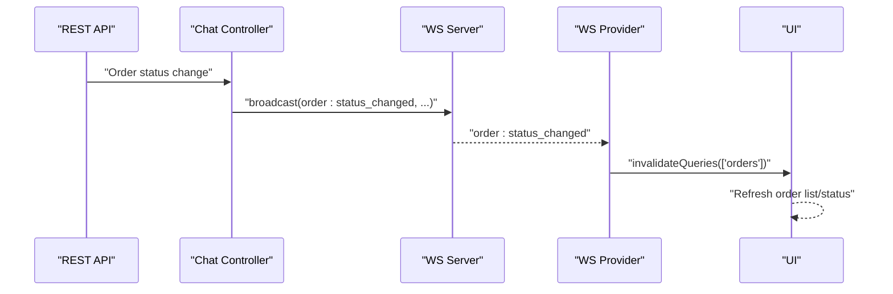
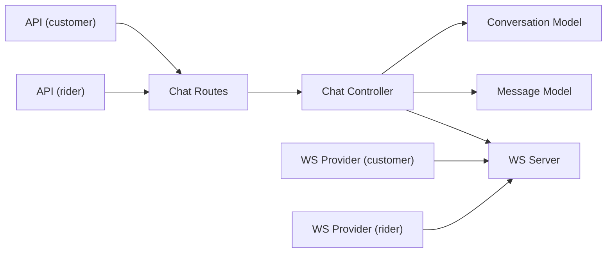

# Communication & Customer Interaction

<cite>
**Referenced Files in This Document**
- [apps/customer/src/app/(main)/chat/page.tsx](file://apps/customer/src/app/(main)/chat/page.tsx)
- [apps/customer/src/app/(main)/chat/[id]/page.tsx](file://apps/customer/src/app/(main)/chat/[id]/page.tsx)
- [apps/rider/src/app/(main)/chat/page.tsx](file://apps/rider/src/app/(main)/chat/page.tsx)
- [apps/rider/src/app/(main)/chat/[id]/page.tsx](file://apps/rider/src/app/(main)/chat/[id]/page.tsx)
- [apps/customer/src/hooks/use-chat.ts](file://apps/customer/src/hooks/use-chat.ts)
- [apps/rider/src/hooks/use-chat.ts](file://apps/rider/src/hooks/use-chat.ts)
- [apps/customer/src/providers/ws-provider.tsx](file://apps/customer/src/providers/ws-provider.tsx)
- [apps/rider/src/providers/ws-provider.tsx](file://apps/rider/src/providers/ws-provider.tsx)
- [apps/customer/src/lib/api.ts](file://apps/customer/src/lib/api.ts)
- [apps/rider/src/lib/api.ts](file://apps/rider/src/lib/api.ts)
- [apps/server/controllers/chat.controller.js](file://apps/server/controllers/chat.controller.js)
- [apps/server/routes/chat.routes.js](file://apps/server/routes/chat.routes.js)
- [apps/server/websocket/ws-server.js](file://apps/server/websocket/ws-server.js)
- [apps/server/models/conversation.model.js](file://apps/server/models/conversation.model.js)
- [apps/server/models/message.model.js](file://apps/server/models/message.model.js)
</cite>

## Table of Contents
1. [Introduction](#introduction)
2. [Project Structure](#project-structure)
3. [Core Components](#core-components)
4. [Architecture Overview](#architecture-overview)
5. [Detailed Component Analysis](#detailed-component-analysis)
6. [Dependency Analysis](#dependency-analysis)
7. [Performance Considerations](#performance-considerations)
8. [Troubleshooting Guide](#troubleshooting-guide)
9. [Conclusion](#conclusion)
10. [Appendices](#appendices)

## Introduction
This document describes the real-time communication and customer interaction system that enables live chat between customers and vendors, and between vendors and riders. It covers the chat interface, message threading, conversation management, WebSocket-based messaging, real-time delivery of messages and typing indicators, and integration with order management for context-aware messaging. It also documents workflows for order status communication, problem resolution, chat history management, notifications, and escalation procedures.

## Project Structure
The communication system spans three primary areas:
- Frontend chat pages for customer and rider applications
- WebSocket provider and event subscriptions
- Backend chat controller, routes, models, and WebSocket server

**Diagram sources**
- [apps/customer/src/app/(main)/chat/page.tsx](file://apps/customer/src/app/(main)/chat/page.tsx)
- [apps/customer/src/app/(main)/chat/[id]/page.tsx](file://apps/customer/src/app/(main)/chat/[id]/page.tsx)
- [apps/rider/src/app/(main)/chat/page.tsx](file://apps/rider/src/app/(main)/chat/page.tsx)
- [apps/rider/src/app/(main)/chat/[id]/page.tsx](file://apps/rider/src/app/(main)/chat/[id]/page.tsx)
- [apps/customer/src/hooks/use-chat.ts](file://apps/customer/src/hooks/use-chat.ts)
- [apps/rider/src/hooks/use-chat.ts](file://apps/rider/src/hooks/use-chat.ts)
- [apps/customer/src/providers/ws-provider.tsx](file://apps/customer/src/providers/ws-provider.tsx)
- [apps/rider/src/providers/ws-provider.tsx](file://apps/rider/src/providers/ws-provider.tsx)
- [apps/customer/src/lib/api.ts](file://apps/customer/src/lib/api.ts)
- [apps/rider/src/lib/api.ts](file://apps/rider/src/lib/api.ts)
- [apps/server/routes/chat.routes.js](file://apps/server/routes/chat.routes.js)
- [apps/server/controllers/chat.controller.js](file://apps/server/controllers/chat.controller.js)
- [apps/server/models/conversation.model.js](file://apps/server/models/conversation.model.js)
- [apps/server/models/message.model.js](file://apps/server/models/message.model.js)
- [apps/server/websocket/ws-server.js](file://apps/server/websocket/ws-server.js)

**Section sources**
- [apps/customer/src/app/(main)/chat/page.tsx](file://apps/customer/src/app/(main)/chat/page.tsx)
- [apps/customer/src/app/(main)/chat/[id]/page.tsx](file://apps/customer/src/app/(main)/chat/[id]/page.tsx)
- [apps/rider/src/app/(main)/chat/page.tsx](file://apps/rider/src/app/(main)/chat/page.tsx)
- [apps/rider/src/app/(main)/chat/[id]/page.tsx](file://apps/rider/src/app/(main)/chat/[id]/page.tsx)
- [apps/customer/src/hooks/use-chat.ts](file://apps/customer/src/hooks/use-chat.ts)
- [apps/rider/src/hooks/use-chat.ts](file://apps/rider/src/hooks/use-chat.ts)
- [apps/customer/src/providers/ws-provider.tsx](file://apps/customer/src/providers/ws-provider.tsx)
- [apps/rider/src/providers/ws-provider.tsx](file://apps/rider/src/providers/ws-provider.tsx)
- [apps/customer/src/lib/api.ts](file://apps/customer/src/lib/api.ts)
- [apps/rider/src/lib/api.ts](file://apps/rider/src/lib/api.ts)
- [apps/server/routes/chat.routes.js](file://apps/server/routes/chat.routes.js)
- [apps/server/controllers/chat.controller.js](file://apps/server/controllers/chat.controller.js)
- [apps/server/models/conversation.model.js](file://apps/server/models/conversation.model.js)
- [apps/server/models/message.model.js](file://apps/server/models/message.model.js)
- [apps/server/websocket/ws-server.js](file://apps/server/websocket/ws-server.js)

## Core Components
- Chat UI (customer and rider):
  - Conversation list displays active chats with order context.
  - Chat page renders message threads, handles sending messages, and shows typing indicators.
- Real-time messaging:
  - WebSocket provider connects to the backend and subscribes to events.
  - Event handlers refresh chat data and invalidate queries to keep the UI up-to-date.
- Backend chat service:
  - REST endpoints manage conversations and messages.
  - WebSocket server relays chat events and typing indicators.
  - Models encapsulate conversation and message persistence and queries.
- Order integration:
  - Conversations are associated with orders and participants are determined by roles and assignments.
  - Notifications are triggered when recipients are offline.

**Section sources**
- [apps/customer/src/app/(main)/chat/page.tsx](file://apps/customer/src/app/(main)/chat/page.tsx)
- [apps/customer/src/app/(main)/chat/[id]/page.tsx](file://apps/customer/src/app/(main)/chat/[id]/page.tsx)
- [apps/rider/src/app/(main)/chat/page.tsx](file://apps/rider/src/app/(main)/chat/page.tsx)
- [apps/rider/src/app/(main)/chat/[id]/page.tsx](file://apps/rider/src/app/(main)/chat/[id]/page.tsx)
- [apps/customer/src/providers/ws-provider.tsx](file://apps/customer/src/providers/ws-provider.tsx)
- [apps/rider/src/providers/ws-provider.tsx](file://apps/rider/src/providers/ws-provider.tsx)
- [apps/server/controllers/chat.controller.js](file://apps/server/controllers/chat.controller.js)
- [apps/server/websocket/ws-server.js](file://apps/server/websocket/ws-server.js)
- [apps/server/models/conversation.model.js](file://apps/server/models/conversation.model.js)
- [apps/server/models/message.model.js](file://apps/server/models/message.model.js)

## Architecture Overview
The system combines REST APIs for chat CRUD operations with a WebSocket server for real-time updates. The frontend uses a WebSocket client to subscribe to events and React Query to cache and refetch chat data.

**Diagram sources**
- [apps/server/controllers/chat.controller.js](file://apps/server/controllers/chat.controller.js)
- [apps/server/models/conversation.model.js](file://apps/server/models/conversation.model.js)
- [apps/server/models/message.model.js](file://apps/server/models/message.model.js)
- [apps/server/websocket/ws-server.js](file://apps/server/websocket/ws-server.js)
- [apps/server/routes/chat.routes.js](file://apps/server/routes/chat.routes.js)

## Detailed Component Analysis

### Customer Chat Interface
- Conversation list:
  - Displays chats filtered by current user and project scope.
  - Links to individual chat threads with order context.
- Chat thread:
  - Fetches paginated message history with periodic refetch.
  - Sends new messages via API and invalidates local cache to trigger re-fetch.
  - Subscribes to real-time events to refresh messages instantly.
  - Shows typing indicators by emitting typed events over WebSocket.

**Diagram sources**
- [apps/customer/src/app/(main)/chat/[id]/page.tsx](file://apps/customer/src/app/(main)/chat/[id]/page.tsx)
- [apps/customer/src/providers/ws-provider.tsx](file://apps/customer/src/providers/ws-provider.tsx)
- [apps/customer/src/hooks/use-chat.ts](file://apps/customer/src/hooks/use-chat.ts)

**Section sources**
- [apps/customer/src/app/(main)/chat/page.tsx](file://apps/customer/src/app/(main)/chat/page.tsx)
- [apps/customer/src/app/(main)/chat/[id]/page.tsx](file://apps/customer/src/app/(main)/chat/[id]/page.tsx)
- [apps/customer/src/hooks/use-chat.ts](file://apps/customer/src/hooks/use-chat.ts)
- [apps/customer/src/providers/ws-provider.tsx](file://apps/customer/src/providers/ws-provider.tsx)

### Rider Chat Interface
- Similar UX to customer chat with role-specific labels and order context.
- Uses the same WebSocket and API integrations for real-time updates and message sending.

**Section sources**
- [apps/rider/src/app/(main)/chat/page.tsx](file://apps/rider/src/app/(main)/chat/page.tsx)
- [apps/rider/src/app/(main)/chat/[id]/page.tsx](file://apps/rider/src/app/(main)/chat/[id]/page.tsx)
- [apps/rider/src/hooks/use-chat.ts](file://apps/rider/src/hooks/use-chat.ts)
- [apps/rider/src/providers/ws-provider.tsx](file://apps/rider/src/providers/ws-provider.tsx)

### WebSocket Integration and Real-Time Delivery
- WebSocket provider:
  - Establishes a persistent connection to the backend WebSocket endpoint.
  - Subscribes to multiple event types including chat events and order-related events.
  - Invalidates queries to keep UI synchronized.
- WebSocket server:
  - Authenticates clients via session cookies or JWT.
  - Handles chat typing indicators and broadcasts chat messages to project-scoped connections.
  - Tracks online users and supports targeted notifications when users are offline.

**Diagram sources**
- [apps/customer/src/providers/ws-provider.tsx](file://apps/customer/src/providers/ws-provider.tsx)
- [apps/rider/src/providers/ws-provider.tsx](file://apps/rider/src/providers/ws-provider.tsx)
- [apps/server/websocket/ws-server.js](file://apps/server/websocket/ws-server.js)
- [apps/server/controllers/chat.controller.js](file://apps/server/controllers/chat.controller.js)

**Section sources**
- [apps/customer/src/providers/ws-provider.tsx](file://apps/customer/src/providers/ws-provider.tsx)
- [apps/rider/src/providers/ws-provider.tsx](file://apps/rider/src/providers/ws-provider.tsx)
- [apps/server/websocket/ws-server.js](file://apps/server/websocket/ws-server.js)
- [apps/server/controllers/chat.controller.js](file://apps/server/controllers/chat.controller.js)

### Conversation Management and Message Threading
- Conversation creation:
  - Determined by conversation type and order context.
  - Participants are set based on roles and assignments.
- Message threading:
  - Paginated retrieval per conversation.
  - Read receipts and unread counts support conversation awareness.
- Multi-tenant isolation:
  - All operations are scoped to the current project reference.

**Diagram sources**
- [apps/server/models/conversation.model.js](file://apps/server/models/conversation.model.js)
- [apps/server/models/message.model.js](file://apps/server/models/message.model.js)

**Section sources**
- [apps/server/controllers/chat.controller.js](file://apps/server/controllers/chat.controller.js)
- [apps/server/models/conversation.model.js](file://apps/server/models/conversation.model.js)
- [apps/server/models/message.model.js](file://apps/server/models/message.model.js)

### Order Status Communication and Problem Resolution
- Order events:
  - The WebSocket server broadcasts order lifecycle events (e.g., status changes, delays, rejections).
  - Frontends subscribe to these events and invalidate relevant queries to reflect order state changes.
- Problem resolution:
  - Conversations provide a context-aware channel for discussing order issues.
  - Escalation can occur through conversation threads and notifications.

**Diagram sources**
- [apps/server/controllers/chat.controller.js](file://apps/server/controllers/chat.controller.js)
- [apps/server/websocket/ws-server.js](file://apps/server/websocket/ws-server.js)
- [apps/customer/src/providers/ws-provider.tsx](file://apps/customer/src/providers/ws-provider.tsx)
- [apps/rider/src/providers/ws-provider.tsx](file://apps/rider/src/providers/ws-provider.tsx)

**Section sources**
- [apps/server/controllers/chat.controller.js](file://apps/server/controllers/chat.controller.js)
- [apps/server/websocket/ws-server.js](file://apps/server/websocket/ws-server.js)
- [apps/customer/src/providers/ws-provider.tsx](file://apps/customer/src/providers/ws-provider.tsx)
- [apps/rider/src/providers/ws-provider.tsx](file://apps/rider/src/providers/ws-provider.tsx)

### Chat History Management and Notifications
- Chat history:
  - Paginated retrieval with periodic refetch to keep UI fresh.
  - Local cache invalidation ensures real-time updates.
- Notifications:
  - When a recipient is offline, the backend triggers push notifications for new messages.
  - Online recipients receive immediate WebSocket updates.

**Section sources**
- [apps/customer/src/hooks/use-chat.ts](file://apps/customer/src/hooks/use-chat.ts)
- [apps/rider/src/hooks/use-chat.ts](file://apps/rider/src/hooks/use-chat.ts)
- [apps/server/controllers/chat.controller.js](file://apps/server/controllers/chat.controller.js)

### Communication Protocols and Examples
- Typical customer conversations:
  - Placing an order → initiating a customer–vendor chat → confirming order details → resolving issues → completing the order.
- Escalation procedures:
  - Use chat threads to escalate issues; include order ID and context for traceability.
  - Order status events inform stakeholders of SLA breaches or rejections, prompting timely interventions.

[No sources needed since this section provides general guidance]

## Dependency Analysis
The frontend depends on shared API and WebSocket clients, while the backend orchestrates REST and WebSocket interactions with models.

**Diagram sources**
- [apps/customer/src/lib/api.ts](file://apps/customer/src/lib/api.ts)
- [apps/rider/src/lib/api.ts](file://apps/rider/src/lib/api.ts)
- [apps/server/routes/chat.routes.js](file://apps/server/routes/chat.routes.js)
- [apps/server/controllers/chat.controller.js](file://apps/server/controllers/chat.controller.js)
- [apps/server/models/conversation.model.js](file://apps/server/models/conversation.model.js)
- [apps/server/models/message.model.js](file://apps/server/models/message.model.js)
- [apps/server/websocket/ws-server.js](file://apps/server/websocket/ws-server.js)
- [apps/customer/src/providers/ws-provider.tsx](file://apps/customer/src/providers/ws-provider.tsx)
- [apps/rider/src/providers/ws-provider.tsx](file://apps/rider/src/providers/ws-provider.tsx)

**Section sources**
- [apps/customer/src/lib/api.ts](file://apps/customer/src/lib/api.ts)
- [apps/rider/src/lib/api.ts](file://apps/rider/src/lib/api.ts)
- [apps/server/routes/chat.routes.js](file://apps/server/routes/chat.routes.js)
- [apps/server/controllers/chat.controller.js](file://apps/server/controllers/chat.controller.js)
- [apps/server/models/conversation.model.js](file://apps/server/models/conversation.model.js)
- [apps/server/models/message.model.js](file://apps/server/models/message.model.js)
- [apps/server/websocket/ws-server.js](file://apps/server/websocket/ws-server.js)
- [apps/customer/src/providers/ws-provider.tsx](file://apps/customer/src/providers/ws-provider.tsx)
- [apps/rider/src/providers/ws-provider.tsx](file://apps/rider/src/providers/ws-provider.tsx)

## Performance Considerations
- Real-time updates:
  - WebSocket subscriptions reduce polling overhead and improve responsiveness.
- Query caching:
  - React Query caches messages and conversations, with periodic refetch to balance freshness and performance.
- Pagination:
  - Message history is paginated to avoid loading large datasets at once.
- Offline fallback:
  - Push notifications ensure users are informed even when not actively using the app.

[No sources needed since this section provides general guidance]

## Troubleshooting Guide
- Authentication failures on WebSocket:
  - Ensure session cookies or JWT tokens are present and valid.
- No real-time updates:
  - Verify WebSocket connection status and event subscriptions.
- Messages not appearing:
  - Confirm conversation membership and project scoping.
- Typing indicators not visible:
  - Check that the typing event is emitted and received by the other party’s client.

**Section sources**
- [apps/server/websocket/ws-server.js](file://apps/server/websocket/ws-server.js)
- [apps/customer/src/providers/ws-provider.tsx](file://apps/customer/src/providers/ws-provider.tsx)
- [apps/rider/src/providers/ws-provider.tsx](file://apps/rider/src/providers/ws-provider.tsx)
- [apps/server/controllers/chat.controller.js](file://apps/server/controllers/chat.controller.js)

## Conclusion
The communication system integrates REST APIs and WebSocket messaging to deliver a responsive, context-aware chat experience. It leverages order-centric conversations, real-time updates, and notifications to streamline customer and vendor interactions, while supporting rider coordination and escalation workflows.

[No sources needed since this section summarizes without analyzing specific files]

## Appendices
- API endpoints:
  - POST /chat/conversations
  - GET /chat/conversations
  - GET /chat/conversations/:id/messages
  - POST /chat/conversations/:id/messages
  - PATCH /chat/conversations/:id/read

**Section sources**
- [apps/server/routes/chat.routes.js](file://apps/server/routes/chat.routes.js)
- [apps/server/controllers/chat.controller.js](file://apps/server/controllers/chat.controller.js)