# Delivery Management & Routing

<cite>
**Referenced Files in This Document**
- [delivery.controller.js](file://apps/server/controllers/delivery.controller.js)
- [delivery.model.js](file://apps/server/models/delivery.model.js)
- [delivery.routes.js](file://apps/server/routes/delivery.routes.js)
- [auto-dispatch.job.js](file://apps/server/jobs/auto-dispatch.job.js)
- [ws-server.js](file://apps/server/websocket/ws-server.js)
- [notification.service.js](file://apps/server/services/notification.service.js)
- [geo.js](file://apps/server/lib/geo.js)
- [supabase.js](file://apps/server/lib/supabase.js)
- [009_order_lifecycle.sql](file://apps/server/migrations/009_order_lifecycle.sql)
- [page.tsx (Rider Active)](file://apps/rider/src/app/(main)/active/page.tsx)
- [page.tsx (Rider History)](file://apps/rider/src/app/(main)/history/page.tsx)
- [use-deliveries.ts](file://apps/rider/src/hooks/use-deliveries.ts)
- [delivery-utils.ts](file://apps/rider-mobile/src/lib/delivery-utils.ts)
- [types/index.ts](file://packages/types/src/index.ts)
- [api/index.ts](file://packages/api/src/index.ts)
</cite>

## Table of Contents
1. [Introduction](#introduction)
2. [Project Structure](#project-structure)
3. [Core Components](#core-components)
4. [Architecture Overview](#architecture-overview)
5. [Detailed Component Analysis](#detailed-component-analysis)
6. [Dependency Analysis](#dependency-analysis)
7. [Performance Considerations](#performance-considerations)
8. [Troubleshooting Guide](#troubleshooting-guide)
9. [Conclusion](#conclusion)
10. [Appendices](#appendices)

## Introduction
This document describes the delivery management and routing system, focusing on:
- Active deliveries page for ongoing orders, delivery details, and status tracking
- Delivery claiming process and route optimization mechanisms
- Delivery sequence management and status transitions
- Delivery history and performance tracking
- Integration with mapping services, turn-by-turn navigation, and location-based services
- Examples of delivery workflows, route planning, and status updates
- Delivery confirmation, customer contact integration, and completion procedures

## Project Structure
The delivery system spans backend controllers, models, routes, jobs, and frontend pages. It integrates with Supabase for persistence, WebSocket for real-time updates, and notification services for push alerts.

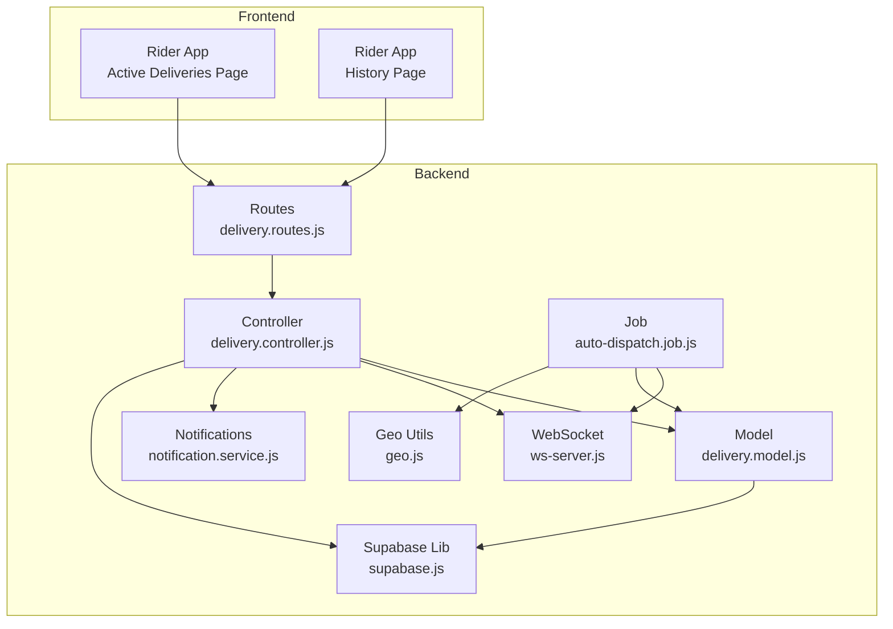

**Diagram sources**
- [delivery.routes.js:1-31](file://apps/server/routes/delivery.routes.js#L1-L31)
- [delivery.controller.js:1-313](file://apps/server/controllers/delivery.controller.js#L1-L313)
- [delivery.model.js:1-98](file://apps/server/models/delivery.model.js#L1-L98)
- [auto-dispatch.job.js:1-97](file://apps/server/jobs/auto-dispatch.job.js#L1-L97)
- [ws-server.js:1-237](file://apps/server/websocket/ws-server.js#L1-L237)
- [geo.js:1-15](file://apps/server/lib/geo.js#L1-L15)
- [supabase.js:1-151](file://apps/server/lib/supabase.js#L1-L151)
- [notification.service.js:1-180](file://apps/server/services/notification.service.js#L1-L180)
- [page.tsx (Rider Active)](file://apps/rider/src/app/(main)/active/page.tsx#L1-L235)
- [page.tsx (Rider History)](file://apps/rider/src/app/(main)/history/page.tsx#L1-L64)

**Section sources**
- [delivery.routes.js:1-31](file://apps/server/routes/delivery.routes.js#L1-L31)
- [delivery.controller.js:1-313](file://apps/server/controllers/delivery.controller.js#L1-L313)
- [delivery.model.js:1-98](file://apps/server/models/delivery.model.js#L1-L98)
- [auto-dispatch.job.js:1-97](file://apps/server/jobs/auto-dispatch.job.js#L1-L97)
- [ws-server.js:1-237](file://apps/server/websocket/ws-server.js#L1-L237)
- [geo.js:1-15](file://apps/server/lib/geo.js#L1-L15)
- [supabase.js:1-151](file://apps/server/lib/supabase.js#L1-L151)
- [notification.service.js:1-180](file://apps/server/services/notification.service.js#L1-L180)
- [page.tsx (Rider Active)](file://apps/rider/src/app/(main)/active/page.tsx#L1-L235)
- [page.tsx (Rider History)](file://apps/rider/src/app/(main)/history/page.tsx#L1-L64)

## Core Components
- Delivery controller: exposes endpoints for listing deliveries, claiming, updating status, updating/reading rider location, assigning/reassigning riders, and marking arrival.
- Delivery model: encapsulates CRUD and status transitions, availability queries, and location logging.
- Routes: define HTTP endpoints with role-based access control and validation.
- Auto-dispatch job: creates delivery records from ready orders and broadcasts to nearby online riders.
- WebSocket server: manages connections, authentication, broadcasting, and user presence.
- Notification service: sends push notifications to riders/customers for key events.
- Geo utilities: compute distances for spatial matching.
- Supabase library: standardized REST and SQL execution helpers.
- Frontend pages: Active and History views for riders, with hooks for data fetching and normalization utilities for mobile.

**Section sources**
- [delivery.controller.js:1-313](file://apps/server/controllers/delivery.controller.js#L1-L313)
- [delivery.model.js:1-98](file://apps/server/models/delivery.model.js#L1-L98)
- [delivery.routes.js:1-31](file://apps/server/routes/delivery.routes.js#L1-L31)
- [auto-dispatch.job.js:1-97](file://apps/server/jobs/auto-dispatch.job.js#L1-L97)
- [ws-server.js:1-237](file://apps/server/websocket/ws-server.js#L1-L237)
- [notification.service.js:1-180](file://apps/server/services/notification.service.js#L1-L180)
- [geo.js:1-15](file://apps/server/lib/geo.js#L1-L15)
- [supabase.js:1-151](file://apps/server/lib/supabase.js#L1-L151)
- [page.tsx (Rider Active)](file://apps/rider/src/app/(main)/active/page.tsx#L1-L235)
- [page.tsx (Rider History)](file://apps/rider/src/app/(main)/history/page.tsx#L1-L64)

## Architecture Overview
The system follows a layered architecture:
- Presentation: Next.js pages and hooks for rider app
- API: Express routes delegating to controllers
- Domain: Controllers orchestrate models, services, and notifications
- Persistence: Supabase via shared helpers
- Realtime: WebSocket server for live updates
- Background: Cron job for auto-dispatch

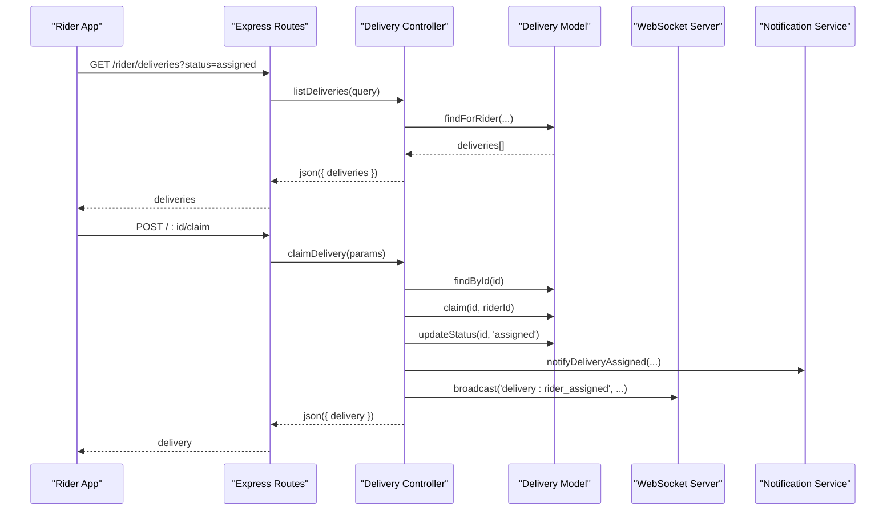

**Diagram sources**
- [delivery.routes.js:14-28](file://apps/server/routes/delivery.routes.js#L14-L28)
- [delivery.controller.js:10-52](file://apps/server/controllers/delivery.controller.js#L10-L52)
- [delivery.model.js:19-66](file://apps/server/models/delivery.model.js#L19-L66)
- [ws-server.js:162-175](file://apps/server/websocket/ws-server.js#L162-L175)
- [notification.service.js:58-68](file://apps/server/services/notification.service.js#L58-L68)

## Detailed Component Analysis

### Active Deliveries Page
The active deliveries page displays the current delivery in progress, shows a status stepper, and enables status updates. It fetches active deliveries via a hook and renders delivery details such as zone and ETA.

Key behaviors:
- Filters out delivered/pending deliveries to show only active ones
- Computes next status based on current delivery status
- Calls API to update status or mark arrival
- Invalidates queries to refresh data after updates

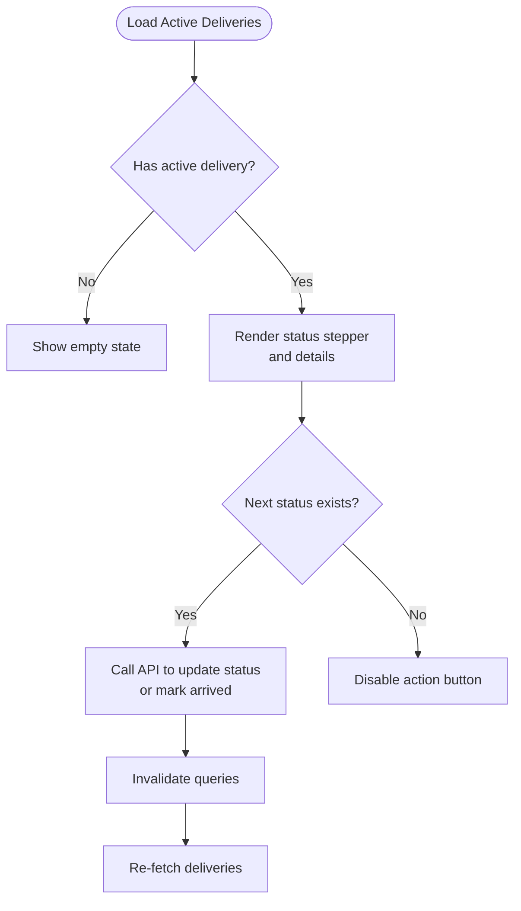

**Diagram sources**
- [page.tsx (Rider Active)](file://apps/rider/src/app/(main)/active/page.tsx#L59-L93)
- [use-deliveries.ts:13-20](file://apps/rider/src/hooks/use-deliveries.ts#L13-L20)

**Section sources**
- [page.tsx (Rider Active)](file://apps/rider/src/app/(main)/active/page.tsx#L1-L235)
- [use-deliveries.ts:1-28](file://apps/rider/src/hooks/use-deliveries.ts#L1-L28)

### Delivery Claiming and Assignment
Claiming ensures exclusive ownership and transitions status to assigned. Assignment can be performed by admins/vendors or auto-dispatch.

Endpoints and flows:
- Claim endpoint validates existence and unclaimed state, performs optimistic locking, updates status, notifies, and logs audit
- Assign endpoint allows vendor/admin to assign a specific rider
- Reassign resets a delivery to pending and broadcasts a request
- External rider assignment sets external rider details and notifies customer

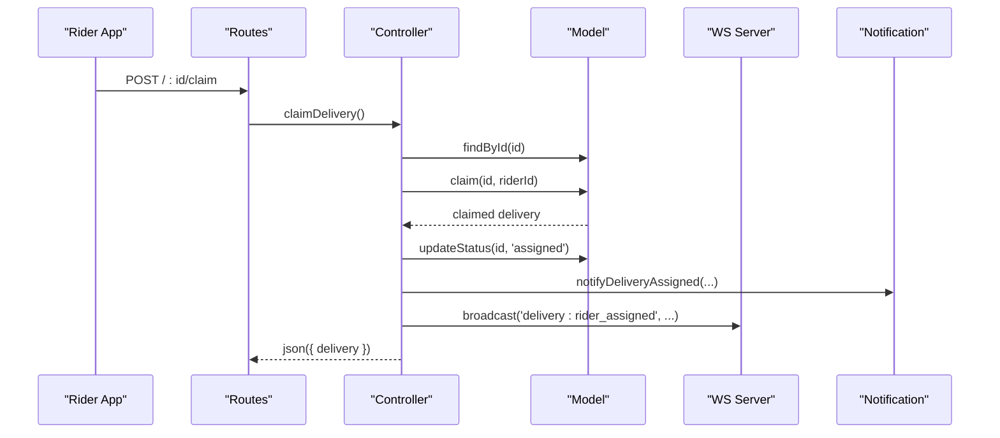

**Diagram sources**
- [delivery.routes.js:16-16](file://apps/server/routes/delivery.routes.js#L16-L16)
- [delivery.controller.js:25-52](file://apps/server/controllers/delivery.controller.js#L25-L52)
- [delivery.model.js:49-66](file://apps/server/models/delivery.model.js#L49-L66)
- [notification.service.js:58-68](file://apps/server/services/notification.service.js#L58-L68)
- [ws-server.js:199-205](file://apps/server/websocket/ws-server.js#L199-L205)

**Section sources**
- [delivery.controller.js:25-52](file://apps/server/controllers/delivery.controller.js#L25-L52)
- [delivery.model.js:49-66](file://apps/server/models/delivery.model.js#L49-L66)
- [delivery.routes.js:16-16](file://apps/server/routes/delivery.routes.js#L16-L16)

### Route Optimization and Dispatch
Auto-dispatch creates delivery records from ready orders and attempts spatial matching of nearby online riders. It respects vendor settings for radius and optional delay.

Key steps:
- Scan ready orders without existing delivery records
- Apply vendor auto-dispatch delay if configured
- Create delivery record and cache search radius
- Compute distances and notify online riders within radius
- Fallback to project-wide broadcast if none matched

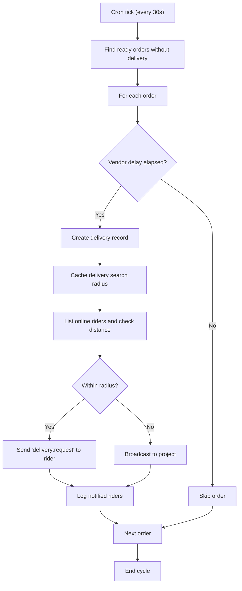

**Diagram sources**
- [auto-dispatch.job.js:18-94](file://apps/server/jobs/auto-dispatch.job.js#L18-L94)
- [geo.js:3-11](file://apps/server/lib/geo.js#L3-L11)
- [ws-server.js:162-175](file://apps/server/websocket/ws-server.js#L162-L175)

**Section sources**
- [auto-dispatch.job.js:1-97](file://apps/server/jobs/auto-dispatch.job.js#L1-L97)
- [geo.js:1-15](file://apps/server/lib/geo.js#L1-L15)
- [ws-server.js:1-237](file://apps/server/websocket/ws-server.js#L1-L237)

### Delivery Status Tracking and Notifications
Status updates propagate via WebSocket and push notifications. Arrival triggers customer notifications and audit logging.

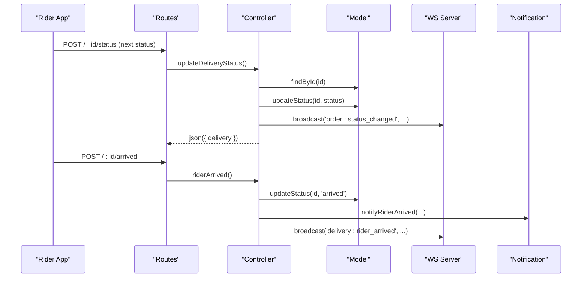

**Diagram sources**
- [delivery.routes.js:19-23](file://apps/server/routes/delivery.routes.js#L19-L23)
- [delivery.controller.js:54-181](file://apps/server/controllers/delivery.controller.js#L54-L181)
- [delivery.model.js:57-66](file://apps/server/models/delivery.model.js#L57-L66)
- [notification.service.js:122-135](file://apps/server/services/notification.service.js#L122-L135)
- [ws-server.js:162-175](file://apps/server/websocket/ws-server.js#L162-L175)

**Section sources**
- [delivery.controller.js:54-181](file://apps/server/controllers/delivery.controller.js#L54-L181)
- [notification.service.js:1-180](file://apps/server/services/notification.service.js#L1-L180)
- [ws-server.js:150-175](file://apps/server/websocket/ws-server.js#L150-L175)

### Location-Based Services and Real-Time Updates
Riders can update their availability and location. The system enforces rate limits and broadcasts updates to clients.

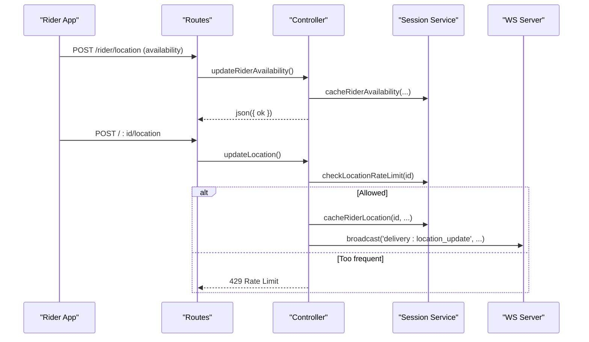

**Diagram sources**
- [delivery.routes.js:17-17](file://apps/server/routes/delivery.routes.js#L17-L17)
- [delivery.controller.js:116-142](file://apps/server/controllers/delivery.controller.js#L116-L142)
- [ws-server.js:162-175](file://apps/server/websocket/ws-server.js#L162-L175)

**Section sources**
- [delivery.controller.js:80-142](file://apps/server/controllers/delivery.controller.js#L80-L142)
- [ws-server.js:1-237](file://apps/server/websocket/ws-server.js#L1-L237)

### Delivery History and Performance Tracking
The history page lists completed deliveries with basic metadata. Performance statistics are currently placeholders and can be extended via analytics and metrics.

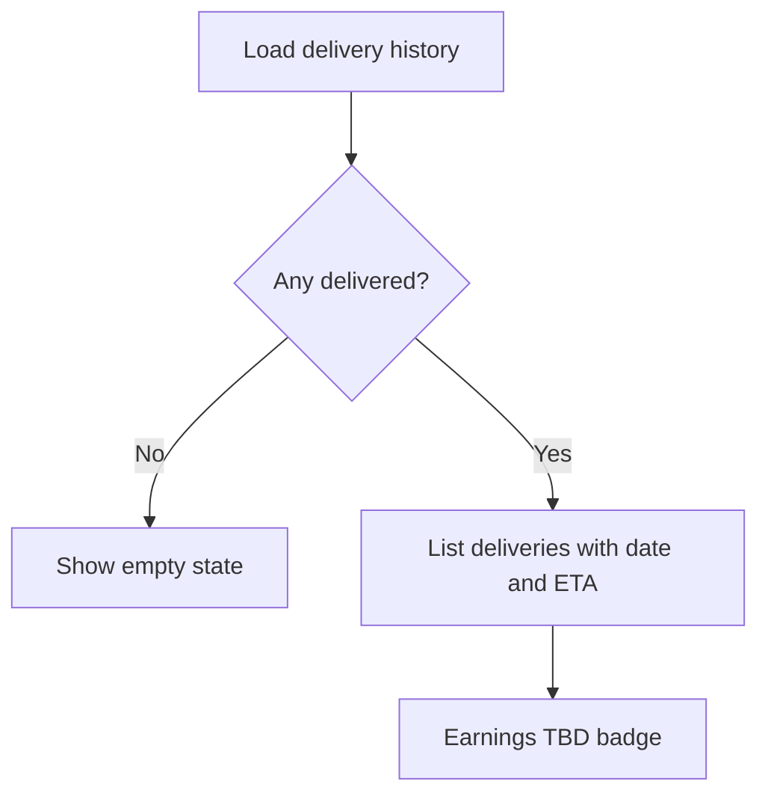

**Diagram sources**
- [page.tsx (Rider History)](file://apps/rider/src/app/(main)/history/page.tsx#L13-L63)

**Section sources**
- [page.tsx (Rider History)](file://apps/rider/src/app/(main)/history/page.tsx#L1-L64)

### Data Models and Types
Delivery statuses, order delivery linkage, and WebSocket event types define the domain contracts.

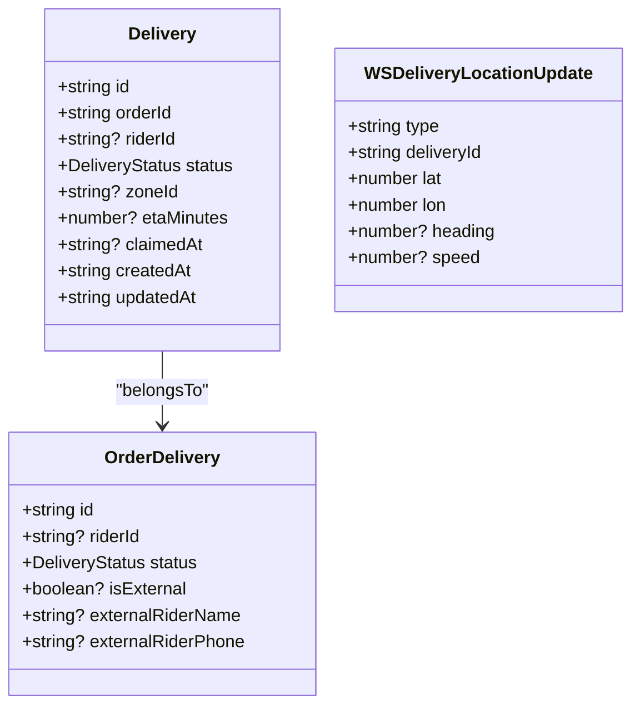

**Diagram sources**
- [types/index.ts:119-152](file://packages/types/src/index.ts#L119-L152)
- [types/index.ts:55-86](file://packages/types/src/index.ts#L55-L86)
- [types/index.ts:295-302](file://packages/types/src/index.ts#L295-L302)

**Section sources**
- [types/index.ts:119-152](file://packages/types/src/index.ts#L119-L152)
- [types/index.ts:55-86](file://packages/types/src/index.ts#L55-L86)
- [types/index.ts:295-302](file://packages/types/src/index.ts#L295-L302)

### Mobile Delivery Utilities
Mobile normalization converts backend snake_case responses into typed Delivery objects for consistent consumption.

**Section sources**
- [delivery-utils.ts:1-23](file://apps/rider-mobile/src/lib/delivery-utils.ts#L1-L23)

## Dependency Analysis
The system exhibits clear separation of concerns:
- Routes depend on controllers
- Controllers depend on models and services
- Models depend on Supabase helpers
- Jobs depend on models, geo utilities, and WS server
- Frontend depends on API client and types

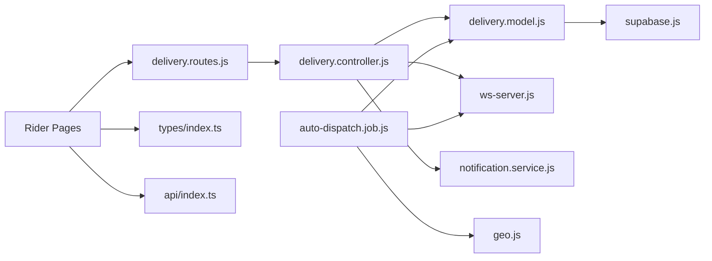

**Diagram sources**
- [delivery.routes.js:1-31](file://apps/server/routes/delivery.routes.js#L1-L31)
- [delivery.controller.js:1-313](file://apps/server/controllers/delivery.controller.js#L1-L313)
- [delivery.model.js:1-98](file://apps/server/models/delivery.model.js#L1-L98)
- [auto-dispatch.job.js:1-97](file://apps/server/jobs/auto-dispatch.job.js#L1-L97)
- [ws-server.js:1-237](file://apps/server/websocket/ws-server.js#L1-L237)
- [geo.js:1-15](file://apps/server/lib/geo.js#L1-L15)
- [supabase.js:1-151](file://apps/server/lib/supabase.js#L1-L151)
- [notification.service.js:1-180](file://apps/server/services/notification.service.js#L1-L180)
- [page.tsx (Rider Active)](file://apps/rider/src/app/(main)/active/page.tsx#L1-L235)
- [page.tsx (Rider History)](file://apps/rider/src/app/(main)/history/page.tsx#L1-L64)
- [types/index.ts:1-363](file://packages/types/src/index.ts#L1-L363)
- [api/index.ts:1-5](file://packages/api/src/index.ts#L1-L5)

**Section sources**
- [delivery.routes.js:1-31](file://apps/server/routes/delivery.routes.js#L1-L31)
- [delivery.controller.js:1-313](file://apps/server/controllers/delivery.controller.js#L1-L313)
- [delivery.model.js:1-98](file://apps/server/models/delivery.model.js#L1-L98)
- [auto-dispatch.job.js:1-97](file://apps/server/jobs/auto-dispatch.job.js#L1-L97)
- [ws-server.js:1-237](file://apps/server/websocket/ws-server.js#L1-L237)
- [geo.js:1-15](file://apps/server/lib/geo.js#L1-L15)
- [supabase.js:1-151](file://apps/server/lib/supabase.js#L1-L151)
- [notification.service.js:1-180](file://apps/server/services/notification.service.js#L1-L180)
- [page.tsx (Rider Active)](file://apps/rider/src/app/(main)/active/page.tsx#L1-L235)
- [page.tsx (Rider History)](file://apps/rider/src/app/(main)/history/page.tsx#L1-L64)
- [types/index.ts:1-363](file://packages/types/src/index.ts#L1-L363)
- [api/index.ts:1-5](file://packages/api/src/index.ts#L1-L5)

## Performance Considerations
- Rate limiting for location updates prevents excessive writes and network traffic
- WebSocket broadcasting is scoped to project references to minimize overhead
- Auto-dispatch runs on a tight schedule but uses locks to avoid contention
- Queries for active deliveries are optimized with refetch intervals
- Consider adding database indexes for delivery status and rider_id for faster filtering

[No sources needed since this section provides general guidance]

## Troubleshooting Guide
Common issues and remedies:
- Access denied when updating another rider’s delivery: verify user role and ownership checks
- Claim race condition: optimistic locking ensures only one rider claims a delivery
- Location update throttled: enforce minimum intervals to avoid 429 responses
- No deliveries available: confirm vendor settings radius and online riders with location reporting
- Notifications not received: verify push tokens and notification service configuration

**Section sources**
- [delivery.controller.js:61-63](file://apps/server/controllers/delivery.controller.js#L61-L63)
- [delivery.controller.js:92-95](file://apps/server/controllers/delivery.controller.js#L92-L95)
- [auto-dispatch.job.js:44-77](file://apps/server/jobs/auto-dispatch.job.js#L44-L77)
- [notification.service.js:11-22](file://apps/server/services/notification.service.js#L11-L22)

## Conclusion
The delivery management system provides a robust foundation for managing active deliveries, optimizing dispatch, and enabling real-time collaboration between riders and customers. The modular design supports scalability, while WebSocket and notification services ensure timely updates. Extending mapping and turn-by-turn navigation would integrate seamlessly with the existing location pipeline.

[No sources needed since this section summarizes without analyzing specific files]

## Appendices

### Delivery Lifecycle and Status Transitions
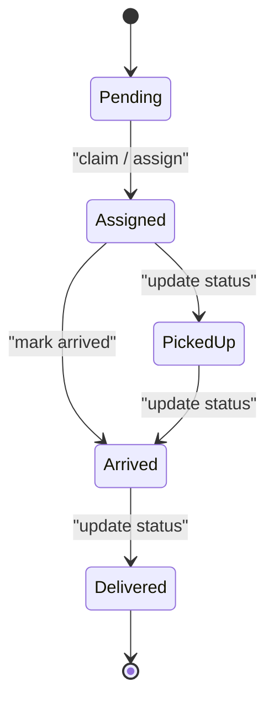

**Diagram sources**
- [delivery.model.js:7-7](file://apps/server/models/delivery.model.js#L7-L7)
- [delivery.controller.js:54-78](file://apps/server/controllers/delivery.controller.js#L54-L78)

### Database Schema Notes
- Delivery status defaults to pending
- Ratings and tips tables support performance and feedback tracking
- Vendor settings include delivery mode and radius

**Section sources**
- [009_order_lifecycle.sql:11-46](file://apps/server/migrations/009_order_lifecycle.sql#L11-L46)