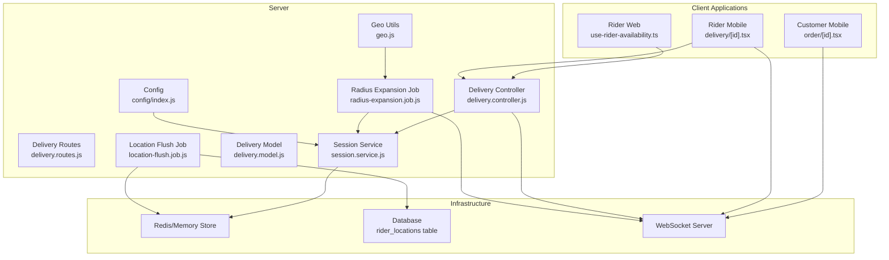
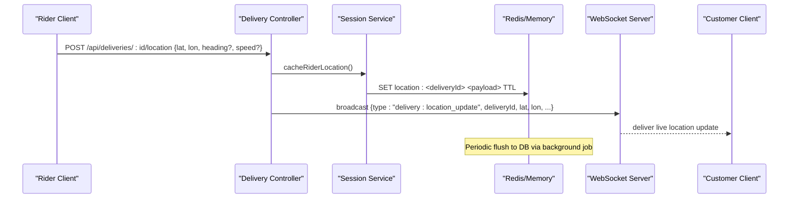
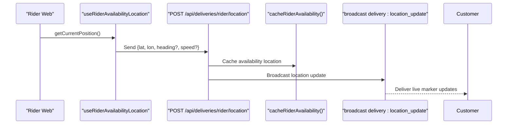
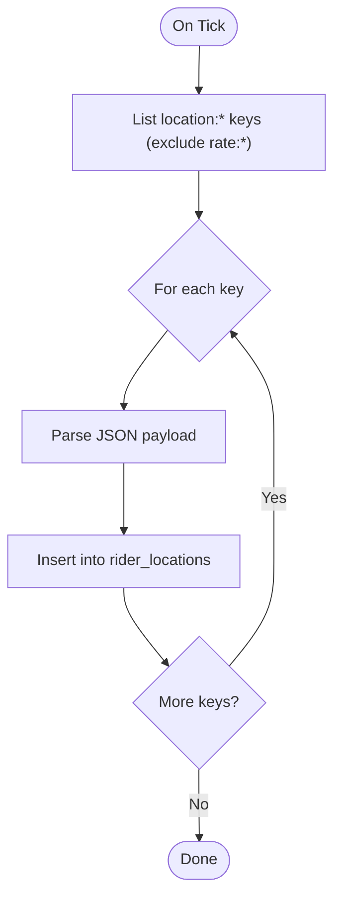
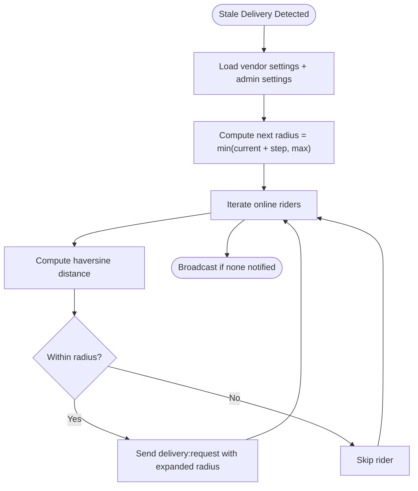
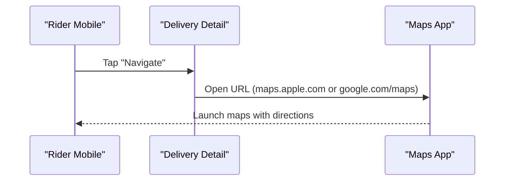
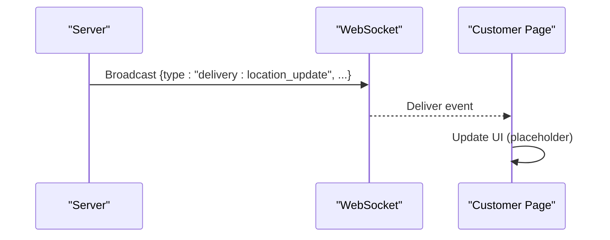
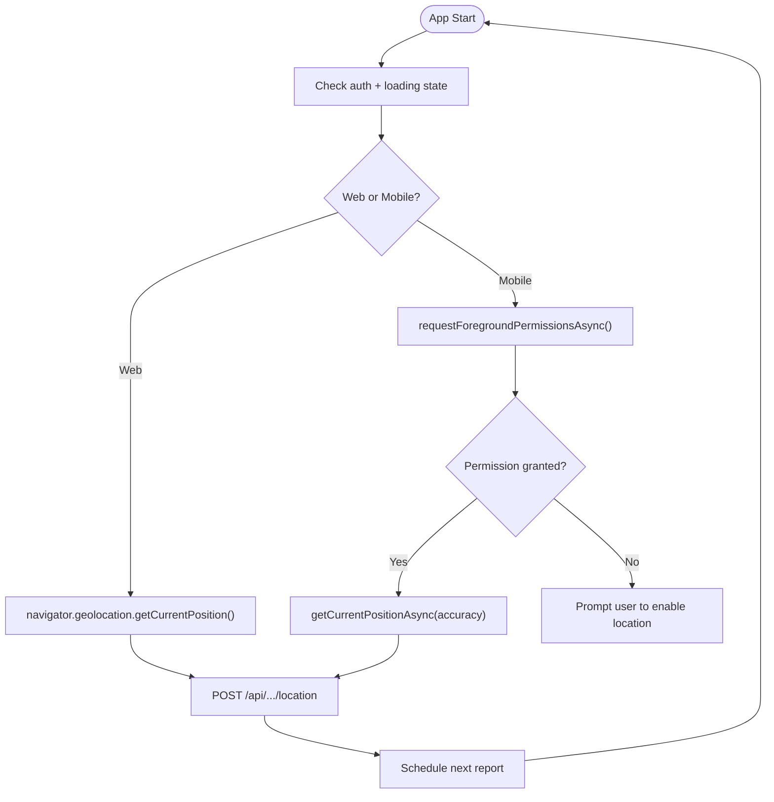
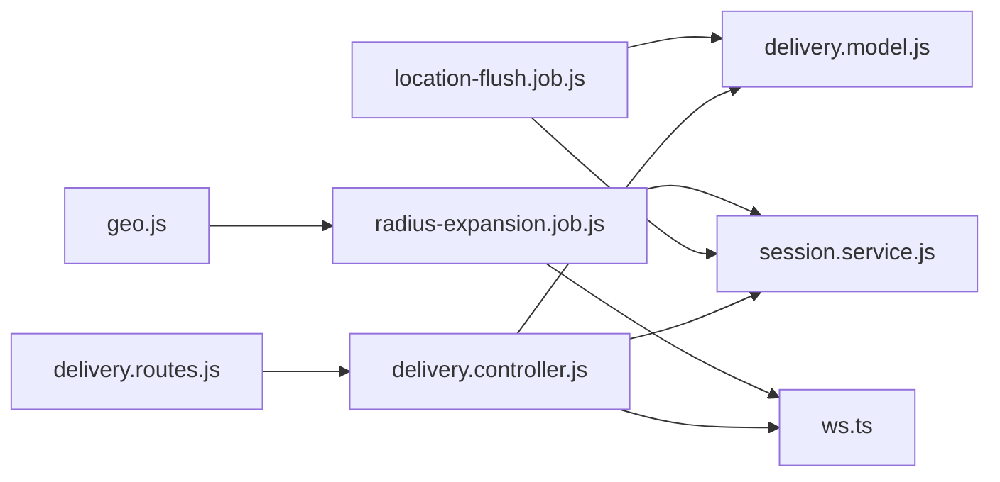

# Navigation & Location Services

<cite>
**Referenced Files in This Document**
- [delivery.controller.js](file://apps/server/controllers/delivery.controller.js)
- [delivery.routes.js](file://apps/server/routes/delivery.routes.js)
- [session.service.js](file://apps/server/services/session.service.js)
- [location-flush.job.js](file://apps/server/jobs/location-flush.job.js)
- [radius-expansion.job.js](file://apps/server/jobs/radius-expansion.job.js)
- [geo.js](file://apps/server/lib/geo.js)
- [delivery.model.js](file://apps/server/models/delivery.model.js)
- [index.js](file://apps/server/config/index.js)
- [backend-architecture.md](file://docs/backend-architecture.md)
- [delivio-production-gameplan.md](file://docs/delivio-production-gameplan.md)
- [use-rider-availability.ts](file://apps/rider/src/hooks/use-rider-availability.ts)
- [use-rider-availability.ts](file://apps/rider-mobile/src/lib/use-rider-availability.ts)
- [active.tsx](file://apps/rider-mobile/src/app/(tabs)/active.tsx)
- [delivery/[id].tsx](file://apps/rider-mobile/src/app/delivery/[id].tsx)
- [order/[id].tsx](file://apps/customer-mobile/src/app/order/[id].tsx)
- [page.tsx](file://apps/customer/src/app/(main)/orders/[id]/page.tsx)
- [ws.ts](file://packages/api/src/ws.ts)
- [types/index.ts](file://packages/types/src/index.ts)
</cite>

## Table of Contents
1. [Introduction](#introduction)
2. [Project Structure](#project-structure)
3. [Core Components](#core-components)
4. [Architecture Overview](#architecture-overview)
5. [Detailed Component Analysis](#detailed-component-analysis)
6. [Dependency Analysis](#dependency-analysis)
7. [Performance Considerations](#performance-considerations)
8. [Troubleshooting Guide](#troubleshooting-guide)
9. [Conclusion](#conclusion)

## Introduction
This document explains the navigation and location services integration across the platform. It covers:
- Real-time rider location tracking and broadcast to customers
- Turn-by-turn navigation integration via map links
- Route optimization and traffic-aware navigation considerations
- Location-based services, geofencing, and proximity alerts
- Real-time location updates, visibility controls, and permission handling
- Offline navigation capabilities and location accuracy management

The system combines client-side location reporting, server-side caching and rate limiting, periodic batch writes to the database, and WebSocket broadcasts to keep customers informed of delivery progress.

## Project Structure
The navigation and location services span client applications (web and mobile), server-side controllers and services, background jobs, and shared types.

**Diagram sources**
- [delivery.controller.js:81-118](file://apps/server/controllers/delivery.controller.js#L81-L118)
- [delivery.routes.js:14-28](file://apps/server/routes/delivery.routes.js#L14-L28)
- [session.service.js:108-153](file://apps/server/services/session.service.js#L108-L153)
- [geo.js:3-11](file://apps/server/lib/geo.js#L3-L11)
- [delivery.model.js:83-94](file://apps/server/models/delivery.model.js#L83-L94)
- [location-flush.job.js:1-59](file://apps/server/jobs/location-flush.job.js#L1-L59)
- [radius-expansion.job.js:29-86](file://apps/server/jobs/radius-expansion.job.js#L29-L86)
- [index.js:109-113](file://apps/server/config/index.js#L109-L113)

**Section sources**
- [delivery.controller.js:81-118](file://apps/server/controllers/delivery.controller.js#L81-L118)
- [delivery.routes.js:14-28](file://apps/server/routes/delivery.routes.js#L14-L28)
- [session.service.js:108-153](file://apps/server/services/session.service.js#L108-L153)
- [geo.js:3-11](file://apps/server/lib/geo.js#L3-L11)
- [delivery.model.js:83-94](file://apps/server/models/delivery.model.js#L83-L94)
- [location-flush.job.js:1-59](file://apps/server/jobs/location-flush.job.js#L1-L59)
- [radius-expansion.job.js:29-86](file://apps/server/jobs/radius-expansion.job.js#L29-L86)
- [index.js:109-113](file://apps/server/config/index.js#L109-L113)

## Core Components
- Location Reporting and Broadcasting
  - Clients periodically report location to the server endpoint for rider availability and active deliveries.
  - The server caches the latest location, enforces rate limits, and broadcasts updates via WebSocket to relevant clients.
- Session and Caching Layer
  - Redis or in-memory store holds recent rider positions and rate-limit keys.
  - Background job flushes cached positions to the database at intervals.
- Dispatch and Radius Expansion
  - When deliveries are stuck, the system expands the search radius and notifies nearby riders.
- Navigation Integration
  - Mobile screens provide “Navigate to” actions that open native maps with destination coordinates.
- Types and WebSocket Protocol
  - Shared types define the WebSocket message schema for live location updates.

**Section sources**
- [delivery.controller.js:81-118](file://apps/server/controllers/delivery.controller.js#L81-L118)
- [session.service.js:108-153](file://apps/server/services/session.service.js#L108-L153)
- [location-flush.job.js:1-59](file://apps/server/jobs/location-flush.job.js#L1-L59)
- [radius-expansion.job.js:29-86](file://apps/server/jobs/radius-expansion.job.js#L29-L86)
- [delivery/[id].tsx](file://apps/rider-mobile/src/app/delivery/[id].tsx#L275-L346)
- [order/[id].tsx](file://apps/customer-mobile/src/app/order/[id].tsx#L275-L346)
- [types/index.ts:295-302](file://packages/types/src/index.ts#L295-L302)

## Architecture Overview
The navigation and location pipeline integrates client-side location reporting, server-side caching and broadcasting, and background persistence.

**Diagram sources**
- [delivery.controller.js:81-118](file://apps/server/controllers/delivery.controller.js#L81-L118)
- [session.service.js:110-116](file://apps/server/services/session.service.js#L110-L116)
- [location-flush.job.js:13-59](file://apps/server/jobs/location-flush.job.js#L13-L59)
- [backend-architecture.md:494-501](file://docs/backend-architecture.md#L494-L501)

**Section sources**
- [delivery.controller.js:81-118](file://apps/server/controllers/delivery.controller.js#L81-L118)
- [session.service.js:110-116](file://apps/server/services/session.service.js#L110-L116)
- [location-flush.job.js:13-59](file://apps/server/jobs/location-flush.job.js#L13-L59)
- [backend-architecture.md:494-501](file://docs/backend-architecture.md#L494-L501)

## Detailed Component Analysis

### Real-Time Location Tracking and Broadcasting
- Endpoint: POST /api/deliveries/:id/location
- Responsibilities:
  - Validate requester role and ownership
  - Enforce rate limit per delivery
  - Cache latest location in session store
  - Broadcast delivery:location_update via WebSocket
- Client behavior:
  - Rider web: useRiderAvailabilityLocation reports position periodically with high accuracy.
  - Rider mobile: useRiderAvailabilityLocation requests permissions and reports position at configured intervals.

**Diagram sources**
- [use-rider-availability.ts:18-42](file://apps/rider/src/hooks/use-rider-availability.ts#L18-L42)
- [delivery.controller.js:116-118](file://apps/server/controllers/delivery.controller.js#L116-L118)
- [session.service.js:134-140](file://apps/server/services/session.service.js#L134-L140)

**Section sources**
- [delivery.controller.js:81-118](file://apps/server/controllers/delivery.controller.js#L81-L118)
- [use-rider-availability.ts:18-42](file://apps/rider/src/hooks/use-rider-availability.ts#L18-L42)
- [use-rider-availability.ts:23-40](file://apps/rider-mobile/src/lib/use-rider-availability.ts#L23-L40)
- [session.service.js:124-130](file://apps/server/services/session.service.js#L124-L130)

### Background Persistence and Rate Limiting
- Rate Limit:
  - One location update per delivery every N seconds (configured).
- Cache TTL:
  - Latest location retained for M seconds before flush.
- Flush Job:
  - Every 30 seconds, background job reads cached entries and inserts into rider_locations audit table.
- Config:
  - updateIntervalSeconds, cacheTTL, flushIntervalSeconds.

**Diagram sources**
- [location-flush.job.js:22-59](file://apps/server/jobs/location-flush.job.js#L22-L59)
- [session.service.js:110-120](file://apps/server/services/session.service.js#L110-L120)
- [delivery.model.js:83-94](file://apps/server/models/delivery.model.js#L83-L94)
- [index.js:109-113](file://apps/server/config/index.js#L109-L113)

**Section sources**
- [location-flush.job.js:1-59](file://apps/server/jobs/location-flush.job.js#L1-L59)
- [session.service.js:110-130](file://apps/server/services/session.service.js#L110-L130)
- [delivery.model.js:83-94](file://apps/server/models/delivery.model.js#L83-L94)
- [index.js:109-113](file://apps/server/config/index.js#L109-L113)

### Dispatch Radius Expansion and Proximity Alerts
- When a delivery remains pending for too long, the system expands the search radius and notifies nearby riders.
- Distance calculation uses the haversine formula.

**Diagram sources**
- [radius-expansion.job.js:29-86](file://apps/server/jobs/radius-expansion.job.js#L29-L86)
- [geo.js:3-11](file://apps/server/lib/geo.js#L3-L11)

**Section sources**
- [radius-expansion.job.js:29-86](file://apps/server/jobs/radius-expansion.job.js#L29-L86)
- [geo.js:3-11](file://apps/server/lib/geo.js#L3-L11)

### Navigation Integration (Turn-by-Turn)
- Rider Mobile:
  - Delivery detail screen exposes “Navigate to Pickup” and “Navigate to Customer” actions that open native maps with the destination address.
- Customer Mobile:
  - Order detail screen supports similar navigation actions to the restaurant or customer address.
- Implementation:
  - Uses platform-specific URLs (Apple Maps or Google Maps) with encoded destination.

**Diagram sources**
- [delivery/[id].tsx](file://apps/rider-mobile/src/app/delivery/[id].tsx#L275-L346)
- [order/[id].tsx](file://apps/customer-mobile/src/app/order/[id].tsx#L275-L346)

**Section sources**
- [delivery/[id].tsx](file://apps/rider-mobile/src/app/delivery/[id].tsx#L275-L346)
- [order/[id].tsx](file://apps/customer-mobile/src/app/order/[id].tsx#L275-L346)

### Customer Visibility and Location Sharing Controls
- WebSocket Events:
  - delivery:location_update is broadcast to relevant clients.
- Client Pages:
  - Customer order page subscribes to delivery:location_update events (placeholder for future map marker updates).
- Visibility:
  - Current implementation does not expose explicit visibility toggles; location sharing is implicit during active deliveries.

**Diagram sources**
- [backend-architecture.md:494-501](file://docs/backend-architecture.md#L494-L501)
- [page.tsx](file://apps/customer/src/app/(main)/orders/[id]/page.tsx#L176-L178)
- [types/index.ts:295-302](file://packages/types/src/index.ts#L295-L302)

**Section sources**
- [backend-architecture.md:494-501](file://docs/backend-architecture.md#L494-L501)
- [page.tsx](file://apps/customer/src/app/(main)/orders/[id]/page.tsx#L176-L178)
- [types/index.ts:295-302](file://packages/types/src/index.ts#L295-L302)

### Location Accuracy Management and Permission Handling
- Rider Web:
  - Uses browser Geolocation with high accuracy and reasonable timeouts.
  - Periodic reporting every N seconds while authenticated.
- Rider Mobile:
  - Requests foreground location permission before sending updates.
  - Adjusts accuracy based on mode (“active” vs “background”) and intervals accordingly.
- Customer Mobile:
  - Navigation uses device maps; permissions handled by OS.

**Diagram sources**
- [use-rider-availability.ts:18-42](file://apps/rider/src/hooks/use-rider-availability.ts#L18-L42)
- [use-rider-availability.ts:14-43](file://apps/rider-mobile/src/lib/use-rider-availability.ts#L14-L43)
- [active.tsx](file://apps/rider-mobile/src/app/(tabs)/active.tsx#L244-L250)

**Section sources**
- [use-rider-availability.ts:18-42](file://apps/rider/src/hooks/use-rider-availability.ts#L18-L42)
- [use-rider-availability.ts:14-43](file://apps/rider-mobile/src/lib/use-rider-availability.ts#L14-L43)
- [active.tsx](file://apps/rider-mobile/src/app/(tabs)/active.tsx#L244-L250)

## Dependency Analysis
- Controllers depend on:
  - Session service for caching and rate limiting
  - WebSocket server for broadcasting
  - Delivery model for database logging
- Jobs depend on:
  - Redis/mem store for cache reads
  - Delivery model for batch inserts
- Clients depend on:
  - API endpoints for location reporting
  - WebSocket client for live updates
  - Native maps for turn-by-turn navigation

**Diagram sources**
- [delivery.routes.js:14-28](file://apps/server/routes/delivery.routes.js#L14-L28)
- [delivery.controller.js:81-118](file://apps/server/controllers/delivery.controller.js#L81-L118)
- [session.service.js:108-153](file://apps/server/services/session.service.js#L108-L153)
- [delivery.model.js:83-94](file://apps/server/models/delivery.model.js#L83-L94)
- [location-flush.job.js:1-59](file://apps/server/jobs/location-flush.job.js#L1-L59)
- [radius-expansion.job.js:29-86](file://apps/server/jobs/radius-expansion.job.js#L29-L86)
- [geo.js:3-11](file://apps/server/lib/geo.js#L3-L11)
- [ws.ts:17-50](file://packages/api/src/ws.ts#L17-L50)

**Section sources**
- [delivery.routes.js:14-28](file://apps/server/routes/delivery.routes.js#L14-L28)
- [delivery.controller.js:81-118](file://apps/server/controllers/delivery.controller.js#L81-L118)
- [session.service.js:108-153](file://apps/server/services/session.service.js#L108-L153)
- [delivery.model.js:83-94](file://apps/server/models/delivery.model.js#L83-L94)
- [location-flush.job.js:1-59](file://apps/server/jobs/location-flush.job.js#L1-L59)
- [radius-expansion.job.js:29-86](file://apps/server/jobs/radius-expansion.job.js#L29-L86)
- [geo.js:3-11](file://apps/server/lib/geo.js#L3-L11)
- [ws.ts:17-50](file://packages/api/src/ws.ts#L17-L50)

## Performance Considerations
- Rate Limiting
  - Enforced per delivery to prevent spam and reduce network/database load.
- Caching and Batch Writes
  - Recent locations cached in Redis with TTL; flushed to DB every 30 seconds to minimize write amplification.
- Accuracy vs Battery
  - Mobile clients adjust accuracy and intervals based on mode to balance responsiveness and power consumption.
- Dispatch Efficiency
  - Radius expansion prevents immediate broadcast storms by expanding coverage gradually.

[No sources needed since this section provides general guidance]

## Troubleshooting Guide
- Too Many Location Updates
  - Symptom: 429 response from POST /api/deliveries/:id/location.
  - Cause: Exceeded rate limit (one update per configured interval).
  - Resolution: Reduce reporting frequency or increase interval in configuration.
- No Live Location Updates
  - Symptom: Customer does not see moving marker.
  - Causes:
    - Client not authenticated or permission denied
    - WebSocket disconnected or heartbeat lost
    - No broadcast due to missing delivery:location_update trigger
  - Resolutions:
    - Verify client authentication and location permissions
    - Confirm WebSocket connection and reconnection logic
    - Ensure controller broadcasts the event and job flush persists data
- Stuck Deliveries Not Assigned
  - Symptom: Delivery remains pending despite no nearby riders.
  - Cause: Search radius too small or no eligible riders online.
  - Resolution: Allow radius expansion job to increase radius and notify riders.

**Section sources**
- [delivery.controller.js:92-95](file://apps/server/controllers/delivery.controller.js#L92-L95)
- [session.service.js:124-130](file://apps/server/services/session.service.js#L124-L130)
- [location-flush.job.js:13-59](file://apps/server/jobs/location-flush.job.js#L13-L59)
- [radius-expansion.job.js:29-86](file://apps/server/jobs/radius-expansion.job.js#L29-L86)
- [ws.ts:17-50](file://packages/api/src/ws.ts#L17-L50)

## Conclusion
The navigation and location services integrate client-side location reporting, robust server-side caching and rate limiting, background persistence, and WebSocket-driven live updates. Turn-by-turn navigation is supported via native maps integrations on mobile platforms. The system’s design balances real-time responsiveness with performance and battery efficiency, while providing mechanisms to expand dispatch reach when needed.