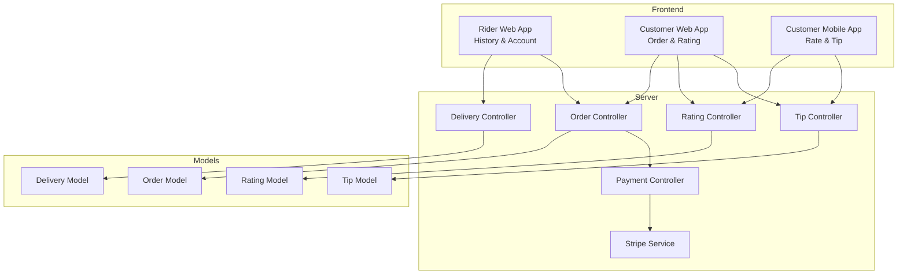
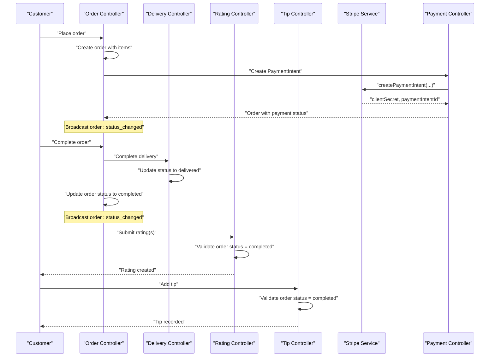
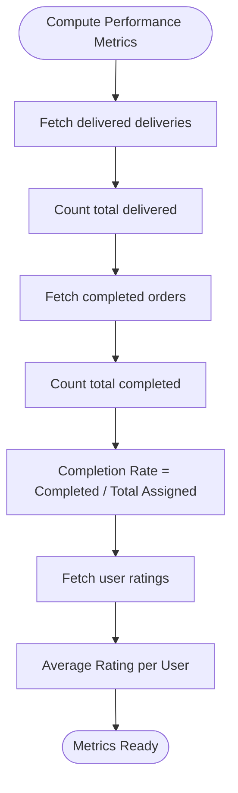
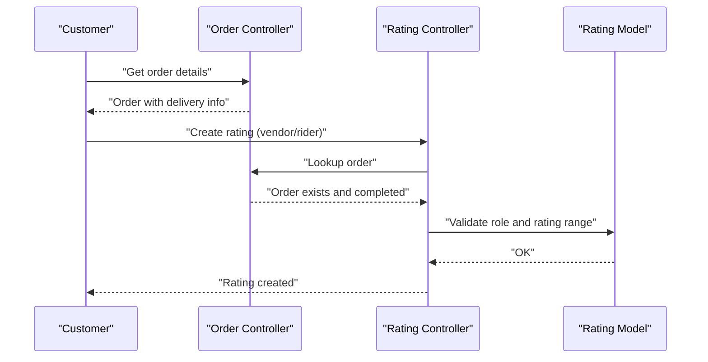
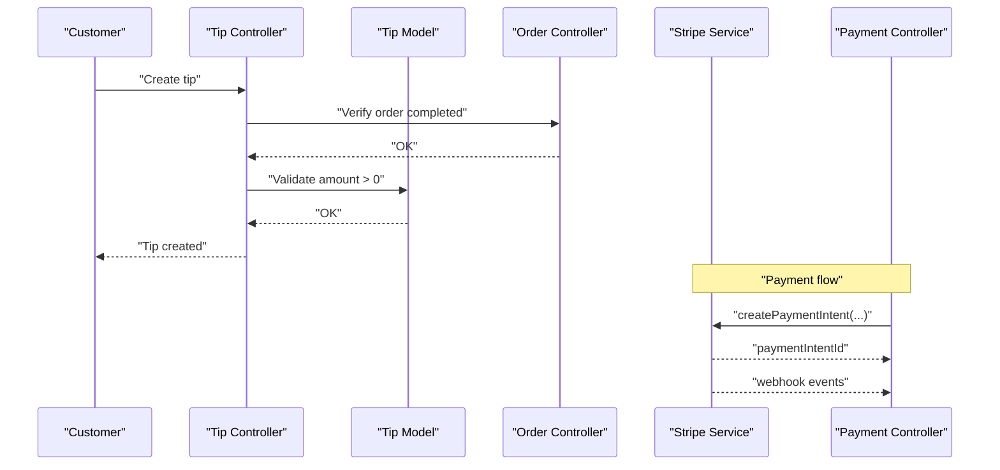
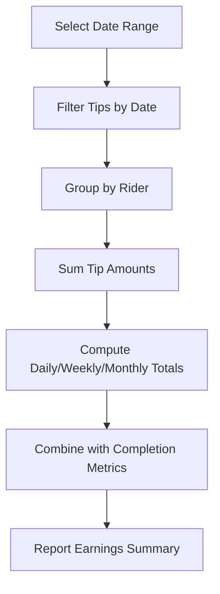
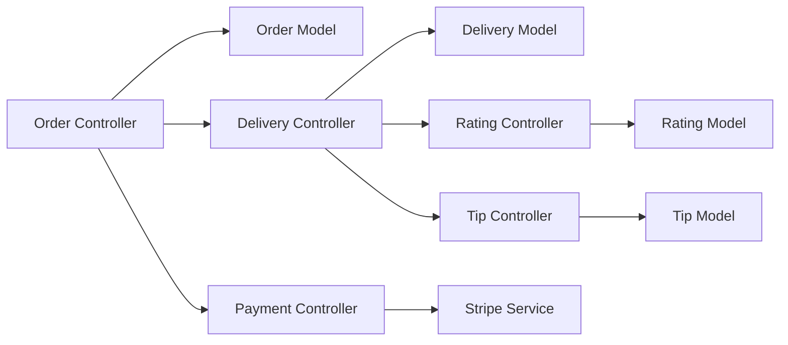

# Performance Metrics & Earnings

<cite>
**Referenced Files in This Document**
- [account.page.tsx](file://apps/rider/src/app/(main)/account/page.tsx)
- [history.page.tsx](file://apps/rider/src/app/(main)/history/page.tsx)
- [rating.controller.js](file://apps/server/controllers/rating.controller.js)
- [rating.model.js](file://apps/server/models/rating.model.js)
- [tip.controller.js](file://apps/server/controllers/tip.controller.js)
- [tip.model.js](file://apps/server/models/tip.model.js)
- [tip.validator.js](file://apps/server/validators/tip.validator.js)
- [tip.routes.js](file://apps/server/routes/tip.routes.js)
- [order.controller.js](file://apps/server/controllers/order.controller.js)
- [order.model.js](file://apps/server/models/order.model.js)
- [delivery.controller.js](file://apps/server/controllers/delivery.controller.js)
- [delivery.model.js](file://apps/server/models/delivery.model.js)
- [stripe.service.js](file://apps/server/services/stripe.service.js)
- [payment.controller.js](file://apps/server/controllers/payment.controller.js)
- [payment.routes.js](file://apps/server/routes/payment.routes.js)
- [page.tsx](file://apps/customer/src/app/(main)/orders/[id]/page.tsx)
- [page.tsx](file://apps/customer-mobile/src/app/rate/[id].tsx)
- [SETUP.md](file://docs/SETUP.md)
- [backend-architecture.md](file://docs/backend-architecture.md)
- [Delivio-Backend.postman_collection.json](file://docs/Delivio-Backend.postman_collection.json)
</cite>

## Table of Contents
1. [Introduction](#introduction)
2. [Project Structure](#project-structure)
3. [Core Components](#core-components)
4. [Architecture Overview](#architecture-overview)
5. [Detailed Component Analysis](#detailed-component-analysis)
6. [Dependency Analysis](#dependency-analysis)
7. [Performance Considerations](#performance-considerations)
8. [Troubleshooting Guide](#troubleshooting-guide)
9. [Conclusion](#conclusion)
10. [Appendices](#appendices)

## Introduction
This document describes the performance metrics and earnings tracking system in the platform. It covers:
- Earnings dashboard: daily/weekly/monthly income, commission calculations, and payout summaries
- Performance analytics: delivery counts, completion rates, and rating metrics
- Rating system integration and customer feedback collection
- Payout management, withdrawal procedures, and earnings history tracking
- Examples of performance reporting, earnings calculation workflows, and rating improvement strategies
- Integration with the order management system for accurate performance tracking and commission calculations

Where applicable, we map features to concrete source files and highlight how the backend enforces constraints and how the frontend surfaces data.

## Project Structure
The performance and earnings system spans the server-side controllers, models, and validators, and integrates with the frontend applications for riders, customers, and mobile clients. The database schema defines the foundational entities for orders, deliveries, ratings, and tips.

**Diagram sources**
- [order.controller.js:1-513](file://apps/server/controllers/order.controller.js#L1-L513)
- [delivery.controller.js:1-313](file://apps/server/controllers/delivery.controller.js#L1-L313)
- [rating.controller.js:1-57](file://apps/server/controllers/rating.controller.js#L1-L57)
- [tip.controller.js:1-42](file://apps/server/controllers/tip.controller.js#L1-L42)
- [stripe.service.js:1-83](file://apps/server/services/stripe.service.js#L1-L83)
- [payment.controller.js:70-108](file://apps/server/controllers/payment.controller.js#L70-L108)
- [order.model.js:1-178](file://apps/server/models/order.model.js#L1-L178)
- [delivery.model.js:1-98](file://apps/server/models/delivery.model.js#L1-L98)
- [rating.model.js:1-58](file://apps/server/models/rating.model.js#L1-L58)
- [tip.model.js:1-43](file://apps/server/models/tip.model.js#L1-L43)

**Section sources**
- [backend-architecture.md:232-313](file://docs/backend-architecture.md#L232-L313)
- [SETUP.md:127-246](file://docs/SETUP.md#L127-L246)

## Core Components
- Order lifecycle and status transitions drive performance tracking and eligibility for earnings (e.g., completion).
- Delivery records track assignment, arrival, and delivery events used to compute completion metrics.
- Ratings capture customer feedback for vendors and riders, enabling rating-based analytics.
- Tips represent optional customer-provided earnings additions; totals are aggregated per rider.
- Stripe integration manages payments and refunds; webhook processing updates order/payment state.

Key implementation anchors:
- Order controller/model define statuses, transitions, and completion logic.
- Delivery controller/model manage delivery lifecycle and location updates.
- Rating controller/model enforce constraints and compute averages.
- Tip controller/model validate and aggregate tips.
- Stripe service and payment controller integrate payment events.

**Section sources**
- [order.controller.js:140-452](file://apps/server/controllers/order.controller.js#L140-L452)
- [order.model.js:12-178](file://apps/server/models/order.model.js#L12-L178)
- [delivery.controller.js:10-181](file://apps/server/controllers/delivery.controller.js#L10-L181)
- [delivery.model.js:9-98](file://apps/server/models/delivery.model.js#L9-L98)
- [rating.controller.js:8-55](file://apps/server/controllers/rating.controller.js#L8-L55)
- [rating.model.js:9-58](file://apps/server/models/rating.model.js#L9-L58)
- [tip.controller.js:8-40](file://apps/server/controllers/tip.controller.js#L8-L40)
- [tip.model.js:7-43](file://apps/server/models/tip.model.js#L7-L43)
- [stripe.service.js:19-80](file://apps/server/services/stripe.service.js#L19-L80)
- [payment.controller.js:70-108](file://apps/server/controllers/payment.controller.js#L70-L108)

## Architecture Overview
The system orchestrates order and delivery lifecycles, captures ratings and tips, and integrates with Stripe for payment outcomes. Real-time updates are broadcast via WebSocket for visibility.

**Diagram sources**
- [order.controller.js:84-138](file://apps/server/controllers/order.controller.js#L84-L138)
- [order.controller.js:400-452](file://apps/server/controllers/order.controller.js#L400-L452)
- [delivery.controller.js:146-181](file://apps/server/controllers/delivery.controller.js#L146-L181)
- [rating.controller.js:8-32](file://apps/server/controllers/rating.controller.js#L8-L32)
- [tip.controller.js:8-30](file://apps/server/controllers/tip.controller.js#L8-L30)
- [stripe.service.js:19-43](file://apps/server/services/stripe.service.js#L19-L43)
- [payment.controller.js:70-108](file://apps/server/controllers/payment.controller.js#L70-L108)

## Detailed Component Analysis

### Earnings Dashboard and Payout Summaries
- Rider history displays past deliveries with placeholders for earnings; completion status is shown but earnings amounts are currently marked as “TBD”.
- Rider account page shows profile and role; earnings summary is minimal (tips total and average rating are surfaced in mobile).
- Tips are aggregated per rider and exposed via a dedicated endpoint.

Implementation highlights:
- History page renders delivery cards with completion badges and dates.
- Tip aggregation by rider supports total earnings computation.

**Section sources**
- [history.page.tsx](file://apps/rider/src/app/(main)/history/page.tsx#L34-L60)
- [account.page.tsx](file://apps/rider/src/app/(main)/account/page.tsx#L40-L78)
- [tip.controller.js:32-40](file://apps/server/controllers/tip.controller.js#L32-L40)
- [tip.model.js:34-41](file://apps/server/models/tip.model.js#L34-L41)

### Performance Analytics: Delivery Counts, Completion Rates, and Rating Metrics
- Delivery counts and completion rates are derived from delivery status and order completion:
  - Deliveries with status “delivered” indicate completions.
  - Orders with status “completed” reflect successful deliveries.
- Rating metrics include per-user averages computed from stored ratings.

**Diagram sources**
- [delivery.controller.js:19-27](file://apps/server/controllers/delivery.controller.js#L19-L27)
- [order.controller.js:400-452](file://apps/server/controllers/order.controller.js#L400-L452)
- [rating.model.js:48-55](file://apps/server/models/rating.model.js#L48-L55)

**Section sources**
- [delivery.controller.js:19-27](file://apps/server/controllers/delivery.controller.js#L19-L27)
- [order.controller.js:400-452](file://apps/server/controllers/order.controller.js#L400-L452)
- [rating.model.js:48-55](file://apps/server/models/rating.model.js#L48-L55)

### Rating System Integration and Feedback Collection
- Ratings can be submitted against orders after completion; validation ensures the order is completed and the target role is valid.
- Customer-facing flows in both web and mobile apps collect vendor and rider ratings and optional comments during the post-delivery experience.

**Diagram sources**
- [order.controller.js:50-82](file://apps/server/controllers/order.controller.js#L50-L82)
- [rating.controller.js:8-32](file://apps/server/controllers/rating.controller.js#L8-L32)
- [rating.model.js:14-32](file://apps/server/models/rating.model.js#L14-L32)

**Section sources**
- [rating.controller.js:8-55](file://apps/server/controllers/rating.controller.js#L8-L55)
- [rating.model.js:9-58](file://apps/server/models/rating.model.js#L9-L58)
- [page.tsx](file://apps/customer/src/app/(main)/orders/[id]/page.tsx#L191-L231)
- [page.tsx:37-81](file://apps/customer-mobile/src/app/rate/[id].tsx#L37-L81)

### Payout Management and Withdrawals
- Tips are recorded against completed orders and aggregated per rider.
- The tip creation endpoint validates order status and amount constraints.
- Stripe PaymentIntents and webhooks manage payment outcomes; refunds are supported.

**Diagram sources**
- [tip.controller.js:8-30](file://apps/server/controllers/tip.controller.js#L8-L30)
- [tip.model.js:12-25](file://apps/server/models/tip.model.js#L12-L25)
- [order.controller.js:400-452](file://apps/server/controllers/order.controller.js#L400-L452)
- [stripe.service.js:19-80](file://apps/server/services/stripe.service.js#L19-L80)
- [payment.controller.js:70-108](file://apps/server/controllers/payment.controller.js#L70-L108)

**Section sources**
- [tip.controller.js:8-40](file://apps/server/controllers/tip.controller.js#L8-L40)
- [tip.model.js:12-41](file://apps/server/models/tip.model.js#L12-L41)
- [tip.validator.js:5-9](file://apps/server/validators/tip.validator.js#L5-L9)
- [tip.routes.js:11-12](file://apps/server/routes/tip.routes.js#L11-L12)
- [stripe.service.js:19-80](file://apps/server/services/stripe.service.js#L19-L80)
- [payment.controller.js:70-108](file://apps/server/controllers/payment.controller.js#L70-L108)
- [Delivio-Backend.postman_collection.json:631-666](file://docs/Delivio-Backend.postman_collection.json#L631-L666)

### Earnings Calculation Workflows
- Daily/Weekly/Monthly income can be derived by grouping tips by date and aggregating totals per rider.
- Completion-based earnings are inferred from delivered vs. assigned counts; tips augment gross earnings.
- Rating impact on earnings is implicit: higher ratings improve reputation and may influence demand and retention.

**Diagram sources**
- [tip.model.js:34-41](file://apps/server/models/tip.model.js#L34-L41)
- [delivery.controller.js:19-27](file://apps/server/controllers/delivery.controller.js#L19-L27)

**Section sources**
- [tip.model.js:34-41](file://apps/server/models/tip.model.js#L34-L41)
- [delivery.controller.js:19-27](file://apps/server/controllers/delivery.controller.js#L19-L27)

### Rating Improvement Strategies
- Encourage timely and accurate deliveries to increase completion rates.
- Monitor average ratings and address negative feedback promptly.
- Use rating trends to identify top performers and areas needing training.

[No sources needed since this section provides general guidance]

### Integration with Order Management System
- Order status transitions (e.g., accepted, preparing, ready, assigned, completed) directly affect eligibility for tips and ratings.
- Delivery status updates (assigned, arrived, delivered) are broadcast and used to finalize orders and trigger notifications.

**Section sources**
- [order.controller.js:140-191](file://apps/server/controllers/order.controller.js#L140-L191)
- [order.controller.js:400-452](file://apps/server/controllers/order.controller.js#L400-L452)
- [delivery.controller.js:54-78](file://apps/server/controllers/delivery.controller.js#L54-L78)
- [delivery.controller.js:146-181](file://apps/server/controllers/delivery.controller.js#L146-L181)

## Dependency Analysis
The following diagram shows key dependencies among controllers, models, and services involved in performance and earnings tracking.

**Diagram sources**
- [order.controller.js:1-513](file://apps/server/controllers/order.controller.js#L1-L513)
- [delivery.controller.js:1-313](file://apps/server/controllers/delivery.controller.js#L1-L313)
- [rating.controller.js:1-57](file://apps/server/controllers/rating.controller.js#L1-L57)
- [tip.controller.js:1-42](file://apps/server/controllers/tip.controller.js#L1-L42)
- [stripe.service.js:1-83](file://apps/server/services/stripe.service.js#L1-L83)

**Section sources**
- [order.controller.js:1-513](file://apps/server/controllers/order.controller.js#L1-L513)
- [delivery.controller.js:1-313](file://apps/server/controllers/delivery.controller.js#L1-L313)
- [rating.controller.js:1-57](file://apps/server/controllers/rating.controller.js#L1-L57)
- [tip.controller.js:1-42](file://apps/server/controllers/tip.controller.js#L1-L42)
- [stripe.service.js:1-83](file://apps/server/services/stripe.service.js#L1-L83)

## Performance Considerations
- Real-time updates: WebSocket broadcasts notify clients of order and delivery changes, reducing polling overhead.
- Rate limiting: Payment endpoints use rate limiting to prevent abuse.
- Location updates: Delivery location updates are rate-limited to reduce load.
- Aggregation: Tip totals and rating averages are computed via efficient queries to minimize CPU usage.

[No sources needed since this section provides general guidance]

## Troubleshooting Guide
Common issues and resolutions:
- Order not eligible for tip or rating: Ensure the order status is “completed.”
- Tip creation fails: Verify amount is a positive integer and the order is completed.
- Rating creation fails: Confirm the order exists, is completed, and the target role is valid.
- Payment webhook errors: Validate Stripe signature and ensure webhook secret is configured.

**Section sources**
- [tip.controller.js:13-17](file://apps/server/controllers/tip.controller.js#L13-L17)
- [tip.validator.js:5-9](file://apps/server/validators/tip.validator.js#L5-L9)
- [rating.controller.js:13-17](file://apps/server/controllers/rating.controller.js#L13-L17)
- [payment.routes.js:14-24](file://apps/server/routes/payment.routes.js#L14-L24)
- [stripe.service.js:74-80](file://apps/server/services/stripe.service.js#L74-L80)

## Conclusion
The platform’s performance and earnings system is built around robust order and delivery lifecycle management, validated rating and tip submissions, and integrated Stripe payments. While the rider history currently shows “Earnings TBD,” the underlying models and controllers support daily/weekly/monthly earnings computation and performance analytics. Enhancing the UI to surface aggregated tips and completion metrics will complete the dashboard experience.

[No sources needed since this section summarizes without analyzing specific files]

## Appendices

### Database Schema Highlights
- Core tables include app users, customers, orders, deliveries, products, categories, and workspaces.
- These tables underpin order lifecycle, delivery tracking, and rating storage.

**Section sources**
- [backend-architecture.md:232-313](file://docs/backend-architecture.md#L232-L313)
- [SETUP.md:127-246](file://docs/SETUP.md#L127-L246)