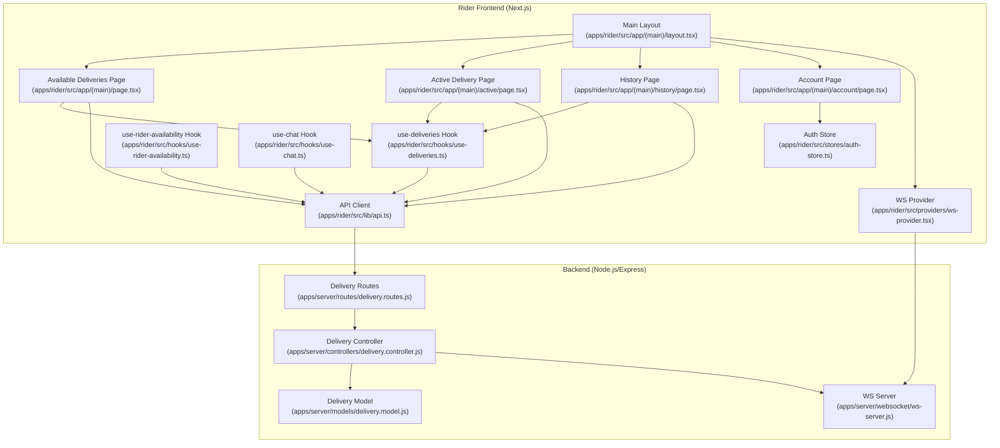
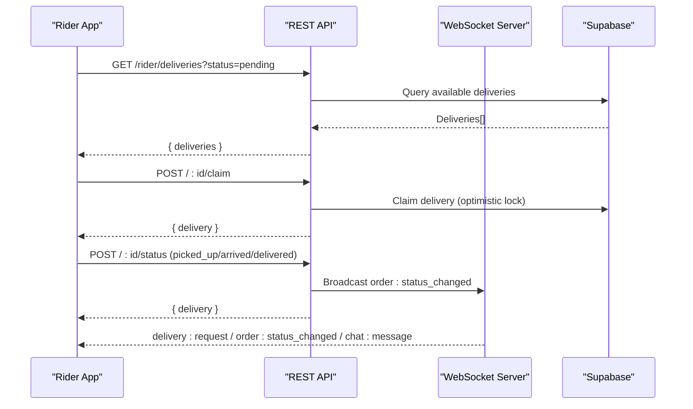
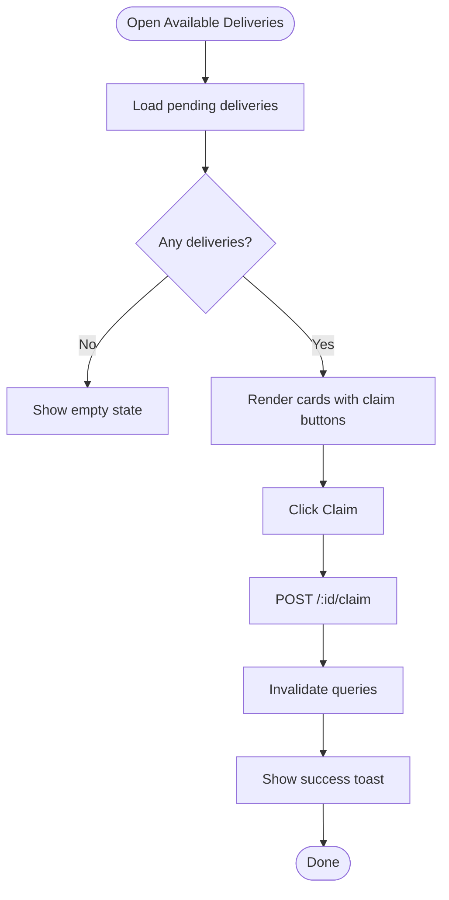
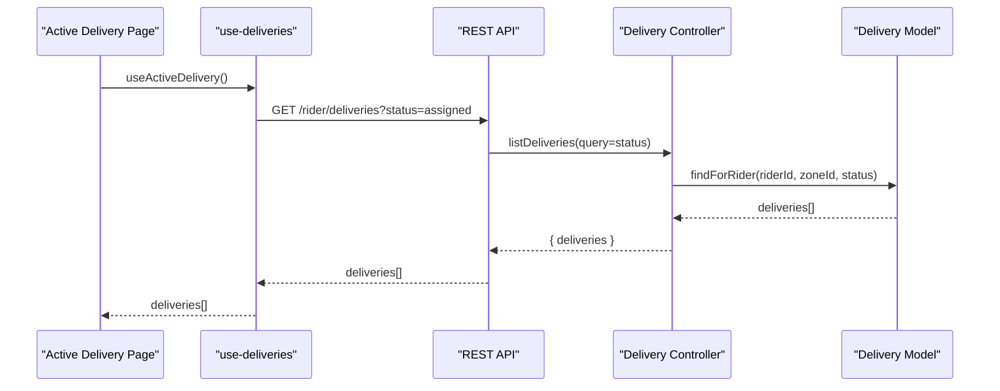
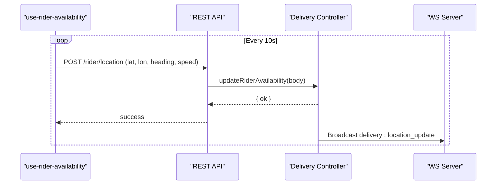
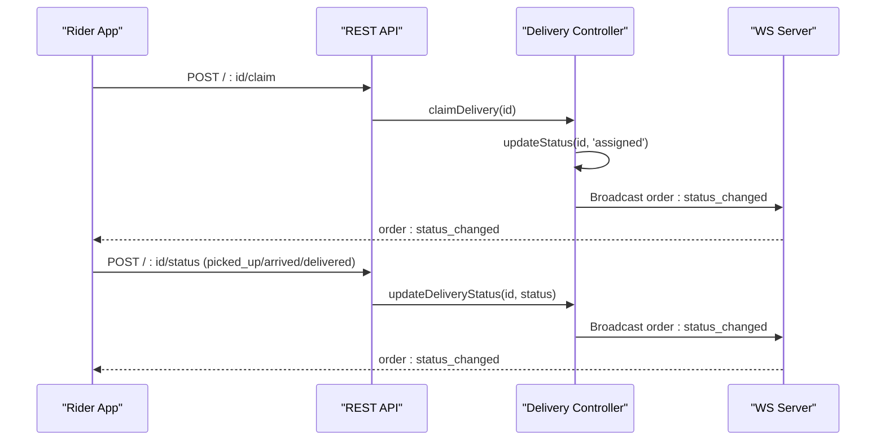
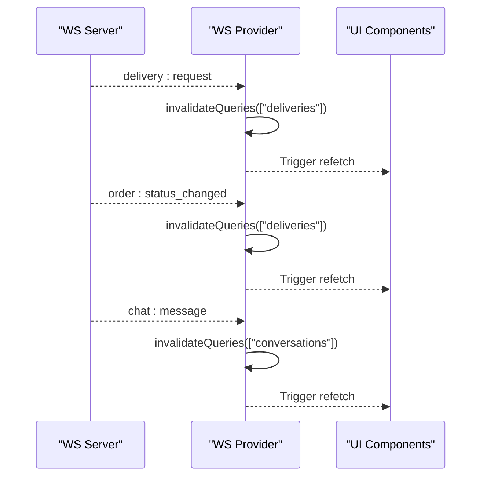
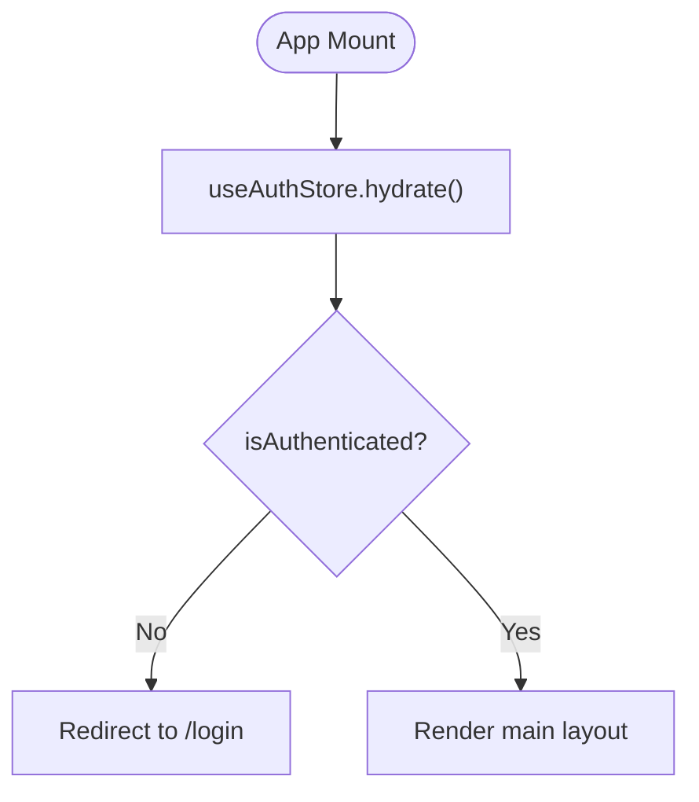
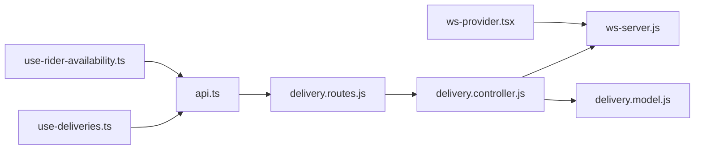

# Rider Application

<cite>
**Referenced Files in This Document**
- [apps/rider/src/app/(main)/page.tsx](file://apps/rider/src/app/(main)/page.tsx)
- [apps/rider/src/app/(main)/active/page.tsx](file://apps/rider/src/app/(main)/active/page.tsx)
- [apps/rider/src/app/(main)/history/page.tsx](file://apps/rider/src/app/(main)/history/page.tsx)
- [apps/rider/src/app/(main)/account/page.tsx](file://apps/rider/src/app/(main)/account/page.tsx)
- [apps/rider/src/app/(main)/layout.tsx](file://apps/rider/src/app/(main)/layout.tsx)
- [apps/rider/src/hooks/use-deliveries.ts](file://apps/rider/src/hooks/use-deliveries.ts)
- [apps/rider/src/hooks/use-rider-availability.ts](file://apps/rider/src/hooks/use-rider-availability.ts)
- [apps/rider/src/hooks/use-chat.ts](file://apps/rider/src/hooks/use-chat.ts)
- [apps/rider/src/lib/api.ts](file://apps/rider/src/lib/api.ts)
- [apps/rider/src/providers/ws-provider.tsx](file://apps/rider/src/providers/ws-provider.tsx)
- [apps/rider/src/stores/auth-store.ts](file://apps/rider/src/stores/auth-store.ts)
- [apps/server/controllers/delivery.controller.js](file://apps/server/controllers/delivery.controller.js)
- [apps/server/models/delivery.model.js](file://apps/server/models/delivery.model.js)
- [apps/server/routes/delivery.routes.js](file://apps/server/routes/delivery.routes.js)
- [apps/server/websocket/ws-server.js](file://apps/server/websocket/ws-server.js)
</cite>

## Table of Contents
1. [Introduction](#introduction)
2. [Project Structure](#project-structure)
3. [Core Components](#core-components)
4. [Architecture Overview](#architecture-overview)
5. [Detailed Component Analysis](#detailed-component-analysis)
6. [Dependency Analysis](#dependency-analysis)
7. [Performance Considerations](#performance-considerations)
8. [Troubleshooting Guide](#troubleshooting-guide)
9. [Conclusion](#conclusion)
10. [Appendices](#appendices)

## Introduction
This document describes the rider web application for the Delivio delivery platform. It focuses on the rider dashboard, delivery queue management, availability settings, claiming and status update workflows, real-time communication, chat, location tracking, and supporting backend integrations. It also outlines typical rider workflows and operational procedures.

## Project Structure
The rider application is a Next.js app under apps/rider. It organizes pages under a main shell with a bottom navigation bar and a top header. Real-time features are powered by a WebSocket provider, and data is fetched via React Query. The frontend communicates with a backend service that exposes REST endpoints and a WebSocket server.



**Diagram sources**
- [apps/rider/src/app/(main)/layout.tsx:1-122](file://apps/rider/src/app/(main)/layout.tsx#L1-L122)
- [apps/rider/src/app/(main)/page.tsx:1-114](file://apps/rider/src/app/(main)/page.tsx#L1-L114)
- [apps/rider/src/app/(main)/active/page.tsx:1-235](file://apps/rider/src/app/(main)/active/page.tsx#L1-L235)
- [apps/rider/src/app/(main)/history/page.tsx:1-64](file://apps/rider/src/app/(main)/history/page.tsx#L1-L64)
- [apps/rider/src/app/(main)/account/page.tsx:1-78](file://apps/rider/src/app/(main)/account/page.tsx#L1-L78)
- [apps/rider/src/providers/ws-provider.tsx:1-83](file://apps/rider/src/providers/ws-provider.tsx#L1-L83)
- [apps/rider/src/hooks/use-deliveries.ts:1-28](file://apps/rider/src/hooks/use-deliveries.ts#L1-L28)
- [apps/rider/src/hooks/use-rider-availability.ts:1-58](file://apps/rider/src/hooks/use-rider-availability.ts#L1-L58)
- [apps/rider/src/hooks/use-chat.ts:1-20](file://apps/rider/src/hooks/use-chat.ts#L1-L20)
- [apps/rider/src/lib/api.ts:1-11](file://apps/rider/src/lib/api.ts#L1-L11)
- [apps/rider/src/stores/auth-store.ts:1-48](file://apps/rider/src/stores/auth-store.ts#L1-L48)
- [apps/server/routes/delivery.routes.js:1-31](file://apps/server/routes/delivery.routes.js#L1-L31)
- [apps/server/controllers/delivery.controller.js:1-313](file://apps/server/controllers/delivery.controller.js#L1-L313)
- [apps/server/models/delivery.model.js:1-98](file://apps/server/models/delivery.model.js#L1-L98)
- [apps/server/websocket/ws-server.js:1-237](file://apps/server/websocket/ws-server.js#L1-L237)

**Section sources**
- [apps/rider/src/app/(main)/layout.tsx:1-122](file://apps/rider/src/app/(main)/layout.tsx#L1-L122)
- [apps/rider/src/lib/api.ts:1-11](file://apps/rider/src/lib/api.ts#L1-L11)
- [apps/rider/src/providers/ws-provider.tsx:1-83](file://apps/rider/src/providers/ws-provider.tsx#L1-L83)

## Core Components
- Rider Dashboard Pages
  - Available Deliveries: Lists pending deliveries and allows claiming.
  - Active Delivery: Shows current delivery steps and status update actions.
  - History: Displays completed deliveries.
  - Account: Profile and sign-out.
- Hooks
  - use-deliveries: Fetches available, active, and history deliveries.
  - use-rider-availability: Publishes periodic location pings for dispatch targeting.
  - use-chat: Loads conversations and messages.
- Real-time
  - WS Provider: Connects to WebSocket server and subscribes to events.
- Authentication
  - Auth store hydrates session and handles logout.

**Section sources**
- [apps/rider/src/app/(main)/page.tsx:19-114](file://apps/rider/src/app/(main)/page.tsx#L19-L114)
- [apps/rider/src/app/(main)/active/page.tsx:59-235](file://apps/rider/src/app/(main)/active/page.tsx#L59-L235)
- [apps/rider/src/app/(main)/history/page.tsx:13-64](file://apps/rider/src/app/(main)/history/page.tsx#L13-L64)
- [apps/rider/src/app/(main)/account/page.tsx:17-78](file://apps/rider/src/app/(main)/account/page.tsx#L17-L78)
- [apps/rider/src/hooks/use-deliveries.ts:5-28](file://apps/rider/src/hooks/use-deliveries.ts#L5-L28)
- [apps/rider/src/hooks/use-rider-availability.ts:9-58](file://apps/rider/src/hooks/use-rider-availability.ts#L9-L58)
- [apps/rider/src/hooks/use-chat.ts:5-20](file://apps/rider/src/hooks/use-chat.ts#L5-L20)
- [apps/rider/src/providers/ws-provider.tsx:27-83](file://apps/rider/src/providers/ws-provider.tsx#L27-L83)
- [apps/rider/src/stores/auth-store.ts:14-48](file://apps/rider/src/stores/auth-store.ts#L14-L48)

## Architecture Overview
The rider app is a client-driven SPA that:
- Fetches delivery lists and statuses via REST endpoints.
- Subscribes to real-time events over WebSocket for live updates.
- Periodically sends rider location pings to support dispatch targeting.
- Uses React Query for caching and refetching, and Sonner for notifications.



**Diagram sources**
- [apps/rider/src/app/(main)/page.tsx:24-44](file://apps/rider/src/app/(main)/page.tsx#L24-L44)
- [apps/rider/src/app/(main)/active/page.tsx:70-93](file://apps/rider/src/app/(main)/active/page.tsx#L70-L93)
- [apps/server/controllers/delivery.controller.js:10-78](file://apps/server/controllers/delivery.controller.js#L10-L78)
- [apps/server/websocket/ws-server.js:162-175](file://apps/server/websocket/ws-server.js#L162-L175)

## Detailed Component Analysis

### Rider Dashboard Pages
- Available Deliveries
  - Fetches pending deliveries and renders cards with ETA and claim button.
  - Subscribes to real-time delivery requests and invalidates queries.
  - Claiming triggers a mutation and refreshes lists.
- Active Delivery
  - Displays a status stepper (assigned → picked_up → arrived → delivered).
  - Provides actionable buttons to advance status and open chat.
  - Shows delivery details and ETA.
- History
  - Lists delivered orders with basic metadata.
- Account
  - Shows profile and role, with logout.



**Diagram sources**
- [apps/rider/src/app/(main)/page.tsx:19-44](file://apps/rider/src/app/(main)/page.tsx#L19-L44)
- [apps/server/controllers/delivery.controller.js:25-52](file://apps/server/controllers/delivery.controller.js#L25-L52)

**Section sources**
- [apps/rider/src/app/(main)/page.tsx:19-114](file://apps/rider/src/app/(main)/page.tsx#L19-L114)
- [apps/rider/src/app/(main)/active/page.tsx:59-235](file://apps/rider/src/app/(main)/active/page.tsx#L59-L235)
- [apps/rider/src/app/(main)/history/page.tsx:13-64](file://apps/rider/src/app/(main)/history/page.tsx#L13-L64)
- [apps/rider/src/app/(main)/account/page.tsx:17-78](file://apps/rider/src/app/(main)/account/page.tsx#L17-L78)

### Delivery Queue Management
- Available Deliveries
  - Endpoint: GET /rider/deliveries?status=pending
  - Backend filters deliveries where rider_id is null and matches projectRef.
- Active Deliveries
  - Endpoint: GET /rider/deliveries?status=assigned
  - Returns assigned/picked_up/arrived for the rider.
- History
  - Endpoint: GET /rider/deliveries?status=delivered
  - Returns delivered deliveries for the rider.



**Diagram sources**
- [apps/rider/src/hooks/use-deliveries.ts:13-20](file://apps/rider/src/hooks/use-deliveries.ts#L13-L20)
- [apps/server/controllers/delivery.controller.js:10-23](file://apps/server/controllers/delivery.controller.js#L10-L23)
- [apps/server/models/delivery.model.js:19-27](file://apps/server/models/delivery.model.js#L19-L27)

**Section sources**
- [apps/rider/src/hooks/use-deliveries.ts:5-28](file://apps/rider/src/hooks/use-deliveries.ts#L5-L28)
- [apps/server/controllers/delivery.controller.js:10-23](file://apps/server/controllers/delivery.controller.js#L10-L23)
- [apps/server/models/delivery.model.js:19-35](file://apps/server/models/delivery.model.js#L19-L35)

### Availability Settings and Location Tracking
- Periodic Location Pings
  - useRiderAvailabilityLocation periodically fetches device location and posts to updateRiderAvailability.
  - Intended to keep dispatch matching functional even without an active delivery.
- Rate Limiting
  - Backend enforces a rate limit for location updates to avoid flooding.
- Real-time Location Updates
  - Backend broadcasts delivery:location_update events to clients.



**Diagram sources**
- [apps/rider/src/hooks/use-rider-availability.ts:18-47](file://apps/rider/src/hooks/use-rider-availability.ts#L18-L47)
- [apps/server/controllers/delivery.controller.js:116-131](file://apps/server/controllers/delivery.controller.js#L116-L131)
- [apps/server/websocket/ws-server.js:156-158](file://apps/server/websocket/ws-server.js#L156-L158)

**Section sources**
- [apps/rider/src/hooks/use-rider-availability.ts:9-58](file://apps/rider/src/hooks/use-rider-availability.ts#L9-L58)
- [apps/server/controllers/delivery.controller.js:80-114](file://apps/server/controllers/delivery.controller.js#L80-L114)
- [apps/server/websocket/ws-server.js:156-158](file://apps/server/websocket/ws-server.js#L156-L158)

### Delivery Claiming and Status Updates
- Claiming
  - POST /:id/claim sets rider_id and status to assigned.
  - Broadcasts order:status_changed and logs audit.
- Status Updates
  - POST /:id/status advances status and broadcasts order:status_changed.
- Arrived
  - POST /:id/arrived transitions to arrived and notifies.



**Diagram sources**
- [apps/rider/src/app/(main)/page.tsx:29-44](file://apps/rider/src/app/(main)/page.tsx#L29-L44)
- [apps/rider/src/app/(main)/active/page.tsx:70-93](file://apps/rider/src/app/(main)/active/page.tsx#L70-L93)
- [apps/server/controllers/delivery.controller.js:25-78](file://apps/server/controllers/delivery.controller.js#L25-L78)
- [apps/server/websocket/ws-server.js:153-175](file://apps/server/websocket/ws-server.js#L153-L175)

**Section sources**
- [apps/rider/src/app/(main)/page.tsx:29-44](file://apps/rider/src/app/(main)/page.tsx#L29-L44)
- [apps/rider/src/app/(main)/active/page.tsx:70-93](file://apps/rider/src/app/(main)/active/page.tsx#L70-L93)
- [apps/server/controllers/delivery.controller.js:25-78](file://apps/server/controllers/delivery.controller.js#L25-L78)

### Real-time Communication and Chat
- WebSocket Events
  - delivery:request, order:status_changed, chat:message are subscribed to.
  - On receiving events, queries are invalidated to refresh UI.
- Chat
  - useConversations and useMessages fetch conversations and messages with periodic refetch.



**Diagram sources**
- [apps/rider/src/providers/ws-provider.tsx:34-43](file://apps/rider/src/providers/ws-provider.tsx#L34-L43)
- [apps/rider/src/hooks/use-chat.ts:5-19](file://apps/rider/src/hooks/use-chat.ts#L5-L19)
- [apps/server/websocket/ws-server.js:152-161](file://apps/server/websocket/ws-server.js#L152-L161)

**Section sources**
- [apps/rider/src/providers/ws-provider.tsx:27-83](file://apps/rider/src/providers/ws-provider.tsx#L27-L83)
- [apps/rider/src/hooks/use-chat.ts:5-20](file://apps/rider/src/hooks/use-chat.ts#L5-L20)

### Authentication and Session Hydration
- Auth Store
  - hydrate fetches admin session and sets user state.
  - logout clears session and state.
- Layout
  - On load, hydrate runs and redirects unauthenticated users to login.



**Diagram sources**
- [apps/rider/src/stores/auth-store.ts:19-34](file://apps/rider/src/stores/auth-store.ts#L19-L34)
- [apps/rider/src/app/(main)/layout.tsx:30-40](file://apps/rider/src/app/(main)/layout.tsx#L30-L40)

**Section sources**
- [apps/rider/src/stores/auth-store.ts:14-48](file://apps/rider/src/stores/auth-store.ts#L14-L48)
- [apps/rider/src/app/(main)/layout.tsx:27-40](file://apps/rider/src/app/(main)/layout.tsx#L27-L40)

### Backend Delivery Model and Routes
- Delivery Model
  - findAvailable: returns pending deliveries scoped to projectRef.
  - findForRider: returns assigned/picked_up/arrived for a rider.
  - claim: optimistic lock to assign delivery.
  - updateStatus: validates and updates status.
- Routes
  - Require admin or vendor roles for rider endpoints.
  - Expose listing, claiming, status updates, location updates, and arrival.

```mermaid
classDiagram
class DeliveryModel {
+findByOrderId(orderId)
+findForRider(riderId, zoneId, status)
+findAvailable(projectRef)
+create({orderId, etaMinutes, zoneId})
+claim(deliveryId, riderId)
+updateStatus(deliveryId, newStatus)
+findAvailableInRadius(lat, lon, radiusKm)
+reassign(deliveryId)
+logLocation(deliveryId, riderId, coords)
}
```

**Diagram sources**
- [apps/server/models/delivery.model.js:9-95](file://apps/server/models/delivery.model.js#L9-L95)

**Section sources**
- [apps/server/models/delivery.model.js:19-66](file://apps/server/models/delivery.model.js#L19-L66)
- [apps/server/controllers/delivery.controller.js:10-78](file://apps/server/controllers/delivery.controller.js#L10-L78)
- [apps/server/routes/delivery.routes.js:14-28](file://apps/server/routes/delivery.routes.js#L14-L28)

## Dependency Analysis
- Frontend Dependencies
  - use-deliveries depends on api.deliveries.list and React Query.
  - use-rider-availability depends on api.deliveries.updateRiderAvailability and browser geolocation.
  - WS Provider depends on @delivio/api and connects to ws://host/ws.
- Backend Dependencies
  - Delivery routes depend on delivery controller.
  - Delivery controller depends on delivery model, session service, notification service, and WS server.



**Diagram sources**
- [apps/rider/src/hooks/use-deliveries.ts:1-28](file://apps/rider/src/hooks/use-deliveries.ts#L1-L28)
- [apps/rider/src/hooks/use-rider-availability.ts:1-58](file://apps/rider/src/hooks/use-rider-availability.ts#L1-L58)
- [apps/rider/src/providers/ws-provider.tsx:1-83](file://apps/rider/src/providers/ws-provider.tsx#L1-L83)
- [apps/rider/src/lib/api.ts:1-11](file://apps/rider/src/lib/api.ts#L1-L11)
- [apps/server/routes/delivery.routes.js:1-31](file://apps/server/routes/delivery.routes.js#L1-L31)
- [apps/server/controllers/delivery.controller.js:1-313](file://apps/server/controllers/delivery.controller.js#L1-L313)
- [apps/server/models/delivery.model.js:1-98](file://apps/server/models/delivery.model.js#L1-L98)
- [apps/server/websocket/ws-server.js:1-237](file://apps/server/websocket/ws-server.js#L1-L237)

**Section sources**
- [apps/rider/src/lib/api.ts:1-11](file://apps/rider/src/lib/api.ts#L1-L11)
- [apps/server/routes/delivery.routes.js:1-31](file://apps/server/routes/delivery.routes.js#L1-L31)

## Performance Considerations
- Refetch Intervals
  - Available deliveries: 10 seconds.
  - Active deliveries: 5 seconds.
  - Messages: 5 seconds.
- Location Pings
  - 10-second intervals with high accuracy and timeouts.
- Rate Limiting
  - Backend enforces a minimum 3-second gap for location updates to prevent excessive writes.

[No sources needed since this section provides general guidance]

## Troubleshooting Guide
- No deliveries appear
  - Verify authentication and that hydrate completes.
  - Check WS subscription for delivery:request and that queries are invalidated.
- Claim fails
  - Ensure delivery still has no rider_id (race condition).
  - Confirm endpoint permissions and projectRef.
- Status update errors
  - Validate status values and that the rider owns the delivery.
- Location pings not received
  - Confirm geolocation permissions and browser support.
  - Check rate limit response from backend.

**Section sources**
- [apps/rider/src/app/(main)/layout.tsx:30-40](file://apps/rider/src/app/(main)/layout.tsx#L30-L40)
- [apps/rider/src/providers/ws-provider.tsx:34-43](file://apps/rider/src/providers/ws-provider.tsx#L34-L43)
- [apps/server/controllers/delivery.controller.js:30-51](file://apps/server/controllers/delivery.controller.js#L30-L51)
- [apps/server/controllers/delivery.controller.js:80-114](file://apps/server/controllers/delivery.controller.js#L80-L114)

## Conclusion
The rider application provides a streamlined interface for discovering, claiming, and managing deliveries, with real-time updates and location tracking. The backend enforces role-based access, optimistic locking for claiming, and robust broadcasting for live updates. The frontend leverages hooks and providers to deliver a responsive, up-to-date experience.

[No sources needed since this section summarizes without analyzing specific files]

## Appendices

### Typical Rider Workflows and Procedures
- Claim a Delivery
  - Open Available Deliveries, review ETA and zone, tap Claim, confirm toast.
- Update Delivery Status
  - Open Active Delivery, tap “Mark Picked Up” → “Arrived Outside” → “Complete Delivery”.
- Check History
  - Review completed deliveries and approximate earnings.
- Manage Availability
  - Ensure location permissions are granted; periodic pings keep you discoverable.
- Communicate with Customers
  - Use the Chat tab to exchange messages and typing indicators.

**Section sources**
- [apps/rider/src/app/(main)/page.tsx:29-44](file://apps/rider/src/app/(main)/page.tsx#L29-L44)
- [apps/rider/src/app/(main)/active/page.tsx:70-93](file://apps/rider/src/app/(main)/active/page.tsx#L70-L93)
- [apps/rider/src/app/(main)/history/page.tsx:13-64](file://apps/rider/src/app/(main)/history/page.tsx#L13-L64)
- [apps/rider/src/hooks/use-rider-availability.ts:18-47](file://apps/rider/src/hooks/use-rider-availability.ts#L18-L47)
- [apps/rider/src/app/(main)/layout.tsx:12-18](file://apps/rider/src/app/(main)/layout.tsx#L12-L18)