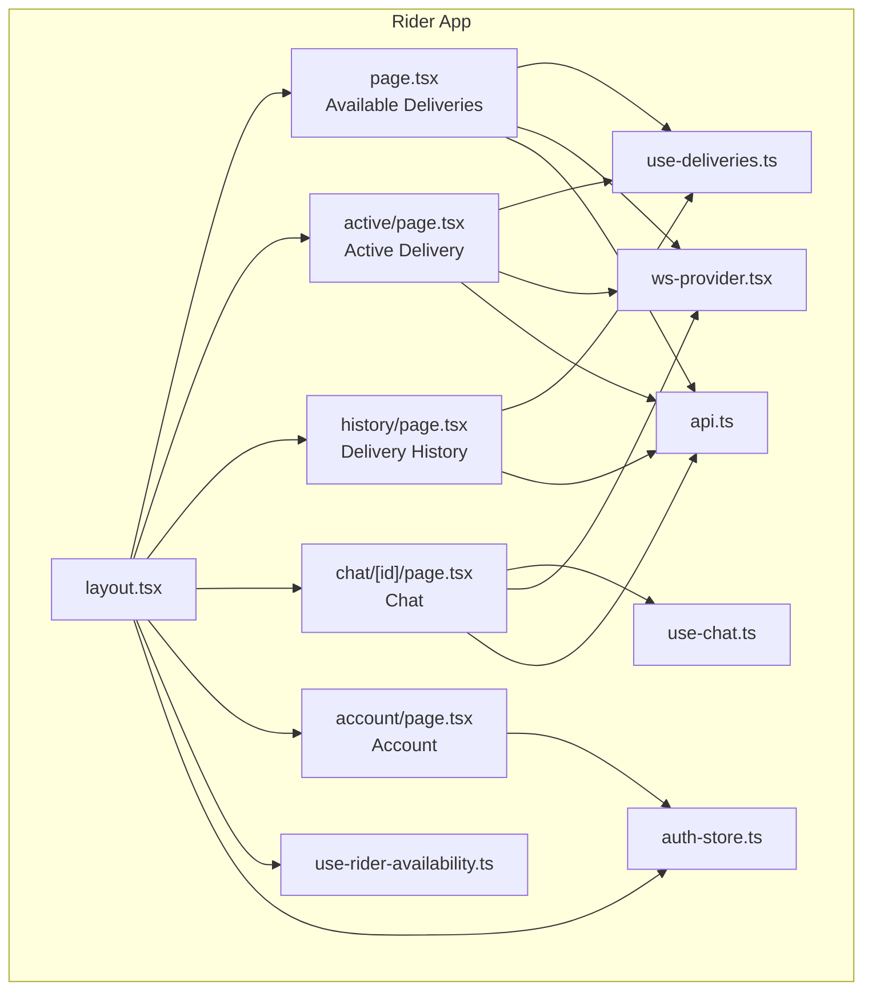
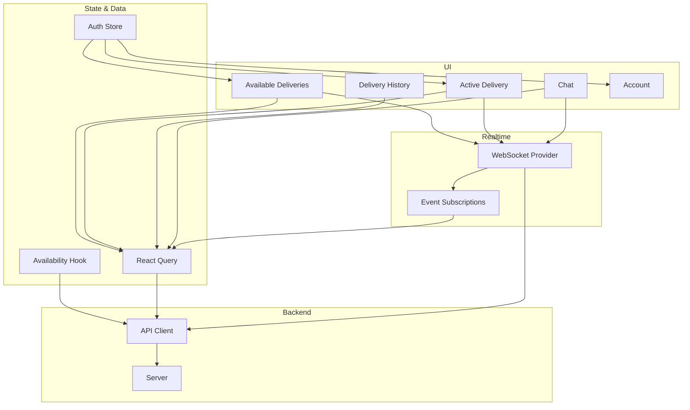
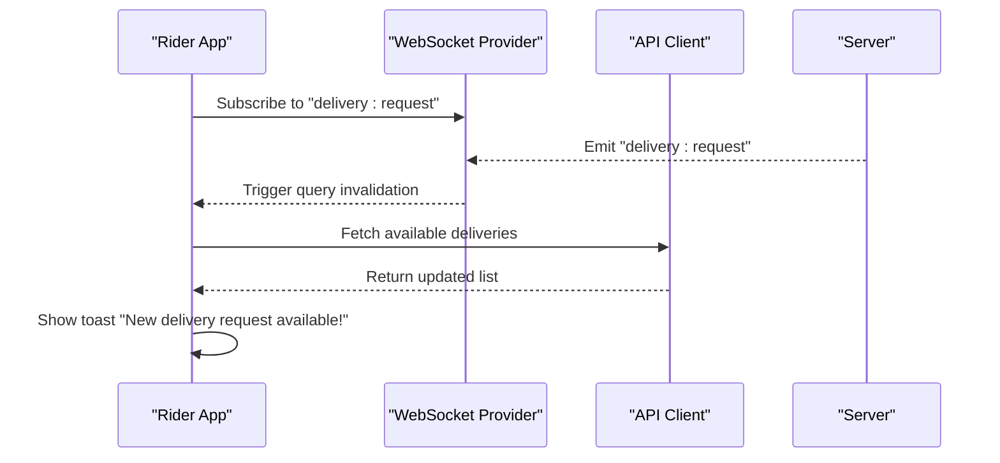
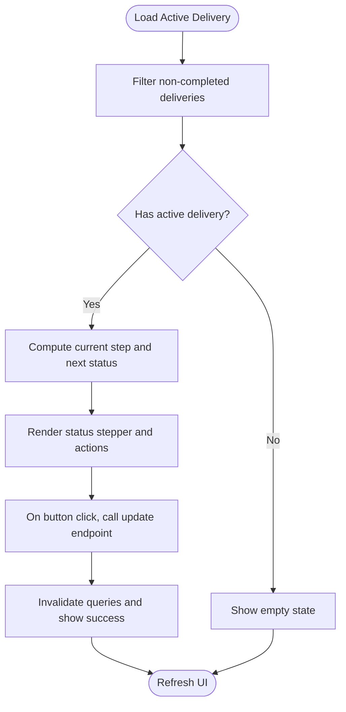
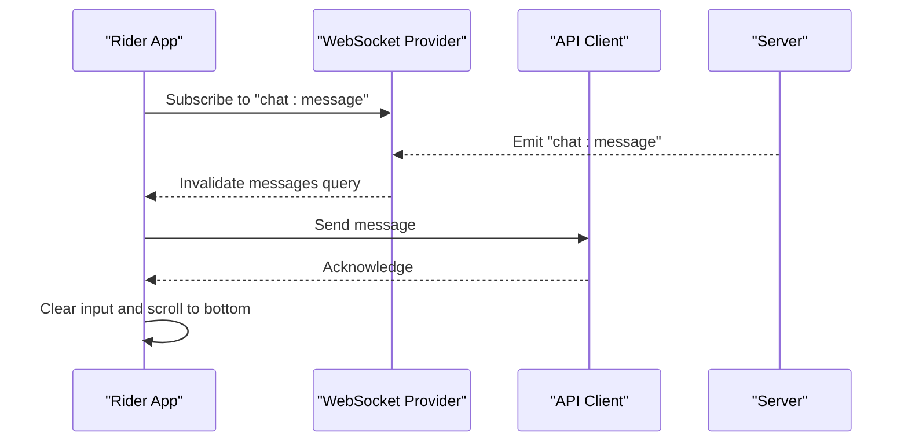
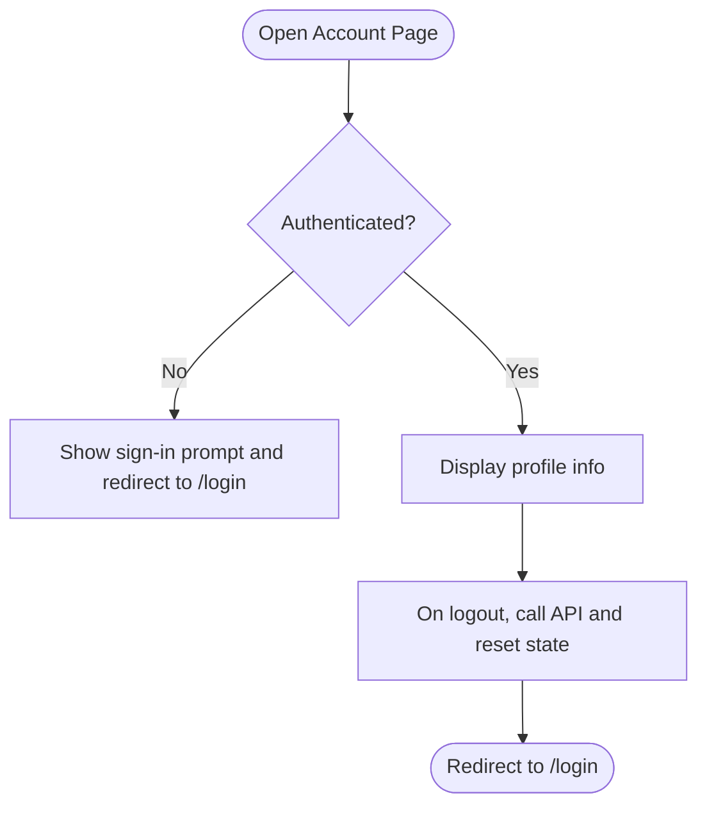
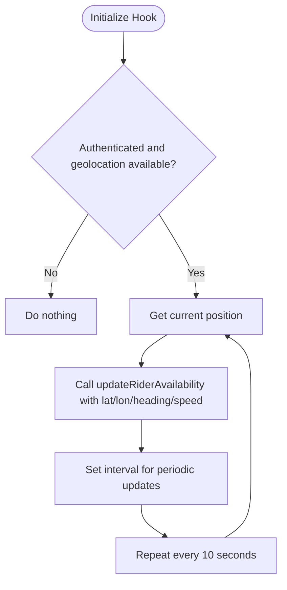
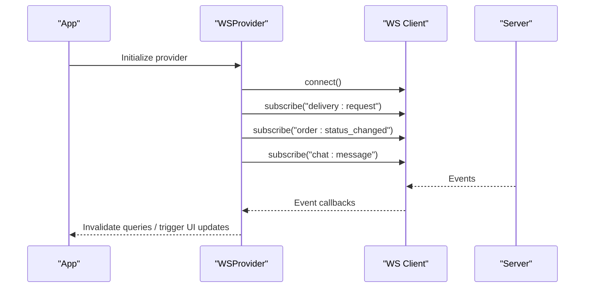
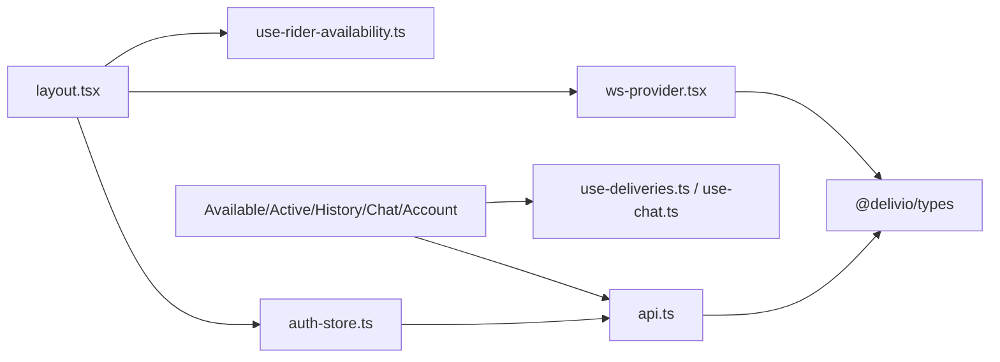

# Rider Dashboard & Availability

<cite>
**Referenced Files in This Document**
- [page.tsx](file://apps/rider/src/app/(main)/page.tsx)
- [active/page.tsx](file://apps/rider/src/app/(main)/active/page.tsx)
- [account/page.tsx](file://apps/rider/src/app/(main)/account/page.tsx)
- [history/page.tsx](file://apps/rider/src/app/(main)/history/page.tsx)
- [chat/[id]/page.tsx](file://apps/rider/src/app/(main)/chat/[id]/page.tsx)
- [layout.tsx](file://apps/rider/src/app/(main)/layout.tsx)
- [use-deliveries.ts](file://apps/rider/src/hooks/use-deliveries.ts)
- [use-rider-availability.ts](file://apps/rider/src/hooks/use-rider-availability.ts)
- [ws-provider.tsx](file://apps/rider/src/providers/ws-provider.tsx)
- [api.ts](file://apps/rider/src/lib/api.ts)
- [auth-store.ts](file://apps/rider/src/stores/auth-store.ts)
- [use-chat.ts](file://apps/rider/src/hooks/use-chat.ts)
</cite>

## Table of Contents
1. [Introduction](#introduction)
2. [Project Structure](#project-structure)
3. [Core Components](#core-components)
4. [Architecture Overview](#architecture-overview)
5. [Detailed Component Analysis](#detailed-component-analysis)
6. [Dependency Analysis](#dependency-analysis)
7. [Performance Considerations](#performance-considerations)
8. [Troubleshooting Guide](#troubleshooting-guide)
9. [Conclusion](#conclusion)

## Introduction
This document provides comprehensive documentation for the Rider Dashboard and Availability Management System. It covers the main dashboard interface displaying available deliveries, real-time notifications, and delivery request alerts. It also documents the rider availability location publishing mechanism, shift scheduling considerations, status management for active deliveries, the account settings page, profile management, and personal information updates. Additionally, it explains the WebSocket integration for real-time delivery notifications and automatic dashboard refreshes, with practical examples of dashboard navigation, availability switching workflows, and account configuration procedures. The focus is on how riders can control their active status and visibility within the system.

## Project Structure
The Rider application is organized as a Next.js application with route-based pages under the `(main)` group. Key areas include:
- Dashboard pages: Available deliveries, Active delivery, History, Chat, and Account
- Hooks for data fetching and availability management
- Providers for WebSocket connectivity and global state
- Authentication store for session hydration and logout
- API client configuration for backend communication

**Diagram sources**
- [layout.tsx:20-121](file://apps/rider/src/app/(main)/layout.tsx#L20-L121)
- [page.tsx:19-113](file://apps/rider/src/app/(main)/page.tsx#L19-L113)
- [active/page.tsx:59-234](file://apps/rider/src/app/(main)/active/page.tsx#L59-L234)
- [history/page.tsx:13-63](file://apps/rider/src/app/(main)/history/page.tsx#L13-L63)
- [chat/[id]/page.tsx:20-148](file://apps/rider/src/app/(main)/chat/[id]/page.tsx#L20-L148)
- [account/page.tsx:17-77](file://apps/rider/src/app/(main)/account/page.tsx#L17-L77)
- [use-deliveries.ts:5-27](file://apps/rider/src/hooks/use-deliveries.ts#L5-L27)
- [use-rider-availability.ts:9-56](file://apps/rider/src/hooks/use-rider-availability.ts#L9-L56)
- [ws-provider.tsx:27-82](file://apps/rider/src/providers/ws-provider.tsx#L27-L82)
- [auth-store.ts:14-47](file://apps/rider/src/stores/auth-store.ts#L14-L47)
- [api.ts:1-11](file://apps/rider/src/lib/api.ts#L1-L11)
- [use-chat.ts:5-19](file://apps/rider/src/hooks/use-chat.ts#L5-L19)

**Section sources**
- [layout.tsx:12-121](file://apps/rider/src/app/(main)/layout.tsx#L12-L121)
- [page.tsx:19-113](file://apps/rider/src/app/(main)/page.tsx#L19-L113)
- [active/page.tsx:59-234](file://apps/rider/src/app/(main)/active/page.tsx#L59-L234)
- [history/page.tsx:13-63](file://apps/rider/src/app/(main)/history/page.tsx#L13-L63)
- [chat/[id]/page.tsx:20-148](file://apps/rider/src/app/(main)/chat/[id]/page.tsx#L20-L148)
- [account/page.tsx:17-77](file://apps/rider/src/app/(main)/account/page.tsx#L17-L77)

## Core Components
This section outlines the primary components involved in the rider dashboard and availability management:

- Available Deliveries Page: Displays pending deliveries, allows claiming deliveries, and shows real-time alerts via WebSocket.
- Active Delivery Page: Manages the current delivery lifecycle with status steps and actions.
- Delivery History Page: Shows completed deliveries with basic metadata.
- Chat Page: Real-time messaging with other participants and typing indicators.
- Account Page: Rider profile and logout functionality.
- Availability Location Hook: Periodically publishes the rider's location for dispatch targeting.
- WebSocket Provider: Centralized WebSocket connection and event subscriptions.
- Authentication Store: Session hydration, login state, and logout.
- API Client: Backend communication abstraction.

**Section sources**
- [page.tsx:19-113](file://apps/rider/src/app/(main)/page.tsx#L19-L113)
- [active/page.tsx:59-234](file://apps/rider/src/app/(main)/active/page.tsx#L59-L234)
- [history/page.tsx:13-63](file://apps/rider/src/app/(main)/history/page.tsx#L13-L63)
- [chat/[id]/page.tsx:20-148](file://apps/rider/src/app/(main)/chat/[id]/page.tsx#L20-L148)
- [account/page.tsx:17-77](file://apps/rider/src/app/(main)/account/page.tsx#L17-L77)
- [use-rider-availability.ts:9-56](file://apps/rider/src/hooks/use-rider-availability.ts#L9-L56)
- [ws-provider.tsx:27-82](file://apps/rider/src/providers/ws-provider.tsx#L27-L82)
- [auth-store.ts:14-47](file://apps/rider/src/stores/auth-store.ts#L14-L47)
- [api.ts:1-11](file://apps/rider/src/lib/api.ts#L1-L11)

## Architecture Overview
The Rider Dashboard integrates several subsystems:
- UI Pages: Route-based pages for Available, Active, History, Chat, and Account.
- Data Fetching: React Query hooks for deliveries and chat.
- Availability: Geolocation polling hook that periodically updates rider location.
- WebSocket: Central provider managing connections and subscriptions for real-time events.
- Authentication: Zustand store for session hydration and logout.
- API Layer: Unified client for backend interactions.

**Diagram sources**
- [layout.tsx:20-121](file://apps/rider/src/app/(main)/layout.tsx#L20-L121)
- [use-deliveries.ts:5-27](file://apps/rider/src/hooks/use-deliveries.ts#L5-L27)
- [use-rider-availability.ts:9-56](file://apps/rider/src/hooks/use-rider-availability.ts#L9-L56)
- [ws-provider.tsx:27-82](file://apps/rider/src/providers/ws-provider.tsx#L27-L82)
- [auth-store.ts:14-47](file://apps/rider/src/stores/auth-store.ts#L14-L47)
- [api.ts:1-11](file://apps/rider/src/lib/api.ts#L1-L11)

## Detailed Component Analysis

### Available Deliveries Dashboard
The Available Deliveries page displays pending deliveries and enables claiming. It leverages:
- Real-time delivery request alerts via WebSocket subscription
- Automatic refresh of the available deliveries list
- Claim action with optimistic UI feedback

Key behaviors:
- Subscribes to "delivery:request" events to invalidate queries and show notifications
- Uses a query client to refetch available deliveries every 10 seconds
- Provides a Claim button per delivery with loading states

**Diagram sources**
- [page.tsx:24-27](file://apps/rider/src/app/(main)/page.tsx#L24-L27)
- [ws-provider.tsx:34-37](file://apps/rider/src/providers/ws-provider.tsx#L34-L37)
- [use-deliveries.ts:5-11](file://apps/rider/src/hooks/use-deliveries.ts#L5-L11)

**Section sources**
- [page.tsx:19-113](file://apps/rider/src/app/(main)/page.tsx#L19-L113)
- [use-deliveries.ts:5-11](file://apps/rider/src/hooks/use-deliveries.ts#L5-L11)
- [ws-provider.tsx:34-37](file://apps/rider/src/providers/ws-provider.tsx#L34-L37)

### Active Delivery Management
The Active Delivery page manages the current delivery lifecycle:
- Displays a step-by-step status tracker (Assigned → Picked Up → Arrived → Delivered)
- Provides actionable buttons to advance the status
- Shows delivery details such as zone and ETA
- Integrates with WebSocket for real-time updates

Status progression logic:
- getNextStatus maps current status to the next logical step
- getNextLabel provides contextual button labels
- Updates are performed via API calls and invalidate queries for immediate UI refresh

**Diagram sources**
- [active/page.tsx:59-234](file://apps/rider/src/app/(main)/active/page.tsx#L59-L234)

**Section sources**
- [active/page.tsx:59-234](file://apps/rider/src/app/(main)/active/page.tsx#L59-L234)
- [use-deliveries.ts:13-19](file://apps/rider/src/hooks/use-deliveries.ts#L13-L19)

### Delivery History
The History page lists completed deliveries with minimal metadata:
- Uses a dedicated query hook to fetch delivered deliveries
- Displays order identifiers and timestamps
- Provides skeleton loaders during initial load

**Section sources**
- [history/page.tsx:13-63](file://apps/rider/src/app/(main)/history/page.tsx#L13-L63)
- [use-deliveries.ts:22-27](file://apps/rider/src/hooks/use-deliveries.ts#L22-L27)

### Chat Interface
The Chat page supports real-time messaging:
- Lists messages with sender identification
- Sends new messages via API and invalidates message queries
- Subscribes to "chat:message" events to refresh the current conversation
- Emits typing indicators via WebSocket

**Diagram sources**
- [chat/[id]/page.tsx:31-37](file://apps/rider/src/app/(main)/chat/[id]/page.tsx#L31-L37)
- [ws-provider.tsx:41-43](file://apps/rider/src/providers/ws-provider.tsx#L41-L43)
- [use-chat.ts:12-19](file://apps/rider/src/hooks/use-chat.ts#L12-L19)

**Section sources**
- [chat/[id]/page.tsx:20-148](file://apps/rider/src/app/(main)/chat/[id]/page.tsx#L20-L148)
- [use-chat.ts:5-19](file://apps/rider/src/hooks/use-chat.ts#L5-L19)
- [ws-provider.tsx:41-43](file://apps/rider/src/providers/ws-provider.tsx#L41-L43)

### Account Settings and Profile Management
The Account page displays the rider's profile and provides logout:
- Shows email and role information
- Redirects to login when not authenticated
- Calls logout and navigates to login page

**Diagram sources**
- [account/page.tsx:17-77](file://apps/rider/src/app/(main)/account/page.tsx#L17-L77)
- [auth-store.ts:14-47](file://apps/rider/src/stores/auth-store.ts#L14-L47)

**Section sources**
- [account/page.tsx:17-77](file://apps/rider/src/app/(main)/account/page.tsx#L17-L77)
- [auth-store.ts:14-47](file://apps/rider/src/stores/auth-store.ts#L14-L47)

### Availability Location Publishing
The availability location hook ensures dispatch targeting works even when the rider has no active delivery:
- Periodically requests geolocation with high accuracy
- Sends location updates to the backend at intervals
- Handles permission denials gracefully

**Diagram sources**
- [use-rider-availability.ts:9-56](file://apps/rider/src/hooks/use-rider-availability.ts#L9-L56)

**Section sources**
- [use-rider-availability.ts:9-56](file://apps/rider/src/hooks/use-rider-availability.ts#L9-L56)

### WebSocket Integration and Real-Time Notifications
The WebSocket provider establishes a persistent connection and subscribes to multiple event types:
- delivery:request: Refreshes available deliveries
- order:status_changed: Refreshes delivery-related data
- chat:message: Refreshes conversations/messages

It also exposes a helper hook to subscribe to specific events with stable handlers.

**Diagram sources**
- [ws-provider.tsx:27-82](file://apps/rider/src/providers/ws-provider.tsx#L27-L82)

**Section sources**
- [ws-provider.tsx:27-82](file://apps/rider/src/providers/ws-provider.tsx#L27-L82)

### API Client Configuration
The API client is configured with environment-aware URLs and exported for use across the app.

**Section sources**
- [api.ts:1-11](file://apps/rider/src/lib/api.ts#L1-L11)

## Dependency Analysis
The following diagram shows key dependencies among components:

**Diagram sources**
- [layout.tsx:20-121](file://apps/rider/src/app/(main)/layout.tsx#L20-L121)
- [use-deliveries.ts:5-27](file://apps/rider/src/hooks/use-deliveries.ts#L5-L27)
- [use-chat.ts:5-19](file://apps/rider/src/hooks/use-chat.ts#L5-L19)
- [api.ts:1-11](file://apps/rider/src/lib/api.ts#L1-L11)
- [ws-provider.tsx:27-82](file://apps/rider/src/providers/ws-provider.tsx#L27-L82)
- [auth-store.ts:14-47](file://apps/rider/src/stores/auth-store.ts#L14-L47)

**Section sources**
- [layout.tsx:20-121](file://apps/rider/src/app/(main)/layout.tsx#L20-L121)
- [use-deliveries.ts:5-27](file://apps/rider/src/hooks/use-deliveries.ts#L5-L27)
- [use-chat.ts:5-19](file://apps/rider/src/hooks/use-chat.ts#L5-L19)
- [api.ts:1-11](file://apps/rider/src/lib/api.ts#L1-L11)
- [ws-provider.tsx:27-82](file://apps/rider/src/providers/ws-provider.tsx#L27-L82)
- [auth-store.ts:14-47](file://apps/rider/src/stores/auth-store.ts#L14-L47)

## Performance Considerations
- Polling Intervals: Available deliveries poll every 10 seconds; active deliveries poll every 5 seconds. These intervals balance freshness with network usage.
- Query Invalidation: WebSocket subscriptions trigger targeted query invalidations to minimize unnecessary re-fetches.
- Location Publishing: Geolocation requests are throttled with reasonable timeouts and maximum age to reduce battery drain while maintaining accuracy.
- Skeleton Loading: Skeleton components improve perceived performance during initial loads.

## Troubleshooting Guide
Common issues and resolutions:
- Not receiving delivery alerts:
  - Verify WebSocket connection is established and subscribed to "delivery:request".
  - Confirm query invalidation occurs when events arrive.
- Claim button stuck in loading:
  - Check for API errors during claim and ensure query cache is invalidated afterward.
- Active delivery status not updating:
  - Ensure the next status mapping exists and the update endpoint is called.
  - Confirm query invalidation after status change.
- Chat not refreshing:
  - Verify subscription to "chat:message" and that the current conversation query is invalidated.
- Location publishing failures:
  - Review geolocation permissions and browser support.
  - Check for exceptions in the availability hook and confirm retry intervals.

**Section sources**
- [page.tsx:29-44](file://apps/rider/src/app/(main)/page.tsx#L29-L44)
- [active/page.tsx:70-93](file://apps/rider/src/app/(main)/active/page.tsx#L70-L93)
- [chat/[id]/page.tsx:43-58](file://apps/rider/src/app/(main)/chat/[id]/page.tsx#L43-L58)
- [use-rider-availability.ts:18-42](file://apps/rider/src/hooks/use-rider-availability.ts#L18-L42)
- [ws-provider.tsx:34-43](file://apps/rider/src/providers/ws-provider.tsx#L34-L43)

## Conclusion
The Rider Dashboard and Availability Management System provides a cohesive, real-time experience for riders. It combines route-based pages, reactive data fetching, periodic availability publishing, and robust WebSocket integrations to keep riders informed and in control of their work. The modular architecture supports maintainability and scalability, enabling seamless updates to delivery workflows, availability controls, and user experiences.