# Security & Authentication

<cite>
**Referenced Files in This Document**
- [supabase.js](file://apps/server/lib/supabase.js)
- [auth.middleware.js](file://apps/server/middleware/auth.middleware.js)
- [auth.controller.js](file://apps/server/controllers/auth.controller.js)
- [auth.routes.js](file://apps/server/routes/auth.routes.js)
- [session.service.js](file://apps/server/services/session.service.js)
- [rate-limit.middleware.js](file://apps/server/middleware/rate-limit.middleware.js)
- [cors.js](file://apps/server/config/cors.js)
- [helmet.js](file://apps/server/config/helmet.js)
- [index.js](file://apps/server/config/index.js)
- [user.model.js](file://apps/server/models/user.model.js)
- [customer.model.js](file://apps/server/models/customer.model.js)
- [memory-session-store.js](file://apps/server/services/memory-session-store.js)
- [redis-session-store.js](file://apps/server/services/redis-session-store.js)
- [app.js](file://apps/server/app.js)
- [validate.middleware.js](file://apps/server/middleware/validate.middleware.js)
- [auth.validator.js](file://apps/server/validators/auth.validator.js)
- [project-ref.middleware.js](file://apps/server/middleware/project-ref.middleware.js)
- [audit.js](file://apps/server/lib/audit.js)
</cite>

## Table of Contents
1. [Introduction](#introduction)
2. [Project Structure](#project-structure)
3. [Core Components](#core-components)
4. [Architecture Overview](#architecture-overview)
5. [Detailed Component Analysis](#detailed-component-analysis)
6. [Dependency Analysis](#dependency-analysis)
7. [Performance Considerations](#performance-considerations)
8. [Troubleshooting Guide](#troubleshooting-guide)
9. [Conclusion](#conclusion)
10. [Appendices](#appendices)

## Introduction
This document describes the Delivio security and authentication system. It covers the multi-role authentication architecture supporting administrators and customers, session management, JWT token handling, role-based access control, authorization patterns, workspace isolation via project references, rate limiting, security middleware, input validation, Supabase integration for authentication and session storage, and security best practices including CORS and Helmet configurations. It also includes authentication flow diagrams, session lifecycle management, and troubleshooting procedures.

## Project Structure
The authentication and security subsystem spans several layers:
- Configuration: environment-driven security policies (CORS, Helmet, rate limits, JWT, OTP, Redis).
- Middleware: request parsing, CORS/Helmet, rate limiting, session parsing, authorization guards, input validation, and project reference handling.
- Services: session store abstraction (Redis or in-memory), OTP/password reset tokens, and caching helpers.
- Controllers: authentication endpoints (login, logout, OTP, 2FA, password reset, sessions).
- Models: user and customer persistence via Supabase.
- Utilities: Supabase REST wrapper, audit logging.

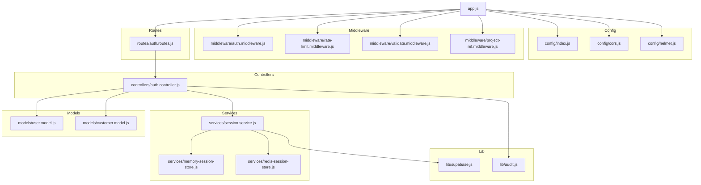

**Diagram sources**
- [app.js:1-88](file://apps/server/app.js#L1-L88)
- [index.js:1-117](file://apps/server/config/index.js#L1-L117)
- [cors.js:1-36](file://apps/server/config/cors.js#L1-L36)
- [helmet.js:1-28](file://apps/server/config/helmet.js#L1-L28)
- [auth.routes.js:1-37](file://apps/server/routes/auth.routes.js#L1-L37)
- [auth.controller.js:1-321](file://apps/server/controllers/auth.controller.js#L1-L321)
- [session.service.js:1-180](file://apps/server/services/session.service.js#L1-L180)
- [memory-session-store.js:1-46](file://apps/server/services/memory-session-store.js#L1-L46)
- [redis-session-store.js:1-37](file://apps/server/services/redis-session-store.js#L1-L37)
- [user.model.js:1-64](file://apps/server/models/user.model.js#L1-L64)
- [customer.model.js:1-61](file://apps/server/models/customer.model.js#L1-L61)
- [supabase.js:1-151](file://apps/server/lib/supabase.js#L1-L151)
- [audit.js:1-35](file://apps/server/lib/audit.js#L1-L35)

**Section sources**
- [app.js:1-88](file://apps/server/app.js#L1-L88)
- [index.js:1-117](file://apps/server/config/index.js#L1-L117)

## Core Components
- Multi-role authentication: Admins and customers supported with separate session cookies and JWT bearer tokens for API/mobile clients.
- Session management: Redis-backed or in-memory session store with TTLs; session IDs stored in HTTP-only cookies.
- JWT handling: Signed tokens for pre-auth and 2FA login flows; verified on protected routes.
- Authorization: Guards enforce admin/customer sessions and role-based access.
- Workspace isolation: Project reference attached via middleware to scope resources.
- Rate limiting: Global, auth-specific, payment-specific, and OTP send rate limits.
- Input validation: Zod schemas with middleware to coerce and validate request bodies.
- Supabase integration: REST wrappers for DB operations, password hashing via bcrypt, and audit logging.

**Section sources**
- [auth.middleware.js:1-123](file://apps/server/middleware/auth.middleware.js#L1-L123)
- [session.service.js:1-180](file://apps/server/services/session.service.js#L1-L180)
- [auth.controller.js:1-321](file://apps/server/controllers/auth.controller.js#L1-L321)
- [project-ref.middleware.js:1-36](file://apps/server/middleware/project-ref.middleware.js#L1-L36)
- [rate-limit.middleware.js:1-60](file://apps/server/middleware/rate-limit.middleware.js#L1-L60)
- [validate.middleware.js:1-28](file://apps/server/middleware/validate.middleware.js#L1-L28)
- [user.model.js:1-64](file://apps/server/models/user.model.js#L1-L64)
- [customer.model.js:1-61](file://apps/server/models/customer.model.js#L1-L61)
- [supabase.js:1-151](file://apps/server/lib/supabase.js#L1-L151)
- [audit.js:1-35](file://apps/server/lib/audit.js#L1-L35)

## Architecture Overview
The system enforces layered security:
- Transport and request security via Helmet and CORS.
- Identity resolution via session cookies or JWT bearer tokens.
- Authorization via role-based guards.
- Input validation and rate limiting.
- Persistent storage via Supabase with hashed passwords and audit logs.

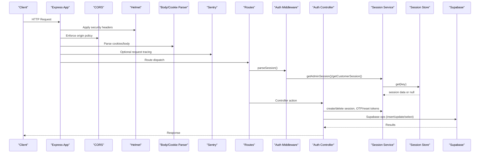

**Diagram sources**
- [app.js:18-68](file://apps/server/app.js#L18-L68)
- [cors.js:5-33](file://apps/server/config/cors.js#L5-L33)
- [helmet.js:3-25](file://apps/server/config/helmet.js#L3-L25)
- [auth.middleware.js:11-51](file://apps/server/middleware/auth.middleware.js#L11-L51)
- [session.service.js:28-62](file://apps/server/services/session.service.js#L28-L62)
- [memory-session-store.js:14-33](file://apps/server/services/memory-session-store.js#L14-L33)
- [redis-session-store.js:12-33](file://apps/server/services/redis-session-store.js#L12-L33)
- [auth.controller.js:26-81](file://apps/server/controllers/auth.controller.js#L26-L81)
- [supabase.js:107-148](file://apps/server/lib/supabase.js#L107-L148)

## Detailed Component Analysis

### Authentication Middleware and Guards
- parseSession: Reads admin_session or customer_session cookies; optionally accepts Authorization: Bearer JWT for API clients. Attaches user/customer identity and session IDs to the request.
- requireAdmin, requireCustomer, requireAnyAuth: Enforce authenticated access for admins/customers.
- requireRole: Role enforcement for admin users.
- getCallerId/getCallerRole: Helpers to derive identity and role.

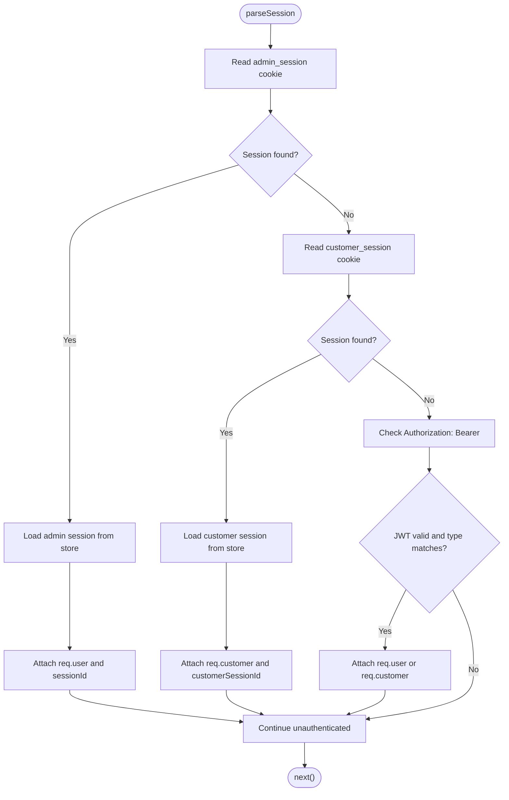

**Diagram sources**
- [auth.middleware.js:11-51](file://apps/server/middleware/auth.middleware.js#L11-L51)
- [session.service.js:35-62](file://apps/server/services/session.service.js#L35-L62)

**Section sources**
- [auth.middleware.js:11-123](file://apps/server/middleware/auth.middleware.js#L11-L123)
- [session.service.js:28-62](file://apps/server/services/session.service.js#L28-L62)

### Session Management and Storage
- Session creation and retrieval for admin and customer with TTLs.
- OTP and password reset tokens with TTLs and rate limits.
- Redis or in-memory store abstraction with expiry handling.
- Cookies: httpOnly, secure per environment, sameSite lax/none, path '/', and maxAge from config.

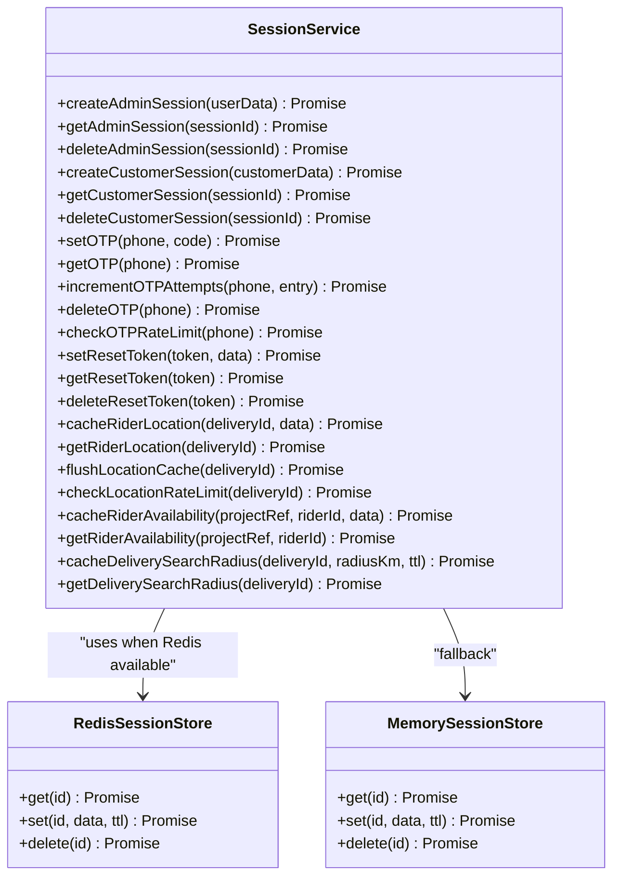

**Diagram sources**
- [session.service.js:12-24](file://apps/server/services/session.service.js#L12-L24)
- [redis-session-store.js:7-33](file://apps/server/services/redis-session-store.js#L7-L33)
- [memory-session-store.js:7-43](file://apps/server/services/memory-session-store.js#L7-L43)

**Section sources**
- [session.service.js:28-180](file://apps/server/services/session.service.js#L28-L180)
- [redis-session-store.js:1-37](file://apps/server/services/redis-session-store.js#L1-L37)
- [memory-session-store.js:1-46](file://apps/server/services/memory-session-store.js#L1-L46)
- [auth.controller.js:17-22](file://apps/server/controllers/auth.controller.js#L17-L22)

### JWT Token Handling and 2FA
- Pre-authentication flow: Admin login returns a short-lived JWT with step='totp'.
- 2FA verification: TOTP token validated against stored secret; successful 2FA yields admin session cookie.
- Bearer tokens: Verified on protected routes to attach identity.

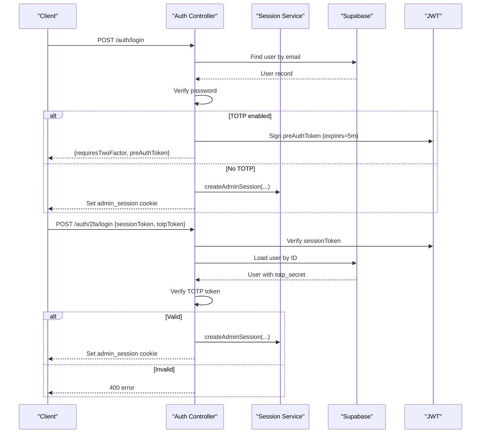

**Diagram sources**
- [auth.controller.js:26-63](file://apps/server/controllers/auth.controller.js#L26-L63)
- [auth.controller.js:279-313](file://apps/server/controllers/auth.controller.js#L279-L313)
- [auth.middleware.js:34-45](file://apps/server/middleware/auth.middleware.js#L34-L45)

**Section sources**
- [auth.controller.js:37-45](file://apps/server/controllers/auth.controller.js#L37-L45)
- [auth.controller.js:279-313](file://apps/server/controllers/auth.controller.js#L279-L313)
- [auth.middleware.js:34-45](file://apps/server/middleware/auth.middleware.js#L34-L45)

### Authorization and Role-Based Access Control
- requireAdmin: Enforce admin session.
- requireRole: Enforce specific admin roles.
- requireCustomer: Enforce customer session.
- requireAnyAuth: Enforce either admin or customer.
- getCallerId/getCallerRole: Helpers for downstream authorization logic.

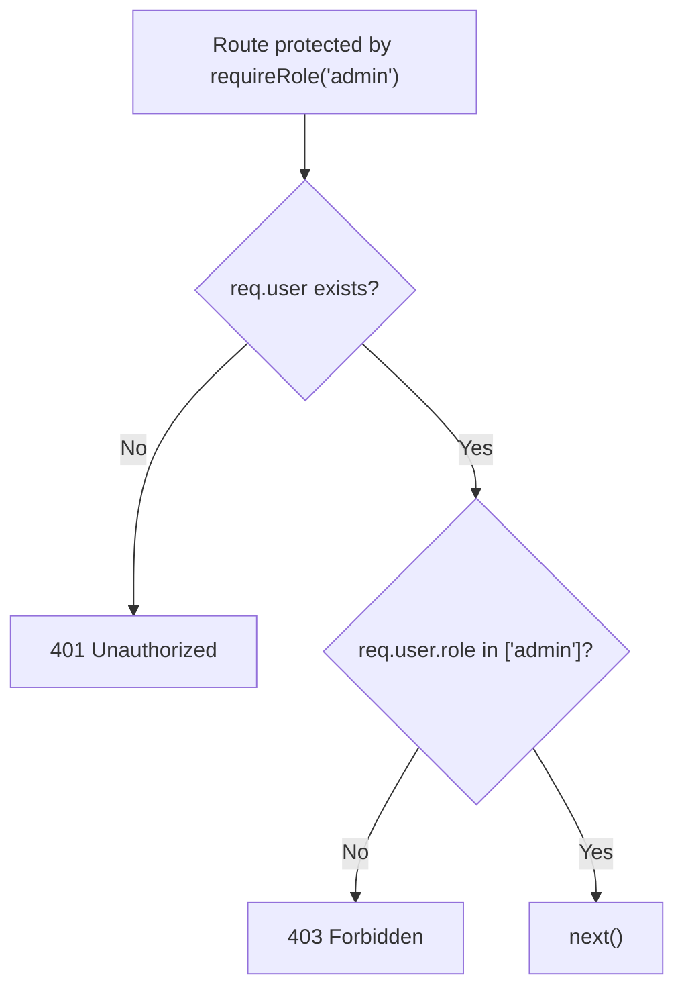

**Diagram sources**
- [auth.middleware.js:66-76](file://apps/server/middleware/auth.middleware.js#L66-L76)

**Section sources**
- [auth.middleware.js:56-112](file://apps/server/middleware/auth.middleware.js#L56-L112)

### Workspace Isolation with Project Reference
- attachProjectRef: Derives projectRef from route params, session, header, or query (public routes only).
- requireProjectRef: Enforces presence of projectRef for protected routes.

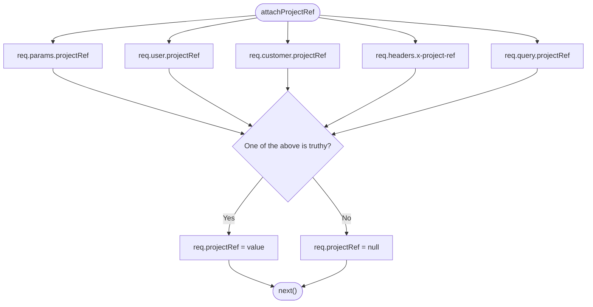

**Diagram sources**
- [project-ref.middleware.js:13-23](file://apps/server/middleware/project-ref.middleware.js#L13-L23)

**Section sources**
- [project-ref.middleware.js:13-36](file://apps/server/middleware/project-ref.middleware.js#L13-L36)

### Rate Limiting Mechanisms
- Global limiter: 100 requests/minute per IP across /api/*.
- Auth limiter: 20 requests/minute per IP for auth routes.
- Payment limiter: 30 requests/minute per IP for payment routes.
- OTP send limiter: 3 requests per phone per 15 minutes using phone as key.

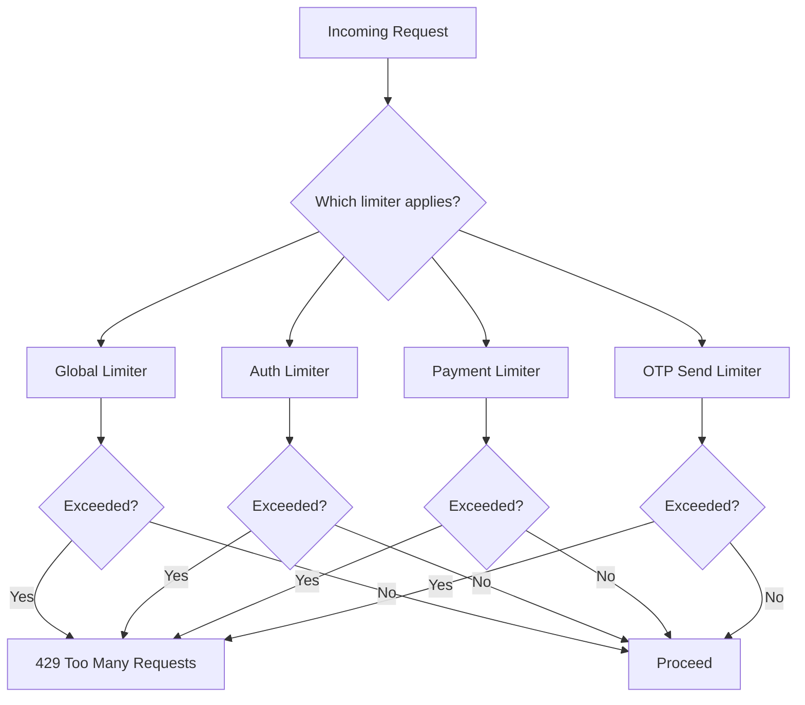

**Diagram sources**
- [rate-limit.middleware.js:16-57](file://apps/server/middleware/rate-limit.middleware.js#L16-L57)
- [auth.routes.js:13-29](file://apps/server/routes/auth.routes.js#L13-L29)

**Section sources**
- [rate-limit.middleware.js:13-58](file://apps/server/middleware/rate-limit.middleware.js#L13-L58)
- [auth.routes.js:12-34](file://apps/server/routes/auth.routes.js#L12-L34)

### Input Validation
- Zod schemas define strict validation for each endpoint.
- validate middleware parses, coerces, and replaces request body/query/params; returns structured 400 errors on failure.

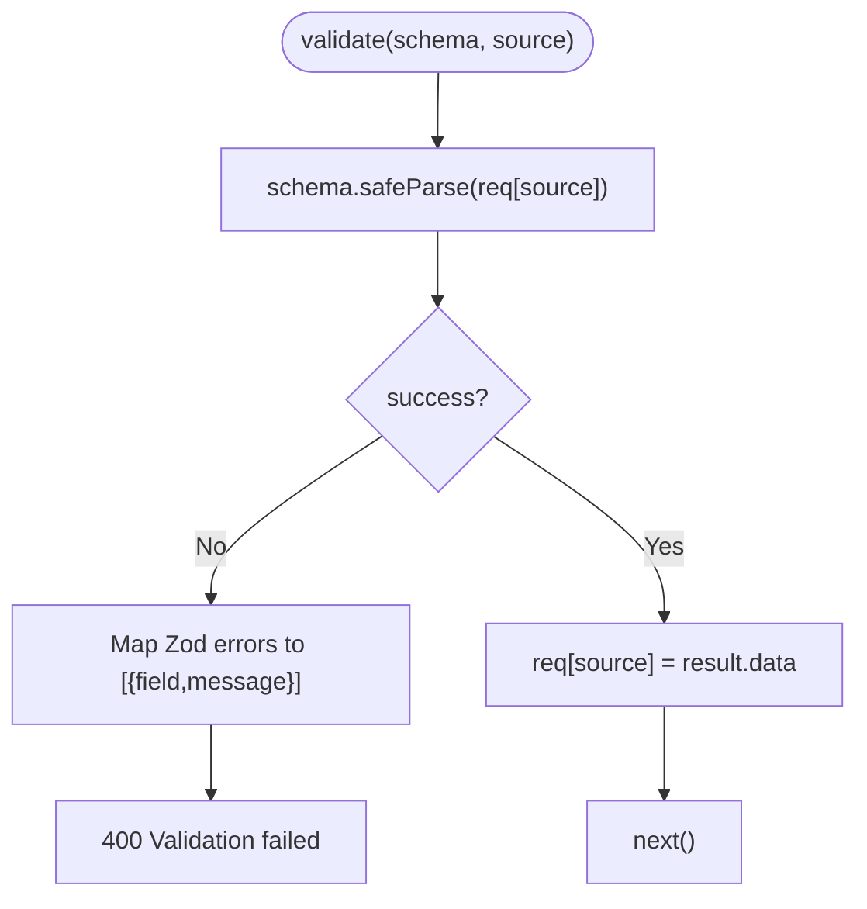

**Diagram sources**
- [validate.middleware.js:9-25](file://apps/server/middleware/validate.middleware.js#L9-L25)
- [auth.validator.js:5-50](file://apps/server/validators/auth.validator.js#L5-L50)

**Section sources**
- [validate.middleware.js:1-28](file://apps/server/middleware/validate.middleware.js#L1-L28)
- [auth.validator.js:1-63](file://apps/server/validators/auth.validator.js#L1-L63)

### Supabase Integration
- Supabase REST wrapper: fetch helper, SQL execution via Management API, filter builder, convenience CRUD helpers.
- User model: bcrypt password hashing, password updates, TOTP enable/disable, sanitization.
- Customer model: find/create, profile updates, address management via Supabase helpers.
- Audit logging: writes to audit_log table without failing the request.

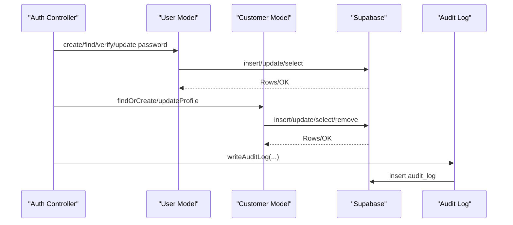

**Diagram sources**
- [user.model.js:25-49](file://apps/server/models/user.model.js#L25-L49)
- [customer.model.js:16-31](file://apps/server/models/customer.model.js#L16-L31)
- [supabase.js:107-148](file://apps/server/lib/supabase.js#L107-L148)
- [audit.js:18-32](file://apps/server/lib/audit.js#L18-L32)

**Section sources**
- [supabase.js:26-151](file://apps/server/lib/supabase.js#L26-L151)
- [user.model.js:25-61](file://apps/server/models/user.model.js#L25-L61)
- [customer.model.js:16-58](file://apps/server/models/customer.model.js#L16-L58)
- [audit.js:18-32](file://apps/server/lib/audit.js#L18-L32)

### Security Middleware and Configuration
- Helmet: Content-Security-Policy, referrer-policy, cross-origin policies tailored for Stripe, Supabase, and Google Maps.
- CORS: Origin allowlist with development exceptions; credentials allowed; preflight caching.
- Trust proxy: Enabled in production to resolve real client IPs for rate limiting.
- Sentry: Optional APM and error reporting.

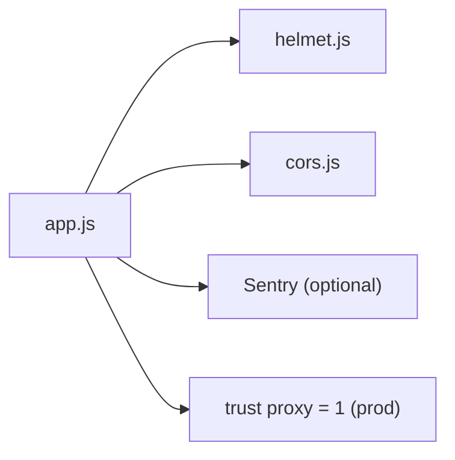

**Diagram sources**
- [app.js:18-65](file://apps/server/app.js#L18-L65)
- [helmet.js:3-25](file://apps/server/config/helmet.js#L3-L25)
- [cors.js:5-33](file://apps/server/config/cors.js#L5-L33)
- [index.js:14](file://apps/server/config/index.js#L14)

**Section sources**
- [app.js:18-65](file://apps/server/app.js#L18-L65)
- [helmet.js:1-28](file://apps/server/config/helmet.js#L1-L28)
- [cors.js:1-36](file://apps/server/config/cors.js#L1-L36)
- [index.js:14](file://apps/server/config/index.js#L14)

## Dependency Analysis
- Controllers depend on services for session and OTP management and on models for persistence.
- Services depend on the session store abstraction and Supabase for database operations.
- Middleware depends on configuration for limits and JWT secrets.
- Routes mount rate limiters and validators before controller actions.

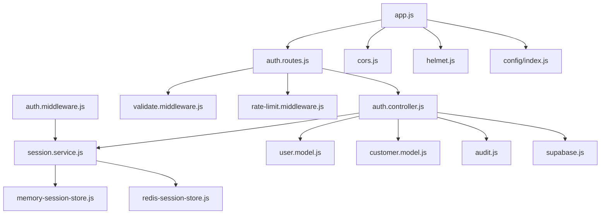

**Diagram sources**
- [auth.controller.js:1-321](file://apps/server/controllers/auth.controller.js#L1-L321)
- [session.service.js:1-180](file://apps/server/services/session.service.js#L1-L180)
- [memory-session-store.js:1-46](file://apps/server/services/memory-session-store.js#L1-L46)
- [redis-session-store.js:1-37](file://apps/server/services/redis-session-store.js#L1-L37)
- [user.model.js:1-64](file://apps/server/models/user.model.js#L1-L64)
- [customer.model.js:1-61](file://apps/server/models/customer.model.js#L1-L61)
- [audit.js:1-35](file://apps/server/lib/audit.js#L1-L35)
- [supabase.js:1-151](file://apps/server/lib/supabase.js#L1-L151)
- [auth.routes.js:1-37](file://apps/server/routes/auth.routes.js#L1-L37)
- [validate.middleware.js:1-28](file://apps/server/middleware/validate.middleware.js#L1-L28)
- [rate-limit.middleware.js:1-60](file://apps/server/middleware/rate-limit.middleware.js#L1-L60)
- [auth.middleware.js:1-123](file://apps/server/middleware/auth.middleware.js#L1-L123)
- [app.js:1-88](file://apps/server/app.js#L1-L88)
- [cors.js:1-36](file://apps/server/config/cors.js#L1-L36)
- [helmet.js:1-28](file://apps/server/config/helmet.js#L1-L28)
- [index.js:1-117](file://apps/server/config/index.js#L1-L117)

**Section sources**
- [auth.controller.js:1-321](file://apps/server/controllers/auth.controller.js#L1-L321)
- [auth.routes.js:1-37](file://apps/server/routes/auth.routes.js#L1-L37)
- [auth.middleware.js:1-123](file://apps/server/middleware/auth.middleware.js#L1-L123)
- [session.service.js:1-180](file://apps/server/services/session.service.js#L1-L180)

## Performance Considerations
- Use Redis-backed session store in production for horizontal scaling and TTL efficiency.
- Tune rate limiter windows and max values based on traffic patterns.
- Keep JWT secret and session secret strong and rotated periodically.
- Cache frequently accessed data (e.g., rider availability) with appropriate TTLs to reduce DB load.
- Monitor audit log writes to ensure they do not become a bottleneck.

[No sources needed since this section provides general guidance]

## Troubleshooting Guide
Common issues and resolutions:
- Authentication failures
  - Verify cookies are set with correct domain/path and SameSite/Secure flags per environment.
  - Confirm Authorization: Bearer tokens are signed with the configured JWT secret.
  - Check that parseSession is applied before requireAdmin/requireCustomer.
- 2FA login errors
  - Ensure pre-auth token is recent and valid.
  - Confirm TOTP token matches the user’s stored secret.
- OTP issues
  - Check OTP send rate limit key generation using phone number.
  - Verify OTP attempts increment and expiration align with config.
- Session not found
  - Confirm session store connectivity (Redis) and keyspace.
  - Validate TTLs and pruning behavior.
- CORS errors
  - Ensure origin is in ALLOWED_ORIGINS or development localhost is permitted.
  - Confirm credentials: true and exposedHeaders include X-Request-Id.
- Helmet CSP issues
  - Review connectSrc allowing Supabase, Stripe, and Google Maps domains.
  - Disable Cross-Origin Embedder Policy only for Stripe iframes as configured.
- Sentry not capturing traces
  - Verify DSN and Express handler compatibility for the installed version.

**Section sources**
- [auth.middleware.js:11-51](file://apps/server/middleware/auth.middleware.js#L11-L51)
- [auth.controller.js:148-186](file://apps/server/controllers/auth.controller.js#L148-L186)
- [session.service.js:85-92](file://apps/server/services/session.service.js#L85-L92)
- [cors.js:5-33](file://apps/server/config/cors.js#L5-L33)
- [helmet.js:3-25](file://apps/server/config/helmet.js#L3-L25)
- [app.js:47-65](file://apps/server/app.js#L47-L65)

## Conclusion
Delivio’s authentication system combines robust session management, JWT-based API support, strict input validation, layered rate limiting, and environment-aware security headers. Supabase underpins identity and audit capabilities, while Redis ensures scalable session persistence. The project reference middleware enables workspace isolation. Together, these components deliver a secure, maintainable, and extensible foundation for multi-role access control.

[No sources needed since this section summarizes without analyzing specific files]

## Appendices

### Authentication Flow Diagrams

#### Admin Login and 2FA Flow
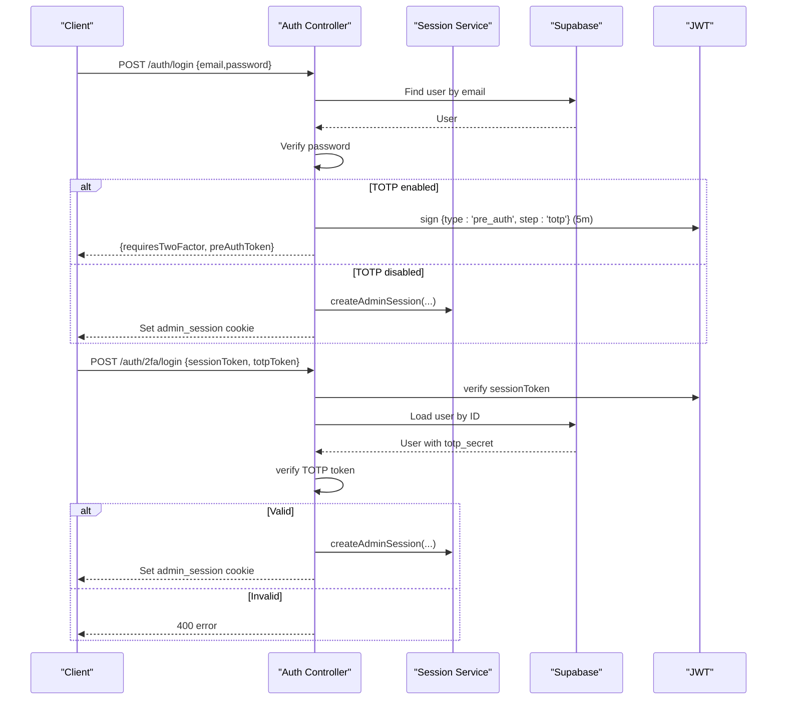

**Diagram sources**
- [auth.controller.js:26-63](file://apps/server/controllers/auth.controller.js#L26-L63)
- [auth.controller.js:279-313](file://apps/server/controllers/auth.controller.js#L279-L313)

#### Customer OTP Flow
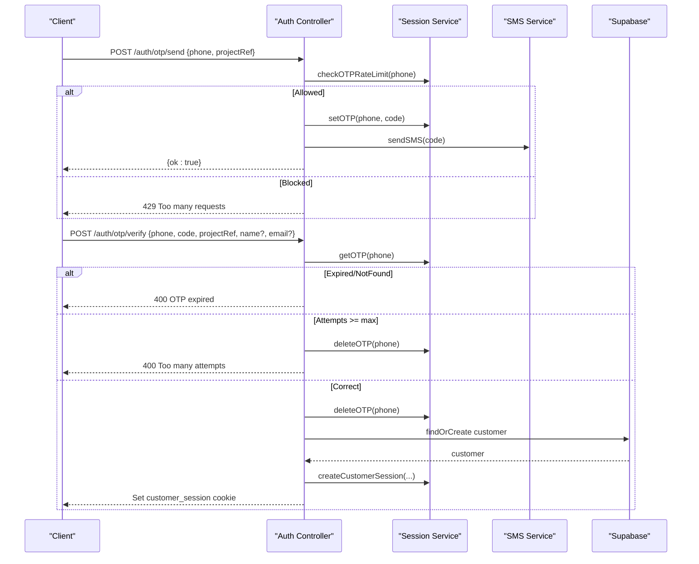

**Diagram sources**
- [auth.controller.js:144-214](file://apps/server/controllers/auth.controller.js#L144-L214)
- [session.service.js:85-92](file://apps/server/services/session.service.js#L85-L92)

#### Session Lifecycle Management
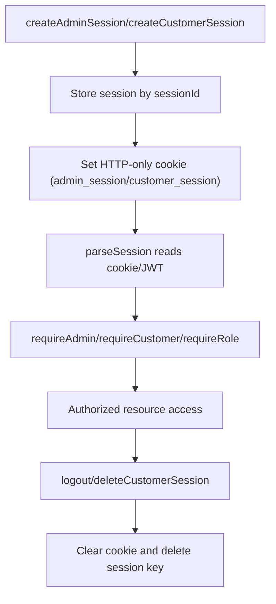

**Diagram sources**
- [session.service.js:28-62](file://apps/server/services/session.service.js#L28-L62)
- [auth.controller.js:65-75](file://apps/server/controllers/auth.controller.js#L65-L75)
- [auth.controller.js:222-232](file://apps/server/controllers/auth.controller.js#L222-L232)
- [auth.middleware.js:11-51](file://apps/server/middleware/auth.middleware.js#L11-L51)