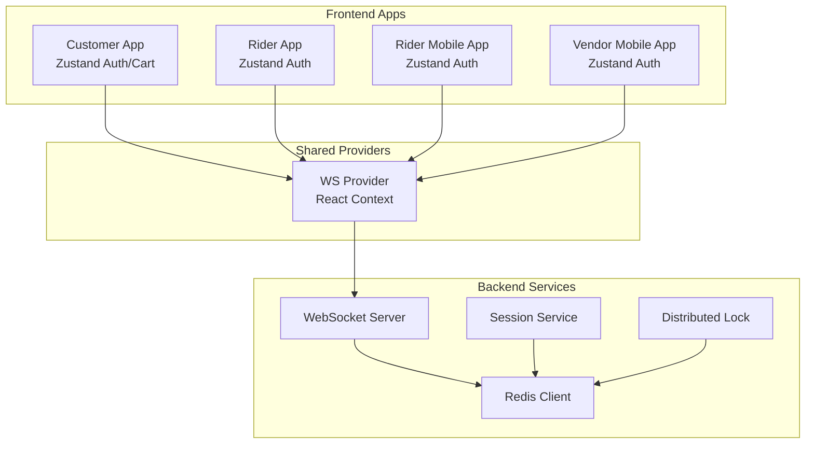
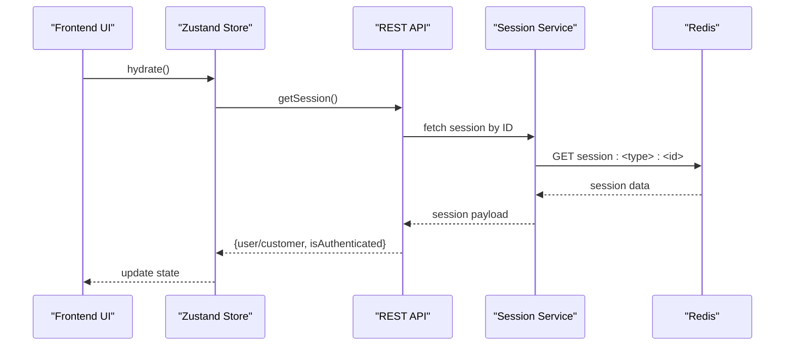
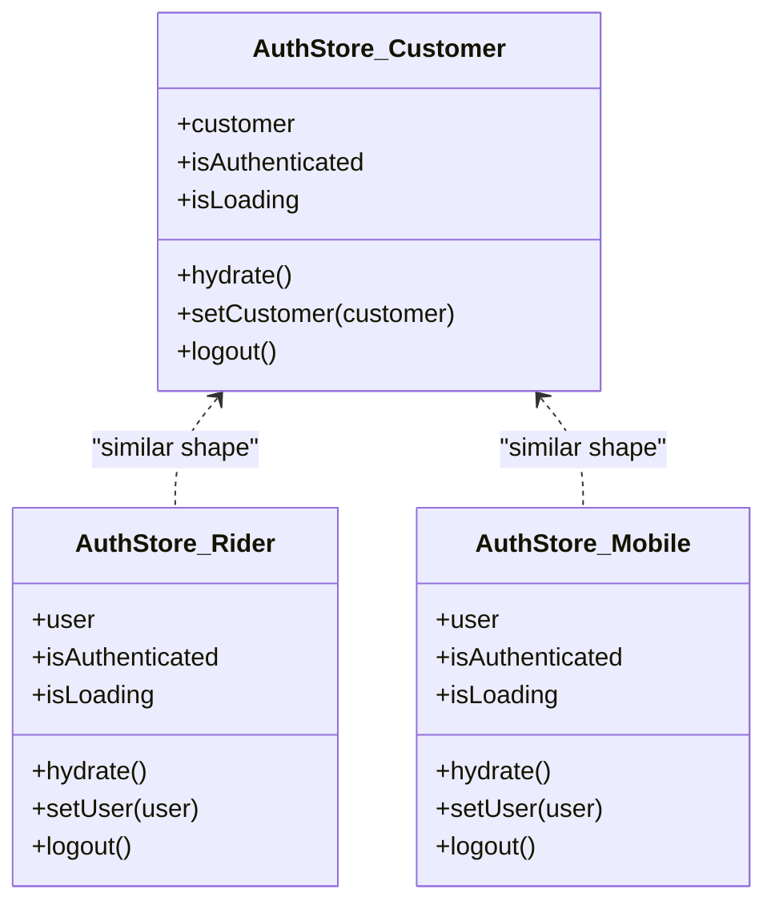
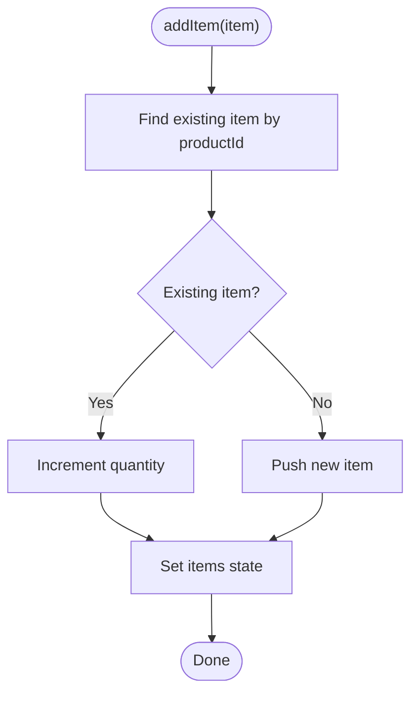
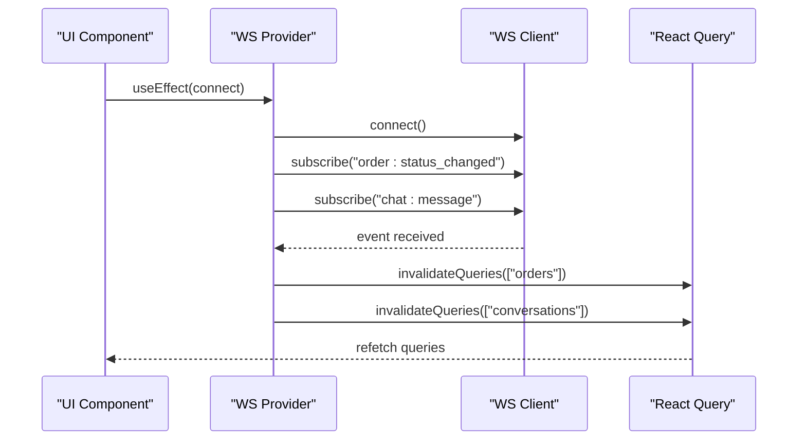
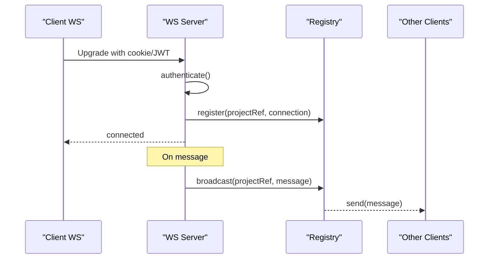
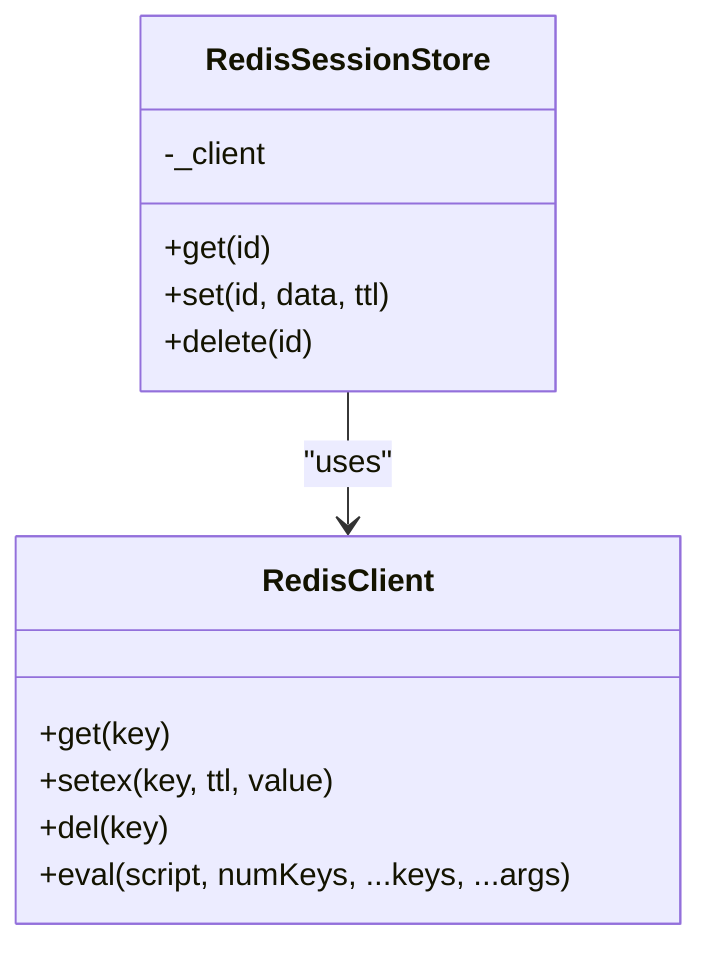
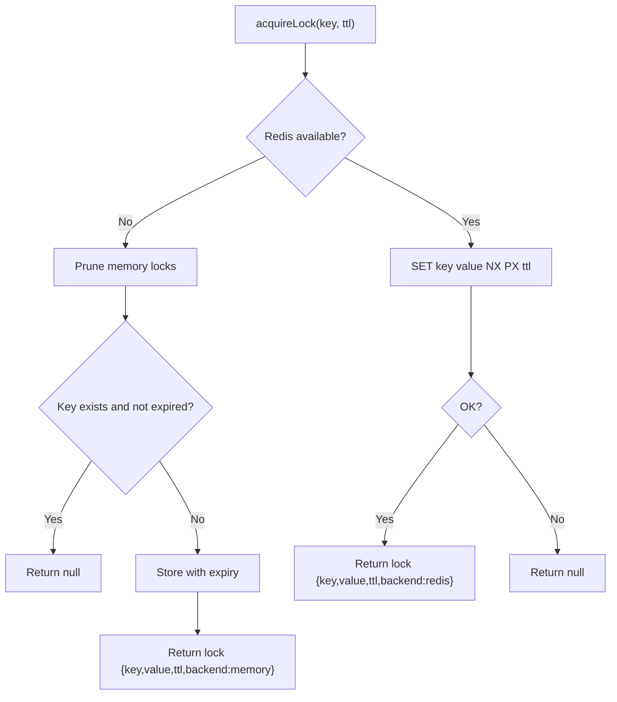
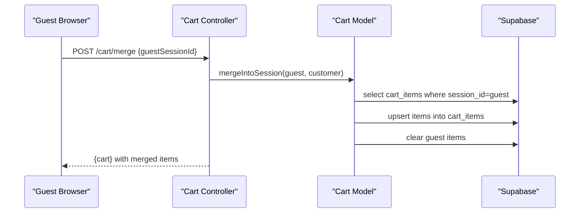
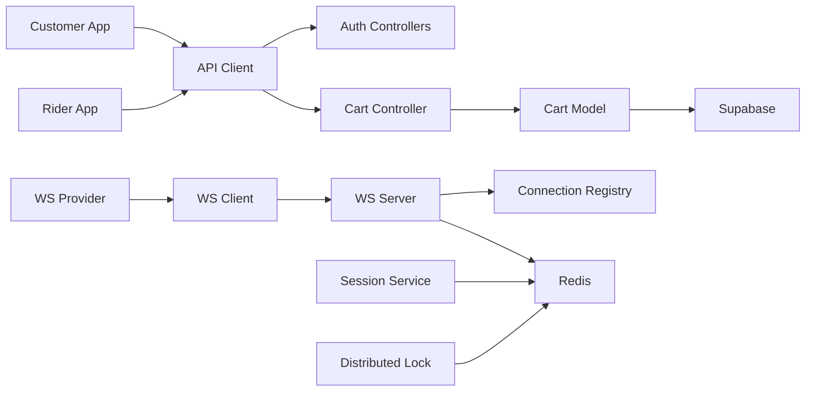

# State Management

<cite>
**Referenced Files in This Document**
- [auth-store.ts](file://apps/customer/src/stores/auth-store.ts)
- [cart-store.ts](file://apps/customer/src/stores/cart-store.ts)
- [auth-store.ts](file://apps/rider/src/stores/auth-store.ts)
- [auth-store.ts](file://apps/rider-mobile/src/stores/auth-store.ts)
- [auth-store.ts](file://apps/vendor-mobile/src/stores/auth-store.ts)
- [ws-provider.tsx](file://apps/customer/src/providers/ws-provider.tsx)
- [ws-provider.tsx](file://apps/rider/src/providers/ws-provider.tsx)
- [ws-server.js](file://apps/server/websocket/ws-server.js)
- [redis.js](file://apps/server/lib/redis.js)
- [lock.js](file://apps/server/lib/lock.js)
- [session.service.js](file://apps/server/services/session.service.js)
- [redis-session-store.js](file://apps/server/services/redis-session-store.js)
- [api.ts](file://apps/customer/src/lib/api.ts)
- [api.ts](file://apps/rider/src/lib/api.ts)
- [cart.controller.js](file://apps/server/controllers/cart.controller.js)
- [cart.model.js](file://apps/server/models/cart.model.js)
</cite>

## Table of Contents
1. [Introduction](#introduction)
2. [Project Structure](#project-structure)
3. [Core Components](#core-components)
4. [Architecture Overview](#architecture-overview)
5. [Detailed Component Analysis](#detailed-component-analysis)
6. [Dependency Analysis](#dependency-analysis)
7. [Performance Considerations](#performance-considerations)
8. [Troubleshooting Guide](#troubleshooting-guide)
9. [Conclusion](#conclusion)
10. [Appendices](#appendices)

## Introduction
This document explains the Delivio state management architecture with a focus on:
- Zustand stores for authentication and cart state
- Cross-application state synchronization via WebSocket subscriptions
- Persistence strategies for cart and session data
- Authentication state hydration and logout flows
- Real-time updates and event-driven invalidation
- Redis-backed session storage and distributed locking
- State hydration patterns, subscription mechanisms, and performance optimizations
- Debugging, error handling, and state migration strategies

## Project Structure
Delivio organizes state management across multiple applications:
- Frontend Zustand stores for authentication and cart
- WebSocket provider for real-time subscriptions
- Backend services for session storage, Redis connectivity, and distributed locks
- Cart persistence via server-side sessions and database models

**Diagram sources**
- [auth-store.ts:1-48](file://apps/customer/src/stores/auth-store.ts#L1-L48)
- [cart-store.ts:1-83](file://apps/customer/src/stores/cart-store.ts#L1-L83)
- [ws-provider.tsx:1-86](file://apps/customer/src/providers/ws-provider.tsx#L1-L86)
- [ws-server.js:1-237](file://apps/server/websocket/ws-server.js#L1-L237)
- [redis.js:1-42](file://apps/server/lib/redis.js#L1-L42)
- [session.service.js:1-180](file://apps/server/services/session.service.js#L1-L180)
- [lock.js:1-62](file://apps/server/lib/lock.js#L1-L62)

**Section sources**
- [auth-store.ts:1-48](file://apps/customer/src/stores/auth-store.ts#L1-L48)
- [cart-store.ts:1-83](file://apps/customer/src/stores/cart-store.ts#L1-L83)
- [ws-provider.tsx:1-86](file://apps/customer/src/providers/ws-provider.tsx#L1-L86)
- [ws-server.js:1-237](file://apps/server/websocket/ws-server.js#L1-L237)
- [redis.js:1-42](file://apps/server/lib/redis.js#L1-L42)
- [session.service.js:1-180](file://apps/server/services/session.service.js#L1-L180)
- [lock.js:1-62](file://apps/server/lib/lock.js#L1-L62)

## Core Components
- Authentication Zustand stores: hydrate session on mount, set user state, and handle logout
- Cart Zustand store: local persistence with localStorage fallback, item operations, totals
- WebSocket provider: connect to backend, subscribe to events, invalidate React Query caches
- Backend session service: Redis or in-memory session store, OTP, reset tokens, location caching
- Redis client: connection lifecycle, retries, logging
- Distributed locks: Redis-backed atomic locks with Lua scripting for safety

**Section sources**
- [auth-store.ts:1-48](file://apps/customer/src/stores/auth-store.ts#L1-L48)
- [cart-store.ts:1-83](file://apps/customer/src/stores/cart-store.ts#L1-L83)
- [ws-provider.tsx:1-86](file://apps/customer/src/providers/ws-provider.tsx#L1-L86)
- [session.service.js:1-180](file://apps/server/services/session.service.js#L1-L180)
- [redis.js:1-42](file://apps/server/lib/redis.js#L1-L42)
- [lock.js:1-62](file://apps/server/lib/lock.js#L1-L62)

## Architecture Overview
The state architecture combines client-side Zustand stores with server-side persistence and real-time synchronization:
- Authentication: hydrated from backend session APIs; logout clears backend session and local state
- Cart: persisted locally with localStorage fallback; server merges guest carts on login
- Real-time: WebSocket subscriptions trigger React Query invalidation for live updates
- Shared state: Redis-backed session store and locks enable multi-process and multi-instance deployments

**Diagram sources**
- [auth-store.ts:19-34](file://apps/customer/src/stores/auth-store.ts#L19-L34)
- [api.ts:1-11](file://apps/customer/src/lib/api.ts#L1-L11)
- [session.service.js:35-38](file://apps/server/services/session.service.js#L35-L38)
- [redis.js:8-39](file://apps/server/lib/redis.js#L8-L39)

## Detailed Component Analysis

### Authentication Stores (Customer, Rider, Mobile)
- Responsibilities:
  - Hydrate session on startup by calling backend APIs
  - Toggle authentication state and loading flags
  - Logout clears backend session and resets local state
- Patterns:
  - Separate user/customer payload typing per app
  - Consistent hydration and logout signatures across apps
  - Mobile apps persist session tokens securely and clear on logout

**Diagram sources**
- [auth-store.ts:5-12](file://apps/customer/src/stores/auth-store.ts#L5-L12)
- [auth-store.ts:5-12](file://apps/rider/src/stores/auth-store.ts#L5-L12)
- [auth-store.ts:6-13](file://apps/rider-mobile/src/stores/auth-store.ts#L6-L13)
- [auth-store.ts:6-13](file://apps/vendor-mobile/src/stores/auth-store.ts#L6-L13)

**Section sources**
- [auth-store.ts:1-48](file://apps/customer/src/stores/auth-store.ts#L1-L48)
- [auth-store.ts:1-48](file://apps/rider/src/stores/auth-store.ts#L1-L48)
- [auth-store.ts:1-43](file://apps/rider-mobile/src/stores/auth-store.ts#L1-L43)
- [auth-store.ts:1-43](file://apps/vendor-mobile/src/stores/auth-store.ts#L1-L43)

### Cart Store (Customer Web)
- Responsibilities:
  - Local cart persistence with localStorage fallback
  - Item operations: add, update quantity, remove, clear
  - Computed totals and counts
- Persistence:
  - Uses Zustand persist middleware with JSON storage abstraction
  - Safe storage guard handles SSR and browser environments

**Diagram sources**
- [cart-store.ts:37-52](file://apps/customer/src/stores/cart-store.ts#L37-L52)

**Section sources**
- [cart-store.ts:1-83](file://apps/customer/src/stores/cart-store.ts#L1-L83)

### WebSocket Provider and Subscriptions
- Responsibilities:
  - Establish WebSocket connection to backend
  - Subscribe to domain-specific events
  - Invalidate React Query caches on event receipt to keep UI in sync
- Event coverage:
  - Customer app: order status, rejection, delays, chat messages
  - Rider app: delivery requests, order status, chat messages

**Diagram sources**
- [ws-provider.tsx:27-53](file://apps/customer/src/providers/ws-provider.tsx#L27-L53)
- [ws-provider.tsx:27-50](file://apps/rider/src/providers/ws-provider.tsx#L27-L50)

**Section sources**
- [ws-provider.tsx:1-86](file://apps/customer/src/providers/ws-provider.tsx#L1-L86)
- [ws-provider.tsx:1-83](file://apps/rider/src/providers/ws-provider.tsx#L1-L83)

### WebSocket Server and Broadcasting
- Responsibilities:
  - Authenticate connections via cookies or JWT
  - Maintain connection registry per project workspace
  - Broadcast events to all connections in a project
  - Support targeted user messaging and online presence checks
- Supported events:
  - Order and delivery lifecycle events
  - Chat typing indicators

**Diagram sources**
- [ws-server.js:22-89](file://apps/server/websocket/ws-server.js#L22-L89)
- [ws-server.js:126-175](file://apps/server/websocket/ws-server.js#L126-L175)

**Section sources**
- [ws-server.js:1-237](file://apps/server/websocket/ws-server.js#L1-L237)

### Redis Integration and Session Storage
- Responsibilities:
  - Provide Redis client with retry/backoff and error logging
  - Session store abstraction: Redis or in-memory fallback
  - OTP, reset tokens, location caching, and rate limiting
- Patterns:
  - Centralized client creation with lazy connect and retry strategy
  - JSON serialization for stored values
  - TTL-aware set operations

**Diagram sources**
- [redis.js:8-39](file://apps/server/lib/redis.js#L8-L39)
- [redis-session-store.js:7-34](file://apps/server/services/redis-session-store.js#L7-L34)

**Section sources**
- [redis.js:1-42](file://apps/server/lib/redis.js#L1-L42)
- [redis-session-store.js:1-37](file://apps/server/services/redis-session-store.js#L1-L37)
- [session.service.js:12-24](file://apps/server/services/session.service.js#L12-L24)

### Distributed Locks
- Responsibilities:
  - Acquire and release locks with TTL
  - Atomic release using Lua scripting to avoid race conditions
  - Fallback to in-memory locks in development
- Usage:
  - Suitable for critical sections during cart merges or order dispatching

**Diagram sources**
- [lock.js:17-32](file://apps/server/lib/lock.js#L17-L32)

**Section sources**
- [lock.js:1-62](file://apps/server/lib/lock.js#L1-L62)

### Cart Persistence and Hydration (Server-Side)
- Responsibilities:
  - Guest cart session via cookie
  - Server-side cart model with upsert and merge logic
  - Merge guest cart into customer session on login
- Flow:
  - Create or retrieve session by ID
  - Upsert items by productId
  - Merge guest items into customer session and link to customer

**Diagram sources**
- [cart.controller.js:59-80](file://apps/server/controllers/cart.controller.js#L59-L80)
- [cart.model.js:92-106](file://apps/server/models/cart.model.js#L92-L106)

**Section sources**
- [cart.controller.js:1-83](file://apps/server/controllers/cart.controller.js#L1-L83)
- [cart.model.js:1-124](file://apps/server/models/cart.model.js#L1-L124)

## Dependency Analysis
- Frontend depends on:
  - API client for authentication and cart operations
  - WebSocket client for real-time updates
- Backend depends on:
  - Redis for session storage and locks
  - Supabase for cart persistence
  - JWT and cookies for authentication

**Diagram sources**
- [api.ts:1-11](file://apps/customer/src/lib/api.ts#L1-L11)
- [api.ts:1-11](file://apps/rider/src/lib/api.ts#L1-L11)
- [cart.controller.js:1-83](file://apps/server/controllers/cart.controller.js#L1-L83)
- [cart.model.js:1-124](file://apps/server/models/cart.model.js#L1-L124)
- [ws-provider.tsx:1-86](file://apps/customer/src/providers/ws-provider.tsx#L1-L86)
- [ws-server.js:1-237](file://apps/server/websocket/ws-server.js#L1-L237)
- [redis.js:1-42](file://apps/server/lib/redis.js#L1-L42)
- [session.service.js:1-180](file://apps/server/services/session.service.js#L1-L180)
- [lock.js:1-62](file://apps/server/lib/lock.js#L1-L62)

**Section sources**
- [api.ts:1-11](file://apps/customer/src/lib/api.ts#L1-L11)
- [api.ts:1-11](file://apps/rider/src/lib/api.ts#L1-L11)
- [cart.controller.js:1-83](file://apps/server/controllers/cart.controller.js#L1-L83)
- [cart.model.js:1-124](file://apps/server/models/cart.model.js#L1-L124)
- [ws-provider.tsx:1-86](file://apps/customer/src/providers/ws-provider.tsx#L1-L86)
- [ws-server.js:1-237](file://apps/server/websocket/ws-server.js#L1-L237)
- [redis.js:1-42](file://apps/server/lib/redis.js#L1-L42)
- [session.service.js:1-180](file://apps/server/services/session.service.js#L1-L180)
- [lock.js:1-62](file://apps/server/lib/lock.js#L1-L62)

## Performance Considerations
- WebSocket heartbeats and cleanup:
  - Periodic ping/pong with unresponsive termination reduces stale connections
- Redis client resilience:
  - Retry strategy and reconnect-on-error minimize downtime
- Local cart operations:
  - In-memory Zustand updates are fast; localStorage fallback ensures persistence across reloads
- React Query invalidation:
  - Targeted query invalidation avoids full-page refetches
- Session storage:
  - Redis TTL and rate-limit keys prevent hotkey abuse and memory bloat

[No sources needed since this section provides general guidance]

## Troubleshooting Guide
- WebSocket authentication failures:
  - Verify cookies or JWT token presence; check server logs for authentication errors
- No real-time updates:
  - Confirm WS connection is established and subscriptions registered; ensure event types match
- Cart not persisting:
  - Check localStorage availability; confirm Zustand persist middleware initialization
- Session hydration fails:
  - Inspect backend session store availability; ensure Redis is configured or fallback is acceptable
- Lock acquisition issues:
  - Verify Redis connectivity and Lua evaluation permissions; review lock release warnings

**Section sources**
- [ws-server.js:25-39](file://apps/server/websocket/ws-server.js#L25-L39)
- [ws-provider.tsx:31-53](file://apps/customer/src/providers/ws-provider.tsx#L31-L53)
- [cart-store.ts:5-13](file://apps/customer/src/stores/cart-store.ts#L5-L13)
- [redis.js:11-14](file://apps/server/lib/redis.js#L11-L14)
- [lock.js:55-57](file://apps/server/lib/lock.js#L55-L57)

## Conclusion
Delivio’s state management blends lightweight client-side Zustand stores with robust server-side persistence and real-time synchronization. Authentication is hydrated from backend sessions, cart state persists locally with server-side merging, and WebSocket subscriptions keep clients synchronized. Redis underpins session storage and distributed locks, enabling scalable, production-ready deployments.

[No sources needed since this section summarizes without analyzing specific files]

## Appendices

### State Hydration Patterns
- Authentication hydration:
  - Call backend session endpoint on mount; set isAuthenticated and user/customer accordingly
- Cart hydration:
  - Load persisted items from localStorage; initialize empty cart if none
- Server-side cart merge:
  - On login, merge guest cart into customer session and update cookie

**Section sources**
- [auth-store.ts:19-34](file://apps/customer/src/stores/auth-store.ts#L19-L34)
- [cart-store.ts:5-13](file://apps/customer/src/stores/cart-store.ts#L5-L13)
- [cart.controller.js:59-80](file://apps/server/controllers/cart.controller.js#L59-L80)

### Subscription Mechanisms
- Event-driven invalidation:
  - Subscribe to domain events and invalidate relevant React Query keys
- Online presence:
  - Use server-side helpers to check user online status per project

**Section sources**
- [ws-provider.tsx:34-47](file://apps/customer/src/providers/ws-provider.tsx#L34-L47)
- [ws-server.js:198-206](file://apps/server/websocket/ws-server.js#L198-L206)

### Error Handling and Resilience
- Redis fallback:
  - Gracefully degrade to in-memory session store when Redis is unavailable
- Lock release warnings:
  - Log and continue on best-effort lock deletion
- WS heartbeat:
  - Detect and terminate unresponsive connections

**Section sources**
- [redis.js:11-14](file://apps/server/lib/redis.js#L11-L14)
- [lock.js:55-57](file://apps/server/lib/lock.js#L55-L57)
- [ws-server.js:74-83](file://apps/server/websocket/ws-server.js#L74-L83)

### Migration Strategies
- Cart model:
  - Maintain backward compatibility by preserving item fields and upsert logic
- Session keys:
  - Version session keys if schema evolves; provide migration steps to rename or transform keys
- WebSocket events:
  - Introduce new event types alongside legacy ones during transitions

**Section sources**
- [cart.model.js:42-66](file://apps/server/models/cart.model.js#L42-L66)
- [session.service.js:30-32](file://apps/server/services/session.service.js#L30-L32)
- [ws-server.js:152-161](file://apps/server/websocket/ws-server.js#L152-L161)