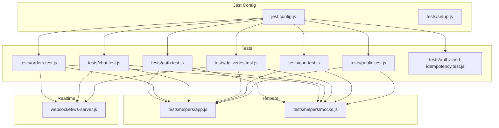
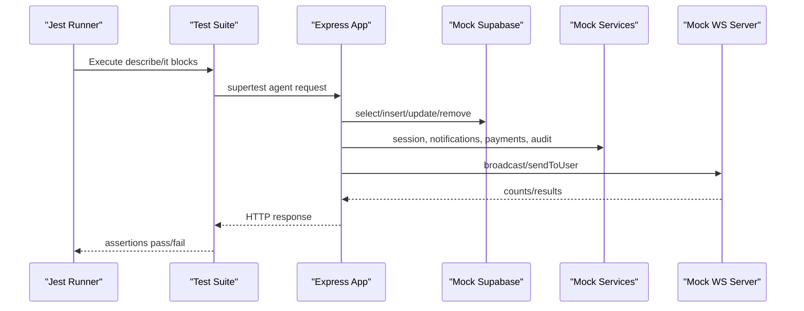
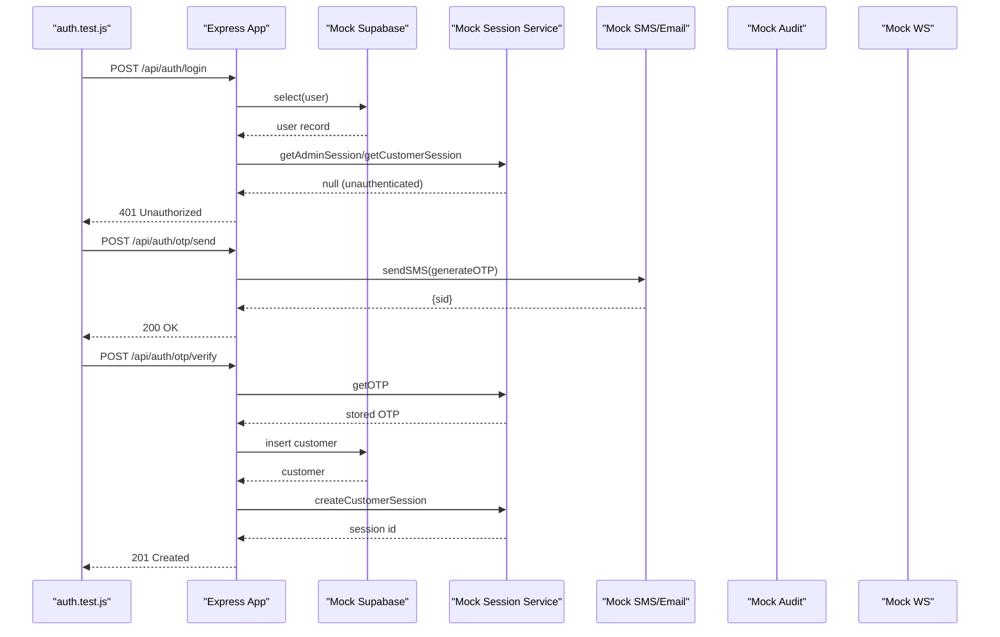
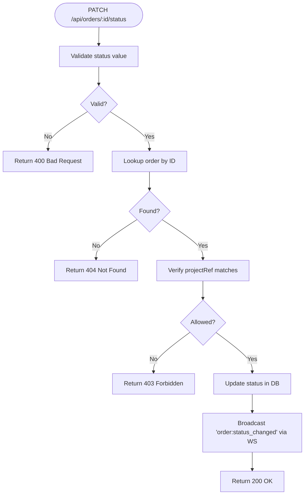
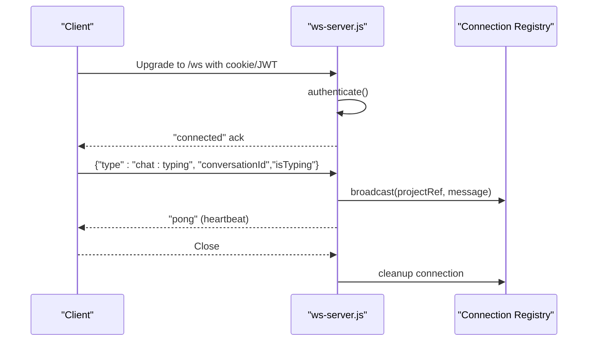
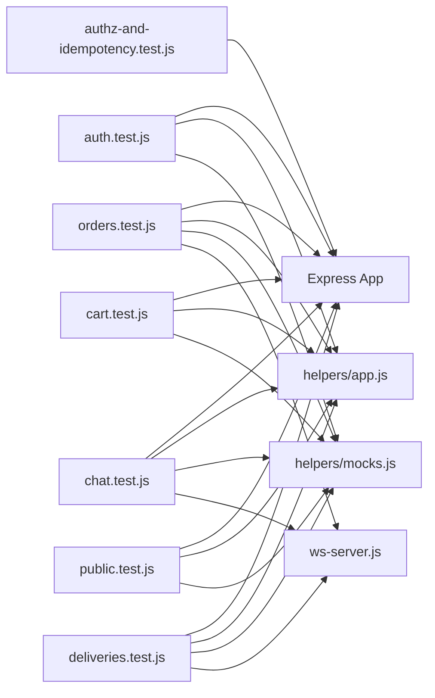

# Testing Strategy

<cite>
**Referenced Files in This Document**
- [jest.config.js](file://apps/server/jest.config.js)
- [setup.js](file://apps/server/tests/setup.js)
- [app.js](file://apps/server/tests/helpers/app.js)
- [mocks.js](file://apps/server/tests/helpers/mocks.js)
- [auth.test.js](file://apps/server/tests/auth.test.js)
- [orders.test.js](file://apps/server/tests/orders.test.js)
- [chat.test.js](file://apps/server/tests/chat.test.js)
- [deliveries.test.js](file://apps/server/tests/deliveries.test.js)
- [cart.test.js](file://apps/server/tests/cart.test.js)
- [public.test.js](file://apps/server/tests/public.test.js)
- [authz-and-idempotency.test.js](file://apps/server/tests/authz-and-idempotency.test.js)
- [ws-server.js](file://apps/server/websocket/ws-server.js)
- [ci.yml](file://.github/workflows/ci.yml)
- [deploy.yml](file://.github/workflows/deploy.yml)
- [package.json](file://apps/server/package.json)
</cite>

## Table of Contents
1. [Introduction](#introduction)
2. [Project Structure](#project-structure)
3. [Core Components](#core-components)
4. [Architecture Overview](#architecture-overview)
5. [Detailed Component Analysis](#detailed-component-analysis)
6. [Dependency Analysis](#dependency-analysis)
7. [Performance Considerations](#performance-considerations)
8. [Troubleshooting Guide](#troubleshooting-guide)
9. [Conclusion](#conclusion)
10. [Appendices](#appendices)

## Introduction
This document describes the Delivio backend testing strategy and implementation. It covers the Jest configuration, test organization, mocking strategies, unit and integration testing patterns, authentication and authorization tests, API endpoint validations, and real-time WebSocket communication tests. It also documents CI/CD pipeline integration, coverage thresholds, and best practices for test environment setup and debugging.

## Project Structure
The backend test suite resides under apps/server/tests and uses Jest as the test runner. Tests are grouped by feature area (authentication, orders, chat, deliveries, cart, public endpoints, authorization/idempotency). Shared helpers provide reusable fixtures and test app setup.

**Diagram sources**
- [jest.config.js:1-38](file://apps/server/jest.config.js#L1-L38)
- [setup.js:1-25](file://apps/server/tests/setup.js#L1-L25)
- [app.js:1-77](file://apps/server/tests/helpers/app.js#L1-L77)
- [mocks.js:1-165](file://apps/server/tests/helpers/mocks.js#L1-L165)
- [auth.test.js:1-232](file://apps/server/tests/auth.test.js#L1-L232)
- [orders.test.js:1-177](file://apps/server/tests/orders.test.js#L1-L177)
- [chat.test.js:1-150](file://apps/server/tests/chat.test.js#L1-L150)
- [deliveries.test.js:1-146](file://apps/server/tests/deliveries.test.js#L1-L146)
- [cart.test.js:1-115](file://apps/server/tests/cart.test.js#L1-L115)
- [public.test.js:1-107](file://apps/server/tests/public.test.js#L1-L107)
- [authz-and-idempotency.test.js:1-114](file://apps/server/tests/authz-and-idempotency.test.js#L1-L114)
- [ws-server.js:1-237](file://apps/server/websocket/ws-server.js#L1-L237)

**Section sources**
- [jest.config.js:1-38](file://apps/server/jest.config.js#L1-L38)
- [setup.js:1-25](file://apps/server/tests/setup.js#L1-L25)
- [app.js:1-77](file://apps/server/tests/helpers/app.js#L1-L77)
- [mocks.js:1-165](file://apps/server/tests/helpers/mocks.js#L1-L165)

## Core Components
- Jest configuration defines test environment, match patterns, setup files, coverage collection, thresholds, and reporters.
- Global test setup sets environment variables and disables optional integrations for deterministic tests.
- Test helpers provide:
  - A supertest agent factory with session injection for authenticated requests.
  - Fixture factories for domain entities and cookie helpers for session-based auth.
- Real-time WebSocket server supports connection lifecycle, authentication, broadcasting, and user targeting.

Key capabilities:
- Centralized test setup ensures consistent environment across suites.
- Mock factories and session helpers reduce boilerplate and improve readability.
- Coverage thresholds enforce quality gates for controllers, routes, models, services, and middleware.

**Section sources**
- [jest.config.js:1-38](file://apps/server/jest.config.js#L1-L38)
- [setup.js:1-25](file://apps/server/tests/setup.js#L1-L25)
- [app.js:1-77](file://apps/server/tests/helpers/app.js#L1-L77)
- [mocks.js:1-165](file://apps/server/tests/helpers/mocks.js#L1-L165)
- [ws-server.js:1-237](file://apps/server/websocket/ws-server.js#L1-L237)

## Architecture Overview
The testing architecture centers on Jest-driven HTTP API tests using supertest against the Express app. Tests mock external dependencies (database, session store, notifications, Stripe, Redis, etc.) to isolate units and simulate cross-cutting behaviors (real-time events, audit logs). Authorization and idempotency checks are validated through controlled model and service mocks.

**Diagram sources**
- [auth.test.js:1-232](file://apps/server/tests/auth.test.js#L1-L232)
- [orders.test.js:1-177](file://apps/server/tests/orders.test.js#L1-L177)
- [chat.test.js:1-150](file://apps/server/tests/chat.test.js#L1-L150)
- [deliveries.test.js:1-146](file://apps/server/tests/deliveries.test.js#L1-L146)
- [cart.test.js:1-115](file://apps/server/tests/cart.test.js#L1-L115)
- [public.test.js:1-107](file://apps/server/tests/public.test.js#L1-L107)
- [authz-and-idempotency.test.js:1-114](file://apps/server/tests/authz-and-idempotency.test.js#L1-L114)
- [ws-server.js:162-193](file://apps/server/websocket/ws-server.js#L162-L193)

## Detailed Component Analysis

### Jest Configuration and Environment
- Test environment: Node.js with setup hook loading environment variables.
- Match pattern: tests/**/*.test.js under the server app.
- Coverage: collects from controllers, routes, models, services, middleware; ignores migrations, jobs, tests, websocket, config, and logger.
- Thresholds: global minimums for lines, functions, branches, statements.
- Reporters: text, json, html.

Best practices:
- Keep setup minimal and deterministic.
- Use explicit coverage thresholds to maintain quality.
- Prefer selective mocking to avoid brittle tests.

**Section sources**
- [jest.config.js:1-38](file://apps/server/jest.config.js#L1-L38)
- [setup.js:1-25](file://apps/server/tests/setup.js#L1-L25)

### Authentication and Authorization Testing
- Validates health endpoint, login/signup/logout, session retrieval, OTP send/verify, and forgot-password flows.
- Uses mock Supabase, session service, SMS/email services, audit logging, and WS server.
- Demonstrates role-based guards and idempotent operations.

Patterns:
- Per-suite mocks declared at top of test file.
- beforeEach resets mocks and clears expectations.
- Supertest agent used to assert HTTP responses and headers.
- Session helpers inject admin/customer identities for authenticated requests.

**Diagram sources**
- [auth.test.js:1-232](file://apps/server/tests/auth.test.js#L1-L232)

**Section sources**
- [auth.test.js:1-232](file://apps/server/tests/auth.test.js#L1-L232)

### Order Management Testing
- Covers listing orders, fetching by ID, updating status, issuing refunds, and cancellations.
- Enforces multi-tenant isolation via project reference checks.
- Verifies real-time broadcast of order status changes.

Patterns:
- Mock DB queries to simulate presence/absence of entities.
- Assert WS broadcast with expected event type and payload.
- Validate Stripe integration outcomes for refunds.

**Diagram sources**
- [orders.test.js:99-128](file://apps/server/tests/orders.test.js#L99-L128)
- [ws-server.js:162-175](file://apps/server/websocket/ws-server.js#L162-L175)

**Section sources**
- [orders.test.js:1-177](file://apps/server/tests/orders.test.js#L1-L177)

### Chat and Conversations Testing
- Tests creation of conversations, sending messages, pagination, and multi-tenant isolation.
- Ensures content validation and real-time chat message broadcasting.

Patterns:
- Idempotent conversation creation returns existing conversation on subsequent calls.
- Message content length limits enforced.
- WS broadcast emits chat:message with conversation context.

**Section sources**
- [chat.test.js:1-150](file://apps/server/tests/chat.test.js#L1-L150)

### Deliveries and Rider Location Testing
- Tests rider-specific endpoints: listing deliveries, claiming assignments, reporting location, and retrieving cached location.
- Enforces rate limiting and validates WS location update broadcasts.

Patterns:
- Session mocks differentiate roles (rider/admin).
- Rate limit checks short-circuit frequent updates.
- WS broadcast emits delivery:location_update.

**Section sources**
- [deliveries.test.js:1-146](file://apps/server/tests/deliveries.test.js#L1-L146)

### Cart Functionality Testing
- Validates cart retrieval, adding items, updating quantities, and removing items.
- Ensures totals are computed correctly across multiple items.

Patterns:
- Sequential DB calls simulate session and item resolution.
- Removal path triggers database delete for zero-quantity updates.

**Section sources**
- [cart.test.js:1-115](file://apps/server/tests/cart.test.js#L1-L115)

### Public Endpoints and Security Headers
- Validates health endpoint, public table access restrictions, and route-not-found handling.
- Confirms security headers are applied.

Patterns:
- Non-authenticated access to health endpoint succeeds.
- Public routes enforce filters (e.g., orderId) to prevent mass exposure.

**Section sources**
- [public.test.js:1-107](file://apps/server/tests/public.test.js#L1-L107)

### Authorization and Idempotency Hardening
- Ensures role-based access controls and idempotent operations.
- Forces customer queries to self-only and rejects unauthorized transitions.
- Demonstrates idempotent acceptance of orders by vendors.

Patterns:
- createTestApp and session helpers inject roles and project refs.
- Model/service mocks validate enforcement points.

**Section sources**
- [authz-and-idempotency.test.js:1-114](file://apps/server/tests/authz-and-idempotency.test.js#L1-L114)

### Real-Time Communication Testing
- The WebSocket server supports connection lifecycle, authentication via cookies or JWT, typing indicators, and broadcasting to project-scoped connections.
- Tests assert broadcast counts and targeted messaging.

**Diagram sources**
- [ws-server.js:22-89](file://apps/server/websocket/ws-server.js#L22-L89)
- [ws-server.js:126-147](file://apps/server/websocket/ws-server.js#L126-L147)
- [ws-server.js:162-193](file://apps/server/websocket/ws-server.js#L162-L193)

**Section sources**
- [ws-server.js:1-237](file://apps/server/websocket/ws-server.js#L1-L237)

## Dependency Analysis
- Tests depend on:
  - Express app instantiated per test suite.
  - Mocked external systems (Supabase, session store, notifications, Stripe, audit, Redis/WS).
  - Helpers for session injection and fixture generation.
- Coverage targets controllers, routes, models, services, and middleware while excluding infrastructure and non-business logic.

**Diagram sources**
- [auth.test.js:1-232](file://apps/server/tests/auth.test.js#L1-L232)
- [orders.test.js:1-177](file://apps/server/tests/orders.test.js#L1-L177)
- [chat.test.js:1-150](file://apps/server/tests/chat.test.js#L1-L150)
- [deliveries.test.js:1-146](file://apps/server/tests/deliveries.test.js#L1-L146)
- [cart.test.js:1-115](file://apps/server/tests/cart.test.js#L1-L115)
- [public.test.js:1-107](file://apps/server/tests/public.test.js#L1-L107)
- [authz-and-idempotency.test.js:1-114](file://apps/server/tests/authz-and-idempotency.test.js#L1-L114)
- [app.js:1-77](file://apps/server/tests/helpers/app.js#L1-L77)
- [mocks.js:1-165](file://apps/server/tests/helpers/mocks.js#L1-L165)
- [ws-server.js:1-237](file://apps/server/websocket/ws-server.js#L1-L237)

**Section sources**
- [jest.config.js:10-35](file://apps/server/jest.config.js#L10-L35)

## Performance Considerations
- Mock external dependencies to avoid network latency and flakiness.
- Use beforeEach to reset mocks and minimize shared mutable state.
- Favor targeted mocks for hot paths (session, DB, WS) to keep tests fast.
- Keep test suites focused and isolated to reduce overhead.

## Troubleshooting Guide
Common issues and resolutions:
- Unstable session state:
  - Ensure beforeEach resets session mocks and clears expectations.
  - Use helper functions to inject admin/customer sessions consistently.
- Flaky WebSocket assertions:
  - Verify projectRef and message shape in broadcast calls.
  - Confirm WS mocks are properly configured in each test suite.
- Coverage gaps:
  - Add missing test cases for controller/routes/services covered by thresholds.
  - Validate that ignored paths are intentional (migrations, jobs, config).
- CI failures:
  - Confirm environment variables are set in CI workflow.
  - Ensure Redis service is healthy and reachable during tests.

**Section sources**
- [setup.js:1-25](file://apps/server/tests/setup.js#L1-L25)
- [ci.yml:46-66](file://.github/workflows/ci.yml#L46-L66)
- [jest.config.js:10-35](file://apps/server/jest.config.js#L10-L35)

## Conclusion
The Delivio backend employs a robust Jest-based testing strategy with comprehensive mocking, shared helpers, and focused coverage thresholds. Tests validate authentication flows, authorization rules, API endpoints, and real-time communication. The CI pipeline automates linting, type checking, backend tests with coverage, and Docker builds, ensuring reliable releases.

## Appendices

### CI/CD Pipeline Integration
- CI job runs linting, type checking, backend tests with coverage, and uploads artifacts.
- Deploy job runs migrations, deploys frontend to Vercel, backend to Railway, and smoke-tests health endpoint.

**Section sources**
- [ci.yml:1-88](file://.github/workflows/ci.yml#L1-L88)
- [deploy.yml:1-54](file://.github/workflows/deploy.yml#L1-L54)

### Scripts and Commands
- Backend test scripts include running Jest, watch mode, and coverage reports.

**Section sources**
- [package.json:9-16](file://apps/server/package.json#L9-L16)