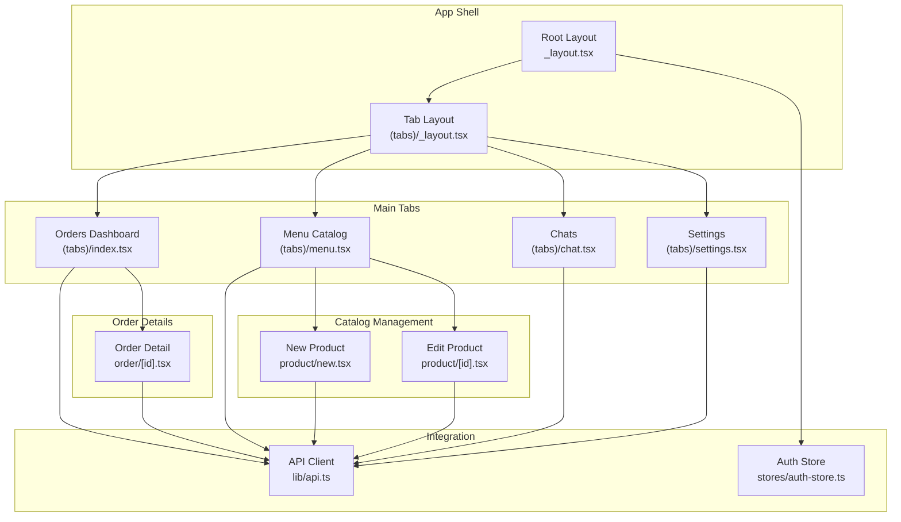
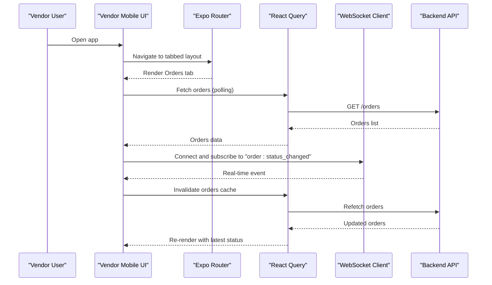
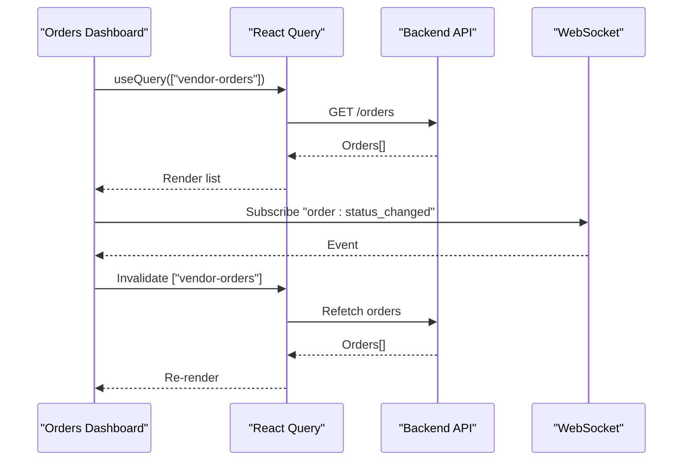
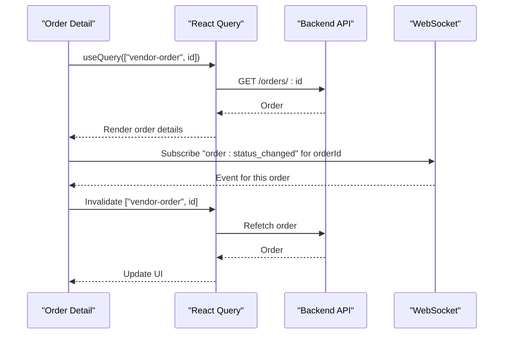
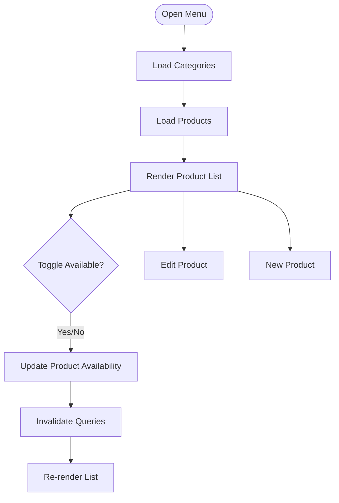
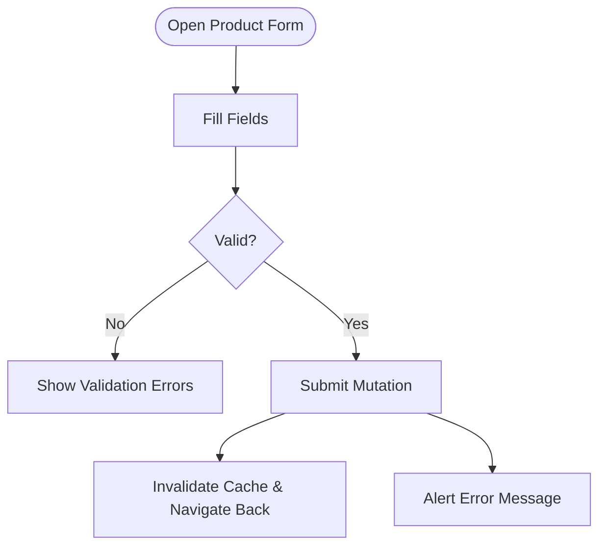
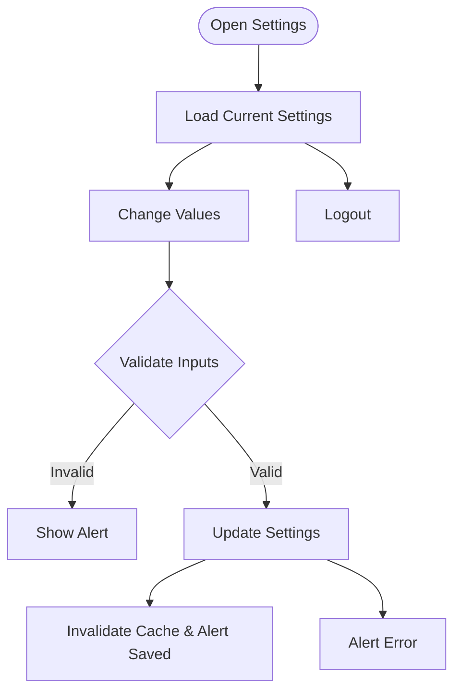
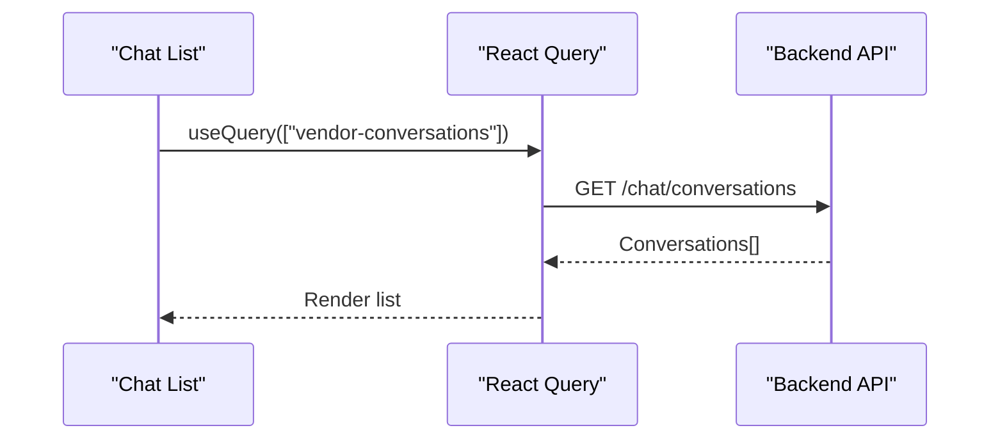
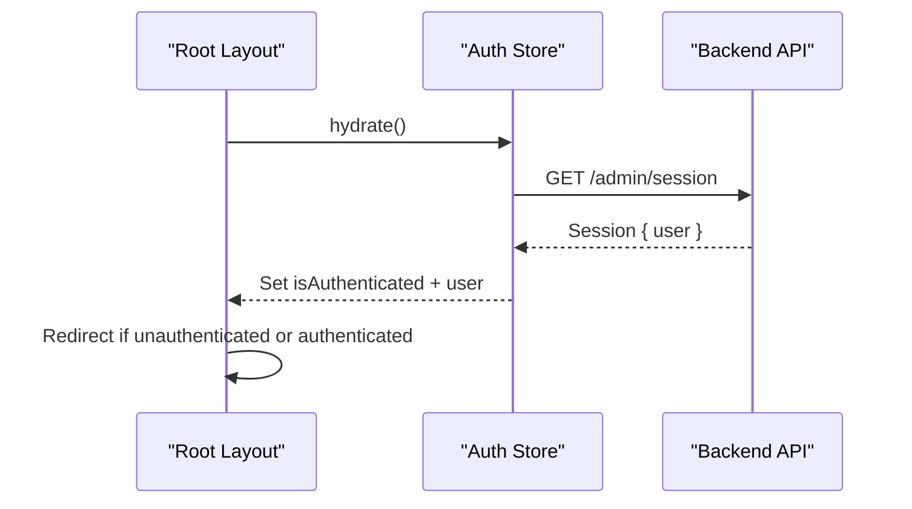
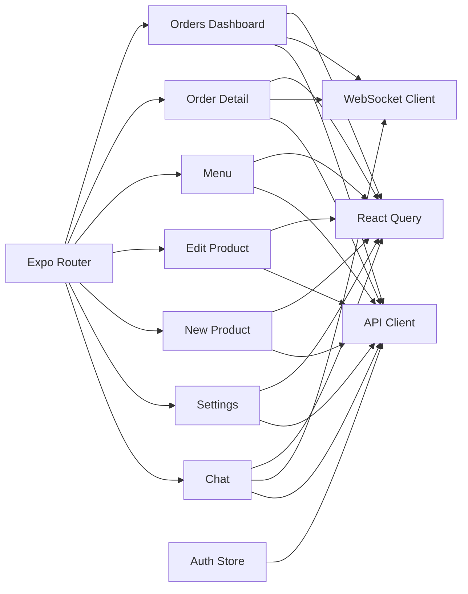

# Vendor Application

<cite>
**Referenced Files in This Document**
- [apps/vendor-mobile/src/app/_layout.tsx](file://apps/vendor-mobile/src/app/_layout.tsx)
- [apps/vendor-mobile/src/app/(tabs)/_layout.tsx](file://apps/vendor-mobile/src/app/(tabs)/_layout.tsx)
- [apps/vendor-mobile/src/app/(tabs)/index.tsx](file://apps/vendor-mobile/src/app/(tabs)/index.tsx)
- [apps/vendor-mobile/src/app/order/[id].tsx](file://apps/vendor-mobile/src/app/order/[id].tsx)
- [apps/vendor-mobile/src/app/(tabs)/menu.tsx](file://apps/vendor-mobile/src/app/(tabs)/menu.tsx)
- [apps/vendor-mobile/src/app/product/[id].tsx](file://apps/vendor-mobile/src/app/product/[id].tsx)
- [apps/vendor-mobile/src/app/product/new.tsx](file://apps/vendor-mobile/src/app/product/new.tsx)
- [apps/vendor-mobile/src/app/(tabs)/settings.tsx](file://apps/vendor-mobile/src/app/(tabs)/settings.tsx)
- [apps/vendor-mobile/src/app/(tabs)/chat.tsx](file://apps/vendor-mobile/src/app/(tabs)/chat.tsx)
- [apps/vendor-mobile/src/lib/api.ts](file://apps/vendor-mobile/src/lib/api.ts)
- [apps/vendor-mobile/src/stores/auth-store.ts](file://apps/vendor-mobile/src/stores/auth-store.ts)
</cite>

## Table of Contents
1. [Introduction](#introduction)
2. [Project Structure](#project-structure)
3. [Core Components](#core-components)
4. [Architecture Overview](#architecture-overview)
5. [Detailed Component Analysis](#detailed-component-analysis)
6. [Dependency Analysis](#dependency-analysis)
7. [Performance Considerations](#performance-considerations)
8. [Troubleshooting Guide](#troubleshooting-guide)
9. [Conclusion](#conclusion)
10. [Appendices](#appendices)

## Introduction
This document describes the vendor/mobile application for managing restaurant operations on the Delivio platform. It covers the restaurant management interface, order queue monitoring, preparation workflow, menu catalog management, pricing configuration, vendor settings, workspace configuration, real-time order notifications, rider coordination, and customer interaction features. The guide also outlines practical vendor workflows and best practices for efficient daily operations.

## Project Structure
The vendor/mobile app is built as an Expo Router-based React Native application. It organizes screens under tabbed navigation and integrates with a shared API client and WebSocket client for real-time updates. Authentication state is managed via a Zustand store, and the UI follows a consistent theming system.

**Diagram sources**
- [apps/vendor-mobile/src/app/_layout.tsx:11-36](file://apps/vendor-mobile/src/app/_layout.tsx#L11-L36)
- [apps/vendor-mobile/src/app/(tabs)/_layout.tsx](file://apps/vendor-mobile/src/app/(tabs)/_layout.tsx#L5-L51)
- [apps/vendor-mobile/src/app/(tabs)/index.tsx](file://apps/vendor-mobile/src/app/(tabs)/index.tsx#L81-L85)
- [apps/vendor-mobile/src/app/order/[id].tsx](file://apps/vendor-mobile/src/app/order/[id].tsx#L87-L91)
- [apps/vendor-mobile/src/app/(tabs)/menu.tsx](file://apps/vendor-mobile/src/app/(tabs)/menu.tsx#L28-L38)
- [apps/vendor-mobile/src/app/product/new.tsx:42-64](file://apps/vendor-mobile/src/app/product/new.tsx#L42-L64)
- [apps/vendor-mobile/src/app/product/[id].tsx](file://apps/vendor-mobile/src/app/product/[id].tsx#L63-L85)
- [apps/vendor-mobile/src/app/(tabs)/chat.tsx](file://apps/vendor-mobile/src/app/(tabs)/chat.tsx#L25-L29)
- [apps/vendor-mobile/src/app/(tabs)/settings.tsx](file://apps/vendor-mobile/src/app/(tabs)/settings.tsx#L38-L41)
- [apps/vendor-mobile/src/lib/api.ts:1-12](file://apps/vendor-mobile/src/lib/api.ts#L1-L12)
- [apps/vendor-mobile/src/stores/auth-store.ts:15-42](file://apps/vendor-mobile/src/stores/auth-store.ts#L15-L42)

**Section sources**
- [apps/vendor-mobile/src/app/_layout.tsx:11-36](file://apps/vendor-mobile/src/app/_layout.tsx#L11-L36)
- [apps/vendor-mobile/src/app/(tabs)/_layout.tsx](file://apps/vendor-mobile/src/app/(tabs)/_layout.tsx#L5-L51)
- [apps/vendor-mobile/src/lib/api.ts:1-12](file://apps/vendor-mobile/src/lib/api.ts#L1-L12)
- [apps/vendor-mobile/src/stores/auth-store.ts:15-42](file://apps/vendor-mobile/src/stores/auth-store.ts#L15-L42)

## Core Components
- Authentication and routing: Root layout handles hydration, redirects, and global providers; tab layout defines the main navigation.
- Orders dashboard: Lists incoming orders, supports acceptance/rejection, preparation start, readiness marking, and SLA extension.
- Order detail: Full order view with actions, SLA countdown, delivery info, and rider assignment controls.
- Menu catalog: Browse, filter by categories, toggle availability, and navigate to edit/create flows.
- Product management: Create/edit product details, pricing, category, image URL, description, and availability.
- Settings: Configure auto-accept, default prep time, delivery mode, delivery radius, auto-dispatch delay, and logout.
- Chat: List conversations with customers and riders, navigate to chat UI.
- API/WebSocket: Centralized clients for HTTP and real-time updates.
- Auth store: Persistent session hydration and logout.

**Section sources**
- [apps/vendor-mobile/src/app/_layout.tsx:11-36](file://apps/vendor-mobile/src/app/_layout.tsx#L11-L36)
- [apps/vendor-mobile/src/app/(tabs)/_layout.tsx](file://apps/vendor-mobile/src/app/(tabs)/_layout.tsx#L5-L51)
- [apps/vendor-mobile/src/app/(tabs)/index.tsx](file://apps/vendor-mobile/src/app/(tabs)/index.tsx#L81-L123)
- [apps/vendor-mobile/src/app/order/[id].tsx](file://apps/vendor-mobile/src/app/order/[id].tsx#L87-L163)
- [apps/vendor-mobile/src/app/(tabs)/menu.tsx](file://apps/vendor-mobile/src/app/(tabs)/menu.tsx#L28-L48)
- [apps/vendor-mobile/src/app/product/[id].tsx](file://apps/vendor-mobile/src/app/product/[id].tsx#L63-L101)
- [apps/vendor-mobile/src/app/product/new.tsx:42-64](file://apps/vendor-mobile/src/app/product/new.tsx#L42-L64)
- [apps/vendor-mobile/src/app/(tabs)/settings.tsx](file://apps/vendor-mobile/src/app/(tabs)/settings.tsx#L38-L81)
- [apps/vendor-mobile/src/app/(tabs)/chat.tsx](file://apps/vendor-mobile/src/app/(tabs)/chat.tsx#L25-L61)
- [apps/vendor-mobile/src/lib/api.ts:1-12](file://apps/vendor-mobile/src/lib/api.ts#L1-L12)
- [apps/vendor-mobile/src/stores/auth-store.ts:15-42](file://apps/vendor-mobile/src/stores/auth-store.ts#L15-L42)

## Architecture Overview
The vendor/mobile app uses a modular, screen-based architecture with:
- Navigation: Expo Router with stack and tabs.
- State: React Query for caching and optimistic updates; Zustand for auth.
- Real-time: WebSocket client for live order status updates.
- Backend: Shared API client configured per environment.

**Diagram sources**
- [apps/vendor-mobile/src/app/_layout.tsx:30-35](file://apps/vendor-mobile/src/app/_layout.tsx#L30-L35)
- [apps/vendor-mobile/src/app/(tabs)/index.tsx](file://apps/vendor-mobile/src/app/(tabs)/index.tsx#L81-L123)
- [apps/vendor-mobile/src/lib/api.ts:10-11](file://apps/vendor-mobile/src/lib/api.ts#L10-L11)

**Section sources**
- [apps/vendor-mobile/src/app/_layout.tsx:30-35](file://apps/vendor-mobile/src/app/_layout.tsx#L30-L35)
- [apps/vendor-mobile/src/app/(tabs)/index.tsx](file://apps/vendor-mobile/src/app/(tabs)/index.tsx#L81-L123)
- [apps/vendor-mobile/src/lib/api.ts:10-11](file://apps/vendor-mobile/src/lib/api.ts#L10-L11)

## Detailed Component Analysis

### Orders Dashboard
The Orders Dashboard displays incoming orders, shows status badges, and enables quick actions:
- Accept order with prep time
- Reject order with optional reason
- Start preparing
- Mark ready
- View SLA countdown and breach indicator
- Real-time updates via WebSocket subscription

**Diagram sources**
- [apps/vendor-mobile/src/app/(tabs)/index.tsx](file://apps/vendor-mobile/src/app/(tabs)/index.tsx#L81-L123)

**Section sources**
- [apps/vendor-mobile/src/app/(tabs)/index.tsx](file://apps/vendor-mobile/src/app/(tabs)/index.tsx#L22-L123)

### Order Detail Screen
The Order Detail Screen provides granular control:
- Accept/Reject with prep time or reason
- Start Preparing and Mark Ready
- Extend SLA deadline
- Assign or reassign rider
- Assign external rider (vendor-mode)
- Real-time updates for single order

**Diagram sources**
- [apps/vendor-mobile/src/app/order/[id].tsx](file://apps/vendor-mobile/src/app/order/[id].tsx#L87-L163)

**Section sources**
- [apps/vendor-mobile/src/app/order/[id].tsx](file://apps/vendor-mobile/src/app/order/[id].tsx#L73-L163)

### Menu Catalog Management
The Menu screen lists products, toggles availability, and navigates to editing or creation:
- Fetch categories and products
- Toggle availability via mutation
- Navigate to edit or create product screens

**Diagram sources**
- [apps/vendor-mobile/src/app/(tabs)/menu.tsx](file://apps/vendor-mobile/src/app/(tabs)/menu.tsx#L28-L48)

**Section sources**
- [apps/vendor-mobile/src/app/(tabs)/menu.tsx](file://apps/vendor-mobile/src/app/(tabs)/menu.tsx#L23-L120)

### Product Management (Edit and New)
Both screens share a similar form with validation:
- Name, price (cents), category, image URL, description, availability
- Validation for URL format and numeric price
- Save and delete operations with optimistic updates and error alerts

**Diagram sources**
- [apps/vendor-mobile/src/app/product/[id].tsx](file://apps/vendor-mobile/src/app/product/[id].tsx#L63-L101)
- [apps/vendor-mobile/src/app/product/new.tsx:42-64](file://apps/vendor-mobile/src/app/product/new.tsx#L42-L64)

**Section sources**
- [apps/vendor-mobile/src/app/product/[id].tsx](file://apps/vendor-mobile/src/app/product/[id].tsx#L20-L101)
- [apps/vendor-mobile/src/app/product/new.tsx:20-64](file://apps/vendor-mobile/src/app/product/new.tsx#L20-L64)

### Vendor Settings
Settings allow configuring operational preferences:
- Auto-accept orders
- Default prep time (minutes)
- Delivery mode (third party or vendor rider)
- Delivery radius (km)
- Auto-dispatch delay (minutes)
- Logout flow with confirmation

**Diagram sources**
- [apps/vendor-mobile/src/app/(tabs)/settings.tsx](file://apps/vendor-mobile/src/app/(tabs)/settings.tsx#L38-L81)

**Section sources**
- [apps/vendor-mobile/src/app/(tabs)/settings.tsx](file://apps/vendor-mobile/src/app/(tabs)/settings.tsx#L26-L238)

### Chat Interface
The Chat list shows conversations with customers and riders and allows navigation to chat sessions.

**Diagram sources**
- [apps/vendor-mobile/src/app/(tabs)/chat.tsx](file://apps/vendor-mobile/src/app/(tabs)/chat.tsx#L25-L29)

**Section sources**
- [apps/vendor-mobile/src/app/(tabs)/chat.tsx](file://apps/vendor-mobile/src/app/(tabs)/chat.tsx#L22-L81)

### Authentication and Routing
The root layout hydrates the session, enforces authentication, and sets up global providers. The auth store persists and clears session tokens.

**Diagram sources**
- [apps/vendor-mobile/src/app/_layout.tsx:16-28](file://apps/vendor-mobile/src/app/_layout.tsx#L16-L28)
- [apps/vendor-mobile/src/stores/auth-store.ts:20-31](file://apps/vendor-mobile/src/stores/auth-store.ts#L20-L31)

**Section sources**
- [apps/vendor-mobile/src/app/_layout.tsx:11-36](file://apps/vendor-mobile/src/app/_layout.tsx#L11-L36)
- [apps/vendor-mobile/src/stores/auth-store.ts:15-42](file://apps/vendor-mobile/src/stores/auth-store.ts#L15-L42)

## Dependency Analysis
- Navigation: Expo Router manages routes and transitions.
- State: React Query caches and invalidates data; Zustand holds auth state.
- Real-time: WebSocket client listens for order events and refreshes UI.
- API: Centralized client abstracts HTTP and WebSocket endpoints.
- Theming: Shared theme constants drive consistent UI.

**Diagram sources**
- [apps/vendor-mobile/src/app/(tabs)/index.tsx](file://apps/vendor-mobile/src/app/(tabs)/index.tsx#L81-L123)
- [apps/vendor-mobile/src/app/order/[id].tsx](file://apps/vendor-mobile/src/app/order/[id].tsx#L87-L163)
- [apps/vendor-mobile/src/app/(tabs)/menu.tsx](file://apps/vendor-mobile/src/app/(tabs)/menu.tsx#L28-L38)
- [apps/vendor-mobile/src/app/product/[id].tsx](file://apps/vendor-mobile/src/app/product/[id].tsx#L63-L85)
- [apps/vendor-mobile/src/app/product/new.tsx:42-64](file://apps/vendor-mobile/src/app/product/new.tsx#L42-L64)
- [apps/vendor-mobile/src/app/(tabs)/settings.tsx](file://apps/vendor-mobile/src/app/(tabs)/settings.tsx#L38-L57)
- [apps/vendor-mobile/src/app/(tabs)/chat.tsx](file://apps/vendor-mobile/src/app/(tabs)/chat.tsx#L25-L29)
- [apps/vendor-mobile/src/lib/api.ts:10-11](file://apps/vendor-mobile/src/lib/api.ts#L10-L11)
- [apps/vendor-mobile/src/stores/auth-store.ts:15-42](file://apps/vendor-mobile/src/stores/auth-store.ts#L15-L42)

**Section sources**
- [apps/vendor-mobile/src/app/(tabs)/index.tsx](file://apps/vendor-mobile/src/app/(tabs)/index.tsx#L81-L123)
- [apps/vendor-mobile/src/app/order/[id].tsx](file://apps/vendor-mobile/src/app/order/[id].tsx#L87-L163)
- [apps/vendor-mobile/src/app/(tabs)/menu.tsx](file://apps/vendor-mobile/src/app/(tabs)/menu.tsx#L28-L38)
- [apps/vendor-mobile/src/app/product/[id].tsx](file://apps/vendor-mobile/src/app/product/[id].tsx#L63-L85)
- [apps/vendor-mobile/src/app/product/new.tsx:42-64](file://apps/vendor-mobile/src/app/product/new.tsx#L42-L64)
- [apps/vendor-mobile/src/app/(tabs)/settings.tsx](file://apps/vendor-mobile/src/app/(tabs)/settings.tsx#L38-L57)
- [apps/vendor-mobile/src/app/(tabs)/chat.tsx](file://apps/vendor-mobile/src/app/(tabs)/chat.tsx#L25-L29)
- [apps/vendor-mobile/src/lib/api.ts:10-11](file://apps/vendor-mobile/src/lib/api.ts#L10-L11)
- [apps/vendor-mobile/src/stores/auth-store.ts:15-42](file://apps/vendor-mobile/src/stores/auth-store.ts#L15-L42)

## Performance Considerations
- Polling intervals: Orders dashboard polls every 15 seconds; adjust based on load.
- Query invalidation: Use targeted invalidation keys to minimize unnecessary refetches.
- Network efficiency: Group related queries (e.g., categories and products) to avoid redundant requests.
- Real-time updates: WebSocket subscriptions reduce polling overhead for critical updates.
- Image URLs: Validate and sanitize to prevent rendering errors and improve UX.
- Input validation: Enforce numeric ranges for prep time and delivery radius to avoid backend errors.

[No sources needed since this section provides general guidance]

## Troubleshooting Guide
Common issues and resolutions:
- Authentication failures: Ensure session hydration completes; check network connectivity and backend availability.
- Orders not updating: Verify WebSocket connection and subscription; confirm event payload includes the correct order ID.
- Product save errors: Validate price is numeric and image URL is a valid http(s) URL; review error alerts for specific messages.
- Settings not saving: Confirm inputs are within allowed ranges; check for pending mutations blocking submission.
- Chat list empty: Ensure conversations exist and polling interval is sufficient.

**Section sources**
- [apps/vendor-mobile/src/stores/auth-store.ts:20-31](file://apps/vendor-mobile/src/stores/auth-store.ts#L20-L31)
- [apps/vendor-mobile/src/app/(tabs)/index.tsx](file://apps/vendor-mobile/src/app/(tabs)/index.tsx#L115-L123)
- [apps/vendor-mobile/src/app/product/[id].tsx](file://apps/vendor-mobile/src/app/product/[id].tsx#L78-L84)
- [apps/vendor-mobile/src/app/(tabs)/settings.tsx](file://apps/vendor-mobile/src/app/(tabs)/settings.tsx#L69-L81)
- [apps/vendor-mobile/src/app/(tabs)/chat.tsx](file://apps/vendor-mobile/src/app/(tabs)/chat.tsx#L25-L29)

## Conclusion
The vendor/mobile application provides a comprehensive toolkit for restaurant operators to monitor orders, manage menus, configure operational settings, coordinate riders, and communicate with customers. Its real-time capabilities, structured navigation, and robust state management enable efficient daily workflows while maintaining a consistent and responsive user experience.

[No sources needed since this section summarizes without analyzing specific files]

## Appendices

### Example Vendor Workflows
- Accepting an order:
  - Navigate to Orders tab.
  - Tap Accept on a placed order.
  - Enter prep time (validated 1–120 minutes).
  - Confirm; the order transitions to accepted and starts SLA countdown.
- Starting preparation:
  - From the order detail, tap Start Preparing.
  - The order moves to preparing; riders can be assigned if applicable.
- Marking ready:
  - From the order detail, tap Mark Ready when food is prepared.
  - The order moves to ready; customer receives updates.
- Extending SLA:
  - While accepted/preparing, open Extend Time and specify additional minutes.
  - The SLA deadline is recalculated.
- Managing menu:
  - Go to Menu tab.
  - Toggle availability or edit product details.
  - Use the floating action button to add a new product.
- Configuring settings:
  - Open Settings tab.
  - Adjust auto-accept, default prep time, delivery mode, delivery radius, and auto-dispatch delay.
  - Save and verify changes take effect immediately.

[No sources needed since this section provides general guidance]